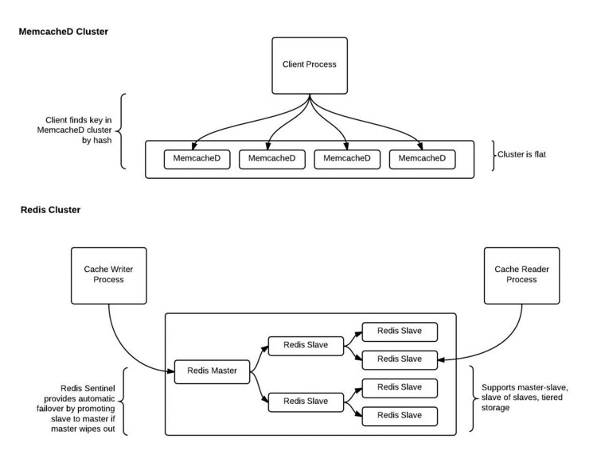

# Redis vs Memcached

- [Redis vs Memcached](#redis-vs-memcached)
  - [1 概览](#1-%E6%A6%82%E8%A7%88)
  - [2 什么是 Memcached](#2-%E4%BB%80%E4%B9%88%E6%98%AF-memcached)
  - [3 什么是 Redis](#3-%E4%BB%80%E4%B9%88%E6%98%AF-redis)
  - [4 Memcached 和 Redis 的相似点](#4-memcached-%E5%92%8C-redis-%E7%9A%84%E7%9B%B8%E4%BC%BC%E7%82%B9)
  - [5 Memcached 和 Redis 的不同](#5-memcached-%E5%92%8C-redis-%E7%9A%84%E4%B8%8D%E5%90%8C)
  - [6 选择 Memcached 还是 Redis](#6-%E9%80%89%E6%8B%A9-memcached-%E8%BF%98%E6%98%AF-redis)
    - [6.1 选择 Memcached](#61-%E9%80%89%E6%8B%A9-memcached)
    - [6.2 选择 Redis](#62-%E9%80%89%E6%8B%A9-redis)
    - [6.3 总结](#63-%E6%80%BB%E7%BB%93)
  - [7 参考](#7-%E5%8F%82%E8%80%83)

## 1 概览

- 关系型数据库是常见的数据库类型，但是不适合存储大量的数据。因此，引入了 NoSQL。它表示非关系型或非 SQL。Memcached 和 Redis 归类为 NoSQL
- Memcached 和 Redis 最大的区别在于
  - Memcached 是开源的，高性能，分布式内存缓存系统，可通过最小化数据加载代价而加速 web 应用
  - Redis 是开源的，key-value 存储，用于建设可扩展的 web 应用

## 2 什么是 Memcached

- Memcached 是开源的，高性能，分布式内存缓存系统。它是持久化数据存储
- Memcached 主要的优势在于它降低了数据库加载代价，因此对于大量数据库加载的网站是非常有效且快速的
- Memcached 有存储命令、检索命令、统计命令
  - 存储命令
    - set：为一个新的或已有的键设置新值
    - add：为一个新键设置值
    - replace：替换已有的键的值
    - append：为已有键增加一些数据
  - 检索命令
    - get：获取键中保存的值
    - delete：删除已有键

## 3 什么是 Redis

- Redis 是开源的，内存型数据结构存储，用作数据库、缓存和消息代理
- Redis 代表远程字典服务器(remote dictionary server)。以 key-value 格式存储数据
- 用户在 Redis 命令行界面(command line interfacem, CLI)，使用命令和数据库通信
  - SET：写数据到 Redis 数据存储
  - GET：从 Redis 数据存储读数据
- Redis 简单易用。它归类为 NoSQL 数据库。和像 MySQL，Oracle 的关系型数据库不同，Redis 不使用表存储数据
  - Redis 不使用常规的 SQL 命令，例如 select、delete、create、update 等
  - Redis 使用数据结构存储数据。主要的数据结构是 string，list，set，sorted set，hash，bitmap 等
- Redis 使用 C 语言编写，是开源的，跨平台的系统
- Redis 主要的优势在于它保存数据在内存中。这使得 Redis 非常快速。它也可以写数据到磁盘。Redis 可用作一个缓存系统或是全面的数据库
- Redis 另外一个优势是它可以和其他数据库一起使用。Redis 可以存储频繁访问的数据，而不访问主要的数据库，并且可以从主要的数据库获取其它的数据
- Redis 遵循 master-slave 架构。它提供性能、可扩展性且易用

## 4 Memcached 和 Redis 的相似点

- 都归类为 NoSQL
- 都以 key-value 格式存储数据：Redis 更准确的描述是作为数据结构存储
- 都将存储数据到内存(毫秒级延迟)
- 二者都是轻量级，和易失缓存一样快
  - Memcached 易失内存型的 key-value 存储
  - Redis 不限于此，是一个数据结构服务
- 易用性、支持多种编程语言(Java/Python/PHP/C/C++/C#/JavaScript/NodeJS/Ruby/Go)
- 支持数据分割：允许分布数据到多个节点，以便随着需求增长扩展数据处理能力

## 5 Memcached 和 Redis 的不同

| 不同点 | Memcached | Redis |
| --- | --- | --- |
| 描述 | 开源的，高性能，分布式内存缓存系统，可通过最小化数据加载代价而加速 web 应用 | 开源的，key-value 存储，可作为数据库、缓存和消息代理 |
| 易安装 | N | Y |
| 高级数据结构 | N(字符串和整型) | Y(string/list/set/sorted set/hash) |
| 多线程架构 | Y(充分利用多核) | N |
| 快照 | N | Y(时间快照存储数据到磁盘，用于归档或恢复) |
| 复制 | N | Y(支持 master-slave 复制) |
| 事务 | N | Y |
| pub/sub | N | Y |
| Lua 脚本 | N | Y |
| 地理空间支持 | N | Y(可查找两个元素之间的距离，或者查找给定范围的所有元素) |
| 速度 | 读写速度更快 | 读写速度快，但是取决于开发的应用 |

## 6 选择 Memcached 还是 Redis

### 6.1 选择 Memcached

- 当缓存相当小的静态数据，比如 HTML 代码段：Memcached 内部的内存管理系统在最简单的应用场景下是更加高效，因为只占用相当小的内存资源用于元数据
- 当数据大小动态变化，Memcached 的内存管理效率快速下降，有时内存会碎片化
  - 同时，大数据集经常牵涉到序列化数据，需要更多空间存储
  - 如果使用Memcached，当重启时数据会丢失，而且重建缓存代价很好
- Memcached 在伸缩性方面比 Redis 好： Memcached 是多线程，很方便增加计算资源；Redis 大多数是单线程，在不丢失数据的情况下只能通过集群水平增长
  - 集群是有效的扩展方案，但是在设置和操作方面很复杂
  - Memcached 不支持复制
- Memcached 在处理高流量网站方面更好：可以一次读大量信息，而且响应时间快。

### 6.2 选择 Redis

- Redis 支持更多数据类型，所以作为缓存可以提供更更好的性能和效率
- 数据回收(data eviction)：缓存使用数据回收机制，从内存删除旧数据为新数据分配空间
  - Memcached 使用 LRU(least recently used, 最近最少使用)算法，有时随机回收大小类似的数据
  - Redis 支持细粒度控制回收，提供 6 种不同的回收策
    - Redis 支持 lazy 和 active 的回收，即需要更多空间或主动地(proactively)
    - Memcached 值支持 lazy 回收
- Redis 作为数据结构的一些特性
  - 丰富的数据类型和使用命令
  - 默认持久化到磁盘
  - 锁事务(WATCH/MULTI/EXEC)
  - 发布订阅(pub/sub)非常快
  - 值可达 512MB(Memcached 限制每个键 1MB)
  - 支持 Lua 脚本(2.6 开始)
  - 内嵌集群(3.0 开始)
  - 在各方面非常快
- Redis 丰富的数据类型非常重要。它支持 Redis 提供共享队列(lists)，消息机制(pub/sub)，存储会话(hash)，高评分跟踪(sorted set)

### 6.3 总结

- Memcached 和 Redis 归类为 NoSQL。它们不使用结构化化查询语言(structed query language)来存储、检索和操作数据
- 不同点在于 Memcached 是开源、高性能分布式内存缓存系统，Redis 是开源、key-value 存储用于构建可扩展 web 应用
- 使用 Memcached 还是 Redis 取决于应用：需要高级数据结构时可使用 Redis；降低数据库加载代价，加速 web 应用可使用 Memcached

## 7 参考

- [Difference Between Memcached and Redis](https://www.differencebetween.com/difference-between-memcached-and-vs-redis/)
- [Memcached vs Redis, Which One to Pick](https://www.linkedin.com/pulse/memcached-vs-redis-which-one-pick-ranjeet-vimal/)
- [Choosing between Redis and Memcached](https://aws.amazon.com/elasticache/redis-vs-memcached/)
