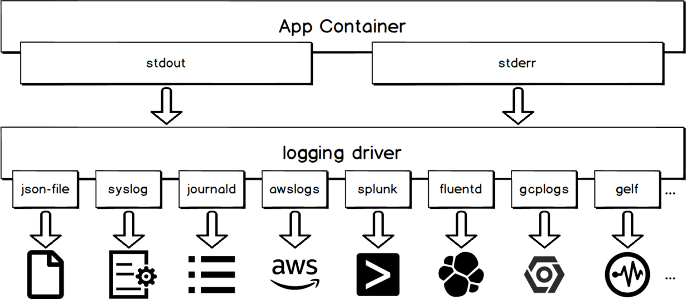
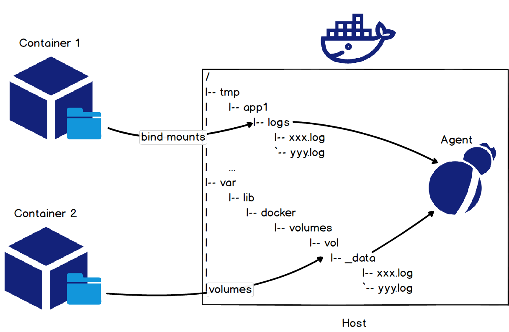

# 容器日志

- [容器日志](#容器日志)
  - [容器日志分类](#容器日志分类)
    - [标准输出](#标准输出)
      - [使用 logging driver](#使用-logging-driver)
      - [使用 docker logs API](#使用-docker-logs-api)
        - [docker logs 实现原理](#docker-logs-实现原理)
      - [采集 json-file 文件](#采集-json-file-文件)
    - [标准错误](#标准错误)
    - [文本日志](#文本日志)
      - [挂载宿主机目录](#挂载宿主机目录)
      - [计算容器 rootfs 挂载点](#计算容器-rootfs-挂载点)
  - [参考](#参考)

## 容器日志分类

| 分类 | 定义 |
| --- | --- |
| 标准输出 | 通过 STDOUT、STDERR 输出的信息，包括被重定向到标准输出的文本文件 |
| 文本日志 | 存在容器内部，且没有被重定向到标准输出的日志 |

### 标准输出

#### 使用 logging driver

容器的标准输出会由 [logging driver](https://docs.docker.com/config/containers/logging/configure/) 统一处理。不同的 logging driver 会将标准输出写到不同地方。



通过 logging driver 采集容器标准输出的示例：

```sh
# 在 docker daemon 级别为所有容器配置 syslog 日志驱动
docker --log-driver syslog --log-opt syslog-address=udp://xxxx
# 为当前容器配置 syslog 日志驱动
docker run --log-driver syslog --log-opt syslog-address=udp://xxxx alpine echo hello world
```

缺点：处理 json-file 和 journald，使用其他 logging driver 将使得 docker logs API 不可用。

#### 使用 docker logs API

对于使用默认 logging driver 的容器，可以通过向 docker daemon 发送 [docker logs](https://docs.docker.com/engine/reference/commandline/logs/) 命令获取容器的标准输出。使用此方式采集日志的工具包括 [logspout](https://github.com/gliderlabs/logspout)、[sematext-agent-docker](https://github.com/sematext/sematext-agent-docker) 等。

```sh
# 获取容器自 2018-01-01T15:00:00 以来最新的 5 条日志
docker logs --since "2018-01-01T15:00:00" --tail 5 <container-id>
```

缺点：当日志量较大时，会对 docker daemon 造成较大压力，导致 docker daemon 无法及时响应创建容器、销毁容器等命令。

##### docker logs 实现原理

关于 docker daemon：docker daemon 是 docker 架构中一个常驻在后台的系统进程。它在后台启动了一个 server，server 负责接收 docker client 发送的请求；接收请求后，server 通过路由与分发调度，找到相应的 handler 来执行请求。

在输入 docker logs 时，docker client 会向 docker daemon 发起请求，docker daemon 在运行容器时创建一个 goroutine，绑定了整个容器内所有进程的标准输出文件描述符。因此容器内应用的所有标准输出日志会被 goroutine 接收，docker daemon 根据容器 id 和 日志类型读取日志内容，并输出到用户终端且通过 json 格式保存在 `/var/lib/docker/containers/<container-id>/<container-id>-json.log`。

docker logs 是跟随容器产生的，删除容器之后，对应的日志文件也会删除。

#### 采集 json-file 文件

默认 logging driver 会将日志以 json 的格式写入宿主机，文件路径为 `/var/lib/docker/containers/<container-id>/<container-id>-json.log`。这样可以通过采集宿主机文件达到采集容器标准输出的目的。

推荐此方案，因为它既不会是的 docker logs API 不可用，又不会影响 docker daemon。现在有许多原生根据支持采集宿主机文件，如 [filebeat](https://www.elastic.co/beats/filebeat)、[logtail](https://help.aliyun.com/document_detail/66659.html) 等。

### 标准错误

### 文本日志

#### 挂载宿主机目录

采集容器内文本日志最简单的方法是在启动容器时通过 bind mounts 或 volumes 方式将宿主机目录挂载到容器日志所在目录。



收集 tomcat 的 access log 示例：

```sh
# 将宿主机目录 /tmp/app/vol1 挂载到 access log 在容器中的目录 /usr/local/tomcat/logs
docker run -it -v /tmp/app/vol1:/usr/local/tomcat/logs tomcat
# 通过采集宿主机目录 /tmp/app/vol1 达到采集 tomcat access log 的目的
```

#### 计算容器 rootfs 挂载点

使用挂载宿主机目录的方式采集日志会对应用有一定的侵入性，因为它要求容器启动时包含挂载目录。事实上可以通过计算容器 rootfs 挂载点实现采集过程对用户的透明化。

和容器 rootfs 挂载点密不可分的一个概念是 [storage driver](https://docs.docker.com/storage/storagedriver/)。实际使用时，用户往往根据 linux 版本、文件系统类型、容器读写情况等因素选择合适的 storage driver。不同 storage driver 下，容器的 rootfs 挂载点遵循一定规律。因此可以根据 storage driver 类型判断容器的 rootfs 挂载点，进而采集容器内部日志。

| storage driver | rootfs 挂载点 | 计算方法 |
| --- | --- | --- |
| aufs | `/var/lib/docker/aufs/mnt/<id>` | id 可从如下文件读取 `/var/lib/docker/image/aufs/layerdb/mounts/<container-id>/mount-id` |
| overlay | `/var/lib/docker/overlay/<id>/merged` | 完整路径可从如下命令获得 `docker inspect -f '{{.GraphDriver.Data.MergedDir}}' <container-id>` |
| overlay2 | `/var/lib/docker/overlay2/<id>/merged` | 完整路径可从如下命令获得 `docker inspect -f '{{.GraphDriver.Data.MergedDir}}' <container-id>` |
| devicemapper | `/var/lib/docker/devicemapper/mnt/<id>/rootfs` | id 可从可从如下命令获得 `docker inspect -f '{{.GraphDriver.Data.MergedDir}}' <container-id>` |

## 参考

- [面向容器日志的技术实践](https://segmentfault.com/a/1190000017090542?utm_source=sf-related)
