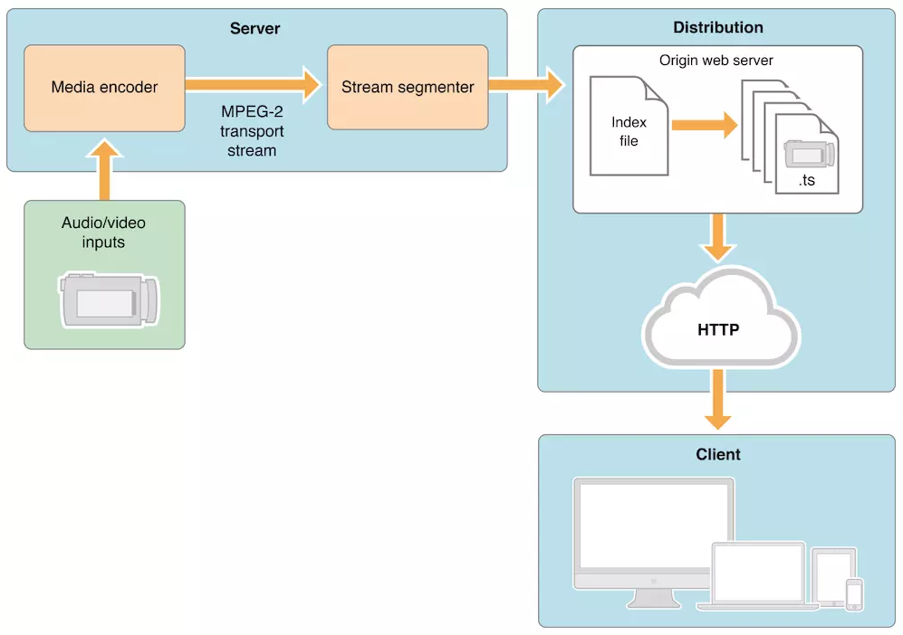
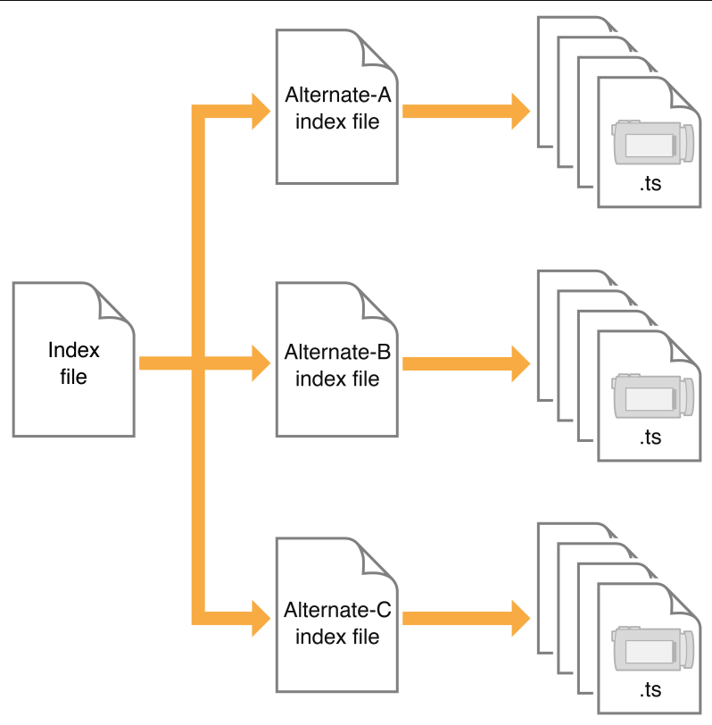

# HLS 学习

- [HLS 学习](#hls-%e5%ad%a6%e4%b9%a0)
  - [HLS 概述](#hls-%e6%a6%82%e8%bf%b0)
  - [一些概念](#%e4%b8%80%e4%ba%9b%e6%a6%82%e5%bf%b5)
    - [media playlist](#media-playlist)
    - [master playlist](#master-playlist)
  - [HLS 协议简介](#hls-%e5%8d%8f%e8%ae%ae%e7%ae%80%e4%bb%8b)
    - [输入视频或音频](#%e8%be%93%e5%85%a5%e8%a7%86%e9%a2%91%e6%88%96%e9%9f%b3%e9%a2%91)
    - [服务器组件](#%e6%9c%8d%e5%8a%a1%e5%99%a8%e7%bb%84%e4%bb%b6)
      - [文件切片器](#%e6%96%87%e4%bb%b6%e5%88%87%e7%89%87%e5%99%a8)
      - [媒体片段文件](#%e5%aa%92%e4%bd%93%e7%89%87%e6%ae%b5%e6%96%87%e4%bb%b6)
      - [索引文件(Playlists)](#%e7%b4%a2%e5%bc%95%e6%96%87%e4%bb%b6playlists)
    - [分布式组件](#%e5%88%86%e5%b8%83%e5%bc%8f%e7%bb%84%e4%bb%b6)
    - [客户端软件](#%e5%ae%a2%e6%88%b7%e7%ab%af%e8%bd%af%e4%bb%b6)
      - [会话模式](#%e4%bc%9a%e8%af%9d%e6%a8%a1%e5%bc%8f)
      - [内容加密](#%e5%86%85%e5%ae%b9%e5%8a%a0%e5%af%86)
      - [缓存和发送协议](#%e7%bc%93%e5%ad%98%e5%92%8c%e5%8f%91%e9%80%81%e5%8d%8f%e8%ae%ae)
      - [流切换](#%e6%b5%81%e5%88%87%e6%8d%a2)
  - [ffmpeg 加密命令行](#ffmpeg-%e5%8a%a0%e5%af%86%e5%91%bd%e4%bb%a4%e8%a1%8c)
  - [ffmpeg 源码解读](#ffmpeg-%e6%ba%90%e7%a0%81%e8%a7%a3%e8%af%bb)

## HLS 概述

- HLS(HTTP Live Streaming)是 Apple 的动态码率自适应技术，主要用于 PC 端和移动端的音视频服务。包括一个 m3u(8) 的索引文件、TS 媒体分片文件和 key 加密串文件
- HLS 是基于 HTTP 的流媒体网络传输协议。工作原理是把整个流分成一个个小的基于 HTTP 的文件来下载，每次只下载一些。当媒体流正在播放时，客户端可以选择从许多不同的备用源中以不同的速率下载同样的资源，允许流媒体会话适应不同的数据速率。在开始一个流媒体会话时，客户端会下载一个包含元数据的 extended M3U (m3u8)playlist 文件，用于寻找可用的媒体流
- HLS 只请求基本的 HTTP 报文，与实时传输协议(RTP)不同，HLS 可以穿过任何允许 HTTP 数据通过的防火墙或者代理服务器。它也很容易使用内容分发网络来传输媒体流

## 一些概念

- 一个多媒体演示通过一个 playlist 的 URL (uniform resource identifier， 统一资源标识符) 指定。
- 一个 playlist 是一个 media playlist  或 master playlist。二者都是 UTF-8 的文本文件，包含 URI 和描述性标记。

### media playlist

一个 media playlist 包含媒体片段的列表，当顺序播放时，会播放多媒体演示。

想要播放这个 playlist，客户端首先下载 playlist 文件，然后下载和播放 playlist 文件内声明的媒体片段。客户端重新加载 playlist 以查找新增加的片段。数据**应当**使用 HTTP 下载。但是，一个 URI 通常可以指定任何协议，能够可靠地传输需要的指定资源。

### master playlist

一个 master playlist 提供 variant stream 的集合，每个描述了相同内容的不同版本。

一个 variant stream 包含一个 media playlist，指定了以特定比特率、特定格式编码的媒体，包含视频的媒体包含特定的分辨率。

一个 variant stream 也可以指定一个 rendition 的集合。rendition 是内容的可选版本，比如不同语言的音频或不同摄像角度录制的视频。

客户端应该根据网络条件切换不同的 variant stream。客户端也应该根据用户偏好选择 rendition。

## HLS 协议简介

- HLS 协议规定
  - 视频的封装格式是 TS
  - 视频的编码格式为 H264，音频编码格式为 MP3、AAC 或者 AC-3
  - 除了 TS 视频文件本身，还定义了用来控制播放的 m3u8 文件(文本文件)
- HLS 方案如图

  

### 输入视频或音频

- 输入的音视频格式不限，与服务器的通信协议不限(如 RTMP)

### 服务器组件

- 媒体编码器：将输入的音视频编码成 HEVC 视频和 AC-3 音频，并且输出 MPEG-4(H.264 视频和 AAC 音频)文件碎片或 MPEG-2 传输流
- 流切片器(stream segmenter)：通过本地网络从上面的媒体编码器中读取数据，将 MPEG-2 传输流切片，分割成一组相等时间间隔的小媒体文件，保存为一个或多个系列的媒体文件和索引文件(m3u8)，放置在网络服务器上
  - 视频是 .ts 文件；纯音频会被编码为一些音频小片段，通常为 ADTS 头的 AAC、MP3、或者 AC-3 格式
  - 索引文件会包含这些切片文件的引用。每当一个切片文件生成后，索引文件都会进行更新。索引用于追踪切片文件的有效性和定位切片文件的位置
  - 切片器也可以同时对媒体片段进行加密并且创建一个密钥文件作为整个过程的一部分
  - 将索引文件的 URL 发布在网络服务器上。客户端软件读取索引，然后按序请求并展示列举的媒体文件，且媒体文件之间没有暂停或跳跃

#### 文件切片器

- 如果已经有编码后的文件(而不是编码流)，可以使用文件切片器，通过它对编码后的媒体文件进行 MPEG-2 流的封装并且将它们分割为等长度的小片段
- 文件切片器允许使用已经存在的音视频库用于 HLS 服务。它和流切片器的功能相似，但是处理的源从流替换为文件

#### 媒体片段文件

- HLS 发送音频和视频为一系列的小文件，通常是 6 秒时长的文件，称为媒体片段文件
- 媒体片段是由切片器生成的，基于编码后的媒体源，是由一系列的 .ts 格式的文件组成，包含了通过 MPEG-2 传送流携带的 H.264 视频 和 AAC/MP3/AC-3 音频
- 对于纯音频的广播，切片器可以产生 MPEG 基础音频流，其中包含了 ADTS 头的 AAC、MP3、或者 AC3 等音频

#### 索引文件(Playlists)

- 索引文件，或 playlist，提供媒体片段文件的 URL 的一个有序列表。HLS 的索引文件保存为 M3U8 playlist，是 MP3 playlist 使用的 M3U 的一个扩展
- 通常由切片器附带生成，保存为 .m3u8 格式，.m3u 一般用于 MP3 音频的索引文件
- 客户端访问索引文件的 URL，然后按序请求索引的文件
- **注意**：如果你的扩展名是 .m3u，并且系统支持 .mp3 文件，那客户的软件可能要与典型的 MP3 playList 保持一致来完成流网络音频的播放

### 分布式组件

- 分布式系统是一个网络服务或者一个网络缓存系统，通过 HTTP 向客户端发送媒体文件和索引文件
- 不用自定义服务模块发送内容。通常仅仅需要很简单的网络配置即可使用。而且这种配置一般就是限制指定 .m3u8 文件和 .ts 文件的 MIME 类型
- 实际部署 HLS，你需要为浏览器创建一个 HTML 页面或创建一个作为接收者的客户端应用。你也需要使用网络服务器以及一种方式，将实时流编码为 MPEG-4 媒体文件碎片(包含 HEVC 或 H264 视频，AAC或 AC-3 音频)

### 客户端软件

- 客户端软件负责选择请求合适的媒体、下载媒体资源，并组装媒体资源以便可以向用户连续的流
- 客户端开始会抓取索引文件(.m3u8/.m3u)，用 URL 来标记不同的流
  - 索引文件可以指定可用媒体文件的位置、解密的密钥，以及任何可以切换的流
- 对于选中的流，客户端会有序的下载每一个可获得的文件。每一个文件包含流的一个连续碎片。一旦下载到足够量的数据，客户端会开始向用户展示重新组装好的媒体资源
- 客户端负责抓取任何解密密钥、认证或者展示一个用于认证的用户界面，以及解密需要的文件
- 这个过程会一直持续直到索引文件出现标记 #EXT-X-ENDLIST。如果结束标记不出现，该索引就是持续广播的一部分。客户端会定期的加载一些新的索引文件。客户端会从新更新的索引文件中去查找新的媒体文件和密钥文件并且将关联的 URL 加入到请求队列

#### 会话模式

- 通常包含 Live broadcasts (直播)和 VOD (video on  demand, 点播)两种
  - 点播 VOD 的特点就是当前时间点可以获取到所有 index 文件和 ts 文件，二级 index 文件中记录了所有 ts 文件的地址。这种模式允许客户端访问全部内容目录。除非客户端进行比特率切换，否则无需再下载任何 index 文件，只需顺序下载 ts 文件并播放
  - Live 会话是实时生成 m3u8 和 ts 文件。它的索引文件一直处于动态变化，播放的时候需要不断下载二级 index 文件然后移除旧的索引文件，以获得最新生成的 ts 文件播放视频。如果一个二级 index 文件的末尾没有 #EXT-X-ENDLIST 标志，说明它是一个 Live 视频流
    - 这种类型通过向索引文件添加媒体地址可以很容易的转化为 VOD 类型。在转化时不要移除原来旧的源，而是通过添加一个 #ET-X-ENDLIST 标记来终止实时事件
    - 转化时如果索引文件中包含 EXT-X-PLAYLIST-TYPE 标签，需要将值从 EVENT 改为 VOD

#### 内容加密

- 如果内容需要加密，可以在索引文件中找到密钥的相关信息。如果索引文件中包含了一个密钥文件的信息，那接下来的媒体文件就必须使用密钥解密后才能解密打开
- 当前的 HLS 支持使用 16-octet 类型密钥的 AES-128 加密。这个密钥格式是一个用二进制格式中的 16 个八进制组的数组打包而成
- 加密的配置模式通常包含三种
  - 模式一：允许在磁盘上制定一个密钥文件路径，切片器会在索引文件中插入存在的密钥文件的 URL。所有的媒体文件都使用该密钥进行加密
  - 模式二：切片器会生成一个随机密钥文件，将它保存在指定的路径，并在索引文件中引用它。所有的媒体文件都会使用这个随机密钥进行加密
  - 模式三：每 n 个片段生成一个随机密钥文件，并保存到指定的位置，在索引中引用它。这个模式的密钥处于轮流加密状态。每一组 n 个片段文件会使用不同的密钥加密
- 理论上，不定期的碎片个数生成密钥会更安全，但是定期的生成密钥不会对系统的性能产生太大的影响
- 可以通过 HTTP 或者 HTTPS 提供密钥。也可以选择使用基于会话的认证安排去保护发送的 key
- 密钥文件需要一个 initialization vector (IV) 去解码加密的媒体文件。IV 可以随着密钥定期的改变

#### 缓存和发送协议

- HTTPS 通常用于发送密钥，同时也可以用于平时的媒体片段和索引文件的传输
- 当扩展性更重要时，这样做是不推荐的：HTTPS 请求通常都是绕开网络服务缓存，导致所有内容请求都是通过服务进行转发，这有悖于分布式网络连接系统的目的
- 当处于实况广播模式时索引文件不会像分片媒体文件一样长时间的被缓存，而是动态不停地变化

#### 流切换

- 如果视频具备流切换功能，这对于用户来说是一个非常棒的体验，处于不同的带宽、不同的网速播放不同清晰度的视频流，这样智能的流切换可以保证用户感觉到非常流畅的观影体验，同时不同的设备也可以作为选择的条件，比如视网膜屏可以再网速良好的情况下播放清晰度更高的视频流
- 这种功能的实现在于，索引文件的特殊结构

  

- 具备流热切换的索引通常由主索引和链接不同带宽速率的资源的子索引，由子索引再链接对应得到 .ts 视频切片文件
- 客户端播放 HLS 视频流的逻辑：先下载一级 Index file，它里面记录了二级索引文件(Alternate-A、Alternate-B、Alternate-C)的地址，然后客户端再去下载二级索引文件，二级索引文件中又记录了 ts 文件的下载地址，这样客户端就可以按顺序下载 ts 视频文件并连续播放
  - 主索引文件和子索引文件都是 .m3u8 的 playlist
  - 主索引文件只需下载一次，但对于直播节目子索引文件定期重新加载
  - 通常会先使用主索引中列出的第一个子索引，之后才会根据当时的网络情况去动态切换合适的流
  - 客户端可能会在任何时候改变到备用流，所有的切换都应该使用相同的音频文件

## ffmpeg 加密命令行

- `ffmpeg -i input.mp4 -c copy -bsf:v h264_mp4toannexb -hls_time 10 -hls_key_info_file key_info playlist.m3u8`
  - `hls_time seconds`: 设置目标分片的长度，单位秒。默认值是 2
  - `hls_key_info_file key_info_file`: 使用 `key_info_file` 信息用于加密
    - `key_info_file` 文件格式如下：一共三行
      - `key URI`: 指定写入播放列表的 `key URI`。它在回放时用于访问加密密钥
      - `key file path`: 指定加密过程获得密钥的文件路径。该密钥文件以二进制格式读取，长度为 16 个八进制字符数组
      - `IV`: 可选行。指定初始向量(initialization vector, IV)作为十六进制的字符串使用，加密时默认使用分片序列号

      ```txt
      key URI
      key file path
      IV (optional)
      ```

    - `key_info_file` 实例

      ```txt
      http://server/file.key
      /path/to/file.key
      0123456789ABCDEF0123456789ABCDEF
      ```

```shell
#!/bin/sh
BASE_URL=${1:-'.'}
openssl rand 16 > file.key
echo $BASE_URL/file.key > file.keyinfo
echo file.key >> file.keyinfo
echo $(openssl rand -hex 16) >> file.keyinfo
ffmpeg -f lavfi -re -i testsrc -c:v h264 -hls_flags delete_segments -hls_key_info_file file.keyinfo out.m3u8
```

## ffmpeg 源码解读

- 文件 `libavformat/hls.c`
