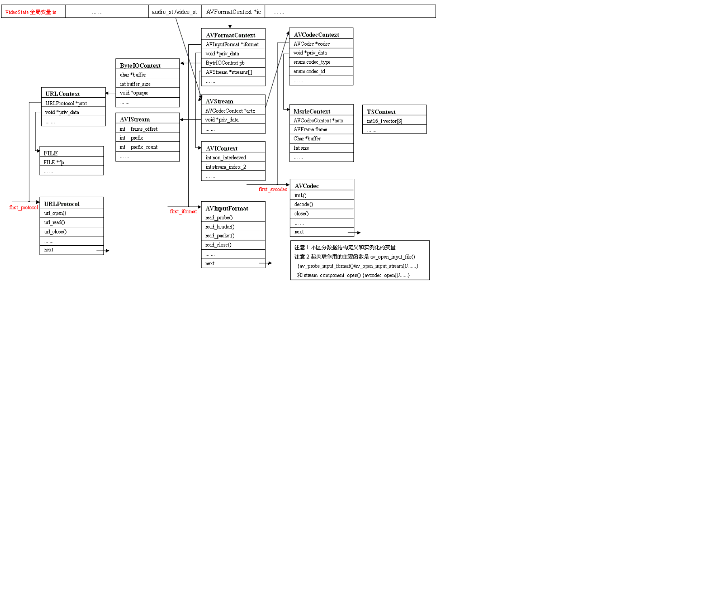

# FFMPEG/FFPLAY 源码剖析

- [FFMPEG/FFPLAY 源码剖析](#ffmpegffplay-%e6%ba%90%e7%a0%81%e5%89%96%e6%9e%90)
  - [概述](#%e6%a6%82%e8%bf%b0)
    - [播放器一般原理](#%e6%92%ad%e6%94%be%e5%99%a8%e4%b8%80%e8%88%ac%e5%8e%9f%e7%90%86)
    - [ffplay 播放器原理](#ffplay-%e6%92%ad%e6%94%be%e5%99%a8%e5%8e%9f%e7%90%86)
    - [ffmpeg 源码框架](#ffmpeg-%e6%ba%90%e7%a0%81%e6%a1%86%e6%9e%b6)
    - [ffplay 架构](#ffplay-%e6%9e%b6%e6%9e%84)
      - [URLProtocol/URLContext/AVIOContext 结构](#urlprotocolurlcontextaviocontext-%e7%bb%93%e6%9e%84)
      - [AVInputFormat/AVFormatContext 结构](#avinputformatavformatcontext-%e7%bb%93%e6%9e%84)
      - [AVCodec/AVCodecContext/AVCodecParameters 结构](#avcodecavcodeccontextavcodecparameters-%e7%bb%93%e6%9e%84)
      - [AVStream](#avstream)
      - [AVPacket/MyAVPacketList/PacketQueue](#avpacketmyavpacketlistpacketqueue)
      - [VideoState](#videostate)

## 概述

### 播放器一般原理

Windows DirectShow

- 媒体文件基本模块：读文件、解复用、视频解码、音频解码、颜色空间转换、视频显示、音频播放
- 模块：过滤器 filter。
  - 输入输出：pin，管脚。input pin 和 output pin
  - source filter 和 sink filter
  - filter 组成 graph。媒体文件的数据流在 graph 中流动

### ffplay 播放器原理

- source filter：读文件模块。底层 file/pipe/tcp/udp协议；中层 URLContext；上层 AVIOContext，加了缓冲机制
- demux filter：解复用模块。底层 AVIContext/TCPContext/UDPContext；上层 AVInputFormat 和 AVFormatContext。
  通过 AVInputFormat 的 priv_data 字段关联 AVIContext/TCPContext/UDPContext 具体的文件格式。
  AVInputFormat 和具体的音视频编码算法格式由 AVInputFormat 的 streams 字段关联媒体格式。streams 相当于 demux filter 的 output pin，解复用模块分离音视频裸数据，通过 streams 传递给下级音视频解码器。
- decoder filter：解码模块。底层是 TSContext/MsrleContext；上层是 AVCodec 对应的 AVCodecContext。
  AVCodecContext 的 priv_data 关联 TSContext/MsrleContext 具体编解码器上下文。
- color space converter filter：颜色空间转换模块。
- render filter：渲染模块。ffplay 的渲染模块使用 SDL 库
- ffplay.c：声明并实例化其他数据结构/模块，并把其他数据结构/模块串联起来，最后把其他数据结构/模块关联到 VideoState 数据结构，同时控制程序的启动暂停停止等

### ffmpeg 源码框架

```txt
libavcodec    提供了一系列编解码器的实现
libavdevice   提供了访问捕获设备和回放设备的接口
libavfilter   提供了各种音视频过滤器
libavformat   实现了流协议、容器格式及基本 IO 访问
libavutil     包括工具类函数、内存操作
libswresample 实现了混音和重采样
libswscale    实现了色彩转换和缩放功能
```

libavcodec 存放 ffmpeg 支持的各种编解码器的实现、ffmpeg 编解码功能相关的数据结构定义、函数定义和声明。

```text
allcodecs.c
  简单的注册类函数(所有 codec、parser 和 比特流 filter)
avcodec.h
  编解码相关数据结构定义和函数原型声明
imgconvert.c
  颜色空间转换
utils.h
  解码相关的工具类函数的实现
mpeg4audio.h(c)
  mpeg4 音频编解码器
mpeg4data.h
  mpeg4 表
mpeg4video.h(c)
  mpeg4 视频编解码器
mpeg4videodec.c/mpeg4videoenc.c
  mpeg4 视频解码器/编码器
```

libavformat 存放 ffmpeg 支持的各种媒体格式、复用器和解复用器、数据流协议、数据 IO：基于文件格式 format 和文件传输协议 protocol，与具体编解码器无关

```text
allformats.c
  简单的注册类函数
avformat.h
  文件和媒体格式相关数据结构定义和函数原型声明
avio.h
  有缓冲的 IO 操作
utils.c
  文件和媒体格式相关的工具函数的实现
file.c
  标准的文件协议
avi.h/avidec.c/avienc.c
  AVI 格式解码器/编码器
```

libavutil 存放 ffmpeg 工具类函数、内存操作

```text
avutil.h
  媒体类型和图片类型枚举定义、简单的函数实现
bswap.h
  字节交换实现、大小端转换
common.h
  公共宏和简单函数的实现
mathmatics.c
  时间和时间基准的工具函数
rational.h
  分数相关的操作
```

ffmpeg 数据 IO 流程：输入协议(file/http/udp/rtp) >> 读 >> 输入格式(flv/mp3/mpeg/avi) >> 转码 >> 输出格式(flv/mp3/mpeg/avi) >> 写 >> 输出协议(file/http/udp/rtp)

- 读入协议数据流，根据协议获得真正的文件数据(去除无关报文信息)
- 根据探测的格式对数据解封装
- 读帧进行转码操作
- 按目标格式进行封装
- 按目标协议发出

### ffplay 架构



ffplay 把多种类类型的广义数据结的共同部分抽象成 context 结构，那么广义数据的各个特征不同部分就抽象成各种具体类型的 context，然后用 priv_data 字段表叔的指针排他性的关联起来。

#### URLProtocol/URLContext/AVIOContext 结构

URLProtocol/URLContext/File(Socket)：读取文件相关的数据结构，相当于 DirectShow 的文件源 file source filter。

URLProtocol 表示广义的输入文件。一种广义的输入文件对应一个 URLProtocol 结构，比如 file/pipe/tcp 等。

URLProtocol 初始化为链表，保存所有支持的输入文件协议。新添加的协议对象添加至链表末尾。

```c
typedef struct URLProtocol {
  const char *name;
  int   (*url_open)( URLContext *h, const char *url, int flags);
  int   (*url_open2)(URLContext *h, const char *url, int flags, AVDictionary **options);// 打开嵌套的协议
  int   (*url_accept)(URLContext *s, URLContext **c);
  int   (*url_handshake)(URLContext *c);

  int   (*url_read)( URLContext *h, unsigned char *buf, int size);// 从协议读数据
  int   (*url_write)(URLContext *h, const unsigned char *buf, int size);
  int64_t (*url_seek)( URLContext *h, int64_t pos, int whence);
  int   (*url_close)(URLContext *h);
  int (*url_read_pause)(URLContext *h, int pause);
  int64_t (*url_read_seek)(URLContext *h, int stream_index,
               int64_t timestamp, int flags);
  int (*url_get_file_handle)(URLContext *h);
  int (*url_get_multi_file_handle)(URLContext *h, int **handles,
                   int *numhandles);
  int (*url_get_short_seek)(URLContext *h);

  int priv_data_size;

  int (*url_check)(URLContext *h, int mask);
  int (*url_open_dir)(URLContext *h);
  int (*url_read_dir)(URLContext *h, AVIODirEntry **next);
  int (*url_close_dir)(URLContext *h);
  int (*url_delete)(URLContext *h);
  int (*url_move)(URLContext *h_src, URLContext *h_dst);
} URLProtocol;
```

URLContext 表示程序运行的当前广义输入文件使用的上下文，着重于所有广义输入文件共有的属性(并且是在程序运行时才能确定其值)和关联其他结构的字段。

URLContext 提供与当前打开的具体文件协议相关数据的描述，即在 URLProtocol 链表中找到具体项的依据，以及其他的标志性信息。

```c
typedef struct URLContext {
  const struct URLProtocol *prot;// 关联广义输入文件
  void *priv_data;// 管理具体广义输入文件的句柄 fd，网络通信 socket 等
  char *filename;// 指定的 URL
  int flags;
  int max_packet_size;// 如果非 0，表示流被封包的最大 size
  int is_streamed;// true 表示流(不支持 seek)，默认为 false
  int is_connected;
  int64_t rw_timeout;// 等待(网络)读写操作完成的最大时间，以 mcs 为单位
  int min_packet_size;// 如果非 0，表示流被封包的最小 size
} URLContext;
```

AVIOContext 是字节流 IO 上下文，扩展 URLProtocol 结构成内部有缓冲机制的广义文件，改善广义输入文件的 IO 性能。

```c
typedef struct AVIOContext {
  unsigned char *buffer;// 缓冲的起始位置
  int buffer_size;// 缓冲最大 size
  unsigned char *buf_ptr;// 缓冲的当前位置
  unsigned char *buf_end;// 数据结束。可能会小于 buffer+buffer_size
  void *opaque;// 关联 URLContext。间接关联并扩展 URLProtocol 结构。私有指针，传递给 read/write/seek 等函数

  int (*read_packet)(void *opaque, uint8_t *buf, int buf_size);
  int (*write_packet)(void *opaque, uint8_t *buf, int buf_size);
  int64_t (*seek)(void *opaque, int64_t offset, int whence);

  int64_t pos;// 在当前缓冲的文件的位置
  int eof_reached;// 如果到达 eof 为 true
  int write_flag;// 如果写打开则为 true
  int max_packet_size;
  unsigned long checksum;
  unsigned char *checksum_ptr;
  unsigned long (*update_checksum)(unsigned long checksum, const uint8_t *buf, unsigned int size);
  int error;// 没有错误 为 0，否则表示错误码

  int (*read_pause)(void *opaque, int pause);
  int64_t (*read_seek)(void *opaque, int stream_index,
             int64_t timestamp, int flags);

  int seekable;// 不能 seek 为0；否则表示 AVIO_SEEKABLE_xxx
  int64_t maxsize;// 最大文件大小，用于限制分配。只可 libavformat 内部使用

  unsigned char *buf_ptr_max;// 写缓存中向后 seek 之前最大可到达的位置。用于跟踪已经写的数据，之后 flush 操作使用
  int min_packet_size;// 在 flush 之前，尝试缓冲的最小数据
} AVIOContext;
```

#### AVInputFormat/AVFormatContext 结构

AVInputFormat/AVFormatContext/AVIContext：识别文件容器相关的数据结构，相当于 DirectShow 的各种解复用

AVInputFormat 标识输入文件容器格式。一个文件容器格式对应一个 AVInputFormat 结构，在程序运行时有多个实例。

如果定义了扩展，不再执行 probe 操作。尽量不要使用扩展格式猜测，因为这样没有足够的可靠性。

解复用器和复用器分别在 AVInputFormat 和 AVOutputFormat 结构体中实现。

```c
typedef struct AVInputFormat {
  const char *name;// 逗号分隔的格式短名字列表。
  const char *extensions;// 文件扩展名。

  struct AVInputFormat *next;// 把所有支持的输入文件容器格式连接成链表，便于遍历查找

  int priv_data_size;// 标识具体文件容器格式对应的 context 大小，比如 AVIContext。编译时静态确定值。以便 wrapper 中分配。

  int (*read_probe)(AVProbeData *);
  int (*read_header)(struct AVFormatContext *);
  int (*read_packet)(struct AVFormatContext *, AVPacket *pkt);
  int (*read_close)(struct AVFormatContext *);
  int (*read_seek)(struct AVFormatContext *,
           int stream_index, int64_t timestamp, int flags);
} AVInputFormat;
```

AVFormatContext 是格式 IO 上下文，表示程序运行的当前文件容器格式使用的上下文。着重于所有文件容器共有的属性(且在程序运行时才能确定其值)和关联其他结构的字段。

```c
typedef struct AVFormatContext {
  struct AVInputFormat *iformat;// 关联对应的输入容器格式及其独有的属性上下文，demux 使用，和 priv_data_size 配合使用
  struct AVOutputFormat *oformat;// 输出容器格式，mux 使用，和 priv_data_size 配合使用
  void *priv_data;// 指向当前具体文件容器格式的上下文 context。存储格式的私有数据。如 AVIContext，和 priv_data_size 配合使用

  AVIOContext *pb;// 关联广义的输入文件
  unsigned int nb_streams;// AVFormatContext.streams 中元素数目
  AVStream **streams;// 关联文件的所有音视频流列表

  char *url;// 输入或输出的 URL。没有长度限制。弃用 char filename[1024]

  const uint8_t *key;
  int keylen;

  enum AVCodecID video_codec_id;// 指定 codec_id
  enum AVCodecID audio_codec_id;
  enum AVCodecID subtitle_codec_id;
  enum AVCodecID data_codec_id;

  char *codec_whitelist;// 支持的 decoder，逗号分隔，为 NULL 表示都支持
  char *format_whitelist;// 支持的 demuxer，逗号分隔，为 NULL 表示都支持

  AVCodec *video_codec;// 指定解码器。即使有多个解码器和 codec_id 相同
  AVCodec *audio_codec;
  AVCodec *subtitle_codec;
  AVCodec *data_codec;

  char *protocol_whitelist;// 支持的 protocol，逗号分隔

  int (*io_open)(struct AVFormatContext *s, AVIOContext **pb, const char *url,
           int flags, AVDictionary **options);// 打开新 IO 流的回调函数，得到 AVIOContext
  void (*io_close)(struct AVFormatContext *s, AVIOContext *pb);
} AVFormatContext;
```

AVIContext 定义 AVI 流的一些属性。

```c
typedef struct AVIContext {
  const AVClass *class;
  int64_t riff_end;
  int64_t movi_end;
  int64_t fsize;
  int64_t io_fsize;
  int64_t movi_list;
  int64_t last_pkt_pos;
  int index_loaded;
  int is_odml;
  int non_interleaved;
  int stream_index;// 当前应读取流的索引
  DVDemuxContext *dv_demux;
  int odml_depth;
  int use_odml;
#define MAX_ODML_DEPTH 1000
  int64_t dts_max;
} AVIContext;
```

#### AVCodec/AVCodecContext/AVCodecParameters 结构

AVCodec/AVCodecContext/AVCodecParameters/MsrleContext：编解码相关的数据结构

AVCodec 表示音视频编解码器。一种媒体类型对应一个 AVCodec 结构，在程序运行时有多个实例。

```c
typedef struct AVCodec {
  const char *name;// 编解码器名字：msrle/truespeech 等。在 decoder 和 encoder 分别全局唯一。
  enum AVMediaType type;// 编解码器媒体类型：video/audio/data/subtitle/attachment/nb 等
  enum AVCodecID id;// 编解码器 ID：确定唯一编解码器。AV_CODEC_ID_MPEG4/AV_CODEC_ID_H264 等
  int capabilities;// 编解码器能力

  const char *wrapper_name;// 编解码器的组名。一个 wrapper 使用一些外部实现，比如一个外部库或者 OS 或硬件提供的编解码实现

  int priv_data_size;// 对应的具体编解码器大小，比如 MsrleContext/TSContext。编译时静态确认
  struct AVCodec *next;// 把所有支持的编解码器连接成链表，便于遍历查找

  void (*init_static_data)(struct AVCodec *codec);// 初始化编解码器静态数据
  int (*init)(AVCodecContext *);
  int (*encode_sub)(AVCodecContext *, uint8_t *buf, int buf_size,
            const struct AVSubtitle *sub);
  int (*encode2)(AVCodecContext *avctx, AVPacket *avpkt, const AVFrame *frame,
           int *got_packet_ptr);// 编码 AVFrame 数据到一个 AVPacket
  int (*decode)(AVCodecContext *, void *outdata, int *outdata_size, AVPacket *avpkt);
  int (*close)(AVCodecContext *);

  int (*send_frame)(AVCodecContext *avctx, const AVFrame *frame);// 包/帧解耦时的 API，用于编码一帧数据
  int (*receive_frame)(AVCodecContext *avctx, AVFrame *frame);// 包/帧解耦时的 API，用于解码得到一帧数据。应使用 ff_decode_get_packet 获取输入数据
  void (*flush)(AVCodecContext *); // 刷新缓冲。在 seek 时调用
} AVCodec;
```

AVCodecContext 表示程序运行的当前 codec 使用的上下文，着重于所有 codec 共有的属性(且在程序运行时才能确定其值)和关联其他结构的字段。

```c
typedef struct AVCodecContext {
  enum AVMediaType codec_type;// 查看 AVMEDIA_TYPE_xxx
  const struct AVCodec  *codec;// 指向当前 AVCodec 的指针
  enum AVCodecID   codec_id;// 查看 AV_CODEC_ID_xxx
  void *priv_data;// 指向当前具体编解码器的上下文。与 AVCodec 的 priv_data_size 配对使用

  struct AVCodecInternal *internal;// 用于内部数据的私有上下文。和 priv_data 不同，internal 不依赖于编解码器。在一些通用的 libavcodec 函数中使用
  void *opaque;// 用户的私有数据，可用于携带应用相关的内容

  int64_t bit_rate;// 平均比特率
  int compression_level;

  uint8_t *extradata;// 一些编解码器需要/可以使用额外的数据(比如 MJPEG 使用 霍夫曼表)
  int extradata_size;
  int delay;

  AVRational time_base;
  int ticks_per_frame;

  int width, height;// 只针对视频
  enum AVPixelFormat pix_fmt;

  int sample_rate;// 只针对音频。每秒的采样数
  int channels;// 音频的通道数
  enum AVSampleFormat sample_fmt;// 音频采样格式
  int frame_size;// 一个音频帧中每个通道的采样数
  int frame_number;
  int block_align;

  int (*get_buffer2)(struct AVCodecContext *s, AVFrame *frame, int flags);
} AVCodecContext;
```

AVCodecParameters 描述一个编码流的属性。

```c
typedef struct AVCodecParameters {
  enum AVMediaType codec_type;// 编码数据的一般类型。查看 AVMEDIA_TYPE_xxx
  enum AVCodecID   codec_id;// 查看 AV_CODEC_ID_xxx

  uint32_t     codec_tag;// 编解码器的额外信息

  uint8_t *extradata;// 初始化解码器所需的额外的二进制数据，取决于编码器
  int    extradata_size;// extradata 的字节大小

  int format;// 视频是像素格式，对应 enum AVPixelFormat；音频是采样格式，对应 enum AVSampleFormat
  int64_t bit_rate;// 编码数据的平均比特率(每秒的比特数)
  int bits_per_coded_sample;
  int bits_per_raw_sample;

  int profile;// 流遵循的编解码器相关的比特流限制
  int level;

  int width;// 只针对视频。视频帧的像素纬度
  int height;
  AVRational sample_aspect_ratio;
  enum AVFieldOrder          field_order;

  enum AVColorRange          color_range;// 只针对视频。其他颜色空间特性
  enum AVColorPrimaries        color_primaries;
  enum AVColorTransferCharacteristic color_trc;
  enum AVColorSpace          color_space;
  enum AVChromaLocation        chroma_location;

  int video_delay;// 只针对视频。延迟帧的数目

  uint64_t channel_layout;// 只针对音频。通道格式的位掩码。未知或未指定时为 0，否则设置的比特位数必须等于通道数
  int    channels;// 只针对音频。音频的通道数
  int    sample_rate;// 只针对音频。每秒的采样数
  int    block_align;
  int    frame_size;
  int initial_padding;
  int trailing_padding;
  int seek_preroll;// 只针对音频。不连续之后跳过的采样数
} AVCodecParameters;
```

MsrleContext 着重于 RLE 行程长度压缩算法独有的属性值和关联 AVCodecContext 的 avctx 字段。

MS RLF 解码器输出 PAL8 颜色空间数据。

```c
typedef struct MsrleContext {
  AVCodecContext *avctx;
  AVFrame *frame;

  GetByteContext gb;
  const unsigned char *buf;
  int size;

  uint32_t pal[256];
} MsrleContext;
```

#### AVStream

AVStream/AVIStream：解析媒体流相关的数据结构。主要用于读取媒体流数据，相当于 DirectShow 中解复用 demux 内部的流解析逻辑。**注意**此结构关联 AVCodecContext 结构，经此结构可跳转到其他结构。

AVStream：表示当前媒体流的上下文，着重于所有媒体流共有的属性(且是程序运行时才能确定其值)和关联其他结构的字段。

```c
typedef struct AVStream {
  int index;// AVFormatContext.streams 的索引下标
  int id;// 格式相关的 stream ID
  void *priv_data;// 管理解析各个具体媒体流的独有属性。AVIStream 等

  AVRational time_base;// 时钟信息
  int64_t start_time;
  int64_t duration;
  int64_t nb_frames;// 未知设为 0，否则表示流的帧数
  AVRational avg_frame_rate;

  AVPacketSideData *side_data;// 辅助数据数组，应用于整个流。这个数组的辅助数据和包的辅助数据不会重叠
  int      nb_side_data;// AVStream.side_data 数组的元素数目

  AVCodecParameters *codecpar;// 与流相关的编解码器参数。弃用 AVCodecContext *codec

  struct {
    int64_t last_dts;
    int64_t duration_gcd;
    int duration_count;
    int64_t rfps_duration_sum;
    double (*duration_error)[2][MAX_STD_TIMEBASES];
    int64_t codec_info_duration;
    int64_t codec_info_duration_fields;
    int frame_delay_evidence;

    int found_decoder;// 0 未搜索；>0 已经找到；<0 未找到 codec_id == -found_decoder

    int64_t last_duration;

    int64_t fps_first_dts;// 用于估算平均帧率
    int   fps_first_dts_idx;
    int64_t fps_last_dts;
    int   fps_last_dts_idx;
  } *info;// avformat_find_stream_info 内部使用的流信息

  int64_t first_dts;// 上一个 dts 同步点的时间戳
  int64_t cur_dts;
  int64_t last_IP_pts;
  int last_IP_duration;

  int probe_packets;// 编解码器 probe 时要缓存的包数
  int codec_info_nb_frames;// avformat_find_stream_info 期间解复用的帧数

  enum AVStreamParseType need_parsing;// 支持 av_read_frame
  struct AVCodecParserContext *parser;

  struct AVPacketList *last_in_packet_buffer;// 复用时流的包缓冲中最后一个包
  AVProbeData probe_data;
#define MAX_REORDER_DELAY 16
  int64_t pts_buffer[MAX_REORDER_DELAY+1];

  AVIndexEntry *index_entries;// 只有在格式不能原生支持 seek 时使用。媒体索引帧
  int nb_index_entries;
  unsigned int index_entries_allocated_size;

  int stream_identifier;// +1 表示 MPEG-TS 流；0 表示未知
  int program_num;// 创建此流的 MPEG-TS program 的细节
  int pmt_version;
  int pmt_stream_idx;

  int nb_decoded_frames;// 内部解码的帧数，libavformat 内部使用

  int64_t mux_ts_offset;// 复用之前需要增加的时间偏移量
} AVStream;
```

AVIStream 定义 AVI 文件中媒体流的一些属性，用于解析 AVI 文件。

```c
typedef struct AVIStream {
  int64_t frame_offset;// 当前的帧(视频)或字节(音频)计数器(用于计算 pts)
  int remaining;
  int packet_size;

  uint32_t handler;
  uint32_t scale;
  uint32_t rate;
  int sample_size;// 一个采样(或包)的字节大小(=rate/scale)

  int64_t cum_len;// 暂时的存储(seek 中使用)
  int prefix;// 通常是 'd'<<8 + 'c' 或 'w'<<8 + 'b'
  int prefix_count;
  uint32_t pal[256];
  int has_pal;
  int dshow_block_align;  /* block align variable used to emulate bugs in
               * the MS dshow demuxer */

  AVFormatContext *sub_ctx;
  AVPacket sub_pkt;
  uint8_t *sub_buffer;

  int64_t seek_pos;
} AVIStream;
```

#### AVPacket/MyAVPacketList/PacketQueue

AVPacket/MyAVPacketList/PacketQueue：解复用模块输出的音视频压缩数据流队列。相当于 DirectShow 中 demux 的 output pin，传递数据到解码器

AVPacket 表示音视频数据帧，存储压缩数据。通常是 demuxer 导出传递给 decoder 作为输入，或者作为 encoder 的输出传递给 muxer。对于视频，通常应该包含一个压缩帧；音频可以包含多个压缩帧。解码器可以输出空包，不包含压缩数据，只包含一些辅助数据(比如在解码最后更新一些流参数)。

数据所有权语义依赖于 buf 域。如果设置了 buf，包数据动态分配，且一直有效直到调用 av_packet_unref 减小引用计数到 0；如果未设置 buf，av_packet_ref 会拷贝而不是增加引用计数。

辅助数据 (side data) 总是使用 av_malloc 分配，使用 av_packet_ref 拷贝，使用 av_packet_unref 释放。

```c
typedef struct AVPacket {
  AVBufferRef *buf;// 引用存储包数据的引用计数的缓冲。当包数据没有引用计数时为 NULL
  int64_t pts;// 显示时间戳，以 AVStream->timebase 为单位，表示解压缩包展示给用户的时间。必须大于等于 dts
  int64_t dts;// 解码时间戳，以 AVStream->timebase 为单位，表示解压缩包的时间。
  uint8_t *data;// 压缩编码的数据的首地址
  int   size;// data 的大小
  int   stream_index;// 标识该 AVPacket 所属的视频/音频流
  int   flags;

  AVPacketSideData *side_data;// 容器提供的其他包数据。包可以包含多种类型的辅助信息。
  int side_data_elems;

  int64_t duration;// 时长，以 AVStream->timebase 为单位，未知时为 0，等于 next_pts - this_pts

  int64_t pos;// 流中的字节未知。未知时为 -1
} AVPacket;
```

MyAVPacketList 是把音视频 AVPacket 组成一个小链表。

PacketQueue 通过小链表 MyAVPacketList 把音视频帧 AVPacket 组成一个顺序队列，是数据交换中转站，还有同步互斥控制逻辑。

```c
# ffplay.c
typedef struct MyAVPacketList {
  AVPacket pkt;
  struct MyAVPacketList *next;
  int serial;
} MyAVPacketList;
typedef struct PacketQueue {
  MyAVPacketList *first_pkt, *last_pkt;
  int nb_packets;
  int size;
  int64_t duration;
  int abort_request;
  int serial;
  SDL_mutex *mutex;
  SDL_cond *cond;
} PacketQueue;
```

#### VideoState

VideoState 把主要的数据结构整合在一起，声明成全局变量，起一个中转的作用，便于在各个子结构之间跳转。

```c
typedef struct Frame {
  AVFrame *frame;
  AVSubtitle sub;
  int serial;
  double pts;// 帧的显示时间
  double duration;// 帧的估计时长
  int64_t pos;// 帧在输入文件中的字节位置
  int width;
  int height;
  int format;
  AVRational sar;
  int uploaded;
  int flip_v;
} Frame;

typedef struct FrameQueue {
  Frame queue[FRAME_QUEUE_SIZE];
  int rindex;
  int windex;
  int size;
  int max_size;
  int keep_last;
  int rindex_shown;
  SDL_mutex *mutex;// 线程同步互斥变量
  SDL_cond *cond;
  PacketQueue *pktq;
} FrameQueue;

typedef struct Decoder {
  AVPacket pkt;
  PacketQueue *queue;
  AVCodecContext *avctx;// 编解码器上下文
  int pkt_serial;
  int finished;
  int packet_pending;
  SDL_cond *empty_queue_cond;
  int64_t start_pts;
  AVRational start_pts_tb;
  int64_t next_pts;
  AVRational next_pts_tb;
  SDL_Thread *decoder_tid;// 解码器线程
} Decoder;

typedef struct VideoState {
  SDL_Thread *read_tid;
  AVInputFormat *iformat;
  int abort_request;// 异常退出请求标记
  int force_refresh;
  int paused;
  int last_paused;
  int queue_attachments_req;
  int seek_req;
  int seek_flags;
  int64_t seek_pos;
  int64_t seek_rel;
  int read_pause_return;
  AVFormatContext *ic;// 输入文件格式上下文指针，和 iformat 配合使用。关联的主要数据结构是 AVIOContext 和 AVStream
  int realtime;

  Clock audclk;
  Clock vidclk;
  Clock extclk;

  FrameQueue pictq;// 输出视频队列。解码手视频图像队列数组
  FrameQueue subpq;// 输出字幕队列
  FrameQueue sampq;// 输出音频队列

  Decoder auddec;
  Decoder viddec;
  Decoder subdec;

  int audio_stream;// 音频流索引。实际表示 AVFormatContext 中 AVStream *streams[] 数组索引

  int av_sync_type;

  double audio_clock;
  int audio_clock_serial;
  double audio_diff_cum;// 用于计算音视频平均差异
  double audio_diff_avg_coef;
  double audio_diff_threshold;
  int audio_diff_avg_count;
  AVStream *audio_st;// 音频流指针。关联的主要数据结构是 AVCodecParameters 和具体的流(AVIStream)
  PacketQueue audioq;// 音频数据包队列，一包音频可能包含多个音频帧
  int audio_hw_buf_size;
  uint8_t *audio_buf;
  uint8_t *audio_buf1;
  unsigned int audio_buf_size;// 字节。解码后音频数据大小
  unsigned int audio_buf1_size;
  int audio_buf_index;// 字节。已输出音频数据大小
  int audio_write_buf_size;
  int audio_volume;
  int muted;
  struct AudioParams audio_src;
  struct AudioParams audio_tgt;
  struct SwrContext *swr_ctx;
  int frame_drops_early;
  int frame_drops_late;

  enum ShowMode {
    SHOW_MODE_NONE = -1, SHOW_MODE_VIDEO = 0, SHOW_MODE_WAVES, SHOW_MODE_RDFT, SHOW_MODE_NB
  } show_mode;
  int16_t sample_array[SAMPLE_ARRAY_SIZE];
  int sample_array_index;
  int last_i_start;
  RDFTContext *rdft;
  int rdft_bits;
  FFTSample *rdft_data;
  int xpos;
  double last_vis_time;
  SDL_Texture *vis_texture;
  SDL_Texture *sub_texture;
  SDL_Texture *vid_texture;

  int subtitle_stream;
  AVStream *subtitle_st;
  PacketQueue subtitleq;

  double frame_timer;
  double frame_last_returned_time;
  double frame_last_filter_delay;
  int video_stream;// 视频流索引。实际表示 AVFormatContext 中 AVStream *streams[] 数组索引
  AVStream *video_st;// 视频流指针
  PacketQueue videoq;// 视频数据包队列，一包视频只能包含一帧视频
  double max_frame_duration; // 一帧的最大时长——超过就认为是不连续的跳转
  struct SwsContext *img_convert_ctx;
  struct SwsContext *sub_convert_ctx;
  int eof;

  char *filename;// 媒体文件名
  int width, height, xleft, ytop;
  int step;

  int last_video_stream, last_audio_stream, last_subtitle_stream;

  SDL_cond *continue_read_thread;
} VideoState;
```
