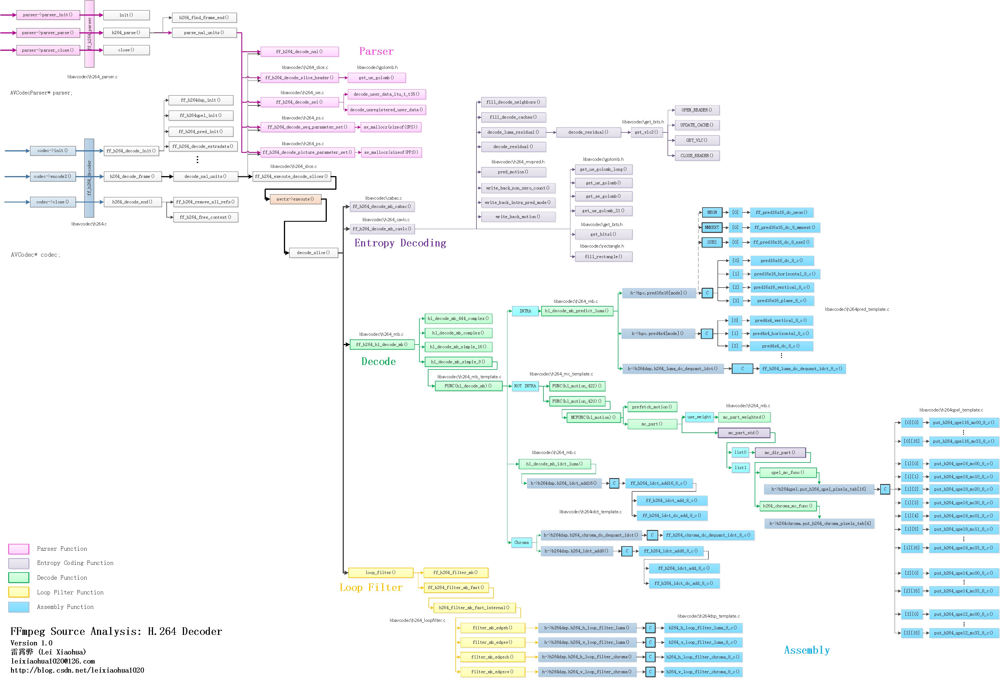
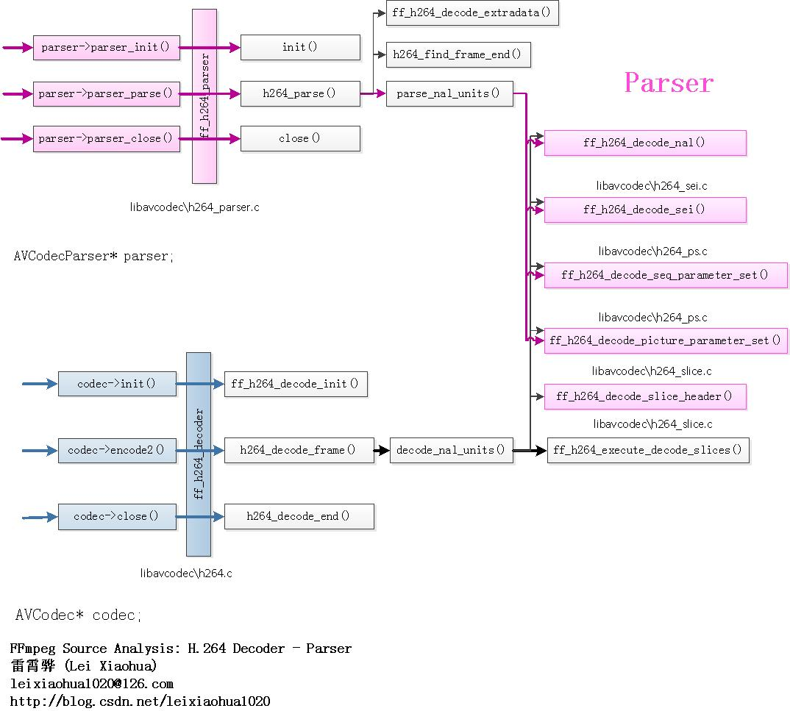

# 阅读 ffmpeg h264 源码

## 概念

```txt
cabac
  context adaptive binary arithmetic coder
```

## libavcodec 相关文件

| 文件 | 功能 |
| --- | --- |
| h264_cabac.c/cabac.c(h) | H.264/AVC/MPEG-4 part10 cabac 解码 |
| h264_caval.c | H.264/AVC/MPEG-4 part10 cavlc 比特流解码 |
| h264_direct.c | H.264/AVC/MPEG-4 part10 direct mb/block 解码 |
| h264_loopfilter.c | H.264/AVC/MPEG-4 part10 环路滤波 |
| h264_mb_template.c | H.26L/H.264/AVC/JVT/14496-10/... 解码器 |
| h264_mc_template.c/h264_mb.c | H.264/AVC/MPEG-4 part10 macroblock 解码 |
| h264_metadata_bsf.c |  |
| h264_mp4toannexb_bsf.c | H.264 MP4 到 Annex B 字节流格式过滤器 |
| h264_mvpred.h/golomb.c(h) | H.264/AVC/MPEG-4 part10 移动向量预测 |
| h264_parse.c(h) | H.264 解码器/解析器共享代码 |
| h264_parser.c | H.264/AVC/MPEG-4 part10 解析器 |
| h264_picture.c | H.264/AVC/MPEG-4 part10 编解码器 |
| h264_ps.c(h) | H.264/AVC/MPEG-4 part10 参数集解码 |
| h264_redundant_pps_bsf.c |  |
| h264_refs.c | H.264/AVC/MPEG-4 part10 参考图像处理 |
| h264_sei.c(h) | H.264/AVC/MPEG-4 part10 SEI 解码 |
| h264_slice.c | H.264/AVC/MPEG-4 part10 编解码器 |
| h264.h | H.264 公共定义 |
| h264chroma_template.c/h264chroma.c(h) |  |
| h264data.c(h) | H.264/AVC/MPEG-4 part10 编解码数据表 |
| h264dec.c(h) | H.264/AVC/MPEG-4 part10 编解码器 |
| h264addpx_template.c/h264dsp_template.c/h264dsp.c(h) | H.264/AVC/MPEG-4 part10 DSP 定义和函数(包含 IDCT、环路滤波函数等) |
| h264idct_template.c/h264idct.c(h) | H.264 IDCT |
| h264pred_template.c/h264pred.c(h) | H.264/AVC/MPEG-4 part10 帧内预测函数 |
| h264qpel_template.c/h264qpel.c(h) | 四分之一像素运动补偿相关的函数 |
| h2645_parse.c(h) | H.264/HEVC 公共解析代码 |

## 函数调用关系图



ffmpeg 和 h.264 解码器之间的结构体：

- ff_h264_parser：用于解析 H.264 码流的 AVCodecParser 结构体。
- ff_h264_decoder：用于解码 H.264 码流的 AVCodec 结构体。

### ff_h264_parser

文件：libavcodec/h264_parser.c

```c
typedef struct H264ParseContext;
AVCodecParser ff_h264_parser = {
    .codec_ids      = { AV_CODEC_ID_H264 },
    .priv_data_size = sizeof(H264ParseContext),
    .parser_init    = init,// 初始化 H.264 解析器
    .parser_parse   = h264_parse,// 解析 H.264 码流
    .parser_close   = h264_close,// 关闭 H.264 解析器
    .split          = h264_split,
};
```

解析器用于分割 H.264 的 NALU，并且解析 SPS、PPS、SEI 等信息。解析 H.264 码流和解码 H.264 码流时都会调用该部分的代码完成相应的功能。



### ff_h264_decoder

文件：libavcodec/h264.c

```c
typedef struct H264ParseContext;
AVCodec ff_h264_decoder = {
    .name                  = "h264",
    .long_name             = NULL_IF_CONFIG_SMALL("H.264 / AVC / MPEG-4 AVC / MPEG-4 part 10"),
    .type                  = AVMEDIA_TYPE_VIDEO,
    .id                    = AV_CODEC_ID_H264,
    .priv_data_size        = sizeof(H264Context),
    .init                  = h264_decode_init,// 初始化 H.264 解码器
    .close                 = h264_decode_end,// 关闭 H.264 解码器
    .decode                = h264_decode_frame,// 解码 H.264 码流
    .flush                 = flush_dpb,
    .priv_class            = &h264_class,
};
```

## 参考

- [FFmpeg 的 H.264 解码器源代码简单分析](https://blog.csdn.net/leixiaohua1020/article/details/44864509)
