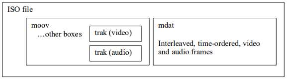
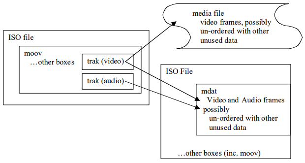

# ISO 基本媒体文件格式

- [ISO 基本媒体文件格式](#iso-基本媒体文件格式)
  - [介绍](#介绍)
  - [概念](#概念)
  - [对象结构文件组织](#对象结构文件组织)
    - [文件结构](#文件结构)
    - [对象结构](#对象结构)
    - [File Type Box](#file-type-box)
      - [定义](#定义)
      - [语法](#语法)
      - [语义](#语义)
  - [设计注意事项](#设计注意事项)
    - [用途](#用途)
      - [介绍](#介绍-1)
      - [交换](#交换)
      - [内容创建](#内容创建)
      - [流传输的准备](#流传输的准备)
      - [本地演示](#本地演示)
      - [流式演示](#流式演示)
    - [设计原则](#设计原则)
  - [ISO 基本媒体文件组织](#iso-基本媒体文件组织)
    - [演示结构](#演示结构)
      - [文件结构](#文件结构-1)
      - [对象结构](#对象结构-1)
      - [元数据和媒体数据](#元数据和媒体数据)
      - [轨道标识](#轨道标识)
    - [Metadata 结构(对象)](#metadata-结构对象)
      - [Box 顺序](#box-顺序)
  - [流式支持](#流式支持)
    - [流式协议的处理](#流式协议的处理)
    - [hint 轨道协议](#hint-轨道协议)
    - [hint 轨道格式](#hint-轨道格式)
  - [box 定义](#box-定义)
    - [Movie Box](#movie-box)
    - [Media Data Box](#media-data-box)
    - [Movie Header Box](#movie-header-box)
    - [Track Box](#track-box)
  - [参考](#参考)

## 介绍

ISO/IEC 基本媒体文件格式包含演示的定时媒体信息，被设计为一种灵活、可扩展的格式，以方便媒体的交换、管理、编辑和展示。媒体展示对于包含演示的系统可以是本地的，或经由网络或其他流传递机制。

文件结构是面向对象的；可以非常简单地将文件分解为基本对象，且直接从基本对象的类型推测对象的结构。

此文件格式被设计为它的设计独立于任何特定的网络协议，但总体高效支持这些网络协议。

ISO/IEC 基本媒体文件格式是媒体文件格式的基础。

ISO/IEC 14496 的此部分适用于 MPEG-4，但其技术内容与 ISO/IEC 15444-12 相同，后者适用于 JPEG 2000。

## 概念

```txt
box
  面向对象的构建块，由一个唯一的类型标识符和长度定义(在一个规范中称为'atom'， 包括 MP4 的第一个定义)
chunk
  某个轨道的一组连续样本
container box
  一种 box，只用于容纳和分组一系列相关的 box
hint track
  不包含媒体信息的特殊轨道。相反，它包含将一个或多个轨道打包到一个流通道的说明
hinter
  一种工具，运行在只包含媒体的文件，可以向该文件增加一个或多个提示轨道以方便流传输
Movie Box
  一种容器 box，其中的子 box 定义了演示的元数据('moov')
Media Data Box
  一种容器 box，包含演示的实际媒体数据('mdat')
ISO Base Media File
  此规范描述的文件格式的名称
presentation
  一个或多个运行序列(q.v.)，可能结合了音频
sample
  在非提示轨道中，采样是单个视频帧、视频帧的时间连续序列，或音频的时间连续压缩段。在提示轨道中，采样定义了一个或多个流数据包的形成。轨道内任何两个采样不能共享相同的时间戳
sample description
  一种结构，用于定义和描述轨道中的一些采样的格式
sample table
  一个压缩目录，用于轨道内采样的时间和物理布局
track
  ISO 基本媒体文件中的相关样本(q.v.)集合。对于媒体数据，轨道对应图像或采样音频的序列。对于提示轨道，轨道对应流通道
```

## 对象结构文件组织

### 文件结构

文件由一系列对象组成，在本规范中称为 box。所有数据都包含在 box 中；文件中没有其他数据。这包括特定文件格式所需的任何初始签名。

本规范中符合此章节的所有对象结构文件(所有对象结构文件)都应包含文件类型 box。

### 对象结构

此属于中的对象是 box。

box 开始的头部提供了大小和类型。头部支持紧凑或扩展的大小(32 或 64 位)，以及紧凑或扩展的类型(32 位或完整的 UUID)。标准的 box 均使用紧凑的类型(32 位)，且大多数 box 使用紧凑的大小(32 位)。通常，只有 Media Data Box 需要 64 位大小。

大小是 box 的整个大小，包含大小和类型头、字段，以及所有包含的 box。这有助于文件的常规解析。

在 MPEG-4(参阅第 2 节的参考)使用语法描述语言(SDL)定义了 box。本规范中代码片段的注释表示信息性材料。

对象中的字段先存储高位有效字节，通常称为网络字节顺序或大端格式。

```code
aligned(8) class Box (unsigned int(32) boxtype,
          optional unsigned int(8)[16] extended_type) {
  unsigned int(32) size;
  unsigned int(32) type = boxtype;
  if (size==1) {
    unsigned int(64) largesize;
  } else if (size==0) {
    // box extends to end of file
  }
  if (boxtype==‘uuid’) {
    unsigned int(8)[16] usertype = extended_type;
  }
}
```

两个字段的语义是：

- `size`: 整数，指定 box 的字节数，包含其所有字段和容纳的 bxo；如果 `size` 为 1，那么实际大小保存在字段 `largesize`；如果 `size` 为 0，那么该 box 是文件中的最后一个，且其内容延伸到文件末尾(通常只用于媒体数据 box)
- `type`: 标识 box 类型；标准 box 使用紧凑类型，通常是 4 个可打印字符，以便于标识，并在下面的 box 中显式。用户扩展使用扩展类型；在这种情况下，类型字段设置为 “uuid”

无法识别类型的 box 应该给忽略和跳过。

许多对象也包含一个版本号 version 和标识字段 flags。

```code
aligned(8) class FullBox(unsigned int(32) boxtype, unsigned int(8) v, bit(24) f)
  extends Box(boxtype) {
  unsigned int(8) version = v;
  bit(24) flags = f;
}
```

两个字段的语义是：

- `version`: 证书，指定 box 格式的版本
- `flags`: 标识的映射

无法识别版本的 box 应该给忽略和跳过。

### File Type Box

#### 定义

| box 类型 | 容器 | 必要性 | 数量 |
| --- | --- | --- | --- |
| ftype | 文件 | Y | 1 |

必须尽可能早地在文件中放置此 box (例如，在任何强制性签名之后，但在任何重要的可变大小 box 之前，比如 Movie Box、Media Data Box 或 Free Space)。它表示文件的“最佳使用”规范，以及该规范的次版本；还有文件符合的其他一系列规范。读者实现此格式时，应该尝试读取标记与其实现的任何规范兼容的文件。因此，规范中任何不兼容的更改应注册新的 “brand” 标识符，以表示符合新规范的文件。

在本规范的这部分，定义 “isom”(ISO 基本媒体文件) 类型标识符合 ISO 基本媒体文件格式第 1 版的文件。

通常在文件外部标记(比如，带有文件扩展名或 mime 类型)，以标识“最佳使用”(主要的 brand)，或作者认为将提供最大兼容性的 brand。

应该使用 “iso2” brand 标识与 ISO 基础媒体文件格式的此修订版本兼容；可以将其作为 “isom” brand 的补充或替代，并且和 “isom” 适用相同的使用规则。如果未使用 “isom” brand 标识此规范的第一版，标识需要支持此修订版引入的部分或全局技术，比如要求子第 8.40 到 8.45 小节的函数，或者第 10 节中的 SRTP 支持。

“avc1” brand 应用于表示该文件符合子章节的 “AVC 扩展名”。如果未使用其他 brand，这意味着需要支持这些扩展。规范可能支持使用 “avc1” 作为主要的 brand；在这种情况下，该规范定义文件扩展名和所需行为。

如果在文件级别使用了具有 MPEG-7 句柄类型的 meta-box，那么 “mp71” brand 应该是 File Type Box 的 brand 兼容列表的成员之一。

#### 语法

```code
aligned(8) class FileTypeBox
  extends Box(‘ftyp’) {
  unsigned int(32) major_brand;
  unsigned int(32) minor_version;
  unsigned int(32) compatible_brands[]; // to end of the box
}
```

#### 语义

此 box 标识文件符合的规范。

每个 brand 是可打印的 4 字符代码，通过 ISO 注册，用于表示精确的规范。

- `major_brand`: brand 标识符
- `minor_brand`: 信息性的证书，用于主要 brand 的次版本
- `compatible_brands`: 一个 brand 列表，在 box 末尾

## 设计注意事项

### 用途

#### 介绍

文件格式旨在用作许多操作的基础。在这些不同的角色中，可将其用于不同的方式，以及整个设计的不同方面。

#### 交换

当用作交换格式时，文件通常是独立的(不引用其他文件的媒体)，值包含演示中实际使用的媒体数据，且不包含任何流相关的信息。这将产生一个很小的、独立于协议的独立文件，其中包含核心媒体数据和对其操作所需的信息。

下图给出了一个简单的交换文件的示例，其中包含两个流：



#### 内容创建

在内容创建阶段，可对格式的多个区域进行有效使用，特别是：

- 能够分别存储每个基本流(不交错)，可能存储在单独的文件
- 能够在包含媒体数据和其他流的单个(比如，以未压缩格式编辑音频轨道，以使其与已经准备的视频轨道对齐)

这些特征意味着可以准备演示、进行编辑、开发和集成内容，而无需反复将演示重新写在磁盘上——如果需要交错且必须删除未使用数据，重写是必要的；且无需反复解码和编码数据——如果必须以编码状态存储数据，编解码是必要的。

下图显示了内容创建过程中使用的一组文件：



#### 流传输的准备

在准备流传输时，文件必须包含信息，用于信息发送过程中指导流媒体服务器。此外，如果将这些指令和媒体数据进行交织，那么为演示提供服务时可以避免过度搜索，这是很有用的。这对于原始媒体数据保持无损也同样重要，以便对文件进行验证、重新编辑或另外重用。最后，如果可为多个协议准备单个文件，以便不同服务器通过不同协议使用文件，这将很有帮助。

#### 本地演示

“本地”查看演示(即直接从文件而不是通过流式互联)是一个重要应用；将其用于分发演示时(比如在 CD 或 DVD ROM 上)、开发过程中，以及在流媒体服务器上验证内容。必须支持这种本地查看，并可完全随机访问。如果演示在 CD 或 DVD ROM 上，那么交错很重要，因为搜索可能会很慢。

#### 流式演示

当服务器从文件生成流时，生成的流必须符合使用的协议规范，且文件本身不应包含任何文件格式信息的痕迹。服务器需要能够随机访问演示。这对于通过多个演示引用相同媒体内容以重用服务内容可能有用；它也可以帮助在准备流式传输时，媒体数据可在只读媒体(比如 CD)上且不复制只扩充。

下图显示了通过多路复用协议准备流式传输演示，只需要一个 hint 轨道：


### 设计原则

文件结构是面向对象的；可以非常简单地将文件分解为基本对象，且直接从基本对象的类型推测对象的结构。

媒体数据不是通过文件格式“分帧”；文件格式声明提供媒体数据单元的大小、类型和位置，在物理上和媒体数据不连续。这使得可以对媒体数据划分子集，并以其自然状态进行使用，而无需将其复制以为分帧流出空间。元数据用于通过引用而不是包含来描述媒体数据。

类似的，用于特定流协议的协议信息不对媒体数据分帧；协议头和媒体数据在物理上不联系。相反，可通过引用包含媒体数据。这使得可以媒体数据的自然状态进行演示，而无需任何协议。这也使得同一组媒体数据可用于本地演示和多种协议。

协议信息的构建方式使得流媒体服务器仅需要了解该协议及其发送方式；协议信息抽象了媒体知识，以便服务器在很大程度上与媒体类型无关。同样地，媒体数据以未知协议的方式存储，使得媒体工具与协议无关。

文件格式不要求单个演示位于单个文件中，这样可以设置内容子部分，以及重用内容。当和非帧的方法结合使用时，未按照此规范格式化的文件(比如，仅包含媒体数据且不包含声明性信息的“raw”文件，或者已在媒体或计算机行业使用的文件格式)还可以包含这些媒体数据。

文件格式基于一组统一的设计，以及一组丰富的可能的结构和用法。相同的格式适用所有用法；不需要翻译。然而，当以特定方式(比如本地演示)使用时，可能需要以某些方式结构化文件以实现最佳行为(比如，数据的时间顺序)。除非使用受限的配置文件，否则本规范未定义规范性结构规则。

## ISO 基本媒体文件组织

### 演示结构

#### 文件结构

演示可能包含在多个文件中。一个文件包含整个演示的元信息，且格式化成此规范。此文件也可能包含所有的媒体数据，因此演示是独立的。如果使用了其他文件，则无需将其格式化为此规范；它们用于包含媒体数据，也可能包含未使用的媒体数据或其他信息。本规范仅涉及演示文件的结构。此规范中关于媒体数据文件的格式，只限制其中的媒体数据必须可以通过此处定义的元数据进行描述。

其他文件可以是 ISO 文件、图像文件或其他格式。其他这些文件中只存储媒体数据本身，比如 JPEG 2000 图像；所有时间和帧(位置和大小)信息都存储在 ISO 基本媒体文件中，因此辅助文件本质上是自由格式的。如果 ISO 文件包含 hint 轨道，从媒体轨道引用的媒体数据构建 hint 轨道，即使 hint 轨道没有直接引用媒体轨道的数据，仍将媒体轨道保留在文件中；删除所有 hint 轨道后，将保留整个没有 hint 的演示。但是请注意，媒体轨道可能为其媒体数据引用外部文件。

附录 A 提供了内容丰富的介绍，可能对初学者有所帮助。

#### 对象结构

文件被构造为一系列对象；其中一些对象可能包含其他对象。文件中的对象序列应该只包含一个演示元数据包装器(Movie Box)。它通常靠近未见的开头或结尾，以方便对其定位。在此级别找到的其他对象可能是 File Type Box、Free Space Box、Movie Fragments、Meta-data 或 Media Data Box。

#### 元数据和媒体数据

元数据包含在元数据包装器(Movie Box)中；媒体数据包含在相同文件的 Media Data Box 或其他文件中。媒体数据由图像或音频数据组成；媒体数据对象或媒体数据文件，可能包含其他未引用的信息。

#### 轨道标识

ISO 文件中使用的轨道标识符在该文件中是唯一的；没有两个轨道可以使用相同的标识符。

下一个轨道标识符存储在 Movie Header Box 的 `next_track_ID`，通常包含一个值，该值比文件中找到的最大轨道标识符值大 1。在大多数情况下，这使得易于生成轨道标识符。但是，如果该值为全 1(32 位无符号数 maxint)，则所有增加需要搜索未使用的轨道标识符。

### Metadata 结构(对象)

#### Box 顺序

下表提供了常规封装结构的整体视图。

该表最左侧一栏显示了肯呢个出现在顶层的 box；索引用于显示可能的包含关系。因此，比如可以在 Movie Box(moov) 中找到 Track Box(trak)，在 trak 中找到 Track Header Box(tkhd)。并非所有文件需要用到所有 box；必须使用的 box 使用星号(*)标记。请参阅各个 box 的描述，以讨论如果不存在可选 box 需要假定的内容。

用户数据对象仅应放在 Movie 或 Track Box 中，且使用扩展类的对象可以放在各种容器中，而不仅仅是顶层。

为了提高文件的互操作性和实用性，对于 box 的顺序应遵循下面的规则和准则：

1. 文件类型 box “ftyp” 应出现在任何长度可变的 box (比如 movie、free space、media data)之前。如果需要，只有固定大小的 box (比如文件签名)可以在其之前。
2. 强烈**建议**容器中首先放置所有头部 box：这些 box 是 Movie Header、Track Header、Media Header 和 Media Information Box 内特定的媒体头(比如 Video MediaHeader)。
3. 所有 Movie Fragment Box **应该**按顺序排列(参阅第 8.33 节)。
4. **建议** Sample Table Box 内的 box 按照下面的顺序：Sample Description、Time to Sample、Sample to Chunk、Sample Size、Chunk Offset。
5. 强烈**建议** Track Reference Box 和 Edit List(如果有)**应该**在 Media Box 之前，且 Handler Reference Box **应该**在 Media Information Box 之前，Data Information Box 在 Sample Table Box 之前。
6. **建议**容器中最后放置 User Data Box，即 Movie Box 或 Track Box。
7. **建议**将 Movie Fragment Random Access Box (如果有)放在文件最后。
8. **建议**Progressive Download Information Box 尽早放置在文件中，以便发挥最大效用。

表 1 —— Box 类型、结构和交叉引用

| # | # | # | # | # | # | 必要性 | 定义 | 描述 |
| --- | --- | --- | --- | --- | --- | --- | --- | --- |
| ftyp |   |   |   |   |   | * | 4.3  | file type and compatibility |
| pdin |   |   |   |   |   |   | 8.43 | progressive download information |
| moov |   |   |   |   |   | * | 8.1  | container for all the metadata |
|   | mvhd |   |   |   |   | * | 8.3  | movie header, overall declarations |
|   | trak |   |   |   |   | * | 8.4  | container for an individual track or stream |
|   |   | tkhd |   |   |   | * | 8.5  | track header, overall information about the track |
|   |   | tref |   |   |   |   | 8.6  | track reference container |
|   |   | edts |   |   |   |   | 8.25 | edit list container |
|   |   |   | elst |   |   |   | 8.26 | an edit list |
|   |   | mdia |   |   |   | * | 8.7  | container for the media information in a track |
|   |   |   | mdhd |   |   | * | 8.8  | media header, overall information about the media |
|   |   |   | hdlr |   |   | * | 8.9  | handler, declares the media (handler) type |
|   |   |   | minf |   |   | * | 8.10 | media information container |
|   |   |   |   | vmhd |   |   | 8.11.2 | video media header, overall information (video track only) |
|   |   |   |   | smhd |   |   | 8.11.3 | sound media header, overall information (sound track only) |
|   |   |   |   | hmhd |   |   | 8.11.4 | hint media header, overall information (hint track only) |
|   |   |   |   | nmhd |   |   | 8.11.5 | Null media header, overall information (some tracks only) |
|   |   |   |   | dinf |   | * | 8.12   | data information box, container |
|   |   |   |   |   | dref | * | 8.13   | data reference box, declares source(s) of media data in track |
|   |   |   |   | stbl |   | * | 8.14   | sample table box, container for the time/space map |
|   |   |   |   |   | stsd | * | 8.16   | sample descriptions (codec types, initialization etc.) |
|   |   |   |   |   | stts | * | 8.15.2 | (decoding) time-to-sample |
|   |   |   |   |   | ctts |   | 8.15.3 | (composition) time to sample |
|   |   |   |   |   | stsc | * | 8.18   | sample-to-chunk, partial data-offset information |
|   |   |   |   |   | stsz |   | 8.17.2 | sample sizes (framing) |
|   |   |   |   |   | stz2 |   | 8.17.3 | compact sample sizes (framing) |
|   |   |   |   |   | stco | * | 8.19   | chunk offset, partial data-offset information |
|   |   |   |   |   | co64 |   | 8.19   | 64-bit chunk offset |
|   |   |   |   |   | stss |   | 8.20   | sync sample table (random access points) |
|   |   |   |   |   | stsh |   | 8.21   | shadow sync sample table |
|   |   |   |   |   | padb |   | 8.23   | sample padding bits |
|   |   |   |   |   | stdp |   | 8.22   | sample degradation priority |
|   |   |   |   |   | sdtp |   | 8.40.2 | independent and disposable samples |
|   |   |   |   |   | sbgp |   | 8.40.3.2 | sample-to-group |
|   |   |   |   |   | sgpd |   | 8.40.3.3 | sample group description |
|   |   |   |   |   | subs |   | 8.42   | sub-sample information |
|   | mvex |   |   |   |   |   | 8.29   | movie extends box |
|   |   | mehd |   |   |   |   | 8.30   | movie extends header box |
|   |   | trex |   |   |   | * | 8.31   | track extends defaults |
|   | ipmc |   |   |   |   |   | 8.45.4 | IPMP Control Box |
| moof |   |   |   |   |   |   | 8.32   | movie fragment |
|   | mfhd |   |   |   |   | * | 8.33   | movie fragment header |
|   | traf |   |   |   |   |   | 8.34   | track fragment |
|   |   | tfhd |   |   |   | * | 8.35   | track fragment header |
|   |   | trun |   |   |   |   | 8.36   | track fragment run |
|   |   | sdtp |   |   |   |   | 8.40.2 | independent and disposable samples |
|   |   | sbgp |   |   |   |   | 8.40.3.2 | sample-to-group |
|   |   | subs |   |   |   |   | 8.42   | sub-sample information |
| mfra |   |   |   |   |   |   | 8.37   | movie fragment random access |
|   | tfra |   |   |   |   |   | 8.38   | track fragment random access |
|   | mfro |   |   |   |   | * | 8.39   | movie fragment random access offset |
| mdat |   |   |   |   |   |   | 8.2    | media data container |
| free |   |   |   |   |   |   | 8.24   | free space |
| skip |   |   |   |   |   |   | 8.24   | free space |
|   | udta |   |   |   |   |   | 8.27   | user-data |
|   |   | cprt |   |   |   |   | 8.28   | copyright etc. |
| meta |   |   |   |   |   |   | 8.44.1 | metadata |
|   | hdlr |   |   |   |   | * | 8.9    | handler, declares the metadata (handler) type |
|   | dinf |   |   |   |   |   | 8.12   | data information box, container |
|   |   | dref |   |   |   |   | 8.13   | data reference box, declares source(s) of metadata items |
|   | ipmc |   |   |   |   |   | 8.45.4 | IPMP Control Box |
|   | iloc |   |   |   |   |   | 8.44.3 | item location |
|   | ipro |   |   |   |   |   | 8.44.5 | item protection |
|   |   | sinf |   |   |   |   | 8.45.1 | protection scheme information box |
|   |   |   | frma |   |   |   | 8.45.2 | original format box |
|   |   |   | imif |   |   |   | 8.45.3 | IPMP Information box |
|   |   |   | schm |   |   |   | 8.45.5 | scheme type box |
|   |   |   | schi |   |   |   | 8.45.6 | scheme information box |
|   | iinf |   |   |   |   |   | 8.44.6 | item information |
|   | xml  |   |   |   |   |   | 8.44.2 | XML container |
|   | bxml |   |   |   |   |   | 8.44.2 | binary XML container |
|   | pitm |   |   |   |   |   | 8.44.4 | primary item reference  |

## 流式支持

### 流式协议的处理

此文件格式支持媒体数据通过网络的流式播放和本地回放。发送协议数据单元的过程是基于时间的，就像显示基于时间的数据，因此可以通过基于时间的格式进行适当描述。支持流式传输的文件或“影片”包含有关流的数据单元信息。此信息包含在文件额外的轨道，称之为 “hint” 轨道。

hint 轨道包含指示，以帮助流媒体服务器形成传输的数据包。这些指示可能包含即时数据供服务器发送(比兔头部信息)或媒体数据的引用段。这些指示被编码到文件中的方式，和将编辑或演示信息编码到文件以进行本地播放的方式相同。为服务器提供信息而不是编辑或演示信息，允许服务器以适用于特定网络传输流的方式对媒体数据分包。

无论是本地回放还是通过多种不同协议进行流传输，包含 hint 的文件中使用相同的媒体数据。同一文件内部可能为不同的协议包含单独的 “hint” 轨道，且媒体将在所有此类协议上播放，而无需另外复制媒体本身。此外，通过为特定协议添加合适的 hint 轨道，可轻松使现有媒体流式传输。媒体数据本身不需要以任何方式重新广播或格式化。

相比针对特定传输和媒体格式要求媒体信息划分为实际传输的数据单元，这种流传输方法具有更高的空间效率。按照前一种种方法，本地回放需要从数据包重新组合媒体，或者生成两个媒体副本——一个用户本地回放，一个用于流媒体。类似地，通过多种协议流式传输此类媒体对于每次传输，都需要媒体数据的多个副本。这在空间上是低效的，除非媒体数据为进行流传输被大量转换(比如通过纠错编码技术或加密)。

### hint 轨道协议

支持流式基于下面三个设计参数：

- 媒体数据表示为一组网络无关的标准轨道，可以正常播放、编辑等
- 服务器 hint 轨道具有统一的声明和基本结构；这种通用格式和协议无关，但是包含服务器 hint 轨道中描述了哪些协议的声明
- 对于每种可能传输的协议，服务器 hint 轨道都有特定的设计；所有这些设计使用相同的基本结构。比如，可能存在 RTP (用于 Internet) 和 MPEG-2 传输(用于广播)，或新标准，或特定供应商协议的设计

服务器按照 hint 轨道指示发送的结果流不能包含特定文件的信息痕迹。该设计不需要在有限数据或解码站中使用文件结构或声明样式。例如，使用 H.261 视频和 DVI 音频的文件通过 RTP 进行流传输，产生的数据流包完全符合将这些编码打包到 RTP 的 IETF 规范。

hint 轨道的构建和标记，使得在本地回放演示(而非流式)时可以忽略它们。

### hint 轨道格式

hint 轨道用于向服务器描述，如何通过流传输协议为文件中的基本流数据提供服务。每个协议都有自己的 hint 轨道格式。hint 的格式通过 hint 轨道的采样描述进行描述。大多数协议对于每个轨道仅需要一个采样描述格式。

服务器查找这些 hint 轨道时，首先找到所有 hint 轨道，然后使用其协议(采样描述格式)在该集合查找。如果当前有选择，那么服务器的选择将根据首选协议，或通过比较 hint 轨道头部的功能或采样描述中特定协议的信息。

hint 轨道根据引用将数据从其他轨道拉下来以构造流。这些其他轨道可能是 hint 轨道或基本流轨道。这些指针的确切形式由协议的采样格式定义，但通常它们由 4 部分信息组成：轨道引用索引、采样编号、偏移量和长度。其中一些对于特定协议可能是隐式的、这些“指针”始终指向数据的实际来源。如果一个 hint 轨道建在另一个 hint 轨道“顶部”，则第二个 hint 轨道必须包含第一个 hint 轨道使用的媒体轨道的直接引用，这些媒体轨道的数据被放在流中。

所有 hint 轨道使用通用的一组声明和结构：

- 将 hint 轨道链接到其携带的基本流轨道，通过 “hint” 类型的轨道引用
- 它们使用一个句柄—— Handler Reference Box 中是 “hint” 类型
- 它们使用一个 Hint Media Header Box
- 它们使用一个 hint 采样入口，位于采样描述，包含一个名称和格式，对于其代表的协议是唯一的
- 归于本地回放通常将它们标记为不可用，将其轨道头部标记置为 0

hint 轨道可通过创作工具创建，或通过提示工具增加到一个现有的演示。这样的工具可以充当媒体和协议之间的“桥梁”，因为它对两者都有深刻的了解。这支持创作工具了解媒体格式但不了解协议，且服务器可以理解协议(及其 hint 轨道)但不理解媒体数据的详细信息。

hint 轨道不是有单独的合成时间；hint 轨道中没有 “ctts” 表。hint 过程将传输时间正确计算为解码时间。

## box 定义

### Movie Box

| box 类型 | 容器 | 必要性 | 数量 |
| --- | --- | --- | --- |
| moov | 文件 | Y | 1 |

演示的元数据存储在位于文件顶部的单个 Movie Box。通常，尽管不是必须的，此 box 靠近文件的开头或结尾。

```code
aligned(8) class MovieBox extends Box(‘moov’){
}
```

### Media Data Box

| box 类型 | 容器 | 必要性 | 数量 |
| --- | --- | --- | --- |
| mdat | 文件 | N | >=0 |

此 box 包含媒体数据。在视频轨道中，此 box 包含视频帧。演示可以包含 0 个或多个 Media Data Box。实际的媒体数据遵循 type 字段。其结构由元数据描述(尤其参阅第 8.14 节的 Sample Table，和第 8.44.3 节的 Item Location Box)。

在大型演示中，可能希望此 box 中的数据超过 32 位大小的限制。在这种情况下，使用上面 6.2 小节中的 size 字段的对应的大数 largesize。

文件中可包含任意数量的 Media Data Box (如果所有媒体数据在其他文件中，则包含 0)。元数据通过其在文件中的绝对偏移量来引用媒体数据(参阅 8.19 小节的 Chunk Offset Box)；因此，可以轻松跳过 Media Data Box 头部和可用空间，还可以引用和使用没有任何 box 结构的文件。

```code
aligned(8) class MediaDataBox extends Box(‘mdat’) {
  bit(8) data[];
}
```

| 字段 | 类型 | 含义 |
| --- | --- | --- |
| data | - | 包含的媒体数据 |

### Movie Header Box

| box 类型 | 容器 | 必要性 | 数量 |
| --- | --- | --- | --- |
| mvhd | Movie Box (moov) | Y | 1 |

此 box 定义了和媒体无关的整体信息，并且与整个演示相关。

```code
aligned(8) class MovieHeaderBox extends FullBox(‘mvhd’, version, 0) {
  if (version==1) {
    unsigned int(64) creation_time;
    unsigned int(64) modification_time;
    unsigned int(32) timescale;
    unsigned int(64) duration;
  } else { // version==0
    unsigned int(32) creation_time;
    unsigned int(32) modification_time;
    unsigned int(32) timescale;
    unsigned int(32) duration;
  }
  template int(32) rate = 0x00010000; // typically 1.0
  template int(16) volume = 0x0100; // typically, full volume
  const bit(16) reserved = 0;
  const unsigned int(32)[2] reserved = 0;
  template int(32)[9] matrix =
    { 0x00010000,0,0,0,0x00010000,0,0,0,0x40000000 };
    // Unity matrix
  bit(32)[6] pre_defined = 0;
  unsigned int(32) next_track_ID;
} 
```

| 字段 | 类型 | 含义 |
| --- | --- | --- |
| version | 整数 | 指定此 box 的版本(此规范是 0 或 1) |
| creation_time | 整数 | 声明演示的创建时间(从 1904-1-1 午夜起的秒数，UTC 时间) |
| modification_time | 整数 | 声明演示最近一次修改时间(从 1904-1-1 午夜起的秒数，UTC 时间) |
| timescale | 整数 | 指定整个演示的时间刻度；是经过一秒的时间单位数。比如，以 1/60 秒为单位测量时间的时间坐标系的时间刻度是 60 |
| duration | 整数 | 声明演示的长度(在指定的时间范围内)。此属性源自演示的轨道：此字段的值对应演示最长轨道的持续时间 |
| rate | 定点数 16.16 | 指示播放演示的首选速率；1.0(0x00010000) 是正常的正向回放 |
| volume | 定点数 8.8 | 指示首选的回放音量。1.0(0x00010000) 是全音量 |
| matrix | - | 为视频提供转化矩阵；(u,v,w) 在这里限制为 (0,0,1)，16 进制值为 (0,0,0x40000000) |
| next_track_ID | 非 0 整数 | 指示要添加到演示的下一个轨道的轨道 ID 值。零不是有效的轨道 ID 值。next_track_ID 值应大于在用的最大轨道 ID。如果此值大于等于全 1(32 位 maxint)，且要增加新的媒体轨道，必须在文件中搜索未使用的轨道标识符 |

### Track Box

page 16(24/94)

## 参考

- iso14496-12: ISO Base Media File Format, 20050401
