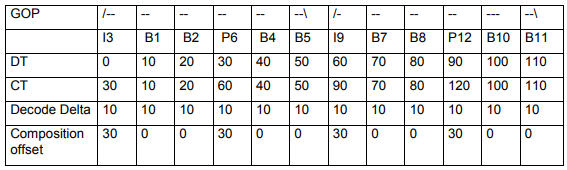

# ISO 基本媒体文件格式

- [ISO 基本媒体文件格式](#iso-基本媒体文件格式)
  - [缩写](#缩写)
  - [介绍](#介绍)
  - [1 范围](#1-范围)
  - [3 术语、定义和缩略语](#3-术语定义和缩略语)
    - [3.1 术语和定义](#31-术语和定义)
    - [3.2 缩略语](#32-缩略语)
  - [4 对象结构文件组织](#4-对象结构文件组织)
    - [4.1 文件结构](#41-文件结构)
    - [4.2 对象结构](#42-对象结构)
    - [4.3 File Type Box](#43-file-type-box)
  - [5 设计注意事项](#5-设计注意事项)
    - [5.1 用途](#51-用途)
      - [5.1.1 介绍](#511-介绍)
      - [5.1.2 交换](#512-交换)
      - [5.1.3 内容创建](#513-内容创建)
      - [5.1.4 流传输的准备](#514-流传输的准备)
      - [5.1.5 本地演示](#515-本地演示)
      - [5.1.6 流式演示](#516-流式演示)
    - [5.2 设计原则](#52-设计原则)
  - [6 ISO 基本媒体文件组织](#6-iso-基本媒体文件组织)
    - [6.1 演示结构](#61-演示结构)
      - [6.1.1 文件结构](#611-文件结构)
      - [6.1.2 对象结构](#612-对象结构)
      - [6.1.3 元数据和媒体数据](#613-元数据和媒体数据)
      - [6.1.4 轨道标识](#614-轨道标识)
    - [6.2 Metadata 结构(对象)](#62-metadata-结构对象)
      - [6.2.1 Box](#621-box)
      - [6.2.2 数据类型和字段](#622-数据类型和字段)
      - [6.2.3 Box 顺序](#623-box-顺序)
      - [6.2.4 URI 作为类型指示符](#624-uri-作为类型指示符)
    - [6.3 brand 识别](#63-brand-识别)
  - [7 流式支持](#7-流式支持)
    - [7.1 流式协议的处理](#71-流式协议的处理)
    - [7.2 hint 轨道协议](#72-hint-轨道协议)
    - [7.3 hint 轨道格式](#73-hint-轨道格式)
  - [8 box 定义](#8-box-定义)
    - [8.1 文件结构和常规 box](#81-文件结构和常规-box)
      - [8.1.1 Media Data Box](#811-media-data-box)
      - [8.1.2 Free Space Box](#812-free-space-box)
      - [8.1.3 Progressive Download Information Box](#813-progressive-download-information-box)
    - [8.2 影片结构](#82-影片结构)
      - [8.2.1 Movie Box](#821-movie-box)
      - [8.2.2 Movie Header Box](#822-movie-header-box)
    - [8.3 轨道结构](#83-轨道结构)
      - [8.3.1 Track Box](#831-track-box)
      - [8.3.2 Track Header Box](#832-track-header-box)
      - [8.3.3 Track Reference Box](#833-track-reference-box)
      - [8.3.4 Track Group Box](#834-track-group-box)
    - [8.4 轨道媒体结构](#84-轨道媒体结构)
      - [8.4.1 Media Box](#841-media-box)
      - [8.4.2 Media Header Box](#842-media-header-box)
      - [8.4.3 Handler Reference Box](#843-handler-reference-box)
      - [8.4.4 Media Information Box](#844-media-information-box)
      - [8.4.5 Media Information Header Box](#845-media-information-header-box)
        - [8.4.5.1 定义](#8451-定义)
        - [8.4.5.2 Null Media Header Box](#8452-null-media-header-box)
      - [8.4.6 Extended Language Tag](#846-extended-language-tag)
    - [8.5 采样表](#85-采样表)
      - [8.5.1 Sample Table Box](#851-sample-table-box)
      - [8.5.2 Sample Description Box](#852-sample-description-box)
      - [8.5.3 Degradation Priority Box](#853-degradation-priority-box)
    - [8.6 轨道时间结构](#86-轨道时间结构)
      - [8.6.1 Time to Sample Box](#861-time-to-sample-box)
        - [8.6.1.1 定义](#8611-定义)
        - [8.6.1.2 Decoding Time to Sample Box](#8612-decoding-time-to-sample-box)
        - [8.6.1.3 Composition Time to Sample Box](#8613-composition-time-to-sample-box)
        - [8.6.1.4 Composition to Decode Box](#8614-composition-to-decode-box)
      - [8.6.2 Sync Sample Box](#862-sync-sample-box)
      - [8.6.3 Shadow Sync Sample Box](#863-shadow-sync-sample-box)
      - [8.6.4 Independent and Disposable Samples Box](#864-independent-and-disposable-samples-box)
      - [8.6.5 Edit Box](#865-edit-box)
      - [8.6.6 Edit List Box](#866-edit-list-box)
    - [8.7 轨道数据布局结构](#87-轨道数据布局结构)
      - [8.7.1 Data Information Box](#871-data-information-box)
      - [8.7.2 Data Reference Box](#872-data-reference-box)
      - [8.7.3 Sample Size Boxes](#873-sample-size-boxes)
        - [8.7.3.1 定义](#8731-定义)
        - [8.7.3.2 Sample Size Box](#8732-sample-size-box)
        - [8.7.3.3 Compact Sample Size Box](#8733-compact-sample-size-box)
      - [8.7.4 Sample To Chunk Box](#874-sample-to-chunk-box)
      - [8.7.5 Chunk Offset Box](#875-chunk-offset-box)
      - [8.7.6 Padding Bits Box](#876-padding-bits-box)
      - [8.7.7 Sub-Sample Information Box](#877-sub-sample-information-box)
      - [8.7.8 Sample Auxiliary Information Sizes Box](#878-sample-auxiliary-information-sizes-box)
      - [8.7.9 Sample Auxiliary Information Offsets Box](#879-sample-auxiliary-information-offsets-box)
    - [8.8 影片结构](#88-影片结构)
      - [8.8.1 Movie Extends Box](#881-movie-extends-box)
      - [8.8.2 Movie Extends Header Box](#882-movie-extends-header-box)
      - [8.8.3 Track Extends Box](#883-track-extends-box)
      - [8.8.4 Movie Fragment Box](#884-movie-fragment-box)
      - [8.8.5 Movie Fragment Header Box](#885-movie-fragment-header-box)
      - [8.8.6 Track Fragment Box](#886-track-fragment-box)
      - [8.8.7 Track Fragment Header Box](#887-track-fragment-header-box)
      - [8.8.8 Track Fragment Run Box](#888-track-fragment-run-box)
      - [8.8.9 Movie Fragment Random Access Box](#889-movie-fragment-random-access-box)
      - [8.8.10 Track Fragment Random Access Box](#8810-track-fragment-random-access-box)
      - [8.8.11 Movie Fragment Random Access Offset Box](#8811-movie-fragment-random-access-offset-box)
      - [8.8.12 Track Fragment Decode Time](#8812-track-fragment-decode-time)
      - [8.8.13 Level Assignment Box](#8813-level-assignment-box)
      - [8.8.14 Sample Auxiliary Information in Movie Fragments](#8814-sample-auxiliary-information-in-movie-fragments)
      - [8.8.15 Track Extension Properties Box](#8815-track-extension-properties-box)
      - [8.8.16 Alternative Startup Sequence Properties Box](#8816-alternative-startup-sequence-properties-box)
      - [8.8.17 影片片段中的元数据和用户数据](#8817-影片片段中的元数据和用户数据)
    - [8.9 采样分组结构](#89-采样分组结构)
      - [8.9.1 介绍](#891-介绍)
      - [8.9.2 Sample To Group Box](#892-sample-to-group-box)
      - [8.9.3 Sample Group Description Box](#893-sample-group-description-box)
      - [8.9.4 Movie Fragment 的组结构表示](#894-movie-fragment-的组结构表示)
    - [8.10 用户数据](#810-用户数据)
      - [8.10.1 User Data Box](#8101-user-data-box)
      - [8.10.2 Copyright Box](#8102-copyright-box)
      - [8.10.3 Track Selection Box](#8103-track-selection-box)
        - [8.10.3.1 介绍](#81031-介绍)
        - [8.10.3.2 定义](#81032-定义)
        - [8.10.3.3 语法](#81033-语法)
        - [8.10.3.4 语义](#81034-语义)
        - [8.10.3.5 属性](#81035-属性)
      - [8.10.4 Track kind](#8104-track-kind)
    - [8.11 元数据支持](#811-元数据支持)
      - [8.11.1 The Meta Box](#8111-the-meta-box)
      - [8.11.2 XML Box](#8112-xml-box)
      - [8.11.3 The Item Location Box](#8113-the-item-location-box)
      - [8.11.4 Primary Item Box](#8114-primary-item-box)
      - [8.11.5 Item Protection Box](#8115-item-protection-box)
      - [8.11.6 Item Information Box](#8116-item-information-box)
      - [8.11.7 Additional Metadata Container Box](#8117-additional-metadata-container-box)
      - [8.11.8 Metabox Relation Box](#8118-metabox-relation-box)
      - [8.11.9 Meta Box 的 URL 格式](#8119-meta-box-的-url-格式)
      - [8.11.10 静态的元数据](#81110-静态的元数据)
        - [8.11.10.1 简单的文本](#811101-简单的文本)
        - [8.11.10.2 其他格式](#811102-其他格式)
        - [8.11.10.3 MPEG-7 元数据](#811103-mpeg-7-元数据)
      - [8.11.11 Item Data Box](#81111-item-data-box)
      - [8.11.12 Item Reference Box](#81112-item-reference-box)
      - [8.11.13 Auxiliary video metadata](#81113-auxiliary-video-metadata)
    - [8.12 支持受保护的流](#812-支持受保护的流)
      - [8.12.1 Protection Scheme Information Box](#8121-protection-scheme-information-box)
      - [8.12.2 Original Format Box](#8122-original-format-box)
      - [8.12.3 IPMP Info Box](#8123-ipmp-info-box)
      - [8.12.4 IPMP Control Box](#8124-ipmp-control-box)
      - [8.12.5 Scheme Type Box](#8125-scheme-type-box)
      - [8.12.6 Scheme Information Box](#8126-scheme-information-box)
    - [8.13 文件分发格式支持](#813-文件分发格式支持)
      - [8.13.1 介绍](#8131-介绍)
      - [8.13.2 FD Item Information Box](#8132-fd-item-information-box)
      - [8.13.3 File Partition Box](#8133-file-partition-box)
      - [8.13.4 FEC Reservoir Box](#8134-fec-reservoir-box)
      - [8.13.5 FD Session Group Box](#8135-fd-session-group-box)
      - [8.13.6 Group ID to Name Box](#8136-group-id-to-name-box)
      - [8.13.7 File Reservoir Box](#8137-file-reservoir-box)
    - [8.14 子轨道](#814-子轨道)
      - [8.14.1 介绍](#8141-介绍)
      - [8.14.2 向后兼容性](#8142-向后兼容性)
      - [8.14.3 Sub Track box](#8143-sub-track-box)
      - [8.14.4 Sub Track Information box](#8144-sub-track-information-box)
      - [8.14.5 Sub Track Definition box](#8145-sub-track-definition-box)
      - [8.14.6 Sub Track Sample Group box](#8146-sub-track-sample-group-box)
    - [8.15 媒体后解码器要求](#815-媒体后解码器要求)
      - [8.15.1 通用的](#8151-通用的)
      - [8.15.2 转换](#8152-转换)
      - [8.15.3 Restricted Scheme Information box](#8153-restricted-scheme-information-box)
      - [8.15.4 立体视频排列方案](#8154-立体视频排列方案)
        - [8.15.4.1 通用的](#81541-通用的)
        - [8.15.4.2 Stereo video box](#81542-stereo-video-box)
    - [8.16 段](#816-段)
      - [8.16.1 介绍](#8161-介绍)
      - [8.16.2 Segment Type Box](#8162-segment-type-box)
      - [8.16.3 Segment Index Box](#8163-segment-index-box)
      - [8.16.4 Subsegment Index Box](#8164-subsegment-index-box)
      - [8.16.5 Producer Reference Time Box](#8165-producer-reference-time-box)
    - [8.17 支持不完整的轨道](#817-支持不完整的轨道)
      - [8.17.1 通用的](#8171-通用的)
      - [8.17.2 转换](#8172-转换)
      - [8.17.3 Complete Track Information Box](#8173-complete-track-information-box)
  - [9 hint 轨道格式](#9-hint-轨道格式)
    - [9.1 RTP 和 SRTP hint 轨道格式](#91-rtp-和-srtp-hint-轨道格式)
      - [9.1.1 介绍](#911-介绍)
      - [9.1.2 采样描述格式](#912-采样描述格式)
        - [9.1.2.1 SRTP Process Box](#9121-srtp-process-box)
      - [9.1.3 采样格式](#913-采样格式)
        - [9.1.3.1 包条目格式](#9131-包条目格式)
        - [9.1.3.2 构造器格式](#9132-构造器格式)
      - [9.1.4 SDP 信息](#914-sdp-信息)
        - [9.1.4.1 影片 SDP 信息](#9141-影片-sdp-信息)
        - [9.1.4.2 轨道 SDP 信息](#9142-轨道-sdp-信息)
        - [9.1.4.5 统计信息](#9145-统计信息)
    - [9.2 ALC/LCT 和 FLUTE hint 轨道格式](#92-alclct-和-flute-hint-轨道格式)
      - [9.2.1 介绍](#921-介绍)
      - [9.2.2 设计原则](#922-设计原则)
      - [9.2.3 采样条目格式](#923-采样条目格式)
      - [9.2.4 采样格式](#924-采样格式)
        - [9.2.4.1 采样容器](#9241-采样容器)
        - [9.2.4.2 包条目格式](#9242-包条目格式)
        - [9.2.4.3 LCT 头部模板格式](#9243-lct-头部模板格式)
        - [9.2.4.4 LCT 头部扩展构造器格式](#9244-lct-头部扩展构造器格式)
        - [9.2.4.5 包构造器格式](#9245-包构造器格式)
        - [9.2.4.6 Extra Data Box](#9246-extra-data-box)
        - [9.2.4.7 FEC Information Box](#9247-fec-information-box)
    - [9.3 MPEG-2 传输 hint 轨道格式](#93-mpeg-2-传输-hint-轨道格式)
      - [9.3.1 介绍](#931-介绍)
      - [9.3.2 设计原则](#932-设计原则)
        - [9.3.2.1 重用已有的传输流](#9321-重用已有的传输流)
        - [9.3.2.2 时间](#9322-时间)
        - [9.3.2.3 包分组](#9323-包分组)
        - [9.3.2.4 随机访问点](#9324-随机访问点)
        - [9.3.2.5 应用作为一个接收 hint 轨道](#9325-应用作为一个接收-hint-轨道)
      - [9.3.3 采样描述格式](#933-采样描述格式)
      - [9.3.4 采样格式](#934-采样格式)
      - [9.3.5 受保护的 MPEG 2 传输流 hint 轨道](#935-受保护的-mpeg-2-传输流-hint-轨道)
    - [9.4 RTP、RTCP、SRTP 和 SRTCP 接收 hint 轨道](#94-rtprtcpsrtp-和-srtcp-接收-hint-轨道)
      - [9.4.1 RTP 接收 hint 轨道](#941-rtp-接收-hint-轨道)
        - [9.4.1.1 介绍](#9411-介绍)
        - [9.4.1.2 采样描述格式](#9412-采样描述格式)
        - [9.4.1.3 采样格式](#9413-采样格式)
        - [9.4.1.4 包条目格式](#9414-包条目格式)
        - [9.4.1.5 SDP 信息](#9415-sdp-信息)
      - [9.4.2 RTCP 接收 hint 轨道](#942-rtcp-接收-hint-轨道)
        - [9.4.2.1 介绍](#9421-介绍)
        - [9.4.2.2 通用的](#9422-通用的)
        - [9.4.2.3 采样描述格式](#9423-采样描述格式)
        - [9.4.2.4 采样格式](#9424-采样格式)
      - [9.4.3 SRTP 接收 hint 轨道](#943-srtp-接收-hint-轨道)
        - [9.4.3.1 介绍](#9431-介绍)
        - [9.4.3.2 采样描述格式](#9432-采样描述格式)
          - [9.4.3.2.1 采样描述条目](#94321-采样描述条目)
          - [9.4.3.2.2 Received Cryptographic Context ID Box](#94322-received-cryptographic-context-id-box)
          - [9.4.3.2.3 Rollover Counter Box](#94323-rollover-counter-box)
        - [9.4.3.3 采样和包条目格式](#9433-采样和包条目格式)
      - [9.4.4 SRTCP 接收 hint 轨道](#944-srtcp-接收-hint-轨道)
        - [9.4.4.1 介绍](#9441-介绍)
        - [9.4.4.2 通用的](#9442-通用的)
        - [9.4.4.3 采样描述格式](#9443-采样描述格式)
        - [9.4.4.4 采样格式](#9444-采样格式)
      - [9.4.5 受保护的 RTP 接收 hint 轨道](#945-受保护的-rtp-接收-hint-轨道)
      - [9.4.6 录制过程](#946-录制过程)
      - [9.4.7 解析过程](#947-解析过程)
  - [10 采样组](#10-采样组)
    - [10.1 随机访问恢复点](#101-随机访问恢复点)
    - [10.2 比率共享组](#102-比率共享组)
      - [10.2.1 介绍](#1021-介绍)
      - [10.2.2 比率共享采样组条目](#1022-比率共享采样组条目)
      - [10.2.3 轨道之间的关系](#1023-轨道之间的关系)
      - [10.2.4 比特率分配](#1024-比特率分配)
    - [10.3 备用启动序列](#103-备用启动序列)
      - [10.3.1 定义](#1031-定义)
      - [10.3.2 语法](#1032-语法)
      - [10.3.3 语义](#1033-语义)
      - [10.3.4 示例](#1034-示例)
    - [10.4 随机访问点(RAP)采样分组](#104-随机访问点rap采样分组)
    - [10.5 时间级别的采样分组](#105-时间级别的采样分组)
    - [10.6 流访问点采样组](#106-流访问点采样组)
  - [11 可扩展性](#11-可扩展性)
    - [11.1 对象](#111-对象)
    - [11.2 存储格式](#112-存储格式)
    - [11.3 派生的文件格式](#113-派生的文件格式)
  - [12 特定媒体的定义](#12-特定媒体的定义)
    - [12.1 视频媒体](#121-视频媒体)
      - [12.1.1 媒体 handler](#1211-媒体-handler)
      - [12.1.2 Video Media Header Box](#1212-video-media-header-box)
      - [12.1.3 采样条目](#1213-采样条目)
      - [12.1.4 Pixel Aspect Ratio 和 Clean Aperture](#1214-pixel-aspect-ratio-和-clean-aperture)
        - [12.1.4.1 定义](#12141-定义)
        - [12.1.4.2 语法](#12142-语法)
        - [12.1.4.3 语义](#12143-语义)
      - [12.1.5 Colour Information Box](#1215-colour-information-box)
    - [12.2 音频媒体](#122-音频媒体)
      - [12.2.1 媒体 handler](#1221-媒体-handler)
      - [12.2.2 Sound Media Header Box](#1222-sound-media-header-box)
      - [12.2.3 采样条目](#1223-采样条目)
      - [12.2.4 Channel Layout Box](#1224-channel-layout-box)
      - [12.2.5 Downmix Instructions Box](#1225-downmix-instructions-box)
      - [12.2.6 DRC 信息](#1226-drc-信息)
      - [12.2.7 Audio Stream Loudness Box](#1227-audio-stream-loudness-box)
    - [12.3 元数据媒体](#123-元数据媒体)
      - [12.3.1 媒体 handler](#1231-媒体-handler)
      - [12.3.2 媒体头部](#1232-媒体头部)
      - [12.3.3 采样条目](#1233-采样条目)
    - [12.4 hint 媒体](#124-hint-媒体)
      - [12.4.1 媒体 handler](#1241-媒体-handler)
      - [12.4.2 Hint Media Header Box](#1242-hint-media-header-box)
      - [12.4.3 采样条目](#1243-采样条目)
    - [12.5 文本媒体](#125-文本媒体)
      - [12.5.1 媒体 handler](#1251-媒体-handler)
      - [12.5.2 媒体头部](#1252-媒体头部)
      - [12.5.3 采样条目](#1253-采样条目)
    - [12.6 字幕媒体](#126-字幕媒体)
      - [12.6.1 媒体 handler](#1261-媒体-handler)
      - [12.6.2 Subtitle Media Header Box](#1262-subtitle-media-header-box)
      - [12.6.3 采样条目](#1263-采样条目)
    - [12.7 字体媒体](#127-字体媒体)
      - [12.7.1 媒体 handler](#1271-媒体-handler)
      - [12.7.2 媒体头部](#1272-媒体头部)
      - [12.7.3 采样条目](#1273-采样条目)
    - [12.8 转换的媒体](#128-转换的媒体)
  - [附录 A (提供信息) 概述和介绍](#附录-a-提供信息-概述和介绍)
    - [A.1 章节概述](#a1-章节概述)
    - [A.2 核心概念](#a2-核心概念)
    - [A.3 媒体的物理结构](#a3-媒体的物理结构)
    - [A.4 媒体的时间结构](#a4-媒体的时间结构)
    - [A.5 交织](#a5-交织)
    - [A.6 组成](#a6-组成)
    - [A.7 随机访问](#a7-随机访问)
    - [A.8 分段的影片文件](#a8-分段的影片文件)
  - [附录 C (提供信息) 指导对此规范的派生](#附录-c-提供信息-指导对此规范的派生)
    - [C.1 介绍](#c1-介绍)
    - [C.2 一般原则](#c2-一般原则)
      - [C.2.1 通用的](#c21-通用的)
      - [C.2.2 基本分层操作](#c22-基本分层操作)
    - [C.3 box](#c3-box)
    - [C.4 brand 标识符](#c4-brand-标识符)
      - [C.4.1 介绍](#c41-介绍)
      - [C.4.2 brand 的使用](#c42-brand-的使用)
      - [C.4.3 引入新的 brand](#c43-引入新的-brand)
      - [C.4.4 播放器指南](#c44-播放器指南)
      - [C.4.5 创作指南](#c45-创作指南)
      - [C.4.6 示例](#c46-示例)
    - [C.5 新媒体类型的存储](#c5-新媒体类型的存储)
    - [C.6 模板字段的使用](#c6-模板字段的使用)
    - [C.7 轨道](#c7-轨道)
      - [C.7.1 数据位置](#c71-数据位置)
      - [C.7.2 时间](#c72-时间)
      - [C.7.3 媒体类型](#c73-媒体类型)
      - [C.7.4 编解码类型](#c74-编解码类型)
      - [C.7.5 子采样信息](#c75-子采样信息)
      - [C.7.6 采样依赖](#c76-采样依赖)
      - [C.7.7 采样组](#c77-采样组)
      - [C.7.8 轨道级别](#c78-轨道级别)
      - [C.7.9 保护](#c79-保护)
    - [C.8 分段影片的构造](#c8-分段影片的构造)
    - [C.9 元数据](#c9-元数据)
    - [C.10 注册](#c10-注册)
    - [C.11 采样组、定时元数据轨道和采样辅助信息的使用指导](#c11-采样组定时元数据轨道和采样辅助信息的使用指导)
  - [附录 E (提供信息) 文件格式 brand](#附录-e-提供信息-文件格式-brand)
    - [E.1 介绍](#e1-介绍)
    - [E.2 “isom” brand](#e2-isom-brand)
    - [E.3 “avc1” brand](#e3-avc1-brand)
    - [E.4 “iso2” brand](#e4-iso2-brand)
    - [E.5 “mp71” brand](#e5-mp71-brand)
    - [E.6 “iso3” brand](#e6-iso3-brand)
    - [E.7 “iso4” brand](#e7-iso4-brand)
    - [E.8 “iso5” brand](#e8-iso5-brand)
    - [E.9 “iso6” brand](#e9-iso6-brand)
    - [E.10 “iso7” brand](#e10-iso7-brand)
    - [E.11 “iso8” brand](#e11-iso8-brand)
    - [E.12 “iso9” brand](#e12-iso9-brand)
  - [附录 G (提供信息) URI 标记的元数据形式](#附录-g-提供信息-uri-标记的元数据形式)
  - [参考](#参考)

## 缩写

```txt
Universal Unique IDentifiers, UUID  统一唯一标识符
Multipurpose Internet Mail Extension, MIME  多用途 Internet 邮件扩展名
computed composition time, CTS  计算的合成时间
```

## 介绍

ISO/IEC 基本媒体文件格式旨在包含演示的定时媒体信息，被设计为一种灵活、可扩展的格式，以方便媒体的交换、管理、编辑和展示。此演示对于包含演示的系统可以是本地的，或经由网络或其他流传递机制。

文件结构是面向对象的；可以非常简单地将文件分解为基本对象，且直接从基本对象的类型推测对象的结构。

此文件格式被设计为它的设计独立于任何特定的网络协议，但总体高效支持这些网络协议。

ISO/IEC 基本媒体文件格式是媒体文件格式的基础。

## 1 范围

ISO/IEC 14496 的此部分适用于 MPEG-4，但其技术内容与 ISO/IEC 15444-12 相同，后者适用于 JPEG 2000。

## 3 术语、定义和缩略语

### 3.1 术语和定义

以下术语和定义适用本文档。

```txt
box
  面向对象的构建块，由一个唯一的类型标识符和长度定义。
  注释 1：在一些规范中称为 'atom'，包括 MP4 的第一个定义
chunk
  某个轨道的一组连续采样
container box
  一种 box，只用于容纳和分组一系列相关的 box。
  注释 1：容器 box 通常不是从 'fullbox' 派生
hint track
  不包含媒体信息的特殊轨道。相反，它包含将一个或多个轨道打包到一个流通道的说明
hinter
  一种工具，运行在只包含媒体的文件，可以向该文件增加一个或多个 hint 轨道以方便流传输
ISO Base Media File
  符合此规范描述的文件格式的文件名
leaf subsegment
  不包含任何索引信息的字段，这些信息使能进一步将其细分为子段
Media Data Box
  包含演示的实际媒体数据('mdat')的 box
movie box
  一种容器 box，其中的子 box 定义了演示的元数据('moov')
movie-fragment relative addressing 
  电影片段中的媒体数据偏移量的信令，与电影片段开始有关的，特别是在 Track Fragment Header Box 中设置 base‐data‐offset‐present 为 0，设置 default‐base‐is‐moof 为 1
  注释 1：将 default‐base‐is‐moof 设置为 1 仅与包含多个轨道组(在同一轨道或多个轨道)的电影片段有关
presentation
  一个或多个运行序列，可能与音频结合
random access point (RAP)
  轨道中的采样，起始于附录 I 中定义的类型 1/2/3 的 SAP 的 ISAU；非正式地，一个采样，从其开始解码时，采采样身及其之后按照合成顺序的所有采样都可以正确解码
random access recovery point
  轨道中的采样，其显示时间等于附录 I 中定义的类型 4 的 SAP 的 TSAP；非正式地，一个采样，按照解码顺序对此采样之前的多个采样解码之后，可以正确解码此采样，有时也称为逐步解码刷新
sample
  和单个时间戳相关的所有数据
  注释 1：轨道内任何两个采样不能共享相同的时间戳
  注释 2：在非 hint 轨道中，一个采样是，比如，按解码顺序的一系列视频帧、或按解码顺序的音频压缩段；在 hint 轨道中，一个采样定义了一个或多个流数据包的形成
sample description
  一种结构，用于定义和描述轨道中的一些采样的格式
sample table
  一个压缩目录，用于轨道内采样的时间和物理布局
sync sample
  轨道中的采样，起始于附录 I 定义的类型 1/2 的 SAP 的 ISAU；非正式地，一个媒体采样，起始于一个新的独立采样序列；如果解码从同步采样开始，则可以正确解码该同步采样及其之后按解码顺序的采样，并且所得解码后的采样集合形成了媒体的正确演示，该演示起始于合成时间最早的解码后的采样；每个格式可为该格式的同步采样提供更精确的定义
segment
  ISO 基本媒体文件格式文件的一部分，由 (a)一个 Movie Box 及其关联的媒体数据(如果有)和其他关联的 box组成，或由 (b)一个或多个 Movie Fragment Box 及其关联的媒体数据和其他关联的 box 组成
subsegment
  来自 Movie Fragment Box 组成的片段的时间间隔，也是一个有效片段
track
  ISO 基本媒体文件中的相关采样的定时序列
  注释 1：对于媒体数据，一个轨道对应一个图像序列或采样的音频序列；对于 hint 轨道，一个轨道对应一个流通道
```

### 3.2 缩略语

以下缩略语适用本文档。

```txt
ALC   Asynchronous Layered Coding 
FD    File Delivery 
FDT   File Delivery Table 
FEC   Forward Error Correction 
FLUTE File Delivery over Unidirectional Transport 
IANA  Internet Assigned Numbers Authority 
LCT   Layered Coding Transport 
MBMS  Multimedia Broadcast/Multicast Service
```

## 4 对象结构文件组织

### 4.1 文件结构

文件由一系列对象组成，在本规范中称为 box。所有数据都包含在 box 中；文件中没有其他数据。这包括特定文件格式所需的任何初始签名。

本规范中符合此章节的所有对象结构文件(所有对象结构文件)都应包含一个 File Type Box。

### 4.2 对象结构

此术语中的对象是 box。

box 开始的头部提供了大小和类型。头部支持紧凑或扩展的大小(32 或 64 位)，以及紧凑或扩展的类型(32 位或完整的 统一唯一标识符，即 UUID)。标准的 box 均使用紧凑的类型(32 位)，且大多数 box 将使用紧凑的大小(32 位)。通常，只有 Media Data Box 需要 64 位大小。

大小是 box 的整个大小，包含大小和类型头、字段，以及所有包含的 box。这有助于文件的常规解析。

使用 MPEG-4(参阅第 2 节的引用)定义的语法描述语言(SDL)给出 box 的定义。本规范中代码片段的注释表示信息性材料。

对象中的字段先存储高位有效字节，通常称为网络字节顺序或大端格式。定义小于一个字节的字段时，或定义跨越字节边界的字段时，从每个字节的最高有效位到最低有效位分比特。比如，2 位的字段后跟 6 位的字段，占据字节的高位中的两位。

```code
aligned(8) class Box (unsigned int(32) boxtype,
          optional unsigned int(8)[16] extended_type) {
  unsigned int(32) size;
  unsigned int(32) type = boxtype;
  if (size==1) {
    unsigned int(64) largesize;
  } else if (size==0) {
    // box extends to end of file
  }
  if (boxtype==‘uuid’) {
    unsigned int(8)[16] usertype = extended_type;
  }
}
```

| 字段 | 类型 | 含义 |
| --- | --- | --- |
| size | 整数 | 指定 box 的字节数，包含其所有字段和容纳的 box；如果为 1，那么实际大小保存在字段 largesize；如果为 0，那么该 box 是文件中的最后一个，且其内容延伸到文件末尾(通常只用于 Media Data Box) |
| type | - | 标识 box 类型；标准 box 使用紧凑类型，通常是 4 个可打印字符，以便于标识，并在下面的 box 中显式。用户扩展使用扩展类型；在这种情况下，类型字段设置为 “uuid” |

无法识别类型的 box 应该忽略和跳过。

许多对象也包含一个版本号 version 和标记字段 flags。

```code
aligned(8) class FullBox(unsigned int(32) boxtype, unsigned int(8) v, bit(24) f)
  extends Box(boxtype) {
  unsigned int(8) version = v;
  bit(24) flags = f;
}
```

| 字段 | 类型 | 含义 |
| --- | --- | --- |
| version | 整数 | 指定 box 格式的版本 |
| flags | - | 标记的映射 |

无法识别版本的 box 应该忽略和跳过。

### 4.3 File Type Box

| box 类型 | 容器 | 必要性 | 数量 |
| --- | --- | --- | --- |
| ftyp | 文件 | Y | 1 |

按照本规范此版本写入的文件必须包含一个 File Type Box。为了兼容此规范的更早版本，文件可能符合此规范但并未包含 File Type Box。读取不包含 File Type Box 的文件时，应将其视为包含一个 FTYP box，且 major_brand='mp41'，minor_version=0，以及单个兼容性 brand “mp41”。

按照本规范这一部分构造的媒体文件可能兼容多个具体规范，因此，并非总是可以为文件讨论单个 “type” 或 “brand”。这意味着文件扩展名和多用途 Internet 邮件扩展名(MIME)类型的功能有所减少。

必须尽可能早地在文件中放置此 box(例如，在任何强制性签名之后，但在任何重要的可变大小 box 之前，比如 Movie Box、Media Data Box 或 Free Space)。它标识文件的“最佳使用”规范，以及该规范的次版本；还有文件符合的其他一系列规范。读者实现此格式时，应该尝试读取标记与其实现的任何规范兼容的文件。因此，规范中任何不兼容的更改应注册新的 “brand” 标识符，以标识符合新规范的文件。

minor_version 仅提供信息。它不会出现在 compatible_brands，且不得用于确定文件是否符合标准。它可以允许更精确地识别主要规范，以便检查、调试或改进的解码。

通常在外部标识文件(比如使用文件扩展名或 MIME 类型)，以标识“最佳使用”(major_brand)，或创作者认为将提供最大兼容性的 brand。

本规范的本节未定义任何 brand。但是对于符合整个规范而不仅仅是本节的文件，参阅下面的 6.3 节了解 brand。此规范定义的所有文件格式 brand 都包含在附录 E，包含一个总结关于它们需要哪些功能。

```code
aligned(8) class FileTypeBox
  extends Box(‘ftyp’) {
  unsigned int(32) major_brand;
  unsigned int(32) minor_version;
  unsigned int(32) compatible_brands[]; // to end of the box
}
```

此 box 标识文件符合的规范。

每个 brand 是可打印的 4 字符代码，通过 ISO 注册，用于标识精确的规范。

| 字段 | 类型 | 含义 |
| --- | --- | --- |
| major_brand | 整数 | brand 标识符 |
| minor_brand | 整数 | 信息性的整数，用于主要 brand 的次版本 |
| compatible_brands | - | 一个 brand 列表，到 box 末尾 |

## 5 设计注意事项

### 5.1 用途

#### 5.1.1 介绍

文件格式旨在用作许多操作的基础。在这些不同的角色中，可将其用于不同的方式，以及整个设计的不同方面。

#### 5.1.2 交换

当用作交换格式时，文件通常是独立的(不引用其他文件的媒体)，只包含演示中实际使用的媒体数据，且不包含任何流相关的信息。这将产生一个很小的、独立于协议的独立文件，其中包含核心媒体数据和对其操作所需的信息。

下图给出了一个简单的交换文件的示例，其中包含两个流：


#### 5.1.3 内容创建

在内容创建阶段，可对格式的多个区域进行有效使用，特别是：

- 能够分别存储每个基本流(不交织)，可能存储在单独的文件
- 能够在包含媒体数据和其他流的单个演示中工作(比如，以未压缩格式编辑音频轨道，使其与已经准备好的视频轨道对齐)

这些特征意味着可以准备演示、进行编辑、开发和集成内容，而无需反复将演示重新写在磁盘上——如果需要交织且必须删除未使用数据，重写是必要的；且无需反复解码和重新编码数据——如果必须以编码状态存储数据，编解码是必要的。

下图显示了内容创建过程中使用的一组文件：


#### 5.1.4 流传输的准备

在准备流传输时，文件必须包含信息，用于信息发送过程中指导流媒体服务器。此外，如果这些指令和媒体数据是交织的，以便为演示提供服务时避免过度搜索，这是很有用的。这对于原始媒体数据保持无损也同样重要，以便对文件进行验证、重新编辑或另外重用。最后，如果可为多个协议准备单个文件，以便不同服务器通过不同协议使用文件，这将很有帮助。

#### 5.1.5 本地演示

“本地”查看演示(即直接从文件而不是通过流式互联)是一个重要应用；将其用于分发演示时(比如在 CD 或 DVD ROM 上)、开发过程中，以及在流媒体服务器上验证内容。必须支持这种本地查看，并可完全随机访问。如果演示在 CD 或 DVD ROM 上，那么交织很重要，因为搜索可能会很慢。

#### 5.1.6 流式演示

当服务器从文件生成流时，生成的流必须符合使用的协议规范，且文件本身不应包含任何文件格式信息的痕迹。服务器需要能够随机访问演示。这对于通过多个演示引用相同媒体内容以重用服务内容(比如生成摘要)可能有用；它也可以帮助在准备流式传输时，媒体数据可在只读媒体(比如 CD)上且不复制只扩充。

下图显示了通过多路复用协议准备流式传输演示，只需要一个 hint 轨道。


### 5.2 设计原则

文件结构是面向对象的；可以非常简单地将文件分解为基本对象，且直接从基本对象的类型推测对象的结构。

媒体数据不是通过文件格式“分帧”；文件格式声明提供媒体数据单元的大小、类型和位置，在物理上和媒体数据不连续。这使得可以对媒体数据划分子集，并以其自然状态进行使用，而无需将其复制以为分帧留出空间。元数据用于通过引用而不是包含来描述媒体数据。

类似的，用于特定流协议的协议信息不对媒体数据分帧；协议头和媒体数据在物理上不连续。相反，可通过引用包含媒体数据。这使得可以媒体数据的自然状态进行演示，而无需任何协议。这也使得同一组媒体数据可用于本地演示和多种协议。

协议信息的构建方式使得流媒体服务器仅需要了解该协议及其发送方式；协议信息抽象了媒体知识，以便服务器在很大程度上与媒体类型无关。同样地，媒体数据以未知协议的方式存储，使得媒体工具与协议无关。

文件格式不要求单个演示位于单个文件中。这样可以设置内容子部分，以及重用内容。当和非帧的方法结合使用时，还可以包含未按照此规范格式化的文件的媒体数据(比如，仅包含媒体数据且不包含声明性信息的“raw”文件，或者已在媒体或计算机行业使用的文件格式)。

文件格式基于一组统一的设计，以及一组丰富的可能的结构和用法。相同的格式适用所有用法；不需要翻译。然而，当以特定方式使用时(比如本地演示)，可能需要以某些方式结构化文件以实现最佳行为(比如，数据的时间顺序)。除非使用受限的配置文件，否则本规范未定义标准的结构化规则。

## 6 ISO 基本媒体文件组织

### 6.1 演示结构

#### 6.1.1 文件结构

演示可能包含在多个文件中。一个文件包含整个演示的元信息，且按照此规范格式化。此文件也可能包含所有的媒体数据，则该演示是独立的。如果使用了其他文件，则无需按照此规范格式化；它们用于包含媒体数据，也可能包含未使用的媒体数据或其他信息。本规范仅涉及演示文件的结构。此规范中关于媒体数据文件的格式，只限制其中的媒体数据必须可以通过此处定义的元数据进行描述。

其他文件可以是 ISO 文件、图像文件或其他格式。其他这些文件中只存储媒体数据本身，比如 JPEG 2000 图像；所有时间和帧(位置和大小)信息都存储在 ISO 基本媒体文件中，因此辅助文件本质上是自由格式的。

如果 ISO 文件包含 hint 轨道，则引用媒体数据(从这些数据建立 hint)的媒体轨道应保留在文件中，即使 hint 轨道没有直接引用媒体轨道内的数据；删除所有 hint 轨道后，将保留整个没有 hint 的演示。但是请注意，媒体轨道可能为其媒体数据引用外部文件。

附录 A 提供了内容丰富的介绍，可能对初学者有所帮助。

#### 6.1.2 对象结构

文件被构造为一系列对象；其中一些对象可能包含其他对象。文件中的对象序列应该只包含一个演示元数据包装器(Movie Box)。它通常靠近文件的开头或结尾，以方便对其定位。在此级别找到的其他对象可能是 File Type Box、Free Space Box、Movie Fragments、Meta-data 或 Media Data Box。

#### 6.1.3 元数据和媒体数据

元数据包含在元数据包装器(Movie Box)中；媒体数据包含在相同文件的 Media Data Box 或其他文件中。媒体数据由图像或音频数据组成；媒体数据对象或媒体数据文件，可能包含其他未引用的信息。

#### 6.1.4 轨道标识

ISO 文件中使用的轨道标识符在该文件中是唯一的；没有两个轨道可以使用相同的标识符。

下一个轨道标识符存储在 Movie Header Box 的 next_track_ID，通常包含一个比文件中找到的最大轨道标识符值大 1 的值。在大多数情况下，这使得易于生成轨道标识符。但是，如果该值为全 1(32 位无符号数 maxint)，则所有增加需要搜索未使用的轨道标识符。

### 6.2 Metadata 结构(对象)

#### 6.2.1 Box

保留此处未定义的 type 字段。应通过 “uuid” 类型实现私有扩展名。此外，在本规范的未来版本中，不使用且也不会使用以下类型，或者仅以其现有含义使用，以避免与现有内容重入，这些内容使用此格式的较早标准版本：

- clip、crgn、matt、kmat、pnot、ctab、load、imap
- 这些轨道引用类型(在 Track Reference Box 的 reference_type 找到)：tmcd、chap、sync、scpt、 ssrc

许多 box 包含其他 box 中的序列的索引值。这些索引从 1 开始(1 是序列中的第一个条目)。

#### 6.2.2 数据类型和字段

此规范的许多 box 中，有两个变体形式：对于相同的字段，版本 0 使用 32 位字段，版本 1 使用 64 位大小。通常，如果可以则应该使用使用版本 0 的 box(字段大小为 32 位)；仅当需要它们允许的 64 位字段大小时，才使用版本 1 的 box。

内容创建阶段为了方便起见，文件中存储了创建和修改时间。这些值可以是 32 位或 64 位数字，计算自 1904-1-1 午夜以来的秒数，这是闰年计算的方便日期。在大约 2040 年之前 ，32 位就足够了。这些时间应表示成 UTC。因此如果显示可能需要调整到本地时间。

定点数是通过将整数除以适当的 2 的幂得到的有符号或无符号值。例如，通过将 32 位整数除以 4，可以形成 30.2 的定点数。

box 描述中显示为 “template” 的字段在使用此规范的规范中是可选的。如果在另一规范中使用了该字段，则该使用必须符合此处对其的定义，且规范必须定义该使用是可选的还是强制性的。类似地，在此规范的较早版本中使用了标记为 “predefined” 的字段。对于这两种字段，如果规范中未使用该类型的字段，则应将其设置为指示的默认值。如果未使用该字段，在复制 box 时必须对其未经检查地复制，并在读取时将其忽略。

出现在头部的矩阵值指定显示的视频图像的转换。并非所有派生规范使用矩阵；如果未使用矩阵，应将其设置为单位矩阵；如果使用矩阵，则使用矩阵将点 (p,q) 转换为 (p',q)，如下所示：

$$(p\,q\,1) *
\begin{vmatrix}
a & b & u\\
c & d & v\\
x & y & w
\end{vmatrix}
= (m\,n\,z)
$$

$$m=ap+cq+x; n=bp+dq+y;z=up+vq+w;$$

$$p'=m/z; q'=n/z$$

坐标 {p,q} 在解压缩的帧上，{p',q'}在渲染输出上。因此，比如，矩阵 {2,0,0, 0,2,0, 0,0,1} 正好使图像的像素尺寸加倍。通过矩阵转换的坐标不会以任何方式归一化，而是代表实际的采样位置。因此 {x,y} 例如可以视为图像的翻译向量。

坐标原点位于左上角，X 值向右增加，Y 值向下增加。将 {p,q} 和 {p',q'} 视为绝对像素位置，分别相对于原始图像的左上角(缩放到 Track Header 的宽度和高度确定的尺寸之后)，以及转换的(渲染的)表面。

每个轨道使用指定的矩阵组成整个图像；然后根据 MovieHeaderBox 中影片级别的矩阵对其转换和合成。例如，生成的图像是否被“裁剪”以消除在窗口的垂直矩形区域没有显示的像素，这取决于应用程序。因此，例如，如果只显示一个视频轨道并将其翻译向量 {20,30}，且 MovieHeaderBox 有一个单位矩阵，则应用程序可能选择不显示图像和原点之间的空白 “L” 形区域。

矩阵中的所有制均存储为 16.16 定点值，除了 u、v 和 w，这三个存储为 2.30 定点值。

矩阵中的值以 {a,b,u, c,d,v, x,y,w} 顺序存储。

#### 6.2.3 Box 顺序

下面信息性的表 1 —— Box 类型、结构和交叉引用(信息性)，提供了常规封装结构的整体视图。如果此表和解释发生冲突，则以解释为准。容器内的 box 顺序不一定是表中指示的顺序。

该表最左侧一栏显示了可能出现在顶层的 box；使用缩进显示可能的包含关系。因此，比如在 Movie Box(moov) 中找到 Track Box(trak)，在 trak 中找到 Track Header Box(tkhd)。并非所有文件需要用到所有 box；必须使用的 box 使用星号(*)标记。请参阅各个 box 的描述，以讨论如果不存在可选 box 需要假定的内容。

用户数据对象仅应放在 Movie 或 Track Box 中，且使用扩展类型的对象可以放在各种容器中，而不仅仅是顶层。

为了提高文件的互操作性和实用性，对于 box 的顺序应遵循下面的规则和准则：

1. File Type Box “ftyp” 应出现在任何长度可变的 box(比如 movie、free space、media data)之前。如果需要，只有固定大小的 box(比如文件签名)可以在其之前。
2. 强烈**建议**容器中首先放置所有头部 box：这些 box 是 Movie Header、Track Header、Media Header 和 Media Information Box 内特定的媒体头(比如 Video Media Header)。
3. 所有 Movie Fragment Box **应该**按顺序排列(参阅第 8.8.5 节)。
4. **建议** Sample Table Box 内的 box 按照下面的顺序：Sample Description、Time to Sample、Sample to Chunk、Sample Size、Chunk Offset。
5. 强烈**建议** Track Reference Box 和 Edit List(如果有)**应该**在 Media Box 之前，且 Handler Reference Box **应该**在 Media Information Box 之前，Data Information Box 在 Sample Table Box 之前。
6. **建议**容器中最后放置 User Data Box，即 Movie Box 或 Track Box。
7. **建议**将 Movie Fragment Random Access Box(如果有)放在文件最后。
8. **建议** Progressive Download Information Box 尽早放置在文件中，以便发挥最大效用。

表 1 —— Box 类型、结构和交叉引用

| # | # | # | # | # | # | 必要性 | 定义 | 描述 |
| --- | --- | --- | --- | --- | --- | --- | --- | --- |
| ftyp |   |   |   |   |   | * | 4.3    | file type and compatibility |
| pdin |   |   |   |   |   |   | 8.1.3  | progressive download information |
| moov |   |   |   |   |   | * | 8.2.1  | container for all the metadata |
|   | mvhd |   |   |   |   | * | 8.2.2  | movie header, overall declarations |
|   | meta |   |   |   |   |   | 8.11.1 | metadata |
|   | trak |   |   |   |   | * | 8.3.1  | container for an individual track or stream |
|   |   | tkhd |   |   |   | * | 8.3.2  | track header, overall information about the track |
|   |   | tref |   |   |   |   | 8.3.3  | track reference container |
|   |   | trgr |   |   |   |   | 8.3.4  | track grouping indication |
|   |   | edts |   |   |   |   | 8.6.4  | edit list container |
|   |   |   | elst |   |   |   | 8.6.6  | an edit list |
|   |   | meta |   |   |   |   | 8.11.1 | metadata |
|   |   | mdia |   |   |   | * | 8.4    | container for the media information in a track |
|   |   |   | mdhd |   |   | * | 8.4.2  | media header, overall information about the media |
|   |   |   | hdlr |   |   | * | 8.4.3  | handler, declares the media (handler) type |
|   |   |   | elng |   |   |   | 8.4.6  | extended language tag |
|   |   |   | minf |   |   | * | 8.4.4  | media information container |
|   |   |   |   | vmhd |   |   | 12.1.2 | video media header, overall information (video track only) |
|   |   |   |   | smhd |   |   | 12.2.2 | sound media header, overall information (sound track only) |
|   |   |   |   | hmhd |   |   | 12.4.2 | hint media header, overall information (hint track only) |
|   |   |   |   | sthd |   |   | 12.6.2 | subtitle media header, overall information (subtitle track only) |
|   |   |   |   | nmhd |   |   | 8.4.5.2 | Null media header, overall information (some tracks only) |
|   |   |   |   | dinf |   | * | 8.7.1  | data information box, container |
|   |   |   |   |   | dref | * | 8.7.2  | data reference box, declares source(s) of media data in track |
|   |   |   |   | stbl |   | * | 8.5.1  | sample table box, container for the time/space map |
|   |   |   |   |   | stsd | * | 8.5.2  | sample descriptions (codec types, initialization etc.) |
|   |   |   |   |   | stts | * | 8.6.1.2 | (decoding) time-to-sample |
|   |   |   |   |   | ctts |   | 8.6.1.3 | (composition) time to sample |
|   |   |   |   |   | cslg |   | 8.6.1.4 | composition to decode timeline mapping |
|   |   |   |   |   | stsc | * | 8.7.4  | sample-to-chunk, partial data-offset information |
|   |   |   |   |   | stsz |   | 8.7.3.2 | sample sizes (framing) |
|   |   |   |   |   | stz2 |   | 8.7.3.3 | compact sample sizes (framing) |
|   |   |   |   |   | stco | * | 8.7.5  | chunk offset, partial data-offset information |
|   |   |   |   |   | co64 |   | 8.7.5  | 64-bit chunk offset |
|   |   |   |   |   | stss |   | 8.6.2  | sync sample table (random access points) |
|   |   |   |   |   | stsh |   | 8.6.3  | shadow sync sample table |
|   |   |   |   |   | padb |   | 8.7.6  | sample padding bits |
|   |   |   |   |   | stdp |   | 8.7.6  | sample degradation priority |
|   |   |   |   |   | sdtp |   | 8.6.4  | independent and disposable samples |
|   |   |   |   |   | sbgp |   | 8.9.2  | sample-to-group |
|   |   |   |   |   | sgpd |   | 8.9.3  | sample group description |
|   |   |   |   |   | subs |   | 8.7.7  | sub-sample information |
|   |   |   |   |   | saiz |   | 8.7.8  | sample auxiliary information sizes |
|   |   |   |   |   | saio |   | 8.7.9  | sample auxiliary information offsets |
|   |   | udta |   |   |   |   | 8.10.1 | user-data |
|   | mvex |   |   |   |   |   | 8.8.1  | movie extends box |
|   |   | mehd |   |   |   |   | 8.8.2  | movie extends header box |
|   |   | trex |   |   |   | * | 8.8.3  | track extends defaults |
|   |   | leva |   |   |   | * | 8.8.13 | level assignment |
| moof |   |   |   |   |   |   | 8.8.4  | movie fragment |
|   | mfhd |   |   |   |   | * | 8.8.5  | movie fragment header |
|   | meta |   |   |   |   |   | 8.11.1 | metadata |
|   | traf |   |   |   |   |   | 8.8.6  | track fragment |
|   |   | tfhd |   |   |   | * | 8.8.7  | track fragment header |
|   |   | trun |   |   |   |   | 8.8.8  | track fragment run |
|   |   | sbgp |   |   |   |   | 8.9.2  | sample-to-group |
|   |   | sgpd |   |   |   |   | 8.9.3  | sample group description |
|   |   | subs |   |   |   |   | 8.7.7  | sub-sample information |
|   |   | saiz |   |   |   |   | 8.7.8  | sample auxiliary information sizes |
|   |   | saio |   |   |   |   | 8.7.9  | sample auxiliary information offsets |
|   |   | tfdt |   |   |   |   | 8.8.12 | track fragment decode time |
|   |   | meta |   |   |   |   | 8.11.1 | metadata |
| mfra |   |   |   |   |   |   | 8.8.9  | movie fragment random access |
|   | tfra |   |   |   |   |   | 8.8.10 | track fragment random access |
|   | mfro |   |   |   |   | * | 8.8.11 | movie fragment random access offset |
| mdat |   |   |   |   |   |   | 8.2.2  | media data container |
| free |   |   |   |   |   |   | 8.1.2  | free space |
| skip |   |   |   |   |   |   | 8.1.2  | free space |
|   | udta |   |   |   |   |   | 8.10.1 | user-data |
|   |   | cprt |   |   |   |   | 8.10.2 | copyright etc. |
|   |   | tsel |   |   |   |   | 8.10.3 | track selection box  |
|   |   | strk |   |   |   |   | 8.10.3 | sub track box |
|   |   |   | stri |   |   |   | 8.14.4 | sub track information box |
|   |   |   | strd |   |   |   | 8.14.5 | sub track definition box |
| meta |   |   |   |   |   |   | 8.11.1 | metadata |
|   | hdlr |   |   |   |   | * | 8.4.3  | handler, declares the metadata (handler) type |
|   | dinf |   |   |   |   |   | 8.7.1  | data information box, container |
|   |   | dref |   |   |   |   | 8.7.2  | data reference box, declares source(s) of metadata items |
|   | iloc |   |   |   |   |   | 8.11.3 | item location |
|   | ipro |   |   |   |   |   | 8.11.5 | item protection |
|   |   | sinf |   |   |   |   | 8.12.1 | protection scheme information box |
|   |   |   | frma |   |   |   | 8.12.2 | original format box |
|   |   |   | schm |   |   |   | 8.12.5 | scheme type box |
|   |   |   | schi |   |   |   | 8.12.6 | scheme information box |
|   | iinf |   |   |   |   |   | 8.11.6 | item information |
|   | xml  |   |   |   |   |   | 8.11.2 | XML container |
|   | bxml |   |   |   |   |   | 8.11.2 | binary XML container |
|   | pitm |   |   |   |   |   | 8.11.4 | primary item reference |
|   | fiin |   |   |   |   |   | 8.13.2 | file delivery item information |
|   |   | paen |   |   |   |   | 8.13.2 | partition entry |
|   |   |   | fire |   |   |   | 8.13.7 | file reservoir |
|   |   |   | fpar |   |   |   | 8.13.3 | file partition |
|   |   |   | fecr |   |   |   | 8.13.4 | FEC reservoir  |
|   |   | segr |   |   |   |   | 8.13.5 | file delivery session group  |
|   |   | gitn |   |   |   |   | 8.13.6 | group id to name  |
|   | idat |   |   |   |   |   | 8.11.11 | item data |
|   | iref |   |   |   |   |   | 8.11.12 | item reference |
| meco |   |   |   |   |   |   | 8.11.7 | additional metadata container |
|   | mere |   |   |   |   |   | 8.11.8 | metabox relation |
|   |   | meta |   |   |   |   | 8.11.1 | metadata  |
| styp |   |   |   |   |   |   | 8.16.2 | segment type |
| sidx |   |   |   |   |   |   | 8.16.3 | segment index |
| ssix |   |   |   |   |   |   | 8.16.4 | subsegment index |
| prft |   |   |   |   |   |   | 8.16.5 | producer reference time |

#### 6.2.4 URI 作为类型指示符

当 URI 用作类型指示符时(例如采样条目中或用于不定时的元数据)，URI 必须是绝对的，而不是相对的，且数据的格式和含义必须由相关的 URI 定义。此标识可能是分层的，因为 URI 的初始子字符串可能标识数据的整体性质或家族(例如，urn:oid: 标识元数据已由 ISO 标准对象标识符标记)。

URI 应该是可引用的，但非必需的。读者可将它与它知道和识别出的 URI 类型集进行字符串比较。URI 为类型标识符提供了一个很大的非冲突的未注册空间。

如果 URI 包含域名(例如，它是一个 URL)，则它还应包含 mmyyyy 格式的月份。该日期必须接近扩展名的定义时间，且必须以该日期的域名所有者授权的方式定义 URI(这避免了域名更改所有权出现的问题)。

### 6.3 brand 识别

附录 E 中提供了适用于文件格式的 brand 的定义。

## 7 流式支持

### 7.1 流式协议的处理

此文件格式支持媒体数据通过网络的流式播放和本地回放。发送协议数据单元的过程是基于时间的，就像显示基于时间的数据，因此可以通过基于时间的格式进行适当描述。支持流式传输的文件或“影片”包含有关流的数据单元信息。此信息包含在文件额外的轨道，称之为 “hint” 轨道。hint 轨道也可用于记录流；这些称之为 Reception Hint Track，以和普通的(或服务器，或传输) hint 轨道区分。

传输或服务器 hint 轨道包含指示，以帮助流媒体服务器形成传输的数据包。这些指示可能包含即时数据供服务器发送(比如头部信息)或媒体数据的引用段。这些指示被编码到文件中的方式，和将编辑或演示信息编码到文件以进行本地播放的方式相同。为服务器提供信息而不是编辑或演示信息，允许服务器以适用于特定网络传输流的方式对媒体数据分包。

无论是本地回放还是通过多种不同协议进行流传输，包含 hint 的文件中使用相同的媒体数据。同一文件内部可能为不同的协议包含单独的 “hint” 轨道，且媒体将在所有此类协议上播放，而无需另外复制媒体本身。此外，通过为特定协议添加合适的 hint 轨道，可轻松使现有媒体流式传输。媒体数据本身不需要以任何方式重新广播或格式化。

相比要求将媒体信息划分为针对给定传输和媒体格式进行传输的实际数据单元的方法，这种流传输和记录方法具有更高的空间效率。按照前一种方法，本地回放需要从数据包重新组合媒体，或者生成两个媒体副本——一个用于本地回放，一个用于流媒体。类似地，使用这种方法通过多种协议流式传输此类媒体，每次传输都需要媒体数据的多个副本。这在空间上是低效的，除非媒体数据被大量转换用于流传输(比如通过纠错编码技术或加密)。

记录第一个或多个数据包流时，可以使用 Reception Hint Track。Reception Hint Track 指示接收的包的顺序、接收时间和内容等。

注意：播放器可以根据 Reception Hint Track 再现接收到的数据包流，并像重新接收到的处理再现的数据包流。

### 7.2 hint 轨道协议

支持流式基于下面三个设计参数：

- 媒体数据表示为一组网络无关的标准轨道，可以正常播放、编辑等
- 服务器 hint 轨道具有统一的声明和基本结构；这种通用格式和协议无关，但是包含 hint 轨道中描述了哪些协议的声明
- 对于每种可能传输的协议，hint 轨道都有特定的设计；所有这些设计使用相同的基本结构。比如，可能存在 RTP (用于 Internet) 和 MPEG-2 传输(用于广播)，或新标准，或特定供应商协议的设计

服务器按照服务器 hint 轨道指示发送的结果流，或者从 Reception Hint Track 重新构造的结果流，不能包含特定文件的信息痕迹。该设计不需要在有限数据或解码站中使用文件结构或声明样式。例如，使用 ITU-T H.261 视频和 DVI 音频的文件通过 RTP 进行流传输，产生的数据流包完全符合将这些编码打包到 RTP 的 IETF 规范。

hint 轨道的构建和标记，使得在本地回放演示(而非流式)时可以忽略它们。

### 7.3 hint 轨道格式

hint 轨道用于描述文件中的基本流数据。每个协议或相关协议的每个家族都有自己的 hint 轨道格式。对于同一协议，服务器 hint 轨道格式和 Reception Hint Track 格式使用采样描述条目关联的四字符代码区分。也就是说，同一协议的服务器 hint 轨道格式和 Reception Hint Track 格式使用不同的四字符代码。同一协议的服务器 hint 轨道格式和 Reception Hint Track 格式的语法应该相同或兼容，以便 Reception Hint Track 可用于重新发送流，前提是正确处理了接收到的流的潜在降级。大多数协议对于每个轨道仅需要一个采样描述格式。

服务器查找这些 hint 轨道时，首先找到所有 hint 轨道，然后使用其协议(采样描述格式)在该集合查找服务器 hint 轨道。如果当前有选择，那么服务器的选择将根据首选协议，或通过比较 Hint Track Header 的功能或采样描述中特定协议的信息。特别是在没有服务器 hint 轨道的情况下，服务器也可以使用其协议的 Reception Hint Track。但是，服务器应适当处理使用的 Reception Hint Track 描述的接收流的潜在降级。

无论是媒体轨道还是Reception Hint Track，设置了 track_in_movie 标记的轨道是回放的候选。

hint 轨道根据引用将数据从其他轨道拉下来以构造流。这些其他轨道可能是 hint 轨道或基本流轨道。这些指针的确切形式由协议的采样格式定义，但通常它们由 4 部分信息组成：轨道引用索引、采样编号、偏移量和长度。其中一些对于特定协议可能是隐式的、这些“指针”始终指向数据的实际来源。如果一个 hint 轨道建在另一个 hint 轨道“顶部”，则第二个 hint 轨道必须包含第一个 hint 轨道使用的媒体轨道的直接引用，这些媒体轨道的数据被放在流中。

所有 hint 轨道使用通用的一组声明和结构：

- 将 hint 轨道链接到其携带的基本流轨道，通过 “hint” 类型的轨道引用
- 它们使用一个 handler 类型——Handler Reference Box 中是 “hint” 类型
- 它们使用一个 Hint Media Header Box
- 它们使用一个 hint 采样条目，位于采样描述，包含一个名称和格式，对于其代表的协议是唯一的
- 归于本地回放通常将它们标记为不可用，将其轨道头部标记置为 0

hint 轨道可通过创作工具创建，或通过 hint 工具增加到一个现有的演示。这样的工具可以充当媒体和协议之间的“桥梁”，因为它对两者都有深刻的了解。这支持创作工具了解媒体格式但不了解协议，且服务器可以理解协议(及其 hint 轨道)但不理解媒体数据的详细信息。

hint 轨道不使用单独的合成时间；hint 轨道中没有 “ctts” 表。hint 过程将正确计算传输时间作为解码时间。

## 8 box 定义

### 8.1 文件结构和常规 box

#### 8.1.1 Media Data Box

| box 类型 | 容器 | 必要性 | 数量 |
| --- | --- | --- | --- |
| mdat | 文件 | N | >=0 |

此 box 包含媒体数据。在视频轨道中，此 box 包含视频帧。演示可以包含 0 个或多个 Media Data Box。实际的媒体数据遵循 type 字段；其结构由元数据描述(尤其参阅 8.5 节的 Sample Table，和 8.11.3 节的 Item Location Box)。

在大型演示中，可能希望此 box 中的数据超过 32 位大小的限制。在这种情况下，使用上面 4.2 小节中的 size 字段的对应的大数 largesize。

文件中可包含任意数量的 Media Data Box(如果所有媒体数据在其他文件中，则包含 0)。元数据通过其在文件中的绝对偏移量来引用媒体数据(参阅 8.7.5 小节的 Chunk Offset Box)；因此，可以轻松跳过 Media Data Box 头部和可用空间，还可以引用和使用没有任何 box 结构的文件。

```code
aligned(8) class MediaDataBox extends Box(‘mdat’) {
  bit(8) data[];
}
```

| 字段 | 类型 | 含义 |
| --- | --- | --- |
| data | - | 包含的媒体数据 |

#### 8.1.2 Free Space Box

| box 类型 | 容器 | 必要性 | 数量 |
| --- | --- | --- | --- |
| free/skip | 文件/其他 box | N | >=0 |

Free Space Box 的内容无关紧要，且可以忽略或删除对象，而不会影响演示。(删除对象时应格外注意，因为这可能使 Sample Table 中使用的偏移量无效，除非删除的对象位于所有媒体数据之后)。

```code
aligned(8) class FreeSpaceBox extends Box(free_type) {
  unsigned int(8) data[];
}
```

| 字段 | 类型 | 含义 |
| --- | --- | --- |
| free_type | - | free/skip |

#### 8.1.3 Progressive Download Information Box

| box 类型 | 容器 | 必要性 | 数量 |
| --- | --- | --- | --- |
| pdin | 文件 | N | 0/1 |

Progressive Download Information Box 帮助渐进式下载 ISO 文件，box 包含成对数字(到 box 末尾)，指定有效文件下载比特率(字节/秒)，以及建议的初始播放延迟(毫秒)。

接收方可以预估正在下载的速率，并通过对条目对线性差值或从第一个条目或最后一个条目进行外推，获得合适的初始延迟的较高估计值。

```code
aligned(8) class ProgressiveDownloadInfoBox
  extends FullBox(‘pdin’, version = 0, 0) {
  for (i=0; ; i++) { // to end of box
    unsigned int(32) rate;
    unsigned int(32) initial_delay;
  }
}
```

| 字段 | 类型 | 含义 |
| --- | --- | --- |
| rate | - | 下载速率，表示为 字节/秒 |
| initial_delay | - | 播放文件时建议使用的延迟，由此如果以给定速率继续下载，文件内所有数据将及时到达以供使用，且回放无需暂停 |

### 8.2 影片结构

#### 8.2.1 Movie Box

| box 类型 | 容器 | 必要性 | 数量 |
| --- | --- | --- | --- |
| moov | 文件 | Y | 1 |

演示的元数据存储在位于文件顶部的单个 Movie Box。通常，尽管不是必须的，此 box 通常靠近文件的开头或结尾。

```code
aligned(8) class MovieBox extends Box(‘moov’){
}
```

#### 8.2.2 Movie Header Box

| box 类型 | 容器 | 必要性 | 数量 |
| --- | --- | --- | --- |
| mvhd | Movie Box(moov) | Y | 1 |

此 box 定义了和媒体无关的整体信息，并且与整个演示相关。

```code
aligned(8) class MovieHeaderBox extends FullBox(‘mvhd’, version, 0) {
  if (version==1) {
    unsigned int(64) creation_time;
    unsigned int(64) modification_time;
    unsigned int(32) timescale;
    unsigned int(64) duration;
  } else { // version==0
    unsigned int(32) creation_time;
    unsigned int(32) modification_time;
    unsigned int(32) timescale;
    unsigned int(32) duration;
  }
  template int(32) rate = 0x00010000; // typically 1.0
  template int(16) volume = 0x0100; // typically, full volume
  const bit(16) reserved = 0;
  const unsigned int(32)[2] reserved = 0;
  template int(32)[9] matrix =
    { 0x00010000,0,0,0,0x00010000,0,0,0,0x40000000 };
    // Unity matrix
  bit(32)[6] pre_defined = 0;
  unsigned int(32) next_track_ID;
} 
```

| 字段 | 类型 | 含义 |
| --- | --- | --- |
| version | 整数 | 指定此 box 的版本(此规范是 0 或 1) |
| creation_time | 整数 | 声明演示的创建时间(从 1904-1-1 午夜起的秒数，UTC 时间) |
| modification_time | 整数 | 声明演示最近一次修改时间(从 1904-1-1 午夜起的秒数，UTC 时间) |
| timescale | 整数 | 指定整个演示的时间刻度；是经过一秒的时间单位数。比如，以 1/60 秒为单位测量时间的时间坐标系的时间刻度是 60 |
| duration | 整数 | 声明演示的长度(以指定的 timescale 为单位)。此属性源自演示的轨道：此字段的值对应演示最长轨道的时长。如果不能确定时长，则时长设置为全 1 |
| rate | 定点数 16.16 | 指示播放演示的首选速率；1.0(0x00010000) 是正常的正向回放 |
| volume | 定点数 8.8 | 指示首选的回放音量。1.0(0x0100) 是全音量 |
| matrix | - | 为视频提供转化矩阵；(u,v,w) 在这里限制为 (0,0,1)，16 进制值(0,0,0x40000000) |
| next_track_ID | 非 0 整数 | 指示要添加到演示的下一个轨道所用的轨道 ID 值。零不是有效的轨道 ID 值。next_track_ID 值应大于在用的最大轨道 ID。如果此值大于等于全 1(32 位 maxint)，且要增加新的媒体轨道，那么必须在文件中搜索未使用的轨道 ID |

### 8.3 轨道结构

#### 8.3.1 Track Box

| box 类型 | 容器 | 必要性 | 数量 |
| --- | --- | --- | --- |
| trak | Movie Box(moov) | Y | >=1 |

这是一个容器 box，用于演示的单个轨道。每个演示包含一个或多个轨道。每个轨道都独立于演示中的其他轨道，并携带自己的时间和空间信息。每个轨道将包含其关联的 Media Box。

轨道用于两个目的：

- 包含媒体数据(媒体轨道)
- 包含流协议的打包信息(hint 轨道)

ISO 文件中至少应包含一个媒体轨道，且即使 hint 轨道未引用媒体轨道中的媒体数据，所有帮助组成 hint 轨道的媒体轨道应保留在文件中；删除所有 hint 轨道之后，将保留整个不带 hint 的演示。

```code
aligned(8) class TrackBox extends Box(‘trak’) {
}
```

#### 8.3.2 Track Header Box

| box 类型 | 容器 | 必要性 | 数量 |
| --- | --- | --- | --- |
| tkhd | Track Box(trak) | Y | 1 |

此 box 指定单个轨道的特征。每个轨道中仅包含一个 Track Header Box。

在没有 Edit List 的情况下，轨道的显示从整个演示的开头开始。空 Edit 用于抵消轨道的开始时间。

媒体轨道的轨道头部 flags 的默认值为 7(track_enabled、track_in_movie、track_in_preview)。如果演示中所有轨道均未设置 track_in_movie 或 track_in_preview，则应将所有轨道视为在其上设置了中两个标记。服务器 hint 轨道应将 track_in_movie 和 track_in_preview 设为 0，以便在本地回放和预览时将其忽略。

在 “iso3” brand 以及共享要求的 brand 之下，轨道头部的 width 和 height 是在概念性的“正方形”(均匀)网格上测量的。在由布局或合成系统引起的任何转换或放置之前，将轨道视频数据按照这些尺寸归一化(逻辑上)。轨道(和影片)矩阵(如果使用)也可以在此均匀缩放的空间中操作。

此处的 duration 字段不包含之后的影片片段(如果有)的时长，而仅包括闭合的 Movie Box 的媒体的时长。当需要且可能时，可使用 Movie Extends Header Box 记录影片片段在内的时长。

```code
aligned(8) class TrackHeaderBox
  extends FullBox(‘tkhd’, version, flags){
  if (version==1) {
    unsigned int(64) creation_time;
    unsigned int(64) modification_time;
    unsigned int(32) track_ID;
    const unsigned int(32) reserved = 0;
    unsigned int(64) duration;
  } else { // version==0
    unsigned int(32) creation_time;
    unsigned int(32) modification_time;
    unsigned int(32) track_ID;
    const unsigned int(32) reserved = 0;
    unsigned int(32) duration;
  }
  const unsigned int(32)[2] reserved = 0;
  template int(16) layer = 0;
  template int(16) alternate_group = 0;
  template int(16) volume = {if track_is_audio 0x0100 else 0};
  const unsigned int(16) reserved = 0;
  template int(32)[9] matrix=
    { 0x00010000,0,0,0,0x00010000,0,0,0,0x40000000 };
    // unity matrix
  unsigned int(32) width;
  unsigned int(32) height;
}
```

| 字段 | 类型 | 含义 |
| --- | --- | --- |
| version | 整数 | 指定此 box 的版本(此规范是 0 或 1) |
| flags | 24 位带标记的整数 | 定义了下面的值：track_enabled-指示轨道是否启用。flags 值是 0x000001。禁用的轨道(低位为 0)将其视为不存在；track_in_movie-指示演示使用此轨道。flags 值为 0x000002；track_in_preview-指示预览演示时使用此轨道。flags 值是 0x000004；Track_size_is_aspect_ratio-指示 width 和 height 字段不以像素为单位。值具有相同的单位，但是这些单位未指定。这些值仅表示所需的纵横比。如果该轨道和其他相关轨道的纵横比不相同，则轨道的相应位置不确定，可能由外部上下文定义。flags 值为 0x000008 |
| creation_time | 整数 | 声明此轨道的创建时间(从 1904-1-1 午夜起的秒数，UTC 时间) |
| modification_time | 整数 | 声明此轨道最近一次修改时间(从 1904-1-1 午夜起的秒数，UTC 时间) |
| track_ID | 整数 | 在演示整个生命周期唯一地标识此轨道。轨道 ID 永远不会重复使用，且不能为 0 |
| duration | 整数 | 指示此轨道的时长(以 Movie Header Box 的 timescale 为单位)。此字段值等于所有轨道的 Edit 总和。如果没有 Edit List，那么等于采样时长(转换为 Movie Header Box 的 timescale)的总和。如果此轨道的时长不能确定，则将其设置为全 1 |
| layer | 整数 | 指定视频轨道从前到后的顺序；编号较小的轨道更靠近观看者。0 是正常值，且 -1 将位于轨道 0 的前面，以此类推 |
| alternate_group | 整数 | 指定轨道组或集合。如果此字段为 0，则没有和其他轨道可能关系的信息。如果不为 0，则对于包含备用数据的轨道应该相同，对于属于不同组的轨道不同。在任何时候备用组中只应有一个轨道播放或流式传输，且必须通过属性(比如比特率、编解码器、语言、包大小等)与该组中其他轨道区分。一个组可能只有一个成员 |
| volume | 定点数 8.8 | 指定轨道的相对音频音量。全音量是 1.0(0x0100)，是正常值。该值与纯视觉轨道无关。可根据轨道音量组合轨道，然后使用整体的 Movie Header Box 的音量设置；或可以使用更复杂的音频组合(比如 MPEG-4 BIFS)  |
| matrix | - | 为视频提供转化矩阵；(u,v,w) 在这里限制为 (0,0,1)，16 进制值(0,0,0x40000000) |
| width/height | 定点数 16.16 | 值取决于轨道，如下所示 |

对于文本和字幕轨道，它们可能取决于编码格式来描述渲染区域的建议大小。对于此类轨道。值 0x0 也可以用于指示可以任何大小渲染数据，未指示任何首选大小，且可由外部环境或通过复用另一轨道的 width/height 确定实际大小。对于那些轨道，也可使用 track_size_is_aspect_ratio 标记。

对于非视觉轨道(比如音频)，应将其设置为 0。

对于所有其他轨道，它们指定轨道的可视展示大小。这些不必等同于采样描述记录的图像的像素尺寸；在对矩阵表示的轨道进行任何整体转换之前，将序列中的所有图像缩放到指定的尺寸。图像的像素尺寸是默认值。

#### 8.3.3 Track Reference Box

| box 类型 | 容器 | 必要性 | 数量 |
| --- | --- | --- | --- |
| tref | Track Box(trak) | N | 0/1 |

此 box 提供了从包含的轨道到演示中另一个轨道的引用。这些引用是带类型的。“hint” 引用将包含的 hint 轨道链接到其提示的媒体数据。内容描述引用 “cdsc” 将描述性或元数据轨道链接到其描述的内容。“hind” 依赖表示引用的轨道可能包含媒体数据，解码包含此轨道引用的轨道需要这些数据。引用的轨道应该是 hint 轨道。比如，“hind” 依赖可以用于指示 hint 轨道之间的依赖，这些 hint 轨道记录 RTP 上的分层 IP 多播。

Track Box 内中仅可包含一个 Track Reference Box。

如果不存在此 box，则该轨道不会以任何方式引用任何其他轨道。调整引用数组以填充 Reference Type Box。

```code
aligned(8) class TrackReferenceBox extends Box(‘tref’) {
}
aligned(8) class TrackReferenceTypeBox (unsigned int(32) reference_type) extends
Box(reference_type) {
  unsigned int(32) track_IDs[];
} 
```

| 字段 | 类型 | 含义 |
| --- | --- | --- |
| track_ID | 整数 | 提供了从包含的轨道到演示中另一个轨道的引用。track_IDs 永远不能重用且不能等于 0 |
| reference_type | 整数 | 应设为下面某个值，或是一个注册的或来自派生规范或注册的值：“hint”-引用的轨道包含此 hint 轨道的原始媒体；“cdsc”-此轨道描述了引用轨道；“font”-此轨道使用引用轨道携带/定义的字体；“hind”-此轨道依赖引用的 hint 轨道，即，只有使用引用的 hint 轨道时才应使用；“vdep”-此轨道包含引用视频轨道的辅助视差视频信息；“vplx”-此轨道包含引用视频轨道的辅助宽度视频信息；“subt”-此轨道包含字幕、定时的文本或叠加图形信息，用于引用的轨道或此轨道所属备用组中的任何轨道(如果有) |

#### 8.3.4 Track Group Box

| box 类型 | 容器 | 必要性 | 数量 |
| --- | --- | --- | --- |
| trgr | Track Box(trak) | N | 0/1 |

此 box 可以指示轨道组，其中每个组共享特定的特征，或者组内的轨道具有特定的关系。该 box 包含零个或多个 box，并且通过所包含 box 的 box 类型指示特定的特征或关系。包含的 box 包括一个标识符，可用于推断属于同一轨道组的轨道。如果轨道 Track Group Box 内包含的 box 类型相同，且这些包含的 box 内具有相同标识符值，则这些轨道属于同一轨道组。

轨道组不得用于指示轨道之间的依赖关系。而是将 Track Reference Box 用于此类目的。

```code
aligned(8) class TrackGroupBox('trgr') {
}
aligned(8) class TrackGroupTypeBox(unsigned int(32) track_group_type) extends
  FullBox(track_group_type, version = 0, flags = 0)
{
  unsigned int(32) track_group_id;
  // the remaining data may be specified for a particular track_group_type
} 
```

| 字段 | 类型 | 含义 |
| --- | --- | --- |
| track_group_type | 整数 | 指示分组类型，且应设置为下面某个值，或是一个注册的或来自派生规范或注册的值：“msrc”-指示此轨道属于一个多源演示。如果轨道有一个 track_group_type 为 “msrc” 的 Track Group Box，且 box 内的 track_group_id 相同，则将这些轨道映射为来自同一源。比如，视频电话呼叫的记录可能同时具有两个参与者的音频和视频，且一个参与者的音频轨道和视频轨道关联的 track_group_id 值，不同于另一个参与者的轨道关联的 track_group_id |
| track_group_id | 整数 | track_group_id 和 track_group_type 对标识文件内的轨道组。如果轨道包含特定轨道组类型 box，且 box 的 track_group_id 值相同，则这些轨道属于同一轨道组 |

### 8.4 轨道媒体结构

#### 8.4.1 Media Box

| box 类型 | 容器 | 必要性 | 数量 |
| --- | --- | --- | --- |
| mdia | Track Box(trak) | Y | 1 |

此媒体声明容器包含所有对象，它们声明了轨道内媒体数据的信息。

```code
aligned(8) class MediaBox extends Box(‘mdia’) {
}
```

#### 8.4.2 Media Header Box

| box 类型 | 容器 | 必要性 | 数量 |
| --- | --- | --- | --- |
| mdhd | Media Box(mdia) | Y | 1 |

此媒体头部声明了与媒体无关，且与轨道中的媒体特征相关的整体信息。

```code
aligned(8) class MediaHeaderBox extends FullBox(‘mdhd’, version, 0) {
  if (version==1) {
    unsigned int(64) creation_time;
    unsigned int(64) modification_time;
    unsigned int(32) timescale;
    unsigned int(64) duration;
  } else { // version==0
    unsigned int(32) creation_time;
    unsigned int(32) modification_time;
    unsigned int(32) timescale;
    unsigned int(32) duration;
  }
  bit(1) pad = 0;
  unsigned int(5)[3] language; // ISO-639-2/T language code
  unsigned int(16) pre_defined = 0;
}
```

| 字段 | 类型 | 含义 |
| --- | --- | --- |
| version | 整数 | 指定此 box 的版本(0 或 1) |
| creation_time | 整数 | 声明此轨道中媒体的创建时间(从 1904-1-1 午夜起的秒数，UTC 时间) |
| modification_time | 整数 | 声明此轨道中媒体最近一次修改时间(从 1904-1-1 午夜起的秒数，UTC 时间) |
| timescale | 整数 | 指定此媒体的时间刻度；是经过一秒的时间单位数。比如，以 1/60 秒为单位测量时间的时间坐标系的时间刻度是 60 |
| duration | 整数 | 声明此媒体的时长(以 timescale 为单位)。如果无法确定时长，则将 duration 设置为全 1 |
| language | - | 声明此媒体的语言代码。参阅 ISO 639-2/T 的三个字符的代码集合。每个字符打包为其 ASCII 值和 0x60 的差值。由于代码仅限于三个小写字母，因此这些值严格为正 |

#### 8.4.3 Handler Reference Box

| box 类型 | 容器 | 必要性 | 数量 |
| --- | --- | --- | --- |
| hdlr | Media Box(mdia) 或 Meta Box(meta) | Y | 1 |

此 box 在 Media Box 内，声明轨道中媒体的性质，从而声明展示轨道中媒体数据的过程。例如，视频轨道将由视频 handler 处理。比如，剑气分发视频的格式将存储在视频轨道中，标识由视频 handler 处理。媒体格式的存储文档标识该格式使用的媒体类型。

此 box 存在 Meta Box 内时，声明“元” box 内容的结构或格式。

对于任何类型的元数据流都有一个通用的 handler；比如，对于视频或音频，通过采样条目标识特定的格式。

```code
aligned(8) class HandlerBox extends FullBox(‘hdlr’, version = 0, 0) {
  unsigned int(32) pre_defined = 0;
  unsigned int(32) handler_type;
  const unsigned int(32)[3] reserved = 0;
  string name;
}
```

| 字段 | 类型 | 含义 |
| --- | --- | --- |
| version | 整数 | 指定此 box 的版本 |
| handler_type | 整数 | 在 Media Box 内时包含下面的某个值(vide-视频轨道；soun-音频轨道；hint-hint 轨道)或来自派生规范。在 Meta Box 内时包含一个合适的值，以支持元 box 内容的格式 |
| name | null 结尾的字符串 | UTF-8 字符表示，为轨道类型提供易于理解的名称(便于调试和检查) |

#### 8.4.4 Media Information Box

| box 类型 | 容器 | 必要性 | 数量 |
| --- | --- | --- | --- |
| minf | Media Box(mdia) | Y | 1 |

此 box 包含所有声明轨道中媒体特征信息的对象。

```code
aligned(8) class MediaInformationBox extends Box(‘minf’) {
} 
```

#### 8.4.5 Media Information Header Box

##### 8.4.5.1 定义

每个轨道类型(对应媒体的 handler 类型)有一个不同的媒体信息头；匹配的头部应该存在，可以是 12 节定义的头部之一，也可以是派生规范中定义。

媒体头类型的使用由媒体类型的定义缺点，且必须与媒体 handler 匹配。

##### 8.4.5.2 Null Media Header Box

未标识特定媒体头的流使用此处定义的 NULL Media Header Box。

```code
aligned(8) class NullMediaHeaderBox
  extends FullBox(’nmhd’, version = 0, flags) {
} 
```

| 字段 | 类型 | 含义 |
| --- | --- | --- |
| version | 整数 | 指定此 box 的版本 |
| flags | 24 位整数 | 标记位(目前都是 0) |

#### 8.4.6 Extended Language Tag

| box 类型 | 容器 | 必要性 | 数量 |
| --- | --- | --- | --- |
| elng | Media Box(mdia) | N | 0/1 |

Extended Language Tag Box 表示媒体的语言信息，基于 RFC 4646 (最佳实践——BCP-47)行业标准。它是 Media Header Box 的可选对等项，且必须出现在 Media Header Box 之后。

与 Media Header 中 language 字段相比，Extended Language Tag 可以提供更好的语言信息，包括作为部分(或子标签)的信息(比如区域、字体、变体等)。

Extended Language Tag Box 是可选的，如果不存在，则应使用媒体语言。如果它们不一致，则 Extended Language Tag 覆盖媒体语言。

为了最好地兼容早期的播放器，如果指定了 Extended Language Tag，则应在 Media Header Box 的 language 字段指定最兼容的语言代码(例如，如果 Extended Language Tag 为 “en-UK”，则使用 “eng”)。如果没有相当兼容的标签，则可以使用 “und” 的打包格式。

```code
aligned(8) class ExtendedLanguageBox extends FullBox(‘elng’, 0, 0) {
  string extended_language;
}
```

| 字段 | 类型 | 含义 |
| --- | --- | --- |
| extended_language | null 结尾的字符串 | 包含符合 RFC 4646 (BCP 47) 的语言标签字符串，比如 “en-US”、“fr-FR” 或 “zh-CN” |

### 8.5 采样表

#### 8.5.1 Sample Table Box

| box 类型 | 容器 | 必要性 | 数量 |
| --- | --- | --- | --- |
| stbl | Media Information Box(minf) | Y | 1 |

采样表包含轨道内媒体采样的所有时间和数据索引。使用这里的表格，可以及时定位采样、确定采样类型(例如是否是 I 帧)，并确定采样的大小、容器以及到该容器的偏移。

如果包含 Sample Table Box 的轨道没有引用数据，那么 Sample Table Box 不需要包含任何子 box(这不是非常有用的媒体轨道)。

如果包含 Sample Table Box 的轨道确实引用了数据，则需要以下子 box：Sample Description、Sample Size、Sample To Chunk 和 Chunk Offset。此外，Sample Description Box 应包含至少一个条目。需要 Sample Description Box 是因为其中包含 data_reference_index 字段，用来指示检索媒体采样时使用的 Data Reference Box。没有 Sample Description，就无法确定媒体采样存储的位置。Sync Sample Box 是可选的。如果它不存在，则所有采样都是同步采样。

A.7 使用 Sample Table Box 中定义的结构，对随机访问做了叙述性描述。

```code
aligned(8) class SampleTableBox extends Box(‘stbl’) {
}
```

#### 8.5.2 Sample Description Box

| box 类型 | 容器 | 必要性 | 数量 |
| --- | --- | --- | --- |
| stsd | Sample Table Box(stbl) | Y | 1 |

Sample Description Table 提供了有关使用的编码类型的详细信息，以及该编码所需的任何初始化信息。

存储在 Sample Description Box 内 entry_count 之后的信息是特定轨道类型的，正如此处记录的，且在轨道类型内也可以有变体(例如，即使在视频轨道中，不同的编码可能在某些公共字段之后使用不同的特定信息)。

由媒体 handler 决定所用采样条目形式的类型，使用合适的形式，比如 12 节定义的形式，或派生规范定义的或注册的形式。

一个轨道内可能使用多个描述。

注意：虽然计数是 32 位，item 数目通常非常小，且受限于采样条目中的引用索引只有 16 位的事实。

如果无法识别 SampleEntry 的 “format” 字段，则不应解码 Sample Description 本身或相关的媒体采样。

注意：采样条目的定义以特定顺序指定 box ，且派生规范通常也遵循。为了最大的兼容性，编写者构造文件应遵守规范和继承隐含的顺序，而读者应准备接受任何 box 顺序。

即使未使用，所有字符串应该是 null 结尾的。“可选的”意味着至少有一个 null 字节。

通过 MIME 类型标识格式的条目，比如 TextSubtitleSampleEntry、TextMetaDataSampleEntry 或     SimpleTextSampleEntry，所有这些包含一个 MIME 类型，可用于表示流格式应用的 MIME 类型。如果可选的配置 box 内的字符串内容(没有 null 结束符)，之后是一组采样(起始于一个同步采样，并在同步采样之前的采样结束)的内容，将字符串内容完整地连接起来，并且结果满足 MIME 类型文档的解码需求，则使用该 MIME 类型。仅当格式指定“逐步解码”行为才应使用非同步采样，然后采样时间指示何时应显示这种逐步解码结果(根据媒体类型)。

注意：如果轨道都是同步采样，因此其中的采样都是该 MIME 类型的有效文档。

在一些派生自 SampleEntry 的类中，使用 namespace 和 schema_location 标识 XML 文档内容，声明 “brand” 或配置兼容性。多个 namespace 标识符标识轨道符合每个标识符代表的规范，其中一些标识符可能表示存在特征的超集。解码器应能够解码所有 namespace，以便能够解码和正确呈现与此采样条目关联的媒体。

注意：此外，namespace 标识符可能表示性能约束(比如文档大小、字体大小、绘图速率等限制)以及语法约束(比如不支持或忽略的功能)。

```code
aligned(8) abstract class SampleEntry (unsigned int(32) format)
  extends Box(format){
  const unsigned int(8)[6] reserved = 0;
  unsigned int(16) data_reference_index;
}
class BitRateBox extends Box(‘btrt’){
  unsigned int(32) bufferSizeDB;
  unsigned int(32) maxBitrate;
  unsigned int(32) avgBitrate;
}
aligned(8) class SampleDescriptionBox (unsigned int(32) handler_type)
  extends FullBox('stsd', version, 0){
  int i ;
  unsigned int(32) entry_count;
  for (i = 1 ; i <= entry_count ; i++){
  SampleEntry(); // an instance of a class derived from SampleEntry
  }
}
```

| 字段 | 类型 | 含义 |
| --- | --- | --- |
| version | 整数 | 指定此 box 的版本 |
| entry_count | 整数 | 给出下表的条目计数 |
| SampleEntry | - | 适合的采样条目 |
| data_reference_index | 整数 | 包含数据引用的索引，用于检索使用此采样描述的采样相关的数据。数据引用存储在 Data Reference Box。索引范围从 1 到数据引用数 |
| bufferSizeDB | 整数 | 给出基本流的解码缓冲区的大小，单位是字节 |
| maxBitrate | 整数 | 给出任何一秒的窗口的最大速率，单位是 比特/秒 |
| avgBitrate | 定点数 16.16 | 给出整个演示的平均速率，单位是 比特/秒 |

#### 8.5.3 Degradation Priority Box

| box 类型 | 容器 | 必要性 | 数量 |
| --- | --- | --- | --- |
| stdp | Sample Table Box(stbl) | N | 0/1 |

此 box 包含每个采样的降级优先级。每个采样一个值，将这些值存储在表中。表的大小 sample_count 取自 Sample Size Box(“stsz”) 的 sample_count。由此派生的规范为 priority 字段定义确切含义和可接受范围。

```code
aligned(8) class DegradationPriorityBox
  extends FullBox(‘stdp’, version = 0, 0) {
  int i;
  for (i=0; i < sample_count; i++) {
    unsigned int(16) priority;
  }
}
```

| 字段 | 类型 | 含义 |
| --- | --- | --- |
| version | 整数 | 指定此 box 的版本 |
| priority | 整数 | 为每个采样指定降级优先级 |

### 8.6 轨道时间结构

#### 8.6.1 Time to Sample Box

##### 8.6.1.1 定义

采样的合成时间(CT)和解码时间(DT)来自 Time to Sample Box，其中有两种类型。解码时间在 Decoding Time to Sample Box 中定义，给出连续解码时间之间的时间增量。合成时间在 Composition Time to Sample Box 中，由合成时间与解码时间的时间偏移量得到。如果轨道中每个采样的合成时间和解码时间都相同，则仅需要 Decoding Time to Sample Box；一定不能出现 Composition Time to Sample Box。

Time to Sample Box 必须为所有采样提供非零的时长，最后一个采样可能除外。“stts” box 中的时长是严格的正数(非零)，除了最后一条条目可能为零。此规则源于流中没有两个时间戳可以相同的规则。将采样添加到流中时必须格外小心，为了遵守该规则，可能需要将先前最后一个采样的时长设为非零。如果最后一个采样的时长不确定，使用任意小的值和 “dwell” edit。

某些编码系统可能允许只用做引用而非输出的采样(比如视频中未显示的引用帧)。轨道中出现任何这样的非输出采样时，以下内容适用：

1. 应给出非输出采样的合成时间，此时间在输出采样的时间范围之外
2. 应使用 edit list 排除非输出采样的合成时间
3. 当轨道包含一个 CompositionOffsetBox(“ctts”) 时
   1. 应使用 CompositionOffsetBox 第 1 版
   2. 对于每个非输出采样，应设置 sample_offset 值等于最大可能的负数(32 位就是 -2^31)
   3. 轨道的 SampleTableBox 应包含 CompositionToDecodeBox(“cslg”)，且
   4. 当轨道出现 CompositionToDecodeBox，box 中的 leastDecodeToDisplayDelta 字段值应等于 CompositionOffsetBox 中的最小合成偏移量，不包含非输出采样的 sample_offset 值
      1. 注意：因此，leastDecodeToDisplayDelta 大于 -2^31

在以下示例中，有一个 I、P 和 B 帧序列，每帧的解码时间增量为 10。按以下方式存储采样，包含标明的解码时间增量和合成时间偏移量(实际的 CT 和 DT 仅供参考)。因为必须在双向预测的 B 帧之前对预测的 P 帧进行解码，因此需要重新排序。采样的 DT 值始终是之前采样的差值之和。注意，解码增量的综合是该轨道中媒体的时长。

表 2——闭合的 GOP 示例


表 3——开放的 GOP 示例



##### 8.6.1.2 Decoding Time to Sample Box

| box 类型 | 容器 | 必要性 | 数量 |
| --- | --- | --- | --- |
| stts | Sample Table Box(stbl) | Y | 1 |

此 box 包含表格的紧凑版本，该表允许从解码时间到采样编号的索引。其他表格则根据采样编号给出采样大小和指针。表中的每个条目给出具有相同时间增量的连续采样的数目，以及这些采样的增量。通过添加增量可以构建完整的采样时间图。

Decoding Time to Sample Box 包含解码时间增量：DT(n+1)=DT(n)+STTS(n)，其中 STTS(n) 是采样 n 的(未压缩)表条目。

采样条目通过解码时间戳排序；因此增量都是非负的。

DT 轴的原点为零；DT(i)=SUM(for j=0 to i-1 of delta(j))，所有 delta 的总和给出轨道中媒体的长度(未映射到整体时间范围，且未考虑任何 Edit List)。

如果 Edit List Box 非空(非零)，则其提供初始的 CT 值。

```code
aligned(8) class TimeToSampleBox
  extends FullBox(’stts’, version = 0, 0) {
  unsigned int(32) entry_count;
  int i;
  for (i=0; i < entry_count; i++) {
    unsigned int(32) sample_count;
    unsigned int(32) sample_delta;
  }
}
```

比如对于表 2，条目会是：

| sample_count | sample_delta |
| --- | --- |
| 14 | 10 |

| 字段 | 类型 | 含义 |
| --- | --- | --- |
| version | 整数 | 指定此 box 的版本 |
| entry_count | 整数 | 对下表的条目计数 |
| sample_count | 整数 | 具有给定时长的连续采样的数目 |
| sample_delta | 整数 | 在媒体的时间范围内给出这些采样的增量 |

##### 8.6.1.3 Composition Time to Sample Box

| box 类型 | 容器 | 必要性 | 数量 |
| --- | --- | --- | --- |
| ctts | Sample Table Box(stbl) | N | 0/1 |

此 box 提供解码时间和合成时间的偏移量。因为解码时间必须小于合成时间，偏移表示为无符号数，以使 CT(n)=DT(n)+CTTS(n)，其中 CTTS(n) 是采样 n 的(未压缩)表条目。在此 box 第 1 版中，合成时间线和解码时间线仍来自彼此，但是偏移量是有符号的。建议对于计算的合成时间戳，刚好有一个值为 0。

不管 box 是哪个版本，每个采样必须有一个唯一的合成时间戳值，即两个采样的时间戳不能相同。

有可能在时间 0 没有帧可以合成；对此的处理是未指定的(系统可以将第一帧显示更长时间或更合适的填充色)。

当使用此 box 的第 1 版时，CompositionToDecodeBox 也可能出现在采样表中，以关联合成和解码时间线。当需要向后兼容或兼容一组未知的阅读器时，应尽可能使用此 box 第 0 版。不管是哪个版本，尤其是在第 0 版，如果希望媒体从轨道时间 0 开始，且第一个媒体采样的合成时间不为 0，则可以使用 edit list 来“移动”媒体到时间 0。

Composition Time to Sample Table 是可选的，且只有所有采样的 DT 与 CT 不同时才必须存在。

hint 轨道不使用此 box。

比如对于表 2，条目会是：

| sample_count | sample_offset |
| --- | --- |
| 1 | 10 |
| 1 | 30 |
| 2 | 0 |
| 1 | 30 |
| 2 | 0 |
| 1 | 10 |
| 1 | 30 |
| 2 | 0 |
| 1 | 30 |
| 2 | 10 |

```code
aligned(8) class CompositionOffsetBox
  extends FullBox(‘ctts’, version = 0, 0) {
  unsigned int(32) entry_count;
  int i;
  for (i=0; i < entry_count; i++) {
    unsigned int(32) sample_count;
    unsigned int(32) sample_offset;
  }
}
```

| 字段 | 类型 | 含义 |
| --- | --- | --- |
| version | 整数 | 指定此 box 的版本 |
| entry_count | 整数 | 对下表的条目计数 |
| sample_count | 整数 | 具有给定偏移量的连续采样的数目 |
| sample_offset | 非负整数 | 给出 CT 和 DT 的偏移量，以使 CT(n)=DT(n)+CTTS(n) |

##### 8.6.1.4 Composition to Decode Box

| box 类型 | 容器 | 必要性 | 数量 |
| --- | --- | --- | --- |
| cslg | Sample Table Box(stbl)/Track Extension Properties Box(trep) | N | 0/1 |

使用有符号的合成偏移量时，此 box 可用于关联合成和解码时间线，并处理有符号合成偏移量引入的一些歧义。

注意，所有这些字段适用整个媒体(而不仅是 edit 选中的)。建议任何显式或隐式的 edit，都不要选择合成时间线中未映射到采样的任何部分。例如，如果最小合成时间是 1000，则默认从 0 到媒体市场的 edit 留出从 0 到 1000 的时间段，这段时间没有媒体采样关联。在这种情况下，播放器的行为以及此间隔内构成的内容是不确定的。建议最小的计算的 CTS 是 0，或匹配第一个 edit 的开始。

轨道中最后一个采样的合成时长可能(通常是)模糊或不清楚；compositionEndTime 字段可用于澄清这种歧义，并结合 compositionStartTime 为轨道建立清楚的合成时长。

当 Composition to Decode Box 包含在 Sample Table Box 中时，它仅记录 Movie Box 中采样的合成和解码时间的关系，不包含任何后续的影片片段。当 Composition to Decode Box 包含在 Track Extension Properties Box 中时，它记录 Movie Box 之后所有影片片段采样的合成和解码时间的关系。

此 box 的第 1 版支持 64 位时间戳，且只在需要时才应该使用(至少一个值不适用 32 位)。

```code
class CompositionToDecodeBox extends FullBox(‘cslg’, version, 0) {
  if (version==0) {
    signed int(32) compositionToDTSShift;
    signed int(32) leastDecodeToDisplayDelta;
    signed int(32) greatestDecodeToDisplayDelta;
    signed int(32) compositionStartTime;
    signed int(32) compositionEndTime;
  } else {
    signed int(64) compositionToDTSShift;
    signed int(64) leastDecodeToDisplayDelta;
    signed int(64) greatestDecodeToDisplayDelta;
    signed int(64) compositionStartTime;
    signed int(64) compositionEndTime;
  }
}
```

| 字段 | 类型 | 含义 |
| --- | --- | --- |
| compositionToDTSShift | 整数 | 如果增加此值到合成时间(通过 CTS 到 DTS 的偏移量计算)，则对于所有采样，确保其 CTS 大于等于 DTS，并且将会接受指示的配置文件/级别隐含的缓冲区模型；如果 leastDecodeToDisplayDelta 大于等于 0，此字段可为 0；否则至少为 (-leastDecodeToDisplayDelta) |
| leastDecodeToDisplayDelta | 整数 | 轨道的 CompositionTimeToSample Box 中最小的合成偏移量 |
| greatestDecodeToDisplayDelta | 整数 | 轨道的 CompositionTimeToSample Box 中最大的合成偏移量 |
| compositionStartTime | 整数 | 最小的计算的合成时间(CTS)，包含此轨道中的媒体所有采样 |
| compositionEndTime | 整数 | 对于此轨道媒体中具有最大 CTS 的采样，合成时间加上合成时长；如果此字段取值 0，则合成结束时间未知 |

#### 8.6.2 Sync Sample Box

| box 类型 | 容器 | 必要性 | 数量 |
| --- | --- | --- | --- |
| stss | Sample Table Box(stbl) | N | 0/1 |

此 box 提供了流内随机访问点的紧凑标记。该表按采样编号的严格递增顺序排序。

如果不存在 Sync Sample Box，则每个采样都是同步采样。

```code
aligned(8) class SyncSampleBox
  extends FullBox(‘stss’, version = 0, 0) {
  unsigned int(32) entry_count;
  int i;
  for (i=0; i < entry_count; i++) {
    unsigned int(32) sample_number;
  }
 }
```

| 字段 | 类型 | 含义 |
| --- | --- | --- |
| version | 整数 | 指定此 box 的版本 |
| entry_count | 整数 | 给出下表的条目数。如果为 0，则流内没有随机访问点，且下表为空 |
| sample_number | 整数 | 给出采样(同步采样)的计数 |

#### 8.6.3 Shadow Sync Sample Box

| box 类型 | 容器 | 必要性 | 数量 |
| --- | --- | --- | --- |
| stsh | Sample Table Box(stbl) | N | 0/1 |

Shadow Sync Table 提供一组可选的同步采样，这些采样可用于 seek 或类似目的。在正常的前向播放中，将其忽略。

Shadow Sync Table 中的每个条目由一对采样编号组成。第一个编号 (shadowed-sample-number) 指示将为该采样编号定义 shadow sync。这应该总是非同步采样(比如帧差异)。第二个采样编号  (sync-sample-number) 指示当在 shadowed-sample-number 或在其之前有随机访问时，可使用的同步采样(比如关键帧)的采样编号。

Shadow Sync Box 中的条目应基于 shadowed-sample-number 字段进行排序。

尽管不是必须的，但是通常将 shadow sync sample 放在正常播放期间未显示的轨道区域(通过 Edit List 进行编辑)。可以忽略 Shadow Sync Table，且忽略时轨道将正确(尽管可能不是最佳的)播放(和 seek)。

Shadow Sync Sample 替换而不是增加其 shadow 的采样(也就是，下一个发送的采样是 shadowed-sample-number+1)。将 Shadow Sync Sample 视为好像在其 shadow 的采样发生时一样，具有该采样的时长。

如果 shadow 采样也用作正常回放的一部分，或不止一次用作 shadow，hint 和传输可能会变得更加复杂。在这种情况下，hint 轨道可能需要单独的 shadow sync，所有 shadow sync 都可以从媒体轨道的一个 shadow sync 中获取其媒体数据，以允许其头部所需的不同时间戳等。

```code
aligned(8) class ShadowSyncSampleBox
  extends FullBox(‘stsh’, version = 0, 0) {
  unsigned int(32) entry_count;
  int i;
  for (i=0; i < entry_count; i++) {
    unsigned int(32) shadowed_sample_number;
    unsigned int(32) sync_sample_number;
  }
}
```

| 字段 | 类型 | 含义 |
| --- | --- | --- |
| version | 整数 | 指定此 box 的版本 |
| entry_count | 整数 | 给出下表的条目数 |
| shadowed_sample_number | 整数 | 给出存在备用同步采样的采样编号 |
| sync_sample_number | 整数 | 给出备用同步采样的编号 |

#### 8.6.4 Independent and Disposable Samples Box

| box 类型 | 容器 | 必要性 | 数量 |
| --- | --- | --- | --- |
| sdtp | Sample Table Box(stbl) | N | 0/1 |

这个可选的表格回答关于采样独立性的三个问题：

1. 这个采样依赖其他采样吗(它是否是一个 I-picture)？
2. 其他采样依赖这个采样吗？
3. 这个采样在此瞬间(可能有不同的依赖)包含多个(冗余)的数据编码吗？

在缺少此表的情况下：

1. Sync Sample Table 回答第一个问题；在大多数视频编码中，I-picture 也是同步点
2. 其他采样对这个采样的依赖是未知的
3. 冗余编码的存在性是未知的

当执行 “trick” 模式时，比如快速向前，可以使用第一条信息定位独立可解码的采样。类似地，当执行随机访问时，可能需要定位先前的同步点或随机访问恢复点，并从同步点或随机访问回复点的预滚动开始点向前滚动到所需的点。在向前滚动时，不需要检索或解码没有其他采样依赖的采样。

“sample_is_depended_on” 值与冗余编码的存在性无关。然而，冗余编码可能对主编码有不同的依赖；如果有冗余编码，则 “sample_depends_on” 仅记录主要编码。

相对于参考采样定义了前导采样(通常是视频中的图片)，参考采样是紧挨着的前一个采样，该采样标记为 “sample_depends_on” 没有依赖(一个 I 帧)。前导采样的合成时间在参考采样之前，还可能对参考采样之前的采样具有解码依赖性。因此，比如，如果回放和解码从参考采样开始，则那些标记为前导的采样将不再需要，且可能无法解码。因此，前导采采样身不能标记为没有依赖性。

对于 handler_type 不是 “vide”、“soun”、“hint”或“auxv”的轨道，如果已经处理了 sample_depends_on=2 或标记为“同步采样”的另一个采样，除非另外指定，可以丢弃标记为 sample_depends_on=2 以及 sample_has_redundancy=1 的采样，并将其时长增加到前一个采样的时长，以保持后续采样的时间。

表的大小 sample_count 取自 Sample Size Box(“stsz”) 或 Compact Sample Size Box(“stz2”) 的 sample_count。

Track Fragment Box 中也可能出现采样依赖 box。

```code
aligned(8) class SampleDependencyTypeBox
  extends FullBox(‘sdtp’, version = 0, 0) {
  for (i=0; i < sample_count; i++){
  unsigned int(2) is_leading;
  unsigned int(2) sample_depends_on;
  unsigned int(2) sample_is_depended_on;
  unsigned int(2) sample_has_redundancy;
  }
}
```

| 字段 | 类型 | 含义 |
| --- | --- | --- |
| is_leading | - | 取自下面 4 个值之一：0-此采样的前导属性位置；1-此采样是前导采样，对参考的 I 帧之前有依赖(因此不可解码)；2-此采样不是前导采样；3-次采样是前导采样，对参考的 I 帧之前没有依赖(因此可以解码) |
| sample_depends_on | 整数 | 取自下面 4 个值之一：0-此采样的依赖未知；1-此采样依赖其他采样(不是 I 帧)；2-此采样不依赖其他采样(I 帧)；3-保留 |
| sample_is_depended_on | 整数 | 取自下面 4 个值之一：0-其他采样对此采样的依赖未知；1-其他采样依赖此采样(不可丢弃的)；2-其他采样不依赖此采样(可丢弃的)；3-保留 |
| sample_has_redundancy | 整数 | 取自下面 4 个值之一：0-此采样是否有冗余编码未知；1-此采样有冗余编码；2-此采样没有冗余编码；3-保留 |

#### 8.6.5 Edit Box

| box 类型 | 容器 | 必要性 | 数量 |
| --- | --- | --- | --- |
| edts | Track Box(trak) | N | 0/1 |

Edit Box 将演示时间线映射到存储在文件中的媒体时间线。Edit Box 是 Edit List Box 的容器。

Edit Box 是可选的。在没有此 box 的情况下，这些时间线存在隐式的一对一映射，且轨道的显示从演示的开头开始。空的 Edit Box 用于抵消轨道的开始时间。

```code
aligned(8) class EditBox extends Box(‘edts’) {
}
```

#### 8.6.6 Edit List Box

| box 类型 | 容器 | 必要性 | 数量 |
| --- | --- | --- | --- |
| elst | Edit Box(edts) | N | >=0 |

此 box 包含一个显式的时间线映射。每个条目定义轨道时间线的一部分：通过映射媒体时间线的一部分，或通过指示“空”时间，或通过定义 “dwell”，对应媒体内的单个时间点将保持一段时间。

请注意，未限制 edit 落在采样时间上。这意味着，当进入 edit 时，可能有必要：

- 备份到一个同步点，并从该位置预滚动，然后
- 注意第一个采样的时长——如果 edit 进入采样的正常时长内，采样可能被截断

如果是音频，则可能需要对该帧重新解码，然后完成最后的切片。同样，在 edit 中最后一个采样的时长可能需要切片。

轨道(流)的起始偏移量用一个初始的空 edit 表示。比如，要从轨道开始播放 30 秒，但是在演示播放第 10 秒时，我们有下面的 edit list：

```txt
entry_count = 2

segment_duration = 10s
media_time = -1
media_rate = 1

segment_duration = 30s (可能是整个轨道的长度)
media_time = 0s
media_rate = 1
```

非空 edit 啃个会插入媒体时间线的一部分，该部分在初始影片中不存在，且仅在后续影片片段中存在。特别是分段影片文件的空初始影片中(还没有出现媒体采样)，此 edit 的 segment_duration 可为 0，因此，edit 为影片和后续的影片片段提供了媒体合成时间到影片显示时间的偏移量。当使用合成偏移量时，建议用这样的 edit 为第一个显示的采样构建显示时间为 0。

例如，如果第一个合成帧的和城市间是 20，则将媒体时间从 20 开始映射到影片时间 0 开始的 edit，将显示为：

```txt
entry_count = 1

segment_duration = 0
media_time = 20
media_rate = 1
```

```code
aligned(8) class EditListBox extends FullBox(‘elst’, version, 0) {
  unsigned int(32) entry_count;
  for (i=1; i <= entry_count; i++) {
  if (version==1) {
    unsigned int(64) segment_duration;
    int(64) media_time;
  } else { // version==0
    unsigned int(32) segment_duration;
    int(32) media_time;
  }
  int(16) media_rate_integer;
  int(16) media_rate_fraction = 0;
  }
}
```

| 字段 | 类型 | 含义 |
| --- | --- | --- |
| version | 整数 | 指定此 box 的版本(0 或 1) |
| entry_count | 整数 | 指定下标的条目数 |
| segment_duration | 整数 | 指定此 edit 段的时长，单位是 Movie Header Box 的 timescale |
| media_time | 整数 | 包含此 edit 段的媒体内的起始时间(以媒体的时间刻度为单位，以合成时间为单位)。如果此字段为 -1，则为空 edit。轨道中最后一个 edit 不应为空。Movie Header Box 的时长和轨道时长的任何差异表示为最后隐含的空 edit |
| media_rate_integer/media_rate_fraction | 整数 | 指定播放对应此 edit 段的媒体的相对速率。如果值为 0，则说明 edit 指定了 “dwell”：在 media_time 处的媒体显示 segment_duration。否则此字段的值应为 1 |

### 8.7 轨道数据布局结构

#### 8.7.1 Data Information Box

| box 类型 | 容器 | 必要性 | 数量 |
| --- | --- | --- | --- |
| dinf | Media Information Box(minf)/Meta Box(meta) | Y(minf)/N(meta) | 1 |

box 包含声明轨道内媒体信息位置的对象。

```code
aligned(8) class DataInformationBox extends Box(‘dinf’) {
}
```

#### 8.7.2 Data Reference Box

| box 类型 | 容器 | 必要性 | 数量 |
| --- | --- | --- | --- |
| dref | Data Information Box(dinf) | Y | 1 |

| box 类型 | 容器 | 必要性 | 数量 |
| --- | --- | --- | --- |
| url/urn | Data Information Box(dref) | Y(至少出现一个 url 或 urn) | >=1 |

数据引用对象包含一个数据引用表(通常是 URL)，这些表声明了演示中使用的媒体数据的位置。采样描述内的数据引用索引将此表中的条目和轨道中的采样关联。可通过此方式将轨道分为多个源。

如果设置了标记以指示数据与此 box 在同一文件，则在条目字段中不应提供任何字符串(空字符串也不行)。

DataReferenceBox 内的 entry_count 应该大于等于 1；DataReferenceBox 内的每个 DataEntryBox 应该是 DataEntryUrnBox 或 DataEntryUrlBox。

```code
aligned(8) class DataEntryUrlBox (bit(24) flags)
  extends FullBox(‘url ’, version = 0, flags) {
  string location;
}
aligned(8) class DataEntryUrnBox (bit(24) flags)
  extends FullBox(‘urn ’, version = 0, flags) {
  string name;
  string location;
}
aligned(8) class DataReferenceBox
  extends FullBox(‘dref’, version = 0, 0) {
  unsigned int(32) entry_count;
  for (i=1; i <= entry_count; i++) { entry_count; i++) {
    DataEntryBox(entry_version, entry_flags) data_entry;
  }
} 
```

| 字段 | 类型 | 含义 |
| --- | --- | --- |
| version | 整数 | 指定此 box 的版本 |
| entry_count | 整数 | 对实际条目计数 |
| entry_version | 整数 | 指定条目格式的版本 |
| entry_flags | 24 位整数 | 定义 0x000001 标记，表示媒体数据与包含此数据引用的 Movie Box 在同一文件 |
| data_entry | - | URL 或 URN 条目。name 是 URN， 且在 URN 条目是必须的。location 是 URL (URL 条目必须，URN 条目可选)，提供位置以使用给定名称查找资源。每个都是使用 UTF-8 字符以空字符结尾的字符串。如果设置了 selfcontained 标记，使用 URL 形式且不存在任何字符串；box 以 entry_flags 字段结尾。URL 类型(如类型为文件、http、ftp 等)应该是提供文件的服务，且该服务理想情况下支持还支持随机访问。允许相对 URL，且是相对于包含 Movie Box 的文件，该 Movie Box 包含此数据引用 |

#### 8.7.3 Sample Size Boxes

##### 8.7.3.1 定义

| box 类型 | 容器 | 必要性 | 数量 |
| --- | --- | --- | --- |
| stsz/stz2 | Sample Table Box(stbl) | Y | 1(变体) |

此 box 包含采样计数和一个表格，该表给出每个采样的字节数。这允许媒体数据本身未分帧。媒体中的采样总数使用显示在采样技术中。

Sample Size Box 有两种。第一种有一个固定 32 位的字段用于表示采样尺寸；它允许为轨道内的所有采样定义固定尺寸。第二章允许更小的字段，以便在尺寸不同且较小时可以节省空间。必须存在这两种 box 之一；为了最大兼容性首选第一个版本。

注意，通常不禁止将采样大小设为 0，但是对于采样所属的编码系统(如采样条目所定义)，该大小必须有效且已定义。

##### 8.7.3.2 Sample Size Box

```code
aligned(8) class SampleSizeBox extends FullBox(‘stsz’, version = 0, 0) {
  unsigned int(32) sample_size;
  unsigned int(32) sample_count;
  if (sample_size==0) {
    for (i=1; i <= sample_count; i++) {
      unsigned int(32) entry_size;
    }
  }
}
```

| 字段 | 类型 | 含义 |
| --- | --- | --- |
| version | 整数 | 指定此 box 的版本 |
| sample_size | 整数 | 指定默认采样大小。如果所有采样大小相同，此字段包含该值。如果此字段为 0，那么采样大小不相同，且采样大小保存保存在采样尺寸表中。如果此字段不是 0，它指定固定采样大小，且之后没有数组 |
| sample_count | 整数 | 给出轨道内的采样数；如果 sample_size 为 0，这也是下表的条目数 |
| entry_size | 整数 | 指定采样大小，通过采样编号进行索引 |

##### 8.7.3.3 Compact Sample Size Box

```code
aligned(8) class CompactSampleSizeBox extends FullBox(‘stz2’, version = 0, 0) {
  unsigned int(24) reserved = 0;
  unisgned int(8) field_size;
  unsigned int(32) sample_count;
  for (i=1; i <= sample_count; i++) {
    unsigned int(field_size) entry_size;
  }
}
```

| 字段 | 类型 | 含义 |
| --- | --- | --- |
| version | 整数 | 指定此 box 的版本 |
| field_size | 整数 | 指定下标条目的大小(单位比特)；其值应取自 4/8/16。如果使用 4，则每个字节包含两个值：entry\[i\]<=4+entry\[i+1\]；如果大小不能填充整数字节，则最后一个字节使用零填充 |
| sample_count | 整数 | 给出下表的条目数 |
| entry_size | 整数 | 指定采样大小，通过采样编号进行索引 |

#### 8.7.4 Sample To Chunk Box

| box 类型 | 容器 | 必要性 | 数量 |
| --- | --- | --- | --- |
| stsc | Sample Table Box(stbl) | Y | 1 |

媒体内的采样分分组成块。块大小可以不同，且同一块中的采样大小可以不同。此表可用于查找包含采样的块，块的位置和相关的采样描述。

此表示紧凑编码的。每个条目给出一组块的第一个块的索引，这些块具有相同特征。通过从上一个条目减去一个条目，可以计算该组有多少块。你可以将其乘以合适的“采样数/块”从而转换为采样数。

```code
aligned(8) class SampleToChunkBox
  extends FullBox(‘stsc’, version = 0, 0) {
  unsigned int(32) entry_count;
  for (i=1; i <= entry_count; i++) {
    unsigned int(32) first_chunk;
    unsigned int(32) samples_per_chunk;
    unsigned int(32) sample_description_index;
  }
}
```

| 字段 | 类型 | 含义 |
| --- | --- | --- |
| version | 整数 | 指定此 box 的版本 |
| entry_count | 整数 | 给出下表的条目数 |
| first_chunk | 整数 | 给出一组块的第一个块的索引，这些块有相同的 samples_per_chunk 和sample_description_index；轨道中第一个块的索引值是 1(此 box 的第一个记录的 first_chunk 值为 1，表示第一个采样映射到该块) |
| samples_per_chunk | 整数 | 给出这些块中每个块的采样数 |
| sample_description_index | 整数 | 给出采样条目的索引，该条目描述此块的采样。索引范围从 1 到 Sample Description Box 的采样条目数 |

#### 8.7.5 Chunk Offset Box

| box 类型 | 容器 | 必要性 | 数量 |
| --- | --- | --- | --- |
| stso/co64 | Sample Table Box(stbl) | Y | 1(变体) |

块偏移表给出每个块到包含文件的索引。有两种表。允许使用 32 位或 64 位偏移。后者在管理非常大的演示时非常有用。在采样表的任何单个实例中，至多有其中一种表。

偏移是文件的偏移，而不是文件中任何 box(比如 Media Data Box)的偏移。这允许引用没有任何 box 结构的文件内的媒体数据。这也意味着在构造一个独立的 ISO 文件且其前面有元数据(Movie Box)时需要格外小心，因为 Movie Box 的大小会影响媒体数据的块偏移。

```code
aligned(8) class ChunkOffsetBox
  extends FullBox(‘stco’, version = 0, 0) {
  unsigned int(32) entry_count;
  for (i=1; i u entry_count; i++) {
    unsigned int(32) chunk_offset;
  }
}
aligned(8) class ChunkLargeOffsetBox
  extends FullBox(‘co64’, version = 0, 0) {
  unsigned int(32) entry_count;
  for (i=1; i u entry_count; i++) {
    unsigned int(64) chunk_offset;
  }
} 
```

| 字段 | 类型 | 含义 |
| --- | --- | --- |
| version | 整数 | 指定此 box 的版本 |
| entry_count | 整数 | 给出下表的条目数 |
| chunk_offset | 32/64 位证书 | 给出块的开始到其包含的媒体文件内的偏移量 |

#### 8.7.6 Padding Bits Box

| box 类型 | 容器 | 必要性 | 数量 |
| --- | --- | --- | --- |
| padb | Sample Table Box(stbl) | N | 0/1 |

在某些流中，媒体采样并未占据采样大小给定的字节所有位，而是在末尾填充到字节边界。在某些情况下，需要在外部记录所用的填充位数。此表提供了该信息。

```code
aligned(8) class PaddingBitsBox extends FullBox(‘padb’, version = 0, 0) {
  unsigned int(32) sample_count;
  int i;
  for (i=0; i < ((sample_count + 1)/2); i++) {
    bit(1) reserved = 0;
    bit(3) pad1;
    bit(1) reserved = 0;
    bit(3) pad2;
  }
}
```

| 字段 | 类型 | 含义 |
| --- | --- | --- |
| sample_count | 整数 | 对轨道中的采样计数；应该和其他表中的计数匹配 |
| pad1 | 0-7 | 指示采样 (i*2)+1 末尾的比特数 |
| pad2 | 0-7 | 指示采样 (i*2)+2 末尾的比特数 |

#### 8.7.7 Sub-Sample Information Box

| box 类型 | 容器 | 必要性 | 数量 |
| --- | --- | --- | --- |
| subs | Sample Table Box(stbl)/Track Fragment Box(traf) | N | 0/1 |

此 box 名为 Sub-Sample Information Box，旨在包含子采样信息。

子采样是采样字节的连续范围。应为给定的编码系统(例如 ISO/IEC 14496-10，高级视频编码)提供子采样的具体定义。在缺少这种具体定义时，不应对使用该编码系统的采样应用此 box。

如果任何条目的 subsample_count 为 0，则这些采样没有子采样信息，之后也没有数组。表格是稀疏编码的；通过记录每个条目之间的采样数量差异来标识哪些采样具有子采样结构。表格第一个条目记录第一个具有子采样信息的采样编号。

请注意：可以结合 subsample_priority 和 discardable，以便当 subsample_priority 小于某个值时，将 discardable 设为 1。然而，因为不同的系统可能使用不同比例的优先级值，可以安全地将二者分开，使用干净的解决方案处理可丢弃的子采样。

同一容器 box 内出现多个 Sub-Sample Information Box 时，每个 Sub-Sample Information Box 的 flags 值应互不相同。如果 flags 对于给定的编码系统没有语义，flags 值应为 0。

```code
aligned(8) class SubSampleInformationBox
  extends FullBox(‘subs’, version, flags) {
  unsigned int(32) entry_count;
  int i,j;
  for (i=0; i < entry_count; i++) {
    unsigned int(32) sample_delta;
    unsigned int(16) subsample_count;
    if (subsample_count > 0) {
      for (j=0; j < subsample_count; j++) {
        if(version == 1)
        {
          unsigned int(32) subsample_size;
        }
        else
        {
          unsigned int(16) subsample_size;
        }
        unsigned int(8) subsample_priority;
        unsigned int(8) discardable;
        unsigned int(32) codec_specific_parameters;
      }
    }
  }
}
```

| 字段 | 类型 | 含义 |
| --- | --- | --- |
| version | 整数 | 指定此 box 的版本(此规范是 0 或 1) |
| entry_count | 整数 | 给出下表的条目数 |
| sample_delta | 整数 | 指定有子采样结构的采样的编号。将其编码为所需的采样的编号和前一个条目指示的采样编号的差值。如果当前条目是第一个，该值指示第一个有子采样结构的采样编号，即该值为采样编号和 0 的差值 |
| subsample_count | 整数 | 指定当前采样的子采样数目。如果没有子采样结构，则此字段值为 0 |
| subsample_size | 整数 | 指定当前子采样的字节数 |
| subsample_priority | 整数 | 指定每个子采样的降级优先级。subsample_priority 值越高，表示子采样对解码质量很重要且影响更大 |
| discardable | 整数 | 等于 0 表示解码当前采样需要子采样，而等于 1 表示解码当前采样不需要子采样，但可用于增强，例如子采样包含补充增强信息(SEI)消息 |
| codec_specific_parameters 整数 | 由使用中的编解码器定义。如果没有这样的定义，此字段应设为 0 |

#### 8.7.8 Sample Auxiliary Information Sizes Box

| box 类型 | 容器 | 必要性 | 数量 |
| --- | --- | --- | --- |
| saiz | Sample Table Box(stbl)/Track Fragment Box(traf) | N | >=0 |

每个采样的采样辅助信息可与采样数据本身存储在同一文件的任何地方；对于独立的媒体文件，这通常在 MediaData Box 或派生规范的 box 中。它(a)或者存储在多个块中(包含每个块的采样数以及与主采样数据块匹配的块的数目)，(b)或者在单个块中存储一个 Movie Sample Table (或 Movie Fragment)中的所有采样。单个采样块(或轨道组)中所有采样的 Sample Auxiliary Information 存储连续(类似采样数据)。

Sample Auxiliary Information (如果存在) 总是和相关采样存储在同一文件，因为它们共享相同的数据引用(“dref”)结构。但是，此数据可能位于文件中任何位置，使用 Auxiliary Information Offset (“saio”) 来指示数据的位置。

采样辅助信息是允许还是需要的，可以通过使用的 brand 或编码格式指定。采样辅助信息的格式由 aux_info_type 确定。如果忽略了 aux_info_type 和 aux_info_type_parameter，则 aux_info_type 的隐含值为(a)对于转换后的内容(比如受保护的内容)，Protection Scheme Information box 中包含的 scheme_type，否则为(b)采样条目类型。aux_info_type_parameter 的，默认值为 0。aux_info_type 的某些值可能会限制为仅用于特定轨道类型。轨道可能具有多个不同类型的采样辅助信息流。这些类型注册在注册机构中。

尽管 aux_info_type 确定辅助信息的格式，当其 aux_info_type_parameter 值不同时，这些辅助信息流可以使用相同格式。必须指定特定 aux_info_type 值的 aux_info_type_parameter 语义，同时指定特定 aux_info_type 值的语义以及隐含的辅助信息格式。

此 box 提供每个采样的辅助信息大小。对于此 box 的每个实例，必须有一个匹配的 SampleAuxiliaryInformationOffsetsBox(aux_info_type 和 aux_info_type_parameter 值相同)，提供此辅助信息的偏移量信息。

注意，关于使用采样辅助信息和其他机制的讨论，参阅附录 C.8。

```code
aligned(8) class SampleAuxiliaryInformationSizesBox
  extends FullBox(‘saiz’, version = 0, flags) {
  if (flags & 1) {
    unsigned int(32) aux_info_type;
    unsigned int(32) aux_info_type_parameter;
  }
  unsigned int(8) default_sample_info_size;
  unsigned int(32) sample_count;
  if (default_sample_info_size == 0) {
    unsigned int(8) sample_info_size[ sample_count ];
  }
}
```

| 字段 | 类型 | 含义 |
| --- | --- | --- |
| aux_info_type | 整数 | 标识采样辅助信息的类型。包含相同 aux_info_type 和 aux_info_type_parameter 的此 box 在包含的 box 中至多出现一次 |
| aux_info_type_parameter | 整数 | 标识具有相同 aux_info_type且关联到同一轨道的辅助信息的“流”。aux_info_type_parameter 的语义由 aux_info_type 的值确定 |
| default_sample_info_size | 整数 | 当所有指示的采样具有相同的采样辅助信息大小时，default_sample_info_size 用于指定采样辅助信息大小。如果采样辅助信息大小不一，则此字段应为 0 |
| sample_count | 整数 | 给出已定义大小的采样数。对于出现在 Sample Table Box 中 Sample Auxiliary Information Sizes Box，此值必须等于或小于 Sample Size Box 或 Compact Sample Size Box 中的 sample_count。对于出现在 Track Fragment Box 中 Sample Auxiliary Information Sizes Box，此 box 必须等于或小于 Track  Fragment 的 Track Fragment Run Box 内 sample_count 条目的综总和。如果此值小于采样数，则为初始采样提供辅助信息，且其余采样没有关联的辅助信息 |
| sample_info_size | 整数 | 给出采样辅助信息的字节数。可以为 0 指示采样没有关联的辅助信息 |

#### 8.7.9 Sample Auxiliary Information Offsets Box

| box 类型 | 容器 | 必要性 | 数量 |
| --- | --- | --- | --- |
| saio | Sample Table Box(stbl)/Track Fragment Box(traf) | N | >=0 |

参阅 Sample Auxiliary Information Sizes Box 的定义，获取采样辅助信息的介绍。

此 box 为采样辅助信息提供位置信息，此方式类似采样数据的块偏移量。

```code
aligned(8) class SampleAuxiliaryInformationOffsetsBox
  extends FullBox(‘saio’, version, flags) {
  if (flags & 1) {
    unsigned int(32) aux_info_type;
    unsigned int(32) aux_info_type_parameter;
  }
  unsigned int(32) entry_count;
  if ( version == 0 ) {
    unsigned int(32) offset[ entry_count ];
  }
  else {
    unsigned int(64) offset[ entry_count ];
  }
}
```

| 字段 | 类型 | 含义 |
| --- | --- | --- |
| aux_info_type | 整数 | 标识采样辅助信息的类型。包含相同 aux_info_type 和 aux_info_type_parameter 的此 box 在包含的 box 中至多出现一次 |
| aux_info_type_parameter | 整数 | 标识具有相同 aux_info_type且关联到同一轨道的辅助信息的“流”。aux_info_type_parameter 的语义由 aux_info_type 的值确定 |
| default_sample_info_size | 整数 | 当所有指示的采样具有相同的采样辅助信息大小时，default_sample_info_size 用于指定采样辅助信息大小。如果采样辅助信息大小不一，则此字段应为 0 |
| sample_count | 整数 | 给出已定义大小的采样数。对于出现在 Sample Table Box 中 Sample Auxiliary Information Sizes Box，此值必须等于或小于 Sample Size Box 或 Compact Sample Size Box 中的 sample_count。对于出现在 Track Fragment Box 中 Sample Auxiliary Information Sizes Box，此 box 必须等于或小于 Track  Fragment 的 Track Fragment Run Box 内 sample_count 条目的综总和。如果此值小于采样数，则为初始采样提供辅助信息，且其余采样没有关联的辅助信息 |
| sample_info_size | 整数 | 给出采样辅助信息的字节数。可以为 0 指示采样没有关联的辅助信息 |

### 8.8 影片结构

#### 8.8.1 Movie Extends Box

| box 类型 | 容器 | 必要性 | 数量 |
| --- | --- | --- | --- |
| mvex | Movie Box(moov) | N | 0/1 |

此 box 警告读者文件中可能有 Movie Fragment Box。要了解轨道中的所有采样，必须按顺序查找和扫描这些 Movie Fragment Box，并将其信息逻辑添加到 Movie Box 找到的片段上。

附录 A 有 Movie Fragment 的叙述性介绍。

```code
aligned(8) class MovieExtendsBox extends Box(‘mvex’){
}
```

#### 8.8.2 Movie Extends Header Box

| box 类型 | 容器 | 必要性 | 数量 |
| --- | --- | --- | --- |
| mehd | Movie Extends Box(mvex) | N | 0/1 |

Movie Extends Header 是可选的，且提供分段影片的整体时长，包括片段。如果此 box 不存在，则必须通过检查每个片段来计算总体时长。

```code
aligned(8) class MovieExtendsHeaderBox extends FullBox(‘mehd’, version, 0) {
  if (version==1) {
    unsigned int(64) fragment_duration;
  } else { // version==0
    unsigned int(32) fragment_duration;
  }
}
```

| 字段 | 类型 | 含义 |
| --- | --- | --- |
| fragment_duration | 整数 | 声明包含片段的整个影片演示的长度(以 Movie Header Box 的时间刻度为单位)。此字段的值对应最长轨道(包含片段)的时长。如果实时创建 MP4 文件，例如实时流使用，fragment_duration 不太可能事先已知，因此可以忽略此 box |

#### 8.8.3 Track Extends Box

| box 类型 | 容器 | 必要性 | 数量 |
| --- | --- | --- | --- |
| trex | Movie Extends Box(mvex) | Y | Movie Box 内每个轨道一个 |

此 box 设置影片片段使用的默认值。通过此方式设置默认值，可为每个 Track Fragment Box 节省空间和复杂度。

将采样片段内的采样标记字段编码为 32 位的值(包括这里以及 Track Fragment Header Box 的 default_sample_flags，Track Fragment Run Box 内的 sample_flags 和 first_sample_flags)。该值具有下面的结构：

```code
bit(4) reserved=0;
unsigned int(2) is_leading;
unsigned int(2) sample_depends_on;
unsigned int(2) sample_is_depended_on;
unsigned int(2) sample_has_redundancy;
bit(3) sample_padding_value;
bit(1) sample_is_non_sync_sample;
unsigned int(16) sample_degradation_priority;
```

is_leading、sample_depends_on、sample_is_depended_on 和 sample_has_redundancy 值在 Independent and Disposable Samples Box 内定义。

sample_is_non_sync_sample 标记提供和 Sync Sample Table (8.6.2) 相同的信息。当采样的此值设为 0，等同于该采样不在影片片段中，且 Sync Sample Table 内有一个条目对其标记(或者，如果所有采样都是同步采样，则不存在 Sync Sample Table)。

sample_padding_value 的定义和 Padding Bits Box 相同。sample_degradation_priority 定义和 Degradation Priority Box 相同。

```code
aligned(8) class TrackExtendsBox extends FullBox(‘trex’, 0, 0){
  unsigned int(32) track_ID;
  unsigned int(32) default_sample_description_index;
  unsigned int(32) default_sample_duration;
  unsigned int(32) default_sample_size;
  unsigned int(32) default_sample_flags
}
```

| 字段 | 类型 | 含义 |
| --- | --- | --- |
| track_ID | 整数 | 标识轨道；这应该是 Movie Box 内的轨道的 track_ID |
| default_xxx | 整数 | 这些字段设置轨道片段所用的默认值 |

#### 8.8.4 Movie Fragment Box

| box 类型 | 容器 | 必要性 | 数量 |
| --- | --- | --- | --- |
| moof | 文件 | N | 0/1 |

影片片段会及时扩展演示。它们提供了以前在 Movie Box 中的信息。如果实际采样在同一文件中，则和通常一样，这些采样在 Media Data Box。数据引用索引在采样描述中，因此当媒体数据在除包含 Movie Box 的文件之外，可以构建增量演示。

Movie Fragment Box 是顶级 box(即和 Movie Box、Media Data Box 对等)。它包含一个 Movie Fragment Header Box，以及一个或多个 Track Fragment Box。

注意，不需要任何特定影片片段扩展存在于 Movie Header 中的所有轨道，且对影片片段引用的媒体数据的位置也没有限制。但是，派生规范可以有这样的限制。

```code
aligned(8) class MovieFragmentBox extends Box(‘moof’){
}
```

#### 8.8.5 Movie Fragment Header Box

| box 类型 | 容器 | 必要性 | 数量 |
| --- | --- | --- | --- |
| mfhd | Movie Fragment Box(moof) | Y | 1 |

Movie Fragment Header 包含一个序列号，作为安全检查。序列号通常从 1 开始，且按照文件内每个影片片段出现的顺序，此值增加。这使读者可以验证序列的完整性；构成片段乱序的文件是错误的。

```code
aligned(8) class MovieFragmentHeaderBox
  extends FullBox(‘mfhd’, 0, 0){
  unsigned int(32) sequence_number;
}
```

| 字段 | 类型 | 含义 |
| --- | --- | --- |
| sequence_number | 整数 | 此片段关联的数字 |

#### 8.8.6 Track Fragment Box

| box 类型 | 容器 | 必要性 | 数量 |
| --- | --- | --- | --- |
| traf | Movie Fragment Box(moof) | N | 0/1 |

影片片段内有一组轨道片段，每个轨道 0 或多个片段。轨道片段又包含 0 或多个轨道组，每个轨道组记录该轨道的连续采样组。在这些结构中，许多字段是可选的，且可以是默认的。

可以使用这些结构向轨道增加“空时间”和采样。比如，可在音频轨道中使用空插入实现静音。

```code
aligned(8) class TrackFragmentBox extends Box(‘traf’){
}
```

#### 8.8.7 Track Fragment Header Box

| box 类型 | 容器 | 必要性 | 数量 |
| --- | --- | --- | --- |
| tfhd | Track Fragment Box(traf) | Y | 1 |

每个影片片段可以增加 0 或多个片段到每个轨道；每个轨道片段可增加 0 或多个连续采样组。Track Fragment Header 设置这些采样组所用的信息和默认值。

base_data_offset (如果显式提供)是一个数据偏移量，和 Chunk Offset Box 中的块偏移量相同，即应用到整个文件(比如，以 File Type Box 和 Movie Box 开头)。不存在完整文件或文件大小未知的情况下，可能无法使用显式的 base_data_offset；那么，需要构建相对于影片片段的偏移量。

在 tf_flags 定义下面的标记：

- 0x000001 base-data-offset-present: 指示存在 base_data_offset 字段。这为每个轨道组的数据偏移量提供了一个明确的定位点(参见下文)。如果未提供，则影片片段中第一个轨道的 base_data_offset 是封闭的 Movie Fragment Box 的第一个字节的位置，且对于第二个及后续轨道片段，默认值是前一个片段定义的数据数据结尾。片段以这种方式“继承”其偏移量必须全部使用相同的数据引用(即，这些轨道的数据必须位于同一文件)
- 0x000002 sample-description-index-present：指示存在 sample_description_index 字段，它会在此片段覆盖 Track Extends Box 设置的默认值
- 0x000008 default-sample-duration-present
- 0x000010 default-sample-size-present
- 0x000020 default-sample-flags-present
- 0x010000 duration-is-empty：指示由 default_sample_duration 或 default_sample_duration 内的 default_sample_duration 提供的时长为空，即此时间间隔没有采样。制作的演示同时具有 Movie Box 的 edit list 和空时长片段，则该演示是错误的
- 0x020000 default‐base‐is‐moof：如果 base-data-offset-present 是 1，则忽视此标记。如果 base-data-offset-present 是 0，此标记指示此轨道片段的 base-data-offset 是闭合的 Movie Fragment Box 的第一个字节的位置。在 “iso5” brand 下要求支持 default‐base‐is‐moof 标记，且不应在 brand 内或 iso5 之前的兼容 brand 内使用此标记

注意：default‐base‐is‐moof 标记的使用破坏了此文件格式早期 brand 的兼容性，因为它设置偏移量计算的锚点和之前的版本不同。因此，当 File Type Box 包含早期 brand 时，不能设置 default‐base‐is‐moof 标记。

```code
aligned(8) class TrackFragmentHeaderBox
  extends FullBox(‘tfhd’, 0, tf_flags){
  unsigned int(32) track_ID;
  // all the following are optional fields
  unsigned int(64) base_data_offset;
  unsigned int(32) sample_description_index;
  unsigned int(32) default_sample_duration;
  unsigned int(32) default_sample_size;
  unsigned int(32) default_sample_flags
}
```

| 字段 | 类型 | 含义 |
| --- | --- | --- |
| base_data_offset | 整数 | 计算数据偏移量时所用的基本偏移量 |

#### 8.8.8 Track Fragment Run Box

| box 类型 | 容器 | 必要性 | 数量 |
| --- | --- | --- | --- |
| trun | Track Fragment Box(traf) | N | >=0 |

Track Fragment Box 内部有 0 或多个 Track Run Box。如果 tf_flags 设置了 duration-is-empty，则没有轨道组。每个轨道组记录轨道连续的一组采样。

可选字段的数目由 flags 的低字节设置的位数决定，且记录的大小由 flags 第二个字节设置的位数确定。应该遵循此程序，以允许定义新字段。

如果不存在 data-offset，则此组的数据将在上一组的数据之后立即开始，或者如果是轨道片段的第一组，则从轨道片段头部定义的 base-data-offset 开始。如果存在 data-offset，则它是相对于 Track Fragment Header 中定义的 base-data-offset。

定义下面的标记：

- 0x000001 data-offset-present
- 0x000004 first-sample-flags-present：这将仅覆盖第一个采样的默认标记。这使得可以记录一组帧，其中第一个是关键帧，其他的是差异帧，而无需为每个采样提供显式的标记。如果使用此标记和字段，则不应存在 sample-flags
- 0x000100 sample-duration-present-present：每个采样有自己的时长，否则使用默认值
- 0x000200 sample-size-present:每个采样有自己的大小，否则使用默认值
- 0x000400 sample-flags-present：每个采样有自己的标记，否则使用默认值
- 0x000800 sample-composition-time-offsets-present：每个采样有一个合成时间偏移量(即用于 MPEG 的 I/P/B 视频)

Composition Time to Sample Box 和 Track Run Box 内的 合成偏移量值可以是有符号或无符号的。Composition Time to Sample Box 中给出的关于有符号合成偏移量的用法也在这里适用。

```code
aligned(8) class TrackRunBox
  extends FullBox(‘trun’, 0, tr_flags) {
  unsigned int(32) sample_count;
  // the following are optional fields
  signed int(32) data_offset;
  unsigned int(32) first_sample_flags;
  // all fields in the following array are optional
  {
    unsigned int(32) sample_duration;
    unsigned int(32) sample_size;
    unsigned int(32) sample_flags
    unsigned int(32) sample_composition_time_offset;
  }[ sample_count ]
}
```

| 字段 | 类型 | 含义 |
| --- | --- | --- |
| sample_count | 整数 | 增加到此片段的采样数；也是下表的行数(行数可为空) |
| data_offset | 整数 | 增加到 Track Fragment Header 中建立的隐式或显式的 data-offset |
| first_sample_flags | 整数 | 仅为此组第一个采样提供一组设置 |

#### 8.8.9 Movie Fragment Random Access Box

| box 类型 | 容器 | 必要性 | 数量 |
| --- | --- | --- | --- |
| mfra | 文件 | N | 0/1 |

Movie Fragment Random Access Box(“mfra”) 提供一个表，可帮助读者使用影片片段查找文件中的随机访问点。对于每个提供信息的轨道(可能不是所有轨道)，它包含一个 Track Fragment Random Access Box。通常将此 box 放在文件末尾或靠近末尾；Movie Fragment Random Access Box 内最后一个 box 提供了 Movie Fragment Random Access Box 的 length 字段的副本。读者可通过检查文件的最后 32 位来尝试查找 Movie Fragment Random Access Box，或从文件末尾向后扫描获取 Movie Fragment Random Access Offset Box 并使用其中的大小信息，以查看该 box 是否位于 Movie Fragment Random Access Box 的开头。

此 box 仅提供随机访问点的位置提示；影片片段本身是确定的。建议读者在定位和使用此 box 时格外注意，因为在创建文件后修改文件可能会导致指针或随机访问点的声明不正确。

```code
aligned(8) class MovieFragmentRandomAccessBox
 extends Box(‘mfra’) {
}
```

#### 8.8.10 Track Fragment Random Access Box

| box 类型 | 容器 | 必要性 | 数量 |
| --- | --- | --- | --- |
| tfra | Movie Fragment Random Access Box(mfra) | N | 0 或每个轨道 1 个 |

每个条目包含随机访问采样的位置和显示时间。它表示可以随机访问条目中的采样。请注意，并不需要在此表中列举轨道中的每个随机访问采样。

没有此 box 并不意味着所有采样都是同步采样。不管是否存在此 box，都应适当设置 “trun”、“traf” 和 “trex” 中的随机访问信息。

```code
aligned(8) class TrackFragmentRandomAccessBox
  extends FullBox(‘tfra’, version, 0) {
  unsigned int(32) track_ID;
  const unsigned int(26) reserved = 0;
  unsigned int(2) length_size_of_traf_num;
  unsigned int(2) length_size_of_trun_num;
  unsigned int(2) length_size_of_sample_num;
  unsigned int(32) number_of_entry;
  for(i=1; i <= number_of_entry; i++){
  if(version==1){
    unsigned int(64) time;
    unsigned int(64) moof_offset;
  }else{
    unsigned int(32) time;
    unsigned int(32) moof_offset;
  }
  unsigned int((length_size_of_traf_num+1) * 8) traf_number;
  unsigned int((length_size_of_trun_num+1) * 8) trun_number;
  unsigned int((length_size_of_sample_num+1) * 8) sample_number;
  }
}
```

| 字段 | 类型 | 含义 |
| --- | --- | --- |
| track_ID | 整数 | 标识轨道 ID |
| length_size_of_traf_num | 整数 | traf_number 字段的字节长度 - 1 |
| length_size_of_trun_num | 整数 | trun_number 字段的字节长度 - 1 |
| length_size_of_sample_num | 整数 | sample_number 字段的字节长度 - 1 |
| number_of_entry | 整数 | 给出此轨道的条目数。如果值为 0，标识每个采样是一个随机访问点，且之后没有表条目 |
| time | 32 或 64 位整数 | 指示此随机访问采样的显示时间，使用相关轨道的 “mdhd” 定义的单位 |
| moof_offset | 32 或 64 位整数 | 给出此条目所用 “moof” 的偏移量。偏移量是文件开头到 “moof” 开头的字节差值 |
| traf_number | 整数 | 指示包含随机访问采样的 “traf” 数目。每个 “moof” 内此数值范围从 1 开始(第一个 traf 编号是 1) |
| trun_number | 整数 | 指示包含随机访问采样的 “trun” 数目。每个 “traf” 内此数值范围从 1 开始 |
| sample_number | 整数 | 指示包含随机访问采样的采样编号。每个 “trun” 内此数值范围从 1 开始 |

#### 8.8.11 Movie Fragment Random Access Offset Box

| box 类型 | 容器 | 必要性 | 数量 |
| --- | --- | --- | --- |
| mfro | Movie Fragment Random Access Box(mfra) | Y | 1 |

Movie Fragment Random Access Offset Box 提供闭合的 Movie Fragment Random Access Box 的 length 字段的拷贝。将其放置在该 box 最后，以便 size 字段也在闭合的 Movie Fragment Random Access Box 最后。当 Movie Fragment Random Access Box 也在文件末尾时，这允许轻松定位。这里的 size 字段必须正确。然而，Movie Fragment Random Access Box 是否存在，以及其位置是否在文件末尾都不能保证。

```code
aligned(8) class MovieFragmentRandomAccessOffsetBox
  extends FullBox(‘mfro’, version, 0) {
  unsigned int(32) size;
}
```

| 字段 | 类型 | 含义 |
| --- | --- | --- |
| size | 整数 | 给出闭合的 “mfra” box 的字节数。此字段放在闭合的 box 最后，以支持读者在查找 “mfra” box 时从文件末尾扫描 |

#### 8.8.12 Track Fragment Decode Time

| box 类型 | 容器 | 必要性 | 数量 |
| --- | --- | --- | --- |
| tfdt | Track Fragment Box(traf) | N | 0/1 |

Track Fragment Base Media Decode Time Box 提供在媒体时间线上测量，轨道片段中按解码顺序第一个采样的绝对解码时间。例如，在文件中执行随机访问时这很有用；不需要对之前片段中所有之前采样的采样时长求和即可找到此值(采样时长是 Decoding Time to Sample Box 的增量和之前轨道组的 sample_durations)。

Track Fragment Base Media Decode Time Box(如果存在)放在 Track Fragment Header Box 之后，在第一个 Track Fragment Run Box 之前。

注意，解码时间线是媒体时间线，在媒体时间到显式时间的任何显式或隐式映射(比如通过编辑列表或类似结构)之前建立。

如果 Track Fragment Decode Time (“tfdt”) 中表示的时间，超过之前的影片和影片片段中采样的时长总和，则此轨道片段之前的最后一个采样的时长将延长，以使总和现在等于此 box 中给出的时间。这样，在尚不知道下一个采样的时间时，可以生成包含采样的片段。

特别地，可以使用空的轨道片段(没有采样，但是有 Track Fragment Decode Time Box)构建最后一个采样的时长。

```code
aligned(8) class TrackFragmentBaseMediaDecodeTimeBox
  extends FullBox(‘tfdt’, version, 0) {
  if (version==1) {
    unsigned int(64) baseMediaDecodeTime;
  } else { // version==0
    unsigned int(32) baseMediaDecodeTime;
  }
}
```

| 字段 | 类型 | 含义 |
| --- | --- | --- |
| version | 整数 | 指定此 box 的版本(此规范是 0 或 1) |
| baseMediaDecodeTime | 整数 | 等于媒体中所有更早的采样的解码时长之和，单位是媒体的 timescale。它不包含闭合的轨道片段中增加的采样 |

#### 8.8.13 Level Assignment Box

| box 类型 | 容器 | 必要性 | 数量 |
| --- | --- | --- | --- |
| leva | Movie Extends Box(mvex) | N | 0/1 |

等级指定文件的子集。映射到等级 n 的采样可能依赖等级 m 的任何采样(m <= n)，且不应依赖等级 p 的任何采样(p > n)。比如，可根据时间等级(比如 SVC 或 MVC 的 temporal_id)指定等级。

不能为初始影片指定等级。存在 Level Assignment Box 时，它适用于初始影片之后的所有影片片段。

对于 Level Assignment Box 的上下文，定义 fraction 组成一个或多个 Movie Fragment Box 以及关联的 Media Data Box，可能仅包含最后一个 Media Data Box 的一个初始部分。在 fraction 内部，每个等级的数据应连续出现。fraction 内部的等级数据应该按照等级值递增的出现。应将 fraction 内的所有数据分配给等级。

注意，在 DASH (ISO/IEC 23009-1) 的上下文中，Subsegment Index Box 内索引的每个子片段是一个 fraction。

Level Assignment Box 提供功能(比如可伸缩性层)到等级的映射。可以通过一个轨道、轨道内的一个子轨道，或轨道的一个采样分组指定功能。

padding_flag 等于 1，这表示构建符合的 fraction，可以通过连接 fraction 内任何正整数等级，并用零字节填充最后一个 Media Data Box 直到最后一个 Media Data Box 头部指示的完整大小。比如，下面的条件为真时可设置 padding_flag 为 1：

- 每个 fraction 包含统一视频比特率的两个或更多 AVC、SVC 或 MVC (ISO/IEC 14496-15) 轨道
- fraction 的每个轨道的采样是连续的，且按照 Media Data Box 中的解码顺序
- 第一个 AVC、SVC 或 MVC 等级的采样包含提取器 NAL 单元，用于包含来自同一 fraction 其他等级的视频编码 NAL 单元

```code
aligned(8) class LevelAssignmentBox extends FullBox(‘leva’, 0, 0)
{
  unsigned int(8) level_count;
  for (j=1; j <= level_count; j++) {
    unsigned int(32) track_id;
    unsigned int(1) padding_flag;
    unsigned int(7) assignment_type;
    if (assignment_type == 0) {
      unsigned int(32) grouping_type;
    }
    else if (assignment_type == 1) {
      unsigned int(32) grouping_type;
      unsigned int(32) grouping_type_parameter;
    }
    else if (assignment_type == 2) {} // no further syntax elements needed
    else if (assignment_type == 3) {} // no further syntax elements needed
    else if (assignment_type == 4) {
      unsigned int(32) sub_track_id;
    }
    // other assignment_type values are reserved
  }
}
```

| 字段 | 类型 | 含义 |
| --- | --- | --- |
| level_count | 整数 | 指定每个 fraction 分组的等级数。值应大于等于 2 |
| track_id | 整数 | 用于循环条目 j 指定分配给等级 j 的轨道的轨道标识符 |
| padding_flag | 整数 | 等于 1 表示构建符合的 fraction，可以通过连接 fraction 内任何正整数等级，并用零字节填充最后一个 Media Data Box 直到最后一个 Media Data Box 头部指示的完整大小。padding_flag 等于 0 表示不确定 |
| assignment_type | 整数 | 表示用于指定给等级赋值的机制。预留 assignment_type 大于 4 的值，而其他值的语义按如下规则指定。限制 assignment_type 的序列为类型 2 或 3 的集合(零个或多个)，其后是一个类型的零个或多个：0-采样组用于指定等级，即映射到特定采样组的不同采样组描述索引的采样，位于标识轨道内的不同等级；其他轨道不受影响且其数据必须在一个等级；1-和 0 相同，除了通过参数化采样分组对等级赋值；2/3-通过轨道对等级赋值(参阅 Subsegment Index Box 获取处理这些等级的差异)；4-各个等级包含一个子轨道的采样。通过 Sub Track Box 指定子轨道；其他轨道不受影响且其数据必须在一个等级 |
| grouping_type/grouping_type_parameter | 整数 | 如果存在，指定所用的采样分组，用于映射 Sample Group Description Box 内的采样组描述条目到等级。等级 n 包含映射到采样组描述条目的采样，这些条目在 Sample Group Description Box 内索引是 n，且 grouping_type 和 grouping_type_parameter (如果存在)和此 box 提供的相同 |
| sub_track_id | 整数 | 表示循环条目 j 内通过 sub_track_id 标识的子轨道映射到等级 j |

#### 8.8.14 Sample Auxiliary Information in Movie Fragments

Movie Fragment Box 中存在采样辅助信息(8.7.8 和 8.7.9)时，将 Sample Auxiliary Information Offsets Box 中的偏移量视为和 Track Fragment Run Box 中的 data_offset 相同，也就是说，他们都相对于为该轨道片段构建的任何基本数据偏移量。如果使用影片片段相对取址(Track Fragment Header 中未提供基本数据偏移量)，且存在辅助信息，则还必须在该 Track Fragment Header 的标记中设置 default_base_is_moof。

如果仅提供一个偏移量，则片段中所有轨道组的 Sample Auxiliary Information 将连续存储，否则必须为每个轨道组提供一个偏移量。

如果在这些 box 中有一个 default_sample_info_size 字段不为零，则辅助信息的大小对于所标识的采样是恒定的。

此外，如果：

- 此 box 出现在 Movie Box 中
- 且 Movie Box 中的这个 box 中，default_sample_info_size 不为零
- 且影片片段中不存在 Sample Auxiliary Information Offsets Box

则对于影片片段中的每个采样，辅助信息也必须有相同的恒定大小；这样就不必在影片片段中重复这个 box。

#### 8.8.15 Track Extension Properties Box

| box 类型 | 容器 | 必要性 | 数量 |
| --- | --- | --- | --- |
| trep | Movie Extends Box(mvex) | N | 0 或者每个轨道 1 个 |

此 box 可用于记录或概括后续影片片段中轨道的特点。它可以包含任意数量的子 box。

```code
class TrackExtensionPropertiesBox extends FullBox(‘trep’, 0, 0) {
  unsigned int(32) track_id;
  // Any number of boxes may follow
}
```

| 字段 | 类型 | 含义 |
| --- | --- | --- |
| track_id | 整数 | 指示此 box 中为该轨道提供了轨道扩展属性 |

#### 8.8.16 Alternative Startup Sequence Properties Box

| box 类型 | 容器 | 必要性 | 数量 |
| --- | --- | --- | --- |
| assp | Track Extension Properties Box(trep) | N | 0/1 |

此 box 指示备用启动序列采样组的属性，这些采样组在轨道(包含的 Track Extension Properties Box 指示)的后续轨道片段中。

如果将版本 0 的 Sample to Group Box 用于备用启动序列采样分组，则使用 Alternative Startup Sequence Properties Box 的版本 0。如果将版本 1 的 Sample to Group Box 用于备用启动序列采样分组，则使用 Alternative Startup Sequence Properties Box 的版本 1。

```code
class AlternativeStartupSequencePropertiesBox extends FullBox(‘assp’, version, 0) {
  if (version == 0) {
    signed int(32) min_initial_alt_startup_offset;
  }
  else if (version == 1) {
    unsigned int(32) num_entries;
    for (j=1; j <= num_entries; j++) {
      unsigned int(32) grouping_type_parameter;
      signed int(32) min_initial_alt_startup_offset;
    }
  }
}
```

| 字段 | 类型 | 含义 |
| --- | --- | --- |
| min_initial_alt_startup_offset | 整数 |备用启动序列采样分组引用的采样组描述条目的 sample_offset\[1\] 不应当小于 min_initial_alt_startup_offset。在此 box 的版本 0 中，引用使用 Sample to Group Box  版本 0 的备用启动序列采样分组。在此 box 的版本 1 中，引用使用 Sample to Group Box  版本 1 的备用启动序列采样分组，按照 grouping_type_parameter 进一步限制|
| num_entries | 整数 | 指示此 box 中记录的备用启动序列采样分组的数目 |
| grouping_type_parameter | 整数 | 指示此喜欢条目使用的备用采样分组 |

#### 8.8.17 影片片段中的元数据和用户数据

Meta Box 出现在 Movie Fragment 或 Track Fragment Box 中时，适用下面的内容。必须对文件分段，以使影片或轨道片段中需要的任何元数据都是联合 Movie Box 中的元数据与片段形成的，而不考虑或使用其他任何片段中的元数据。影片或轨道片段中的元数据在逻辑上“迟到”，但是对于整个轨道有效。在对文件进行分段逆向处理时，影片或轨道片段中的元数据必须分别合并到 Movie 或 Track Box。此过程允许“及时”交付支持字段和带宽管理，同时保留未定时元数据的本质时空性质。如果元数据确实随时间变化，可能需要定时的元数据轨道。

如果在此合并期间，或者(a)有相同 item_ID 的元数据 item，或者(b)有相同类型的元数据 item，则适用以下内容：

- 对于整个影片(包含所有片段)，所有数据(user-data box 或元数据 item)的出现必须为 “true”
- 在更高编号的影片片段(“较晚”出现)在的出现可能更准确或“更优先”
- 特别是，空的初始影片 atom 中的数据可能只是估计值或“不超过”值，而最终的空影片片段中的数据可能是“最终的”或最准确的值

### 8.9 采样分组结构

#### 8.9.1 介绍

本节指定了表示轨道中采样分区的一种通用机制。采样分组是根据分组标准，将轨道的每个采样分配为一个采样组的成员。采样分组中的采样组不限于连续的采样，且可以包含不相邻的采样。由于轨道中的采样可能有多个采样分组，因此每个采样分组有一个 type 字段来指示分组的类型。例如，一个文件可能包含包含同一轨道的两个分组：一个基于采样对图层的分配，另一个基于对子序列的分配。

采样分组由两个链接的数据结构表示：(1)SampleToGroup Box 表示将采样分配给采样组；(2)SampleGroupDescription Box 为每个采样组包含一个采样组条目，描述该组的属性。根据不同的分组标准，可能存在 SampleToGroup Box 和 SampleGroupDescription Box 的多个实例。

特定分组类型的分组可使用采样中的参数进行分组映射；如果是这样，必须在组中记录参数的含义。一个例子可能是在多个视频流的多路复用中记录同步点；组定义可能是“是一个 I 帧”，且组参数可能是每个流的标识符。因为 Sample To Group Box 对于每个流只出现一次，因此它现在既是紧凑的，有分别将每个流通知给读者。

使用这些表的一个示例是，表示根据图层分配采样。在这种情况下，每个采样分组表示一层，具有的 SampleToGroup Box 实例描述了采样所属的层。

#### 8.9.2 Sample To Group Box

| box 类型 | 容器 | 必要性 | 数量 |
| --- | --- | --- | --- |
| sbgp | Sample Table Box(stbl)/Track Fragment Box(traf) | N | >=0 |

此表可用于查找采样所属的组，以及该采样组相关的描述。该表经过紧凑编码，每个条目给出一组采样的第一个采样的索引，这些采样具有相同的采样组描述。group_description_index 是引用 SampleGroupDescription Box 的索引，其中包含的条目描述每个采样组的特征。

如果一个轨道内的采样有多个采样分组，则此 box 可能有多个实例。SampleToGroup Box 的每个实例都有一个类型码以区分不同的采样分组。在一个轨道内部，应最多有一个具有特定分组类型的此 box 的实例。相关的 SampleGroupDescription 应为分组类型指示相同的值。

只有需要分组类型参数时才应使用此 box 的版本 1。

```code
aligned(8) class SampleToGroupBox
  extends FullBox(‘sbgp’, version, 0) {
  unsigned int(32) grouping_type;
  if (version == 1) {
    unsigned int(32) grouping_type_parameter;
  }
  unsigned int(32) entry_count;
  for (i=1; i <= entry_count; i++)
  {
    unsigned int(32) sample_count;
    unsigned int(32) group_description_index;
  }
}
```

| 字段 | 类型 | 含义 |
| --- | --- | --- |
| version | 整数 | 指定此 box 的版本(0 或 1) |
| grouping_type | 整数 | 标识采样分组的类型(即用于构成采样组的标准)，并将其链接到具有相同分组类型值的 SampleGroupDescription 表。对于一个轨道，具有相同 grouping_type(且，如果使用，grouping_type_parameter) 值的此 box 应最多出现一次 |
| grouping_type_parameter | 整数 | 指示分组的子类型 |
| entry_count | 整数 | 给出下表的条目数 |
| sample_count | 整数 | 给出具有相同采样组描述符的连续采样的数目。如果此 box 的采样计数综合少于总的采样计数，或某些采样没有适用的 Sample To Group Box(比如轨道片段没有)，则读者应将没有显式分组描述的采样关联到 SampleDescriptionGroup Box 中定义的默认分组(如果有)，或者如果没有则不与分组关联。如果此 box 内的总数大于其他地方记录的 sample_count，这是一个错误，且读者行为将是未定义的 |
| group_description_index | 整数 | 给出采样组条目的索引，该条目描述此分组中的采样。索引范围是 1 到 SampleGroupDescription box 内的采样组条目数，或者取值 0 表示该采样不属于此类型任何分组 |

#### 8.9.3 Sample Group Description Box

| box 类型 | 容器 | 必要性 | 数量 |
| --- | --- | --- | --- |
| sgpd | Sample Table Box(stbl)/Track Fragment Box(traf) | N | >=0，每个 Sample To Group Box 一个 |

这个描述表给出相同分组的特征信息。描述性的信息定义和表征采样组所需的任何其他信息。

如果一个轨道中的采样有多个采样分组，则此 box 可能有多个实例。SampleGroupDescription Box 的每个实例都有一个类型码以区分不同的采样分组。在 Sample Table Box 或 Track Fragment Box 中，应最多有一个具有特定分组类型的此 box 的实例。相关的 SampleToGroup 应为分组类型指示相同的值。

信息存储在 Sample Group Description Box 的 entry_count 之后。定义了抽象条目类型，采样分组应定义派生类型以表示每个采样组的描述。对于视频轨道，将抽象的 VisualSampleGroupEntry 与类似类型的音频和 hint 轨道一起使用。

请注意：在此条目的版本 0 中，采样组描述条目的基类既不是 box 也没有指示的大小。出于这个愿意。弃用对版本 0 条目的使用。当定义派生类时，确保它们有固定的大小，或使用 length 字段明确标识大小。不建议使用隐含的大小(例如，通过解析数据获得)，因为这会使得扫描数组变得困难。

```code
// Sequence Entry
abstract class SampleGroupDescriptionEntry (unsigned int(32) grouping_type) {
}
abstract class VisualSampleGroupEntry (unsigned int(32) grouping_type) extends
SampleGroupDescriptionEntry (grouping_type) {
}
abstract class AudioSampleGroupEntry (unsigned int(32) grouping_type) extends
SampleGroupDescriptionEntry (grouping_type) {
}
abstract class HintSampleGroupEntry (unsigned int(32) grouping_type) extends
SampleGroupDescriptionEntry (grouping_type) {
}
abstract class SubtitleSampleGroupEntry (unsigned int(32) grouping_type) extends
SampleGroupDescriptionEntry (grouping_type) {
}
abstract class TextSampleGroupEntry (unsigned int(32) grouping_type) extends
SampleGroupDescriptionEntry (grouping_type) {
}
aligned(8) class SampleGroupDescriptionBox (unsigned int(32) handler_type)
  extends FullBox('sgpd', version, 0){
  unsigned int(32) grouping_type;
  if (version==1) {
    unsigned int(32) default_length;
  }
  if (version>=2) {
    unsigned int(32) default_sample_description_index;
  }
  unsigned int(32) entry_count;
  int i;
  for (i = 1 ; i <= entry_count ; i++){
    if (version==1) {
      if (default_length==0) {
        unsigned int(32) description_length;
      }
    }
    SampleGroupEntry (grouping_type);
    // an instance of a class derived from SampleGroupEntry
    // that is appropriate and permitted for the media type
  }
}
```

| 字段 | 类型 | 含义 |
| --- | --- | --- |
| version | 整数 | 指定此 box 的版本 |
| grouping_type | 整数 | 标识与此采样组描述关联的 SampleToGroup box。如果给定的 grouping_type 未定义 grouping_type_parameter，则具有该 grouping_type 的此 box 只应出现一次 |
| default_sample_description_index | 整数 | 指定采样组描述条目的索引，该条目适用轨道中所有未通过 SampleToGroup box 提供采样到组的映射的采样。此字段的默认值为 0(表示采样未映射到此类型的任何组) |
| entry_count | 整数 | 给出下表的条目数 |
| default_length | 整数 | 指示每个分组条目的长度(如果长度恒定)，如果长度可变则为 0 |
| description_length | 整数 | 当条目之间存在差异且 default_length 为 0，指示单个组条目的长度 |

#### 8.9.4 Movie Fragment 的组结构表示

通过使用 SampleToGroup Box 以支持 Movie Fragment 中的新 SampleGroup，SampleToGroup Box 的容器变为 Track Fragment Box(“traf”)。在 8.9.2 小节中指定其定义、语法和语义。

SampleToGroup Box 可用于查找轨道片段中的采样所属分组，以及该采样组的关联描述。此表经过紧凑编码，每个条目给出一组采样的第一个采样的索引，这些采样具有相同的采样组描述。采样组描述 ID 是一个引用 SampleGroupDescription Box 的索引，该 Box 包含的条目描述每个采样组特征，且存在 SampleTableBox 中。

如果一个轨道片段内的采样有多个采样分组，则可能有多个 SampleToGroup Box 实例。SampleToGroup Box 的每个实例都有一个类型码以区分不同的采样分组。相关的 SampleGroupDescription 应为分组类型指示相同的值。

轨道片段中所有 SampleToGroup Box 内表示的采样总数必须和所有轨道片段组的采样总数匹配。每个 SampleToGroup Box 记录相同采样的不同分组。

Track Fragment Box 中也可能存在 0 个或多个 SampleGroupDescription box。这些定义补充 Movie Box 中轨道的 Sample Table 中提供的定义。影片片段中的组定义也可以从同一影片片段中引用和使用。

在该影片片段的 SampleToGroup box 内，同一片段内定义的组的组描述索引从 0x10001 开始，即索引值为 1，前 16 位为 1。这意味着在 Movie Box 的 Sample Table 中，此轨道和分组类型的组定义必须小于 65535。

更改影片片段大小或删除它们时，需要将这些片段局部组定义合并到 Movie Bpx 的定义中，或合并到新的影片片段，并调相应地调整 SampleToGroup box 中的索引号。在此过程中，建议不要在任何 SampleGroupDescription box 中创建相同(因此重复)的定义，但应合并重复项并响应地调整索引。

### 8.10 用户数据

#### 8.10.1 User Data Box

| box 类型 | 容器 | 必要性 | 数量 |
| --- | --- | --- | --- |
| udta | Movie Box(moov)/Track Box(trak)/Movie Fragment Box(moof)/Track Fragment Box(traf) | N | 0/1 |

此 box 包含一些对象，这些对象声明关于包含的 box 及其数据(演示或轨道)的用户信息。

User Data Box 是容器 box，用于提供用户数据信息。这些用户数据被格式化为一组 box，这些 box 具有更特定的类型，这些类型更精确地声明了它们的内容。

影片片段中的用户数据的处理在 8.8.17 中描述。

```code
aligned(8) class UserDataBox extends Box(‘udta’) {
}
```

#### 8.10.2 Copyright Box

| box 类型 | 容器 | 必要性 | 数量 |
| --- | --- | --- | --- |
| cprt | User Data Box(udta) | N | 0/1 |

Copyright Box 包含版权声明，当包含在 Movie Box 中时适用整个演示，或包含在轨道中适用整个轨道。可能有多个使用不同语言代码的 Copyright Box。

```code
aligned(8) class CopyrightBox
  extends FullBox(‘cprt’, version = 0, 0) {
  const bit(1) pad = 0;
  unsigned int(5)[3] language; // ISO-639-2/T language code
  string notice;
}
```

| 字段 | 类型 | 含义 |
| --- | --- | --- |
| language | - | 声明下面文本的语言代码。参阅 ISO 639-2/T 获取三字符代码集合。每个字符是其 ASCII 值和 0x60 的差值。此代码限制为三个小写字母，因此这些值是严格为正 |
| notice | null 结尾的字符串 | UTF-8 或 UTF-16 字符，给出版权声明。如果使用 UTF-16，字符串应以 BYTE ORDER MARK(0xFEFF) 开头，以便区分 UTF-8 字符串。最后的字符串不包含此标识 |

#### 8.10.3 Track Selection Box

##### 8.10.3.1 介绍

存储在文件中的典型演示会为每个媒体类型包含一个备用组：一个用于视频，一个用于音频等。此类文件可能包含多个视频轨道，不过在任何时间点仅应播放或流传输其中的一个轨道。这是通过将所有视频轨道分配给同一备用组实现的。(参阅 8.3.2 节获取备用组的定义。)

备用组中的所有轨道都是媒体选择的候选项，但是会话期间在其中一些轨道之间切换可能没有意义。例如可能允许以不同比特率在视频轨道之间切换并保持帧大小，但是不允许在不同帧大小的轨道之间切换。可能希望在不同的视频编解码器或不同的音频编解码器之间以相同的方式选择——但不切换。

通过将轨道分配给备用组之外的交换组，处理选择和切换轨道的区别。备用组可能包含一个或多个交换组。备用组中的所有轨道都是媒体选择的候选项，而交换组中的轨道在会话期间都可以用于切换。不同的交换组表示不同的操作点，比如不同的帧大小、高/低质量等。

对于不可伸缩的比特流，交换组中可能包含多个轨道。这同样适用非分层的可伸缩比特流，比如传统的 AVC 流。

通过使用属性标记轨道，可以对其特征化。每个轨道可标记有一系列属性，这些属性可用于描述特定交换组中的轨道或属于不同交换组的不同轨道。

##### 8.10.3.2 定义

| box 类型 | 容器 | 必要性 | 数量 |
| --- | --- | --- | --- |
| tsel | User Data Box(udta) | N | 0/1 |

Track Selection Box 包含在其修改轨道的 User Data Box 中。

##### 8.10.3.3 语法

```code
aligned(8) class TrackSelectionBox
  extends FullBox(‘tsel’, version = 0, 0) {
  template int(32) switch_group = 0;
  unsigned int(32) attribute_list[]; // to end of the box
}
```

##### 8.10.3.4 语义

| 字段 | 类型 | 含义 |
| --- | --- | --- |
| switch_group | 整数 | 指定轨道的组或集合。如果此字段为 0(默认值)，或没有 Track Selection Box，则不会提供有关播放或流传输期间此轨道是否可用于切换的信息。如果此整数不为 0，则可用于彼此之间切换的轨道应相同。属于同一交换组的轨道应属于同一备用组。交换组可能只有一个成员 |
| attribute_list | 列表 | box 末尾的属性列表。应将此列表中的属性用作轨道的描述，或同一备用或交换组中轨道的区分标准。每个区分属性管理指向该字段的指针或区分轨道的信息 |

##### 8.10.3.5 属性

以下属性是描述性的：

| 名称 | 属性 | 描述 |
| --- | --- | --- |
| Temporal scalability | tesc | 轨道在时间上可伸缩 |
| Fine‐grain SNR scalability | fgsc | 轨道在质量上可伸缩 |
| Coarse‐grain SNR scalability | cgsc | 轨道在质量上可伸缩 |
| Spatial scalability | spsc | 轨道在空间上可伸缩 |
| Region‐of‐interest scalability | resc | 轨道在兴趣区域上可伸缩 |
| View scalability | vwsc | 轨道在观看次数上可伸缩 |

以下属性是区分的：

| 名称 | 属性 | 指针 |
| --- | --- | --- |
| Codec | cdec | 采样条目(在媒体轨道的 Sample Description Box) |
| Screen size | scsz | Visual Sample Entries 的 width 和 height 字段 |
| Max packet size | mpsz | RTP Hint Sample Entry 的 Maxpacketsize 字段 |
| Media type | mtyp | (媒体轨道的) Handler Box 的 handlertype |
| Media language | mela | Media Header box 的 language 字段 |
| Bitrate | bitr | 轨道中的采样总大小除以 Track Header Box 的 duration |
| Frame rate | frar | 轨道中的采样数除以 Track Header Box 的 duration |
| Number of views | nvws | 子轨道中的观看次数 |

描述性属性描述它们修改的轨道，而区分属性则区分属于同一备用或交换组的轨道。区分属性的指针指示信息的位置，该信息将轨道和具有相同属性的其他轨道区分开。

#### 8.10.4 Track kind

| box 类型 | 容器 | 必要性 | 数量 |
| --- | --- | --- | --- |
| kind | 轨道中的 User Data Box(udta) | N | >=0 |

Kind Box 标记轨道的角色或种类。

它包含一个 URI，之后可能跟随一个 value。如果只出现 URI，则通过该 URI 定义种类；如果跟随一个 value，则通过该 URI 标识该 value 的命名 scheme。URI 和 value 都是 null 结尾的 C 字符串。

轨道中可出现多个此类 box，包含不同的内容但是包含合适的语义(比如，两个 scheme 都定义一个种类指示子标题)

```code
aligned(8) class KindBox
  extends FullBox(‘kind’, version = 0, 0) {
  string schemeURI;
  string value;
}
```

| 字段 | 类型 | 含义 |
| --- | --- | --- |
| schemeURI | null 结尾的 C 字符串 | 声明种类的标识符(如果之后没有 value)，或为后面的 value 声明命名 scheme 的标识符 |
| value | 字符串 | 来自声明的 scheme 的名称 |

### 8.11 元数据支持

使用一个通用的基本结构包含一般的元数据，该结构称为 Meta Box。

#### 8.11.1 The Meta Box

| box 类型 | 容器 | 必要性 | 数量 |
| --- | --- | --- | --- |
| meta | 文件/Movie Box(moov)/Track Box(trak)/Additional Metadata Container Box(meco)/Movie Fragment Box(moof)/Track Fragment Box(traf) | N | 0/1(在文件/moov/trak)，>=1(在 meco) |

Meta box 包含描述性或注释性元数据，“meta” box 需要包含一个 “hdlr” box，指示 “meta” box 内容的结构或格式。该元数据位于此 box 内的一个 box(比如 XML box)，或是通过 Primary Item Box 标识的 item 定位。

包含的所有其他 box 都特定于 Handler Box 指定的格式。

对于给定的格式，此处定义的其他 box 可能定义为可选或必需的。如果使用它们，则必须使用此处指定的格式。这些可选 box 包括：data-information box，用于记录放置元数据值(例如图片)的其他文件；item location box，用于记录每个 item 在这些文件中的位置(比如常见情况是在同一文件存放多张图片)。在文件、影片或轨道级别，每个级别最多出现一个 meta box，除非包含在Additional Metadata Container Box(“meco”)。

如果出现一个 Item Protection Box，除非考虑了保护系统，否则某些或所有元数据(可能包括主资源)可能已经被保护且无法读取。

```code
aligned(8) class MetaBox (handler_type)
 extends FullBox(‘meta’, version = 0, 0) {
 HandlerBox(handler_type) theHandler;
 PrimaryItemBox primary_resource; // optional
 DataInformationBox file_locations; // optional
 ItemLocationBox item_locations; // optional
 ItemProtectionBox protections; // optional
 ItemInfoBox item_infos; // optional
 IPMPControlBox IPMP_control; // optional
 ItemReferenceBox item_refs; // optional
 ItemDataBox item_data; // optional
 Box other_boxes[]; // optional
}
```

元数据的结构或格式由 handler 声明。如果通过 Primary Item 标识主要数据，则该 Primary Item 有一个包含 item_type 的 item 信息条目，handler_type 可能和 item_type 相同。

#### 8.11.2 XML Box

| box 类型 | 容器 | 必要性 | 数量 |
| --- | --- | --- | --- |
| xml/bxml | Meta Box(meta) | N | 0/1 |

当主要数据是 XML 格式，且希望将 XML 直接存储在 Meta Box 中时，可以使用这些格式之一。仅当 handler 标识的已定义格式存在定义良好的 XML 二进制文件时，才可以使用 BinaryXML Box。

XML box 内的数据为 UTF-8 格式，除非数据以字节顺序标记 (BOM) 开头，这种情况标识数据是 UTF-16 格式。

```code
aligned(8) class XMLBox
  extends FullBox(‘xml ’, version = 0, 0) {
  string xml;
}
aligned(8) class BinaryXMLBox
  extends FullBox(‘bxml’, version = 0, 0) {
  unsigned int(8) data[]; // to end of box
}
```

#### 8.11.3 The Item Location Box

| box 类型 | 容器 | 必要性 | 数量 |
| --- | --- | --- | --- |
| iloc | Meta Box(meta) | N | 0/1 |

Item Location Box 提供此文件或其他文件中的资源目录，通过定位其包含文件、在文件内的偏移量，及其长度实现。以二进制格式存放此 box，即使系统不了解所用的特定元数据系统(handler)，也能对这些数据进行通用处理。比如，系统可能将所有外部引用元数据资源整合到一个文件，相应地重新调整文件偏移量和文件引用。

此 box 以三个或四个值开头，分别指定 offset、length、base_offset 字段，以及此 box 的版本 1 和 2 中的 extent_index 字段的字节大小。这些值必须来自集合 {0,4,8}。

construction_method 字段指示 item 的“构造方法”：

- file_offset: 通过到位于 data_reference_index 的文件的普通绝对文件偏移量(construction_method == 0)
- idat_offset: 通过到同一 meta box 的 idat box 的 box 偏移量；不使用 data_reference_index 和 extent_index 字段；(construction_method == 1)
- item_offset: 通过到 extent_index 标识的 item 的item 偏移量，(目前)只有此构造方法使用。(construction_method == 2)

extent_index 只用于 item_offset 方法；它表示从此 item 链接的 item 引用的基于 1 的索引，该 item 引用带有 referenceType “iloc”。如果 index_size 为 0，则值 1 是隐含的；保留值 0。

可将 item 存储成区间碎片，比如启用交织。区间是资源字节的连续子集；通过合并区间形成资源。如果只使用一个区间(extent_count=1)，则可能隐含 offset、length 之一或二者：

- 如果未标识 offset(此字段长度为 0)，则标识文件开头(offset=0)
- 如果未指定或指定 length 为 0，则标识整个文件长度。与此元数据相同的文件引用，或划分为不止一个区间的 item，应该具有显式的 offset 和 length，或使用 MIME 类型要求对该文件进行不同的解释，以避免无限递归

item 的大小是区间长度的总和。

请注意：区间可能和轨道 Sample Table 定义的块交织。

偏移量相对于数据原点。该原点按下面内容确定：

1. 当 Meta Box 位于 Movie Fragment，且 construction_method 指定文件偏移量，且数据引用指示“相同文件”时，数据原点是闭合 Movie Fragment Box 的第一个字节(正如 Track Fragment Header 中的 default‐base‐is‐moof 标记)
2. 在所有其他情况下，当 construction_method 指定文件偏移量时，数据原点是数据引用标识的文件的开头
3. 当 construction_method 指定到 Item Data box 的偏移量时，数据原点是 Item Data box 中的 data[] 的开头
4. 当数据引用指定另一个 item 时，数据原点是该 item 连接数据(在所有范围内)的第一个字节

注意：此文件格式的其他部分根据 box header 开头计算偏移量；相反，item 数据偏移量是相对 box 内容计算的

data_reference_index 可能取值为 0，表示与此元数据相同的文件引用，或 data_reference 表的索引。

某些引用数据本身可能使用 offset/length 技术来寻址其中的资源(比如，可能以这种方式“包含” MP4 文件)。通常，此类偏移量相对于包含文件的开头。base_offset 字段提供额外的偏移量，用于包含的数据内部的偏移量计算。比如，如果按照此规范格式化的文件包含一个 MP4 文件，则该 MP4 节中的数据偏移通常是相对于文件开头的；base_offset 增加到这些偏移量。

如果通过其他 item 构造 item，且这些源 item 是受保护的，则源 item 的偏移量和长度信息适用它们取消保护之后。即目标 item 数据由不受保护的源数据形成。

为了获得最大的兼容性，应使用此 box 的版本 0 优先于带有 construction_method==0 的版本 1，或尽可能使用版本 2。类似地，仅当需要或预期需要大的 item_ID 值(超过 65535)时，才应使用此 box 的版本 2。

```code
aligned(8) class ItemLocationBox extends FullBox(‘iloc’, version, 0) {
  unsigned int(4) offset_size;
  unsigned int(4) length_size;
  unsigned int(4) base_offset_size;
  if ((version == 1) || (version == 2)) {
    unsigned int(4) index_size;
  } else {
    unsigned int(4) reserved;
  }
  if (version < 2) {
    unsigned int(16) item_count;
  } else if (version == 2) {
    unsigned int(32) item_count;
  }
  for (i=0; i<item_count; i++) {
    if (version < 2) {
      unsigned int(16) item_ID;
    } else if (version == 2) {
      unsigned int(32) item_ID;
    }
    if ((version == 1) || (version == 2)) {
      unsigned int(12) reserved = 0;
      unsigned int(4) construction_method;
    }
    unsigned int(16) data_reference_index;
    unsigned int(base_offset_size*8) base_offset;
    unsigned int(16) extent_count;
    for (j=0; j<extent_count; j++) {
      if (((version == 1) || (version == 2)) && (index_size > 0)) {
      unsigned int(index_size*8) extent_index;
      }
      unsigned int(offset_size*8) extent_offset;
      unsigned int(length_size*8) extent_length;
    }
  }
}
```

| 字段 | 类型 | 含义 |
| --- | --- | --- |
| offset_size | {0,4,8} | 标识 offset 字段的字节长度 |
| length_size | {0,4,8} | 标识 length 字段的字节长度 |
| base_offset_size | {0,4,8} | 标识 base_offset 字段的字节长度 |
| item_count | 整数 | 计数下面的数组资源 |
| item_ID | 整数 | 此资源的随机“名称”，可用于引用该资源(比如在 URL) |
| construction_method | 整数 | 0-文件；1-idat；2-item |
| data_reference_index | 整数 | 0 标识本文件；基于 1 的索引，索引 Data Information Box 的数据引用 |
| base_offset | 整数 | 为引用的数据内的偏移量计算提供基础值。如果 base_offset_size 为 0，base_offset 取值为 0，即其未被使用 |
| extent_count | 整数 | 提供资源被划分的区间计数；值必须大于等于 1 |
| extent_index | 整数 | 提供为 construction_method 定义的索引 |
| extent_offset | 整数 | 提供此区间数据的绝对偏移量(单位是字节)，从容器的数据原点开始。如果 offset_size 为 0，则 extent_offset 为 0  |
| extent_length | 整数 | 提供此元数据 item 区间的绝对长度(单位是字节)。如果 length_size 为 0，extent_length 为 0。如果此值为 0，则区间的长度是整个引用容器的长度 |

#### 8.11.4 Primary Item Box

| box 类型 | 容器 | 必要性 | 数量 |
| --- | --- | --- | --- |
| pitm | Meta Box(meta) | N | 0/1 |

对于给定的 handler，当希望将其存储在其他地方或将划分为区间时，主要数据可以是引用的 item 之一；或者主要元数据可能包含在 Meta Box(比如在 XML Box)。或者此 box 必须出现，或者 Meta Box 中必须有一个 box(比如 XML Box)，其中包含标识的 handler 所需格式的主要信息。

```code
aligned(8) class PrimaryItemBox
  extends FullBox(‘pitm’, version, 0) {
  if (version == 0) {
    unsigned int(16) item_ID;
  } else {
    unsigned int(32) item_ID;
  }
}
```

| 字段 | 类型 | 含义 |
| --- | --- | --- |
| item_ID | 整数 | 主要 item 的标识符。仅当需要或预期需要大的 item_ID 值(超过 65535)时，才应使用版本 1 |

#### 8.11.5 Item Protection Box

| box 类型 | 容器 | 必要性 | 数量 |
| --- | --- | --- | --- |
| ipro | Meta Box(meta) | N | 0/1 |

Item Protection Box 提供一组 item 保护信息，由 Item Information Box 使用。

```code
aligned(8) class ItemProtectionBox
  extends FullBox(‘ipro’, version = 0, 0) {
  unsigned int(16) protection_count;
  for (i=1; i<=protection_count; i++) {
    ProtectionSchemeInfoBox protection_information;
  }
}
```

#### 8.11.6 Item Information Box

| box 类型 | 容器 | 必要性 | 数量 |
| --- | --- | --- | --- |
| iinf | Meta Box(meta) | N | 0/1 |

Item Information Box 提供有关所选 item 的其他信息，包括符号(“文件”)名称。其出现是可选的，但是如果出现，必须对其进行解释，因为 item 保护或内容编码可能已经更改了 item 中的数据格式。如果 item 同时间刻度识了内容编码和保护，则读者应该先取消对 item 的保护，然后对 item 的内容编码进行解码。如果需要更多控制，可以使用 IPMP 序列码。

此 box 包含一组条目，且每个条目都被格式化为一个 box。该数组在条目记录中按照增加的 item_ID 排序。

定义了 4 个版本的 item 信息条目。版本 1 比版本 0 包含额外的信息，由扩展类型指定。比如，对于 File Partition Box(“fpar”) 引用的 item，应与扩展名 “dfel” 一起使用，File Partition Box 是为源文件分区定义的，且适用于文件分发传输。版本 2 和 3 提供一种可选结构，通过其中 32 位(通常是 4 个字符) 注册或定义的代码指示元数据 item 类型；定义其中两个代码以指示 MIME 类型或 URI 键入的元数据。版本 2 支持 16 位 item_ID 值，而版本 3 支持 32 位 item_ID 值。

如果不需要扩展，则 box 可能在没有 extension_type 字段和扩展的情况下终止；此外，如果不希望使用 content_encoding，则该字段也可能不存在，且 box 会在该字段之前终止。如果需要没有显式 content_encoding 的扩展，则必须在 extension_type 指示之前，为 content_encoding 提供一个空字节表示空字符串。

如果需要文件分发 item 信息，且使用版本 2 或 3 的 ItemInfoEntry，则文件分发信息存储为类型 “fdel” 的单独 item，也通过该 item 的 item 引用将其链接到类型为 “fdel” 的文件分发信息。如果需要文件分发信息，则必须只有一个这样的引用。

可能存在用于 MPEG-7 元数据的有效 URI 格式(比如，带有标识特定元素的片段的 schema URI)，且这些结构也可能用于 MPEG-7。

但是，在 ISO 基本媒体文件格式家族文件中对 MPEG-7 有明确的支持，且其允许这种明确的支持在其他中是首选的：

- 元数据的增量更新(从逻辑上将，视频方式上是 I/P 编码)，而此草案是“仅限 I 帧”
- 二进制化并因此压缩
- 使用多个 schema

因此，在 MPEG-7 中弃用(且未记录)这些结构。

有关某些元数据系统的 URI 形式的信息可以在附录 G 中找到。

仅当需要或预期需要大量 ItemInfoEntry(超过 65535) 时，才应使用 ItemInfoBox 的版本 1。

```code
aligned(8) class ItemInfoExtension(unsigned int(32) extension_type)
{
}
aligned(8) class FDItemInfoExtension() extends ItemInfoExtension (’fdel’)
{
 string content_location;
 string content_MD5;
 unsigned int(64) content_length;
 unsigned int(64) transfer_length;
 unsigned int(8) entry_count;
 for (i=1; i <= entry_count; i++)
  unsigned int(32) group_id;
}
aligned(8) class ItemInfoEntry
  extends FullBox(‘infe’, version, 0) {
  if ((version == 0) || (version == 1)) {
    unsigned int(16) item_ID;
    unsigned int(16) item_protection_index
    string item_name;
    string content_type;
    string content_encoding; //optional
  }
  if (version == 1) {
    unsigned int(32) extension_type; //optional
    ItemInfoExtension(extension_type); //optional
  }
  if (version >= 2) {
    if (version == 2) {
      unsigned int(16) item_ID;
    } else if (version == 3) {
      unsigned int(32) item_ID;
    }
    unsigned int(16) item_protection_index;
    unsigned int(32) item_type;
    string item_name;
    if (item_type==’mime’) {
      string content_type;
      string content_encoding; //optional
    } else if (item_type == ‘uri ‘) {
      string item_uri_type;
    }
  }
}
aligned(8) class ItemInfoBox
  extends FullBox(‘iinf’, version, 0) {
  if (version == 0) {
    unsigned int(16) entry_count;
  } else {
    unsigned int(32) entry_count;
  }
  ItemInfoEntry[ entry_count ] item_infos;
}
```

| 字段 | 类型 | 含义 |
| --- | --- | --- |
| item_ID | 整数 | 主要资源(比如 “xml” box 中包含的 XML)是 0，或者是 item 的 ID，下面的信息为此 item 定义 |
| item_protection_index | 整数 | 未保护的 item 是 0，或者基于 1 的索引，索引 Item Protection Box，其中定义此 item 应用的保护(Item Protection Box 中第一个 box 索引是 1) |
| item_name | null 结尾的字符串 | UTF-8 字符。包含 item(文件分发传输的源文件) 的符号名称 |
| item_type | 32 位整数 | 通常是 4 个可打印字符，是一个已定义的有效的 item 类型指示符，比如 “mime” |
| content_type | null 结尾的字符串 | UTF-8 字符。具有 item 的 MIME 类型。如果 item 是内容编码(参阅下面)的，则此内容类型指示内容编码后的 item |
| item_uri_type | 字符串 | 是一个绝对 URI，用作类型指示符 |
| content_encoding | null 结尾的字符串 | 可选的，UTF-8 字符。用于标识二进制文件已编码，且在解释之前需要解码。这些值定义在 HTTP/1.1 的 Content-Encoding。一些可能的值是 “gzip”、“compress” 和 “deflate”。空字符串标识没有内容编码。注意，在应用内容编码后存储 item |
| extension_type | 整数 | 可打印 4 字符代码，表示版本 1 的 extension 字段，相对于版本 0 的 Item 信息条目 |
| content_location | null 结尾的字符串 | UTF-8 字符。包含 HTTP/1.1(RFC 2616)中定义的文件的 URI |
| content_MD5 | null 结尾的字符串 | UTF-8 字符。包含文件的 MD5 摘要。参阅 HTTP/1.1(RFC 2616) 和 RFC  1864 |
| content_length | 整数 | 给出(未编码)文件的总长度(单位是字节) |
| transfer_length | 整数 | 给出(编码)文件的总长度(单位是字节)。注意，如果应用了内容编码(参阅上面)，则传输长度等于内容长度 |
| entry_count | 整数 | 提供下面数组的条目计数 |
| group_ID | 整数 | 指示文件 item(源文件)所属的文件组。参阅 3GPP TS 26.346 获取更多文件组的信息 |

#### 8.11.7 Additional Metadata Container Box

| box 类型 | 容器 | 必要性 | 数量 |
| --- | --- | --- | --- |
| meco | 文件/Movie Box(moov)/Track Box(trak) | N | 0/1 |

Additional Metadata Container Box 包含一个或多个 Meta Box。此 box 可以放在文件顶级、Movie Box(“moov”) 或 Track Box(“trak”) 携带，且只有在同一容器中带有 Meta Box 的情况下才可以出现。首选(主要) Meta Box 是未包含在 Additional Metadata Container Box 中的。Additional Metadata Container Box 中的 Meta Box 可以补充或提供其他元数据信息。例如，当单个 handler 不能处理所有元数据时，可能需要使用多个 Meta Box。在特定级别上的所有 Meta Box，包括首选的和 Additional Metadata Container Box 中的，都必须有不同的 handler 类型。

包含在 Additional Metadata Container Box 中的 Meta Box 应包含 handler 所需的 Primary Item Box 或 Primary Data Box(比如 XML Box)。它不包括有关 item 的 box 或语法元素，除了当前的 Primary Item Box 或 XML Box 指示的主 item。包含在 Additional Metadata Container Box 中的 Meta Box 中的 URL 相对于首选 Meta Box 的上下文。

```code
aligned(8) class AdditionalMetadataContainerBox extends Box('meco') {
}
```

#### 8.11.8 Metabox Relation Box

| box 类型 | 容器 | 必要性 | 数量 |
| --- | --- | --- | --- |
| mere | Additional Metadata Container Box(meco) | N | >=0 |

Metabox Relation Box 指示相同等级(比如文件顶级、Movie Box 或 Track Box)的两个 Meta Box 之间的关系。如果这些 Meta Box 的 Metabox Relation Box，则两个 Meta Box 之间的关系未指定。通过指定 Meta Box 的 handler 类型引用 Meta Box。

```code
aligned(8) class MetaboxRelationBox
  extends FullBox('mere', version=0, 0) {
  unsigned int(32) first_metabox_handler_type;
  unsigned int(32) second_metabox_handler_type;
  unsigned int(8) metabox_relation;
}
```

| 字段 | 类型 | 含义 |
| --- | --- | --- |
| first_metabox_handler_type | 整数 | 指示第一个要关联的 Meta Box |
| second_metabox_handler_type | 整数 | 指示第二个要关联的 Meta Box |
| metabox_relation | 整数 | 指示两个 Meta Box 之间的关系。定义下面的值：1-box 之间的关系未知(当此 box 不存在时的默认情况)；2-两个 box 在语义上不相关(比如，一个是演示，一个是注释)；3-两个 box 在语义上相关但是互补(比如，两个不同的元数据系统中表示的两个不相交的元数据集合) ；4-两个 box 在语义上相关但是重叠(比如，两个元数据集合，没有一个是另一个的子集)；两者没有“首选的”；5-两个 box 在语义上相关，但是第二个是第一个的子集或较弱版本；第一个是首选的；6-两个 box 在语义上相关但是相等(比如，两个不同的元数据系统中表示的两个本质上相同的元数据集合) |

#### 8.11.9 Meta Box 的 URL 格式

当使用 meta-box 时，可能使用绝对或相对的 URL 引用 meta-box 中的 item。绝对 URL 仅可用于引用文件级 meta-box 中的 item。

当解释 meta-box 内容中的数据时(即文件级别的 meta-box 指文件，影片级别指演示，轨道级别指轨道)，将 meta-box 中的 item 视为 shadowing 文件，该文件和容器文件的位置相同。这个 shadowing 表示如果引用和容器文件同一位置的另一个文件，则可以解析为容器文件本身的一个 item。通过在容器文件本身之后追加 URL 片段，可以在容器文件内对该 item 进行寻址。该片段以 “#” 字符开头，且包含任意一项：

- item_ID=\<n\>，通过 ID 标识 item (主要资源的 ID 可能为 0)
- item_name=\<item_name\>，当使用 Item Information Box 时

如果包含的 item 内的片段必须可以寻址，则该片段的初始 “#” 字符将替换为 “*”。

考虑下面的示例：<http://a.com/d/v.qrv#item_name=tree.html*branch1>。我们假定 v.qrv 是一个文件，且在文件级别有一个 meta-box。

- 客户端首先解析片段，使用 HTTP 从 a.com 拉取 v.qrv
- 然后检查顶级 meta box，并将其中的 item 逻辑添加到 a.com 目录 d 的缓存中
- 然后将 URL 重新格式化为 <http://a.com/d/tree.html#branch1>。注意，该片段已经提升为完整的文件名，并且第一个 “*” 已转回 “#”
- 然后，客户端或者在 meta box 中找到名为 tree.html 的 item，或从 a.com 拉取 tree.html，然后在 tree.html 中找到锚点 “branch1”
- 如果在 html 内部使用相对 URL (比如 “flower.gif”)引用了文件，客户端会使用正常规则将其转换为绝对 URL <http://a.com/d/flower.gif>，并再次检查 flower.gif 是否是命名的 item (并因此 shadow 一个此名称的单独文件)。如果不是命名的 item，从 a.com 拉取 flower.gif

#### 8.11.10 静态的元数据

这节定义 ISO 文件格式家族中静态(非定时)元数据的存储。

元数据的读者支持通常是可选的，因此对于此处或其他地方定义的格式也是可选的，除非派生规范将其变成强制性的。

##### 8.11.10.1 简单的文本

user-data box 形式有简单文本标签的支持；当前只定义了一个——版权声明。如果满足以下条件，则可以支持其他使用此简单格式的元数据：

- 使用注册的 box 类型，或使用 UUID 转义(今天允许使用后者)
- 使用注册的标签，必须记录等效的 MPEG-7 结构称为注册的一部分

##### 8.11.10.2 其他格式

当需要其他格式的元数据时，上面定义的 “meta” box 可以包含在文档的适当级别。如果该文档本身是一个元数据文档，则 meta box 在文件级别。如果元数据注释了整个演示，则 meta box 在影片级别；如果注释整个流，则在轨道级别。

##### 8.11.10.3 MPEG-7 元数据

MPEG-7 元数据存储在此规范的 meta box 中。

- 对于 Unicode 格式的文本元数据，handler 类型为 “mp7t”
- 对于以 BIM 格式压缩的二进制元数据，handler 类型为 “mp7b”。在这种情况下，二进制 XML box 包含配置信息，紧跟的二进制的 XML
- 当为文本格式时，或者在元数据容器 “meta” 中有另一个名为 “xml” 的 box，其中包含文本的 MPEG-7 文档，或者有一个 Primary Item Box 用于标识包含 MPEG-7 XML 的 item
- 当为二进制格式时，或者在元数据容器 “meta” 中有另一个名为 “bxml” 的 box，其中包含二进制的 MPEG-7 文档，或者有一个 Primary Item Box 用于标识包含 MPEG-7 二进制 XML 的 item
- 如果在文件级别使用一个 MPEG-7 box，则 File Type Box 内的 compatible_brands 列表成员应该有 “mp71” brand

#### 8.11.11 Item Data Box

| box 类型 | 容器 | 必要性 | 数量 |
| --- | --- | --- | --- |
| idat | Metadata Box(meta) | N | 0/1 |

此 box 包含元数据 item 的数据，这些 item 使用使用构造方法指示 item 的数据区间存储在此 box 中。

```code
aligned(8) class ItemDataBox extends Box(‘idat’) {
  bit(8) data[];
}
```

| 字段 | 类型 | 含义 |
| --- | --- | --- |
| data | 整数 | 包含的元数据 |

#### 8.11.12 Item Reference Box

| box 类型 | 容器 | 必要性 | 数量 |
| --- | --- | --- | --- |
| iref | Metadata Box(meta) | N | 0/1 |

Item Reference Box 允许通过有类型的引用将一个 item 链接到其他 item。一个 item 特定类型的所有引用都手机到 Single Item Type Reference Box，其类型是引用类型，且有 from_item_ID 字段指示被链接的 item。然后通过一个数组 to_item_ID 表示链接的所有 item。然后将所有这些 Single Item Type Reference Box 集合到 Item Reference Box.。如果合适，可在此处使用 8.3.3 为Track Reference Box 定义的引用类型，或其他注册的引用类型。仅当需要或预期需要大的 from_item_ID 或 to_item_ID 值(超过 65535)时，才应使用具有 SingleItemTypeReferenceBoxLarge 的 ItemReferenceBox 版本 1。

注意：此设计使查找特定类型或特定 item 的所有引用变得相当容易。

类型为 “font” 的 item 引用可用于指示 item 使用引用的 item 中携带/定义的字体。

```code
aligned(8) class SingleItemTypeReferenceBox(referenceType) extends
  Box(referenceType) {
  unsigned int(16) from_item_ID;
  unsigned int(16) reference_count;
  for (j=0; j<reference_count; j++) {
    unsigned int(16) to_item_ID;
  }
}
aligned(8) class SingleItemTypeReferenceBoxLarge(referenceType) extends
  Box(referenceType) {
  unsigned int(32) from_item_ID;
  unsigned int(16) reference_count;
  for (j=0; j<reference_count; j++) {
    unsigned int(32) to_item_ID;
  }
}
aligned(8) class ItemReferenceBox extends FullBox(‘iref’, version, 0) {
  if (version==0) {
    SingleItemTypeReferenceBox references[];
  } else if (version==1) {
    SingleItemTypeReferenceBoxLarge references[];
  }
}
```

| 字段 | 类型 | 含义 |
| --- | --- | --- |
| referenceType | 整数 | 包含此引用类型的指示符 |
| from_item_ID | 整数 | 包含引用其他 item 的 item 的 ID |
| reference_count | 整数 | 引用的数目 |
| to_item_ID | 整数 | 包含引用的 item 的 ID |

#### 8.11.13 Auxiliary video metadata

用于深度或视差信息的辅助视频轨道可能会携带 “auvd”(辅助视频描述符)类型的元数据 item；该 item 的数据正好是 ISO/IEC 23002-3 中指定的 si_rbsp()。(请注意，si_rbsp() 是外部分帧的，长度由文件格式中的 item 位置信息提供)。这些元数据 item 可能不止一个(例如，在同一流服务的情况下，一个用于视差信息，另一个用于深度)。

### 8.12 支持受保护的流

这节记录用于受保护内容的文件格式转换。下面的情况可使用这些转换：

- 当内容已经转换(比如加密)，以致普通解码器无法再对其解码，必须使用
- 仅在理解和实现保护系统时，才能对内容解码时，可以使用

转换通过*封装*原始的数据声明起作用。封装修改了采样条目的四字符代码，以致不了解保护的读者将媒体流视为新的流格式。

因为采样条目的格式随媒体类型而异，因此每种媒体类型(音频、视频、文本等)都使用不同的封装四字节代码。它们是：

| 流(轨道)类型 | 采样条目代码 |
| --- | --- |
| 视频 | encv |
| 音频 | enca |
| 文本 | enct |
| 系统 | encs |

采样描述的转换通过下面的流程描述：

1. 采样描述的四字符代码被替换为指示保护封装的四字符代码：这些代码仅根据媒体类型变化。比如，“mp4v” 替换为 “encv”，且 “mp4a” 替换为 “enca”
2. 向采样描述添加 ProtectionSchemeInfoBox(在下面定义)，其他所有 box 都保持不变
3. 原始采样条目类型(四字符代码)保存在 ProtectionSchemeInfoBox 中，在一个新的名为 OriginalFormatBox(在下面定义)的 box 中

有三种方法用于标记保护性质，可以单独使用或结合使用。

1. 使用 MPEG-4 系统时，必须使用 IPMP 以标记此流是受保护的
2. MPEG-4 系统上下文之外也可使用 IPMP 描述符，使用包含 IPMP 描述符的 box
3. 也可使用 scheme 类型和信息 box 描述应用的保护

在 MPEG-4 系统之外使用 IPMP 时，在 “moov” atom 内也会出现“全局的”  IPMPControlBox。

请注意，使用 MPEG-4 系统时，MPEG-4 系统终端可以使用 IPMP 描述符有效地处理，比如带有原始格式 “mp4v” 的 “encv” 视为和 “mp4v” 完全相同。

#### 8.12.1 Protection Scheme Information Box

| box 类型 | 容器 | 必要性 | 数量 |
| --- | --- | --- | --- |
| sinf | Protected Sample Entry/Item Protection Box(ipro) | Y | >=1 |

Protection Scheme Information Box 包含了了解应用的加密转化及其参数以及查找其他信息(例如密钥管理系统的类型和位置)所需的所有信息。它还记录了媒体的原始(未加密)格式。Protection Scheme Information Box 是一个容器 box。如果采样条目使用了指示受保护流的代码，则此 box 是必需的。

当用于受保护的采样条目时，此 box 必须包含原始格式 box 来记录原始格式。以下指示方法必须使用至少一种，以标识应用的保护：

- 带 IPMP 的 MPEG-4 系统：在 MPEG-4 系统流中使用 IPMP 描述符时，没有其他 box
- scheme 标识：使用 SchemeTypeBox 和 SchemeInformationBox(同时出现或只出现一个)

受保护的采样条目必须至少出现一个 Protection Scheme Information Box。当出现多个时，它们是同一保护的等效替代描述。读者应选择一个来处理。

```code
aligned(8) class ProtectionSchemeInfoBox(fmt) extends Box('sinf') {
  OriginalFormatBox(fmt) original_format;

  SchemeTypeBox scheme_type_box; // optional
  SchemeInformationBox info; // optional
}
```

#### 8.12.2 Original Format Box

| box 类型 | 容器 | 必要性 | 数量 |
| --- | --- | --- | --- |
| frma | Protection Scheme Information Box(sinf)/Restricted Scheme Information Box(rinf)/Complete Track Information Box(cinf) | Y(用于受保护的采样条目、受限的采样条目，或不完整轨道的采样条目) | 1 |

Original Format Box “frma” 包含原始未转换采样描述符的四字符代码：

```code
aligned(8) class OriginalFormatBox(codingname) extends Box ('frma') {
  unsigned int(32) data_format = codingname;
                  // format of decrypted, encoded data (in case of protection)
                  // or un-transformed sample entry (in case of restriction
                  // and complete track information)
}
```

| 字段 | 类型 | 含义 |
| --- | --- | --- |
| data_format | - | 原始未转换采样描述符的四字符代码(例如，如果流包含受保护或受限的的 MPEG-4 视觉资源则为 “mp4v”) |

#### 8.12.3 IPMP Info Box

(空的小节)

#### 8.12.4 IPMP Control Box

(空的小节)

#### 8.12.5 Scheme Type Box

| box 类型 | 容器 | 必要性 | 数量 |
| --- | --- | --- | --- |
| schm | Protection Scheme Information Box(sinf)/Restricted Scheme Information Box(rinf)/SRTP Process Box(srpp) | N | 0/1(在 sinf 中，取决于保护结构)；1(在 rinf 和 srpp) |

Scheme Type Box(“schm”) 定义保护或限制方案。

```code
aligned(8) class SchemeTypeBox extends FullBox('schm', 0, flags) {
  unsigned int(32) scheme_type; // 4CC identifying the scheme
  unsigned int(32) scheme_version; // scheme version
  if (flags & 0x000001) {
    unsigned int(8) scheme_uri[]; // browser uri
  }
}
```

| 字段 | 类型 | 含义 |
| --- | --- | --- |
| scheme_type | - | 定义保护或限制方案的代码 |
| scheme_version | 整数 | 方案(用于创建内容)版本 |
| scheme_uri | null 结尾的字符串 | 如果用户系统上未安装方案，允许将用户定义到网页。它是一个绝对 URI，UTF-8 字符组成 |

#### 8.12.6 Scheme Information Box

| box 类型 | 容器 | 必要性 | 数量 |
| --- | --- | --- | --- |
| schi | Protection Scheme Information Box(sinf)/Restricted Scheme Information Box(rinf)/SRTP Process Box(srpp) | N | 0/1 |

Scheme Information Box 是一个容器 box，仅由使用的方案解释。加密或限制系统需要的所有信息都存储在这里。此 box 的内容是一系列 box，这些 box 的类型和格式通过 Scheme Type Box 内声明的方案定义。

```code
aligned(8) class SchemeInformationBox extends Box('schi') {
  Box scheme_specific_data[];
}
```

### 8.13 文件分发格式支持

#### 8.13.1 介绍

打算通过 ALC/LCT 或 FLUTE 传输的文件将作为 item 存储在顶级的 Meta Box(“meta”)中。Item Location Box(“iloc”) 指定了容器文件中每个 item 的实际位置以及每个 item 的文件大小。每个 item 的文件名、内容类型(MIME 类型)等由 Item Information Box(“iinf”) 版本 1 提供。

预先计算的 FEC 存储库作为 additional item 存储在 Meta Box 中。如果将源文件拆分为多个源块，则每个源块的 FEC 存储库将存储为单独的 item。FEC 存储库和原始源 item 之间的关系记录在 FD Item Information Box(“fiin”) 中的 partion entry box(“paen”)。

预先组合的文件存储库作为 additional item 存储在容器文件中。如果将源文件拆分为多个源块，则每个源块将作为一个单独的 item 存储，称为文件存储库。文件存储库和原始源 item 之间的关系记录在 FD Item Information Box(“fiin”) 中的 partion entry box(“paen”)。

参阅 9.2 节获取文件分发格式用法的更多详细信息。

#### 8.13.2 FD Item Information Box

| box 类型 | 容器 | 必要性 | 数量 |
| --- | --- | --- | --- |
| fiin | Meta Box(meta) | N | 0/1 |

FD Item Information Box 是可选的，不过它对于使用 FD hint 轨道的文件是强制的。它提供的信息关于源文件分区以及如何组合 FD hint 轨道到 FD 会话。每个分区条目提供特定文件分区、FEC 编码以及关联的文件和 FEC 存储库的细节。如果文件中使用了可选的 FEC 编码方案或分区，则此 box 可能为一个源文件(通过其 item ID 标识)提供多个条目。对所有条目都显式编号，且第一个条目编号是 1。

```code
aligned(8) class PartitionEntry extends Box('paen') {
  FilePartitionBox blocks_and_symbols;
  FECReservoirBox FEC_symbol_locations; //optional
  FileReservoirBox File_symbol_locations; //optional
}
aligned(8) class FDItemInformationBox
  extends FullBox('fiin', version = 0, 0) {
  unsigned int(16) entry_count;
  PartitionEntry partition_entries[ entry_count ];
  FDSessionGroupBox session_info; //optional
  GroupIdToNameBox group_id_to_name; //optional
}
```

| 字段 | 类型 | 含义 |
| --- | --- | --- |
| entry_count | 整数 | 提供下面数组的条目计数 |

box 的语义在记录 box 的地方描述。

#### 8.13.3 File Partition Box

| box 类型 | 容器 | 必要性 | 数量 |
| --- | --- | --- | --- |
| fpar | Partition Entry(paen) | Y | 1 |

File Partition Box 标识源文件，并提供将文件分区为源块和符号。有关源文件的更多信息(比如文件名、内容位置和组 ID)包含在 Item Information Box(“iinf”) 中，其中与源文件的 item ID 对应的 Item Information Entry 的版本为 1，并包含一个 File Delivery Item Information Extension(“fdel”)。仅当需要或预期需要大的 item_ID 或 entry_count 值(超过 65535)时，才应使用 FilePartitionBox 的版本 1。

```code
aligned(8) class FilePartitionBox
  extends FullBox('fpar', version, 0) {
  if (version == 0) {
    unsigned int(16) item_ID;
  } else {
    unsigned int(32) item_ID;
  }
  unsigned int(16) packet_payload_size;
  unsigned int(8) reserved = 0;
  unsigned int(8) FEC_encoding_ID;
  unsigned int(16) FEC_instance_ID;
  unsigned int(16) max_source_block_length;
  unsigned int(16) encoding_symbol_length;
  unsigned int(16) max_number_of_encoding_symbols;
  string scheme_specific_info;
  if (version == 0) {
    unsigned int(16) entry_count;
  } else {
    unsigned int(32) entry_count;
  }
  for (i=1; i <= entry_count; i++) {
    unsigned int(16) block_count;
    unsigned int(32) block_size;
  }
}
```

| 字段 | 类型 | 含义 |
| --- | --- | --- |
| item_ID | 整数 | 引用文件分区适用的 Item Location Box(iloc) 中的 item |
| packet_payload_size | 整数 | 提供分区算法的目标 ALC/LCT 或 FLUTE 包负载大小。注意，UDP 包负载更大，因为它们还包含 ALC/LCT 或 FLUTE 头 |
| FEC_encoding_ID | 整数 | 标识 FEC 编码方案，且接受 IANA 注册(参阅 RFC 5062)。注意：1) 值 0 对应 Compact No‐Code FEC scheme，也称为 NULL-EFC(RFC 3695)；2)值 1 对应 MBMS FEC (3GPP TS 26.346)；3对于 0-127(含) 范围的值，FEC 方案是完全指定的，而对于 128-255(含) 范围的值，FEC 方案是未指定的 |
| FEC_instance_ID | 整数 | 为未指定 FEC 方案提供 FEC 编码器的更具体的标识。对于完全指定的 FEC 方案，此值应为 0，且在解析 0-127(含) FEC_encoding_ID 的文件时应将其忽略。FEC_instance_ID 受 FEC_encoding_ID 限制。更多详细信息参阅 RFC 5052 |
| max_source_block_length | 整数 | 给出每个源块源符号的最大数 |
| encoding_symbol_length | 整数 | 给出一个编码符号的大小(单位是字节)。一个 item 的所有编码符号有相同的长度，除了最后一个符号可能较短 |
| max_number_of_encoding_symbols | 整数 | 对于那些编码符号的最大数相关的 FEC 方案(比如 RFC 5052 中定义的 FEC_encoding_ID 129)，max_number_of_encoding_symbols  给出可为源块生成的编码符号的最大数。对于编码符号最大数无关紧要的 FEC 方案，此字段的语义未指定 |
| scheme_specific_info | null 结尾的字符串 | 方案特定对象传输信息(FEC‐OTI‐Scheme‐Specific‐Info)的base64 编码。信息的定义取决于 FEC_encoding_ID |
| entry_count | 整数 | 给出 (block_count, block_size) 对列表中条目的数目，该数值对提供源文件的分区。从文件开头开始，每个条目指示如何将文件的下一段划分为源块和源符号 |
| block_count | 整数 | 指示大小为 block_size 的连续源块的数目 |
| block_size | 整数 | 指示块的大小(单位是字节)。不是 encoding_symbol_length 符号大小倍数的 block_size 使用 Compact No‐Code FEC 指示，最后一个源符号包含未存储在 item 中的填充。使用 MBMS FEC (3GPP TS 26.346)，此填充可以扩展到多个符号上，但是填充的大小不能超过 encoding_symbol_length |

#### 8.13.4 FEC Reservoir Box

| box 类型 | 容器 | 必要性 | 数量 |
| --- | --- | --- | --- |
| fecr | Partition Entry(paen) | N | 0/1 |

FEC Reservoir Box 将 File Partition Box(“fpar”) 中标识的源文件与存储为 Additional item 的 FEC 存储库关联。它包含一个列表，该列表从源文件第一个源块关联的第一个 FEC 存储库开始，之后顺序遍历源文件的源块。仅当需要或预期需要大的 item_ID 和 entry_count 值(超过 65535)时，才应使用 FECReservoirBox 的版本 1。

```code
aligned(8) class FECReservoirBox
  extends FullBox('fecr', version, 0) {
  if (version == 0) {
    unsigned int(16) entry_count;
  } else {
    unsigned int(32) entry_count;
  }
  for (i=1; i <= entry_count; i++) {
    if (version == 0) {
      unsigned int(16) item_ID;
    } else {
      unsigned int(32) item_ID;
    }
    unsigned int(32) symbol_count;
  }
}
```

| 字段 | 类型 | 含义 |
| --- | --- | --- |
| entry_count | 整数 | 给出下面列表的条目数。此处的条目技术应匹配对应 File Partition Box 中的块总数 |
| item_ID | 整数 | 指示源块关联的 FEC 存储库的位置 |
| symbol_count | 整数 | 指示 FEC 存储中包含的修复符号的数目 |

#### 8.13.5 FD Session Group Box

| box 类型 | 容器 | 必要性 | 数量 |
| --- | --- | --- | --- |
| segr | FD Information Box(fiin) | N | 0/1 |

FD Session Group Box 是可选的，不过对于包含多个 FD hint 轨道的文件是强制的。它包含一个会话列表以及属于每个会话的所有文件组和 hint 轨道。FD 会话在所有 FD hint 轨道(通道)上同时发送，这些轨道(通道)在特定 FD 会话的 FD Session Group Box 中列出。

任何时候只应处理一个会话组。会话组第一个列出的 hint 轨道指定基本通道。如果服务器在会话组之间没有首选项，则默认选择应该是第一个会话组。所有文件组(包含 hint 轨道引用的文件)的组 ID 应包含在文件组列表中。可将文件组 ID 转换为文件组名(使用 Group ID to Name Box)，服务器可以将其包含在 FDT 中。

```code
aligned(8) class FDSessionGroupBox extends Box('segr') {
  unsigned int(16) num_session_groups;
  for(i=0; i < num_session_groups; i++) {
    unsigned int(8) entry_count;
    for (j=0; j < entry_count; j++) {
      unsigned int(32) group_ID;
    }
    unsigned int(16) num_channels_in_session_group;
    for(k=0; k < num_channels_in_session_group; k++) {
      unsigned int(32) hint_track_id;
    }
  }
}
```

| 字段 | 类型 | 含义 |
| --- | --- | --- |
| num_session_groups | 整数 | 指定会话组的数目 |
| entry_count | 整数 | 给出以下列表中的条目数，该列表包括会话组遵循的所有文件组。会话组包含列出的文件组中包含的所有文件，这些文件组由每个源文件的 item 信息条目指定。注意，会话组的 FDT 仅应包含此结构中列出的组 |
| group_ID | 整数 | 指示会话组遵循的文件组 |
| num_channels_in_session_group | 整数 | 指定会话组中的通道数。该值应该是一个正数 |
| hint_track_id | 整数 | 指定属于特定会话组的 FD hint 轨道的轨道 ID。注意。一个 FD hint 轨道对应一个 LCT 通道 |

#### 8.13.6 Group ID to Name Box

| box 类型 | 容器 | 必要性 | 数量 |
| --- | --- | --- | --- |
| gitn | FD Information Box(fiin) | N | 0/1 |

Group ID to Name Box 关联文件组名到 Item Information Box(“iinf”) 中版本 1 的 item 信息条目的文件组 ID。

```code
aligned(8) class GroupIdToNameBox
  extends FullBox('gitn', version = 0, 0) {
  unsigned int(16) entry_count;
  for (i=1; i <= entry_count; i++) {
    unsigned int(32) group_ID;
    string group_name;
  }
}
```

| 字段 | 类型 | 含义 |
| --- | --- | --- |
| entry_count | 整数 | 给出以下列表的条目数 |
| group_ID | 整数 | 指示一个文件组 |
| group_name | null 结尾的字符串 | UTF-8 字符，包含一个文件组名 |

#### 8.13.7 File Reservoir Box

| box 类型 | 容器 | 必要性 | 数量 |
| --- | --- | --- | --- |
| fire | Partition Entry(paen) | N | 0/1 |

File Reservoir Box 将 File Partition Box(“fpar”) 中标识的源文件与存储为 Additional item 的文件存储库关联。它包含一个列表，该列表从源文件第一个源块关联的第一个文件存储库开始，之后顺序遍历源文件的源块。仅当需要或预期需要大的 item_ID 或 entry_count 值(超过 65535)时，才应使用 FileReservoirBox 的版本 1。

```code
aligned(8) class FileReservoirBox
  extends FullBox('fire', version, 0) {
  if (version == 0) {
    unsigned int(16) entry_count;
  } else {
    unsigned int(32) entry_count;
  }
  for (i=1; i <= entry_count; i++) {
    if (version == 0) {
      unsigned int(16) item_ID;
    } else {
      unsigned int(32) item_ID;
    }
    unsigned int(32) symbol_count;
  }
}
```

| 字段 | 类型 | 含义 |
| --- | --- | --- |
| entry_count | 整数 | 给出以下列表的条目数。此处的条目数应匹配对应 File Partition Box 中的块总数 |
| item_ID | 整数 | 指示与源块关联的文件存储库的位置 |
| symbol_count | 整数 | 指示文件存储库中包含的源符号的数目 |

### 8.14 子轨道

#### 8.14.1 介绍

子轨道用于将部分轨道分配给备用和交换组，与(整个)轨道可分配给备用和交换组的方式相同，以指示这些轨道是否相互替代以及在会话期间进行切换是否有意义。子轨道适用于分层媒体(比如 SVC 和 MVC)，在这些媒体中，替代媒体通常与轨道结构不符。通过在子轨道级别定义备用和交换组，可以使用现有规则对此类分层编解码器进行媒体选择和交换。总体语法对于各种媒体都是通用的，且向后兼容轨道级别的定义。子轨道级别的备用和交换组使用的编号与轨道级组相同。编号是所有轨道上的全局编号，因此可以跨轨道和子轨道边界定义组。

为了定义子轨道，需要特定媒体的定义。SVC 和 MVC 的定义以 AVC 文件格式(ISO/IEC 14496‐15)指定。另一种方式是定义采样组，并使用此处定义的 Sub Track Sample Group box 将其映射到子轨道。语法也可以扩展为包含其他特定媒体的定义。

对于每个应定义的子轨道，应在相应轨道的 User Data Box 中包含一个 Sub Track box。Sub Track box 包含的对象定义和提供有关同一轨道中的子轨道的信息。同一轨道的 Track Selection box 已经位于此处。

#### 8.14.2 向后兼容性

默认是将(整个)轨道的备用和交换组赋值为 0，这意味着这些(整个)轨道的备用和/或交换组上没有信息。但是，即使轨道指示符设为 0，了解子轨道定义的文件阅读器也可在备用组和交换组上找到子轨道信息。通过这种方式，通过在 File Type Box 包含适当的 brand，可以指示文件可被旧版阅读器使用。要求读者了解子轨道信息的文件创作者不应包含旧 brand。

如果除子轨道之外的轨道的所有部分术语同一备用组或交换组，则也可以应用分配子轨道信息的相同方法。然后，可以像往常一样在子轨道级别上进行总体定义，并可以在子轨道级别上进行特定分配。对于没有特定分配的子轨道，默认情况下应用轨道级别的分配。和以前一样，如果文件创作者要求读者了解子轨道信息，则它不应包含旧 brand(否则会表明可以跳过子轨道信息)。

#### 8.14.3 Sub Track box

| box 类型 | 容器 | 必要性 | 数量 |
| --- | --- | --- | --- |
| strk | 对应 Track Box(trak) 的 User Data Box(udta) | N | >=0 |

此 box 包含的对象定义和提供有关当前轨道中的子轨道的信息。

```code
aligned(8) class SubTrack extends Box(‘strk’) {
}
```

#### 8.14.4 Sub Track Information box

| box 类型 | 容器 | 必要性 | 数量 |
| --- | --- | --- | --- |
| stri | Sub Track Box(strk) | Y | 1 |

```code
aligned(8) class SubTrackInformation
  extends FullBox(‘stri’, version = 0, 0){
  template int(16) switch_group = 0;
  template int(16) alternate_group = 0;
  template unsigned int(32) sub_track_ID = 0;
  unsigned int(32) attribute_list[]; // to the end of the box
}
```

| 字段 | 类型 | 含义 |
| --- | --- | --- |
| switch_group | 整数 | 指定轨道和/或子轨道的组或集合。如果此字段是 0(默认值)，则没有信息关于播放或流传输期间子轨道是否可用于切换。如果此值不为 0，则对于彼此之间可用于切换的轨道和/或子轨道应相同。属于同一交换组的轨道应属于同一备用组。交换组可能只有一个成员 |
| alternate_group | 整数 | 指定轨道和/或子轨道的组或集合。如果此字段是 0(默认值)，则没有信息关于和其他轨道/子轨道的可能关系。如果此值不为 0，则对于彼此包含备用数据的轨道/子轨道应相同，且对于属于不同的此类分组的轨道/子轨道此值不同。任一时刻备用组内仅有一个轨道/子轨道可用于播放或流传输 |
| sub_track_ID | 整数 | 非零值唯一标识轨道内的子轨道。零值(默认)表示该子轨道 ID 未分配 |
| attribute_list | - | 到 box 末尾的属性列表。此列表内属性应用作子轨道的描述或同一备用或交换组内轨道和子轨道的区分标准 |

下面的属性是描述性的：

| 名称 | 属性 | 描述 |
| --- | --- | --- |
| Temporal scalability | tesc | 子轨道在时间上可伸缩 |
| Fine‐grain SNR scalability | fgsc | 子轨道在质量上可伸缩 |
| Coarse‐grain SNR scalability | cgsc | 子轨道在质量上可伸缩 |
| Spatial scalability | spsc | 子轨道在空间上可伸缩 |
| Region‐of‐interest scalability | resc | 子轨道在兴趣区域上可伸缩 |
| View scalability | vwsc | 子轨道在观看次数上可伸缩 |

下面的属性是区分的：

| 名称 | 属性 | 描述 |
| --- | --- | --- |
| Bitrate | bitr | 轨道中的采样总大小除以 Track Header Box 的 duration |
| Frame rate | frar | 轨道中的采样数除以 Track Header Box 的 duration |
| Number of views | nvws | 子轨道中的观看次数 |

#### 8.14.5 Sub Track Definition box

| box 类型 | 容器 | 必要性 | 数量 |
| --- | --- | --- | --- |
| strd | Sub Track Box(strk) | Y | 1 |

此 box 包含的对象提供子轨道的定义。

```code
aligned(8) class SubTrackDefinition extends Box(‘strd’) {
}
```

#### 8.14.6 Sub Track Sample Group box

| box 类型 | 容器 | 必要性 | 数量 |
| --- | --- | --- | --- |
| stsg | Sub Track Definition Box(strd) | N | >=0 |

此 box 通过引用描述每个组采样的对应采样分组描述，将子轨道定义为一个或多个采样组。

```code
aligned(8) class SubTrackSampleGroupBox
  extends FullBox(‘stsg’, 0, 0){
  unsigned int(32) grouping_type;
  unsigned int(16) item_count;
  for(i = 0; i< item_count; i++)
    unsigned int(32) group_description_index;
}
```

| 字段 | 类型 | 含义 |
| --- | --- | --- |
| grouping_type | 整数 | 标识采样分组。此值应和对应 SampletoGroup 和 SampleGroupDescription box 中的相同 |
| item_count | 整数 | 计数此 box 列举的采样组 |
| group_description_index | 整数 | 给出采样组条目的索引，该条目描述组中的采样 |

### 8.15 媒体后解码器要求

#### 8.15.1 通用的

为了处理文件创作者需要在播放器或渲染器是执行某些操作的情况，本节指定了一种机制，使播放器可以简单地检查文件以找到渲染比特流的此类要求，并阻止旧版播放器解码和渲染需要进一步处理的文件。该机制使用任何类型的视频编解码器。特别是它适用于 AVC，在这种情况下，以 AVC 文件格式(ISO/IEC 14496‐15)定义特定信令，该格式允许文件创作者列举发生的 SEI 消息 ID，并区分渲染过程需要的动作和不需要的动作。

此机制和内容保护转换类似，在内容保护转换中，采样条目隐藏在通用采样条目(“encv” “enca” 等)之后，表示已加密或封装的媒体。受限视频的类似机制使用带有通用采样条目 “resv” 的转换。只有正确显示内容的播放器才能解码内容时，可以应用此方法。

#### 8.15.2 转换

该方法的应用如下：

1. 采样条目的四字符代码被替换成新的采样条目代码 “resv”，表示受限的视频
2. 在采样描述中添加 Restricted Scheme Info box，所有其他 box 保持不变
3. 原始采样条目类型存储在 Restricted Scheme Info box 中的 Original Format box

RestrictedSchemeInfoBox 的格式和 ProtectionSchemeInfoBox 完全相同，除了使用 “rinf” 标识符而不是 “sinf”(参阅下面)。

原始采样条目类型包含在 Restricted Scheme Info box 中的 Original Format box(与加密媒体的 Protection Scheme Info box 方式相同)。

限制的确切性质在 SchemeTypeBox 中定义，并且该方案所需的数据存储在 SchemeInformationBox 中(再次类似于保护信息)。

注意，限制和保护可以同时应用。转换的顺序遵循采样条目的四字符的代码。例如，如果采样条目类型为 “resv”，则撤消上述转换可能会导致采样条目类型为 “encv”，表明媒体是受保护的。

请注意，如果文件创作者只想提供咨询信息而不阻止旧版播放器播放文件，则可以在采样条目中放置 Restricted Scheme Info box，而无需应用四字符代码转换。在这种情况下，不必包括 Original Format box。

#### 8.15.3 Restricted Scheme Information box

| box 类型 | 容器 | 必要性 | 数量 |
| --- | --- | --- | --- |
| rinf | Restricted Sample Entry/Sample Entry | Y | 1 |

Restricted Scheme Information Box 包含了解所应用限制方案及其参数所需的所有信息。它还记录了媒体的原始(未转换)采样条目类型。Restricted Scheme Information Box 是一个容器 box。在使用代码(即“resv”)指示受限流的采样条目中，是强制的。

在受限采样条目中使用时，此 box 必须包含 original format box 以记录原始采样条目类型和 Scheme type box。根据限制方案，可能需要 Scheme Information box。

```code
aligned(8) class RestrictedSchemeInfoBox(fmt) extends Box('rinf') {
  OriginalFormatBox(fmt) original_format;
  SchemeTypeBox scheme_type_box;
  SchemeInformationBox info; // optional
}
```

#### 8.15.4 立体视频排列方案

##### 8.15.4.1 通用的

当对立体编码的视频帧进行解码时，解码后的帧或者包含两个空间打包的组成帧的表示，它们构成一个立体对(帧打包)，或者仅包含一个立体对的一个视图(不同轨道的左视图和右视图)。Stereo Video box 中包含由于立体编码视频引起的限制。

使用 SchemeType “stvi”(立体视频)。

##### 8.15.4.2 Stereo video box

| box 类型 | 容器 | 必要性 | 数量 |
| --- | --- | --- | --- |
| stvi | Scheme Information box(schi) | Y(SchemeType 是 stvi) | 1 |

Stereo video box 用于指示解码的帧或者包含两个空间打包的组成帧的表示，它们构成一个立体对，或者包含立体对的两个视图之一。当 SchemeType 为 “stvi” 时，将出现 Stereo Video box。

```code
aligned(8) class StereoVideoBox extends extends FullBox(‘stvi’, version = 0, 0)
{
  template unsigned int(30) reserved = 0;
  unsigned int(2) single_view_allowed;
  unsigned int(32) stereo_scheme;
  unsigned int(32) length;
  unsigned int(8)[length] stereo_indication_type;
  Box[] any_box; // optional
}
```

| 字段 | 类型 | 含义 |
| --- | --- | --- |
| single_view_allowed | 整数 | 0 值表示内容可能只能在立体显示器上显示。当(single_view_allowed & 1)等于 1 时，允许单视场的单视图显示器上显示右视图。当(single_view_allowed & 2)等于 2 时，允许在单视场单视图显示器上显示左视图 |
| stereo_scheme | 整数 | 指示使用的立体排列方案和立体指示类型(根据使用的方案)。为其指定以下值：1-ISO/IEC 14496-10[ISO/IEC 14496-10] 的分帧组包排列 SEI 消息中指定的分帧组包方案；2-ISO/IEC 13818-2[ISO/IEC 13818-2: 2000/Amd.4] 附录 L 中指定的排列类型方案；3-ISO/IEC 23000-11 中针对帧/服务兼容和 2D/3D 混合服务指定的立体声方案。保留了 stereo_scheme 的其他值 |
| length | 整数 | 指示 stereo_indication_type 字段的字节数 |
| stereo_indication_type | 整数 | 指示立体排列类型(根据所使用的立体指示方案)。其语法和语义取决于stereo_scheme 的值。指定下列 stereo_scheme 值的 stereo_indication_type 的语法和语义：1)stereo_scheme==1：length==4，且 stereo_indication_type 应为无符号整数(32)，其中包含 frame_packing_arrangement_type 值，来自 ISO/IEC 14496-10[ISO/IEC 14496-10] 表 D-8 (“frame_packing_arrangement_type 的定义”)；2)stereo_scheme==2：length==4，而 stereo_indication_type 应为无符号整数(32)，其中包含 type 值，来自ISO/IEC 13818-2[ISO/IEC 13818-2：2000/Amd.4] 表 L-1 (“arrangement_type 的定义”)；3) stereo_scheme==3：length==2，stereo_indication_type 应包含两个无符号整数(8)的语法元素：第一个语法元素应包含 ISO/IEC 23000-11：2009 表 4 中的立体构图类型；第二个语法元素的最低有效位应包含 is_left_first(如 ISO/IEC 23000-11：2009 的 8.4.3 所规定)，而其他位保留并应设置为 0 |
| any_box | 整数 | 员 |

当使用 Stereo video box 时，以下条件适用：

- 在 Track Header box 中
  - width 和 height 指定解压缩后单个视图的视觉显示大小
- 在 Sample Description box 中
  - frame_count 应为 1，因为解码器物理上输出单个帧。换句话说，包含在分帧组包图片中的构成帧不会由 frame_count 记录
  - width 和 height 用于记录分帧组包图片的像素数(而不是分帧组包图片中单个视图的像素数)
  - Pixel Aspect Ratio box 记录当视图显示在单视场单视图显示器上时，每个视图的像素长宽比。例如，在许多空间分帧组包安排中，Pixel Aspect Ratio box 因此表示 2:1 或 1:2 像素长宽比，因为与相同格式的单视图视频相比，分帧组包视频的一个视图的空间分辨率通常沿一个坐标轴减半

### 8.16 段

#### 8.16.1 介绍

媒体演示可以分为多个段进行传递，例如，有可能(例如在 HTTP 流中)形成包含一个段(或串联的段)的文件，这些文件不一定形成符合 ISO 基本媒体文件格式的文件(例如，它们不包含 Movie Box)。

本节定义了可在此类段中使用的特定 box。

#### 8.16.2 Segment Type Box

| box 类型 | 容器 | 必要性 | 数量 |
| --- | --- | --- | --- |
| styp | 文件 | N | >=0 |

如果段存储在单独的文件中(例如在标准 HTTP 服务器上)，建议这些“段文件”包含一个 Segment Type Box，如果存在则必须首先存在，以识别这些文件并声明它们符合的规范。

段类型与 “ftyp” box\[4.3\]的格式相同，除了它采用 “styp” box 类型。其中的 brand 可能与 “moov” box 之前的 “ftyp” box 中包含的 brand 相同，也可能包含其他 brand 来表明具有多种规范的段的兼容性。

有效的 Segment Type Box 应为段中的第一个 box。如果段是串联的(例如形成完整的文件)，则可以删除 Segment Type Box，但这不是必需的。不在文件首位的 Segment Type Box 可能会被忽略。

#### 8.16.3 Segment Index Box

| box 类型 | 容器 | 必要性 | 数量 |
| --- | --- | --- | --- |
| sidx | 文件 | N | >=0 |

Segment Index Box(“sidx”) 提供了一个媒体流的紧凑索引，位于它适用的媒体片段中。它的设计使其不仅可以与基于此规范的媒体格式(即包含采样表或影片片段的段一起使用，而且可以与其他媒体格式(例如 MPEG-2 传输流 [ISO/IEC 13818-1])一起使用。因此，故意使这里给出的 box 的形式化描述是通用的，然后在本节的结尾为使用影片片段的段提供特定定义。

每个 Segment Index Box 记录如何将一个(子)细分划分为一个或多个子段(可以使用 Segment Index Box 对其本身进一步细分)。

子段定义为包含(子)段的一个时间间隔，并且对应于包含(子)段的单个字节范围。所有子段的时长总和为包含(子段的时长。

Segment Index Box 中的每个条目都包含一个引用类型，该引用类型指示引用是直接指向所引用的叶子段的媒体字节，还是指向描述如何进一步细分所引用的子段的 Segment Index Box；结果，可以通过记录适用于同一(子)部分的其他 Segment Index Box 的时间和字节偏移信息，以“分层”或“菊花链”或其他形式对段进行索引。

每个 Segment Index Box 提供有关段的单个媒体流的信息，称为参考流。如果提供，对于给定的媒体流，段中的第一个 Segment Index Box 应记录段中该媒体流的整体，并且应在该段中同一媒体流的任何其他 Segment Index Box 之前。

如果存在针对至少一个媒体流但不是该段中所有媒体流的段索引，则通常选择并非每个访问单元都被独立编码的媒体流(例如视频)进行索引。 对于没有段索引的任何媒体流(称为非索引流)，与段中的第一个 Segment Index Box 相关联的媒体流在某种意义上也充当参考流，因为它也描述了任何非索引媒体流的子段。

注 1：可以在派生规范中指定进一步的限制。

Segment Index Box 可以与被索引的媒体位于同一文件中，在某些情况下也可以位于仅包含索引信息的单独文件中。

Segment Index Box 包含该 box 所记录(子)段的子段的一系列引用。引用的子段在显示时间上是连续的。同样，Segment Index Box 引用的字节在媒体文件和单独的索引段中始终是连续的，如果索引放置在媒体文件中，则在单个文件中始终是连续的。引用的大小给出了引用材料中字节的计数。

注 2：可通过多个彼此独立的“顶级” Segment Index Box 索引一个媒体段，每个 box 索引媒体段中的一个媒体流。在包含多个媒体流的段中，即使 Segment Index Box 仅提供了一个媒体流的时序信息，引用的字节也可包含来自多个流的媒体。

在包含 Segment Index Box 的文件中，Segment Index Box 的锚点是该 box 之后的第一个字节。如果有两个文件，则媒体文件中的锚点是顶级段的开头(即，如果每个段存储在单个文件，则为段文件的开头)。包含媒体的文件(也可能是包含 Segment Index Box 的文件)中的材料起始于从与锚点的指示偏移量。如果有两个文件，则索引文件中的材料从锚点开始，即紧接在 Segment Index Box 之后。

在以下两个约束中：(a)子段在时间上是连续的，也就是说，循环中的每个条目都从紧接的前一个开始连续；并且(b)在给定文件(集成文件、媒体文件或索引端文件)中引用的字节是连续的，有多种可能，包括：

1) 对 Segment Index Box 的引用在其字节数中可能紧接在记录子段的 Segment Index Box 之后
2) 在集成文件中，使用 first_offset 字段可以将 Segment Index Box 与它们所引用的媒体分开
3) 在集成文件中，可以为靠近其索引媒体的子段定位 Segment Index Box
4) 当使用包含 Segment Index Box 的单独文件时，循环条目可能是“混合类型”，有些是索引段中的 Segment Index Box，有些是媒体文件中的媒体子段

注 3：配置文件可用于限制段索引的位置，或索引的整体复杂性。

Segment Index Box 记录了引用子段中流访问点(SAP)的存在，正如附录 I 指定。附录指定了 SAP 的特性，例如 Isau、Isap、Tsap，以及 SAP 类型，这些特性均在下面语义中使用。当子段包含 SAP 时，该子段以 SAP 开头，且对于第一个 SAP，Isau 是紧随 Isap 后的第一个访问单元的索引，且 Isap 包含在该子段中。

对于基于此规范的段(即基于 Movie Sample table 或影片片段)：

- 访问单元是一个采样
- 子段是一个或多个连续的影片片段的独立集合；一个独立的集合包含一个或多个 Movie Fragment box 以及对应的 Media Data box，且包含 Movie Fragment Box 引用的数据的 Media Data Box，必须在该 Movie Fragment Box 之后，且在下一个包含相同轨道信息的 Movie Fragment Box 之前
- Segment Index Box 应放在其记录的子段材料之前，即放在分段已记录材料的任何 Movie Fragment Box(“moof”) 之前
- 流是文件格式中的轨道，且流 ID 是轨道 ID
- 如果轨道 track_ID 等于 reference_ID，且该轨道子段内的轨道片段包含流访问点，则该子段包含流访问点；
- SAP 的初始化数据组成 Movie Box
- 演示时间在影片时间线中，即它们是合成时间，在该轨道应用任何编辑列表之后
- Isap 的位置正好指向顶级 box(例如 Movie Fragment Box “moof”)的起点
- 类型 1 或 2 的 SAP 被指示为同步采样，或在影片片段中将 sample_is_non_sync_sample 指示为 0
- 类型 3 的 SAP 被标记为类型 “rap” 的采样组的成员
- 类型 4 的 SAP 被标记为类型 “roll” 的采样组的成员，其中 roll_distance 字段值大于 0

注4：对于类型 5 和 6 的 SAP，ISO 基本媒体文件格式中不支持特定信令。

```code
aligned(8) class SegmentIndexBox extends FullBox(‘sidx’, version, 0) {
  unsigned int(32) reference_ID;
  unsigned int(32) timescale;
  if (version==0) {
    unsigned int(32) earliest_presentation_time;
    unsigned int(32) first_offset;
  }
  else {
    unsigned int(64) earliest_presentation_time;
    unsigned int(64) first_offset;
  }
  unsigned int(16) reserved = 0;
  unsigned int(16) reference_count;
  for(i=1; i <= reference_count; i++)
  {
    bit (1) reference_type;
    unsigned int(31) referenced_size;
    unsigned int(32) subsegment_duration;
    bit(1) starts_with_SAP;
    unsigned int(3) SAP_type;
    unsigned int(28) SAP_delta_time;
  }
}
```

| 字段 | 类型 | 含义 |
| --- | --- | --- |
| reference_ID | 整数 | 提供引用流的流 ID；如果该 Segment Index box 是从“父” Segment Index box 引用的，则reference_ID 的值应与“父” Segment Index box 的 reference_ID 的值相同 |
| timescale | 整数 | 为此 box 中的 time 和 duration 字段提供时间刻度(tick/秒)；建议与引用流或轨道的时间刻度相匹配；对于基于此规范的文件，是轨道的 Media Header Box 的 timescale 字段 |
| earliest_presentation_time | 整数 | 是第一个子段中引用流中任何内容的最早显示时间，以 timescale 字段中指示的时间刻度为单位；最早的显示时间派生自访问单元或部分访问单元中的媒体，它们未被编辑列表(如果有)忽略 |
| first_offset | 整数 | 是包含媒体的文件中，从锚点到索引材料的第一个字节的距离，以字节为单位 |
| reference_count | 整数 | 提供了引用 item 的数量 |
| reference_type | 整数 | 设置为 1 表示引用是 Segment Index Box(“sidx”)；否则是媒体内容(例如，在文件基于此规范的情况下，是 Movie Fragment Box)；如果使用单独的索引段，则引用类型为 1 的条目位于索引段中，而引用类型为 0 的条目位于媒体文件中 |
| referenced_size | 整数 | 从引用 item 第一个字节到下一个引用 item 第一个字节的距离(以字节为单位)，或者在最后一个条目的情况下，是到引用材料的末尾 |
| subsegment_duration | 整数 | 当引用 Segment Index Box 时，此字段携带该 box 中 subsegment_duration 字段的总和；当引用是一个子段时，此字段包含下一个子段(或者如果这是该段的最后一个子段，则是下一个段的第一个子段，或者如果是流的最后一个字段，则是引用流的最后显示时间)中引用流的任何访问单元的最早显示时间，与引用子段中引用流的任何访问单元的最早显示时间的差值；时长与 earlyest_presentation_time 的单位相同 |
| starts_with_SAP | 整数 | 指示引用的子段是否以 SAP 开头。有关此字段与其他字段结合使用的详细语义，请参见下表 |
| SAP_type | 整数 | 表示附件 I 中指定的 SAP 类型，或值为 0。保留其他类型的值。有关此字段与其他字段结合使用的详细语义，请参见下表 |
| SAP_delta_time | 整数 | 指示引用流的引用子段中的第一个 SAP 的 Tsap，按照解码顺序。如果引用的子段不包含SAP，则 SAP_delta_time 保留为 0；否则，SAP_delta_time 是子段的最早显示时间与 Tsap 的差(请注意，在子段以 SAP 开头的情况下，此差可以为零) |

表 4—SAP 和引用类型组合的语义

| starts_with_SAP | SAP_type | reference_type | 含义 |
| --- | --- | --- | --- |
| 0 | 0 | 0 or 1 | 未提供 SAP 的信息 |
| 0 | 1 to 6, 包含 | 0 (媒体) | 子段包含(但可能不是起始于)给定 SAP_type 的 SAP，且给定 SAP_type 的第一个 SAP 对应 SAP_delta_time |
| 0 | 1 to 6, 包含 | 1 (索引) | 所有引用的子段都包含至多给定 SAP_type 的 SAP，且这些 SAP 都不是未知类型  |
| 1 | 0 | 0 (SAP) | 子段以未知类型的 SAP 开头 |
| 1 | 0 | 1 (索引) | 所有引用的子段均以 SAP 开头，SAP 可能是未知类型 |
| 1 | 1 to 6, 包含 | 0 (SAP) | 引用的子段以给定 SAP_type 的 SAP 开头 |
| 1 | 1 to 6, 包含 | 1 (索引) | 所有引用的子段均以至多给定 SAP_type 的 SAP 开头，且这些 SAP 都不是未知类型 |

#### 8.16.4 Subsegment Index Box

| box 类型 | 容器 | 必要性 | 数量 |
| --- | --- | --- | --- |
| ssix | 文件 | N | >=0 |

Subsegment Index Box(“ssix”)提供从级别(由 Level Assignment box 指定)到索引子段的字节范围的映射。换句话说，此 box 提供了一个紧凑的索引，用于指示如何根据级别将子段中的数据排序为部分子段。通过下载子段中的数据范围，它使客户端能够轻松访问部分子段的数据。

子段中的每个字节都应明确分配给一个级别，因此范围计数必须大于等于 2。如果范围未与级别分配中的任何信息关联，则可以使用未包含在级别分配中的任何级别。

每个 Segment Index Box 应有 0 或 1 个 Subsegment Index Box，这些 box 仅索引叶子子段，即仅索引子段而非段索引。Subsegment Index Box(如果有的话)应是关联的 Segment Index Box 之后的下一个 box。Subsegment Index Box 记录了紧接在前的 Segment Index Box 中指示的子段。

通常，从字节范围构造的媒体数据是不完整的，即，它不符合整个子段的媒体格式。

对于基于此规范(即基于 Movie Sample Table 和影片片段)的叶子子段：

- 每个级别应只分配给一个部分子段，即，一个级别的字节范围应是连续的
- 部分子段的级别应通过增加子段中的数字来分配，即，部分子段的采样可能依赖同一子段中先前的部分子段的任何采样，但不能反过来。例如，每个部分子段包含具有相同时间级别的采样，并且部分子段在子段内以时间等级递增顺序出现
- 当以这种方式访问部分子段时，对于除 3 之外的任何 assignment_type，最终的 Media Data box 可能不完整，也就是说，所访问的数据少于 Media Data box 的长度指示所表示的数量。Media Data box 的长度可能需要调整或使用填充。Level Assignment Box 中的 padding_flag 指示是否可以用零代替此丢失的数据。如果不是，则对于分配给未访问级别的采样，不存在采样数据，并且应注意不要尝试处理此类采样
- 与部分子段对应的数据范围包括 Movie Fragment Box 和 Media Data box。第一个部分子片段(即最低级别)将对应  Movie Fragment Box 以及(部分)Media Data box，而随后的部分子段(较高级别)可能仅对应(部分)Media Data box

注意：例如，当视频比特流的帧在子段内按时间顺序排序时，可以将等于 0 的 assignment_type(在 Subsegment Index Box “leva” 中指定)与时间级别采样分组(“tele”)一起使用；例如，当多视图视频比特流的每个视图包含在单独的轨道中并且所有视图的轨道片段包含在单个影片片段中时，可以使用等于 2 的 assignment_type。例如，当音频和视频电影片段(包括相应的 Media Data box)交织时，可以使用等于 3 的 assignment_type。可以指定第一级别包含音频电影片段(包括相应的 Media Data box)，而可以指定第二级包含音频和视频电影片段(包括所有 Media Data box)。

```code
aligned(8) class SubsegmentIndexBox extends FullBox(‘ssix’, 0, 0) {
  unsigned int(32) subsegment_count;
  for( i=1; i <= subsegment_count; i++)
  {
    unsigned int(32) range_count;
    for ( j=1; j <= range_count; j++) {
      unsigned int(8) level;
      unsigned int(24) range_size;
    }
  }
}
```

| 字段 | 类型 | 含义 |
| --- | --- | --- |
| subsegment_count | 正整数 | 指定此 box 中为其指定部分子段信息的子段数。 subsegment_count 必须等于紧接在前的 Segment Index Box 中的 reference_count(即影片片段引用的数量) |
| range_count | 整数 | 指定将媒体数据分组到的部分子段级别的数量。该值应大于或等于 2 |
| range_size | 整数 | 指示部分子段的大小 |
| level | 整数 | 指定此部分子段分配的级别 |

#### 8.16.5 Producer Reference Time Box

| box 类型 | 容器 | 必要性 | 数量 |
| --- | --- | --- | --- |
| prft | 文件 | N | >=0 |

Producer Reference Time Box 提供了有关影片片段或包含影片片段(例如段)的文件的相对挂钟时间。当实时生产和使用这些文件时，这可以为客户提供信息，以使消耗和生产能够以相等的速率进行，从而避免可能的缓冲区上溢或下溢。

此 box 与按位流顺序跟在其后的下一个 Movie Fragment Box 相关。它必须跟随该段中的任何 Segment Type Box 或 Segment Index Box(如果有)，并出现在接着的 Movie Fragment Box(它所引用的)之前。如果段文件包含任何 Producer Reference Time Box，则第一个应出现在该段中第一个 Movie Fragment Box 之前。

该 box 包含一个在时钟上测量的时间值，该时钟使用 NTP 格式，以与 UTC-同步的 NTP [RFC 5905]时钟相同的速率递增。这与影片片段中其中一个轨道的媒体时间相关。该媒体时间应在相关影片片段中该轨道的时间范围内。

Producer Reference Time 最多应与一条轨道相关联。

```code
aligned(8) class ProducerReferenceTimeBox extends FullBox(‘prft’, version, 0) {
  unsigned int(32) reference_track_ID;
  unsigned int(64) ntp_timestamp;
  if (version==0) {
    unsigned int(32) media_time;
  } else {
    unsigned int(64) media_time;
  }
}
```

| 字段 | 类型 | 含义 |
| --- | --- | --- |
| reference_track_ID | 整数 | 提供引用轨道的 track_ID |
| ntp_timestamp | 整数 | 表示与解码时间对应的 UTC 时间(NTP 格式) |
| media_time | 整数 | 与 ntp_timestamp 对应同一时间，但单位是引用轨道所用时间单位，并在制作媒体时在此媒体时钟上进行测量 |

注意：在大多数情况下，此时间戳将不等于引用轨道相邻段的第一个采样的时间戳，但是建议此时间戳在包含此 Producer Reference Time Box 的段的范围内。

### 8.17 支持不完整的轨道

#### 8.17.1 通用的

本小节记录了不完整轨道的采样条目格式。不完整的轨道可能包含标记为空或未使用此采样格式接收的采样。

例如，当根据级别分配部分接收到子段时，且 Level Assignment box 中的 padding_flag 指示 Media Data box 中未接收到的数据可以替换为零时，可能会导致轨道不完整。因此，不存在分配给未访问级别的采样数据，并且应注意不要尝试处理此类采样。但是，在部分接收的子段中，某些轨道的内容可能保持完整，而其他轨道可能不完整，并且仅包含通过完整轨道引用包含的数据。

本小节规定了对不完整轨道的采样条目格式的支持。借助此支持，读者可以从采样条目中检测出不完整的轨道并避免处理此类轨道，或者在处理此类轨道时不考虑空的或未接收到的采样。

对不完整轨道的支持类似于内容保护转换，在内容保护转换中，采样条目被隐藏在通用采样条目(例如 “encv” 和 “enca”)之后。由于采样条目的格式随媒体类型的不同而不同，因此对于每种媒体类型(音频、视频、文本等)的不完整轨道，将使用不同的封装四字符代码。他们是：

| 流(轨道)类型 | 采样条目代码 |
| --- | --- |
| 视频 | icpv |
| 音频 | icpa |
| 文本 | icpt |
| 系统 | icps |
| hint | icph |
| 定时的元数据 | icpm |

可以通过引用将不完整轨道的采样数据包括在其他轨道的采样中，因此，只要任何轨道引用指向不完整轨道，就不应将其删除。

注意–原始录音客户端对级别的选择可能会随时间而变化，且有时代表完整的轨道。此处未指示级别，并且在一段时间内实际上已收到所有级别时，不要求将采样条目从“不完整”更改为“完整”。另请注意，如果部分接收和解密适用于该加密格式，则“原始格式”可能表示已加密。

#### 8.17.2 转换

轨道变得不完整(例如通过部分接收)的采样条目，应按照如下修改：

1)采样条目的四字符代码，例如 “avc1” 被新的采样条目代码 “icpv” 代替，表示曲目不完整
2)将 Complete Track Information box 添加到采样描述中，而所有其他 box 保持不变
3)原始采样条目类型(例如 “avc1”)存储在 Complete Track Information box 中的 Original Format box

转换后，示例 AVC 采样条目可能看起来像这样：

```code
class IncompleteAVCSampleEntry() extends VisualSampleEntry (‘icpv’){
  CompleteTrackInfoBox();
  AVCConfigurationBox config;
  MPEG4BitRateBox (); // optional
  MPEG4ExtensionDescriptorsBox (); // optional
}
```

#### 8.17.3 Complete Track Information Box

| box 类型 | 容器 | 必要性 | 数量 |
| --- | --- | --- | --- |
| cinf | 不完整轨道的采样条目 | Y | 1 |

Complete Track Information Box 在 Original Format box 中包含完整轨道的采样输入格式，该完整轨道已转换为当前的不完整轨道。它可能包含可选 box，例如，其中包含处理当前不完整轨道采样所需的信息。 Complete Track Information Box 是一个容器 box。对于使用代码指示不完整轨道的采样条目，是强制的。

```code
aligned(8) class CompleteTrackInfoBox(fmt) extends Box('cinf') {
  OriginalFormatBox(fmt) original_format;
}
```

## 9 hint 轨道格式

### 9.1 RTP 和 SRTP hint 轨道格式

#### 9.1.1 介绍

RTP 是由 IETF (RFC 1889 和 1890)定义的实时流传输协议，当前定义为能够携带一组有限的媒体类型(主要是音频和视频)和编码。双方都在讨论将 MPEG-4 基本流打包到 RTP 中。但是，很明显，媒体打包方式与现有技术在种类上没有不同，即 RTP 中其他编解码器所使用和此方案支持的技术。

在标准 RTP 中，每个媒体流都作为单独的 RTP 流发送；多路复用的实现是通过使用 IP 端口级别的多路复用，而非将多个流中的数据交织到单个 RTP 会话。但是，如果使用 MOEG，可能需要独用多个媒体轨道到一个 RTP 轨道(比如，在 RTP 中使用 MPEG-2 传输或 FlexMux)。因此，通过轨道引用将每个 hint 轨道绑定到一组媒体轨道。hint 轨道通过索引此表从其媒体轨道提取数据。媒体轨道的 hint 轨道引用的引用类型是 “hint”。

此设计在创建 hint 轨道时确定包大小；因此，我们在 hint 轨道的声明中指示选择的包大小。它在采样描述中。请注意，每个媒体轨道有多个具有不同数据包大小选择的 RTP hint 轨道，这是有效的。类似地，提供了 RTP 时钟的时间刻度。hint 轨道时间刻度的选择通常与媒体轨道的时间刻度匹配，或为服务器选择合适的值。在某些情况下，RTP 时间刻度不相同(比如，一些 MPEG 负载是 90kHz)，并且支持这种变化。会话描述(SAP/SDP) 循序存储在轨道的用户数据 box。

RTP hint 轨道不是有合成时间偏移表(ctts)。相反，hint 过程可能使用传输时间偏移来设置传输时间，建立正确的传输顺序和时间戳。

hinted 内容可能需要流使用 SRTP，通过使用此处定义的 SRTP hint 轨道格式。SRTP hint 轨道与 RTP hint 轨道相同，除了：

- 采样条目名称从 “rtp” 变为 “srtp”，以指示需要 SRTP 的服务
- 采样条目增加一个额外的 box，可用于指导服务器必须应用的实时加密和完整性保护

#### 9.1.2 采样描述格式

RTP hint 轨道是 hint 轨道(媒体 handler “hint”)，采样描述中有一个 “rtp” 条目格式：

```code
class RtpHintSampleEntry() extends SampleEntry (‘rtp‘) {
  uint(16) hinttrackversion = 1;
  uint(16) highestcompatibleversion = 1;
  uint(32) maxpacketsize;
  box additionaldata[];
}
```

| 字段 | 类型 | 含义 |
| --- | --- | --- |
| hinttrackversion | 整数 | 目前是 1；最高兼容性 version 字段指定次轨道向后兼容的最旧版本 |
| maxpacketsize | 整数 | 指示此轨道将生成的最大包的大小 |
| additionaldata | - | 来自下面的一组 box |

```code
class timescaleentry() extends Box(‘tims’) {
 uint(32) timescale;
}
class timeoffset() extends Box(‘tsro’) {
 int(32) offset;
}
class sequenceoffset extends Box(‘snro’) {
 int(32) offset;
}
```

timescaleentry 是必须的。另外两个是可选的。offset 覆盖默认的服务器行为，即选择随机偏移量。因此，0 值将导致服务器不分别对时间戳和序列号应用偏移。

当需要 SRTP 处理时，使用 SRTP Hint Sample Entry。

```code
class SrtpHintSampleEntry() extends SampleEntry (‘srtp‘) {
  uint(16) hinttrackversion = 1;
  uint(16) highestcompatibleversion = 1;
  uint(32) maxpacketsize;
  box additionaldata[];
}
```

字段和 box 定义和 ISO 基本媒体文件格式的 RtpHintSampleEntry(“rtp”) 相同。但是，SrtpHintSampleEntry 应包含一个 SRTP Process Box 作为 additionaldata 的 box 之一。

##### 9.1.2.1 SRTP Process Box

| box 类型 | 容器 | 必要性 | 数量 |
| --- | --- | --- | --- |
| srpp | SrtpHintSampleEntry | Y | 1 |

SRTP Process Box 可以指导服务器应该应用的 SRTP 算法。

```code
aligned(8) class SRTPProcessBox extends FullBox(‘srpp’, version, 0) {
  unsigned int(32) encryption_algorithm_rtp;
  unsigned int(32) encryption_algorithm_rtcp;
  unsigned int(32) integrity_algorithm_rtp;
  unsigned int(32) integrity_algorithm_rtcp;
  SchemeTypeBox scheme_type_box;
  SchemeInformationBox info;
}
```

上面受保护媒体轨道已经定义了 Scheme Type Box 和 Scheme Information Box 的语法。它们用于提供应用 SRTP 所需的参数。Scheme Type Box 用于指示流必要的密钥管理和安全策略，以扩展到 SRTP Process Box 提供的已定义算法指针。密钥管理功能还用于建立所有必须的 SRTP 参数，参数在 SRTP 规范的 8.2 小结列举。保护方案的确定定义超出了文件格式的范围。

SRTP 定义了加密和完整性保护的算法。此处定义以下格式标识符。可以使用四个空格($20$20$20$20)的条目表示加密或完整性保护算法的选择由文件格式之外的进程决定。

| 格式 | 算法 |
| --- | --- |
| $20$20$20$20 | 加密或完整性保护算法的选择由文件格式之外的进程决定 |
| ACM1 | 加密使用 AES，带 128 位密钥的 Counter Mode，在 SRTP 规范的 4.1.1 小节定义 |
| AF81 | 加密使用 AES，带 128 位密钥的 F8-Mode，在 SRTP 规范的 4.1.2 小节定义 |
| ENUL | 加密使用 NULL 算法，在 SRTP 规范的 4.1.3 小节定义 |
| SHM2 | 完整性保护使用 HMAC-SHA-1，带 160 位密钥，在 SRTP 规范的 4.2.1 小节定义 |
| ANUL | 完整性保护未应用到 RTP(但是仍应用到 RTCP)。请注意：这只对 integrity_algorithm_rtp 有效 |

#### 9.1.3 采样格式

hint 轨道的每个采样将生成一个或多个 RTP 包，其 RTP 时间戳和 hint 采样时间相同。因此，一个采样生成的所有包具有相同的时间戳。但是，规定要求服务器“扭曲”实际的传输时间，例如用于数据速率平滑处理。

每个采样包含两个区域: 组成数据包的说明，以及发送这些包所需的任何其他数据(比如媒体数据的加密版本)。请注意，采样大小可从 Sample Size Table 得知。

```code
aligned(8) class RTPsample {
  unsigned int(16) packetcount;
  unsigned int(16) reserved;
  RTPpacket packets[packetcount];
  byte extradata[];
}
```

##### 9.1.3.1 包条目格式

Packet Entry Table 中的每个包具有下面的结构：

```code
aligned(8) class RTPpacket {
  int(32) relative_time;
  // the next fields form initialization for the RTP
  // header (16 bits), and the bit positions correspond
  bit(2) RTP_version;
  bit(1) P_bit;
  bit(1) X_bit;
  bit(4) CSRC_count;
  bit(1) M_bit;
  bit(7) payload_type;
  unsigned int(16) RTPsequenceseed;
  unsigned int(13) reserved = 0;
  unsigned int(1) extra_flag;
  unsigned int(1) bframe_flag;
  unsigned int(1) repeat_flag;
  unsigned int(16) entrycount;
  if (extra_flag) {
    uint(32) extra_information_length;
    box extra_data_tlv[];
  }
  dataentry constructors[entrycount];
}
```

RTP 服务 hint 轨道的字段语义在下面指定。RTP 接收 hint 轨道使用相同的包结构。当在 RTP 接收 hint 轨道中使用包结构时，这些字段的语义在 9.4.1.4 小节中指定。

| 字段 | 类型 | 含义 |
| --- | --- | --- |
| relative_time | - | “扭曲”实际传输时间偏离采样时间。这可以实现平滑处理 |
| - | 2 字节(2+1+1+4+1+7) | 下面的两个字节正好覆盖 RTP 头部；它们帮助服务器生成 RTP 头(服务器会填充剩下的字段)。在这两个字节内部，RTP_version 和 CSRC_count 在服务(传输) hint 轨道中保留，服务器填充这些字段 |
| RTPsequenceseed | - | RTP 序列号基础。如果 hint 轨道导致传输相同 RTP 包的多个副本，那么此值对于副本都是相同的。服务器通常增加一个随机偏移到此值(但是参阅上面的 “sequenceoffset”) |
| extra_flag | - | 等于 1 指示在构造器之前有其他信息，是“类型-长度-值”形式的集合 |
| extra_information_length | 整数 | 指示构造器之前的所有其他信息的字节长度，包括 extra_information_length 字段的 4 个字节。之后位于构造之前的 box(作为 TLV box 被引用) 在 32 位边界上对齐。任何 TLV box 的 bxo 大小指示实际使用的字节数，而非填充到 32 位边界需要的长度。extra_information_length 值包含为 32 位边界填充所需的长度 |
| bframe_flag | - | 指示一个可丢弃的“b 帧” |
| repeat_flag | - | 指示一个“重复包”，作为前一包的副本被传输。服务器可能希望优化对这些包的处理 |

rtpoffsetTLV(“rtpo”) 提供 32 位有符号整数偏移量，用于要放置在数据包中的实际 RTP 时间戳。这使数据包可以按解码顺序放置在 hint 轨道，但是传输的数据包中的演示时间采用不同的顺序。这对于某些 MPEG 负载是必需的。

##### 9.1.3.2 构造器格式

有多种形式的构造器。每个构造器都是 16 字节，使得迭代更简单。第一个字节是一个联合判别器：

```code
aligned(8) class RTPconstructor(type) {
  unsigned int(8) constructor_type = type;
}
aligned(8) class RTPnoopconstructor
  extends RTPconstructor(0)
{
  uint(8) pad[15];
}
aligned(8) class RTPimmediateconstructor
  extends RTPconstructor(1)
{
  unsigned int(8) count;
  unsigned int(8) data[count];
  unsigned int(8) pad[14 - count];
}
aligned(8) class RTPsampleconstructor
  extends RTPconstructor(2)
{
  signed int(8) trackrefindex;
  unsigned int(16) length;
  unsigned int(32) samplenumber;
  unsigned int(32) sampleoffset;
  unsigned int(16) bytesperblock = 1;
  unsigned int(16) samplesperblock = 1;
}
aligned(8) class RTPsampledescriptionconstructor
  extends RTPconstructor(3)
{
  signed int(8) trackrefindex;
  unsigned int(16) length;
  unsigned int(32) sampledescriptionindex;
  unsigned int(32) sampledescriptionoffset;
  unsigned int(32) reserved;
}
```

immediate 模式允许插入负载特定的头部(比如 RTP H.261 头部)。

对于“明文”发送媒体的 hint 轨道，采样条目会指定要从媒体轨道复制的字节数，通过给出采样编号(samplenumber)、数据偏移(sampleoffset)和要复制的长度(length)。轨道引用(trackrefindex, 严格为正)可以索引到轨道引用表，命名 hint 轨道本身(-1)，或命名唯一关联的媒体轨道(0)(因此，零值等于 1)。bytesperblock 和 samplesperblock 与使用 MP4 之前方案的压缩音频有关，该方案中的文件音频分帧不明显。对于 MP4 文件这些字段固定值为 1。

sampledescription 模式允许通过引用发送采样描述符(其中将包含基本流描述符)，作为 RTP 包的一部分。该索引(sampledescriptionindex)是 Sample Description Box 中的 SampleEntry 的索引，且偏移量(sampledescriptionoffset)是相对于 SampleEntry 的开头。

对于复杂的情况(例如加密或前向纠错)，转换后的数据会放在 hint 采样内的 extradata 字段，然后将使用 sample 模式引用 hint 轨道本身。

注意，不要求连续的包传输媒体流的连续字节。例如，为了符合 H.261 RTP 标准打包，有时需要在一个数据包末尾和下一个数据包起始发送一个字节(当宏块边界落入一个字节时)。

#### 9.1.4 SDP 信息

使用 RTSP 和 SDP 的流媒体服务器通常使用 SDP 作为描述格式；且 SDP 信息和 RTP 流之间有必要联系，比如负载 ID 和 mime 名称的映射。因此要求 hinterland 在文件中保留 SDP 信息片段，以帮助服务器形成完整的 SDP 描述。请注意，服务还应生成必需的 SDP 条目。这里的 SDP 信息仅仅是部分的。

在影片和轨道级别，将 SDP 信息格式化为用户数据 box 内的一组 box。影片级别的 SDP box 内的文本应放置在任何媒体特定行之前(SDP 文件中的第一个 “m=” 之前)。

##### 9.1.4.1 影片 SDP 信息

在影片级别，用户数据 box("udta") 内，可能有一个 hint 信息容器 box：

```code
aligned(8) class moviehintinformation extends box(‘hnti’) {
}
aligned(8) class rtpmoviehintinformation extends box(‘rtp ‘) {
  uint(32) descriptionformat = ‘sdp ‘;
  char sdptext[];
}
```

hint 信息 box 可能包含多个协议的信息；这里只定义 RTP。RTP box 可能包含多种描述格式的信息；此只定义 SDP。按照 SDP 要求将 sdptext 正确格式化为一系列行，每行以 \<crlf\> 终止。

##### 9.1.4.2 轨道 SDP 信息

在轨道级别，结构类似；但是，我们已经从采样描述知道该轨道是一个 RTP hint 轨道。因此子 box 仅仅指定描述格式。

```code
aligned(8) class trackhintinformation extends box(‘hnti’) {
}
aligned(8) class rtptracksdphintinformation extends box(‘sdp ‘) {
  char sdptext[];
}
```

按照 SDP 要求将 sdptext 正确格式化为一系列行，每行以 \<crlf\> 终止。

##### 9.1.4.5 统计信息

除了 hint 媒体头部的统计数据之外，hinter 可能在轨道用户数据 box 内的 hint statistics box 中放置额外数据。这是一个容器 box，其中可能包含许多子 box。

```code
aligned(8) class hintstatisticsbox extends box(‘hinf’) {
}

aligned(8) class hintBytesSent extends box(‘trpy’) {
  uint(64) bytessent; // total bytes sent, including 12-byte RTP headers
}
aligned(8) class hintPacketsSent extends box(‘nump’) {
  uint(64) packetssent; // total packets sent
}
aligned(8) class hintBytesSent extends box(‘tpyl’) {
  uint(64) bytessent; // total bytes sent, not including RTP headers
}
aligned(8) class hintBytesSent extends box(‘totl’) {
  uint(32) bytessent; // total bytes sent, including 12-byte RTP headers
}
aligned(8) class hintPacketsSent extends box(‘npck’) {
  uint(32) packetssent; // total packets sent
}
aligned(8) class hintBytesSent extends box(‘tpay’) {
  uint(32) bytessent; // total bytes sent, not including RTP headers
}
aligned(8) class hintmaxrate extends box(‘maxr’) { // maximum data rate
  uint(32) period; // in milliseconds
  uint(32) bytes; // max bytes sent in any period ‘period’ long
                  // including RTP headers
}
aligned(8) class hintmediaBytesSent extends box(‘dmed’) {
  uint(64) bytessent; // total bytes sent from media tracks
}
aligned(8) class hintimmediateBytesSent extends box(‘dimm’) {
  uint(64) bytessent; // total bytes sent immediate mode
}
aligned(8) class hintrepeatedBytesSent extends box(‘drep’) {
  uint(64) bytessent; // total bytes in repeated packets
}
aligned(8) class hintminrelativetime extends box(‘tmin’) {
  int(32) time; // smallest relative transmission time, milliseconds
}
aligned(8) class hintmaxrelativetime extends box(‘tmax’) {
  int(32) time; // largest relative transmission time, milliseconds
}
aligned(8) class hintlargestpacket extends box(‘pmax’) {
  uint(32) bytes; // largest packet sent, including RTP header
}
aligned(8) class hintlongestpacket extends box(‘dmax’) {
  uint(32) time; // longest packet duration, milliseconds
}
aligned(8) class hintpayloadID extends box(‘payt’) {
  uint(32) payloadID; // payload ID used in RTP packets
  uint(8) count;
  char rtpmap_string[count];
}
```

注意，并非所有子 box 都会出现，且可能有多个 “maxr” box 覆盖不同时期。

### 9.2 ALC/LCT 和 FLUTE hint 轨道格式

#### 9.2.1 介绍

该文件格式支持带有 FEC 保护的文件的多播/广播分发。将要分发的文件作为 item 存储在容器文件(由文件格式定义)中，并且修改 meta box 带有关于如何将文件划分为源符号的信息。对于 FEC 编码的每个源块，可以预先计算其他奇偶校验符号并将其存储为 FEC 存储库 item。分区取决于 FEC 方案、目标数据包大小和所需的 FEC 开销。可以将预先组合的源符号存储为文件存储库 item，以最大程度地减少容器文件中的重复信息，尤其是对于 MBMS-FEC。实际的传输由包含服务器指令的 hint 轨道控制，这些服务器指令有助于将源和 FEC 符号封装到数据包中。

FD hint 轨道已针对 ALC/LCT(异步分层编码/分层编码传输)和 FLUTE(单向传输上的文件分发)协议进行了设计。LCT 为可靠的内容分发和流分发协议提供了传输级别的支持。ALC 是 LCT 构建块的协议实例化，并且它是用于任意二进制对象的大规模可扩展可靠多播分发的基本协议。FLUTE 建立在 ALC/LCT 之上，并定义了用于文件单向分发的协议。

FLUTE 定义了文件分发表(FDT)，该表携带 ALC/LCT 会话中分发的文件相关联的元数据，并提供机制用于带内分发和 FDT 更新。相比之下，ALC/LCT 依赖其他方式进行文件元数据的带外传递，例如，通常在 ALC/LCT 会话之前将电子服务指南很好地传递给客户端，并结合 ALC/LCT 会话期间可以发送的更新片段。

文件分区和 FEC 存储库可以独立于 FD hint 轨道使用，反之亦然。前者有助于 hint 轨道的设计，并允许替代的 hint 轨道(例如，具有不同的 FEC 开销)重用相同的 FEC 符号。它们还提供了独立访问源符号和其他 FEC 符号的方法以进行交付后修复，可以通过 ALC/LCT 或 FLUTE 或通过其他协议在带外执行。为了降低服务器遵循 hint 轨道指令时的复杂性，hint 轨道直接引用 item 的数据区间或复制到 hint 采样中的数据。

建议服务器为每次重传文件发送一组不同的 FEC 符号。

将 Meta Box 用作源文件的容器文件的语法在 8.10.4 中定义，分区、文件和 FEC 存储库在 8.13 中定义，而 FD hint 轨道的语法在 9.2 中定义。

#### 9.2.2 设计原则

对文件分发的支持旨在通过使 ALC/LCT 或 FLUTE 服务器遵循简单的指令来优化服务器传输过程。每个通道遵循一条预定义的指令序列即可传输一个会话。文件格式可以存储预先计算的源块和符号分区(即可以将文件划分为适合预期数据包大小的符号)并预先计算一定数量的 FEC 符号，这些符号也可以用于会话后修复。该文件格式还允许存储替代的 ALC/LCT 或 FLUTE 传输会话指令，这些指令可能导致等效的最终结果。由于更高的 FEC 保护，甚至通过使用不同的纠错方案，此类替代方案可能旨在用于不同的通道条件。备用会话可以引用一组通用符号。hint 轨道是灵活的，可用于组成 FDT 片段以及在实际对象传输中对此类片段进行交织。几个 hint 轨道可以组合为一个或多个会话，其中涉及同时通过多个通道进行传输。

重要的是区分传输会话的定义和此类会话的调度。 ALC/LCT 和 FLUTE 服务器文件仅解决服务器传输过程的优化问题。为了确保此类预定义会话的最大使用率和灵活性，有关调度地址等的所有详细信息均保留在文件格式定义的范围之外。外部调度应用程序决定这些细节，这对于优化传输会话本身并不重要。特别是，以下信息超出了文件格式的范围：时间调度、目标地址和端口、源地址和端口，以及所谓的传输会话标识符(TSI)。

与文件分发 hint 轨道的采样相关的采样编号提供了编号的序列。hint 轨道采样时间为默认比特率提供了 ALC/LCT 或 FLUTE 包的发送时间。根据实际的传输比特率，ALC/LCT 或 FLUTE 服务器可以应用线性时间缩放。采样时间可以简化调度过程，但是由服务器决定是否及时发送 ALC/LCT 或 FLUTE 包。

图 6 提供了一个文件的示意图，该文件包含三个替代 hint 轨道，它们具有与源文件不同的 FEC 开销。在此示例中，每个源块仅包含一个子块。


上图中的源文件分为两个包含固定大小符号的源块。为两个源块都计算 FEC 冗余符号，并将其存储为 FEC 存储库项。由于 hint 轨道引用了文件中的相同项目，因此不会有重复信息。不使用 hint 轨道的修复服务器也可以使用原始的源符号和 FEC 储存库。

#### 9.2.3 采样条目格式

FD hint 轨道带有 “hint” handler_type，并且在 Sample Description Box 中有 “fdp” 条目格式。FD hint 采样条目包含在 Sample Description Box(“stsd”) 中。

```code
class FDHintSampleEntry() extends SampleEntry ('fdp ') {
  unsigned int(16) hinttrackversion = 1;
  unsigned int(16) highestcompatibleversion = 1;
  unsigned int(16) partition_entry_ID;
  unsigned int(16) FEC_overhead;
  Box additionaldata[]; //optional
}
```

| 字段 | 类型 | 含义 |
| --- | --- | --- |
| partition_entry_ID | 整数 | 表示 FD Item Information Box 中的分区条目。零值表示没有分区条目与此采样条目相关，例如对于 FDT。如果相应的 FD hint 轨道仅包含开销数据，那么此值应指示讨论的开销数据的分区条目 |
| FEC_overhead | 定点数 8.8 | 指示 hint 采样使用的保护开销的百分比。提供此值的目的是提供特征帮助服务器选择会话组(和相应的 FD hint 轨道)。如果相应的 FD hint 轨道仅包含开销数据，则此值应指示通过使用会话组中的所有 FD hint 轨道直至所讨论的 FD hint 轨道实现的保护开销 |

hinttrackversion 和 maximumcompatibleversion 字段的解释与 9.1.2 中描述的 RTP hint 采样条目中的解释相同。作为附加数据，可以提供 Time Scale Entry Box。如果未提供，则不会给出有关包时序的指示。

FDT 或电子服务指南所需的文件条目可以通过观察 hint 轨道的所有采样条目以及上述分区条目 ID 引用的对应项的  Item Information Box 来创建。如果没有任何采样引用，则 hint 轨道中不应包含任何采样条目。

#### 9.2.4 采样格式

##### 9.2.4.1 采样容器

hint 轨道中的每个 FD 采样将生成一个或多个 FD 包。

每个采样都包含两个区域：组成包的指令，以及发送这些包时所需的任何其他数据(例如复制到采样中，而不是驻留在源文件或 FEC 的项中的编码符号)。请注意，采样大小可从采样大小表中得知。

```code
aligned(8) class FDsample extends Box(‘fdsa’) {
  FDPacketBox packetbox[]
  ExtraDataBox extradata; //optional
}
```

FD 采样的采样编号号定义了服务器应处理的顺序。同样，每个 FD 采样中的 FD Packet Box 应按其处理顺序出现。如果 FD hint 采样条目中存在 Time Scale Entry Box，则定义了采样时间，且其为默认比特率提供包的相对发送时间。根据实际的传输比特率，服务器可以应用线性时间缩放。采样时间可以简化调度过程，但是由服务器决定是否及时发送包。

##### 9.2.4.2 包条目格式

FD 采样中的每个包具有下面的结构(参考：RFC 3926、3450、3451)：

```code
aligned(8) class FDpacketBox extends Box(‘fdpa’) {
  LCTheaderTemplate LCT_header_info;
  unsigned int(16) entrycount1;
  LCTheaderExtension header_extension_constructors[ entrycount1 ];
  unsigned int(16) entrycount2;
  dataentry packet_constructors[ entrycount2 ];
}
```

| 字段 | 类型 | 含义 |
| --- | --- | --- |
| LCT_header_info | - | 包含当前 FD 包的 LCT 头部模板 |
| header_extension_constructors | - | 用于构造 LCT 头部扩展的结构 |
| packet_constructors | - | 用于构造 FD 包中的 FEC 负载 ID 和源符号的结构 |

##### 9.2.4.3 LCT 头部模板格式

LCT 头部模板定义如下：

```code
aligned(8) class LCTheaderTemplate {
  unsigned int(1) sender_current_time_present;
  unsigned int(1) expected_residual_time_present;
  unsigned int(1) session_close_bit;
  unsigned int(1) object_close_bit;
  unsigned int(4) reserved;
  unsigned int(16) transport_object_identifier;
}
```

服务器可以使用它为包构造 LCT 头部。请注意，头部的某些部分取决于服务器策略，且不包含在模板中。某些字段的长度还取决于服务器分配的 LCT 头部位。服务器可能还需要更改传输对象标识符(TOI)的值。

##### 9.2.4.4 LCT 头部扩展构造器格式

LCT 头部扩展构造器格式定义如下：

```code
aligned(8) class LCTheaderextension {
  unsigned int(8) header_extension_type;
  if (header_extension_type > 127) {
    unsigned int(8) content[3];
  }
  else {
    unsigned int(8) length;
    if (length > 0) {
      unsigned int(8) content[(length*4) - 2];
    }
  }
}
```

| 字段 | 类型 | 含义 |
| --- | --- | --- |
| length | 整数 | 正值以 32 位字的倍数指定构造其内容的长度。零值表示标头是由服务器生成的 |
| header_extension_type | - | LCT 头部扩展的用法和规则在 RFC 3451(LCT RFC)中定义。此字段包含 LCT 头部扩展类型(HET)值。0-127 之间的 HET 值用于可变长度(多个 32 位字)扩展。 HET 值在 128-255 之间用于固定长度(一个 32 位字)扩展。如果 header_extension_type 小于 128，则 length 字段对应 RFC 3451 中定义的 LCT 头部扩展长度(HEL) |
| content | - | 始终对应标题扩展内容(HEC) |

注意：服务器可以通过观察是否存在 EXT_FDT(header_extension_type == 192) 来识别包括 FDT 的包。

##### 9.2.4.5 包构造器格式

构造器有多种形式。每个构造器都是 16 个字节，以使迭代更容易。第一个字节是联合标识符。包构造器用于在包含 FEC 有效负载 ID 以及 FD 数据包中的源和奇偶校验符号。

```code
aligned(8) class FDconstructor(type) {
  unsigned int(8) constructor_type = type;
}
aligned(8) class FDnoopconstructor extends FDconstructor(0) {
  unsigned int(8) pad[15];
}
aligned(8) class FDimmediateconstructor extends FDconstructor(1) {
  unsigned int(8) count;
  unsigned int(8) data[count];
  unsigned int(8) pad[14 - count];
}
aligned(8) class FDsampleconstructor extends FDconstructor(2) {
  signed int(8) trackrefindex;
  unsigned int(16) length;
  unsigned int(32) samplenumber;
  unsigned int(32) sampleoffset;
  unsigned int(16) bytesperblock = 1;
  unsigned int(16) samplesperblock = 1;
}
aligned(8) class FDitemconstructor extends FDconstructor(3) {
  unsigned int(16) item_ID;
  unsigned int(16) extent_index;
  unsigned int(64) data_offset; //offset in byte within extent
  unsigned int(24) data_length; //non-zero length in byte within extent or
  //if (data_length==0) rest of extent
}
aligned(8) class FDitemconstructorLarge extends FDconstructor(5) {
  unsigned int(32) item_ID;
  unsigned int(32) extent_index;
  unsigned int(64) data_offset; //offset in byte within extent
  unsigned int(24) data_length; //non-zero length in byte within extent or
  //if (data_length==0) rest of extent
}
aligned(8) class FDxmlboxconstructor extends FDconstructor(4) {
  unsigned int(64) data_offset; //offset in byte within XMLBox or BinaryXMLBox
  unsigned int(32) data_length;
  unsigned int(24) reserved;
}
```

##### 9.2.4.6 Extra Data Box

FD hint 轨道中的每个采样可包含存储在 Extra Data Box 中的附加数据。

```code
aligned(8) class ExtraDataBox extends Box(‘extr’) {
  FECInformationBox feci;
  bit(8) extradata[];
}
```

##### 9.2.4.7 FEC Information Box

| box 类型 | 容器 | 必要性 | 数量 |
| --- | --- | --- | --- |
| feci | Extra Data Box(extr) | N | 0/1 |

FEC Information Box 存储 FEC 编码 ID、FEC 实例 ID 和 FEC 有效载荷 ID，发送 FD 包时需要这些信息。

```code
aligned(8) class FECInformationBox extends Box('feci') {
  unsigned int(8) FEC_encoding_ID;
  unsigned int(16) FEC_instance_ID;
  unsigned int(16) source_block_number;
  unsigned int(16) encoding_symbol_ID;
} 
```

| 字段 | 类型 | 含义 |
| --- | --- | --- |
| FEC_encoding_ID | 整数 | 标识 FEC 编码方案并接受 IANA 注册(请参阅 RFC 5052)，其中 (i)0 对应“紧凑型无码 FEC 方案”，也称为 “Null-FEC”(RFC 3695)；(ii)1 对应 “MBMS FEC”(3GPP TS 26.346)；(iii)对于 0-127(含)范围内的值，FEC 方案为完全指定，而对于 128-255(含端点)范围内的值，FEC 方案为不完全指定 |
| FEC_instance_ID | 整数 | 提供了用于不完全指定 FEC 方案的 FEC 编码器的更具体标识。对于完全指定的 FEC 方案，此值应设为零，并且在解析 FEC_encoding_ID 在 0-127(包括 0 和 127)之间的文件时，应将其忽略。FEC_instance_ID 受 FEC_encoding_ID 限制。有关更多详细信息，参阅 RFC 5052 |
| source_block_number | 整数 | 标识从对象的哪个源块生成 FD 包中的编码符号 |
| encoding_symbol_ID | 整数 | 标识从源块生成的哪些特定编码符号包含在 FD 包中 |

### 9.3 MPEG-2 传输 hint 轨道格式

#### 9.3.1 介绍

MPEG-2 TS(传输流)是一种流多路复用，可以承载一个或多个由音频、视频和其他媒体组成的节目。该文件格式支持在 hint 轨道中存储 MPEG-2 TS。MPEG-2 TS hint 轨道既可以用于存储接收到的 TS 包(作为接收 hint 轨道)，又可用作服务器 hint 轨道(用于生成 MPEG-2 TS)。

MPEG-2 TS hint 轨道定义支持所谓的“预先计算的 hint”。预先计算的 hint 不使用通过引用其他轨道包含含的数据，而是以这种方式存储 MPEG-2 TS 包。这允许重用存储在单独文件中的 MPEG-2 TS 包。此外，预先计算的 hint 有助于简单的录制操作。

除了预先计算的 hint 采样外，还可以通过引用媒体轨道将媒体数据包括到 hint 采样中。将接收到的传输流转换为媒体轨道，则符合 ISO 基本媒体文件格式早期版本的现有播放器就可以处理录制的文件(只要支持媒体格式)。存储原始传输头会保留有价值的信息，用于隐藏错误和重建原始传输流。

#### 9.3.2 设计原则

MPEG-2 TS hint 轨道格式的设计原理如下。

MPEG-2 TS hint 轨道中的采样序列是一组预先计算和构造的 MPEG-2 TS 包。预先计算的包是 TS 包，在接收的情况下将保持不变，或者将直接发送。这在无法解复用数据且无法创建基本流的情况下尤其重要。比如当传输流被加密且不允许存储解密时。因此，有必要能够将这样的 MPEG-2 TS 存储在 hint 轨道中。构造的包使用与 RTP hint 轨道相同的方法，即采样包含用于流服务器构造包的指令。实际的媒体数据包含在其他轨道中。使用 “hint” 类型的轨道引用。

##### 9.3.2.1 重用已有的传输流

期望重用现有的 TS 实例，因此存在一种附加机制来覆盖各种现有的 TS 记录。这些记录可能不仅包含 TS 包，还包含每个 TS 包的前导或尾随数据。前导数据的一种特殊情况是每个 TS 包前面有一个 4 字节的时间戳，以消除传输系统的抖动。尾随数据的一种特殊情况是在容易出错的信道上传输 TS 包时，添加 FEC。

##### 9.3.2.2 时间

MPEG-2 TS 为每个节目定义一个时钟，以 27MHz 的频率运行，该采样值在 TS 中作为 PCR 传输，用于时钟恢复。 MPEG-2 TS hint 轨道的时间刻度建议为 90000，或可以整除 90000，或是 90000 的整数倍。

MPEG-2 TS hint 轨道中采样的解码时间是该包或包分组的第一个比特的接收/传输时间，建议从 TS 的 PCR 时间戳中派生，因为如果使用 PCR 时间，则可以假定分段线性，且 “stts” 表紧凑。采样描述中的可选 “tsti” box 可用于表示当 hint 轨道为接收 hint 轨道时，是否使用具有时钟恢复或没有时钟恢复的接收时间。在服务器 hint 轨道的情况下，则假定 PCR 时间。

注意：如果采样中有多个包，则无法为它们指定独立的传输时间偏移。

##### 9.3.2.3 包分组

MPEG-2 传输流 hint 轨道的采样格式允许一个采样中包含多个 TS 包。特定应用程序(例如某些IPTV 应用程序)在 RTP 流中传送 TS 数据包。对于一个 RTP 包中携带的所有 TS 包，只能得到一个接收时间戳。在一个采样中存储多个 TS 包的另一个应用是 SPTS，其中一个采样包含 GoP 的所有 TS 包。在这种情况下，每个采样都是一个随机访问点。

请注意，如果每个采样使用多个 TS 包，则无法通过文件格式随机访问每个 TS 包。

对于 MPTS，每个采样只能使用一个包。这有助于在每个包的基础上使用采样组机制。

##### 9.3.2.4 随机访问点

同步采样是一个可以开始处理轨道而不会出错的点。MPEG-2 TS hint轨道支持 MPTS 和 SPTS，但是通常只为 SPTS 定义标记为同步采样的随机访问点，它指定一个包的开始，该包包含流(使用差分编码)的可独立解码媒体访问单元(例如 MPEG-2 视频 I 帧或 MPEG-4 AVC IDR 图片)的第一个字节。对于 MPTS，同步采样表通常会存在但为空，表示轨道中没有一点可以开始无错误地处理整个轨道。建议在采样描述中包含 PSI/SI，以便仅使用媒体数据就可以进行真正的随机访问。

注意：在 MPTS 的情况下，同步采样表存在但为空(这实际上意味着没有采样是同步采样)。

还应注意，在 SPTS 的情况下，包括多个 TS 包的采样应在采样开始处具有一个同步点(例如 GoP 边界)。然后，同步采样表将采样标记为同步点(例如 GoP 的开始)；如果没有同步采样表，则所有采样均为同步点。如果同步采样表存在但为空，则同步采样位置未知，并且可能不在采样开始时。

注意：搜索关键帧的应用程序可以在该位置开始读取，但是通常它还必须读取更多的 MPEG-2 TS 包(关于文件格式，这些是后续采样)，以便解码器可以解码完整的帧。

##### 9.3.2.5 应用作为一个接收 hint 轨道

当记录一个或多个数据包流时，可以使用接收 hint 轨道。它们指示接收到的包的顺序、接收时间和内容等。

注 1：播放器可以基于接收 hint 轨道再现生成接收到的数据包流，并像新接收到的一样处理再现的数据包流。

接收 hint 轨道与服务器的 hint 轨道具有相同的结构。

接收 hint 采样的格式由接收 hint 轨道的采样描述指示。每个协议都有自己的接收 hint 采样格式和名称。

注 2：使用接收 hint 轨道作为发送接收流的 hint 的服务器应妥善处理接收流的潜在降级，例如传输延迟抖动和包丢失，并确保无论接收到流的潜在降级如何，都会遵守协议的约束和所包含的数据格式。

注 3：与服务器 hint 轨道一样，接收 hint 轨道的采样格式可以通过引用将数据从其他轨道中拉出来构造数据包。这些其他轨道可能是 hint 轨道或媒体轨道。这些指针的确切形式由协议的采样格式定义，但通常它们由四部分信息组成：轨道引用索引、采样编号、偏移量和长度。其中某些对于特定协议可能是隐式的。这些“指针”始终指向数据的实际来源，即不允许间接引用数据。如果一个 hint 轨道建在另一个 hint 轨道的“顶部”，则第二个 hint 轨道必须直接引用第一个轨道使用的媒体轨道，第一个轨道将来自这些媒体轨道的数据放置在流中。

如果将接收到的数据提取到媒体轨道，则去 hint 过程必须确保媒体流有效，即流必须无错误(这需要例如错误隐藏)。

接收 hint 轨道中允许使用大小为零的采样，并且此类采样可以忽略。

#### 9.3.3 采样描述格式

MPEG2-TS 接收 hint 轨道的采样描述包含描述该流或其一部分的所有静态元数据，尤其是 PSI/SI 表。 MPEG-2 TS 接收 hint 轨道在 “rm2t”(表示 MPEG-2 传输流)的采样描述中使用条目格式。MPEG2-TS 服务器 hint 轨道的条目格式为 “sm2t”。

静态元数据记录例如 PSI/SI 表。静态元数据的存在是可选的。如果存在，则静态元数据对其描述的 MPEG2-TS 包应有效。因此，如果流中有一条静态元数据发生更改，则更改处或更改后的第一个采样都需要一个新的采样条目。如果采样条目中不存在静态元数据，则存储在 MPEG2-TS 包中的结构(例如 PSI/SI 表)是有效的，并且必须对流进行扫描，以找出哪些静态元数据值对于特定的采样有效。

```code
class MPEG2TSReceptionSampleEntry extends MPEG2TSSampleEntry(`rm2t´) {
}
class MPEG2TSServerSampleEntry extends MPEG2TSSampleEntry(`sm2t´) {
}
class MPEG2TSSampleEntry(name) extends HintSampleEntry(name) {
  uint(16) hinttrackversion = 1;
  uint(16) highestcompatibleversion = 1;
  uint(8) precedingbyteslen;
  uint(8) trailingbyteslen;
  uint(1) precomputed_only_flag;
  uint(7) reserved;
  box additionaldata[];
}
```

| 字段 | 类型 | 含义 |
| --- | --- | --- |
| hinttrackversion | 整数 | 目前为 1 |
| highestcompatibleversion | 整数 | 指定此轨道向后兼容的最旧版本 |
| precedingbyteslen | 整数 | 表示每个 MPEG2-TS 包之前的字节数(例如，可能是来自外部录制设备的时间码) |
| trailingbyteslen | 整数 | 表示每个 MPEG2-TS 包末尾的字节数(例如，可能包含校验和或由录制设备添加的其他数据) |
| precomputed_only_flag | 整数 | 指示如果设置为 1，则关联的采样是否是纯预先计算的 |
| additionaldata | - | 是一组 box。该集合可以包含描述 PSI/SI 表的一个通用版本的 box，通过 “tPAT” box 或 “tPMT” box 或其他数据，比如仅对一个采样(包含多个包)有效并描述 STC 初始条件的 box，或定义先前或尾随数据内容的 box。additionaldata 中最多应存在每个 PATBox、TSTimingBox、InitialSampleTimeBox 中的一个 |

为 additionaldata 定义了以下可选的 box：

```code
aligned(8) class PATBox() extends Box(‘tPAT’) {
  uint(3) reserved;
  uint(13) PID;
  uint(8) sectiondata[];
}
aligned(8) class PMTBox() extends Box(‘tPMT’) {
  uint(3) reserved;
  uint(13) PID;
  uint(8) sectiondata[];
}
aligned(8) class ODBox () extends Box (‘tOD ’) {
  uint(3) reserved;
  uint(13) PID;
  uint(8) sectiondata[];
}
aligned(8) class TSTimingBox() extends Box(‘tsti’) {
  uint(1) timing_derivation_method;
  uint(2) reserved;
  uint(13) PID;
}
aligned(8) class InitialSampleTimeBox() extends Box(‘istm’) {
  uint(32) initialsampletime;
  uint(32) reserved;
}
```

“tPAT” box 包含 PAT 的节数据，每个 “tPMT” box 包含其中一个 PMT 的节数据。

对于 SPTS，强烈建议在 additionaldata 中出现 “tPMT” box。如果采样数据中不存在 PMT，则其应存在于 additionaldata 中。如果存在 “tPMT” box，则该 box 应为采样数据中包含节目的 PMT(尽管录制的流可能包含其他节目且为 MPTS)。

| 字段 | 类型 | 含义 |
| --- | --- | --- |
| PID | 整数 | 是从中提取数据的 MPEG2-TS 包的 PID。对于 “tPAT” box，该值始终为 0 |
| sectiondata | - | 扩展到 box 的末尾，是具有相同版本号的完整 MPEG2-TS 表，其中包含串联的节 |
| initialsampletime | 整数 | 指定在采样时间不是从 0 开始的情况下，采样时间的初始值。与媒体轨道不同，MPEG-2 TS hint 轨道通常具有不从 0 开始的采样时间，例如 PCR 时间和接收时间。由于 “stts” 仅存储采样时间之间的差异，因此，此字段对于重构原始采样时间是必需的：OriginalSampleTime(n)=initialsampletime + STTS(n)。如果将 PCR 时间用于采样时间，则在随机访问采样时，重构的采样时间可用于初始化 STC。注意，编辑后可能需要更新此字段 |
| timing_derivation_method | - | 是一个标志，用于指定为给定 PID 设置采样时间所用的方法。timing_derivation_method 的值如下：0x0 接收时间：采样时间是从接收时间得出的。不能保证为得出接收时间恢复了 STC；0x1 PCR 之间的分段线性：采样时间是从该节目重​​构的 STC 得到。假设相邻 PCR 之间存在分段线性，并且采样中的所有 TS 包在此范围内具有恒定的时长 |

#### 9.3.4 采样格式

MPEG-2 TS hint 轨道的每个采样都包含一组

- 预先计算的包：一个或多个带有相关头部和尾部的 MPEG-2 TS 包
- 构造的包：通过指向另一轨道的数据，将一个或多个带有相关头部和尾部的 MPEG-2 TS 包组合在一起的指令

注意：采样中的每个 MPEG-2 TS 包都可以在 preheader(precedingbytes)之前，或在 posttrailer(trailingbytes)之后，如采样描述格式中所述。preheader 和 posttrailer 的大小分别由采样描述中的 precedingbyteslen 和 trailingbyteslen 指定，以允许使用更少块的紧凑型采样表。

预先计算和构造的采样的混合可能出现在同一轨道中。如果需要填充传输流数据包，则可以使用 adaptation_field 实现或通过适当使用 MPEG2TSImmediateConstructor 显式实现。

注 1：如果采样仅包含预先计算的包，则可以直接从采样大小表中得出采样中 MPEG-2 TS 包的数量，这是在采样条目中设置了 precomputed_only_flag 的结论。采样中 MPEG-2 TS 包的数量可以是可变的或受限的，例如此文件格式的扩展名可能会定义一个采样仅包含一个包。

注 2：可以压缩传输包中的公共字节序列，方法是将这些字节直接包含在一个或多个包中，例如在其 precedingbytes 或 trailingbytes 部分，然后在其他位置使用 MPEG2TSSampleConstructor 引用它们；这对于 0xFF 字节的运行尤其重要。

```code
// Constructor format
aligned(8) abstract class MPEG2TSConstructor (uint(8) type) {
  uint(8) constructor_type = type;
}
aligned(8) class MPEG2TSImmediateConstructor
    extends MPEG2TSConstructor(1) {
    uint(8) immediatedatalen;
    uint(8) data[immediatedatalen];
}
aligned(8) class MPEG2TSSampleConstructor
  extends MPEG2TSConstructor(2) {
  uint(8) sampledatalen;
  uint(16) trackrefindex;
  uint(32) samplenumber;
  uint(32) sampleoffset;
}
// Packet format
aligned(8) class MPEG2TSPacketRepresentation {
  uint(8) precedingbytes[precedingbyteslen];
  uint(8) sync_byte;
  if (sync_byte == 0x47) {
    uint(8) packet[187];
  } else if (sync_byte == 0x00 || sync_byte == 0x01) {
    uint(8) headerdatalen;
    uint(4) reserved;
    uint(4) num_constructors;
    bit(1) transport_error_indicator;
    bit(1) payload_unit_start_indicator;
    bit(1) transport_priority;
    bit(13) PID;
    bit(2) transport_scrambling_control;
    bit(2) adaptation_field_control;
    bit(4) continuity_counter;
    if (sync_byte == 0x00 && (adaptation_field_control == ´10´ ||
      adaptation_field_control == ´11´)) {
      uint(8) adaptation_field[headerdatalen-3];
    }
    MPEG2TSConstructor constructors[num_constructors];
  } else if (sync_byte == 0xFF) {
    // implicit null packet that has been removed
  }
  uint(8) trailingbytes[trailingbyteslen];
}
// Sample format
aligned(8) class MPEG2TSSample {
  MPEG2TSPacketRepresentation sample[];
}
```

| 字段 | 类型 | 含义 |
| --- | --- | --- |
| precedingbytes | - | 包含包之前的任何其他数据，通常由录制设备提供。例如，这可以包括时间戳 |
| sync_byte | - | 如果此值为 0x47，则包表示形式包含一个传输流数据包(预先计算的接收 hint 轨道采样)，其余字节位于字段 packet 中。值 0x00 和 0x01 用于构造的包表示形式。如果使用 MPEG2TSSampleConstructor 构造包表示形式，则它指向引用类型为 “hint” 的 Track Reference Box 中 trackrefindex 索引的轨道。如果该值为 0xFF，则表示在此位置已删除一个空包。目前保留所有其他值 |
| trackrefindex | 整数 | 索引引用类型为 “hint” 的 Track Reference Box，指示当前采样与哪个媒体轨道关联。MPEG2TSSampleConstructor 中的 samplenumber 和 sampleoffset 字段指向此媒体轨道。 trackrefindex 值从 1 开始。保留值 0 供将来使用 |
| packet | - | 除了同步字节(0x47)以外的 MPEG-2 TS 包 |
| constructors | MPEG2TSConstructor 数组 | 是一个或多个构造器条目的集合，以允许一个传输流数据包中有多个访问单元。MPEG2TSImmediateConstructor 可以包含 PES 头。MPEG2TSSampleConstructor 引用关联媒体轨道中的数据。MPEG2TSPacket 的所有构造器的 headerdatalen 和 datalen 字段的总和必须等于正在构造的传输流数据包的长度，减去 1 个字节，即 187 |
| trailingbytes | - | 包含包后面的所有其他数据。例如，这可以包括校验和 |
| samplenumber | 整数 | 指示包中包含的引用轨道内的采样 |
| sampleoffset | 整数 | 指示包中包含的引用媒体采样的起始字节位置，其中包含 sampledatalen 字节。sampleoffset 值从 0 开始 |
| immediatedatalen | 整数 | 表示 data 字段中包含在采样中的字节数，而不是通过引用媒体轨道包含在采样中的数据 |
| headerdatalen | 整数 | 指示 TS 包头部(不带同步字节)长度，以字节为单位。如果不存在 adaptation_field，则该字段的值为3，或者为值(adaptation_field_length + 3)，其中 adaption_field_length 是 ISO/IEC 13818-1 中定义的 adaptation_field 结构的第一个八位位组 |

本规范未定义 precedingbytes 和 trailingbytes 的格式。

采样结构的其余字段(transport_error_indicator、payload_unit_start_indicator、transport_priority、PID、transport_scrambling_control、adaptation_field_control、continuity_counter、adaptation_field)包含 TS 包的包头的副本，如 ISO/IEC 13818-1 中定义。

#### 9.3.5 受保护的 MPEG 2 传输流 hint 轨道

本节定义了一种将媒体流标记为受保护的机制。这可以通过更改 SampleEntry 的四字符代码，并附加包含保护机制的详细信息和原始四字符代码的 box 实现。但在这种情况下，该轨道不受保护；这是一个“明确”的 hint 轨道，其中包含受保护的数据。本节描述如何使用类似的机制并使用相同的 box 将 hint 轨道标记为承载受保护的数据。

```code
class ProtectedMPEG2TransportStreamSampleEntry
  extends MPEG2TransportStreamSampleEntry(‘pm2t’) {
  ProtectionSchemeInfoBox SchemeInformation;
}
```

SchemeInformation(“sinf”)box (在 0 定义)应包含应用的保护方案的详细信息。这应包括OriginalFormatBox，其中应包含 MPEG-2 Transport StreamSampleEntry box 的原始采样条目类型。

### 9.4 RTP、RTCP、SRTP 和 SRTCP 接收 hint 轨道

#### 9.4.1 RTP 接收 hint 轨道

##### 9.4.1.1 介绍

本节指定了IETF RFC 3550 中定义的实时传输协议(RTP)的接收 hint 轨道格式。

RTP 用于通过 Internet 协议进行实时媒体传输。每个 RTP 流承载一种媒体类型，且一个 RTP 接收 hint 轨道承载一个 RTP 流。因此，将录制音视频节目导致至少两个 RTP 接收 hint 轨道。

RTP 接收 hint 轨道格式的设计尽可能遵循 RTP 服务器 hint 轨道格式的设计。无论是基于 RTP 接收 hint 轨道还是 RTP 服务器 hint 轨道，此设计都应确保 RTP 包的传输非常相似。此外，文件格式中新数据结构的数量因此保持尽可能小。

RTP 接收 hint 轨道的格式允许将包有效载荷存储在 hint 采样中，或者将 RTP 包有效载荷转换为媒体采样，并通过引用 hint 采样将其包括在内，或者组合两种方法。如前所述，将接收到的流转换为媒体轨道，只要支持媒体格式，则符合 ISO 基本媒体文件格式早期版本的现有播放器可以处理录制的文件。存储原始 RTP 头保留有价值的信息，用于错误隐藏和重建原始 RTP 流。注意，将数据包有效载荷转换为媒体采样，可能会在预计算的 RTP 接收 hint 轨道中的流录制完成后“离线”发生。

##### 9.4.1.2 采样描述格式

RTP 接收 hint 轨道的采样描述中的条目格式为 “rrtp”。采样条目的语法与具有条目格式 “rtp” 的 RTP 服务器 hint 轨道的语法相同。

```code
class ReceivedRtpHintSampleEntry() extends SampleEntry (‘rrtp‘) {
  uint(16) hinttrackversion = 1;
  uint(16) highestcompatibleversion = 1;
  uint(32) maxpacketsize;
  box additionaldata[];
}
```

RTP 接收 hint 轨道的采样描述中的条目格式标识符不同于 RTP 服务器 hint 轨道的采样描述中的条目格式，以避免将包含错误的 RTP 接收 hint 轨道用作有效的服务器 hint 轨道。

additionaldata 的 box 集合可以包括 Timescale Entry(“tims”)和 Time Offset(“tsro”)box。此外，additionaldata 可以包含 Timestamp Synchrony Box。

Timescale Entry Box(“tims”)应该存在，并且时间刻度的值应设置匹配接收 hint 轨道中捕获流的 RTP 时间戳的时钟频率。

可能会出现 Time Offset Box(“tsro”)。如果不存在 Time Offset Box，则推断 offset 字段的值等于 0。按照 9.4.1.4 指定，将 offset 字段值用于派生 RTP 时间戳。

RTP 时间戳通常不从零开始，特别是如果 RTP 接收器“调谐”到流中时。因此，应在 RTP 接收 hint 轨道中显示 Time Offset Box，并且应设置 Time Offset Box 中的 offset 值等于RTP 流接收顺序中第一个 RTP 时间戳。

零或一个 Timestamp Synchrony Box 可能出现在 RTP 接收 hint 轨道的采样条目的 additionaldata 中。如果不存在 Timestamp Synchrony Box，则推断 timestamp_sync 的值等于 0。

```code
class timestampsynchrony() extends Box(‘tssy’) {
  unsigned int(6) reserved;
  unsigned int(2) timestamp_sync;
}
```

- timestamp_sync 等于 0 表示从 9.4.1.4 中公式得到的当前 RTP 接收 hint 轨道的 RTP 时间戳可能与其他 RTP 接收 hint 轨道的 RTP 时间戳同步或不同步
- timestamp_sync 等于 1 表示从 9.4.1.4 中公式得到的当前 RTP 接收 hint 轨道的 RTP 时间戳准确地反映了接收到的 RTP 时间戳(没有校正同步到任何其他 RTP 接收 hint 轨道)
- timestamp_sync 等于 2 表示从 9.4.1.4 中公式得到的当前 RTP 接收 hint 轨道的 RTP 时间戳与其他RTP 接收 hint 轨道的 RTP 时间戳同步

当 timestamp_sync 等于 0 或 1 时，播放器应使用存储的 RTCP 发送者报告修正流间同步。当 timestamp_sync 等于 2 时，可以根据重构的 RTP 时间戳同步播放 RTP 接收 hint 轨道中包含的媒体，而无需使用 RTCP 发送者报告进行同步校正。如果期望将 RTP 接收 hint 轨道用于重新发送录制的 RTP 流，则建议将 timestamp_sync 设置为 0 或 1，因为可以重用已存储的 RTCP 发送者报告。

保留 timestamp_sync 等于3。

对于一个文件中出现的所有 RTP 接收 hint 轨道，timestamp_sync 的值应相同。

当还使用 RTCP hint 轨道存储 RTCP 时，仅当通过在 RTP 轨道中使用设置的时间偏移量(“tsro”)锚定 RTP 时间戳时，才能维护 RTP 和 RTCP hint 轨道之间的时间戳关系。如果 RTCP 存储在 RTCP hint 轨道中，则时间偏移是必需的。

RTP 接收 hint 轨道的采样描述符条目的 additionaldata 中应存在零或一个由四字符代码 “rssr” 标识的ReceivedSsrcBox：

```code
class ReceivedSsrcBox extends Box(‘rssr’) {
  unsigned int(32) SSRC
}
```

SSRC 值必须等于该采样描述所描述的所有记录的 SRTP 包头部的 SSRC 值。

##### 9.4.1.3 采样格式

RTP 接收 hint 轨道的采样格式与 RTP 服务器 hint 轨道的采样格式的语法相同。接收 hint 轨道中的每个采样代表一个或多个接收到的RTP 包。如果 RTP 流中的媒体帧没有分段也没有交织，则建议每个采样代表所有接收到的具有相同 RTP 时间戳的 RTP 包，即具有相同 RTP 时间戳按照 RTP 序列号顺序的连续包。

每个 RTP 接收 hint 采样都包含两个区域：组成数据包的指令以及组成数据包所需的任何其他数据，例如数据包有效负载的副本。注意，采样大小可从采样大小表中得知。

由于包的接收时间可能会发生变化，因此可以为每个数据包发出此变化的信号，如下所述。

接收 hint 轨道中允许使用大小为零的采样，并且此类采样可以忽略。

##### 9.4.1.4 包条目格式

包条目表中的每个包都具有与 9.1.3.1 中的服务器(传输) hint 轨道相同的结构。

其中 i 是采样的采样号，8.6.1.2 中指定的采样时间 DT(i) 和 relative_time 的总和表示包的接收时间。接收时间的时钟源是不确定的，例如可以是接收者的挂钟。如果一个接收 hint 轨道的接收时间范围与另一个接收 hint 轨道的接收时间范围全部或部分重叠，则这些 hint 轨道的时钟源应相同。

建议接收者可以在 Decoding Time to Sample Box(“stts”) 中为 sample_delta 使用一个尽可能合理的恒定值，并且通过在存储的接收 hint 采样中自适应地设置 relative_time 来平滑数据包调度和端到端延迟变化。设置 sample_delta 和 relative_time 值的这种安排可以促进紧凑的 Decoding Time to Sample Box。在这种情况下，timestamp_sync 设为1，采样时长大多是恒定的，并且时间偏移量(“tsro”)存储在采样条目中。

应设置 RTP_version、P_bit、X_bit、CSRC_count、M_bit、payload_type 和 RTPsequenceseed 的值等于采样中捕获的 RTP 包的 V、P、X、CC、M、PT 和序列号字段。

字段 bframe_flag 和 repeat_flag 在接收 hint 轨道中保留，并且必须为零。

extra_flag 和 extra_information_length 的语义和 RTP 服务器 hint 轨道指定的语义相同。

指定了以下 TLV box：rtphdrextTLV、rtpoffsetTLV、receivedCSRC。

如果设置了 X_bit，则应存在一个 rtphdrextTLV box，用于存储接收到的 RTP 头部扩展。

```code
aligned(8) class rtphdrextTLV extends Box(‘rtpx’) {
  unsigned int(8) data[];
}
```

data 是特定于应用程序的原始 RTP 头部扩展。

9.1.3.1 中指定了 rtpoffsetTLV box 的语法。

offset 表示 32 位有符号整数偏移量，相对于接收到的 RTP 包的 RTP 时间戳。令 i 为采样的采样号，DT(i) 等于 8.6.1.2 中为采样号 i 指定的 DT，tsro.offset 为引用的接收 hint 采样条目的 “tsro” box 中的 offset 值，% 为取模运算。offset 的值应满足以下公式：

$$RTPtimestamp=(DT_i + tsro.offset + offset) mod 2^{32}$$

注 1：当每个接收 hint 采样代表所有接收到的具有相同 RTP 时间戳的 RTP 包时，可以设置 Decoding Time to Sample Box 中的 sample_delta 值与 RTP 时间戳相匹配。换句话说，如上所述，可以设置 DT(i) 等于 (RT P时间戳 – tsro.offset - offset)(假定结果值将大于等于0)。建议这样做。

注 2：在所有 RTP 流中，RTP 时间戳不一定随 RTP 序列号增加，即，包的传输顺序和播放顺序可能不相同。例如，许多视频编码方案都允许根据回放顺序中上一张和下一张图片进行双向预测。由于采样按照其解码顺序出现在轨道中，即 RTP 接收 hint 轨道的接收顺序，因此 rtpoffsetTLV box 中的 offset 可用于使 RTP时间戳偏离采样时间 DT(i)。

为了 Edit List Box 中的编辑，推断接收到的 RTP 包的合成时间为采样时间 DT(i) 和上述 offset 的总和。

如果 CSRC_count 值不等于零，则可以存在 receivedCSRC box，用于存储每个 RTP 包接收到的 CSRC 头部字段。receivedCSRC box 由四字符的代码 “rcsr” 标识。

```code
aligned(8) class receivedCSRC extends Box('rcsr') {
  unsigned int(32) CSRC[]; //to end of the box
}
```

CSRC[] 中的条目数等于收到的 SRTP 包的 CC 值。 CSRC[] 的第 n 个条目应等于 RTP 包头部的第 n 个 CSRC 值。

##### 9.4.1.5 SDP 信息

如 9.1.​​4 中指定，影片和轨道 SDP 信息都可能存在。

#### 9.4.2 RTCP 接收 hint 轨道

##### 9.4.2.1 介绍

本节为 IETF RFC 3550 中定义的实时控制协议（RTCP）指定接收 hint 轨道格式。

RTCP 用于通过 Internet 协议实时传输 RTP 会话的控制信息。在流传输期间，每个 RTP 流通常具有一个伴随的 RTCP 流，该 RTCP 流承载了 RTP 流的控制信息。一个 RTCP 接收 hint 轨道携带一个 RTCP 流，并通过轨道引用与对应的 RTP 接收 hint 轨道相关联。

RTCP 接收 hint 轨道的格式允许在 hint 采样中存储 RTCP 发送者报告。

RTCP 发送者报告对于流录制特别感兴趣，因为它们反映了服务器的当前状态，例如，媒体时间（音频/视频包的 RTP 时间戳）与服务器时间（NTP 格式的绝对时间）之间的关系。回放录制的 RTP 接收 hint 轨道必须了解这种关系，才能检测和校正时钟漂移和抖动。

9.4.1.2 中指定的 Timestamp Synchrony box 可以在播放文件之前校正时钟漂移和抖动，因此，当 timestamp_sync 等于 2 时，RTCP 流的录制是可选的。

没有与 RTCP 接收 hint 轨道等效的服务器 hint 轨道，因为 RTCP 消息是在传输过程中即时生成的。

##### 9.4.2.2 通用的

每个 RTP 接收 hint 轨道应有零或一个 RTCP 接收 hint 轨道。RTCP 接收 hint 轨道应包含一个 Track Reference Box，其中包含相关的 RTP 接收 hint 轨道的 “cdsc” 类型引用。

当 i 是采样的采样号时，8.6.1.2 中指定的采样时间 DT（i） 表示包的接收时间。接收时间的时钟源应与相关的 RTP 接收 hint 轨道相同。RTCP 接收 hint 轨道的 Media Header Box 中的 timescale 值应等于相关的 RTP 接收 hint 轨道的 Media Header Box 中的 timescale 值。

##### 9.4.2.3 采样描述格式

RTCP 接收 hint 轨道的采样描述中的条目格式为 “rtcp”。在其他方面，它的结构与 RTP 的采样条目格式相同。没有为 additionaldata 字段定义 box。

##### 9.4.2.4 采样格式

接收 hint 轨道中的每个采样代表一个或多个接收到的 RTCP 包。每个采样包含两个区域：原始 RTCP 包和所需的任何其他数据。注意，采样大小可从采样大小表中获知，且 RTCP 包的大小在包本身内指示（如 RFC 3550 中记录），其计数比该包内 32 位字数量少一。

```code
aligned(8) class receivedRTCPpacket {
  unsigned int(8) data[];
}
aligned(8) class receivedRTCPsample {
  unsigned int(16) packetcount;
  unsigned int(16) reserved;
  receivedRTCPpacket packets[packetcount];
}
```

| 字段 | 类型 | 含义 |
| --- | --- | --- |
| data | - | 包含一个原始 RTCP 包，包括 RTCP 报告头、20 字节的发送者信息块和任意数量的报告块。注意，通过解析 RTCP 头的 16 位长度字段，可以知道每个 RTCP 包的大小 |
| packetcount | - | 指示采样中包含的已接收 RTCP 包的数量 |
| packets | - | 包含收到的 RTCP 包 |

#### 9.4.3 SRTP 接收 hint 轨道

##### 9.4.3.1 介绍

本节为 IETF RFC 3711 中定义的安全实时传输协议（SRTP）指定接收 hint 轨道格式。

SRTP 是 Internet 协议上实时媒体传输（RTP）的安全扩展。每个 SRTP 流携带一种媒体类型，且一个 SRTP 接收 hint 轨道携带一个 SRTP 流。因此，录制视听节目导致至少两个 SRTP 接收 hint 轨道。

SRTP 接收 hint 轨道格式的设计遵循 RTP 接收 hint 轨道的设计，并重用了 RTP 接收 hint 轨道提供的大多数框架。RTP 和 SRTP 接收 hint 轨道之间的主要区别在于，实际的媒体有效负载以加密形式存储在 SRTP 接收 hint 轨道中，而对于 RTP 接收 hint 轨道则未加密。SRTP 接收 hint 轨道提供其他 box，用于存储回放时解密加密内容所需的信息。另外，SRTP 包头的所有头部字段应与有效载荷一起存储，因为此信息对于检查接收数据的完整性是必需的。SRTP 接收 hint 轨道通常与 SRTCP 接收 hint 轨道一起使用。

SRTP 接收 hint 轨道可以用于例如存储受保护的移动电视内容。

##### 9.4.3.2 采样描述格式

###### 9.4.3.2.1 采样描述条目

SRTP 接收 hint 轨道的采样描述格式与 RTP 接收 hint 轨道的采样描述格式相同，不同之处在于采样条目名称从 “rrtp” 更改为 “rsrp”，并且其中可能包含其他 box：

```code
class ReceivedSrtpHintSampleEntry() extends SampleEntry (‘rsrp‘) {
  uint(16) hinttrackversion = 1;
  uint(16) highestcompatibleversion = 1;
  uint(32) maxpacketsize;
  box additionaldata[];
}
```

字段和 box 与 ReceivedRtpHintSampleEntry（“rrtp”） 的相同。SRTP 接收 hint 轨道中每个采样描述条目的 addtionaldata[] 都应恰好包含一个 ReceivedSsrc Box（“rssr”）。

此外，additionaldata[] 可能包含下面定义的 Received Cryptographic Context ID Box 和 Rollover Counter Box。此外，也应包括 SRTP Process Box 作为 additionaldata box 之一。因为内容以加密方式存储，SRTP Process Box 中的完整性和加密算法字段将指定应用于接收流的算法。四个空格（$20$20$20$20）条目可用于表示该算法的定义在本文档范围以外。

###### 9.4.3.2.2 Received Cryptographic Context ID Box

SRTP 接收 hint 轨道的采样描述符条目的 additionaldata 中可能存在零或一个 ReceivedCryptoContextIdBox，由四字符代码 “ccid” 标识。可以在这里存储用于恢复接收的 SRTP 流的加密上下文的信息。

```code
aligned(8) class ReceivedCryptoContextIdBox extends Box (‘ccid’) {
  unsigned int(16) destPort;
  unsigned int(8) ip_version;
  switch (ip_version) {
    case 4: // IPv4
      unsigned int(32) destIP;
      break;
    case 6: // IPv6
      unsigned int(64) destIP;
      break;
  }
}
```

destPort 和 destIP 参数分别包含 SRTP 会话的端口号和 IP 地址（如接收的 IPv4 或 IPv6 包中所示），通过该端口可以接收录制的 SRTP 包。ip_version 包含 4 或 6，分别代表 IPv4 或 IPv6。

###### 9.4.3.2.3 Rollover Counter Box

SRTP 接收 hint 轨道的采样描述符条目的 additionaldata 中可能存在零或一个 RolloverCounterBox，由四字符代码 “sroc” 标识。通常，每 65536 SRTP 包会修改翻转计数器值。

```code
aligned(8) class RolloverCounterBox extends Box (‘sroc’) {
  unsigned int(32) rollover_counter;
}
```

rollover_counter 是一个非零整数，为所有关联的接收到的 SRTP 包提供 ROC 字段的值。

注意：翻转计数器（ROC）是 SRTP 流加密上下文的元素，并且取决于包在 RTP 流中的绝对位置。为了解密接收到的 SRTP 包，必须知道 ROC 值。可选地使用 Rollover Counter Box 作为 RFC 4771 定义的一种可选机制，在 SRTP 包的身份验证标签中显式表示 ROC 值。

##### 9.4.3.3 采样和包条目格式

SRTP 接收 hint 轨道的采样格式和包条目格式均与 9.4.1.3 和 9.4.1.4 中定义的 RTP 接收 hint 轨道的格式相同。包有效载荷被存储为在 SRTP 包接收到的，即 SRTP 包中接收的所有信息（不包括头部），或者换句话说，加密的有效载荷以及密钥标识符（MKI）和身份验证标签。

如果对于接收到的 SRTP 包，CSRC_count 值不等于零，则与此接收到的 SRTP 包对应的 extra_data_tlv 应恰好包含一个 receivedCSRC box（“rcsr”）。

#### 9.4.4 SRTCP 接收 hint 轨道

##### 9.4.4.1 介绍

本节为 IETF RFC 3711 中定义的安全实时控制协议（SRTCP）指定接收 hint 轨道格式。

SRTCP 用于通过 Internet 协议实时传输 SRTP 会话的控制信息。SRTCP 在 SRTP 承担的角色和 RTCP 在 RTP 承担的角色相同，参阅 9.4.2。在流传输期间，每个 SRTP 流通常具有一个伴随的 SRTCP 流，该 SRTCP 流携带 SRTP 流的控制信息。一个 SRTCP 接收 hint 轨道携带一个 SRTCP 流，并通过轨道引用关联相应的 SRTP 接收 hint 轨道。

SRTCP 接收 hint 轨道的格式允许在 hint 采样(例如 SRTCP 发送者报告)中存储 SRTCP 包。

SRTCP 发送者报告对于流录制特别感兴趣，因为它们反映了服务器的当前状态，例如，媒体时间（音频/视频包的 SRTP 时间戳）与服务器时间（NTP 格式的绝对时间）之间的关系。为了回放录制的 SRTP 接收 hint 轨道，也需要了解这种关系，以便能够检测和校正时钟漂移和抖动。

9.4.1.2 中指定的 Timestamp Synchrony box 可以在播放文件之前校正时钟漂移和抖动，因此录制 SRTCP 流是可选的。

没有与 SRCTP 接收 hint 轨道等效的服务器 hint 轨道，因为 SRTCP 消息是在传输过程中即时生成的。

##### 9.4.4.2 通用的

每个 SRTP 接收 hint 轨道应有零或一个 SRTCP 接收 hint 轨道。SRTCP 接收 hint 轨道应包含一个 Track Reference Box，其中包含相关的 SRTP 接收 hint 轨道的 “cdsc” 类型引用。

当 i 是采样的采样号时，8.6.1.2 中指定的采样时间 DT（i） 表示包的接收时间。接收时间的时钟源应与相关的 SRTP 接收 hint 轨道相同。SRTCP 接收 hint 轨道的 Media Header Box 中的 timescale 值应等于相关的 SRTP 接收 hint 轨道的 Media Header Box 中的 timescale 值。

##### 9.4.4.3 采样描述格式

SRTCP 接收 hint 轨道的采样描述中的条目格式为 “stcp”。在其他方面，它的结构与 RTCP 的采样条目格式相同。SRTCP hint 轨道的加密和认证方法由相应 SRTP hint 轨道的 SRTP Process box 中的相应条目定义。

注意：SRTCP 不需要等效的为 SRTP 定义的 ROC box，因为 SRTCP 包包含显式表示的初始化向量。

##### 9.4.4.4 采样格式

采样格式是 9.4.2.4 中定义的 RTCP 接收 hint 轨道的采样格式。

#### 9.4.5 受保护的 RTP 接收 hint 轨道

此规范定义了一种将媒体流标记为受保护的机制。这可以通过更改 SampleEntry 的四字符代码，并附加包含保护机制的详细信息和原始四字符代码的 box 实现。但在这种情况下，该轨道不受保护；这是一个“明确”的 hint 轨道，其中包含受保护的数据。本节描述如何使用类似的机制并使用相同的 box 将接收 hint 轨道标记为承载受保护的数据。

```code
Class ProtectedRtpReceptionHintSampleEntry
  extends RtpReceptionHintSampleEntry (‘prtp‘) {
  ProtectionSchemeInfoBox SchemeInformation;
}
```

SchemeInformation（“sinf”） box 应包含所应用保护方案的详细信息。其中应包括 OriginalFormatBox，该 box 应包含四字符代码 “rrtp”（原始 RTPReceptionHintSampleEntry box 的四字符代码）。

#### 9.4.6 录制过程

参见附录 H。

#### 9.4.7 解析过程

参见附录 H。

## 10 采样组

### 10.1 随机访问恢复点

在某些编码系统中，可以在解码一些采样之后随即访问流并实现正确解码。这称为逐步解码刷新。例如，在视频中，编码器可能编码流中的帧内编码宏块，这样编码器就知道在一定的时间段内，整个图像的组成像素仅依赖该时间段内提供的帧内编码宏块。

可以进行此类逐步刷新的采样被标记为该组的成员。组定义允许在周期的开始或末尾进行标记。然而，党羽特定媒体类型一起使用时，该组的使用可能限于仅标记一个末尾(即仅限于正火负滚动至)。将滚动组定义为具有相同滚动距离的采样组。

滚动组有下面的语义。

- VisualRollRecoveryEntry 记录了的采样启用了流中的入口点，这些入口点是同步采样的替代
- AudioRollRecoveryEntry 记录了音频流中所需的预滚动距离，音频流中每个采样可以独立解码，但是只有在预滚动指定数量的采样后，才能确保解码器输出正确
- AudioPreRollEntry 与音频流一起使用，音频流中并非每个采样都是同步采样；解码只能从同步采样开始，但是只有在预滚动指定数量的采样后，才能确保解码器输出正确。这意味着在执行随机访问时要获得正确输出，首先必须通过指定的预滚动距离备份，然后（为了使解码开始）在该位置或该位置之前找到最近的同步采样。

```code
class VisualRollRecoveryEntry() extends VisualSampleGroupEntry (’roll’) {
  signed int(16) roll_distance;
}
class AudioRollRecoveryEntry() extends AudioSampleGroupEntry (’roll’) {
  signed int(16) roll_distance;
}
class AudioPreRollEntry() extends AudioSampleGroupEntry (’prol’) {
  signed int(16) roll_distance;
}
```

| 字段 | 类型 | 含义 |
| --- | --- | --- |
| roll_distance | 有符号整数 | 给出必须解码才能正确解码一个采样的采样数。正值表示必须解码对应数目的采样(位于组成员采样之后)，以完成最后一次恢复，即最后一个采样正确。负值表示必须解码对应数目的采样(位于组成员采样之前)，以完成被标记的采样。不能使用零值；Sync Sample Table 记录不需要恢复滚动的随机访问点 |

### 10.2 比率共享组

#### 10.2.1 介绍

在多个流共享一个公共带宽资源时，播放器和流服务器使用比率共享指令帮助动态分配比特率。指令以采样组条目的形式存储在文件中，并在组合不同比特率的可伸缩或替代媒体流与其他可伸缩或替代轨道时应用。指令是时间相关的，因为轨道中的采样可能与不同的采样组条目关联。在最简单的情况下，每个媒体和时间范围仅指定一个目标比率共享值，如图 5 所示。


为了适应随可用比特率而变化的比率共享值，可以指定多个操作范围。例如，可能表明音频在可用比特率较低时需要（比视频）更高的百分比。从技术上讲，这是通过指定两个操作点来完成的，如图 6 所示。


操作点是根据总可用带宽定义的。对于更复杂的情况，可以指定更多的操作点。

除了目标比率共享值外，还可以为某些媒体指定最大和最小比特率，以及丢弃优先级。

#### 10.2.2 比率共享采样组条目

轨道的每个采样可能关联多个采样组描述之一（或零个），每个采样组描述都定义了一个比率共享信息的记录。通常，相同的比率共享信息适用于许多连续的采样，因此定义两个或三个可用于不同时间间隔的采样组描述可能就足够了。

分组类型 “rash”（比率共享的缩写）定义为比率共享信息的分组标准。轨道的 Sample Table Box（“stbl”） 中可以包含零或一个分组类型为 “rash” 的 Sample To Group Box（'sbgp'）。如果使用了 hint 轨道，它将驻留在 hint 轨道中，否则应驻留在媒体轨道中。

可以为根据总可用比特率（即应共享的比特率）定义的几个操作点指定目标比率。如果仅定义一个操作点，则目标比率共享将应用于所有可用的比特率。如果定义了多个操作点，则每个操作点指定一个目标比率共享。为第一个和最后一个操作点指定的目标比率共享值也分别指定可用比特率较低和较高时的目标比率共享值。指定两个操作点之间的目标比率共享在那些操作点的目标比率共享之间的范围内。一种可能性是使用线性插值进行估计。

```code
class RateShareEntry() extends SampleGroupDescriptionEntry('rash') {
  unsigned int(16) operation_point_count;
  if (operation_point_count == 1) {
    unsigned int(16) target_rate_share;
  }
  else {
    for (i=0; i < operation_point_count; i++) {
      unsigned int(32) available_bitrate;
      unsigned int(16) target_rate_share;
    }
  }
  unsigned int(32) maximum_bitrate;
  unsigned int(32) minimum_bitrate;
  unsigned int(8) discard_priority;
}
```

| 字段 | 类型 | 含义 |
| --- | --- | --- |
| operation_point_count | 非零整数 | 给出操作点的数量 |
| available_bitrate | 正整数 | 定义一个操作点（以千比特/秒为单位）。它是可以共享分配给轨道的总可用比特率。每个条目应大于前一个条目 |
| target_rate_share | 整数 | 非零值表示应为每个操作点分配给媒体的可用带宽的百分比。第一个（最后一个）操作点的值适用于比操作点本身较低（较高）的可用比特率。操作点之间的目标比率共享受限于相应操作点的目标比率共享。零值表示未提供有关优先比率共享百分比的信息 |
| maximum_bitrate | 整数 | 非零值（以千比特/秒为单位）指示应为媒体分配带宽的上限。仅当会话中的所有其他媒体分别满足目标比率共享和最大比特率的配额时，才应分配高于最大比特率的比特率。零值表示未提供有关最大比特率的信息 |
| minimum_bitrate | 整数 | 非零值（以千比特/秒为单位）指示应为媒体分配带宽的下限。如果分配的带宽对应于较小的值，则不应分配任何比特率。相反，应优先考虑会话中的其他媒体或同一媒体的备用编码。零最小比特率表示未提供有关最小比特率的信息 |
| discard_priority | 整数 | 指示当丢弃轨道以满足 target_rate_share、maximum_bitrate 和 minimum_bitrate 设置的约束时，轨道的优先级。按丢弃优先级顺序丢弃轨道，并且具有最高丢弃优先级值的轨道首先被丢弃 |

#### 10.2.3 轨道之间的关系

定义比率共享信息的目的是帮助服务器或播放器结合其他轨道从轨道中提取数据。请注意，如果轨道属于不同的备用组，并且可以在一个备用组内属于同一切换组的轨道之间进行切换，则服务器/播放器将同时流传输/播放轨道。默认情况下，如果未定义备用组，则将同时提供/播放所有轨道。

应该为每个轨道提供比率共享信息。不包含比率共享信息的轨道只有一个操作点，且可以将其视为恒定比特率轨道，且丢弃优先级为 128。target_rate_share、maximum_bitrate 和 minimum_bitrate 在这种情况下不适用。

彼此备用的轨道（在每个时间实例上）应以相同的总可用比特率集定义相同数量的操作点，并具有相同的丢弃优先级。请注意，操作点的数量和定义可能取决于时间。备用轨道可能具有不同的 target_rate_share、maximum_bitrate 和 minimum_bitrate。

#### 10.2.4 比特率分配

可以为轨道组合有关最大比特率，最小比特率和目标比率共享的比率共享信息。在这种情况下，在考虑最大和最小比特率的影响之前，应采用目标比率共享来找到分配的比特率。

在将带宽分配给多个轨道时，请注意以下事项：

1. 如果所有轨道均具有明确的目目标比率共享值，并且它们的总和未达到 100%，则将其视为权重，即对其进行归一化
2. 总分配不得超过总可用比特率
3. 在备用轨道之间进行选择时，所选轨道应该使备用组的分配最接近其目标比率共享，或者是在不丢弃其他轨道的清理下希望最高比特率的轨道（参见下文）
4. 轨道必须在其最小和最大比特率之间分配，否则必须丢弃
5. 轨道应根据其目标比率共享进行分配，但这可能会失真，以使某些轨道达到其最小值，或者在某些轨道达到其最大值
6. 如果无法从每个备用组中包含一个轨道进行分配，则应按照丢弃优先级顺序丢弃轨道
7. 每当活动轨道（已从备用组中选择一个）的操作集发生更改或可用比特率发生更改时，都必须重新计算分配

### 10.3 备用启动序列

#### 10.3.1 定义

备用启动序列包含某个时段内某个轨道的采样子集，该子集从同步采样或以 “rap” 采样分组标记的采样开始，以下统称为初始采样。通过解码该采样子集，可以比对解码所有采样的情况更早地开始渲染采样。

“alst” 采样组描述条目指示任何备用启动序列中的采样数量，备用启动序列后应处理所有采样。

Sample To Group Box 的版本 0 或版本 1 均可与备用启动序列采样分组一起使用。如果使用 Sample To Group Box 版本 1，没有定义 grouping_type_parameter 的语义，但是对于 grouping_type_parameter的特定值，应始终使用相同的算法得到备用启动序列。

利用备用启动顺序的播放器可以如下操作。首先，识别要从其开始解码的初始同步采样，通过使用 Sync Sample Box，轨道片段中包含采样的 sample_is_non_sync_sample 标志或 “rap” 采样分组。然后，如果初始同步采样关联到类型 “alst” 的采样组描述条目(roll_count 大于 0)，则播放器可以使用备用启动顺序。然后，播放器仅解码映射到备用启动序列的那些采样，直到已解码的采样数等于 roll_count。之后，解码所有采样。

#### 10.3.2 语法

```code
class AlternativeStartupEntry() extends VisualSampleGroupEntry (’alst’) {
  unsigned int(16) roll_count;
  unsigned int(16) first_output_sample;
  for (i=1; i <= roll_count; i++)
    unsigned int(32) sample_offset[i];
  j=1;
  do { // optional, until the end of the structure
    unsigned int(16) num_output_samples[j];
    unsigned int(16) num_total_samples[j];
    j++;
  }
}
```

#### 10.3.3 语义

| 字段 | 类型 | 含义 |
| --- | --- | --- |
| roll_count | 整数 | 指示备用启动序列中的采样数。如果roll_count 等于0，则关联的采样不属于任何备用启动序列，且 first_output_sample 的语义未指定。映射到每个备用启动序列该采样组条目的采样数应等于 roll_count |
| first_output_sample | 整数 | 表示备用启动序列采样中要输出的第一个采样的索引。开始备用启动序列的同步初始采样的索引为 1，并且索引按备用启动序列中每个采样的解码顺序递增 1 |
| sample_offset\[i\] | 整数 | 表示备用启动序列中第 i 个采样的解码时间相对于从 Decoding Time to Sample Box 或 Track Fragment Header Box 得出采样的常规解码时间的增量。开始备用启动序列的同步初始采样是其第一个采样 |
| num_output_samples\[j\]/num_total_samples\[j\] | 整数 | 表示备用启动序列中的采样输出速率。备用启动顺序分为 k 个连续片段，其中每个片段的采样率恒定，且与相邻片段的采样率不相等。第一个片段从 first_output_sample 指示的采样开始。num_output_samples\[j\] 表示备用启动序列第 j 个片段的输出采样数量。num_total_samples\[j\] 表示采样总数，包括不在备用启动序列中的采样，从第 j 个片段中第一个输出采样到结束该备用启动序列的较早（按合成顺序）采样和第（j+1）个片段的第一个输出采样之前的采样 |

#### 10.3.4 示例

分层时间可伸缩性（例如在 AVC 和 SVC 中）提高了压缩效率，但是由于解码的图像从（解码）顺序到输出顺序的重新排序增加了解码延迟。在某些研究中，已证明深度时间分层在压缩效率方面很有用。当时间层次很深且解码器的操作速度受到限制（不能快于实时处理）时，从解码开始到渲染开始的初始延迟很大，可能会负面影响终端用户的体验。

图 7 说明了具有五个时间级别的典型的分层可伸缩比特流。图 7a 以输出顺序显示示例序列。box 中包含的值表示图片的 frame_num 值。斜体字的值表示非引用图片，而其他图片是引用图片。图 7b 以解码顺序显示示例序列。图 7c 显示当假设输出时间线与解码时间线重合并且一个图片的解码持续一个图片间隔时的输出顺序示例序列。可以看出，流的回放比流的解码开始晚五个图片间隔。如果以 25Hz 对图像采样，则图像间隔为 40 毫秒，并且回放延迟 0.2 秒。


由于时间分层，可以仅解码序列开始的图片子集。因此，可以更快地开始渲染，但是开始时显示图片的速率较低。换句话说，播放器可以在初始启动延迟的时长和初始显示图像速率之间进行权衡。图 8 和图 9 显示了两个备用启动序列的示例，其中解码了图 7 的比特流子集。

选择用于解码的采样和解码器输出分别在图 8a 和图 8b 中显示。frame_num 等于 4 的引用图片和 frame_num 等于 5 的非引用图片未解码。在此示例中，图片渲染的开始比图 7 早四个图片间隔。当图片速率为 25Hz 时，启动延迟节省 160 毫秒。节省启动延迟的缺点是在比特流开始时显示图像速率较低。


在图 9 的示例中，展示另一种方式选择图片进行解码。解码的图片依赖 frame_num 等于 3 的图片将被忽略，并且第一组图片的后半部分内非引用图片的解码也被忽略。由 frame_num 等于 2 的采样得到的解码图片是第一个输出的图片。结果，第一组图像的输出图像速率是正常图像速率的一半，但是显示过程的开始比图 7 所示的传统解决方案早两个帧间隔（25Hz 图像速率中为 80 毫秒）。


### 10.4 随机访问点(RAP)采样分组

同步采样被指定为随机访问点，该点之后可以正确解码所有解码顺序的采样。但是，可以编码“开放式”随机访问点，该点之后所有输出顺序的采样可以正确解码，但是随机访问点之后按解码顺序以及随机访问点之前按输出顺序的一些采样不需要正确可解码。例如，开始一个开放图片组的一个帧内图片可以按解码顺序跟随（双向）预测图片，但是这些（双向）预测图片按照输出顺序位于该内部图片之前；尽管如果从帧内图片开始解码，则可能无法正确解码这些（双向）预测图片，不需要它们。

可以通过成为该组成员来标记此类“开放式”随机访问采样。此组标记的采样必须是随机访问点，也可以是同步点（即，不要求排除由同步采样表标记的采样）。

```code
class VisualRandomAccessEntry() extends VisualSampleGroupEntry (’rap ’) {
  unsigned int(1) num_leading_samples_known;
  unsigned int(7) num_leading_samples;
}
```

| 字段 | 类型 | 含义 |
| --- | --- | --- |
| num_leading_samples_known | 整数 | 等于 1 表示该组中每个采样的前导采样数是已知的，并且该数目由 num_leading_samples 指定。前导采样是与“开放式”随机访问点（RAP）相关的采样。它在显示顺序上位于 RAP 之前，并在解码顺序上紧跟 RAP 或另一个前导采样，并且当从 RAP 开始解码时，无法正确解码该采样 |
| num_leading_samples | 整数 | 指定该组中每个采样的前导采样数。当 num_leading_samples_known 等于 0 时，应忽略此字段 |

### 10.5 时间级别的采样分组

许多视频编解码器支持时间可扩展性，其中可以提取一个或多个可独立解码的帧子集。一种简单的情况是，以定期的 I 帧间隔（例如 IPPPIPPP…）提取比特流的 I 帧，其中每第 4 张图片是一个 I 帧。同样，也可以提取这些 I 帧的子集，以获得更低的帧速率。可以使用分层的 B 或 P 帧构造具有多个时间级别的更复杂的情况。

时间级别采样分组（“tele”）提供了独立于编解码器的采样分组，可用于根据时间级别对轨道（和潜在的轨道片段）中的采样（访问单元）进行分组，其中一个时间级别的采样对更高时间级别的采样没有编码依赖。时间级别等于采样组描述索引（取值 1、2、3 等）。仅包含从第一时间级别到较高时间级别的访问单元的比特流保持符合编码标准。

根据时间级别进行分组有助于轻松提取时间子序列，例如使用 0 中的 Subsegment Indexing box。

```code
class TemporalLevelEntry() extends VisualSampleGroupEntry('tele') {
  bit(1) level_independently_decodable;
  bit(7) reserved=0;
}
```

采样组中采样的时间级别等于采样组描述索引。

level_independently_decodable 是一个标志。1 表示此级别的所有采样对其他级别的采样都没有编码依赖。0 表示未提供任何信息。

### 10.6 流访问点采样组

如附录 I 定义，流访问点允许随机访问媒体流的容器。SAP 采样分组将采样（其第一个字节是附录 I 中为 SAP 指定的位置 Isau）标识为指示的 SAP 类型。

grouping_type_parameter 的语法和语义如下指定。

```code
{
  unsigned int(28) target_layers;
  unsigned int(4) layer_id_method_idc;
}
```

| 字段 | 类型 | 含义 |
| --- | --- | --- |
| target_layers | 整数 | 根据附录 I 为指示的 SAP 指定目标层。target_layers 的语义取决于 layer_id_method_idc 的值。 当 layer_id_method_idc 等于 0 时，保留 target_layers |
| layer_id_method_idc | 整数 | 指定 target_layers 的语义。layer_id_method_idc 等于 0 表示目标层包含轨道表示的所有层。派生媒体格式规范指定了不等于 0 的 layer_id_method_idc |

```code
class SAPEntry() extends SampleGroupDescriptionEntry('sap ') {
  unsigned int(1) dependent_flag;
  unsigned int(3) reserved;
  unsigned int(4) SAP_type;
}
```

| 字段 | 类型 | 含义 |
| --- | --- | --- |
| reserved | 整数 | 应等于 0。解析器应允许和忽略所有 reserved 值 |
| dependent_flag | 整数 | 对于非分层媒体，dependent_flag 应为0。dependent_flag 等于 1，指定用于预测目标层的引用层（如果有）可能必须解码，才能访问此采样组的采样。dependent_flag等于 0 表示，用于预测目标层的引用层（如果有）无需解码即可访问此采样组的任何 SAP |
| SAP_type | 整数 | 根据附 |

保留等于 0 和 7 的 SAP_type 值；SAP_type 值在 1-6（含1和6） 的范围，用于指定相关采样（对于该采样，此组中采样的第一个字节位于位置 Isau）的 SAP 类型（附录 I 中指定）。

## 11 可扩展性

### 11.1 对象

此规范中定义的规范对象通过 32 位值标识，该值通常是 ISO 8859-1 字符集中四个可打印字符的集合。

为了允许用户扩展格式、存储新的对象类型，以及允许格式化为此规范的文件和某些分布式计算环境互操作，有一个类型映射和类型扩展机制，二者一起形成一对。

分布式计算中常用的是 16 字节的 UUID(统一唯一标识符)。通过组合 4 字节类型值和 12 字节的 ISO 保留值(0xXXXXXXXX-0011-0010-8000-00AA00389B71)，可以将此处指定的任何规范类型直接映射到 UUID 空间。四字节替换前面数字中的 XXXXXXXX。ISO 将这些类型标识为本规范中使用的对象类型。

用户对象使用转义类型 “uuid”。它们已记录在上面的 6.2 小节。在 size 和 type 字段之后，有一个完整的 16 字节的 UUID。

希望将每个对象视为对象具有 UUID 的系统可以采用以下算法：

```code
size := read_uint32();
type := read_uint32();
if (type==‘uuid’)
  then uuid := read_uuid()
  else uuid := form_uuid(type, ISO_12_bytes);
```

类似地，将一组对象线性化为按此规范格式化的文件时，应用下面的算法：

```code
write_uint32( object_size(object) );
uuid := object_uuid_type(object);
if (is_ISO_uuid(uuid))
  write_uint32( ISO_type_of(uuid) )
else {
  write_uint32(‘uuid’);
  write_uuid(uuid);
}
```

如果文件包含此规范的 box，这些 box 使用 “uuid” 转义和完整的 UUID 编写，则该文件不符合要求；系统不需要识别使用 “uuid” 和 ISO UUID 编写的标准 box。

### 11.2 存储格式

包含元数据的主文件可能使用其他文件来存储媒体数据。这些其他文件可能包含来自各种标准(包括此标准)的头部声明。

如果此类次要文件设置了元数据声明，则该元数据不属于整个演示的一部分。这允许将小演示文件整合成较大的整个演示，通过构建新的元数据并引用该媒体数据，而不是复制它。

对这些其他文件的引用不必使用这些文件中的所有数据；以这种方式，可以使用媒体数据的子集，或者忽略不需要的头部。

### 11.3 派生的文件格式

出于限制目的，可将此规范用作特定文件格式的基础：比如，MPEG-4 的 MP4 文件格式和 Motion JPEG 2000 文件格式二者都由此规范派生。编写派生的规范时，必须制定以下内容：

新格式的名称，以及 File Type Box 的 brand 和兼容性类型。通常会使用新的文件扩展名，以及新的 MIME 类型和 Machintosh 文件类不过这些定义和注册在本规范的范围之外。

必须显式声明所有模板字段；且其使用必须符合此处的规范。

必须定义采样描述内使用的确切 “codingname” 和 “protocol” 标识符。这些代码点标识的采样格式也必须定义。然而，与其在此级别定义新代码点，可能不如将新编码系统适合现有框架(比如 MPEG-4 系统框架)。比如，新的音频格式可以使用新的 codingname，或使用 “mp4a” 并在 MPEG-4 音频框架内注册新的标识符。

尽管不建议，但可以定义新的 box。

如果派生规范需要除了视频和音频以外的新轨道类型，则必须注册新的 handler-type。必须标识此轨道所需的媒体头。如果是新 box，必须对其定义并注册其 box 类型。通常，期望大多数系统可以使用现有轨道类型。

所有新的轨道引用类型必须注册和定义。

如上定义，可用可选或必需的 box 扩展采样描述格式。这样做的通常语法是定义一个具有特定名称的新 box，扩展 Visual Sample Entry (比如)，并包含新 box。

## 12 特定媒体的定义

### 12.1 视频媒体

#### 12.1.1 媒体 handler

视频媒体在 Media Box 的 Handler Box 中使用 “vide” handler 类型，如 8.4.3 定义。

辅助视频媒体在 Media Box 的 Handler Box 中使用 “auxv” handler 类型，如 8.4.3 定义。

辅助视频轨道的编码方式与视频轨道相同，但是使用的是不同的 handler 类型，并且不希望在视觉上显示（例如，它包含深度信息，或其他单色或彩色二维信息）。通常通过适当的轨道引用将辅助视频轨道链接到视频轨道。

#### 12.1.2 Video Media Header Box

| box 类型 | 容器 | 必要性 | 数量 |
| --- | --- | --- | --- |
| vmhd | Media Information Box(minf) | Y | 1 |

视频轨道使用 VideoMediaHeaderbox，在 8.4.5 节定义的 Media Information Box 中。视频媒体头部包含视频媒体的常规演示信息，与编码无关。请注意 flags 字段值为 1.

```code
aligned(8) class VideoMediaHeaderBox
  extends FullBox(‘vmhd’, version = 0, 1) {
  template unsigned int(16) graphicsmode = 0; // copy, see below
  template unsigned int(16)[3] opcolor = {0, 0, 0};
}
```

| 字段 | 类型 | 含义 |
| --- | --- | --- |
| version | 整数 | 指定此 box 的版本 |
| graphicsmode | - | 从以下枚举集合为该视频轨道指定组合模式，可通过派生规范对齐扩展：copy=0 复制现有图像 |
| opcolor | - | 3 色值(红绿蓝)集合，可供 graphicsmode 使用 |

#### 12.1.3 采样条目

视频轨道使用 VisualSampleEntry。

在视频轨道中，除非媒体格式的规范明确记录了此模板字段且允许更大的值，否则 frame_count 字段必须为 1。该规范必须记录如何找到视频的各个帧（它们的大小信息）以及如何确定它们的时间。该时间可能就像将采样时长除以帧计数以建立帧时长一样简单。

视频采样条目中的 width 和 height 记录编解码器将分发的像素数；这样可以分配缓冲区。由于这些是计数，因此不考虑像素长宽比。

```code
class VisualSampleEntry(codingname) extends SampleEntry (codingname){
  unsigned int(16) pre_defined = 0;
  const unsigned int(16) reserved = 0;
  unsigned int(32)[3] pre_defined = 0;
  unsigned int(16) width;
  unsigned int(16) height;
  template unsigned int(32) horizresolution = 0x00480000; // 72 dpi
  template unsigned int(32) vertresolution = 0x00480000; // 72 dpi
  const unsigned int(32) reserved = 0;
  template unsigned int(16) frame_count = 1;
  string[32] compressorname;
  template unsigned int(16) depth = 0x0018;
  int(16) pre_defined = -1;
  // other boxes from derived specifications
  CleanApertureBox clap; // optional
  PixelAspectRatioBox pasp; // optional
}
```

| 字段 | 类型 | 含义 |
| --- | --- | --- |
| horizresolution/vertresolution | 定点数 16.16 | 给出图像的分辨率(像素/英寸) |
| frame_count | 整数 | 指示每个采样中存储的压缩视频帧数。默认值是 1，即每个采样一帧；对于每个采样多帧的情况值可能大于 1 |
| compressorname | 字符串 | 名称，用于参考。以固定的 32 字节字段设置，第一个字节设置为要显示的字节数，其后是对应字节数的显示数据，然后填充到完整的 32 字节(包含大小占用的字节)。此字段可设为 0 |
| depth | 整数 | 取自下值之一：0x0018(图像带色彩，没有透明度) |
| width/height | 整数 | 此采样描述描述的流的最大可视宽度和高度(像素) |

#### 12.1.4 Pixel Aspect Ratio 和 Clean Aperture

##### 12.1.4.1 定义

可以分别使用 “pasp” 和 “clap” Sample Entry Box 指定视频的像素长宽比和纯净光圈。二者都是可选的；如果存在，它们会覆盖视频编解码器特有结构中的声明（如果有），如果不存在这些 box，则应检查该结构。为了获得最大的兼容性，这些 box 应紧随派生规范中定义或要求的任何 box 之后，而不是之前。

在 PixelAspectRatioBox 中，hSpacing 和 vSpacing 具有相同的单位，但未指定这些单位：只有比率很重要。hSpacing 和 vSpacing 可能会也可能不会简化，它们可能会简化到 1/1。它们二者都必须为正。

将它们定义为像素的长宽比，以任意单位表示。如果像素出现 H 宽和 V 高，则 hSpacing/vSpacing 等于 H/V。这意味着显示上的一个 n 像素高的正方形必须为 n*vSpacing/hSpacing 像素宽才能显示正方形。

注意：调整像素长宽比时，通常会根据需要（即，如果最终显示系统的像素长宽比与视频源不同）缩放视频的水平尺寸。

注意：建议尽可能通过流水线携带原始像素和合成的变换。如果“校正”像素宽高比为正方形网格、归一化到轨道尺寸、合成或放置（例如，轨道和/或影片矩阵）以及归一化显示特性所导致的变换是单位矩阵，则不需要进行重采样。特别是，如果可能的话，在渲染过程中不应多次对视频进行重采样。

CleanApertureBox 中理论上有四个值。这些参数表示为 N/D 分数。分数可以也可以不简化。我们将参数对 fooN 和 fooD 称为 foo。对于 horizOff 和 vertOff，D 必须为正，而 N 可以为正或负。对于cleanApertureWidth 和 cleanApertureHeight，N 和 D 都必须为正。

注意：这些是分数，有几个原因。首先，在某些系统中，像素长宽比校正后的确切宽度是整数，而不是校正前的像素数。其次，如果在整个光圈中调整视频大小，则纯净光圈的确切表示可能不是完整的。最后，由于这是使用中心和偏移量表示的，因此需要除以二，因此可能会出现半值。

考虑由 VisualSampleEntry width 和 heigh 定义的像素尺寸。如果图像的图片中心在 pcX 和 pcY 处，则 horizOff 和 vertOff 定义如下：

```code
pcX = horizOff + (width - 1)/2
pcY = vertOff + (height - 1)/2;
```

通常，horizOff 和 vertOff 为零，因此图像以图片中心为中心。

纯净光圈的最左/最右像素和最顶/最底线位于：

```code
pcX ± (cleanApertureWidth - 1)/2
pcY ± (cleanApertureHeight - 1)/2;
```

##### 12.1.4.2 语法

```code
class PixelAspectRatioBox extends Box(‘pasp’){
  unsigned int(32) hSpacing;
  unsigned int(32) vSpacing;
}

class CleanApertureBox extends Box(‘clap’){
  unsigned int(32) cleanApertureWidthN;
  unsigned int(32) cleanApertureWidthD;
  unsigned int(32) cleanApertureHeightN;
  unsigned int(32) cleanApertureHeightD;
  unsigned int(32) horizOffN;
  unsigned int(32) horizOffD;
  unsigned int(32) vertOffN;
  unsigned int(32) vertOffD;
}
```

##### 12.1.4.3 语义

| 字段 | 类型 | 含义 |
| --- | --- | --- |
| hSpacing/vSpacing | 整数 | 定义像素的相对宽度和高度 |
| cleanApertureWidthN/cleanApertureWidthD | 整数 | 一个分数，定义视频图像的确切纯净光圈宽度（以像素为单位） |
| cleanApertureHeightN/cleanApertureHeightD | 整数 | 一个分数，定义视频图像的确切纯净光圈高度（以像素为单位） |
| horizOffN/horizOffD | 整数 | 一个分数，定义了纯净光圈中心的水平偏移量减去（width-1）/2。 通常为 0 |
| vertOffN/vertOffD | 整数 | 一个分数，定义了纯净光圈中心的垂直偏移量减去（height-1）/2。 通常为 0 |

#### 12.1.5 Colour Information Box

可以在 VisualSampleEntry 中放置一或多个 ColourInformationBox 提供色彩信息。在采样条目中按顺序放置这些 box 应从最准确（并且可能是最难处理）开始，逐步发展到最小。这些是建议性的，涉及渲染和色彩转换，并且没有与之相关的规范性行为；读者可以选择最合适的使用。可忽略色彩类型未知的 ColourInformationBox。

如果使用 ICC 配置，则其可能是受限的，使用代码 “rICC”，允许更简单的处理。该配置应为输入配置的单色或三成分基于矩阵的类别，在 ISO 15076-1 定义。如果配置是其他类别，则必须使用 “prof” 指示器。

如果在此 box 以及视频比特流中都提供了色彩信息，则此 box 优先，并覆盖比特流中的信息。

注意：如果指定了 ICC 配置，则如果需要为 ICC 配置描述的原色构建 Y'CbCr 到 R'G'B' 转换矩阵，SMPTE RP 177 “基本电视色彩方程的推导” 可能会有所帮助。

```code
class ColourInformationBox extends Box(‘colr’){
  unsigned int(32) colour_type;
  if (colour_type == ‘nclx’) /* on-screen colours */ {
    unsigned int(16) colour_primaries;
    unsigned int(16) transfer_characteristics;
    unsigned int(16) matrix_coefficients;
    unsigned int(1) full_range_flag;
    unsigned int(7) reserved = 0;
  }
  else if (colour_type == ‘rICC’) {
    ICC_profile; // restricted ICC profile
  }
  else if (colour_type == ‘prof’) {
    ICC_profile; // unrestricted ICC profile
  }
}
```

| 字段 | 类型 | 含义 |
| --- | --- | --- |
| colour_type | 整数 | 指示提供的色彩信息的类型。对于 colour_type “nclx”：这些字段正是 ISO/IEC 29199-2 的 A.7.2 节为 PTM_COLOR_INFO（） 定义的四字节，但请注意，这里的整个范围标志处于不同的比特位置 |
| ICC_profile | - | 提供了 ISO 15076-1 或 ICC.1：2010 中定义的 ICC 配置 |

### 12.2 音频媒体

#### 12.2.1 媒体 handler

音频媒体在 Media Box 的 Handler Box 中使用 “soun” handler 类型，如 8.4.3 定义。

#### 12.2.2 Sound Media Header Box

| box 类型 | 容器 | 必要性 | 数量 |
| --- | --- | --- | --- |
| smhd | Media Information Box(minf) | Y | 应该仅存在一个特定的媒体头 |

音频轨道使用 SoundMediaHeaderbox，在 8.4.5 节定义的 Media Information Box 中。音频媒体头部包含音频媒体的常规演示信息，与编码无关。此头部用于所有包含音频的轨道。

```code
aligned(8) class SoundMediaHeaderBox
  extends FullBox(‘smhd’, version = 0, 0) {
  template int(16) balance = 0;
  const unsigned int(16) reserved = 0;
}
```

| 字段 | 类型 | 含义 |
| --- | --- | --- |
| version | 整数 | 指定此 box 的版本 |
| balance | 定点数 8.8 | 将单声道音频放在立体空间中；0 为中心(正常值)；全左为 -1.0，全右 为 1.0 |

#### 12.2.3 采样条目

音频轨道使用 AudioSampleEntry 或 AudioSampleEntryV1。

samplerate/samplesize 和 channelcount 字段记录此媒体的默认音频输出回放格式。应选择音频轨道的时间刻度与采样率匹配，或为采样率的整数倍，以实现采样准确的时间。当 channelcount 值大于零时，它指示音频流中扬声器声道的预期数量。channelcount 为 1 表示单声道音频，而 2 表示立体声（左/右）。当使用大于 2 的值时，编解码器配置应识别通道分配。

当希望指示音频采样率大于 samplerate 字段可以表示的值时，可以使用以下方法：

- 使用 AudioSampleEntryV1，它要求包含的 Sample Description Box 也采用版本 1
- Sample Rate Box 可能仅出现在 AudioSampleEntryV1 中，并且当其存在时，它会覆盖 samplerate 字段并记录实际的采样率
- 当出现 Sample Rate Box 时，媒体时间刻度应与采样率相同，或可以整除采样率，或为采样率的整数倍
- 采样条目中的 samplerate 字段应包含一个左移 16 位的值（与 AudioSampleEntry 相同），该值与媒体时间刻度相匹配，或可以整除媒体时间刻度，或为媒体时间刻度的整数倍

仅在需要时才使用 AudioSampleEntryV1;否则，为了获得最大的兼容性，应使用 AudioSampleEntry。版本设置为 0 的 SampleDescriptionBox 中不得出现 AudioSampleEntryV1。

采样条目中的音频输出格式（samplerate、samplesize 和 channelcount 字段）应仅对未记录其自身输出配置的编解码器视为确定的。如果音频编解码器对于输出格式具有确定信息，则应将其视为确定信息；在这种情况下，尽管应选择合理的值（例如，尽可能高的采样率），但可以忽略采样条目中的 samplerate、samplesize 和 channelcount 字段。

```code
// Audio Sequences
class AudioSampleEntry(codingname) extends SampleEntry (codingname){
  const unsigned int(32)[2] reserved = 0;
  template unsigned int(16) channelcount = 2;
  template unsigned int(16) samplesize = 16;
  unsigned int(16) pre_defined = 0;
  const unsigned int(16) reserved = 0 ;
  template unsigned int(32) samplerate = { default samplerate of media}<<16;
  ChannelLayout();
  // we permit any number of DownMix or DRC boxes:
  DownMixInstructions() [];
  DRCCoefficientsBasic() [];
  DRCInstructionsBasic() [];
  DRCCoefficientsUniDRC() [];
  DRCInstructionsUniDRC() [];
  Box (); // further boxes as needed
}
aligned(8) class SamplingRateBox extends FullBox(‘srat’) {
  unsigned int(32) sampling_rate;
}
class AudioSampleEntryV1(codingname) extends SampleEntry (codingname){
  unsigned int(16) entry_version; // must be 1,
  // and must be in an stsd with version ==1
  const unsigned int(16)[3] reserved = 0;
  template unsigned int(16) channelcount; // must be correct
  template unsigned int(16) samplesize = 16;
  unsigned int(16) pre_defined = 0;
  const unsigned int(16) reserved = 0 ;
  template unsigned int(32) samplerate = 1<<16;
  // optional boxes follow
  SamplingRateBox();
  ChannelLayout();
  // we permit any number of DownMix or DRC boxes:
  DownMixInstructions() [];
  DRCCoefficientsBasic() [];
  DRCInstructionsBasic() [];
  DRCCoefficientsUniDRC() [];
  DRCInstructionsUniDRC() [];
  Box (); // further boxes as needed
}
```

| 字段 | 类型 | 含义 |
| --- | --- | --- |
| channelcount | 整数 | 通道数，例如1（单声道）或2（立体声） |
| samplesize | 整数 | 单位是比特，默认值为 16 |
| samplerate | 定点数 16.16 | 缺少 SamplingRateBox 时，samplerate 是采样率；如果存在 SamplingRateBox，samplerate 是一个合适的整数，可以整除实际采样率或是其整数倍。此 32 位字段表示为定点数 16.16 的数字（hi.lo） |
| sampling_rate | 整数 | 音频媒体的实际采样率，以 32 位整数表示 |

#### 12.2.4 Channel Layout Box

| box 类型 | 容器 | 必要性 | 数量 |
| --- | --- | --- | --- |
| chnl | Audio sample entry | N | 0/1 |

此 box 可能会出现在音频采样条目中，以记录音频流中通道的分配。

AudioSampleEntry 中 channelcount 字段必须正确；因此，需要 AudioSampleEntryV1 发送 2 以外的值。通道布局可以是标准布局（来自枚举列表）的全部或部分，也可以是自定义布局（它允许轨道占整体布局的一部分）。

流可能包含通道、对象，或两者都不包含，或两者都包含。既不是通道也不是对象结构化的流可以通过多种方式隐式渲染。

```code
aligned(8) class ChannelLayout extends FullBox(‘chnl’) {
  unsigned int(8) stream_structure;
  if (stream_structure & channelStructured) { // 1
    unsigned int(8) definedLayout;
    if (definedLayout==0) {
      for (i = 1 ; i <= channelCount ; i++) {
        // channelCount comes from the sample entry
        unsigned int(8) speaker_position;
        if (speaker_position == 126) { // explicit position
          signed int (16) azimuth;
          signed int (8) elevation;
        }
      }
    } else {
      unsigned int(64) omittedChannelsMap;
      // a ‘1’ bit indicates ‘not in this track’
    }
  }
  if (stream_structure & objectStructured) { // 2
    unsigned int(8) object_count;
  }
}
```

| 字段 | 类型 | 含义 |
| --- | --- | --- |
| stream_structure | 整数 | 标志字段，用于定义流是否具有通道结构或对象结构（或同时具有两者或两者都不具有）；定义了以下标志，保留所有其他值：1-流携带通道；2-流携带对象 |
| definedLayout | 整数 | ISO/IEC 23001-8 中的 ChannelConfiguration |
| speaker_position | 整数 | ISO/IEC 23001-8 中的 OutputChannelPosition。如果使用了明确的位置，则 azimuth 和 elevation 的定义与 ISO/IEC 23001-8 中扬声器的定义相同 |
| azimuth | 有符号整数 | 以度为单位，如 ISO/IEC 23001-8 中为 LoudspeakerAzimuth 定义 |
| elevation | 有符号整数 | 以度为单位，如 ISO/IEC 23001-8 中为 LoudspeakerElevation 定义 |
| omittedChannelsMap | - | 忽略通道的位图；通道映射中的位是从最低有效到最高有效的数字，并且顺序对应 ISO/IEC 23001-8 ChannelConfiguration 中记录的配置的通道顺序。通道映射中的 1 位表示没有通道。因此，映射的零值始终表示已完全存在给定的标准布局 |

#### 12.2.5 Downmix Instructions Box

| box 类型 | 容器 | 必要性 | 数量 |
| --- | --- | --- | --- |
| dmix | Audio sample entry | N | 0/1 |

如果需要，缩混可以由生产设备控制。例如，某些内容可能需要在缩混之前对环绕声道进行更多衰减，以保持清晰度。

设计缩混支持使得可以描述任何缩混（例如从 7.1 到四声道以及到立体声）。

可以在缩混之后，以及 DRC 和缩混之后声明信号的响度特性。

如果 targetChannelCount*baseChannelCount 为奇数，则用设置为 0xF 的 4 比特填充该 box。targetChannelCount 必须与 targetLayout（如果给出）一致，并且必须小于或等于 channelcount。

每个缩混由一个 ID 唯一标识。

```code
aligned(8) class DownMixInstructions extends FullBox(‘dmix’) {
  unsigned int(8) targetLayout;
  unsigned int(1) reserved = 0;
  unsigned int(7) targetChannelCount;
  bit(1) in_stream;
  unsigned int(7) downmix_ID;
  if (in_stream==0) { // downmix coefficients are out of stream and supplied here
    int i, j;
    for (i = 1 ; i <= targetChannelCount; i++){
      for (j=1; j <= baseChannelCount; j++) {
        bit(4) bs_downmix_coefficient;
      }
    }
  }
}
```

| 字段 | 类型 | 含义 |
| --- | --- | --- |
| targetLayout | 整数 | 是 ISO/IEC 23001-8 中的 ChannelConfiguration，定义了缩混后生成的布局 |
| targetChannelCount | 整数 | 结果流中的通道数，且必须与 targetLayout 相对应 |
| downmix_ID | 整数 | 标识此缩混的任意值，并且在给定采样条目中的 DownMixInstructions 中必须唯一；有两个保留值，0 和 0x7F，不得使用 |
| in_stream | 整数 | 当缩混系数在流中时，in_stream 值为 1。否则为 0 |
| bs_downmix_coefficient | - | 编码如下表所示 |

表 5-非 LFE 通道的缩混系数编码

| 值 | 十六进制编码(4 位) |
| --- | --- |
| 0.00 dB | 0x0 |
| ‐0.50 dB | 0x1 |
| ‐1.00 dB | 0x2 |
| ‐1.50 dB | 0x3 |
| ‐2.00 dB | 0x4 |
| ‐2.50 dB | 0x5 |
| ‐3.00 dB | 0x6 |
| ‐3.50 dB | 0x7 |
| ‐4.00 dB | 0x8 |
| ‐4.50 dB | 0x9 |
| ‐5.00 dB | 0xA |
| ‐5.50 dB | 0xB |
| ‐6.00 dB | 0xC |
| ‐7.50 dB | 0xD |
| ‐9.00 dB | 0xE |
| ‐∞ dB | 0xF |

表 6-LFE 通道的缩混系数编码

| 值 | 十六进制编码(4 位) |
| --- | --- |
| 10.00 dB | 0x0 |
| 6.00 dB | 0x1 |
| 4.5 dB | 0x2 |
| 3.00 dB | 0x3 |
| 1.50 dB | 0x4 |
| 0.00 dB | 0x5 |
| ‐1.50 dB | 0x6 |
| ‐3.00 dB | 0x7 |
| ‐4.50 dB | 0x8 |
| ‐6.00 dB | 0x9 |
| ‐10.00 dB | 0xA |
| ‐15.00 dB | 0xB |
| ‐20.00 dB | 0xC |
| ‐30.00 dB | 0xD |
| ‐40.00 dB | 0xE |
| ‐∞ dB | 0xF |

#### 12.2.6 DRC 信息

编码器中使用 DRC，以使用 ISO/IEC 23001-8 中定义的预定义 DRC 特性之一生成增益值；系数放置在流内或关联的元数据轨道中。

对于某些内容（例如某些多通道内容），在不同的通道中使用不同的 DRC 特性可能是有利的。例如，如果语音仅在中央通道中出现，则此功能可能非常有用。通过为音频通道分配 DRC 特性来支持它。

可以在 DRC 之后声明信号的响度特性。

DRC 支持包括支持流内 DRC 系数，以及承载它们的单独轨道；后者对于没有提供流内系数的传统编码系统（包括未压缩的音频）特别有用。

在 ISO 基本媒体文件格式中，可以在多个轨道中承载音频内容，其中一个基本轨道包含所有轨道的 DRC 元数据。基本轨道使用类型为 “adda”（附加音频）的轨道引用来引用其他轨道。DRC 处理的通道是基本轨道中的所有通道，加上按引用顺序引用轨道中的所有通道。DRC 通道组适用于所有这些通道（即使它们是已禁用或当前未播放轨道中的通道）。

DRCCoefficientsBasic、DRCCoefficientsUniDRC、DRCInstructionsBasic 和 DRCInstructionsUniDRC box 可能出现在 AudioSampleEntry 中，并在 ISO/IEC 23003-4 中定义。

#### 12.2.7 Audio Stream Loudness Box

| box 类型 | 容器 | 必要性 | 数量 |
| --- | --- | --- | --- |
| ludt | Track user‐data(udta) | N | 0/1 |

响度声明放置在 user data box 中，以使它们在影片片段中存在和更新。特别是在实时场景中，Initial Movie box 中的用户数据可能是“不超过”或“最佳猜测”，然后用户数据更新会提供更好（但仍然有效）的值。因此，例如，在这种情况下，与一组特定 DRC 指令相关的该用户数据中的响度范围构成了一个“承诺”而不是一种度量。

有几个元数据值可用于描述动态范围的各个方面。动态范围的大小可用于调整 DRC 特性，例如如果动态范围较小甚至可以关闭 DRC，则 DRC 的侵略性较小。

真实峰值和最大响度值可用于估计动态余量，例如，当响度归一化导致正增益\[dB\]或需要动态余量以避免缩减缩混时。然后可以调整 DRC 特性以接近动态余量目标。此处以编码独立的方式表示相关内容的峰值。

也可以记内容混合到的音频声压级。（如果以混合级别之外的其他级别收听音频，则这可能会影响感知的音调平衡。）

也可以使用以下措施：

- 从 EBU-Tech 3342 得到的最高响度范围
- 从 ITU-R BS.1771-1 或 EBU-Tech 3341 得到的最大瞬时响度
- 从 ITU-R BS.1771-1 或 EBU-Tech 3341 得到的最大短期响度
- ITU-R BS.1771-1 或 EBU-Tech 3341 中定义的短期响度

在某些情况下，可能希望在专辑包含的每首歌曲中指明专辑的响度特性。为此可以指定一个单独的 box。 TrackLoudnessInfo 和 AlbumLoudnessInfo 分别提供歌曲和包含歌曲的整个专辑的响度信息。

节目响度使用 ITU-R BS.1770-3 标准对相关内容进行测量; “锚定响度”是指锚定内容的响度，其内容由内容作者确定；一个合适的值（尤其是主要内容为语音内容）是“对话正常水平”或 ATSC 文档 A/52：2012 中定义的 DialNorm。ISO/IEC 23003-4规定了测量系统、测量方法以及所有响度和峰值相关值的编码。

```code
aligned(8) class LoudnessBaseBox extends FullBox(loudnessType) {
  unsigned int(3) reserved = 0;
  unsigned int(7) downmix_ID; // matching downmix
  unsigned int(6) DRC_set_ID; // to match a DRC box
  signed int(12) bs_sample_peak_level;
  signed int(12) bs_true_peak_level;
  unsigned int(4) measurement_system_for_TP;
  unsigned int(4) reliability_for_TP;
  unsigned int(8) measurement_count;
  int i;
  for (i = 1 ; i <= measurement_count; i++){
    unsigned int(8) method_definition;
    unsigned int(8) method_value;
    unsigned int(4) measurement_system;
    unsigned int(4) reliability;
  }
}
aligned(8) class TrackLoudnessInfo extends LoudnessBaseBox(‘tlou’) { }
aligned(8) class AlbumLoudnessInfo extends LoudnessBaseBox (‘alou’) { }
aligned(8) class LoudnessBox extends Box(‘ludt’) {
  loudness TrackLoudnessInfo[]; // a set of one or more loudness boxes
  albumLoudness AlbumLoudnessInfo[]; // if applicable
}
```

| 字段 | 类型 | 含义 |
| --- | --- | --- |
| downmix_ID | 整数 | 值为 0 时，声明没有缩混布局的响度特征。如果不为 0，此 box 在应用匹配 downmix_ID 的缩混后声明响度，并且必须匹配该轨道采样条目中仅一个 box 中的值 |
| DRC_set_ID | 整数 | 值为 0 时，声明未应用 DRC 的特性。如果不为 0，此 box 在应用匹配 DRC_set_ID 的 DRC 后声明响度，并且必须匹配该轨道采样条目中仅一个 box 中的值 |
| bs_sample_peak_level | 整数 | 采用 ISO/IEC 23003-4 中定义的采样峰值等级的值；保留所有其他值 |
| bs_true_peak_level | 整数 | 采用 ISO/IEC 23003-4 中定义的真实峰值等级的值；保留所有其他值 |
| measurement_system_for_TP | 整数 | 采用 ISO/IEC 23003-4 中定义的测量系统索引；保留所有其他值 |
| method_definition | 整数 | 采用 ISO/IEC 23003-4 中定义的测量方法索引；保留所有其他值 |
| measurement_system | 整数 | 采用 ISO/IEC 23003-4 中定义的测量系统索引；保留所有其他值 |
| reliability、reliability_for_TP | 整数 | 分别采用以下值之一（保留所有其他值）：0-可靠性未知；1-值是报告/导入的但未验证；2-值是“不超过”的上限；3-值是测量并准确的 |

### 12.3 元数据媒体

#### 12.3.1 媒体 handler

定时元数据媒体在 Media Box 的 Handler Box 中使用 “meta” handler 类型，如 8.4.3 定义。

注意：MPEG-7 流是一种专用类型的元数据流，已声明其自己的 handler，在 MP4 文件格式\[ISO/IEC 14496-14\] 中记录。

注意：使用 “cdsc” 类型的轨道引用将元数据轨道链接到其描述的轨道。

#### 12.3.2 媒体头部

元数据轨道使用 8.4.5.2 中定义的 Null Media Header（“nmhd”）。

#### 12.3.3 采样条目

定时的元数据轨道使用 MetaDataSampleEntry。

一个可选的 BitRateBox 可以出现在任何 MetaDataSampleEntry 的末尾，以通知流的比特率信息。这可以用于缓冲区配置。对于 XML 元数据，可以用于选择适当的内存表示格式（DOM、STX）。

与往常一样，可以在 URIMetaSampleEntry 条目中使用一个可选的 Bitrate Box。

URIMetaSampleEntry 条目在一个 box 中，包含定义元数据形式的 URI 和可选的初始化数据。采样和初始化数据的格式均由 URI 形式的全部或部分定义。

可能是 URI 标识了一种元数据格式，该格式允许每个采样中包含多个“陈述事实”。但是，此格式的所有元数据采样实际上都是 “I 帧”，为其覆盖的时间间隔定义了整个元数据集。这意味着，对于给定的轨道，任何时刻的完整元数据集都包含在（a）描述该轨道的轨道（如果有）的时间对齐的采样中，以及（b）轨道元数据（如果有）、影片元数据和文件元数据（如果有）。

如果需要增量更改的元数据，MPEG-7 框架将提供该功能。

有关某些元数据系统的 URI 形式的信息可在附录 G 中找到。

```code
class MetaDataSampleEntry(codingname) extends SampleEntry (codingname) {
  Box[] other_boxes; // optional
}
class XMLMetaDataSampleEntry() extends MetaDataSampleEntry (’metx‘) {
  string content_encoding; // optional
  string namespace;
  string schema_location; // optional
  BitRateBox (); // optional
}
class TextConfigBox() extends Fullbox (‘txtC’, 0, 0) {
  string text_config;
}
class TextMetaDataSampleEntry() extends MetaDataSampleEntry (‘mett’) {
  string content_encoding; // optional
  string mime_format;
  BitRateBox (); // optional
  TextConfigBox (); // optional
}
aligned(8) class URIBox
  extends FullBox(‘uri ’, version = 0, 0) {
  string theURI;
}
aligned(8) class URIInitBox
  extends FullBox(‘uriI’, version = 0, 0) {
  unsigned int(8) uri_initialization_data[];
}
class URIMetaSampleEntry() extends MetaDataSampleEntry (’urim‘) {
  URIbox the_label;
  URIInitBox init; // optional
  BitRateBox (); // optional
}
```

| 字段 | 类型 | 含义 |
| --- | --- | --- |
| content_encoding | null 结尾的 UTF-8 字符 | 提供 MIME 类型，用于标识定时元数据的内容编码。它的定义与本规范中的 ItemInfoEntry 相同。如果不存在（提供空字符串），则不会编码定时的元数据。此字段的示例是 “application/zip”。请注意，目前不存在BiM \[ISO/IEC 23001-1\] 和 TeM \[ISO/IEC 15938-1\] 的 MIME 类型。因此，应使用实验性 MIME 类型 “application/x-BiM” 和 “text/x-TeM” 来识别这些编码机制 |
| namespace | null 结尾的 UTF-8 字符 | 包含空格分隔的列表（以UTF-8字符表示），是采样文档遵循的一个或多个 XML 名称空间的列表。当用于元数据时，需要使用它来标识其类型，例如 gBSD 或 AQoS \[MPEG-21-7\]，了解 XML 的编码机制（例如 BiM）需要它进行解码 |
| schema_location | null 结尾的 UTF-8 字符 | 可选的字段，包含空格分隔的列表（以UTF-8字符表示），是采样文档遵循的 XML 模式的零或多个 URL 的列表。如果有一个名称空间和一个模式，则此字段应为模式的 URL。如果存在多个名称空间，则此字段的语法应遵循 \[XML\] 定义的 xsi：schemaLocation 属性的语法。当用于元数据时，了解 XML 的编码机制（例如 BiM）需要它对定时的元数据进行解码 |
| mime_format | null 结尾的 UTF-8 字符 | 提供一个 MIME 类型，用于标识采样的内容格式。此字段的示例包括 “text/ html” 和 “text/plain” |
| text_config | null 结尾的 UTF-8 字符 | 提供每个文档的初始文本，位于每个同步采样的内容之前 |
| theURI | - | 根据 6.2.4 中的规则格式化的 URI |
| uri_initialization_data | - | 不透明的数据，其格式在 URI 格式的文档中定义 |

### 12.4 hint 媒体

#### 12.4.1 媒体 handler

hint 媒体在 Media Box 的 Handler Box 中使用 “hint” handler 类型，如 8.4.3 定义。

#### 12.4.2 Hint Media Header Box

| box 类型 | 容器 | 必要性 | 数量 |
| --- | --- | --- | --- |
| hmhd | Media Information Box(minf) | Y | 应该仅存在一个特定的媒体头 |

hint 轨道使用 HintMediaHeaderbox，在 8.4.5 节定义的 Media Information Box 中。hint 媒体头部包含 hint 轨道的常规演示信息，与编码无关。(PDU 是协议数据单元)

```code
aligned(8) class HintMediaHeaderBox
  extends FullBox(‘hmhd’, version = 0, 0) {
  unsigned int(16) maxPDUsize;
  unsigned int(16) avgPDUsize;
  unsigned int(32) maxbitrate;
  unsigned int(32) avgbitrate;
  unsigned int(32) reserved = 0;
}
```

| 字段 | 类型 | 含义 |
| --- | --- | --- |
| version | 整数 | 指定此 box 的版本 |
| maxPDUsize | 整数 | 给出此 (hint) 流内最大 PDU 的字节数 |
| avgPDUsize | 整数 | 给出整个演示内 PDU 的平均大小 |
| maxbitrate | 整数 | 给出在任何一秒窗口的最大速率(比特/秒) |
| avgbitrate | 整数 | 整个演示的平均速率(比特/秒) |

#### 12.4.3 采样条目

hint 轨道使用特定于其协议的条目格式，并带有适当的名称。

对于 hint 轨道，采样描述包含所用流协议的合适的声明性数据以及 hint 轨道的格式。采样描述的定义特定于协议。

“protocol” 和 “codingname” 字段是已注册的标识符，用于唯一标识要使用的流协议或压缩格式解码器。 给定的协议或编码名称可能对采样描述具有可选的或必需的扩展名（例如编解码器初始化参数）。所有这些扩展名应在 box 内；这些 box 出现在必填字段之后。无法识别的 box 将被忽略。

```code
class HintSampleEntry() extends SampleEntry (protocol) {
  unsigned int(8) data [];
}
```

### 12.5 文本媒体

#### 12.5.1 媒体 handler

定时文本媒体类型指示关联的解码器将仅处理文本数据。定时文本媒体在 Media Box 的 Handler Box 中使用 “text” handler 类型，如 8.4.3 定义。

#### 12.5.2 媒体头部

定时文本轨道使用 8.4.5.2 中定义的 Null Media Header（“nmhd”）。

#### 12.5.3 采样条目

定时文本轨道使用 PlainTextSampleEntry。

```code
class PlainTextSampleEntry(codingname) extends SampleEntry (codingname) {
}
class SimpleTextSampleEntry(codingname) extends PlainTextSampleEntry (‘stxt’) {
  string content_encoding; // optional
  string mime_format;
  BitRateBox (); // optional
  TextConfigBox (); // optional
}
```

| 字段 | 类型 | 含义 |
| --- | --- | --- |
| content_encoding | null 结尾的 UTF-8 字符 | 提供 MIME 类型，用于标识定时文本的内容编码。它的定义与本规范中的 ItemInfoEntry 相同。如果不存在（提供空字符串），则不会编码定时文本。此字段的示例是 “application/zip” |
| mime_format | null 结尾的 UTF-8 字符 | 提供一个 MIME 类型，用于标识采样的内容格式。此字段的示例包括 “text/ html” 和 “text/plain” |

### 12.6 字幕媒体

#### 12.6.1 媒体 handler

字幕媒体类型指示关联的解码器将处理文本数据和可能的图像。字幕媒体在 Media Box 的 Handler Box 中使用 “subt” handler 类型，如 8.4.3 定义。

#### 12.6.2 Subtitle Media Header Box

字幕轨道使用 8.4.5 中定义的 Media Information Box 中的 SubtitleMediaHeaderbox。字幕媒体标题包含字幕媒体与编解码无关的常规显示信息。此 box 用于所有包含字幕的轨道。

```code
aligned(8) class SubtitleMediaHeaderBox
  extends FullBox (‘sthd’, version = 0, flags = 0){
}
```

| 字段 | 类型 | 含义 |
| --- | --- | --- |
| version | 整数 | 指定此 box 的版本 |
| flags | 整数 | 带有标志的 24 位整数（目前均为 0） |

#### 12.6.3 采样条目

字幕轨道使用 SubtitleSampleEntry。

```code
class SubtitleSampleEntry(codingname) extends SampleEntry (codingname) {
}
class XMLSubtitleSampleEntry() extends SubtitleSampleEntry (’stpp‘) {
  string namespace;
  string schema_location; // optional
  string auxiliary_mime_types; // optional, required if auxiliary resources are present
  BitRateBox (); // optional
}
class TextSubtitleSampleEntry() extends SubtitleSampleEntry (‘sbtt’) {
  string content_encoding; // optional
  string mime_format;
  BitRateBox (); // optional
  TextConfigBox (); // optional
}
```

| 字段 | 类型 | 含义 |
| --- | --- | --- |
| content_encoding | null 结尾的 UTF-8 字符 | 提供 MIME 类型，用于标识字幕的内容编码。它的定义与本规范中的 ItemInfoEntry 相同。如果不存在（提供空字符串），则不会编码字幕。此字段的示例是 “application/zip”。请注意，目前不存在BiM \[ISO/IEC 23001-1\] 和 TeM \[ISO/IEC 15938-1\] 的 MIME 类型。因此，应使用实验性 MIME 类型 “application/x-BiM” 和 “text/x-TeM” 来识别这些编码机制 |
| namespace | null 结尾的 UTF-8 字符 | 包含空格分隔的列表（以UTF-8字符表示），是采样文档遵循的一个或多个 XML 名称空间的列表。当用于元数据时，需要使用它来标识其类型，例如 gBSD 或 AQoS \[MPEG-21-7\]，了解 XML 的编码机制（例如 BiM）需要它进行解码 |
| schema_location | null 结尾的 UTF-8 字符 | 可选的字段，包含空格分隔的列表（以UTF-8字符表示），是采样文档遵循的 XML 模式的零或多个 URL 的列表。如果有一个名称空间和一个模式，则此字段应为模式的 URL。如果存在多个名称空间，则此字段的语法应遵循 \[XML\] 定义的 xsi：schemaLocation 属性的语法。当用于元数据时，了解 XML 的编码机制（例如 BiM）需要它对定时的元数据进行解码 |
| mime_format | null 结尾的 UTF-8 字符 | 提供一个 MIME 类型，用于标识采样的内容格式。此字段的示例包括 “text/ html” 和 “text/plain” |
| auxiliary_mime_types | null 结尾的 UTF-8 字符 | 指示所有辅助资源的媒体类型，例如图像和字体（如果存在），存储为字幕子采样。如果有多个 mime_type，则此字段应为以空格分隔的列表 |

### 12.7 字体媒体

#### 12.7.1 媒体 handler

字体媒体在 Media Box 的 Handler Box 中使用 “fdsm” handler 类型，如 8.4.3 定义。

#### 12.7.2 媒体头部

字体轨道使用 NullMediaHeader。

#### 12.7.3 采样条目

字体流使用 FontSampleEntry。

### 12.8 转换的媒体

8.12 节描述了受保护的媒体。

8.17 节描述了不完整的媒体。

8.15 节描述了受限媒体。

## 附录 A (提供信息) 概述和介绍

### A.1 章节概述

本节介绍了文件格式，可以帮助读者理解文件格式底层的整体概念。它构成本规范的信息性附录。

### A.2 核心概念

在文件格式中，整个演示称为**影片(movie)**。逻辑上将其分为**轨道(track)**；每个轨道代表媒体的一个定时序列(比如视频帧)。每个轨道内部的每个定时单元称为**采样(sample)**；它可能是一个视频或音频帧。按顺序对采样隐式编号。请注意，一个音频帧可能被解压缩为一个音频采样序列(从这个词在音频使用的意义来说)；通常，此规范使用单词采样表示定时的帧或数据单元。每个轨道有一个或多个**采样描述(sample description)**；轨道中的每个采样都通过引用绑定到一个描述。该描述定义如何解码采样(比如，它标识了使用的压缩算法)。

与许多其他媒体文件格式不同，此格式及其祖先将经常链接的基本概念拆分开。理解这种拆分是理解文件格式的关键。尤其是：

文件的物理结构不依赖媒体本身的物理结构。比如，许多文件格式将媒体数据“分帧”，在每个视频帧之前或之后紧接着放置头部或其他数据；此文件格式不这样做。

文件的物理结构和媒体的布局都与媒体的时间顺序无关。视频帧不需要按照时间顺序放置在文件中(尽管可能是)。

这意味着存在文件结构描述媒体的放置和时间；这些文件结构允许但不要求文件按时间排序。

符合的文件内所有数据都等都封装在 **box** 中(此文件格式之前称为 **atom**)。box 结构之外没有数据。所有元数据，包括定义媒体的放置和时间的元数据，都包含在结构化的 box 中。此规范定义了 box。通过此元数据索引媒体数据(比如视频帧)。媒体数据可能在同一文件中(包含在一个或多个 box 中)，也可能在其他文件中；元数据支持通过 URL 引用其他文件。这些次级文件内媒体数据的放置完全通过主文件中的元数据描述。虽然它们可能是格式化的，但是不需要按照此规范格式化；比如这些次级媒体文件中可能没有 box。

轨道可以是不同类型。这里有三个重要类型。**视频轨道(video track)**包含视觉采样；**音频轨道(audio track)**包含音频媒体。**hint 轨道(hint track)**大不相同；它们包含流媒体服务器的说明，用于说明如何从文件内的媒体轨道为流协议构造包。读取文件进行本地回放时可以忽略 hint 轨道；它们只和流传输相关。

### A.3 媒体的物理结构

在采样表中查找定义媒体数据布局的 box。这些 box 包括 Data Reference、Sample SizeTable、Sample To Chunk Table 和 Chunk Offset Table。在它们中间，这些表允许对轨道内的每个采样进行定位和确定其大小。

**数据引用(data reference)**允许定位次级媒体文件内的媒体。这允许从单独文件内的媒体“库”构造组合，而无需将媒体实际复制到单个文件中。例如，这极大方便了媒体编辑。

压缩表格以节省空间。另外，希望不是逐个采样地交织，而是单个轨道的多个采样一起出现，然后是另一轨道的一组采样，以此类推。一个轨道内的这些连续采样集称为**块(chunk)**。每个块在其包含文件内都有一个偏移量(从该文件开头开始)。在块内部，连续存储采样。因此，如果一个块包含两个采样，可以通过将第一个采样大小增加到该块的偏移量，来找到第二个采样的位置。Chunk Offset Table 提供偏移量；Sample To Chunk Table 提供采样编号到块编号的映射。

请注意，在块之间(但非块内部)，可能存在“死区”，媒体数据未对其引用。因此，在编辑期间，如果不需要某些媒体数据，可以简单地将其保留为未引用状态；不需要复制数据来删除它。同样，如果媒体数据在格式化为“外部”文件格式的次级文件中，则可以直接跳过该外部格式强加的头部或其他结构。

### A.4 媒体的时间结构

可通过多种结构理解文件中的时序。影片和每个轨道都有一个**时间刻度(timescale)**。它定义了一个时间轴，每秒具有多个滴答声(tick)。通过合适选择该数量，可以时间精确定时。通常，对于音频轨道这是音频采样率。对于食品，应选择合适的比例。比如，媒体时间刻度为 30000，且媒体采样时长为 1001，它准确定义了 NTSC 视频(通常，但不正确，称为 29.97)，并以 32 位提供 19.9 小时时间。(译者注：30000/1001=29.97)

轨道的时间结构可能收到**编辑列表(edit list)**的影响。这些提供两个关键功能：轨道时间线在整个影片中的局部移动(基于可能的复用)，以及“空白”时间的插入(称为空编辑)。尤其注意，如果轨道不是从演示的开头开始，则需要一个初始的空编辑。

每个轨道的总时长在头部定义；这提供了有用的轨道总结。每个采样都一个定义的**时长(duration)**。通过之前采样的时长总和定义采样的准确显示时间(其时间戳)。

### A.5 交织

文件的物理和时间结构可以对齐。这意味着媒体数据按照使用的时间顺序，在其容器中具有物理顺序。此外，如果同一文件包含多个轨道的媒体数据，此媒体数据将被交织。通常，为了简化读取一个轨道的媒体数据，并保持表的紧凑，这种交织是在适当的时间间隔(比如 1 秒)完成的，而不是逐个采样交织。这样可以减少块的数量，从而减小 Chunk Offset Table。

### A.6 组成

如果同一文件包含多个音频轨道，则回放会将其混合。这种混合受整个轨道**音量(volume)**和左/右**平衡(balance)**的影响。

同样，通过遵循视频轨道的层号(从后向前)及其组成模式，组成视频轨道。另外，可通过**矩阵(matrix)**变换每个轨道和整个影片。这样支持简单的操作(比如像素加倍、90 度旋转校正)，和复杂的操作(比如剪切、任意旋转)。

派生规范可能会使用功能更强大的系统覆盖默认的音频和视频组成(比如 MPEG-4 BIFS)。

### A.7 随机访问

本节描述如何 seek。seek 主要是通过 Sample Table Box 内包含的子 box 完成。如果存在编辑列表，必须参考该列表。

如果你想 seek 给定的轨道到时间 T，T 在 Movie Header Box 的时间范围内，你可以执行下面的操作：

1. 如果轨道包含一个编辑列表，通过迭代其中的编辑确定哪个编辑包含时间 T。然后必须从时间 T 减去影片时间刻度中编辑的起始时间，得到 T'，即影片时间刻度中编辑的时长。然后将 T' 转换为轨道媒体的时间刻度，生成 T''。最后，通过 T'' 加上编辑的媒体开始时间，计算得到要用的媒体刻度的时间。
2. 轨道的 Time to Sample Box 指示该轨道的采样和时间的关联。使用此 box 查找给定时间之前的第一个采样。
3. 在步骤 1 定位的采样可能不是同步采样。Sync Sample Table 指示哪些采样实际上是随机访问点。你可以使用此表定位指定时间之前的第一个同步采样。缺少Sync Sample Table 表示所有采样都是同步点，这使得问题更加简单。查询 Sync Sample Table 之后，你可能希望 seek 得到的采样，它最接近步骤 1 中找到的采样，但是在该采样之前。
4. 现在你知道了将用于随机访问的采样。使用 Sample To Chunk Table 确定该采样位于哪个块。
5. 知道哪个块包含讨论的采样，使用 Chunk Offset Box 确定块开始的位置。
6. 从该偏移量开始，使用 Sample To Chunk Box 和 Sample Size Box 包含的信息，确定讨论的采样在该块中的位置。这是所需的信息。

### A.8 分段的影片文件

本节介绍 ISO 文件可能使用的一种技术，用于在影片中构造单个 Movie Box 比较繁琐的情况。至少在以下场景会出现这种情况：

- 录制。目前，如果录制应用程序崩溃、磁盘用完或发生其他意外，在将大量媒体写入磁盘之后但是在写入 Movie Box 之前，录制的数据将无法使用。出现这种情况是因为文件格式要求将所有元数据(Movie Box)写入文件的一个连续区域。
- 录制。在嵌入设备上，尤其是静态相机，由于可用存储的大小，没有 RAM 可以缓存 Movie Box，且在影片关闭时重新计算 Movie Box 太慢。也存在相同的崩溃风险。
- HTTP 快速启动。如果影片大小合适(就 Movie Box 而言，如果时间不是)，则在快速启动之前，需要花费较长时间下载 Movie Box。

在初始的 Movie Box 中设置影片的基本“形状”：轨道数、可用的采样描述、宽度、高度、组成等。但是 Movie Box 不包含影片的全部时长信息；特别是它的轨道中包含很少或没有采样。

对于这种最小或空的影片，将添加额外的采样，其结构称为影片片段(movie fragment)。

基本设计原理和 Movie Box 中的相同；数据不“分帧”。但是，这样的设计如果需要，可以视为“分帧”设计。结构很容易映射到 Movie Box，因此可将分段的演示重写为单个 Movie Box。

方法是为全局(每个轨道一次)和每个片段内的每个采样设置默认值。只有那些具有非默认值的片段需要包含这些值。这使得普通情况——规则、重复、结构——紧凑，而不会禁用具有变体影片的增量构建。

常规的 Movie Box 设置影片的结构。它可能出现在文件中的任何位置，不过如果位于片段之前对读者最好。(这不是规则，因为对 Movie Box 的小改动以强制将其放在文件末尾是不可能的。)此 Movie Box：

- 必须自己代表一部有效的影片(尽管轨道可能根本没有采样)
- 内部有一个 box，指示应该发现和使用的片段
- 用于包含完整的边界列表(如果有)

请注意，不理解片段的软件只会播放初始影片。理解片段并得到非分段影片的软件不会扫描片段，因为找不到片段指示 box。

## 附录 C (提供信息) 指导对此规范的派生

### C.1 介绍

此附录提供了信息文本，解释如何从 ISO 基本媒体文件格式派生特定文件格式。

ISO/IEC 14496-12 | 15444-12 ISO 基本媒体文件格式定义文件格式的基础结构。从 ISO 基本媒体文件格式派生的其他规范中，可以提供特定媒体的扩展和用户定义的扩展。

### C.2 一般原则

#### C.2.1 通用的

许多现有的文件格式使用 ISO 基本媒体文件格式，至少有 MPEG-4 MP4 文件格式和 Motion JPEG 2000 MJ2 文件格式。当考虑 ISO 基本媒体文件格式的新派生规范时，应使用所有现有规范既作为示例以及定义和技术的来源。请与注册机构联系，以查找哪些可能存在以及存在的规范。

特别是，如果现有规范已经覆盖了如何在文件格式中存储特定的媒体类型(比如 MP4 中的 MPEG-4 视频)，则应使用该定义，而不应发明新定义。这样，共享技术的规范也会共享技术表示方式的定义。

对于文件中是否存在其他信息，应尽可能宽容；指示可以忽略无法识别的 box 和媒体(不是“应该忽略”)。这允许创建来自多个规范的混合文件，以及创建可以处理多个规范的多格式播放器。

当在此规范上分层时，值得观察的是，有一些特性故意为较低（第 12 部分）规范的“参数”，需要特意指定这些特性。同样，第 12 部分文件格式规范具有一些内部特征，其他规范应很少讨论这些特征。当然，二者之间的灰色区域也有一些特征。

理想情况下，派生规范仅根据第 12 部分文件格式的参数来编写；采样是什么、时间戳的含义等等。除了有限的情况下（例如，添加 user data box 或扩展 box），在派生的规范中提及特定的现有 box 通常可能会成为错误。

#### C.2.2 基本分层操作

在不了解任何潜在派生规范的情况下，应该有可能对第 12 部分文件执行某些操作。这些操作可能包括明显的读取轨迹、查找采样的数据和时间，以及它们的采样描述和轨迹类型，等等。例如，这可以通过文件格式检查器或参考软件之类的通用库来完成。

不太明显的是文件一类的操作：

a) 重新交织数据；按时间顺序制作媒体数据，将各种轨道的采样分组为合理大小的块，并将块进行交织
b) 通过从外部文件复制数据到新文件中，制作独立的使用数据引用的文件
c) 移除 Free Space atom 并压实 atom 结构
d) 从 “mdat” atom 中删除似乎未被轨道或 meta data atom 引用的数据
e) 删除没有关联采样的采样条目
f) 删除没有关联采样的采样组
g) 提取一些轨道，并仅使用这些（例如音频/视频演示中的音频轨道）制作一个新文件
h) 插入或删除影片片段，或对电影重新分段

当然，此列表并不详尽。

### C.3 box

你可以将 box 添加到文件格式，但是要注意它们如何与其他 box 交互。特别是，如果它们“交叉链接”到现有 box 中，则可能无法将此类文件标记为符合第 12 部分。

你必须注册所有新 box，但使用 “uuid” 类型的 box 除外。同样，你应该注册编解码器（采样条目）名称、brand、轨道引用类型、handler（媒体类型）、组类型和保护方案类型。使用这些未注册的确实是一个坏主意，因为可能会发生冲突-或其他人可能会注册具有不同含义的相同标识符。

如果可以使用简单的四字符代码，则不应使用 “UUID 转义”（保留的 ISO UUID 模式0xXXXXXXXX-0011-0010-8000-00AA00389B71，用四字符代码代替 X）写一个 box，且理想情况下，不应设计使用 UUID box；最好尽可能将数据放在文件格式的已知“扩展点”中，或者确实需要时注册新的 box 类型。

不要忘记，ISO 文件中的所有数据都必须是或包含在 box 中。你可以引入签名，但其必须“看起来像” box。

尽可能避免要求任何现有的或你定义的新 box 放在特定位置。比如，现有的 JPEG 2000 规范需要一个签名 box，且该签名 box 应位于文件开头。如果另一个规范也定义一个签名 box，并且也要求在文件开头，那么不能构造同时符合这两个规范的文件。

必须可以通过查找 box 长度来“遍历”文件的顶层。不要忘记在文件级别允许使用“隐含长度”。

除非绝对不可避免，否则 box 应包含数据（例如字段中）或其他 box，但不能同时包含两者。所有包含数据的 box 应为完整 box，以允许以后更改语法和语义。包含其他 box 的 box 称为容器 box，通常是普通（非完整） box，因为如果将其记录为仅包含 box，它们的语义就不会改变。

### C.4 brand 标识符

#### C.4.1 介绍

本节覆盖 File Type Box 中的 brand 标识符的使用，包括：

- 引入新的 brand
- 播放器的行为取决于 brand
- 创建 ISO 基本媒体文件时 brand 的设置

brand 标识规范并做出简单声明：

a) 文件符合标识规范的所有要求
b) 文件中没有任何内容与标识规范相反的
c) 潜在地实现该单一规范的阅读器，可以读取、解释并可能显示文件，忽略其无法识别的数据

因此，规范应说明（如果需要 brand）“识别符合该规范的文件的 brand 为XXXX”，并注册该 brand。

#### C.4.2 brand 的使用

为了标识文件符合的规范，在文件格式中使用 brand 作为标识符。这些 brand 在 File Type Box 中设置。

比如，一个 brand 可能指示：

1. 文件中可能出现的编解码器
2. 每个编解码器的数据如何存储
3. 文件适用的限制和扩展

如果需要制定不完全符合现有标准的新规范，可以注册新 brand。比如，3GPP 允许在文件格式中使用 AMR 和 H.263。因为当时任何标准都不支持这些编解码器，因此 3GPP 在 ISO 基本媒体文件格式中了 SampleENtry 和模板字段的用法，并定义了这些编解码器引用的新 box。考虑到将来文件格式使用更加广泛，因此预计需要更多 brand。

brand 不可附加；他们是独立的。你不能说：“该 brand 表示还需要支持 Y”，因为没有引用。

重新写入文件的系统应删除他们无法识别的 brand ，因为他们不知道文件是否仍然符合该 brand 的要求（例如，重新交织文件可能会使它不符合需要某种交织样式的规范）。

请注意，主要 brand 通常隐含文件扩展，而文件扩展名又隐含 MIME 类型。但这不是规则。此外，在以 MIME 类型提供服务时，请不要忘记 MIME 类型可以接受参数，并且兼容 brand 列表通常对接收系统很有用。

#### C.4.3 引入新的 brand

如果必须指出符合新规范，则可以定义一个新 brand。这通常意味着对于新 brand 的定义，以下条件应至少满足一个：

1. 任何现有 brand 不支持使用的编解码器
2. 任何现有 brand 不支持使用的多个编解码器的组合。此外，仅当播放器支持文件中所有媒体的解码时，才允许回放文件
3. 使用特定用户的限制和/或扩展(box、模板字段等)

但是，文件格式同时包含 major_brand 和 compatible_brands 数组。这些字段归文件作者和第 12 部分规范所有。不要编写规范讨论这些字段，以及仅讨论 brand 及其含义。特别是，请勿声明 major_brand 字段（“符合此规范的文件必须将 major_brand 设置为 XXXX”），因为文件永远不会符合以这种方式编写的两个这样的规范，并且你还会阻止某人从你的规范进行派生。但是，可以定义 brand 仅允许作为兼容 brand。

但是，brand 可以用作跟踪器。拥有一个没有任何要求的 brand 是完全合法的，并且放置在文件中作为“我在那儿”点（或者严格地说，“该 brand 要求文件最后由ZZZZ编写”）。

#### C.4.4 播放器指南

如果 compatible_brands 列表中存在多个 brand，且播放器支持一个或多个 brand，则播放器应该播放文件中符合这些规范的部分。在这种情况下，播放器可能不呢解码不支持的媒体。

#### C.4.5 创作指南

如果作者想创建符合多个规范的文件，则应考虑以下因素：

1. 文件中不能有任何内容与 brand 标识的规范矛盾。比如，如果规范要求文件是独立的，则非独立的文件中不能使用该规范的 brand 指示
2. 如果作者满足仅符合一种规范的播放器，只能播放符合该规范的媒体，那么可以指示该 brand
3. 如果作者要求可以播放来自多个规范的媒体，那么需要一个新 brand，因为这表示对播放器的新的一致性要求

#### C.4.6 示例

在本节，我们一可以定义新 brand 的情况为例。

首先，我们解释两个目前已有的 brand。如果 compatible_brands 列表有 “3gp5”，它表示该文件包含按照 3GPP TS 26.234 (版本 5) 标准指定方式定义的媒体。例如，“3gp5” brand 文件可能包含 H.263。同样，如果 compatible_brands 列表有 “mp42”，它表示文件包含按照 ISO/IEC 14496-14 指定方式定义的媒体。例如，“mp42” brand 文件可能包含 MP3。但是，“3gp5” brand 不支持 MP3。

假定文件包含 H.263 和 MP3，且 compatible_brands 包含 “3gp5” 和 “mp42”。如果播放器只符合 “3gp5” 且不支持 MP3，播放器的建议行为是只播放 H.263。如果内容创作者不希望这样的行为，定义新 brand 来指示文件支持 H.263 和 MP3。通过在 compatible_brands 列表指定新定义的 brand，可以避免上述行为，且仅在播放器同时支持 H.263 和 MP3 时才能播放该文件。

### C.5 新媒体类型的存储

对于定义如何存储新的媒体类型，有两个选择。

首先，如果需要或接受 MPEG-4 系统构造，那么：

- 应该请求和使用一个新的 ObjectTypeIndication
- 该编解码器的解码器特定信息应定义为 MPEG-4 描述符
- 应该为此媒体定义访问单元格式

然后媒体在文件格式中使用 MPEG-4 代码点；例如，新的视频编解码器将使用 “mp4v” 类型的采样条目。

如果 MPEG-4 系统层不适合或不需要，那么：

- 应该请求和使用一个新的采样条目四字符代码
- 解码器需要的任何额外信息应定义为要存储在采样条目中的 box
- 应该为此媒体定义文件格式采样格式

注意，在第二种情况下，注册机构还将分配一个 ObjectTypeIndication 供 MPEG-4 系统使用。

### C.6 模板字段的使用

模板字段定义在文件格式中，如果派生规范使用任何模板字段，其用法必须与基本定义兼容，且显式记录该用法。

### C.7 轨道

#### C.7.1 数据位置

轨道是采样的定时序列；每个采样都由其数据（包含的字节）、数据长度和位置定义。采样的长度和数据对于文件格式是外部参数；字节的位置不是。

数据存储的确切方式对于第 12 部分文件格式是内部的。在定义格式的采样时，应定义采样的长度和数据。

但是，你不应提及以下 box，因为它们的结构方式可以更改，并且它们存储的信息可能以其他方式存储（例如，采样大小信息可能位于 stsz box、stz2 box，或影片片段）：

  sample size（stsz），compact sample size（stz2）

实际上，一个轨道采样存储连续的采样组；这些组称为块，并且是来自不同被交织的轨道的块。但是文件可能会被重新交织或重新分块；以下 box 介绍了如何进行分块：

  chunk offsets（stco 或 co64），sample‐to‐chunk（stsc）

最关键的是，必须通过这些 box（或其在影片片段中的等效 box）定位第 12 部分文件中的数据。Media Data Box（“mdat”） 只是一个可能的位置，它本身就被视为一个无法识别比特的无序包。无法保证 Media Data Box 中所需材料是该 box 中唯一数据或以任何特定顺序排列的数据，尤其是如果使用了数据引用，则不能保证 Media Data Box 中甚至有任何特定采样。在派生规范中提及 Media Data Box（“mdat”） 几乎可以肯定是一个错误，并且试图定义（或假设）其结构将在篡改第 12 部分规范，这是一个错误。

完全允许在集成规范中要求某种风格、时长或交织大小（“此规范要求文件是独立的，媒体数据应按解码时间顺序，交织粒度不超过一秒钟”）。

#### C.7.2 时间

类似地，按照采样的解码时间戳和可选的合成时间戳，在文件格式中将其按时间参数化。你应该定义这些对你的媒体意味着什么。但是，这些文件的存储方式仍然是第 12 部分文件格式的内部。

但是，你不应提及以下 box，因为它们的结构方式可以更改，并且它们存储的信息可能以其他方式存储：

  time‐to‐sample box (stts)，composition offsets (ctts)

同样，编辑的时间结构效果应通过文件格式保留，但是第 12 部分的文件简化器可以例如合并两个相邻实际属于同一类的编辑（例如，两个空的编辑，或者选择时间 A-B 的编辑，且其之后跟着一个编辑选择时间 B-C ）。

#### C.7.3 媒体类型

第 12 部分规范中有多种媒体类型：视频、音频、元数据等。这些通过轨道 handler 类型和特定媒体的媒体头表示。可以注册新的媒体 handler，但这很少需要。例如，如果需要某种轨道类型（例如，实验室仪器轨道或“定时香气”轨道），则可能需要新的媒体 handler。还应检查注册机构；所需的 handler 可能已在另一个派生规范中定义。

#### C.7.4 编解码类型

采样条目的名称标识了使用的编码格式。这是对 Part 12 规范进行参数化的主要方法之一；比如 AVC（MPEG-4 Part 10）使用 “avc1” 作为采样条目类型。为编解码器定义此名称，然后进行注册，然后定义该编解码器的采样条目中的其他 box 是使用第 12 部分格式的主要方式。你应该为你的编码系统定义这些。请注意，从技术上讲，编码类型是由媒体类型“限定”的（尽管为了避免混淆，我们尝试不将相同的四字符代码定义为两种媒体类型（例如视频和音频）中两个不同的编解码器）。

#### C.7.5 子采样信息

第 12 部分规范可以携带每个采样的“子采样”边界的信息。但是，子采样的定义是特定于编码系统的。你可能希望在定义编码系统的存储方式时定义子采样。

#### C.7.6 采样依赖

第 12 部分格式允许你识别编码系统的某些解码依赖性信息。特别是，你应该确定什么构成有效的“同步”或随机访问点（可以从其开始解码的点）。可以在文件格式中标记它们（在同步采样表中，或影片片段中的标记）。应该较少关注如何标记同步采样。

同样，可以指出哪些采样：

- 依赖其它采样，或者可以独立解码
- 被其它采样依赖，或者可以被丢弃而不影响解码
- 包含相同信息的多种编码，可能具有不同的依赖（进行了冗余编码）

对于大多数编码系统，这些含义是不言而喻的，不需要指出；但是，对于某些编码系统，它们可能需要明确的声明。

#### C.7.7 采样组

采样组提供另一种方法描述采样及其特征。要使用采样组，你可以定义组类型，然后定义组的定义方式（组描述）。然后，文件格式可以将给定采样映射到任何给定类型组的单个定义。定义新的分组类型及其参数化方法是参数化文件格式的重要方法。

#### C.7.8 轨道级别

可以通过两种重要方式将文件格式中的轨道相互关联。轨道引用是一种类型化的链接，指示一个轨道对另一轨道的引用或依赖关系（例如，描述媒体轨道的元数据轨道依赖该媒体轨道，因为没有它就没有意义）。可以在派生规范中注册并使用新的轨道引用类型。

类似地，轨道可能会分为几组备用组，希望阅读器能够从中选择一个适合的轨道（例如，基于受支持的编解码器、比特率、屏幕尺寸等）。3GPP 26.234 采纳了这一概念，并包含了用户数据（允许的扩展名），以 hint 轨道为何是组的成员（“我包含不同的编解码器”）。

最后，可以在文件格式中启用或禁用轨道。例如，禁用的轨道可用于可选功能（例如隐藏式字幕）。

#### C.7.9 保护

类似于通过使用相同的条目类型，以及采样条目中的额外 box 对编码方案进行参数化，第 12 部分格式允许对轨道应用保护，通过方案类型和 Scheme Information Box 内容进行参数化。Scheme Information Box 由方案类型“拥有”——其中包含的 box 不需要注册，因为它们已由方案类型确定范围。

保护可能是微妙的；例如许多加密系统“链接”在一起。试图加密 “mdat box 的内容”是很诱人的，但这对文件的微小更改非常不利。保护数据块也很诱人——它们似乎代表了一个轨道的连续媒体数据组。但是同样，对文件重新分块可能会破坏解除保护的能力。

相反，可以考虑修改采样，或引入时间并行的元数据，或使用采样组，以引入足够的上下文来启用基于文件的操作和解密。时间并行元数据将在轨道中，并且应该使用轨道引用指示受保护的数据取决于并行加密上下文轨道。

### C.8 分段影片的构造

当构建分段文件用于回放时，有一些构造内容的建议，以优化回放和随机访问。建议如下：

- 文件应该按照下面的顺序包含 box：
  - “ftyp”
  - “moov”
  - “moof” 和 “mdat” 对(数量任意)
  - “mfra”
- 对于每个媒体，“moof” box 至多包含一个“traf”。当文件包含单个视频轨道和单个音频轨道时，“moof” 将包含两个 “traf”，分别用于视频和音频
- 对于视频，将随机可访问的采样存储为每个 “traf” 的第一个采样。在逐步解码器刷新的情况下，随机可访问采样和对应的恢复点存储在同一影片片段。对于音频，和每个视频随机可访问采样显示时间最接近的采样存储为每个 “traf” 的第一个采样。因此，“moof” 中每个媒体的第一个采样有近似相等的显示时间
- 对于视频和音频，第一个(随机可访问)采样记录在 “mfra”
- “mdat” 内的所有采样均以适当的交织深度进行交织

对于音频和视频，每个 “moof” 的偏移量和初始显示时间在 “mfra” 给出。

播放器将首先加载 “moov” 和 “mfra”，并在回放期间将其保存在内存中。当需要随机访问时，播放器将搜索 “mfra”，为指定时间找到显示时间最接近的随机访问点。

因为 “moof” 内第一个采样是随机可访问的，因此播放器可在随机访问点上跳转目录。播放器可以从头开始读取 “moof” 的随机访问点。随后的 “mdat” 从随机可访问采样开始。这样，对于随机访问将不需要两步 seek。

注意，“mfra” 是可选的，且可能永远不会出现。

### C.9 元数据

上面关于轨道及其数据的大部分论述都适用于元数据项，当然，除了元数据项没有时间结构。特别是，将项目划分为多个区间（允许它们交织）也是文件格式的属性。根据区间结构设计一些新的支持将是一个错误。

### C.10 注册

注册！如有疑问，请联系 <http://www.mp4ra.org> 的注册机构。注册是免费的，建议和帮助也是免费的。不注册意味着您的使用可能会与其他人冲突，并且您的使用也是不可追溯的，因此实际上是没有记录的。注册机构知道很多 brand （至少）被发明和使用，但尚未注册。这些人在“危险地飞行”；不要加入他们。

### C.11 采样组、定时元数据轨道和采样辅助信息的使用指导

ISO 基本媒体文件格式包含三种定时元数据的机制，可将元数据与特定采样关联：采样组、定时元数据轨道和采样辅助信息。

派生规范可以通过这三种机制中的一种或多种提供类似的功能。本节为派生规范提供指导用于在三种机制之间选择。

采样组和定时元数据与媒体数据的联系不太紧密，通常是“描述性的”，而解码可能需要采样辅助信息。

采样辅助信息仅适用于一对一与采样直接相关的信息，并且是媒体采样处理和显示所必需的。对于一般内容，应使用现有的其他轨道解决方案。采样辅助信息和采样媒体数据都使用字节指针和大小信息进行寻址，因此当同一字节构成多个采样的数据时，可以通过重用同一字节指针来共享该数据。

采样组在以下情况可能有用。

- 当多个采样共享相同的元数据值时，在 Sample Group Description box 中指定元数据以及在 Sample To Group box 中指定采样与元数据的关联会节省空间
- 由于采样组信息存储在 Movie box 和 Movie Fragment box 中，它们提供 Media Data box 中数据的索引。与定时元数据轨道和采样辅助信息相比，不需要从 Media Data box 中获取任何数据，因此可以减少磁盘访问。

定时元数据轨道在以下情况可能有用。

- 同一定时元数据轨道可能与多个轨道关联。换句话说，定时元数据轨道可能比采样组和采样辅助信息更独立于关联轨道的内容
- 在文件中追加定时元数据轨道可能比追加采样辅助信息或采样组更容易，因为采样辅助信息和 Sample To Group box 必须与关联的采样位于同一 Track Fragment Box 中，而定时元数据可能驻留在自己的 Movie Fragment box 中。例如，与使用采样辅助信息相比，提供额外的字幕轨道作为定时元数据可能更容易
- 定时元数据采样的时长不必匹配关联媒体或 hint 采样的时长。在定时元数据采样的时长跨越多个关联媒体或 hint 采样的情况下，定时元数据轨道可能比采样辅助信息更具空间效率。

采样辅助信息在以下情况可能有用。

- 与采样关联的数据变化足够频繁，因此从存储空间的角度来看，指定采样组可能不合理
- 与采样关联的数据量非常大，以至于其在 Movie box 或 Movie Fragment box 中的传送（根据采样分组的要求）会造成不利影响。例如，在渐进式下载中，减小 Movie box 的大小可能是有益的，以保持初始缓冲时间较小
- 当每个采样都与元数据关联时，与具有定时元数据轨道的相同功能相比，采样辅助信息会为采样提供辅助信息与采样的更直接关联，定时元数据轨道通常需要解析采样解码时间来建立定时元数据采样与媒体/ hint 采样的联系。

## 附录 E (提供信息) 文件格式 brand

### E.1 介绍

在 ftyp box 的 compatible_brands 列表中，brand 的存在是声明和许可。声明该文件符合该 brand 的所有要求，并允许潜在地仅实现该 brand 的阅读器读取该文件。

通常，除非满足以下条件之一，否则要求阅读器实现 brand 记录的所有功能：

- 它们使用的媒体不使用或不需要功能：例如，I 帧视频不需要同步采样表，并且如果不使用合成重新排序，则不需要合成时间偏移表；同样，如果不需要内容保护，则不需要支持内容保护的结构
- 文件符合的另一个规范禁止使用功能（例如，某些派生规范明确禁止使用影片片段）
- 产品运行的环境意味着某些结构不相关；例如，hint 轨道结构仅与为该 hint 轨道中的协议准备内容或执行文件分发（例如流式传输）的产品有关。

以下各节列出了本规范中定义的 brand；节的顺序不暗含任何继承——发生继承时会特别说明。其他 brand 可能在其他规范中定义。请注意，如果一个 brand 是另一个 brand 的子集（例如，“isom” 的要求是 “iso2” 要求的子集），则：

- 标记为兼容子集的文件始终可以标记为兼容超集；始终可以将兼容 “isom” 的文件标记为兼容 “iso2”
- 支持超集的产品可以自动支持其子集；支持 “iso2” 的产品也必须支持 “isom”

此处定义的 brand 均不需要支持任何特定的媒体类型（例如视频、音频、元数据）或媒体编码（例如特定的编解码器），也不需要支持特定媒体类型的结构（例如，可视采样条目或包含在特定类型采样条目中的 box）。

更具体的标识符可用于识别规范的精确版本提供更多细节。不应将这些 brand 用作主要 brand；此基本文件格式应派生为要使用的另一个规范。因此，没有定义的常规文件扩展，或分配给这些 brand 的 mime 类型，也没有定义次要版本（当这些 brand 之一是主要 brand 时）。

### E.2 “isom” brand

在本规范此部分中，定义 “isom”（ISO 基本媒体文件）类型，识别符合 ISO 基本媒体文件格式第一版的文件。

需要以下结构 box 的支持：

| # | # | # | # | # | # | 描述 |
| --- | --- | --- | --- | --- | --- | --- |
| moov |   |   |   |   |   | container for all the metadata |
|   | mvhd |   |   |   |   | movie header, overall declarations |
|   | trak |   |   |   |   | container for an individual track or stream |
|   |   | tkhd |   |   |   | track header, overall information about the track |
|   |   | tref |   |   |   | track reference container |
|   |   | edts |   |   |   | edit list container |
|   |   |   | elst |   |   | an edit list |
|   |   | mdia |   |   |   | container for the media information in a track |
|   |   |   | mdhd |   |   | media header, overall information about the media |
|   |   |   | hdlr |   |   | handler, at this level, the media (handler) type |
|   |   |   | minf |   |   | media information container |
|   |   |   |   | vmhd |   | video media header, overall information (video track only) |
|   |   |   |   | smhd |   | sound media header, overall information (sound track only) |
|   |   |   |   | hmhd |   | hint media header, overall information (hint track only) |
|   |   |   |   | \<mpeg\> |   | mpeg stream headers |
|   |   |   |   | dinf |   | data information box, container |
|   |   |   |   |   | dref | data reference box, declares source(s) of media data in track |
|   |   |   |   | stbl |   | sample table atom, container for the time/space map |
|   |   |   |   |   | stts | (decoding) time-to-sample |
|   |   |   |   |   | ctts | composition time-to-sample table |
|   |   |   |   |   | stss | sync (key, I-frame) sample map |
|   |   |   |   |   | stsd | sample descriptions (codec types, initialization etc.) |
|   |   |   |   |   | stsz | sample sizes (framing) |
|   |   |   |   |   | stsc | sample-to-chunk, partial data-offset information |
|   |   |   |   |   | stco | chunk offset, partial data-offset information |
|   |   |   |   |   | co64 | 64-bit chunk offset |
|   |   |   |   |   | stsh | shadow sync |
|   |   |   |   |   | stdp | degradation priority |
| mdat |   |   |   |   |   | media data container |
| free |   |   |   |   |   | free space |
| skip |   |   |   |   |   | free space |
| udta |   |   |   |   |   | user-data, copyright etc |
| ftyp |   |   |   |   |   | file type and compatibility |
|   |   |   |   |   | stz2 | compact sample sizes (framing) |
|   |   |   |   |   | padb | sample padding bits |
|   | mvex |   |   |   |   | movie extends box |
|   |   | mehd |   |   |   | movie extends header box |
|   |   | trex |   |   |   | track extends defaults |
| moof |   |   |   |   |   | movie fragment |
|   | mfhd |   |   |   |   | movie fragment header |
|   | traf |   |   |   |   | track fragment |
|   |   | tfhd |   |   |   | track fragment header |
|   |   | trun |   |   |   | track fragment run |
| mfra |   |   |   |   |   | movie fragment random access |
|   | tfra |   |   |   |   | track fragment random access |
|   | mfro |   |   |   |   | movie fragment random access offset |

必须识别 hint 轨道，并且在 hint 轨道中必须识别 RTP 协议。

请注意，Track Header Box 的某些要求不适用于此 brand；参阅 8.3.2.1。

这里仅需要支持 “ctts” box 的版本 0；不需要支持版本 1。

这里仅需要支持 “trun” box 的版本 0；不需要支持版本 1。

注意：使用此 brand 标记的文件，无法设置 default‐base‐is‐moof 标志（8.8.7.1）。

### E.3 “avc1” brand

应使用 brand “avc1” 表示该文件符合 8.6.4 和 8.9 节中的 “AVC 扩展”。如果未与其他 brand 一起使用，则意味着需要支持这些扩展。规范可能允许将 “avc1” 用作主要 brand；在这种情况下，该规范定义了文件扩展名和所需的行为。

“avc1”  brand 要求支持 “isom” brand。另外，需要支持以下 box：

| # | # | # | # | # | # | 描述 |
| --- | --- | --- | --- | --- | --- | --- |
|   |   |   |   |   | sdtp | independent and disposable samples |
|   |   |   |   |   | sbgp | sample-to-group |
|   |   |   |   |   | sgpd | sample group description |

在采样组中，要求支持卷组（分组类型 “roll”）。

注意：使用此 brand 标记的文件，无法设置 default‐base‐is‐moof 标志（8.8.7.1）。

请注意，Track Header Box 的某些要求不适用于此 brand；参阅 8.3.2.1。

这里仅需要支持 “ctts” box 的版本 0；不需要支持版本 1。

这里仅需要支持 “trun” box 的版本 0；不需要支持版本 1。

影片片段中不需要支持 SampleGroupDescription box。

### E.4 “iso2” brand

“iso2” brand 应用于表示兼容 ISO 基本媒体文件格式的第二版；它可以作为 “isom” brand 的补充或替代，并且适用相同的使用规则。如果在未与标识该规范的第一版的 “isom” brand 一起使用，则表示支持第 8.6.4、8.8.15、8.11.1 至 8.11.7、8.11.10、0，或 9.1 中 SRTP 支持中的部分或全部技术。

“iso2” brand 需要支持 “avc1” brand 的所有功能。

此外，需要支持以下 box：

| # | # | # | # | # | # | 描述 |
| --- | --- | --- | --- | --- | --- | --- |
| pdin |   |   |   |   |   | progressive download information |
|   |   |   |   |   | subs | sub-sample information |
| meta |   |   |   |   |   | metadata |
|   | iloc |   |   |   |   | item location |
|   | ipro |   |   |   |   | item protection |
|   |   | sinf |   |   |   | protection scheme information box |
|   |   |   | frma |   |   | original format box |
|   |   |   | schm |   |   | scheme type box |
|   |   |   | schi |   |   | scheme information box |
|   | iinf |   |   |   |   | item information |
|   | xml  |   |   |   |   | XML container |
|   | bxml |   |   |   |   | binary XML container |
|   | pitm |   |   |   |   | primary item reference |

在 RTP hint 轨道的上下文中，现在必须识别 SRTP hint 轨道。需要支持内容保护和通用元数据 box。

仅需要支持 item information box 的版本 0 和 item location box 的版本 0。

请注意，Track Header Box 的某些要求不适用于此 brand；参阅 8.3.2.1。

这里仅需要支持 “ctts” box 的版本 0；不需要支持版本 1。

这里仅需要支持 “trun” box 的版本 0；不需要支持版本 1。

影片片段中不需要支持 SampleGroupDescription box。

注意：使用此 brand 标记的文件，无法设置 default‐base‐is‐moof 标志（8.8.7.1）。

- 这里仅需要支持 “meta” box 中的 16 位 item_ID 和 item_count 值；不需要支持 “meta” box 中的 32 位 item_ID 和 item_count 值
- 不需要在影片片段中支持 “meta” box
- 这里仅需要支持每个轨道的 “subs” box

### E.5 “mp71” brand

如果在文件级别使用了具有 MPEG-7 handler 类型的 Meta-box，则 “mp71” brand 应该是 file‐type box 中 compatible‐brands 列表的成员。

### E.6 “iso3” brand

“iso3” brand 需要支持 “iso2” brand 的所有功能。

另外，需要以下支持：

| # | # | # | # | # | # | 描述 |
| --- | --- | --- | --- | --- | --- | --- |
|   | fiin |   |   |   |   | file delivery item information |
|   |   | paen |   |   |   | partition entry |
|   |   |   | fpar |   |   | file partition |
|   |   |   | fecr |   |   | FEC reservoir  |
|   |   | segr |   |   |   | file delivery session group  |
|   |   | gitn |   |   |   | group id to name  |
| meco |   |   |   |   |   | additional metadata container |
|   | mere |   |   |   |   | metabox relation |

需要支持 item information box 的版本 0 和版本 1。在采样组中，需要支持比率共享信息（分组类型为 “rash”）。必须识别文件分发 hint 轨道（采样条目 “fdp”）。

这里仅需要支持 “ctts” box 的版本 0；不需要支持版本 1。

这里仅需要支持 “trun” box 的版本 0；不需要支持版本 1。

影片片段中不需要支持 SampleGroupDescription box。

仅需要支持 item location box 的版本 0。

注意：使用此 brand 标记的文件，无法设置 default‐base‐is‐moof 标志（8.8.7.1）。

- 这里仅需要支持 “meta” box 中的 16 位 item_ID 和 item_count 值；不需要支持 “meta” box 中的 32 位 item_ID 和 item_count 值
- 不需要在影片片段中支持 “meta” box
- 这里仅需要支持每个轨道的 “subs” box

### E.7 “iso4” brand

“iso4” brand 需要支持 “iso3” brand 的所有功能。

此 brand 需要支持合成偏移量（“ctts” 和 “iloc”）版本 1。

需要支持 item location box 的版本 1、item information box 的版本 2，以及新的 item data（“idat”）和 item reference（“iref”） box。

另外，需要以下支持：

| # | # | # | # | # | # | 描述 |
| --- | --- | --- | --- | --- | --- | --- |
|   |   | trgr |   |   |   | track grouping indication |
|   |   |   |   |   | cslg | composition to decode timeline mapping |
|   | idat |   |   |   |   | item data |
|   | iref |   |   |   |   | item reference |

这里仅需要支持 “trun” box 的版本 0；不需要支持版本 1。

影片片段中不需要支持 SampleGroupDescription box。

注意：使用此 brand 标记的文件，无法设置 default‐base‐is‐moof 标志（8.8.7.1）。

- 这里仅需要支持 “meta” box 中的 16 位 item_ID 和 item_count 值；不需要支持 “meta” box 中的 32 位 item_ID 和 item_count 值
- 不需要在影片片段中支持 “meta” box
- 这里仅需要支持每个轨道的 “subs” box
- 这里仅需要在 “cslg” box 中支持 32 位值;不需要在 “cslg” box 中支持 64 位值

### E.8 “iso5” brand

“iso5” brand 需要支持 “iso4” brand 的所有功能。

此 brand 需要支持 default‐base‐is‐moof 标志。

此 brand 需要处理受限的采样条目（即 “resv”）。

这里仅需要支持 “trun” box 的版本 0；不需要支持版本 1。

影片片段中不需要支持 SampleGroupDescription box。

- 这里仅需要支持 “meta” box 中的 16 位 item_ID 和 item_count 值；不需要支持 “meta” box 中的 32 位 item_ID 和 item_count 值
- 不需要在影片片段中支持 “meta” box
- 这里仅需要支持每个轨道的 “subs” box
- 这里仅需要在 “cslg” box 中支持 32 位值;不需要在 “cslg” box 中支持 64 位值

### E.9 “iso6” brand

“iso6” brand 需要支持 “iso5” brand 的所有功能。

此 brand 需要支持以下 box：

| # | # | # | # | # | # | 描述 |
| --- | --- | --- | --- | --- | --- | --- |
|   |   | saiz |   |   |   | sample auxiliary information sizes |
|   |   | saio |   |   |   | sample auxiliary information offsets |
|   |   | tfdt |   |   |   | track fragment decode time |
| sidx |   |   |   |   |   | segment index |
| ssix |   |   |   |   |   | subsegment index |
| prft |   |   |   |   |   | producer reference time |

此 brand 需要以下支持：

- 影片片段中的 SampleGroupDescription box
- Track Run box（即 Track Run box 版本 1）中的带符号合成偏移
- 在采样组中，需要支持随机访问点信息（分组类型为 “rap”）
- 这里仅需要支持 “meta” box 中的 16 位 item_ID 和 item_count 值；不需要支持 “meta” box 中的 32 位 item_ID 和 item_count 值
- 这里仅需要支持每个轨道的 “subs” box
- 这里仅需要在 “cslg” box 中支持 32 位值;不需要在 “cslg” box 中支持 64 位值

### E.10 “iso7” brand

“iso7” brand 需要支持 “iso6” brand 的所有功能。

此 brand 需要支持以下 box：

| # | # | # | # | # | # | 描述 |
| --- | --- | --- | --- | --- | --- | --- |
|   |   | trep |   |   |   | track extension properties  |
|   |   |   | assp |   |   | alternative startup sequence properties  |

此 brand 需要以下支持：

- 支持 “meta” box 中的 32 位 item_ID 和 item_count 值
- 识别不完整的轨道
- 不需要在影片片段中支持 “meta” box
- 这里仅需要支持每个轨道的 “subs” box
- 这里仅需要在 “cslg” box 中支持 32 位值;不需要在 “cslg” box 中支持 64 位值

### E.11 “iso8” brand

“iso8” brand 需要支持 “iso7” brand 的所有功能。

此 brand 需要支持以下 box：

| # | # | # | # | # | # | 描述 |
| --- | --- | --- | --- | --- | --- | --- |
|   |   |   |   | sthd |   | subtitle media header, overall information (subtitle track only) |

此 brand 需要以下支持：

- 在影片片段中支持 “meta” box
- 支持每个轨道的一个或多个 “subs” box
- 这里仅需要在 “cslg” box 中支持 32 位值;不需要在 “cslg” box 中支持 64 位值

### E.12 “iso9” brand

“iso9” brand 需要支持 “iso8” brand 的所有功能。

此 brand 需要支持以下 box：

| # | # | # | # | # | # | 描述 |
| --- | --- | --- | --- | --- | --- | --- |
|   |   |   | elng |   |   | extended language tag |

此 brand 需要以下支持：

- 在 “cslg” box 中支持 64 位值

## 附录 G (提供信息) URI 标记的元数据形式

## 参考

- iso14496-12: ISO Base Media File Format, 20151215
