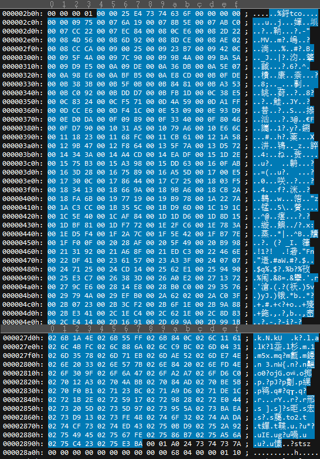

# mp4 文件二进制代码解读示例

- [mp4 文件二进制代码解读示例](#mp4-文件二进制代码解读示例)
  - [1 文件结构](#1-文件结构)
  - [2 文件 box 结构分析示例](#2-文件-box-结构分析示例)
  - [3 文件级 box](#3-文件级-box)
    - [3.1 File Type Box, ftyp](#31-file-type-box-ftyp)
    - [3.2 Movie Box](#32-movie-box)
    - [3.3 Meta Box](#33-meta-box)
      - [3.3.1 Handler Reference Box](#331-handler-reference-box)
    - [3.4 Media Data Box](#34-media-data-box)
  - [4 Movie Box 容器](#4-movie-box-容器)
    - [4.1 Movie Header Box](#41-movie-header-box)
    - [4.2 Track Box](#42-track-box)
    - [4.3 User Data Box](#43-user-data-box)
  - [5 Track Box 容器](#5-track-box-容器)
    - [5.1 Track Header Box](#51-track-header-box)
    - [5.2 Edit Box](#52-edit-box)
      - [5.2.1 Edit List Box](#521-edit-list-box)
    - [5.3 Media Box](#53-media-box)
  - [6 Media Box 容器](#6-media-box-容器)
    - [6.1 Media Header Box](#61-media-header-box)
    - [6.2 Handler Reference Box](#62-handler-reference-box)
    - [6.3 Media Information Box](#63-media-information-box)
  - [7 Media Information Box 容器](#7-media-information-box-容器)
    - [7.1 Data Information Box](#71-data-information-box)
      - [7.1.1 Data Reference Box](#711-data-reference-box)
    - [7.2 Sample Table Box](#72-sample-table-box)
    - [7.3 Video Media Header Box](#73-video-media-header-box)
    - [7.4 Sound Media Header Box](#74-sound-media-header-box)
  - [8 Sample Table Box 容器](#8-sample-table-box-容器)
    - [8.1 Sample Description Box](#81-sample-description-box)
    - [8.2 Decoding Time to Sample Box](#82-decoding-time-to-sample-box)
    - [8.3 Sample To Chunk Box](#83-sample-to-chunk-box)
    - [8.4 Chunk Offset Box](#84-chunk-offset-box)
    - [8.5 Sample Size Box](#85-sample-size-box)
    - [8.6 Sync Sample Box](#86-sync-sample-box)
    - [8.7 Composition Time to Sample Box](#87-composition-time-to-sample-box)
  - [9 MP4 的时间结构](#9-mp4-的时间结构)

## 1 文件结构

使用 UE 打开一个 MP4 文件，得到下面的二进制：


```code
aligned(8) class Box (unsigned int(32) boxtype,
          optional unsigned int(8)[16] extended_type) {
  unsigned int(32) size;
  unsigned int(32) type = boxtype;
  if (size==1) {
    unsigned int(64) largesize;
  } else if (size==0) {
    // box extends to end of file
  }
  if (boxtype==‘uuid’) {
    unsigned int(8)[16] usertype = extended_type;
  }
}
```

box 开头的 4 字节表示 box 大小，该大小包含其 header 和 body 大小。大小之后紧跟 4 字节表示 box 类型，一般是四字符。

有的 box 也包含一个版本号 version 和标记字段 flags。

```code
aligned(8) class FullBox(unsigned int(32) boxtype, unsigned int(8) v, bit(24) f)
  extends Box(boxtype) {
  unsigned int(8) version = v;
  bit(24) flags = f;
}
```

在分析文件结构时，每次先分析 8 个字节，前 4 字节对应 box 大小，以此找到下一个分析的位置(当前位置加上 box 大小)，后 4 字节是一个四字符串，对应特定类型的 box。根据 ISO 基本媒体规范找到该 box 对应的结构进行分析。

## 2 文件 box 结构分析示例

| # | # | # | # | # | # | 地址 | 大小 | 描述 |
| --- | --- | --- | --- | --- | --- | --- | --- | --- |
| ftyp |   |   |   |   |   | 0x00000000 | 0x18 | file type and compatibility |
| moov |   |   |   |   |   | 0x00000018 | 0x769f9 | container for all the metadata |
|   | mvhd |   |   |   |   | 0x00000020 | 0x6c | movie header, overall declarations |
|   | trak |   |   |   |   | 0x0000008c, 0x00044b54 | 0x44ac8, 0x31e48 | container for an individual track or stream |
|   |   | tkhd |   |   |   | 0x00000094, 0x00044b5c | 0x5c, 0x5c | track header, overall information about the track |
|   |   | edts |   |   |   | 0x000000f0 | 0x24 | edit list container |
|   |   |   | elst |   |   | 0x000000f8 | 0x1c | an edit list |
|   |   | mdia |   |   |   | 0x00000114, 0x00044bb8 | 0x44a40, 0x31de4 | container for the media information in a track |
|   |   |   | mdhd |   |   | 0x0000011c, 0x00044bc0 | 0x20, 0x20 | media header, overall information about the media |
|   |   |   | hdlr |   |   | 0x0000013c, 0x00044be0 | 0x5f, 0x5f | handler, declares the media (handler) type |
|   |   |   | minf |   |   | 0x0000019b, 0x00044c3f | 0x449b9, 0x31d5d | media information container |
|   |   |   |   | dinf |   | 0x000001a3, 0x00044c47 | 0x24, 0x24 | data information box, container |
|   |   |   |   |   | dref | 0x000001ab, 0x00044c4f | 0x1c, 0x1c | data reference box, declares source(s) of media data in track |
|   |   |   |   | stbl |   | 0x000001c7, 0x00044c6b | 0x44979, 0x31d21 | sample table box, container for the time/space map |
|   |   |   |   |   | stsd | 0x000001cf, 0x00044c73 | 0x99, 0x69 | sample descriptions (codec types, initialization etc.) |
|   |   |   |   |   | stts | 0x00000268, 0x00044cdc | 0x18, 0x18 | (decoding) time-to-sample |
|   |   |   |   |   | stsc | 0x00000280, 0x00044cf4 | 0x34, 0xc04 | sample-to-chunk, partial data-offset information |
|   |   |   |   |   | stco | 0x000002b4, 0x000458f8 | 0x25e4, 0x25e4 | chunk offset, partial data-offset information |
|   |   |   |   |   | stsz | 0x00002898, 0x00047edc | 0x1a024, 0x2eab0 | sample sizes (framing) |
|   |   |   |   |   | stss | 0x0001c8bc | 0x36c | sync sample table (random access points) |
|   |   |   |   |   | ctts | 0x0001cc28 | 0x27f18 | (composition) time to sample |
|   |   |   |   | vmhd |   | 0x00044b40 | 0x14 | video media header, overall information (video track only) |
|   |   |   |   | smhd |   | 0x0007698c | 0x10 | sound media header, overall information (sound track only) |
|   | udta |   |   |   |   | 0x0007699c | 0x75 | user-data |
| meta |   |   |   |   |   | 0x000769a4 | 0x6d | metadata |
|   | hdlr |   |   |   |   | 0x000769d1 | 0x40 | handler, declares the metadata (handler) type |
|   | ilst |   |   |   |   | 0x000769b0 | 0x21 | ??? |
| mdat |   |   |   |   |   | 0x00076a11 | 0x26e7e75 | media data container |

可以看出来，

$$ size(moov) = size(mvhd) + size(trak_1) + size(trak_2) + size(udta) + size(box) $$
$$ size(meta) = size(hdlr) + size(ilst) + size(FullBox) $$

其中，`size(box)=8`，且 `size(FullBox)=12`

对于单个 Track Box，(注意，第 2 个轨道没有 “edts”)

$$ size(trak) = size(tkhd) + size(edts) + size(mdia) + size(box) $$
$$ size(edts) = size(elst) + size(box) $$

对于单个 Media Box，

$$ size(mdia) = size(mdhd) + size(hdlr) + size(minf) + size(box) $$

对于单个 Media Information Box，(注意，第 1 个轨道和第 2 个轨道分别包含 “vmhd” 和 “smhd”)

$$ size(minf) = size(dinf) + size(stbl) + size(vmhd/smhd) + size(box) $$

对于单个 Sample Table Box，(注意，第 2 个轨道没有 “stss” 和 “ctts”)

$$ size(stbl) = size(stsd) + size(stts) + size(stsc) + size(stco) + size(stsz) + size(stss) + size(ctts) + size(box) $$

## 3 文件级 box

下面的 box 是位于文件顶层的 box，本文件示例主要包括四个：ftyp/moov/meta/mdat。

### 3.1 File Type Box, ftyp

File Type Box一般位于文件开头(即地址 `0x00000000`)，有且只有一个，主要标识文件规范。

```code
aligned(8) class FileTypeBox
  extends Box(‘ftyp’) {
  unsigned int(32) major_brand;
  unsigned int(32) minor_version;
  unsigned int(32) compatible_brands[]; // to end of the box
}
```

在二进制文件文件内对应：


- 32bit size: `0x18`，即 24 字节
- 32bit type: `0x66747970`，即 `ftyp`
- 32bit major_brand: `0x6d703432`，即 `mp42`
- 32bit minor_version: `0x00000000`
- 32bit compatible_brands[]: `0x69736f6d 6d703432`，即 `isommp42`

### 3.2 Movie Box

Movie Box 包含演示的元数据。一般紧随 “ftyp” 出现，同样有且只有一个。其中包含一个 “mvhd” 和若干个 “trak”。“mvhd” 一般作为 “moov” 的第一个子 box。

```code
aligned(8) class MovieBox extends Box(‘moov’){
}
```

在二进制文件文件内对应：


- 32bit size: `0x000769f9`，即 485881 字节
- 32bit type: `0x6d6f6f76`，即 `moov`

### 3.3 Meta Box

Meta box 包含描述性或注释性元数据，“meta” box 需要包含一个 “hdlr” box，指示 “meta” box 内容的结构或格式。

```code
aligned(8) class MetaBox (handler_type)
  extends FullBox(‘meta’, version = 0, 0) {
  HandlerBox(handler_type) theHandler;
  PrimaryItemBox primary_resource; // optional
  DataInformationBox file_locations; // optional
  ItemLocationBox item_locations; // optional
  ItemProtectionBox protections; // optional
  ItemInfoBox item_infos; // optional
  IPMPControlBox IPMP_control; // optional
  Box other_boxes[]; // optional
}
```

在二进制文件文件内对应：


- 32bit size: `0x0000006d`，即 109 字节(起始地址 0x00002898)
- 32bit type: `0x6d657461`，即 `meta`
- 8bit version: `0x00`，即对应版本 0
- 24bit flags: `0x0000`
- 33 字节的 Handler Reference Box
- 64 字节的的 “ilst” box ????

#### 3.3.1 Handler Reference Box

```code
aligned(8) class HandlerBox extends FullBox(‘hdlr’, version = 0, 0) {
  unsigned int(32) pre_defined = 0;
  unsigned int(32) handler_type;
  const unsigned int(32)[3] reserved = 0;
  string name;
}
```

在二进制文件文件内对应：


- 32bit size: `000000021`，即 33 字节
- 32bit type: `0x68646c72`，即 `hdlr`
- 8bit version: `0x00`，即对应版本 0
- 24bit flags: `0x000000`
- 32bit pre_defined: `0x00000000`
- 32bit handler_type: `0x6d646972`，即 `mdir`
- 32bit[3] reserved: `0x6170706c, 0x00000000, 0x00000000`
- string name: 剩余 1 字节，为 0x00

### 3.4 Media Data Box

Media Data Box 包含媒体数据

```code
aligned(8) class MediaDataBox extends Box(‘mdat’) {
  bit(8) data[];
}
```

在二进制文件文件内对应：


- 32bit size: `0x026e7e75`，即 40,795,765 字节(起始地址 0x00076a11)
- 32bit type: `0x6d646174`，即 `mdat`
- 8bit data: 结束地址在 0x0275e885，即文件末尾，data 一共有 40,795,757 个数组元素

## 4 Movie Box 容器

### 4.1 Movie Header Box

Movie Header Box 定义了和媒体无关的整体信息，并且与整个演示相关。一般作为 “moov” 的第一个子 box 出现。

```code
aligned(8) class MovieHeaderBox extends FullBox(‘mvhd’, version, 0) {
  if (version==1) {
    unsigned int(64) creation_time;
    unsigned int(64) modification_time;
    unsigned int(32) timescale;
    unsigned int(64) duration;
  } else { // version==0
    unsigned int(32) creation_time;
    unsigned int(32) modification_time;
    unsigned int(32) timescale;
    unsigned int(32) duration;
  }
  template int(32) rate = 0x00010000; // typically 1.0
  template int(16) volume = 0x0100; // typically, full volume
  const bit(16) reserved = 0;
  const unsigned int(32)[2] reserved = 0;
  template int(32)[9] matrix =
    { 0x00010000,0,0,0,0x00010000,0,0,0,0x40000000 };
    // Unity matrix
  bit(32)[6] pre_defined = 0;
  unsigned int(32) next_track_ID;
} 
```

在二进制文件文件内对应：


- 32bit size: `0x0000006c`，即 108 字节
- 32bit type: `0x6d766864`，即 `mvhd`
- 8bit version: `0x00`，即对应版本 0
- 24bit flags: `0x000000`
- 32bit creation_time: `0xd8a8fc08`
- 32bit modification_time: `0xd8a8fc08`
- 32bit timescale: `0x00003000`
- 32bit duration: `0x00d008ea`
- 32bit rate: `0x00010000`，表示播放影片的首选速率是 1.0，即正常前向播放
- 16bit volume: `0x0100`，表示首选的回放音量是 1.0，即全音量
- 16bit reserved: `0x0000`
- 32bit[2] reserved: `0x00000000` x2
- 32bit[9] matrix: `0x00010000, 0x00000000, 0x00000000, 0x00000000, 0x00010000, 0x00000000, 0x00000000, 0x00000000,0x40000000`，表示视频转化矩阵
- 32bit[6] pre_defined: `0x00000000` x6
- 32bit next_track_ID: `0x00000003`，指示要添加到影片的下一个轨道所用的轨道 ID 值。本影片已经包含两个轨道

### 4.2 Track Box

这是一个容器 box，用于演示的单个轨道。每个演示包含一个或多个轨道。每个轨道都独立于演示中的其他轨道，并携带自己的时间和空间信息。每个轨道将包含其关联的 Media Box。

```code
aligned(8) class TrackBox extends Box(‘trak’) {
}
```

在二进制文件文件内对应：


- 32bit size: `0x00044ac8`，即 108 字节
- 32bit type: `0x7472616b`，即 `trak`

在 0x00044b54 处又有一个 Track Box。

在二进制文件文件内对应：


- 32bit size: `0x00031e48`，即 204360 字节
- 32bit type: `0x7472616b`，即 `trak`

### 4.3 User Data Box

User Data Box 是容器 box，用于提供用户数据信息。

```code
aligned(8) class UserDataBox extends Box(‘udta’) {
}
```

在二进制文件文件内对应：


- 32bit size: `0x00000075`，即 117 字节(起始地址 0x00002898)
- 32bit type: `0x75647461`，即 `udta`

## 5 Track Box 容器

每个 “trak” 必须有一个 “tkhd” 和 “mdia”，分别表示整个轨道的演示信息和整个媒体的演示信息。

### 5.1 Track Header Box

Track Header Box 指定单个轨道的特征。每个轨道中仅有且只有一个 Track Header Box。

```code
aligned(8) class TrackHeaderBox
  extends FullBox(‘tkhd’, version, flags){
  if (version==1) {
    unsigned int(64) creation_time;
    unsigned int(64) modification_time;
    unsigned int(32) track_ID;
    const unsigned int(32) reserved = 0;
    unsigned int(64) duration;
  } else { // version==0
    unsigned int(32) creation_time;
    unsigned int(32) modification_time;
    unsigned int(32) track_ID;
    const unsigned int(32) reserved = 0;
    unsigned int(32) duration;
  }
  const unsigned int(32)[2] reserved = 0;
  template int(16) layer = 0;
  template int(16) alternate_group = 0;
  template int(16) volume = {if track_is_audio 0x0100 else 0};
  const unsigned int(16) reserved = 0;
  template int(32)[9] matrix=
    { 0x00010000,0,0,0,0x00010000,0,0,0,0x40000000 };
    // unity matrix
  unsigned int(32) width;
  unsigned int(32) height;
}
```

在二进制文件文件内对应：


- 32bit size: `0x0000005c`，即 92 字节
- 32bit type: `0x746b6864`，即 `tkhd`
- 8bit version: `0x00`，即对应版本 0
- 24bit flags: `0x000003`，设置了 track_enabled 和 track_in_movie
- 32bit creation_time: `0xd8a8fc08`
- 32bit modification_time: `0xd8a8fc08`
- 32bit track_ID: `0x00000001`
- 32bit reserved: `0x00000000`
- 32bit duration: `0x00d00800`
- 32bit[2] reserved: `0x00000000` x2
- 16bit layer: `0x0000`，表示视频层，0 是正常值
- 16bit alternate_group: `0x0000`，表示和其他轨道没有关系
- 16bit volume: `0x0000`，表示非音频轨道
- 16bit reserved: `0x0000`
- 32bit[9] matrix: `0x00010000, 0x00000000, 0x00000000, 0x00000000, 0x00010000, 0x00000000, 0x00000000, 0x00000000,0x40000000`
- 32bit width: `0x05000000`，即 1280
- 32bit height: `0x02d00000`，即 720

在 0x00044b5c 处又有一个 Track Header Box。

在二进制文件文件内对应：


- 32bit size: `0x0000005c`，即 92 字节
- 32bit type: `0x746b6864`，即 `tkhd`
- 8bit version: `0x00`，即对应版本 0
- 24bit flags: `0x000003`，设置了 track_enabled 和 track_in_movie
- 32bit creation_time: `0xd8a8fc08`
- 32bit modification_time: `0xd8a8fc08`
- 32bit track_ID: `0x00000002`
- 32bit reserved: `0x00000000`
- 32bit duration: `0x00d008ea`
- 32bit[2] reserved: `0x00000000` x2
- 16bit layer: `0x0000`
- 16bit alternate_group: `0x0000`，表示和其他轨道没有关系
- 16bit volume: `0x0100`，表示音频轨道，全音量
- 16bit reserved: `0x0000`
- 32bit[9] matrix: `0x00010000, 0x00000000, 0x00000000, 0x00000000, 0x00010000, 0x00000000, 0x00000000, 0x00000000,0x40000000`
- 32bit width: `0x00000000`
- 32bit height: `0x00000000`

### 5.2 Edit Box

Edit Box 将演示时间线映射到存储在文件中的媒体时间线。

```code
aligned(8) class EditBox extends Box(‘edts’) {
}
```

在二进制文件文件内对应：


- 32bit size: `0x00000024`，即 36 字节
- 32bit type: `0x65647473`，即 `edts`

#### 5.2.1 Edit List Box

Edit List Box 包含一个显式的时间线映射。每个条目定义轨道时间线的一部分：通过映射媒体时间线的一部分，或通过指示“空”时间，或通过定义 “dwell”，对应媒体内的单个时间点将保持一段时间。

```code
aligned(8) class EditListBox extends FullBox(‘elst’, version, 0) {
  unsigned int(32) entry_count;
  for (i=1; i <= entry_count; i++) {
  if (version==1) {
    unsigned int(64) segment_duration;
    int(64) media_time;
  } else { // version==0
    unsigned int(32) segment_duration;
    int(32) media_time;
  }
  int(16) media_rate_integer;
  int(16) media_rate_fraction = 0;
  }
}
```

在二进制文件文件内对应：


- 32bit size: `0x0000001c`，即 28 字节
- 32bit type: `0x656c7374`，即 `elst`
- 8bit version: `0x00`，即对应版本 0
- 24bit flags: `0x000000`
- 32bit entry_count: `0x00000001`，表示列表中只有一个条目
  - 条目 1
    - 32bit segment_duration: `0xd0080000`
    - 32bit media_time: `0x00000200`
- 16bit media_rate_integer: `0x0001`
- 16bit media_rate_fraction: `0x0000`

### 5.3 Media Box

Media Box 声明容器包含所有对象，声明了轨道内媒体数据的信息。

```code
aligned(8) class MediaBox extends Box(‘mdia’) {
}
```

在二进制文件文件内对应：


- 32bit size: `0x00044a40`，即 281152 字节
- 32bit type: `0x6d646961`，即 `mdia`

在 0x00044bb8 处又有一个 Media Box。

在二进制文件文件内对应：


- 32bit size: `0x00031de4`，即 204260 字节
- 32bit type: `0x6d646961`，即 `mdia`

## 6 Media Box 容器

“mdia” 通常包含一个 “mdhd”、一个 “hdlr” 和一个 “minf”。

### 6.1 Media Header Box

Media Header Box 声明了与媒体无关，且与轨道中的媒体特征相关的整体信息。

```code
aligned(8) class MediaHeaderBox extends FullBox(‘mdhd’, version, 0) {
  if (version==1) {
    unsigned int(64) creation_time;
    unsigned int(64) modification_time;
    unsigned int(32) timescale;
    unsigned int(64) duration;
  } else { // version==0
    unsigned int(32) creation_time;
    unsigned int(32) modification_time;
    unsigned int(32) timescale;
    unsigned int(32) duration;
  }
  bit(1) pad = 0;
  unsigned int(5)[3] language; // ISO-639-2/T language code
  unsigned int(16) pre_defined = 0;
}
```

在二进制文件文件内对应：


- 32bit size: `0x00000020`，即 32 字节
- 32bit type: `0x6d646864`，即 `mdhd`
- 8bit version: `0x00`，即对应版本 0
- 24bit flags: `0x000000`
- 32bit creation_time: `0xd8a8fc08`
- 32bit modification_time: `0xd8a8fc08`
- 32bit timescale: `0x00003000`
- 32bit duration: `0x00d00800`
- 1bit pad: `0x0`
- 5bit[3] language: `0x15 0xe 0x4`
- 16bit pre_defined: `0x0000`

在 0x00044bb8 处又有一个 Media Box。

在二进制文件文件内对应：


- 32bit size: `0x00000020`，即 32 字节
- 32bit type: `0x6d646864`，即 `mdhd`
- 8bit version: `0x00`，即对应版本 0
- 24bit flags: `0x000000`
- 32bit creation_time: `0xd8a8fc08`
- 32bit modification_time: `0xd8a8fc08`
- 32bit timescale: `0x0000ac44`，即 44100
- 32bit duration: `0x02ea9c00`，即 48,929,792
- 1bit pad: `0x0`
- 5bit[3] language: `0x5 0xe 0x7`
- 16bit pre_defined: `0x0000`

### 6.2 Handler Reference Box

Handler Reference Box 声明展示轨道中媒体数据的过程，从而声明轨道中媒体的性质。例如，视频轨道将由视频 handler 处理。

```code
aligned(8) class HandlerBox extends FullBox(‘hdlr’, version = 0, 0) {
  unsigned int(32) pre_defined = 0;
  unsigned int(32) handler_type;
  const unsigned int(32)[3] reserved = 0;
  string name;
}
```

在二进制文件文件内对应：


- 32bit size: `00000005f`，即 95 字节
- 32bit type: `0x68646c72`，即 `hdlr`
- 8bit version: `0x00`，即对应版本 0
- 24bit flags: `0x000000`
- 32bit pre_defined: `0x00000000`
- 32bit handler_type: `0x76696465`，即 `vide`
- 32bit[3] reserved: `0x00000000` x3
- string name: 剩余 63 字节

在 0x00044be0 处又有一个 Handler Reference Box。

在二进制文件文件内对应：


- 32bit size: `00000005f`，即 95 字节
- 32bit type: `0x68646c72`，即 `hdlr`
- 8bit version: `0x00`，即对应版本 0
- 24bit flags: `0x000000`
- 32bit pre_defined: `0x00000000`
- 32bit handler_type: `0x736f746e`，即 `soun`
- 32bit[3] reserved: `0x00000000` x3
- string name: 剩余 63 字节

### 6.3 Media Information Box

Media Information Box 声明轨道中媒体的特征信息。一般包含一个 “dinf”、“stbl”，并包含一个 header box，这取决于媒体类型，可能是 vmhd/smhd/hmhd/nmhd。

```code
aligned(8) class MediaInformationBox extends Box(‘minf’) {
} 
```

在二进制文件文件内对应：


- 32bit size: `0x000449b9`，即 281017 字节
- 32bit type: `0x6d696e66`，即 `minf`

在 0x00044c3f 处又有一个 Media Information Box。

在二进制文件文件内对应：


- 32bit size: `0x00031d5d`，即 204,125 字节
- 32bit type: `0x6d696e66`，即 `minf`

## 7 Media Information Box 容器

### 7.1 Data Information Box

Data Information Box 声明轨道内媒体信息位置。

```code
aligned(8) class DataInformationBox extends Box(‘dinf’) {
}
```

在二进制文件文件内对应：


- 32bit size: `0x00000024`，即 36 字节
- 32bit type: `0x64696e66`，即 `dinf`

#### 7.1.1 Data Reference Box

“dinf” 一般包含一个 “dref”。“dref” 中会包含若干个 “url” 或 “urn”，这些 box 组成一个表，用于定位轨道数据。也就是说，将轨道分成若干段，每一段都可以根据 “url” 或 “urn” 指向的地址获取数据。一般情况下，当数据完全包含在文件中时，“url” 或 “urn” 的 location 字符串为空。

```code
aligned(8) class DataEntryUrlBox (bit(24) flags)
  extends FullBox(‘url ’, version = 0, flags) {
  string location;
}
aligned(8) class DataEntryUrnBox (bit(24) flags)
  extends FullBox(‘urn ’, version = 0, flags) {
  string name;
  string location;
}
aligned(8) class DataReferenceBox
  extends FullBox(‘dref’, version = 0, 0) {
  unsigned int(32) entry_count;
  for (i=1; i <= entry_count; i++) { entry_count; i++) {
    DataEntryBox(entry_version, entry_flags) data_entry;
  }
} 
```

在二进制文件文件内对应：


- 32bit size: `0x0000001c`，即 28 字节
- 32bit type: `0x64726566`，即 `dref`
- 8bit version: `0x00`，即对应版本 0
- 24bit flags: `0x000000`
- 32bit entry_count: `0x00000001`，表示下表只有一个条目
  - 条目 1
    - 32bit size: `0x0000000c`，即 12 字节
    - 32bit type: `0x75726c20`，即 `url`
    - 8bit version: `0x00`，即对应版本 0
    - 24bit flags: `0x000001`
    - string location: 剩余 0 个字节

在 0x00044c47 处又有一个 Data Information Box。其中包含一个 Data Reference Box。

在二进制文件文件内对应：


- 32bit size: `0x00000024`，即 36 字节
- 32bit type: `0x64696e66`，即 `dinf`


- 32bit size: `0x0000001c`，即 28 字节
- 32bit type: `0x64726566`，即 `dref`
- 8bit version: `0x00`，即对应版本 0
- 24bit flags: `0x000000`
- 32bit entry_count: `0x00000001`，表示下表只有一个条目
  - 条目 1
    - 32bit size: `0x0000000c`，即 12 字节
    - 32bit type: `0x75726c20`，即 `url`
    - 8bit version: `0x00`，即对应版本 0
    - 24bit flags: `0x000001`
    - string location: 剩余 0 个字节

### 7.2 Sample Table Box

Sample Table Box 包含轨道内媒体采样的所有时间和数据索引。使用这里的表格，可以及时定位采样、确定采样类型(例如是否是 I 帧)，并确定采样的大小、容器以及到该容器的偏移。

```code
aligned(8) class SampleTableBox extends Box(‘stbl’) {
}
```

在二进制文件文件内对应：


- 32bit size: `0x00044979`，即 281017 字节
- 32bit type: `0x7374626c`，即 `stbl`

在 0x00044c6b 处又有一个 Sample Table Box。

在二进制文件文件内对应：


- 32bit size: `0x00031d21`，即 204,065 字节
- 32bit type: `0x7374626c`，即 `stbl`

### 7.3 Video Media Header Box

Video Media Header Box 包含视频媒体的常规演示信息，与编码无关。请注意 flags 字段值为 1。

```code
aligned(8) class VideoMediaHeaderBox
  extends FullBox(‘vmhd’, version = 0, 1) {
  template unsigned int(16) graphicsmode = 0; // copy, see below
  template unsigned int(16)[3] opcolor = {0, 0, 0};
}
```

在二进制文件文件内对应：


- 32bit size: `0x00000014`，即 20 字节(起始地址 0x00044B40)
- 32bit type: `0x766d6864`，即 `vmhd`
- 8bit version: `0x00`，即对应版本 0
- 24bit flags: `0x000001`
- 16bit graphicsmode: `0x0000`
- 16bit[3] opcolor: `0x0000` x3

### 7.4 Sound Media Header Box

Sound Media Header Box 包含音频媒体的常规演示信息，与编码无关。此头部用于所有包含音频的轨道。

```code
aligned(8) class SoundMediaHeaderBox
  extends FullBox(‘smhd’, version = 0, 0) {
  template int(16) balance = 0;
  const unsigned int(16) reserved = 0;
}
```

在二进制文件文件内对应：


- 32bit size: `0x00000010`，即 16 字节(起始地址 0x0007698c)
- 32bit type: `0x766d6864`，即 `smhd`
- 8bit version: `0x00`，即对应版本 0
- 24bit flags: `0x0000`
- 16bit balance: `0x0000`
- 16bit reserved: `0x0000`

## 8 Sample Table Box 容器

### 8.1 Sample Description Box

Sample Description Box 提供了有关使用的编码类型的详细信息，以及该编码所需的任何初始化信息。必须存在一个 “stsd”，且其中至少包含一个条目。

```code
aligned(8) abstract class SampleEntry (unsigned int(32) format)
  extends Box(format){
  const unsigned int(8)[6] reserved = 0;
  unsigned int(16) data_reference_index;
}
class HintSampleEntry() extends SampleEntry (protocol) {
  unsigned int(8) data [];
}
// Visual Sequences
class VisualSampleEntry(codingname) extends SampleEntry (codingname){
  unsigned int(16) pre_defined = 0;
  const unsigned int(16) reserved = 0;
  unsigned int(32)[3] pre_defined = 0;
  unsigned int(16) width;
  unsigned int(16) height;
  template unsigned int(32) horizresolution = 0x00480000; // 72 dpi
  template unsigned int(32) vertresolution = 0x00480000; // 72 dpi
  const unsigned int(32) reserved = 0;
  template unsigned int(16) frame_count = 1;
  string[32] compressorname;
  template unsigned int(16) depth = 0x0018;
  int(16) pre_defined = -1;
}
// Audio Sequences
class AudioSampleEntry(codingname) extends SampleEntry (codingname){
  const unsigned int(32)[2] reserved = 0;
  template unsigned int(16) channelcount = 2;
  template unsigned int(16) samplesize = 16;
  unsigned int(16) pre_defined = 0;
  const unsigned int(16) reserved = 0 ;
  template unsigned int(32) samplerate = {timescale of media}<<16;
}
aligned(8) class SampleDescriptionBox (unsigned int(32) handler_type)
  extends FullBox('stsd', 0, 0){
  int i ;
  unsigned int(32) entry_count;
  for (i = 1 ; i <= entry_count ; i++){
    switch (handler_type){
      case ‘soun’: // for audio tracks
        AudioSampleEntry();
        break;
      case ‘vide’: // for video tracks
        VisualSampleEntry();
        break;
      case ‘hint’: // Hint track
        HintSampleEntry();
        break;
    }
  }
} 
```

在二进制文件文件内对应：


- 32bit size: `0x00000099`，即 153 字节 (起始地址 0x000001cf)
- 32bit type: `0x73747364`，即 `stsd`
- 8bit version: `0x00`，即对应版本 0
- 24bit flags: `0x000000`
- 32bit entry_count: `0x00000001`，表示下表有一个条目
  - 条目 1，根据之前的 “hdlr” 值为 “vide”，对应 VisualSampleEntry
    - 32bit size: `0x00000089`，即 137 字节
    - 32bit type: `0x61766331`，即 `avc1` (起始地址)
    - 8bit[6] reserved: `0x00` x6
    - 16bit data_reference_index: `0x0001`
    - 16bit pre_defined: `0x0000`
    - 16bit reserved: `0x0000`
    - 32bit[3] pre_defined: `0x00000000` x3
    - 16bit width: `0x0500`，即 1280
    - 16bit height: `0x02d0`，即 720
    - 32bit horizresolution: `0x00480000`，水平分辨率
    - 32bit vertresolution: `0x00480000`，垂直分辨率
    - 32bit reserved: `0x00000000`
    - 16bit frame_count: `0x0001`，表示每个采样包含一帧
    - 8bit[32] compressorname: `0x00` x32
    - 16bit depth: `0x0018`，视频的色深，表示 24 位色
    - 16bit pre_defined: `0xffff`

box 结束地址是 0x00000267。

在 0x00044c73 处又有一个 Sample Description Box。

在二进制文件文件内对应：


- 32bit size: `0x00000069`，即 105 字节
- 32bit type: `0x73747364`，即 `stsd`
- 8bit version: `0x00`，即对应版本 0
- 24bit flags: `0x000000`
- 32bit entry_count: `0x00000001`，表示下表有一个条目
  - 条目 1，根据之前的 “hdlr” 值为 “soun”，对应 AudioSampleEntry
    - 32bit size: `0x00000059`，即 89 字节
    - 32bit type: `0x6d703461`，即 `mp4a`
    - 8bit[6] reserved: `0x00` x6
    - 16bit data_reference_index: `0x0001`
    - 32bit[2] reserved: `0x00000000` x2
    - 16bit channelcount: `0x0002`，声道数为 2
    - 16bit samplesize: `0x0010`，采样宽度为 16bit
    - 16bit pre_defined: `0x0000`
    - 16bit reserved: `0x0000`
    - 32bit samplerate: `0xac440000`，即 `{timescale of media}<<16`

box 结束地址是 0x00044cdb。

### 8.2 Decoding Time to Sample Box

Decoding Time to Sample Box 包含解码时间到采样编号的索引，是一个压缩的表。在其他表格中提供每个采样的大小和指针。此表中的每个条目给出具有相同时间增量的连续采样的数目，以及这些采样的增量。通过累加这些增量可以构建完整的采样时间图。

```code
aligned(8) class TimeToSampleBox
  extends FullBox(’stts’, version = 0, 0) {
  unsigned int(32) entry_count;
  int i;
  for (i=0; i < entry_count; i++) {
    unsigned int(32) sample_count;
    unsigned int(32) sample_delta;
  }
}
```

在二进制文件文件内对应：


- 32bit size: `0x00000018`，即 24 字节
- 32bit type: `0x73747473`，即 `stts`
- 8bit version: `0x00`，即对应版本 0
- 24bit flags: `0x000000`
- 32bit entry_count: `0x00000001`，表示下表只有一个条目（视频帧率不变）
  - 条目 1
    - 32bit sample_count: `0x00006804`，表示有 26628 帧视频
    - 32bit sample_delta: `0x00000200`，“mdhd” 中 timescale 是 0x3000，相除得到帧率是 24

在 0x00044cdc 处又有一个 Decoding Time to Sample Box。

在二进制文件文件内对应：


- 32bit size: `0x00000018`，即 24 字节
- 32bit type: `0x73747473`，即 `stts`
- 8bit version: `0x00`，即对应版本 0
- 24bit flags: `0x000000`
- 32bit entry_count: `0x00000001`，表示下表只有一个条目（音频采样率不变）
  - 条目 1
    - 32bit sample_count: `0x0000baa7`，表示有 47,783 个音频采样
    - 32bit sample_delta: `0x00000400`，“mdhd” 中 timescale 是 0xac44，相除得到帧率是 43.066

### 8.3 Sample To Chunk Box

媒体内的采样被分组成块。块大小可以不同，且同一块中的采样大小可以不同。Sample To Chunk Box 可用于查找包含采样的块，块的位置和相关的采样描述。

每个条目给出一组块的第一个块的索引，这些块具有相同特征。通过从上一个条目减去一个条目，可以计算该组有多少块。你可以将其乘以合适的“采样数/块”从而转换为采样数。

```code
aligned(8) class SampleToChunkBox
  extends FullBox(‘stsc’, version = 0, 0) {
  unsigned int(32) entry_count;
  for (i=1; i <= entry_count; i++) {
    unsigned int(32) first_chunk;
    unsigned int(32) samples_per_chunk;
    unsigned int(32) sample_description_index;
  }
}
```

在二进制文件文件内对应：


- 32bit size: `0x00000034`，即 52 字节
- 32bit type: `0x73747363`，即 `stsc`
- 8bit version: `0x00`，即对应版本 0
- 24bit flags: `0x000000`
- 32bit entry_count: `0x00000003`，表示下表有 3 个条目
  - 条目 1
    - 32bit first_chunk: `0x00000001`，对应第一个块
    - 32bit samples_per_chunk: `0x0000000c`，表示每个块有 12 个采样
    - 32bit sample_description_index: `0x00000001`
  - 条目 2
    - 32bit first_chunk: `0x00000006`
    - 32bit samples_per_chunk: `0x0000000b`，表示每个块有 11 个采样
    - 32bit sample_description_index: `0x00000001`
  - 条目 3
    - 32bit first_chunk: `0x00000975`
    - 32bit samples_per_chunk: `0x00000003`，表示每个块有 3 个采样
    - 32bit sample_description_index: `0x00000001`

在 0x00044cf4 处又有一个 Sample To Chunk Box。

在二进制文件文件内对应：


- 32bit size: `0x00000c04`，即 3076 字节
- 32bit type: `0x73747363`，即 `stsc`
- 8bit version: `0x00`，即对应版本 0
- 24bit flags: `0x000000`
- 32bit entry_count: `0x000000ff`，表示下表有 255 个条目
  - 条目 1
    - 32bit first_chunk: `0x00000001`
    - 32bit samples_per_chunk: `0x00000015`，表示每个块有 21 个采样
    - 32bit sample_description_index: `0x00000001`
  - 条目 2
    - 32bit first_chunk: `0x0000000b`
    - 32bit samples_per_chunk: `0x00000014`，表示每个块有 20 个采样
    - 32bit sample_description_index: `0x00000001`
  - 条目 3
    - 32bit first_chunk: `0x0000000c`
    - 32bit samples_per_chunk: `0x00000013`，表示每个块有 19 个采样
    - 32bit sample_description_index: `0x00000001`
  - ......
  - 条目 255
    - 32bit first_chunk: `0x00000975`
    - 32bit samples_per_chunk: `0x00000003`，表示每个块有 3 个采样
    - 32bit sample_description_index: `0x00000001` (地址 0x000458f7)

### 8.4 Chunk Offset Box

Chunk Offset Box 给出每个块到包含该块的文件的索引。

```code
aligned(8) class ChunkOffsetBox
  extends FullBox(‘stco’, version = 0, 0) {
  unsigned int(32) entry_count;
  for (i=1; i <= entry_count; i++) {
    unsigned int(32) chunk_offset;
  }
}
```

在二进制文件文件内对应：



- 32bit size: `0x000025e4`，即 9700 字节(起始地址 0x000002b4)
- 32bit type: `0x7374636f`，即 `stco`
- 8bit version: `0x00`，即对应版本 0
- 24bit flags: `0x000000`
- 32bit entry_count: `0x00000975`，表示下表有 2421 个条目
  - 条目 1
    - 32bit chunk_offset: `0x00076a19`，对应 “mdat” 中第一个 data 的位置
  - 条目 2
    - 32bit chunk_offset: `0x00078b5e`
  - 条目 3
    - 32bit chunk_offset: `0x0007abc0`
  - ......
  - 条目 2421
    - 32bit chunk_offset: `0x0275e3ba` (地址 0x00002897)

在 0x000458f8 处又有一个 Chunk Offset Box。

在二进制文件文件内对应：


- 32bit size: `0x000025e4`，即 9700 字节(起始地址 0x000458f8)
- 32bit type: `0x7374636f`，即 `stco`
- 8bit version: `0x00`，即对应版本 0
- 24bit flags: `0x000000`
- 32bit entry_count: `0x00000975`，表示下表有 2421 个条目
  - 条目 1
    - 32bit chunk_offset: `0x00076ce5`
  - 条目 2
    - 32bit chunk_offset: `0x00078d46`
  - 条目 3
    - 32bit chunk_offset: `0x0007ada8`
  - ......
  - 条目 2421
    - 32bit chunk_offset: `0x0275e42b` (地址 0x000047edb)

### 8.5 Sample Size Box

Sample Size Box 包含采样计数和一个表格，该表给出每个采样的字节数。这允许媒体数据本身未分帧。媒体中的采样总数始终显示在采样计数中。

```code
aligned(8) class SampleSizeBox extends FullBox(‘stsz’, version = 0, 0) {
  unsigned int(32) sample_size;
  unsigned int(32) sample_count;
  if (sample_size==0) {
    for (i=1; i <= sample_count; i++) {
      unsigned int(32) entry_size;
    }
  }
}
```

在二进制文件文件内对应：


- 32bit size: `0x0001a024`，即 106532 字节(起始地址 0x00002898)
- 32bit type: `0x7374737a`，即 `stsz`
- 8bit version: `0x00`，即对应版本 0
- 24bit flags: `0x000000`
- 32bit sample_size: `0x00000000`，表示采样大小不相同
- 32bit sample_count: `0x00006804`，表示下表有 26628 个条目
  - 条目 1
    - 32bit entry_size: `0x00000110`，即 272 字节
  - 条目 2
    - 32bit entry_size: `0x00000029`，即 41 字节
  - 条目 3
    - 32bit entry_size: `0x00000026`，即 38 字节
  - ...
  - 条目 1
    - 32bit entry_size: `0x00000025`，即 67 字节 (地址 0x0001c8bb)

在 0x000047edc 处又有一个 Chunk Offset Box。

在二进制文件文件内对应：


- 32bit size: `0x0002eab0`，即 191,152 字节(起始地址 0x00002898)
- 32bit type: `0x7374737a`，即 `stsz`
- 8bit version: `0x00`，即对应版本 0
- 24bit flags: `0x000000`
- 32bit sample_size: `0x00000000`，表示采样大小不相同
- 32bit sample_count: `0x0000baa7`，表示下表有 47,783 个条目
  - 条目 1
    - 32bit entry_size: `0x00000173`，即 371 字节
  - 条目 2
    - 32bit entry_size: `0x00000174`，即 372 字节
  - 条目 3
    - 32bit entry_size: `0x00000173`，即 371 字节
  - ...
  - 条目 1
    - 32bit entry_size: `0x00000174`，即 372 字节 (地址 0x0007698b)

### 8.6 Sync Sample Box

Sync Sample Box 提供了流内随机访问点的紧凑标记。该表按采样编号的严格递增顺序排序。

```code
aligned(8) class SyncSampleBox
  extends FullBox(‘stss’, version = 0, 0) {
  unsigned int(32) entry_count;
  int i;
  for (i=0; i < entry_count; i++) {
    unsigned int(32) sample_number;
  }
 }
```

在二进制文件文件内对应：


- 32bit size: `0x0000036c`，即 876 字节(起始地址 0x0001c8bc)
- 32bit type: `0x73747373`，即 `stss`
- 8bit version: `0x00`，即对应版本 0
- 24bit flags: `0x000000`
- 32bit entry_count: `0x000000d7`，表示下表有 215 个条目
  - 条目 1
    - 32bit sample_number: `0x00000001`，即采样编号为 1
  - 条目 2
    - 32bit sample_number: `0x00000081`，即采样编号为 129
  - 条目 3
    - 32bit sample_number: `0x00000101`，即采样编号为 257
  - ...
  - 条目 1
    - 32bit sample_number: `0x00006801`，即采样编号为 26625 (地址 0x0001cc27)

### 8.7 Composition Time to Sample Box

Composition Time to Sample Box 提供解码时间和合成时间的偏移量。因为解码时间必须小于合成时间，偏移表示为无符号数，以使 CT(n)=DT(n)+CTTS(n)，其中 CTTS(n) 是采样 n 的(未压缩)表条目。sample_count 表示具有给定偏移量的连续采样的数目。

```code
aligned(8) class CompositionOffsetBox
  extends FullBox(‘ctts’, version = 0, 0) {
  unsigned int(32) entry_count;
  int i;
  for (i=0; i < entry_count; i++) {
    unsigned int(32) sample_count;
    unsigned int(32) sample_offset;
  }
}
```

在二进制文件文件内对应：


- 32bit size: `0x00027f18`，即 163608 字节(起始地址 0x0001cc28)
- 32bit type: `0x63747473`，即 `ctts`
- 8bit version: `0x00`，即对应版本 0
- 24bit flags: `0x000000`
- 32bit entry_count: `0x00004fe1`，表示下表有 20449 个条目
  - 条目 1
    - 32bit sample_count: `0x00000001`，即采样数为 1
    - 32bit sample_offset: `0x00000200`，即 CT 和 DT 的偏移量为 512
  - 条目 2
    - 32bit sample_count: `0x00000001`，即采样数为 1
    - 32bit sample_offset: `0x00000600`，即 CT 和 DT 的偏移量为 1536
  - 条目 3
    - 32bit sample_count: `0x00000002`，即采样数为 2
    - 32bit sample_offset: `0x00000000`，即 CT 和 DT 的偏移量为 0
  - ...
  - 条目 1
    - 32bit sample_count: `0x00000001`，即采样数为 1
    - 32bit sample_offset: `0x00000600`，即 CT 和 DT 的偏移量为 1536 (地址 0x00044B3f)

## 9 MP4 的时间结构

文件中的影片和每个轨道都有一个时间刻度，即 timescale。它定义了一个时间轴来说明每秒的滴答(tick)数。上述示例中，有 3 个时间刻度：

- Movie Header Box 中 timescale 为 0x3000
- Media Header Box 中 timescale 指定对应媒体的时间刻度
  - 第一个 timescale 为 0x3000，对应视频媒体
  - 第二个 timescale 为 0xac44，对应音频媒体的采样率，即 44.1 kHz

另外，在三处分别定义了对应的时长，即 duration

- Movie Header Box 中 duration 为 0xd008ea，除以对应 timescale(0x3000)，得到 0x455，即 1109 秒，即 18 分 29 秒，表示整个影片的时长，对应演示最长轨道的时长
- Track Header Box 中 duration 以 Movie Header Box 中的 timescale 为单位，表示对应轨道的时长
  - 第一个 duration 为 0xd00800，对应视频轨道时长(0x455)
  - 第二个 duration 为 0xd008ea，对应音频轨道时长(0x455)
- Media Header Box 中 duration 以 Media Header Box 中的 timescale 为单位，表示对应媒体的时长
  - 第一个 duration 为 0xd00800，对应视频媒体时长(0x455)
  - 第二个 duration 为 0x2ea9c00，对应音频媒体时长(0x455)
