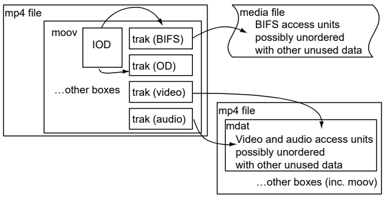
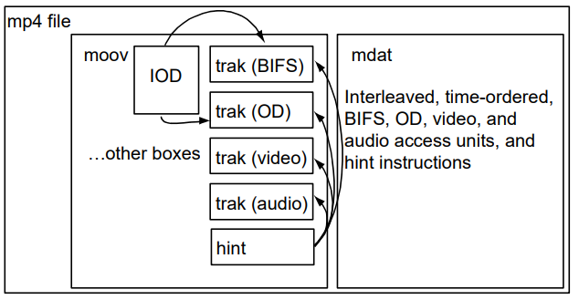

# MP4 文件格式

- [MP4 文件格式](#mp4-文件格式)
  - [概念](#概念)
  - [介绍](#介绍)
    - [0.1 派生](#01-派生)
    - [0.2 交换](#02-交换)
    - [0.3 内容创建](#03-内容创建)
    - [0.4 流传输的准备](#04-流传输的准备)
  - [1 范围](#1-范围)
  - [3 MPEG-4 的存储](#3-mpeg-4-的存储)
    - [3.1 基本流轨道](#31-基本流轨道)
      - [3.1.1 基本流数据](#311-基本流数据)
      - [3.1.2 基本流描述符](#312-基本流描述符)
      - [3.1.3 对象描述符](#313-对象描述符)
    - [3.2 轨道标识符](#32-轨道标识符)
    - [3.3 流同步](#33-流同步)
    - [3.4 合成](#34-合成)
    - [3.5 FlexMux 的处理](#35-flexmux-的处理)
  - [4 文件识别](#4-文件识别)
  - [5 基本媒体格式的增加内容](#5-基本媒体格式的增加内容)
    - [5.1 Object Descriptor Box](#51-object-descriptor-box)
    - [5.2 轨道引用类型](#52-轨道引用类型)
    - [5.3 Track Header Box](#53-track-header-box)
    - [5.4 Handler Reference Types](#54-handler-reference-types)
    - [5.5 MPEG-4 Media Header Boxes](#55-mpeg-4-media-header-boxes)
    - [5.6 Sample Description Boxes](#56-sample-description-boxes)
    - [5.7 降级优先值](#57-降级优先值)
  - [6 使用的模板字段](#6-使用的模板字段)
  - [参考](#参考)

## 概念

```txt
elementary stream  基本流
access unit  访问单元
Object Descriptor, OD  对象描述符
Object Descriptor Framework  对象描述符框架
Initial Object Descriptor, IOD  初始对象描述符
Clock Reference  时钟参考
Elementary Stream Descriptor, ESDescriptor  基本流描述符
```

## 介绍

### 0.1 派生

此规范定义 MP4 作为 ISO 媒体文件格式(ISO/IEC 14496 和 ISO/IEC 15444-12)的一个实例。

MP4 完全使用了 ISO 媒体文件格式的通用特点。MPEG-4 演示可以高度动态化，并且有一个基础架构——对象描述符框架——用于管理演示中的对象和流。使用一个初始对象描述符作为此框架的起点。在 ISO 媒体文件记录的使用模式中，通常会存在一个初始对象描述符，如下图所示。

### 0.2 交换

下图给出一个简单的交换文件的示例，文件包含两个流。


### 0.3 内容创建

在下图中，显示内容创建过程中使用的一组文件。



### 0.4 流传输的准备

下图显示了通过多路复用协议准备流式传输演示，只需要一个 hint 轨道：



## 1 范围

此国际标准定义 MP4 文件格式，从 ISO 基本媒体文件格式派生。

## 3 MPEG-4 的存储

### 3.1 基本流轨道

#### 3.1.1 基本流数据

为了维持流媒体协议独立性的目标，以媒体数据最“自然”的格式进行存储，且未分段。这能够简化本地处理媒体数据。因此，将媒体数据存储为访问单元，每个访问单元是一段连续的字节(单个访问单元是MPEG-4 媒体流的采样的定义)。这极大促进了 hint 轨道中使用的分段过程。文件格式可以描述和使用存储在其他文件中的媒体数据，但是此限制仍然适用。因此，如果要使用的文件包含“预分段的”媒体数据(比如光盘上的 FlexMux 流)，则需要复制媒体数据以重新形成访问单元，以便将数据导入此文件格式。

这适用于本规范的所有流类型，包括对象描述符和时钟参考之类的“元信息”流。从积极的角度来看，这样做的结果是文件格式平等对待所有流；从消极的角度看，这意味着流之间存在“内部”交叉链接。这意味着从演示中增加和删除流将不仅仅涉及添加或删除轨道及其关联的媒体数据。不仅必须在场景中放置或删除流，可能还需要更新对象描述符流。

对于每个轨道，将整个 ES 描述符存储为一个或多个采样描述符。媒体轨道的 SLConfigDescriptor 应使用默认值(predefined=2)存储在文件中，除非基本流描述符通过 URL 引用流，即引用的流不在 MP4 文件范围内。在那种情况下，SLConfigDescriptor 不受此预定义值的限制。

在发送的比特流中，SL 包中的访问单元在字节边界上发送。这意味着 hint 轨道将使用媒体轨道中的信息构造 SL 包，且 hint 轨道将引用媒体轨道中的访问单元。hint 期间头部的放置可能无需移位，因为每个 SL 包和对应包含的访问单元都将从字节边界开始。

#### 3.1.2 基本流描述符

如本文档所述，MP4 文件范围内流的 ESDescriptor 存储在采样描述中，且字段和包含的结构限制如下：

- ES_ID: 存储设置为 0；当构建到流中时，使用 TrackID 的低 16 位
- streamDependenceFlag: 存储设置为 0；如果存在依赖，使用轨道引用类型 “dpnd” 进行指示
- URLflag: 保持不变，即设置为 false，因为流在文件中，而不是远端
- SLConfigDescriptor: 是预定义类型 2
- OCRStreamFlag: 文件中设置为 false

通过 ES URL 引用的流的 ESDescriptor 存储在采样描述中，且字段和包含的结构限制如下：

- ES_ID: 存储设置为 0；当构建到流中时，使用 TrackID 的低 16 位
- streamDependenceFlag: 存储设置为 0；如果存在依赖，使用轨道引用类型 “dpnd” 进行指示
- URLflag: 保持不变，即设置为 true，因为流不在文件中
- SLConfigDescriptor: 保持不变
- OCRStreamFlag: 文件中设置为 false

注意，传输时也可能需要重写 QoSDescriptor，因为其中包含有关 PDU 大小等信息。

#### 3.1.3 对象描述符

初始对象描述符和对象描述符流是在文件格式中专门处理的。对象描述符包括 ES 描述符，而 ESDescriptor 包含流特定的信息。另外，为了方便编辑，将轨道相关的信息作为 ESDescriptor 存储在该轨道的采样描述中。必须从那里获取信息，进行适当的重写，并在流传输演示时作为 OD 流的一部分进行传输。

因此，ES 描述符并未存储在 OD 轨道或初始对象描述符。相反，初始对象描述符有一个仅在文件中使用的描述符，仅包含基本流的轨道 ID。使用时，来自引用轨道中适当重写的 ESDescriptor 将替换此描述符。同样，通过轨道引用将 OD 轨道链接到 ES 轨道。如果在 OD 轨道内使用 ES 描述符，则使用另一个描述符，该描述符也仅出现在文件中。它包含该 OD 轨道拥有的 mpod 轨道引用集的索引。适当重写的 ESDescriptor 通过此轨道的 hint 将其进行替换。

Object Descriptor Box 中使用 ES_ID_inc：

```code
class ES_ID_Inc extends BaseDescriptor : bit(8) tag=ES_IDIncTag {
  unsigned int(32) Track_ID; // ID of the track to use
}
ES_ID_IncTag = 0x0E is reserved for file format usage.
```

OD 流中使用 ES_ID_Ref：

```code
class ES_ID_Ref extends BaseDescriptor : bit(8) tag=ES_IDRefTag {
  bit(16) ref_index; // track ref. index of the track to use
}
ES_ID_RefTag = 0x0F is reserved for file format usage.
MP4_IOD_Tag = 0x10 is reserved for file format usage.
MP4_OD_Tag = 0x11 is reserved for file format usage.
IPI_DescrPointerRefTag = 0x12 is reserved for file format usage.
ES_DescrRemoveRefTag = 0x07 is reserved for file format usage (command tag).
```

注意：上述标签值在 MPEG-4 系统规范的 8.2.2.2 表 1 和 8.2.3.2 表 2 中定义，且应从这些表中参考实际值。

hinter 可能需要发送的 OD 事件比 OD 轨道中实际发生的要多：比如，如果 ESDescriptor 改变时，OD 轨道没有事件。通常，应改发送明确创建到 OD 轨道的任何 OD 事件，与指示其他更改所需的事件一起。OD 轨道中发送的 ES 描述符取自 ES 轨道中时间上(按照解码时间)下一个采样的描述。

### 3.2 轨道标识符

MP4 文件使用的轨道标识符在文件内是唯一的；两个轨道不能使用相同的标识符。

文件中的每个基本流存储为一个媒体轨道。在一个基本流的情况下，将 4 字节的 track_ID 低两个字节设置为基本流标识符 (ES_ID)；这种情况下，track_ID 高两个字节是零。如果此数字空间足够(通常是足够的)，hint 轨道可以使用相同范围内的轨道标识符。但是，hint 轨道标识符也可以使用较大的轨道标识符，因为他们的标识符未映射到基本流标识符。因此，非常大的演示可能会将整个 16 位数字空间用于基本流标识符。

根据 ISO 基本媒体格式的定义，在 MovieHeaderBox 的 next_track_ID 找到的下一个轨道标识符值，通常比文件中找到的最大轨道标识符值大 1。大多数情况下，这使得容易生成轨道标识符。但是，如果此值等于或大于 65535，且要增加新的媒体轨道，那么必须在文件中搜索空间轨道标识符。如果值为全 1(32 位 maxint)，则所有加法都需要此搜索。

如果希望添加的轨道已知轨道标识符(基本流标识符)，则必须搜索文件确保没有冲突。请注意，可以很容易将 hint 轨道重新编号，而媒体轨道应格外小心，因为其他轨道可能会引用它们的 ES_ID(轨道 ID)。

如果 hint 轨道的轨道 ID 超出基本流轨道的允许范围，则下一个轨道 ID 将记录下一个可用的 hint 轨道 ID。由于此值大于 65535，因此始终需要搜索找到有效的基本流轨道 ID。

如果合并两个演示，那么其 ID 之间可能存在冲突。在这种情况下，需要对一个或多个轨道重新编号。这里有两件事要做：

- 修改轨道本身的 ID，这比较简单(Track Header 的轨道 ID)
- 修改指向它的指针

只能可能只在文件格式结构本身出现。文件格式使用仅通过轨道引用使用轨道 ID，很容易找到和修改这些引用。轨道 ID 在 MPEG-4 数据中变成 ES_ID， ES_ID 出现在 OD 流中。由于通过轨道音频替换了 OD 流中的所有指向 ES_ID 的指针，因此无需检查 MPEG-4 流内 OD 流的交叉引用。

文件格式中的 ES_DescriptorRemove 命令和 IPI_DescrPointer 描述符可通过下面的操作转换为 ES_DescrRemoveRef 和 IPI_DescrPointerRef：

- 将标签值分别修改为 ES_DescrRemoveRefTag 或 IPI_DescrPointerRefTag
- 修改所有 ES_ID 为适合的轨道引用索引(分别使用引用类型 mpod 和 ipir——参阅 5.2)

hint 或服务时，应保留标签值和轨道引用索引的修改。

### 3.3 流同步

在没有相反的明确声明时，来自同一文件的轨道(流)应同步显示。这意味着 hinter 和/或服务器必须选择其中一个流作为其他流的 OCR 源，或增加一个 OCR 流关联其中的的所有流。文件中可能使用轨道引用类型 “sync” 破坏默认行为。在 MPEG-4 中，ESDescriptor 中的 OCRStreamFlag 和 OCR_ES_ID 字段 控制同步关系。MP4 结构到这些字段的映射应遵循以下规则：

- 文件中存储的 MPEG-4 ESDescriptor，通常包含设置为 FALSE 的 OCRStreamFlag，且不包含 OCR_ES_ID。如果设置了 OCR_ES_ID，则忽略
- 如果轨道(流)包含值为 0 的轨道引用类型 “sync”，则 hinter 或服务器应将 MPEG-4 ESDescriptor 的 OCRStreamFlag 字段设置为 FALSE，且不应插入任何 OCR_ES_ID 字段。这意味着此流不与另一个流同步，但是其他流可以与之同步
- 如果轨道(流)包含值为非 0 的轨道引用类型 “sync”，则 hinter 或服务器应将 MPEG-4 ESDescriptor 的 OCRStreamFlag 字段设置为 TRUE，且应插入一个 OCR_ES_ID 字段，其值和包含在 “sync” 轨道引用的值相同。这意味着此流与 OCR_ES_ID 指示的流同步。其他流也可以显式或隐式同步到这个相同的流
- 如果轨道(流)不包含轨道引用类型 “sync”，则应用默认行为。hinter 或服务器应将 MPEG-4 ESDescriptor 的 OCRStreamFlag 字段设置为 TRUE，且应插入一个 OCR_ES_ID 字段，其值基于以下规则选择。这意味着此流与 OCR_ES_ID 指示的流同步。选择 OCR_ES_ID 的规则如下：
  - 如果文件中的轨道(流)都不包含轨道引用类型 “sync”，则 hinter 选择一个 TrackID 并将其值用于所有 ESDescriptor 的 OCR_ES_ID 字段。存在一个可能的例外，和 TrackID 对应流的 ESDescriptor 可以将 OCRStreamFlag 设置为 FALSE
  - 如果文件中有一个或多个轨道(流)包含轨道引用类型 “sync”，且所有此类轨道引用始终指示一个 TrackID，则 hinter 使用该 TrackID。在类型为 “sync” 的轨道引用中，零值等同于轨道本身的 TrackID
  - 如果文件内两个或更多轨道(流)包含轨道引用类型 “sync”，且这样的轨道引用没有指示一个单一的 TrackID，则 hinter 无法确定选择哪个且其行为未定义。在类型为 “sync” 的轨道引用中，零值等同于轨道本身的 TrackID

### 3.4 合成

在 MPEG-4 中，视觉和听觉合成都是使用 BIFS 系统完成的。因此，ISO 基本媒体格式中与合成有关的标记为“模板”的结构(包括来自 MovieHeaderBox 和 TrackHeaderBox 的字段，例如矩阵、层、图形模式及其 opcolor、音量和平衡值)，在文件结构中都设置为它们的默认值。这些字段未在 MPEG-4 中定义视觉或音频合成；在 MPEG-4 中，BIFS 系统定义合成。

应将 VisualSampleEntry 和 Track Header Box 中的字段 width 和 height 设置为可视流的像素尺寸。

### 3.5 FlexMux 的处理

本文档定义了一个中间的、可选的、分选和打包的步骤，称为 FlexMux。一些流协议可能会携带 FlexMux 流而不是打包的基本流。FlexMux 可用于多种目的，包括但不限于：

- 当载荷较小时，减少由 SL 包头开销导致的网络带宽的浪费
- 当提供许多流时，通过减少磁盘读取或网络写入的次数煎炒所需的服务器资源

FlexMux PDU 的构建过程需要了解流协议的特征，该流协议必须放入 FlexMux。因此，不可能设计独立于流协议的 FlexMux 处理。相反，在这些使用 FlexMux 的流协议中，该协议的 hint 轨道将封装FlexMux 包并包含其形成。在这种情况下，预计 hint 轨道的设计将紧密反映 FlexMux 的使用方式。例如，如果需要模式提供的交织，可能需要类似于 MuxCode (一种用于将载荷域 FlexMux 通道相关联的方法) 模式的紧凑表。

在某些情况下，可能无法通过 hint 轨道创建静态 FlexMux 多路复用。值得注意的是，如果流选择是动态的(比如基于应用程序反馈)，或者 MuxCode 模式的选择或 FlexMux 的其他方面是动态的，因此 FlexMux 是动态创建的。这是运行时多路复用的必要成本。服务器可能很难在运行时动态创建这样的多路复用，但是这样的花费会增加灵活性。希望提供这种功能的服务器可以权衡成本和收益，并选择在不借助 hint 轨道的情况下执行多路复用。一些 ISO/IEC 14496 结构内部链接到 FlexMux，且因此必须在。。。比如，必须提供流映射表给接收端，该终端将 FlexMux 通道 ID 映射到基本流 ID。类似地，如果使用 FlexMux 的 MuxCode 模式，则必须为使用的每个 MuxCode 索引 定义 MuxCode 模式结构，并将其提供给终端。

这些映射和定义可能会随时间改变，且 ISO/IEC 14496 中没有规范的方式将这些信息提供给终端；相反，必须采用与使用的整个系统设计或协议相关的某种机制。hinter 必须存储映射和定义。因为它们与特定 hint 轨道的特定时间段密切相关，所以建议将它们放在该 hint 轨道的采样描述中。此描述通常采用以下形式：

- 一个表将 FlexMux 通道映射到基本流 ID
- 一组 MuxCode 模式结构定义

进一步建议将诸如 12.2.5 节中的格式用于 MuxCode 模式定义

```code
aligned(8) class MuxCodeTableEntry {
  int i, k;
  bit(8) length;
  bit(4) MuxCode;
  bit(4) version;
  bit(8) substructureCount;
  for (i=0; i<substructureCount; i++) {
    bit(5) slotCount;
    bit(3) repetitionCount;
    for (k=0; k<slotCount; k++){
      bit(8) flexMuxChannel[[i]][[k]];
      bit(8) numberOfBytes[[i]][[k]];
    }
  }
}
```

暂停或 seek 作为 FlexMux 流一部分进行传输的流时，特别注意。暂停或 seek FlexMux 的任何组件流必须暂停或 seek 所有流。seek 时，必须之一随机访问点。它们在形成 FlexMux 的流中可能无法及时对齐，这意味着任何 seek 操作无法在一个随机访问点启动所有流。确实，在这种情况下，FlexMux 本身的随机访问点的定义一定很差。

服务器可能需要：

- 检查轨道引用，以确定形成 FlexMux 的基本媒体轨道(基本流)
- 通过分别检查每个流，找到所要 seek 点之前的最近时间，以便在该时间和 seek 点之前的所有流都有一个随机访问点
- 从该时间开始传输 FlexMux 流

这将确保终端已经接收到所有流的随机访问点，这些访问点在所要 seek 时间或之前。然而，对于那些在随机访问点之前接收到数据的流，可能必须丢弃数据。

## 4 文件识别

定义 “mp41” brand 识别此规范的第 1 版(ISO/IEC 14496-1:2001)，定义 “mp42” brand 识别规范的此版本；在符合此规范的所有文件中，这两个 brand 至少有一个应出现在 File Type Box 的 compatible_brands 列表中。

首选的文件扩展名是 “.mp4”。按照相应的 RFC 中的定义使用 MIME 类型 video/mp4、audio/mp4。

## 5 基本媒体格式的增加内容

本节定义 box 和轨道引用类型，它们在此文件格式中定义使用，但是未在 ISO 基本媒体文件格式中定义。

### 5.1 Object Descriptor Box

| box 类型 | 容器 | 必要性 | 数量 |
| --- | --- | --- | --- |
| iods | Movie Box(moov) | N | 0/1 |

此对象包含一个对象描述符和一个初始对象描述符。

基于使用可能存在多种文件类型，具体取决于描述符：

- 演示，包含 IOD，IOD 包含一个 BIFS 流(MP4 文件)
- 演示的子部分，包含一个 IOD，IOD 不包含 BIFS 流(MP4 文件)
- 演示的子部分，包含一个 OD(MP4 文件)
- 自由格式文件，通过 MP4 Data Reference 引用(自由格式)
- 演示的子部分，通过 ES URL 引用

注意：前三个是 MP4 文件。通过 Data Reference 引用的文件不一定是 MP4 文件，因为它是自由格式的。通过 ES URL 或 Data Reference 引用，或旨在作为编辑过程中的输入的文件，不需要包含一个 Object Descriptor Box。

OD URL 可能指向一个 MP4 文件。隐式地，这样一个 URL 的目标是文件中位于 “iods” atom 中的 OD/IOD。

如果 MP4 文件包含多个对象描述符，在远程的 MPEG-4 演示中使用 OD URL 只能寻址 “iods” atom 中的 OD/IOD。

```code
aligned(8) class ObjectDescriptorBox
  extends FullBox(‘iods’, version = 0, 0) {
  ObjectDescriptor OD;
}
```

ObjectDescriptor 和 InitialObjectDescriptor 的语法在 8.6.2 到 8.6.4 中描述。

ObjectDescriptor 和 InitialObjectDescriptor 的语义在 8.6.2 到 8.6.4 中描述。通过采用对象描述符或初始对象描述符以及以下内容形成此 box 的内容：

- 根据该对象将标签更改为 MP4_OD_Tag 或 MP4_IOD_Tag
- 使用 ES_ID_Inc 替换 ES 描述符引用相应的轨道

### 5.2 轨道引用类型

MP4 为 reference-type 增加定义下面的值：

- dpnd——此轨道对引用的轨道具有 MPEG-4 依赖
- ipir——此轨道包含引用轨道的 IPI 声明
- mpod——此轨道是 OD 轨道，它将引用的轨道用作包含的基本流轨道
- sync——此轨道将引用的轨道作为其同步源

引用类型 “cdsc” (content describes) 在 MP4 文件中将描述流(比如 MPEG-7)链接到它们描述的内容；流传输或 hint 文件时，这些轨道引用将用于形成 ObjectDescriptor 描述内容和描述，或根据需要形成 DescriptionDescriptionDescriptor。

### 5.3 Track Header Box

Track Header Box 记录轨道时长。如果取法确定轨道的时长，则将时长设置为全 1(32 位 maxint)：当 Elementary Stream Descriptor 包含 ES_URL 就是这种情况，因为媒体内容不在 MP4 文件之内且其采样划分未知。MP4 中未使用轨道头部标记 track_in_movie 和 track_in_preview，且在所有文件中应将其设置为默认值 1。

### 5.4 Handler Reference Types

对于 ISO 基本媒体文件格式的 Handler Reference Box (“hdlr”) 中的 handler_type，增加定义下面的值：

- “odsm” ObjectDescriptorStream
- “crsm” ClockReferenceStream
- “sdsm” SceneDescriptionStream
- “m7sm” MPEG7Stream
- “ocsm” ObjectContentInfoStream
- “ipsm” IPMP Stream
- “mjsm” MPEG-J Stream

### 5.5 MPEG-4 Media Header Boxes

如此处所定义，除了视觉和音频以外的 ISO/IEC 14496 流目前使用一个空的 MPEG-4 Media Header Box。对于这些 ISO/IEC 14496 流类型特定的媒体头，存在一组保留类型。

```code
aligned(8) class Mpeg4MediaHeaderBox extends NullMediaHeaderBox( flags ) {
}
```

| 字段 | 类型 | 含义 |
| --- | --- | --- |
| version | 整数 | 指定此 box 的版本 |
| flags | 24 位整数 | 标记(目前都是 0) |

保留以下 box 类型作为潜在的 Media Header Box 类型，但目前未使用：

- ObjectDescriptorStream “odhd”
- ClockReferenceStream    “crhd”
- SceneDescriptionStream  “sdhd”
- MPEG7Stream             “m7hd”
- ObjectContentInfoStream “ochd”
- IPMP Stream             “iphd”
- MPEG-J Stream           ‘“jhd’”

### 5.6 Sample Description Boxes

| box 类型 | 容器 | 必要性 | 数量 |
| --- | --- | --- | --- |
| mp4v/mp4a/mp4s | Sample Table Box (stbl) | Y | 1 |

对于可视化流，使用 VisualSampleEntry；对于音频流，使用 AudioSampleEntry。对于所有其他 MPEG-4 流，使用 MpegSampleEntry。hint 轨道使用特定协议的条目格式，并带有对应的名称。

对于所有 MPEG-4 流，data 字段存储一个 ES_Descriptor 及其所有内容。表中的多个条目表示发生了 ES_DescriptorUpdate 命令。万一 ES_Descriptor 通过 ES URL 引用流(因此不再此文档所描述的 MP4 文件范围内)，则仅允许此表中的一个条目，即不支持 ES_DescriptorUpdate 命令的出现。文件格式中存储的 ES_Descriptor 受 3.1 中设置的规则约束。

对于 hint 轨道，采样描述包含适用于所用协议的声明性数据，以及该 hint 轨道的格式。但是，请注意上面对 FlexMux 的讨论，对 Stream Map Table 的需要，记忆 MuxCode 模式格式的定义。

对于可视化流，视频规范附件 K 3.1 小节要求在解码器配置结构而不是流中携带配置信息(比如视频序列头)。因为 MP4 是系统结构，应注意这意味着这些头(视频对象序列等)应在采样描述的 ES_descriptor，而不是媒体采样本身。

```code
aligned(8) class ESDBox
  extends FullBox(‘esds’, version = 0, 0) {
  ES_Descriptor ES;
}
// Visual Streams
class MP4VisualSampleEntry() extends VisualSampleEntry ('mp4v'){
  ESDBox ES;
}
// Audio Streams
class MP4AudioSampleEntry() extends AudioSampleEntry ('mp4a'){
  ESDBox ES;
}
// all other Mpeg stream types
class MpegSampleEntry() extends SampleEntry ('mp4s'){
  ESDBox ES;
}
aligned(8) class SampleDescriptionBox (unsigned int(32) handler_type)
  extends FullBox('stsd', 0, 0){
  int i ;
  unsigned int(32) entry_count;
  for (i = 0 ; i < entry_count ; i++){
    switch (handler_type){
      case ‘soun’: // AudioStream
        AudioSampleEntry();
        break;
      case ‘vide’: // VisualStream
        VisualSampleEntry();
        break;
      case ‘hint’: // Hint track
        HintSampleEntbry();
        break;
      default :
        MpegSampleEntry();
        break;
    }
  }
}
```

| 字段 | 类型 | 含义 |
| --- | --- | --- |
| entry_count | 整数 | 给出下表的条目数 |
| SampleEntry | - | 对应的采样条目 |
| width | 整数 | VisualSampleEntry 中的 width 是此采样描述描述的流的最大可视宽度，单位是像素，正如 ISO/IEC 14496-2 6.2.3 小结，可视头部中的 video_object_layer_width 所述；在此重复是为了工具便利 |
| height | 整数 | VisualSampleEntry 中的 height 是此采样描述描述的流的最大可视高度，单位是像素，正如 ISO/IEC 14496-2 6.2.3 小结，可视头部中的 video_object_layer_height 所述；在此重复是为了工具便利 |
| compressorname | - | 采样条目中应将其设置为 0 |
| ES | - | 此流的 ES 描述符 |

### 5.7 降级优先值

在 Degradation Priority Box 中，SL 头中降级优先级最大是 15 位；这比 16 位字段较小。最高位保留为 0。

## 6 使用的模板字段

在 ISO 基本媒体文件格式“数据类型和字段”一节总，定义了“template”字段的概念。此规范派生自该基础，且要求所有派生的规范显式声明使用的模板字段。此格式未使用模板字段。

将文件创建为纯 MPEG-4 文件时，这些值应设置为其默认值。如果文件是多功能的，且符合其他规范，则这些字段可能有其他规范要求的非默认值。

将一个文件读取为 MPEG-4 文件时，模板字段中的值应忽略。

## 参考

- iso14496-14: MP4 File Format, 20031115
