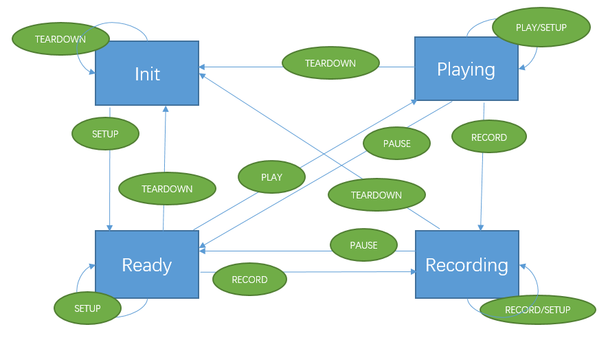

# RTSP 学习

- [RTSP 学习](#rtsp-%e5%ad%a6%e4%b9%a0)
  - [RTSP 连接](#rtsp-%e8%bf%9e%e6%8e%a5)
  - [RTSP 流](#rtsp-%e6%b5%81)
  - [RTSP vs HTTP](#rtsp-vs-http)
  - [RTSP 操作](#rtsp-%e6%93%8d%e4%bd%9c)
  - [一般流程](#%e4%b8%80%e8%88%ac%e6%b5%81%e7%a8%8b)
  - [Connection](#connection)
  - [Method](#method)
  - [Range](#range)
    - [SMPTE 相对时间戳](#smpte-%e7%9b%b8%e5%af%b9%e6%97%b6%e9%97%b4%e6%88%b3)
    - [Normal Plat Time, NPT](#normal-plat-time-npt)
    - [绝对时间](#%e7%bb%9d%e5%af%b9%e6%97%b6%e9%97%b4)
  - [RTP-Info](#rtp-info)
  - [Scale](#scale)
  - [Speed](#speed)
  - [Scale vs Speed](#scale-vs-speed)
  - [Session](#session)
  - [Transport](#transport)
  - [A RTSP 协议状态机](#a-rtsp-%e5%8d%8f%e8%ae%ae%e7%8a%b6%e6%80%81%e6%9c%ba)
    - [A.1 客户端状态机](#a1-%e5%ae%a2%e6%88%b7%e7%ab%af%e7%8a%b6%e6%80%81%e6%9c%ba)
    - [A.2 服务器状态机](#a2-%e6%9c%8d%e5%8a%a1%e5%99%a8%e7%8a%b6%e6%80%81%e6%9c%ba)
  - [B RTP 交互](#b-rtp-%e4%ba%a4%e4%ba%92)
  - [C RTSP 会话描述使用 SDP](#c-rtsp-%e4%bc%9a%e8%af%9d%e6%8f%8f%e8%bf%b0%e4%bd%bf%e7%94%a8-sdp)
    - [C.1 Control URL](#c1-control-url)
    - [C.2 Media streams](#c2-media-streams)
    - [C.3 不支持集合控制](#c3-%e4%b8%8d%e6%94%af%e6%8c%81%e9%9b%86%e5%90%88%e6%8e%a7%e5%88%b6)
    - [C.4 支持集合控制](#c4-%e6%94%af%e6%8c%81%e9%9b%86%e5%90%88%e6%8e%a7%e5%88%b6)
  - [D 最小的 RTSP 实现](#d-%e6%9c%80%e5%b0%8f%e7%9a%84-rtsp-%e5%ae%9e%e7%8e%b0)
    - [D.1 客户端](#d1-%e5%ae%a2%e6%88%b7%e7%ab%af)
      - [D.1.1 基本的回放](#d11-%e5%9f%ba%e6%9c%ac%e7%9a%84%e5%9b%9e%e6%94%be)
      - [D.1.2 支持认证](#d12-%e6%94%af%e6%8c%81%e8%ae%a4%e8%af%81)
    - [D.2 服务器](#d2-%e6%9c%8d%e5%8a%a1%e5%99%a8)
      - [D.2.1 基本的回放](#d21-%e5%9f%ba%e6%9c%ac%e7%9a%84%e5%9b%9e%e6%94%be)
      - [D.2.2 支持认证](#d22-%e6%94%af%e6%8c%81%e8%ae%a4%e8%af%81)
  - [抓包](#%e6%8a%93%e5%8c%85)
    - [udp 拉流](#udp-%e6%8b%89%e6%b5%81)
    - [tcp 拉流](#tcp-%e6%8b%89%e6%b5%81)
    - [udp 推流](#udp-%e6%8e%a8%e6%b5%81)
    - [tcp 推流](#tcp-%e6%8e%a8%e6%b5%81)
  - [参考](#%e5%8f%82%e8%80%83)

## RTSP 连接

服务器通过一个标识符标记一个会话。RTSP 会话绑定到一个传输层连接(比如 TCP 连接)。在一个 RTSP 会话期间，一个 RTSP 客户端可以发送请求打开或关闭和服务器之间的可靠传输连接。也可以使用无连接的传输协议(比如 UDP)。

## RTSP 流

RTSP 控制的流可以使用 RTP，但是 RTSP 操作不依赖传输连续媒体的传输机制。

## RTSP vs HTTP

RTSP 和 HTTP 有一些重要的不同点：

- RTSP 引入了一些新方法和不同的协议标识
- 一个 RTSP 在大多数情况下，默认需要维护状态。而 HTTP 可以无状态
- RTSP 客户端和服务器都可以发送请求
- 数据通过不同的协议传输
- RTSP 使用 ISO 10646 (UTF-8) 而不是 ISO 8859-1
- Request-URI 总是绝对的 URI

## RTSP 操作

RTSP 协议支持下面的操作：

- 向媒体服务器检索媒体
- 邀请一个媒体服务器加入会议
- 向已有的演示中添加一个媒体

## 一般流程

- SETUP：使得服务器为一个流分配资源，并开始一个 RTSP 会话
- PLAY/RECORD：开始传输通过 SETUP 分配的流数据
- PAUSE：暂时挂起一个流，但是不释放服务器资源
- TEARDOWN：释放和流相关的资源。RTSP 会话不在服务器中存在

和状态有关的 RTSP 方法使用 `Session` 头域来标识 RTSP 会话。服务器响应 SETUP 请求生成会话标识符。

## Connection

支持持久化连接或无连接模式的客户端可以顺序发送请求(而不用等待之前的回复)。但是服务器必须按照接收请求的顺序发送回复。

实现 RTSP 服务的系统必须支持 TCP/RTSP，可以支持 UDP/RTSP。RTSP 服务器对于 UDP 和 TCP 的默认端口都是 554。

无论是否携带载荷，RTSP 消息必须包含一个 `Content-Length` 头域。

## Method

`Method` 表明了对 `Request-URI` 标识的资源要进行的操作方法。方法是大小写敏感的。

P: presentation, 演示; S: stream, 流

| 方法 | 方向 | 对象 | 必要性 |
| --- | --- | --- | --- |
| DESCRIBE | C->S | P,S | 建议 |
| ANNOUNCE | C->S, S->C | P,S | 可选 |
| GET_PARAMETER | C->S, S->C | P,S | 可选 |
| OPTIONS | C->S, S->C | P,S | 必须(S->C 可选) |
| PAUSE | C->S | P,S | 建议 |
| PLAY | C->S | P,S | 必须 |
| RECORD | C->S | P,S | 可选 |
| REDIRECT | S->C | P,S | 可选 |
| SETUP | C->S | S | 必须 |
| SET_PARAMETER | C->S, S->C | P,S | 可选 |
| TEARDOWN | C->S | S | 必须 |

如果服务器不支持某个方法，必须返回 "501 Not Implemented"，而且客户端不应当再向这个服务器尝试这个方法。

## Range

请求和回复的 `Range` 头域指定了一个时间范围。可以使用一些单位指定范围，包括 smpte、npt、clock。

在 RTSP 中，字节范围无意义且不能使用。`Range` 头域也可能包含一个 UTC 格式的 `time` 参数，指定了此操作生效的时刻。

支持 `Range` 头域的服务器必须理解 NPT 范围格式，且应该理解 SMPTE 范围格式。`Range` 回复头表明实际播放或录像的时间范围。如果所给 `Range` 头的时间格式不能理解，接收者应该返回 “501 Not Implemented”。

`Range` 是半开的间隔，包含较小值，但是不包含较大值。也就是说，`a-b` 起始于时间 a，但是刚好在 b 之前停止。只有媒体单位(比如一个视频或音频帧)的起始时间是相关的。比如，假定确保 40 ms 生成一个视频帧，那么 `10.0-10.1` 包含在 10.0 和 10.08 开始的视频帧，即使持续时间超出范围；而 `10.0-10.08` 则不包含 10.08 开始的帧。

### SMPTE 相对时间戳

SMPTE 相对时间戳表示相对于剪辑 (clip) 开始的时间。SMPTE 相对时间戳是帧级别的精度。时间格式是 `hours:minutes:seconds:frames.subframes`，起始位置是剪辑的开始。默认的 smpte 格式是 "SMPTE 30 drop"，帧率是 29.97 帧每秒。`subframes` 是相对于一帧的百分比。

### Normal Plat Time, NPT

NPT 表示流相对演示的开始位置的绝对位置。时间戳包含一个十进制小数。

演示的开始对应 0.0 秒。赋值是未定义的。特殊常量 `now` 表示一个直播事件的当前时刻。只可用于直播事件。

直观上，NPT 是观看者和一个节目关联的时钟。经常在一个 VCR 以数字显示。在正常播放模式(scale=1)时 NPT 正常前进。当 scale 是大于 1 的正数时，NPT 快速前进。当在倒退浏览(小于 -1 的负数)时，NPT 减少。暂停时 NPT 值固定。NPT 在逻辑上等同于 SMPTE 时间码。

### 绝对时间

绝对时间表示为 ISO 8601 时间戳，使用 UTC (GMT)。

比如 `utc-range = clock=19961108T143720.25Z`

## RTP-Info

## Scale

`Scale` 值为 1 表示在正常的前向观看速率播放或录像。如果不是 1，值是相对于正常的观看速率的比例。比如，比例为 2 表示正常观看速率的 2 倍(“快速前进”)，比例为 0.5 表示正常观看速率的一般。也就是说，比例为 2 需要正常播放时间的 wallclock 比率增加到 2 倍。对于 (wallclock) 经过的每一秒，会发送 2 秒的内容。负值表示回退操作。

除非要求，数据速率不应改变，否则使用 Speed 参数。实现 Scale 的改变取决于服务器和媒体类型。对于视频，服务器可能只发送关键帧和选择的关键帧。对于音频，服务器可能在保留音高或发送音频片段的同时 time-scale 音频。

服务器应该估算观看速率，但是可以限制支持的 scale 范围。回复必须包含服务器实际选择的 scale 值。

如果请求包含一个 Range 参数，新的  scale 值会产生影响。

## Speed

`Speed` 头域参数要求服务器以指定的速度发送数据给客户端，取决于服务器的能力以及以指定速度服务媒体流的要求。服务器的实现是可选的。模式是流的比特率。

参数的值表示为十进制比例。比如，值为 2.0 表示数据发送是正常的两倍。值为 0 是无效的。如果请求包含一个 Range 参数，新的速度值会立刻生效。

使用这个头域会改变数据发送的带宽。这用于在一些情况下，需要以更高或更低的速率预览演示。实现者应该记住会话的带宽可以预先协商(通过 RTSP 以外的方式)，因此需要重新协商。当数据通过 UDP 发送，强烈建议使用类似 RTCP 的方式根据丢包率。

## Scale vs Speed

通过调整 `Scale` 可以用来控制播放速度，也用来实现回放。这是由服务器进行跳帧之类的操作实现的。

`Speed` 是通知服务器按照什么样的速度发送数据。一般用途是客户端实现本地 scale，即本地丢帧实现倍速播放；另一个常见用途是控制缓存的生成速度。

`Speed` 会导致数据量(带宽)的变化，而 `Scale` 不会。

## Session

`Session`存在请求和回复的头域中，表示一个 RTSP 会话，该会话由媒体服务器在一个 SETUP 回复发起，通过 TEARDOWN 移除。

会话的标识符由媒体服务器选择，必须在所有和该会话相关的请求中携带。

如果会话标识符无效，返回 "454 Session Not Found"。

## Transport

对于 RTP/AVP，默认是 UDP。

## A RTSP 协议状态机

RTSP 客户端和服务器状态机描述了一个 RTSP 会话从初始化到终止的过程中的协议行为。

状态基于一个对象定义。一个对象由一个流 URL 和 RTSP 会话标识符唯一定义。使用集合 URL 表示由多个流组成的 RTSP 演示的所有请求/回复对所有流的状态都会产生影响。

请求 OPTIONS/ANNOUNCE/DESCRIBE/GET_PARAMETER/SET_PARAMETER 不会对客户端和服务器的状态产生影响。



### A.1 客户端状态机

- Init：已经发送了 `SETUP`，正在等待回复
- Ready：已经收到 `SETUP` 回复，或正在播放状态时收到 `PAUSE` 回复
- Playing：已经收到 `PLAY` 回复
- Recording：已经收到 `RECORD` 回复

总的说来，客户端在收到请求的回复时改变状态。

**注意：**一些请求(如 `PAUSE`)在未来某个时间或地点是有效的，且状态会随之改变。

如果对某个对象不要求有显式的 `SETUP`，状态从 `Ready` 开始。在这种情况下，只有两个状态，即 `Ready` 和 `Playing`。

当到达请求的 range 时，客户端状态会从 `Playing/Recording` 变成 `Ready`。

| 状态 | 发送的消息 | 回复之后的下一个状态 |
| --- | --- | --- |
| Init | SETUP | Ready |
| - | TEARDOWN | Init |
| Ready | PLAY | Playing |
| - | RECORD | Recording |
| - | SETUP | Ready |
| - | TEARDOWN | Init |
| Playing | PLAY | Playing |
| - | PAUSE | Ready |
| - | SETUP | Playing(修改的传输) |
| - | TEARDOWN | Init |
| Recording | RECORD | Recording |
| - | PAUSE | Ready |
| - | SETUP | Recording(修改的传输) |
| - | TEARDOWN | Init |

“下一个状态”表示在收到成功的回复(`2xx`)之后的状态。如果请求产生的状态码是 `3xx`，状态变为 `Init`，且一个 `4xx` 的状态码对状态没有影响。除了对状态没有影响的消息，没有列举的其他消息在某个状态不应被发送。收到服务器的 `REDIRECT` 等同于收到 `3xx` 重定向状态码。

### A.2 服务器状态机

- Init：初始状态，没有收到有效的 `SETUP`
- Ready：收到最后一个 `SETUP`，成功处理，已经发送回复，或者正在播放之后，收到最后一个 `PAUSE`，成功处理，已经发送回复
- Playing：收到最后一个 `PLAY`，成功处理，已经发送回复。正在发送数据
- Recording：服务器正在录制媒体数据

总的说来，服务器在收到请求时改变状态。

如果服务器在 `Playing` 或 `Recording` 状态且是 unicast 模式，当在定义的时间间隔(默认是一分钟)没有收到客户端的“好”信息，比如 RTSP 报告或 RTSP 命令，服务器可以回到 `Init` 状态并终止该 RTSP 会话。服务器可以在 Session 回复头域中声明另一个超时的数值。

如果服务器在 Ready 状态，如果在多余一分钟的时间间隔没有收到一个 RTSP 请求，服务器可以回到 `Init` 状态。

**注意：**一些请求(比如 PAUSE)在未来某个时间或地点是有效的，且服务器状态在合适的时间改变。

在客户端请求的 range 到达时，服务器会从 `Playing` 或 `Recording` 状态回到 `Ready`。

REDIRECT 消息一发送立即有效，除非它有一个 Range 头域指定此重定向何时生效。在这种情况下，服务器状态也hi在适合的时间改变。

如果对某个对象不要求有显式的 `SETUP`，状态从 `Ready` 开始。在这种情况下，只有两个状态，即 `Ready` 和 `Playing`。

| 状态 | 发送的消息 | 回复之后的下一个状态 |
| --- | --- | --- |
| Init | SETUP | Ready |
| - | TEARDOWN | Init |
| Ready | PLAY | Playing |
| - | RECORD | Recording |
| - | SETUP | Ready |
| - | TEARDOWN | Init |
| Playing | PLAY | Playing |
| - | TEARDOWN | Init |
| - | PAUSE | Ready |
| - | SETUP | Playing |
| Recording | RECORD | Recording |
| - | PAUSE | Ready |
| - | SETUP | Recording |
| - | TEARDOWN | Init |

## B RTP 交互

RTSP 允许媒体客户端控制演示选中的、非连续片段，使用 RTP 媒体层渲染这些流。渲染 RTP 流的媒体层不应被 NPT 的跳转影响，RTP 序列号和 RTP 时间戳在 NPT 跳转时必须是连续单调的。

不懂？？？？？

## C RTSP 会话描述使用 SDP

### C.1 Control URL

`a=control:` 用于传递控制 URL。这个属性在会话和媒体描述中都使用。如果用于单独的媒体，表示控制该媒体流要使用的 URL。如果在会话级使用，这个属性表示集合控制的 URL。

属性可以包含相对和绝对 URL。如果这个属性只包含一个星号，那么这个 URL 被视为一个空的嵌套 URL，因此继承整个基础 URL。

### C.2 Media streams

`m=` 用于枚举流。如果会话是 unicast，端口号作为服务器到客户端的建议端口号；客户端需要在 SETUP 请求中包含它，但是可以忽视这个建议。如果服务器没有偏好，应当设置端口号为 0。

### C.3 不支持集合控制

如果一个演示不支持集合控制，且指定了多个媒体段，每个段必须通过 `a=control:` 指定一个控制 URL。

比如：

```sdp
v=0
o=- 2890844256 2890842807 IN IP4 204.34.34.32
s=I came from a web page
t=0 0
c=IN IP4 0.0.0.0
m=video 8002 RTP/AVP 31
a=control:rtsp://audio.com/movie.aud
m=audio 8004 RTP/AVP 3
a=control:rtsp://video.com/movie.vid
```

**注意：**控制 URL 在描述中的位置表示客户端要和服务器 `audio.com` 和 `video.com` 分别建立 RTSP 控制会话。

**建议：**一个 SDP 文件包含完整的媒体初始化信息，即使通过非 RTSP 方式发送给媒体客户端。

### C.4 支持集合控制

在这个场景中，服务器又多个流可以作为一个整体控制。此时，有媒体级的 `a=control:` 属性，用于指定流 URL；还有会话级的 `a=control:` 属性，用作集合控制的 URL。如果媒体级 URL 是相对的，需要处理成绝对的 URL。

如果演示只包含一个流，媒体级 `a=control:` 可以忽略。然而，如果演示包含多于一个流，每个媒体流段必须包含自己的 `a=control:` 属性。

比如：

```sdp
v=0
o=- 2890844256 2890842807 IN IP4 204.34.34.32
s=I contain
i=<more info>
t=0 0
c=IN IP4 0.0.0.0
a=control:rtsp://example.com/movie/
m=video 8002 RTP/AVP 31
a=control:trackID=1
m=audio 8004 RTP/AVP 3
a=control:trackID=2
```

上述示例，客户端要求和服务器建立一个 RTSP 会话，并且使用 URL `rtsp://example.com/movie/trackID=1` 和 `rtsp://example.com/movie/trackID=2` 分别建立视频和音频流。URL `rtsp://example.com/movie/` 控制整个媒体。

## D 最小的 RTSP 实现

### D.1 客户端

一个客户端实现必须支持下面的：

- 生成下面的请求：SETUP、TEARDOWN，PLAY (比如最小的回放客户端) 或 RECORD (比如最小的录像客户端)。如果实现了 RECORD，也必须实现 ANNOUNCE
- 请求中包含下面的头域：CSeq、Connection、Session、Transport。如果实现了 ANNOUNCE，也需要包含头域 Content-Language、Content-Encoding、Content-Length、Content-Type
- 解析和理解回复中的头域：CSeq、Connection、Session、Transport、Content-Language、Content-Encoding、Content-Length、Content-Type。如果实现 RECORD，也要理解 Location。RTP 兼容的实现也要实现 RTP-Info
- 理解收到的每个错误码类，并且出现错误码的时候通知终端用户 4xx 或 5xx。如果终端用户显式地不想要错误码可以放松通知要求
- 预期和回复服务端的异步请求，比如 ANNOUNCE。这不意味着应该事先 ANNOUNCE 方法，只是客户端必须正面或负面响应服务器的任何请求

#### D.1.1 基本的回放

为了支持媒体流的按需回放，客户端必须额外实现：

- 生成 PAUSE 请求
- 实现 REDIRECT 方法，实现 Location 头域

#### D.1.2 支持认证

为了访问 RTSP 服务器要求认证的媒体演示，客户端必须额外实现：

- 识别 401 状态码
- 解析和包含 WWW-Authenticate 头域
- 实现 Basic Authentication 和 Digest Authentication

### D.2 服务器

一个最小的服务器必须实现下面的：

- 实现下面的方法：SETUP、TEARDOWN、OPTIONS，PLAY (比如最小的回放服务器) 或 RECORD (比如最小的录像服务器)。如果实现了 RECORD，也必须实现 ANNOUNCE
- 在回复用包含下面的头域：Connection、Content-Language、Content-Encoding、Content-Length、Content-Type、Transport、Public。如果实现 RECORD 方法，也要包含 Location 头域。RTP 兼容的实现也要实现 RTP-Info
- 解析和正确回复请求的头域：Connection、Session、Transport、Require

#### D.2.1 基本的回放

为了支持媒体流的按需回放，服务器必须额外实现：

- 识别 Range 头域，且如果不支持 seek 返回错误
- 实现 PAUSE 方法

#### D.2.2 支持认证

为了正确处理客户端的认证，服务器必须额外实现：

- 当资源要求认证时，生成 401 状态码
- 解析和包含 WWW-Authenticate 头域
- 实现 Basic Authentication 和 Digest Authentication

## 抓包

### udp 拉流

```txt
OPTIONS rtsp://192.168.12.15:554 RTSP/1.0
CSeq: 1
User-Agent: Lavf57.83.100

RTSP/1.0 200 OK
CSeq: 1
Public: OPTIONS, DESCRIBE, PLAY, PAUSE, SETUP, TEARDOWN, SET_PARAMETER, GET_PARAMETER
Date:  Wed, Apr 08 2020 15:48:38 GMT

DESCRIBE rtsp://192.168.12.15:554 RTSP/1.0
Accept: application/sdp
CSeq: 2
User-Agent: Lavf57.83.100

RTSP/1.0 401 Unauthorized
CSeq: 2
WWW-Authenticate: Digest realm="IP Camera(C2875)", nonce="0eb80cc3ac5606c32802923e0834dfbe", stale="FALSE"
Date:  Wed, Apr 08 2020 15:48:38 GMT

DESCRIBE rtsp://192.168.12.15:554 RTSP/1.0
Accept: application/sdp
CSeq: 3
User-Agent: Lavf57.83.100
Authorization: Digest username="admin", realm="IP Camera(C2875)", nonce="0eb80cc3ac5606c32802923e0834dfbe", uri="rtsp://192.168.12.15:554", response="4a21d799c1c082629e1f87b4863d5997"

RTSP/1.0 200 OK
CSeq: 3
Content-Type: application/sdp
Content-Base: rtsp://192.168.12.15:554/
Content-Length: 560

v=0
o=- 1586360918952238 1586360918952238 IN IP4 192.168.12.15
s=Media Presentation
e=NONE
b=AS:5050
t=0 0
a=control:rtsp://192.168.12.15:554/
m=video 0 RTP/AVP 96
c=IN IP4 0.0.0.0
b=AS:5000
a=recvonly
a=x-dimensions:1920,1080
a=control:rtsp://192.168.12.15:554/trackID=1
a=rtpmap:96 H264/90000
a=fmtp:96 profile-level-id=420029; packetization-mode=1; sprop-parameter-sets=Z00AKp2oHgCJ+WbgICAoAAADAAgAAAMBlCA=,aO48gA==
a=Media_header:MEDIAINFO=494D4B48010200000400000100000000000000000000000000000000000000000000000000000000;
a=appversion:1.0

SETUP rtsp://192.168.12.15:554/trackID=1 RTSP/1.0
Transport: RTP/AVP/UDP;unicast;client_port=7748-7749
CSeq: 4
User-Agent: Lavf57.83.100
Authorization: Digest username="admin", realm="IP Camera(C2875)", nonce="0eb80cc3ac5606c32802923e0834dfbe", uri="rtsp://192.168.12.15:554/trackID=1", response="f209b9b89406cc544283b07f5968f753"

RTSP/1.0 200 OK
CSeq: 4
Session:        375745267;timeout=60
Transport: RTP/AVP/UDP;unicast;client_port=7748-7749;server_port=8232-8233;ssrc=11daf6cb;mode="play"
Date:  Wed, Apr 08 2020 15:48:38 GMT

PLAY rtsp://192.168.12.15:554/ RTSP/1.0
Range: npt=0.000-
CSeq: 5
User-Agent: Lavf57.83.100
Session: 375745267
Authorization: Digest username="admin", realm="IP Camera(C2875)", nonce="0eb80cc3ac5606c32802923e0834dfbe", uri="rtsp://192.168.12.15:554/", response="2992867248ca88707fa41aa2032613e5"

RTSP/1.0 200 OK
CSeq: 5
Session:        375745267
RTP-Info: url=rtsp://192.168.12.15:554/trackID=1;seq=61356;rtptime=868609344
Date:  Wed, Apr 08 2020 15:48:39 GMT
```

### tcp 拉流

```txt
OPTIONS rtsp://192.168.12.15:554 RTSP/1.0
CSeq: 1
User-Agent: Lavf57.83.100

RTSP/1.0 200 OK
CSeq: 1
Public: OPTIONS, DESCRIBE, PLAY, PAUSE, SETUP, TEARDOWN, SET_PARAMETER, GET_PARAMETER
Date:  Wed, Apr 08 2020 16:04:12 GMT

DESCRIBE rtsp://192.168.12.15:554 RTSP/1.0
Accept: application/sdp
CSeq: 2
User-Agent: Lavf57.83.100

RTSP/1.0 401 Unauthorized
CSeq: 2
WWW-Authenticate: Digest realm="IP Camera(C2875)", nonce="a0e8bf31f15519d02efa140ce3608fc6", stale="FALSE"
Date:  Wed, Apr 08 2020 16:04:12 GMT

DESCRIBE rtsp://192.168.12.15:554 RTSP/1.0
Accept: application/sdp
CSeq: 3
User-Agent: Lavf57.83.100
Authorization: Digest username="admin", realm="IP Camera(C2875)", nonce="a0e8bf31f15519d02efa140ce3608fc6", uri="rtsp://192.168.12.15:554", response="c36cb24ea1b9b93580316042d98819ad"

RTSP/1.0 200 OK
CSeq: 3
Content-Type: application/sdp
Content-Base: rtsp://192.168.12.15:554/
Content-Length: 560

v=0
o=- 1586361852436321 1586361852436321 IN IP4 192.168.12.15
s=Media Presentation
e=NONE
b=AS:5050
t=0 0
a=control:rtsp://192.168.12.15:554/
m=video 0 RTP/AVP 96
c=IN IP4 0.0.0.0
b=AS:5000
a=recvonly
a=x-dimensions:1920,1080
a=control:rtsp://192.168.12.15:554/trackID=1
a=rtpmap:96 H264/90000
a=fmtp:96 profile-level-id=420029; packetization-mode=1; sprop-parameter-sets=Z00AKp2oHgCJ+WbgICAoAAADAAgAAAMBlCA=,aO48gA==
a=Media_header:MEDIAINFO=494D4B48010200000400000100000000000000000000000000000000000000000000000000000000;
a=appversion:1.0

SETUP rtsp://192.168.12.15:554/trackID=1 RTSP/1.0
Transport: RTP/AVP/TCP;unicast;interleaved=0-1
CSeq: 4
User-Agent: Lavf57.83.100
Authorization: Digest username="admin", realm="IP Camera(C2875)", nonce="a0e8bf31f15519d02efa140ce3608fc6", uri="rtsp://192.168.12.15:554/trackID=1", response="1911f8d792a6a997b350bf6bea680105"

RTSP/1.0 200 OK
CSeq: 4
Session:       2056953518;timeout=60
Transport: RTP/AVP/TCP;unicast;interleaved=0-1;ssrc=4c5719fe;mode="play"
Date:  Wed, Apr 08 2020 16:04:12 GMT

PLAY rtsp://192.168.12.15:554/ RTSP/1.0
Range: npt=0.000-
CSeq: 5
User-Agent: Lavf57.83.100
Session: 2056953518
Authorization: Digest username="admin", realm="IP Camera(C2875)", nonce="a0e8bf31f15519d02efa140ce3608fc6", uri="rtsp://192.168.12.15:554/", response="c6c13111dd70c712afd0bd607d3fb360"

RTSP/1.0 200 OK
CSeq: 5
Session:       2056953518
RTP-Info: url=rtsp://192.168.12.15:554/trackID=1;seq=40504;rtptime=952611744
Date:  Wed, Apr 08 2020 16:04:12 GMT
```

### udp 推流

```txt
OPTIONS rtsp://localhost:8554/movie RTSP/1.0
CSeq: 1
User-Agent: Lavf57.83.100

RTSP/1.0 200 OK
Session: 3Nczr3CZg
Public: DESCRIBE, SETUP, TEARDOWN, PLAY, PAUSE, OPTIONS, ANNOUNCE, RECORD
CSeq: 1

ANNOUNCE rtsp://localhost:8554/movie RTSP/1.0
Content-Type: application/sdp
CSeq: 2
User-Agent: Lavf57.83.100
Session: 3Nczr3CZg
Content-Length: 315

v=0
o=- 0 0 IN IP4 127.0.0.1
s=No Name
c=IN IP4 127.0.0.1
t=0 0
a=tool:libavformat 57.83.100
m=video 0 RTP/AVP 96
b=AS:200
a=rtpmap:96 MP4V-ES/90000
a=fmtp:96 profile-level-id=1; config=000001B001000001B58913000001000000012000C48D8800CD3C04871443000001B24C61766335372E3130372E313030
a=control:streamid=0

RTSP/1.0 200 OK
Session: 3Nczr3CZg
CSeq: 2

SETUP rtsp://localhost:8554/movie/streamid=0 RTSP/1.0
Transport: RTP/AVP/UDP;unicast;client_port=19154-19155;mode=record
CSeq: 3
User-Agent: Lavf57.83.100
Session: 3Nczr3CZg

RTSP/1.0 200 OK
CSeq: 3
Session: 3Nczr3CZg
Transport: RTP/AVP/UDP;unicast;client_port=19154-19155;server_port=53548-50392;mode=record

RECORD rtsp://localhost:8554/movie RTSP/1.0
Range: npt=0.000-
CSeq: 4
User-Agent: Lavf57.83.100
Session: 3Nczr3CZg

RTSP/1.0 200 OK
Session: 3Nczr3CZg
CSeq: 4

TEARDOWN rtsp://localhost:8554/movie RTSP/1.0
CSeq: 5
User-Agent: Lavf57.83.100
Session: 3Nczr3CZg

RTSP/1.0 200 OK
CSeq: 5
Session: 3Nczr3CZg
```

### tcp 推流

```txt
OPTIONS rtsp://localhost:8554/movie RTSP/1.0
CSeq: 1
User-Agent: Lavf57.83.100

RTSP/1.0 200 OK
CSeq: 1
Session: oBdGr3jWR
Public: DESCRIBE, SETUP, TEARDOWN, PLAY, PAUSE, OPTIONS, ANNOUNCE, RECORD

ANNOUNCE rtsp://localhost:8554/movie RTSP/1.0
Content-Type: application/sdp
CSeq: 2
User-Agent: Lavf57.83.100
Session: oBdGr3jWR
Content-Length: 315

v=0
o=- 0 0 IN IP4 127.0.0.1
s=No Name
c=IN IP4 127.0.0.1
t=0 0
a=tool:libavformat 57.83.100
m=video 0 RTP/AVP 96
b=AS:200
a=rtpmap:96 MP4V-ES/90000
a=fmtp:96 profile-level-id=1; config=000001B001000001B58913000001000000012000C48D8800CD3C04871443000001B24C61766335372E3130372E313030
a=control:streamid=0
RTSP/1.0 200 OK
CSeq: 2
Session: oBdGr3jWR

SETUP rtsp://localhost:8554/movie/streamid=0 RTSP/1.0
Transport: RTP/AVP/TCP;unicast;interleaved=0-1;mode=record
CSeq: 3
User-Agent: Lavf57.83.100
Session: oBdGr3jWR

RTSP/1.0 200 OK
Transport: RTP/AVP/TCP;unicast;interleaved=0-1;mode=record
CSeq: 3
Session: oBdGr3jWR

RECORD rtsp://localhost:8554/movie RTSP/1.0
Range: npt=0.000-
CSeq: 4
User-Agent: Lavf57.83.100
Session: oBdGr3jWR

RTSP/1.0 200 OK
CSeq: 4
Session: oBdGr3jWR

TEARDOWN rtsp://localhost:8554/movie RTSP/1.0
CSeq: 5
User-Agent: Lavf57.83.100
Session: oBdGr3jWR

RTSP/1.0 200 OK
Session: oBdGr3jWR
CSeq: 5
```

## 参考

- [RFC2326](https://tools.ietf.org/pdf/rfc2326.pdf)