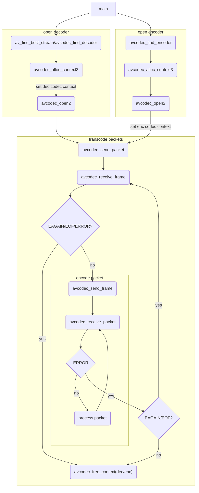
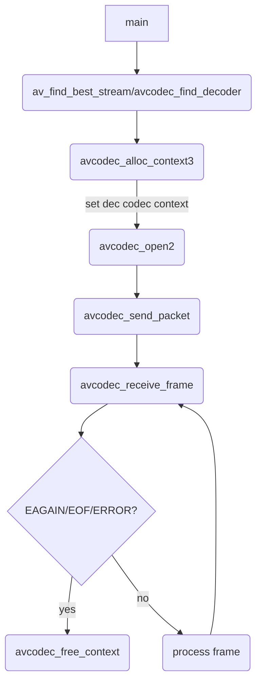
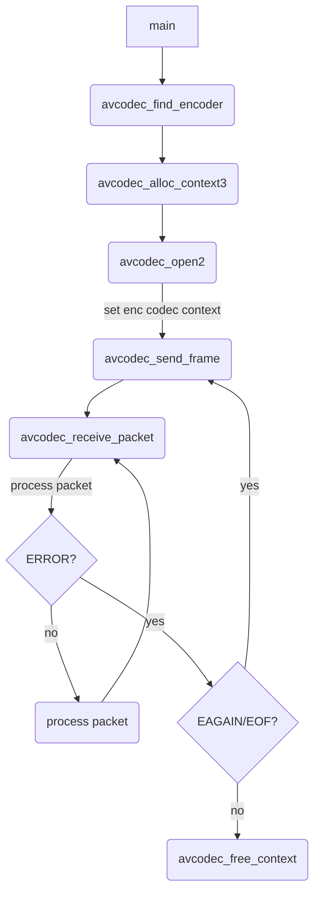

# ffmpeg 的编解码

- [ffmpeg 的编解码](#ffmpeg-的编解码)
  - [编解码流程](#编解码流程)
    - [重要 API 说明](#重要-api-说明)
  - [libavcodec 库](#libavcodec-库)
    - [主要的 API](#主要的-api)
    - [数据结构](#数据结构)
      - [AVPacket](#avpacket)
      - [AVFrame](#avframe)
      - [AVCodecContext](#avcodeccontext)
        - [AVCodec](#avcodec)
      - [AVCodecParameters](#avcodecparameters)
      - [AVCodecParserContext](#avcodecparsercontext)
  - [解码](#解码)
    - [解码流程](#解码流程)
    - [发送数据包 avcodec_send_packet](#发送数据包-avcodec_send_packet)
    - [读取解码帧 avcodec_receive_frame](#读取解码帧-avcodec_receive_frame)
  - [编码](#编码)
    - [编码流程](#编码流程)
    - [发送解码帧 avcodec_send_frame](#发送解码帧-avcodec_send_frame)
    - [读取数据包 avcodec_receive_packet](#读取数据包-avcodec_receive_packet)

内容主要来自整理翻译源码。

## 编解码流程

参考 `doc/examples/decode_video.c`



### 重要 API 说明

`avcodec_send_packet()`/`avcodec_receive_frame()`/`avcodec_send_frame()`/`avcodec_receive_packet()` 函数提供编码/解码 API，将输入和输出解耦。

这些 API 对于编解码以及音视频非常相似，如下方式工作：

- 设置和打开 `AVCodecContext`
- 发送有效的输入：
  - 对于解码，调用 `avcodec_send_packet()` 给解码器一个包含原始压缩数据的 `AVPacket`
  - 对于编码，调用 `avcodec_send_frame()` 给编码器一个包含未压缩音频或视频的 `AVFrame`
  - 两种情形中，建议 `AVPacket` 和 `AVFrame` 都是引用计数的，否则 libavcodec 可能需要拷贝输入数据。(libavformat 总是返回引用计数的 `AVPacket`，且 `av_frame_get_buffer()` 分配引用计数的 `AVFrame`)
- 在一个循环中接收输出。定期调用其中一个 `avcodec_receive_*()` 函数并处理它们的输出：
  - 对于解码，调用 `avcodec_receive_frame()`。如果成功，返回一个包含未压缩的音频或视频数据的 `AVFrame`
  - 对于解码，调用 `avcodec_receive_packet()`。如果成功，返回一个包含一个压缩帧的 `AVPacket`
  - 重复调用 `avcodec_receive_*()` 直到返回 `AVERROR(EAGAIN)` 或一个错误。`AVERROR(EAGAIN)` 返回值表示返回新的输出要求新的输入数据。在这种情况下，继续发送数据。对于每个输入的帧/包，编解码器一般会返回一个输出的帧/包，但是也可以返回 0 个或多于 1 个输出的帧/包

解码或编码一开始，编解码器可以接收多个输入帧/包而不用返回一个帧，直到填充其内部缓存。这种情形可以按照上述步骤透明地处理。

理论上。发送输入可以导致 `EAGAIN`——并未接收所有输出才会出现。使用者可使用这个返回值构造不同于上述建议的解码或编码循环。比如，可以尝试在每次迭代发送一个新的输入，当返回 `EAGAIN` 时尝试接收输出。

流结束的情形。因为解码器可能出于性能或必要性(考虑 B 帧)在内部缓存多个帧或包，因此需要刷新(即耗尽)编解码器。按照下面的步骤处理：

- 取而代之有效的输入，发送 `NULL` 给 `avcodec_send_packet()`(解码器)或 `avcodec_send_frame()`(编码器)函数。这会进入耗尽模式
- 在一个循环中调用 `avcodec_receive_frame()`(解码器)或 `avcodec_receive_packet()`(编码器)，直到返回 `AVERROR_EOF`。这个函数不会返回 `AVERROR(EAGAIN)`，除非你忘记进入耗尽模式
- 在重新恢复解码之前，必须使用 `avcodec_flush_buffers()` 重置编解码器

强烈建议使用上述 API。但是也可以在这些严格的模式之外调用函数。比如，可以重复调用 `avcodec_send_packet()` 而不调用 `avcodec_receive_frame()`。在这种情况下，`avcodec_send_packet()` 会一直成功直到编解码器内部的缓存填充满(一般在初始输入后，每个输出帧大小是 1)，然后使用 `AVERROR(EAGAIN)` 拒绝输入。一旦开始拒绝输入，只能读取一些输出。

并非所有编解码器会遵循严格且可预测的数据流；唯一的保证是，在一端调用发送/接收调用上的 `AVERROR(EAGAIN)` 返回值意味着另一端的接收/发送调用会成功，或者至少不会因为 `AVERROR(EAGAIN)` 失败。一般来说，没有编解码器允许无限缓存输入或输出。

此 API 替换了以下遗留函数：

- `avcodec_decode_video2()` 和 `avcodec_decode_audio4()`:
  使用 `avcodec_send_packet()` 将输入提供到解码器，然后在每个数据包后使用 `avcodec_receive_frame()` 接收解码帧。
  与旧的视频解码 API 不同，一个数据包可能会产生多个帧。对于音频，通过部分解码数据包将输入数据包分割成帧对 API 用户变得透明。你永远不需要将 AVPacket 两次提供给 API (除非它被 `AVERROR(EAGAIN)` 拒绝——那么不能从数据包中读取数据)。
  此外，只需要发送一次刷新/耗尽数据包。
- `avcodec_encode_video2()` 和 `avcodec_encode_audio2()`：
  使用 `avcodec_send_frame()` 将输入提供给编码器，然后使用 `avcodec_receive_packet()` 接收编码数据包。
  不能为 `avcodec_receive_packet()` 提供用户分配的缓冲区。
- 新的 API 还不能处理字幕。

不允许在同一 AVCodecContext 上混合新旧函数调用，这将导致未定义的行为。

某些编解码器可能需要使用新 API；使用旧 API 在调用时会返回错误。所有编解码器都支持新的 API。

编解码器不允许为发送和接收返回 `AVERROR(EAGAIN)`。这将是一个无效状态，可能会使编解码器用户陷入无限循环。API 也没有时间概念：尝试执行 `avcodec_send_packet()` 不会导致 `AVERROR(EAGAIN)`，但 1 秒后重复调用接受数据包(不涉及其他接收/刷新 API 调用)。API 是一个严格的状态机，不应受到时间的影响。在某些情况下，某些依赖于时间的行为可能仍然被认为是可接受的。但它无论何时绝不能导致发送/接收同时返回 `EAGAIN`。还必须绝对避免当前状态是“不稳定的”，而且要避免当前状态可以在允许进展的发送/接收 API 之间“翻转”。例如，不允许编解码器刚在 `avcodec_send_packet()` 调用返回 `AVERROR(EAGAIN)` 之后，随机决定它现在实际上想要消耗一包数据而不是返回一帧。

## libavcodec 库

### 主要的 API

```c
// 解析一包数据。pts 和 dts 分别分表输入的显示时间戳和解码时间戳。pos 表示输入在流中的字节位置。返回输入的比特流使用的字节数。poutbuf 为 BULL 或 poutbuf_size 为 0 表示解析未完成，还需要再次调用 av_parser_parse2 解析一部分数据才可以得到 AVPacket。一般使用时后面几个参数对应 AVPacket 的 data/size/pts/dts/pos
int av_parser_parse2(AVCodecParserContext *s, AVCodecContext *avctx, uint8_t **poutbuf, int *poutbuf_size, const uint8_t *buf, int buf_size, int64_t pts, int64_t dts, int64_t pos);
```

### 数据结构

#### AVPacket

- 在 `libavcodec/avcodec.h` 定义
- 功能：结构体存储压缩的数据。通常由解复用器导出，然后作为输入传递给解码器，或作为编码器的输出被接收，然后传递给复用器。

对于视频，通常包含一个压缩帧。对于音频可能包含多个压缩帧。解码器允许输出不带压缩数据的空包，只包含附带数据(side data)(比如，在解码最后用于更新一些流参数)。

`AVPacket` 是 ffmpeg 中少数的结构体，这些结构体的大小是公共 ABI 的一部分。因此，可以在栈上分配，且如果 `libavcodec` 和 `libavformat` 没有大的版本更新，不能添加新字段到 `AVPacket`。

数据所有权的语义取决于 `buf` 字段。如果设置了，包数据是动态分配的，且一直有效直到调用 `av_packet_unref()` 将其引用计数减为 0.

如果 `buf` 字段未设置，`av_packet_ref()` 会创建一份拷贝而不是增加其引用计数。

附带数据(side data)总是使用 `av_malloc()` 分配，通过 `av_packet_ref()` 拷贝，通过 `av_packet_unref()` 释放。

#### AVFrame

- 在 `libavutil/frame.h` 定义
- 功能：结构体描述了解码的(原始)音频或视频数据。

`AVFrame` 必须使用 `av_frame_alloc()` 分配。注意这个函数值分配 `AVFrame` 本身，`data` 缓存必须通过其他方式管理(参阅下面)。必须使用 `av_frame_free()` 释放。

`AVFrame` 通常只分配一次，然后被重复使用多次以持有不同的数据(比如，一个 `AVFrame` 保存从一个解码器接收的帧)。在这种情况下，`av_frame_unref()` 会释放该帧持有的引用，并在重用该帧之前将其重置为原始的干净状态。

`AVFrame` 描述的数据通常通过 `AVBuffer` 的 API 引用计数。底层的缓存结束保存在 `AVFrame.buf`/`AVFrame.extended_buf`。一个 `AVFrame` 至少设置了一个引用则将其视为引用计数，比如，如果 `AVFrame.buf[0] != NULL`。在这种情况下，每个单个数据平面必须包含在 `AVFrame.buf` 或 `AVFrame.extended_buf` 中的一个缓冲区。所有数据可能只有一个缓冲区，或者每个平面可能有一个单独的缓冲区，或介于两者之间。

`sizeof(AVFrame)` 不是公共 ABI 的一部分，因此可以在末尾添加新字段，并有较小的更新。

可以通过使用 `AVOptions` 访问字段，使用的名称字符串和通过 `AVOptions` 访问的 C 结构字段名称匹配。`AVFrame` 的 `AVClass` 可通过 `avcodec_get_frame_class()` 获取。

#### AVCodecContext

- 在 `libavcodec/avcodec.h` 定义
- 功能：指示编解码方式的具体信息，包含的 AVCodec 对应一个编解码器

```c
typedef struct AVCodecContext {
    enum AVMediaType codec_type;// 编解码器类型(视频、音频、数据、字幕等)
    const struct AVCodec  *codec;// 编解码器(ff_h264_decoder 等)

    int64_t bit_rate;// 平均比特率

    int compression_level;// 压缩等级

    uint8_t *extradata;// 附加信息(比如 MJPEG 使用的霍夫曼表)。分配的内存应该比 extradata_size 大 AV_INPUT_BUFFER_PADDING_SIZE 字节，以避免使用比特流阅读器读取时出错
    int extradata_size;

    AVRational time_base;// 时间(秒)的基本单位，表示帧的时间戳。对于固定帧率，timebase 等于 1/帧率

    int delay;// 编解码延迟，单位是帧数

    int width, height;// 仅视频，表示图片宽和高
    int coded_width, coded_height;// 比特流宽和高。和 width/height 可能不相等

    int gop_size;// 图片组的图片数，帧内编码为 0

    enum AVPixelFormat pix_fmt;// 像素格式

    int max_b_frames;// 非 B 帧之间的最大 B 帧数。相对于输入的输出延迟是 max_b_frames+1

    float b_quant_factor;// I 帧/P 帧和 B 帧之间的 qscale 因子
    float b_quant_offset;// I 帧/P 帧和 B 帧之间的 qscale 偏移
    int has_b_frames;// 解码器中的帧重排序缓存的大小

    float i_quant_factor;// I 帧和 P 帧之间的 qscale 因子
    float i_quant_offset;// I 帧和 P 帧之间的 qscale 偏移

    float lumi_masking;// 亮度掩蔽(0 是禁用)
    float temporal_cplx_masking;// 时间复杂度掩蔽(0 是禁用)
    float spatial_cplx_masking;// 空间复杂度掩蔽(0 是禁用)
    float p_masking;// p 块掩蔽(0 是禁用)
    float dark_masking;// 阴暗掩蔽(0 是禁用)

    int slice_count;// 切片计数
    int *slice_offset;// 帧内切片偏移的字节数

    AVRational sample_aspect_ratio;// 采样纵横比(未知为 0)。宽度(像素)/高度(像素)

    int me_cmp;// 运动估计比较函数
    int me_sub_cmp;// 亚像素运动估计的比较函数
    int mb_cmp;// 宏块比较函数
    int ildct_cmp;// 隔行 DCT 比较函数
    
    int dia_size;// 运动估计菱形大小形状
    int last_predictor_count;// 先前的运动矢量预测(2a+1 x 2a+1 方形)的数目

    int me_pre_cmp;// 运动估计前通道的比较函数
    int pre_dia_size;// 运动估计前通道菱形大小形状
    int me_subpel_quality;// 半像素运动估计质量
    int me_range;// 最大运动估计搜索范围，单位是半像素

    int slice_flags;// 切片标识

    int mb_decision;// 宏块决策模式

    uint16_t *intra_matrix;// 自定义帧内量化矩阵
    uint16_t *inter_matrix;// 自定义帧间量化矩阵
    
    int intra_dc_precision;// 帧内 DC 系数的精度——8

    int skip_top;// 顶部要跳过的宏块行数
    int skip_bottom;// 底部要跳过的宏块行数

    int mb_lmin;// 最小的宏块拉格朗日乘数
    int mb_lmax;// 最大的宏块拉格朗日乘数

    int keyint_min;// 最小图片组大小

    int refs;// 参考帧数目

    int mv0_threshold;// 值取决于全像素运动估计的比较函数

    int slices;// 切片数目。指示图片子网格的数目。用于并行解码

    enum AVFieldOrder field_order;// 场顺序

    /* 仅音频 */ 
    int sample_rate;// 每秒采样数
    int channels;// 音频通道数目
    enum AVSampleFormat sample_fmt;// 音频采样格式

    /* 以下数据不应初始化 */
    int frame_size;// 一个音频帧中每个通道的采样数
    int frame_number;// 帧计数器。解码对应目前从解码器返回的总帧数；编码对应目前传递给编码器的总帧数。如果编解码器出错则计数不会增加

    uint64_t channel_layout;// 音频通道布局
    uint64_t request_channel_layout;// 如果可以请求解码器使用此通道布局(默认为 0)

    enum AVSampleFormat request_sample_fmt;// 期待的采样格式。如果可以，解码器会解码为此格式

    int (*get_buffer2)(struct AVCodecContext *s, AVFrame *frame, int flags);// 在每帧开始获取数据缓存的回调函数

    /* 编码参数 */
    int qmin;// 最小量化值
    int qmax;// 最大量化值
    int max_qdiff;// 帧之间的量化值差异的最大值

    int rc_buffer_size;// 解码器比特流缓存大小
    int rc_override_count;// 码率控制覆盖
    RcOverride *rc_override;
    int64_t rc_max_rate;// 最大比特率
    int64_t rc_min_rate;// 最小比特率
    float rc_max_available_vbv_use;// 比特率控制尝试使用至多 rc_max_available_vbv_use，而不会下溢
    float rc_min_vbv_overflow_use;// 比特率控制尝试使用至少 rc_min_vbv_overflow_use 次，以避免 vbv 上溢
    int rc_initial_buffer_occupancy;// 解码开始之前，比特率控制缓存应该加载的比特数

    int trellis;// trellis RD(数据率失真) 量化

    int64_t reordered_opaque;// 不透明的 64 位数(通常是 PTS)，将会记录并输出到 AVFrame.reordered_opaque

    /**
     * error
     * - encoding: Set by libavcodec if flags & AV_CODEC_FLAG_PSNR.
     * - decoding: unused
     */
    uint64_t error[AV_NUM_DATA_POINTERS];
    
    int dct_algo;// DCT 算法
    int idct_algo;// IDCT 算法

    int bits_per_coded_sample;// 解复用器的每个采样/像素的位数(huffyuv 所需)
    int bits_per_raw_sample;// 内部 libavcodec 像素/采样格式的每个采样/像素的位数

    int thread_count;// 线程计数用于确定应该传递给 execute() 的独立任务数
    int thread_type;// 要使用的多线程方法。使用 FF_THREAD_FRAME(一次解码多个帧) 会增加解码延迟，一个线程一帧。因此不能提供未来帧的客户端不应使用这种方法。FF_THREAD_SLICE(一次解码单个帧的多个部分)
    int active_thread_type;// 编解码器在用的多线程方法
    
    int (*execute)(struct AVCodecContext *c, int (*func)(struct AVCodecContext *c2, void *arg), void *arg2, int *ret, int count, int size);// 编解码器可以调用此函数指定多个单独的事情。只有所有任务结束才会返回。用户可以替换为一些多线程实现，默认实现将顺序执行。
    int (*execute2)(struct AVCodecContext *c, int (*func)(struct AVCodecContext *c2, void *arg, int jobnr, int threadnr), void *arg2, int *ret, int count);

     int nsse_weight;// nse 比较函数的噪声与 sse 权重

     int profile;// 配置
     int level;// 级别

    enum AVDiscard skip_loop_filter;// 为选中帧跳过循环滤波
    enum AVDiscard skip_idct;// 为选中帧跳过 IDCT/逆量化
    enum AVDiscard skip_frame;// 为选中帧跳过解码

    AVRational framerate;
    
    AVRational pkt_timebase;// pkt_dts/pts 和 AVPacket.dts/pts 的时间基

    int64_t pts_correction_num_faulty_pts;// 目前不正确 PTS 值的数目
    int64_t pts_correction_num_faulty_dts;// 目前不正确 DTS 值的数目
    int64_t pts_correction_last_pts;// 最后一帧的 PTS
    int64_t pts_correction_last_dts;// 最后一帧的 DTS
    
    uint16_t *chroma_intra_matrix;// 自定义色度帧内量化矩阵
    
    char *codec_whitelist;// 支持的解码器列表，逗号分隔。NULL 表示全部支持
    
    unsigned properties;// 解码流的属性

    AVPacketSideData *coded_side_data;// 整个编码流相关的附加数据
    int            nb_coded_side_data;

    int64_t max_pixels;// 最大可接收的每个图像的像素数
    
    int apply_cropping;// 仅视频解码。和视频裁剪相关
} AVCodecContext;
```

##### AVCodec

- 在 `libavcodec/avcodec.h` 定义
- 功能：存储编解码器信息

```c
typedef struct AVCodec {
    const char *name;// 编解码器实现的名称。在解码器和编码器中分别保持全局唯一性。这是用户查找编解码器的主要方式
    const char *long_name;// 编解码器的描述性名称，更加具有可读性
    enum AVMediaType type;// 媒体类型(视频、音频、字幕等)
    enum AVCodecID id;
    int capabilities;// 能力
    const AVRational *supported_framerates;// 支持的帧率数组
    const enum AVPixelFormat *pix_fmts;// 支持的像素格式数组
    const int *supported_samplerates;// 支持的采样率数组
    const enum AVSampleFormat *sample_fmts;// 支持的采样格式数组
    const uint64_t *channel_layouts;// 支持的通道布局数组
    uint8_t max_lowres;// 解码器支持的 lowres 的最大值
    const AVClass *priv_class;// 私有上下文
    const AVProfile *profiles;// 识别的配置数组

    int (*encode2)(AVCodecContext *avctx, AVPacket *avpkt, const AVFrame *frame,
                   int *got_packet_ptr);// 将数据编码为 AVPacket
    int (*decode)(AVCodecContext *, void *outdata, int *outdata_size, AVPacket *avpkt);
    int (*close)(AVCodecContext *);

    /**
     * 编码的 API，将包和帧数据流解耦。和 avcodec_ 前缀的 API ( avcodec_send_frame 等)相同，除了以下几点
     * - 如果编解码器被关闭或类型错误，不能调用
     * - 如果 AV_CODEC_CAP_DELAY 未设置，不会发送耗尽帧，只会传递一个耗尽帧
     */    
    int (*send_frame)(AVCodecContext *avctx, const AVFrame *frame);
    int (*receive_packet)(AVCodecContext *avctx, AVPacket *avpkt);

    /**
     * 解码的 API，将包和帧数据流解耦。调用此函数获取一个输出帧。
     * 应该调用 ff_decode_get_packet() 获取输入数据
     */
    int (*receive_frame)(AVCodecContext *avctx, AVFrame *frame);

    void (*flush)(AVCodecContext *);// 刷新缓存。seek 的时候调用

    int caps_internal;// 内部的编解码器能力

    const char *bsfs;// 只用于解码，保存一个逗号分隔的比特流过滤器，在解码之前应用于包

    const struct AVCodecHWConfigInternal **hw_configs;// 编解码器支持的硬件配置的指针数组，没有支持的硬件则为 NULL
} AVCodec;
```

#### AVCodecParameters

- 在 `libavcodec/avcodec.h` 定义
- 功能：描述编码流的属性。必须使用 `avcodec_parameters_alloc()` 和 `avcodec_parameters_free()` 进行分配和释放。新版的 ffmpeg 中 AVStream 中包含的 AVCodecContext 替换为 AVCodecParameters 结构，指示对应流的编解码方式

```c
typedef struct AVCodecParameters {
    enum AVMediaType codec_type;// 编码数据的通用类型
    enum AVCodecID   codec_id;// 编码数据的特定类型(使用的编解码器)
    uint32_t         codec_tag;// 编解码器的附加信息(对应 AVI fourcc)

    uint8_t *extradata;// 附加的二进制数据，初始化解码器所需，和编解码器相关的。必须使用 av_malloc 和 avcodec_parameters_free 进行分配和释放。extradata 分配的大小必须至少为 extradata_size + AV_INPUT_BUFFER_PADDING_SIZE，其中填充字节置零
    int      extradata_size;// extradata 内容的字节数
    
    int format;// 像素格式(视频，对应 AVPixelFormat)/采样格式(音频，对应 AVSampleFormat)

    int64_t bit_rate;// 编码数据的平均比特率(每秒的比特数)
    int bits_per_coded_sample;// 编码字中每个采样的位数。这基本上是每个采样的比特率。是实际编码比特流中一个采样的比特数
    int bits_per_raw_sample;/ 每个输出采样中的有效位数。如果采样格式比特数更多，则最低有效位是额外的填充位，它们始终为 0。使用右移将采样减少到实际大小

    // 流遵循的编解码器特定的比特流限制
    int profile;
    int level;

    int width;// 仅视频。表示视频帧的尺寸，单位是像素
    int height;

    AVRational sample_aspect_ratio;// 仅视频。显示时单个像素应具有的纵横比(宽/高)。如果未知或未定义，分子应设为 0(分母值任意)

    enum AVFieldOrder                  field_order;// 仅视频。隔行视频的场顺序

    // 仅视频。附加的颜色空间特征
    enum AVColorRange                  color_range;
    enum AVColorPrimaries              color_primaries;
    enum AVColorTransferCharacteristic color_trc;
    enum AVColorSpace                  color_space;
    enum AVChromaLocation              chroma_location;

    int video_delay;// 仅视频。延迟帧的数目


    uint64_t channel_layout;// 仅音频。通道布局位掩码。如果通道布局未知或未定义，则可能为 0，否则设置的位数必须等于通道字段
    int      channels;// 仅音频。音频通道数
    int      sample_rate;// 仅音频。每秒的音频采样数
    int      block_align;// 仅音频。每个编码音频帧的字节数，一些格式所需。对应 WAVEFORMATEX 中的 nBlockAlign
    int      frame_size;// 仅音频。音频帧大小(如果已知)。某些格式要求是静态的

    int initial_padding;// 仅音频。编码器在音频开头插入的填充(采样)数。即调用者必须丢弃开始的对应数目已解码的采样，以获取没有插入填充的原始音频
    int trailing_padding;// 仅音频。编码器在音频末尾追加的填充(采样)数。即调用者必须从流末尾丢弃对应数目已解码的采样，以获取没有追加填充的原始音频
    int seek_preroll;// 仅音频。不连续之后跳过的采样数
} AVCodecParameters;
```

#### AVCodecParserContext

- 在 `libavcodec/avcodec.h` 定义
- 功能：用于解析输入的数据流，拆分成单独的数据包以便进一步处理。此结构体中的帧表示的是压缩帧，即 AVPacket 结构体数据。

```c
typedef struct AVCodecParserContext {
    void *priv_data;
    struct AVCodecParser *parser;// 解析器
    int64_t frame_offset;// 当前帧的偏移
    int64_t cur_offset;// 当前偏移(每次调用 av_parser_parse() 会增加)
    int64_t next_frame_offset;// offset of the next frame */
    
    /* 视频信息 */
    int pict_type;
    int repeat_pict;// 此字段用于在 libavformat 中进行适当的帧时长计算。它表示当前帧时长和正常的帧时长相比有多长。计算公式为 frame_duration = (1 + repeat_pict) * time_base
    int64_t pts;// 当前帧的 pts
    int64_t dts;// 当前帧的 dts

    int64_t offset;// 从其实包开始的字节偏移

    int key_frame;// 解析器对于关键帧设为 1，非关键帧设为 0。初始化为 -1

    int dts_sync_point;// 时间戳生成开始的同步点。同步点设为大于 0，非同步点设为 0，未定义(，默认)设为小于 0

    int dts_ref_dts_delta;// 当前时间戳相对于上一个时间戳同步点的偏移，单位是 AVCodecContext.time_base。当未使用 dts_sync_point 时设为 INT_MIN。否则，必须包含有效的时间戳偏移。请注意，同步点的时间戳通常有一个非零的 dts_ref_dts_delta，指的是前一个同步点。时间戳同步点后的下一帧偏移通常是 1。比如这对应 H.264 的 cpb_removal_delay

    int pts_dts_delta;// 当前帧的演示延迟，单位是 AVCodecContext.time_base。当未使用 dts_sync_point 时设为 INT_MIN。否则，必须包含有效的非负时间戳增量(帧的演示时间不能在过去)。比如这对应 H.264 的 dpb_output_delay

    int64_t cur_frame_pos[AV_PARSER_PTS_NB];// 包在文件中的位置。类似 cur_frame_pts/dts

    int64_t pos;// 当前解析帧在流中的字节位置
    int64_t last_pos;// 上一帧的字节位置

    int duration;// 当前帧的时长。音频单位是 1/AVCodecContext.sample_rate。其他类型单位是 AVCodecContext.time_base

    enum AVFieldOrder field_order;
    enum AVPictureStructure picture_structure;// 指示图片编码为帧、顶部场或底部场

    int output_picture_number;// 图片编号按演示或输出顺序增加。此字段可在新序列的第一个图片处重新初始化。比如，这对应 H.264 的 PicOrderCnt

    int width;// 用于演示的解码视频的尺寸
    int height;

    int coded_width;// 编码视频的尺寸
    int coded_height;

    int format;// 编码数据的格式，对应 AVPixelFormat(视频)/AVSampleFormat(音频)。请注意，解码器返回的格式可能与此值不相同
} AVCodecParserContext;
```

## 解码

### 解码流程

参考 `doc/examples/decode_video.c`



- `avcodec_send_packet` 使用时，需要按照 dts 递增的顺序传递编码的数据包 `AVPacket` 给解码器，解码器按照 pts 递增的顺序输出原始帧 `AVFrame`。解码器并不需要数据包的 dts，只是按照顺序缓存和解码收到的包
- `avcodec_receive_frame` 输出原始帧之前，会设置好 `AVFrame.best_effort_timestamp`，通常也会设置 `AVFrame.pts`(通常直接拷贝自对应数据包的 pts)，因此用户需要保证发送给解码器的数据包的有正确的 pts。数据包和原始帧之间通过 pts 对应
- `avcodec_receive_frame` 输出帧时，`AVFrame.pkt_dts` 拷贝自触发返回此帧的 `AVPacket`(如果未使用帧线程)。如果 `AVPacket` 没有 pts，这也是根据 `AVPacket` 的 dts 计算的此帧的 pts。如果当前包是刷新包，解码器有缓存帧，进入刷新模式，当前及剩余的帧并不是由当前输入的包解码得到的，因此这些帧的 pkt_dts 总是 `AV_NOPTS_VALUE`，没有实际意义
- `avcodec_send_packet` 多次发送 `NULL` 数据包并不会丢弃解码器中缓存的帧，使用 `avcodec_flush_buffers()` 可立即丢掉解码器中缓存的帧。因此播放结束时应调用 `avcodec_send_packet(NULL)` 取出解码器缓存的帧，而 seek 或切换流时应调用 `avcodec_flush_buffers()` 丢弃缓存的帧
- 刷新解码器的一般操作：调用一次 `avcodec_send_packet(NULL)`(返回成功)，之后循环调用 `avcodec_receive_frame` 直至其返回 `AVERROR_EOF`。最后一次只获取到结束标志，并没有返回有效帧

### 发送数据包 avcodec_send_packet

- 函数原型 `int avcodec_send_packet(AVCodecContext *avctx, const AVPacket *avpkt);`
- 功能：提供原始的包数据作为编码器的输入。
  - 在内部，调用函数会复制相关的 `AVCodecContext` 字段，这些字段会影响对每包的解码，并在实际解码时应用它们。(比如，`AVCodecContext.skip_frame` 可能指导解码器丢弃此函数发送的包包含的帧。
  - **警告**：输入缓冲区 `avpkt->data` 必须是 `AV_INPUT_BUFFER_PADDING_SIZE`，比实际读取的字节数大，因为一些优化的比特流读取器一次读取 32 或 64 比特，并且可能读完所有内容。
  - **警告**：不要在相同的 `AVCodecContext` 将此 API 和传统的 API (像 `avcodec_decode_video2()`) 混用。当前或者将来的 libavcodec 版本会返回未预期的结果。
  - **注意**：在反馈包给解码器之前，必须已经使用 `avcodec_open2()` 打开 `AVCodecContext`。
- 参数 `avctx`: 编解码上下文。
- 参数(输入) `avpkt`: 输入的 `AVPacket`。通常，它是一个单独的视频帧，或几个完整的音频帧。该包的所有权由调用者保留，且解码器不会写入包。解码器可能创建对该包数据的一个引用(或拷贝包数据，如果包没有引用计数的话)。
  - 跟旧的 API 不同，该数据包总是被完全消费，并且如果它包含多个帧(比如一些音频编解码器)，要求此后多次调用 `avcodec_receive_frame()` 才能发送新的数据包。
  - 该参数可以是 `NULL`(或将一个 `AVPacket` 的 `data` 设置为 `NULL`，`size` 设置为 0)；在这种情况下，将其视为刷新数据包，它标识流的结束。
  - 发送一个刷新数据包会返回成功。后续的刷新数据包是非必须的，而且会返回 `AVERROR_EOF`。如果解码器仍有缓存的帧，在发送刷新数据包后解码器会返回这些缓存的帧。
- 返回值：0 表示成功，否则是负的错误码
  - `AVERROR(EAGAIN)`: 输入在当前状态是不可接受的——用户必须使用 `avcodec_receive_frame()` 读取输出(一旦读取所有输出，应该重发此包，且这个调用不会返回 `EAGAIN` 错误)
    - 当 `avcodec_send_packet` 和 `avcodec_receive_frame` 在两个单独的循环中调用时，可能出现此情况
  - `AVERROR_EOF`: 解码器已经刷新。且不能发送新包到解码器(当发送多于 1 个刷新包也会返回)
  - `AVERROR(EINVAL)`: 未打开编解码器，这是一个解码器，或要求刷新
  - `AVERROR(ENOMEM)`: 无法将数据包添加到内部队列，或类似的
  - 其他错误：合理的解码错误

### 读取解码帧 avcodec_receive_frame

- 函数原型 `int avcodec_receive_frame(AVCodecContext *avctx, AVFrame *frame);`
- 功能：返回来自解码器的解码的输出数据。
- 参数 `avctx`: 编解码上下文。
- 参数 `frame`: 将设置为解码器分配的引用计数的视频或音频帧(取决于解码器类型)。注意在执行其他任何操作之前，该函数始终调用 `av_frame_unref(frame)`。
- 返回值：
  - 0: 成功，返回一个帧
  - `AVERROR(EAGAIN)`: 输出在当前状态不可用——用户必须尝试发送新的输入
  - `AVERROR_EOF`: 编码器已经完全刷新，且不会再有更多输出帧
  - `AVERROR(EINVAL)`: 未打开编解码器，或这是一个编码器
  - 其他负值：合理的解码错误

## 编码

### 编码流程

参考 `doc/examples/encode_video.c`



- `avcodec_send_frame` 使用时，需要按照 pts 递增的顺序传递原始帧 `AVFrame` 给编码器，编码器按照 dts 递增的顺序输出编码帧 `AVPacket`。编码器不关注原始帧的 dts，只是按照顺序缓存和编码收到的原始帧
- `avcodec_receive_packet` 输出编码帧前，会设置好 `AVPacket.dts`，通常从 0 开始，每次输出一包其 dts 加 1.用户复用之前应将其转为容器层的 dts
- `avcodec_receive_packet` 输出编码帧时，`AVPacket.pts` 拷贝自 `AVFrame.pts`，用户复用之前应将其转为容器层的 pts
- `avcodec_send_frame` 多次发送 `NULL` 数据包并不会丢弃编码器中缓存的帧，使用 `avcodec_flush_buffers()` 可立即丢掉编码器中缓存的帧。因此编码结束时应调用 `avcodec_send_frame(NULL)` 取出编码器缓存的帧，而 seek 或切换流时应调用 `avcodec_flush_buffers()` 丢弃缓存的帧
- 刷新编码器的一般操作：调用一次 `avcodec_send_frame(NULL)`(返回成功)，之后循环调用 `avcodec_receive_packet` 直至其返回 `AVERROR_EOF`。最后一次只获取到结束标志，并没有返回有效数据包

### 发送解码帧 avcodec_send_frame

- 函数原型 `int avcodec_send_frame(AVCodecContext *avctx, const AVFrame *frame);`
- 功能：提供原始的视频或音频帧给编码器。使用 `avcodec_receive_packet()` 检索缓存的输出包。
- 参数 `avctx`: 编解码上下文
- 参数(输入) `frame`: `AVFrame` 包含要编码的原始音频或视频帧。该帧的所有权由调用者保留，且编码器不会写入此帧。编码器可能创建对帧数据的引用(或复制该帧，如果该帧不是引用计数的)
  - 该参数可以是 `NULL`，在这种情况下，将其视为刷新数据包。它标识流的结束。如果编码器还有缓存的包，此调用之后会将其返回。一旦进入刷新模式，多余的刷新包被忽略，且发送帧会返回 `AVERROR_EOF`。
  - **对于音频**：如果设置了 `AV_CODEC_CAP_VARIABLE_FRAME_SIZE`，那么每个帧可以包含任意数目的采样点。如果没有设置，除了最后一帧，所有帧的采样点数据 `frame->nb_samples` 必须等于编码器设定的音频帧尺寸 `avctx->frame_size`。最后一帧采样点可以比 `avctx->frame_size` 小。
- 返回值：0 表示成功，否则是负的错误码
  - `AVERROR(EAGAIN)`: 输入在当前状态是不可接受的——用户必须使用 `avcodec_receive_packet()` 读取输出(一旦读取所有输出，应该重发此帧，且这个调用不会返回 `EAGAIN` 错误)
  - 当 `avcodec_send_packet` 和 `avcodec_receive_frame` 在两个单独的循环中调用时，可能出现此情况
- `AVERROR_EOF`: 编码器已经刷新。且不能发送新帧到编码器
- `AVERROR(EINVAL)`: 未打开编解码器，未设置引用计数帧(refcounted_frames)，这是一个解码器，或要求刷新
- `AVERROR(ENOMEM)`: 无法将帧添加到内部队列，或类似的
- 其他错误：合理的编码错误

### 读取数据包 avcodec_receive_packet

- 函数原型 `int avcodec_receive_packet(AVCodecContext *avctx, AVPacket *avpkt);`
- 功能：读取解码器的编码数据。
- 参数 `avctx`: 编解码上下文
- 参数 `avpkt`: 将设置为编码器分配的引用计数的包。注意在执行其他任何操作之前，该函数始终调用 `av_frame_unref(frame)`。
- 返回值：0 表示成功，否则是负的错误码
  - `AVERROR(EAGAIN)`: 输出在当前状态不可用——用户必须尝试发送新的输入
  - `AVERROR_EOF`: 解码器已经完全刷新，且不会再有更多输出包
  - `AVERROR(EINVAL)`: 未打开编解码器，或这是一个解码器
  - 其他负值：合理的编码错误
