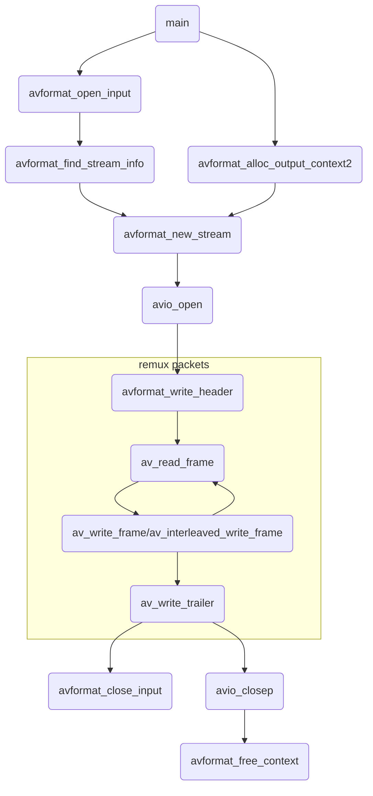
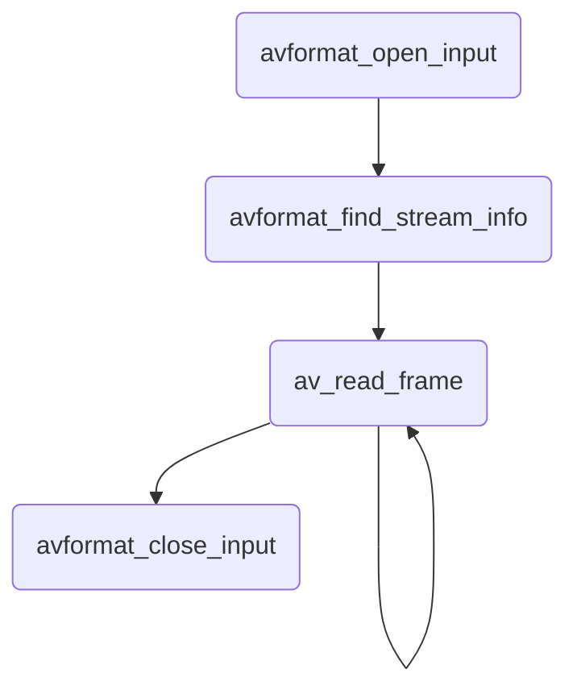
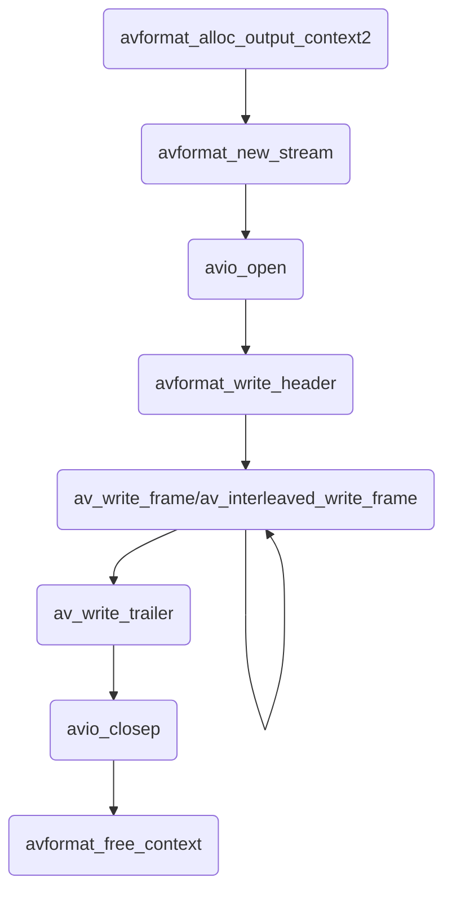

# ffmpeg 的封装格式处理

- [ffmpeg 的封装格式处理](#ffmpeg-的封装格式处理)
  - [封装格式](#封装格式)
  - [查看 ffmpeg 支持的封装格式](#查看-ffmpeg-支持的封装格式)
  - [libavformat 库](#libavformat-库)
    - [主要的 API](#主要的-api)
  - [转封装流程](#转封装流程)
  - [解复用](#解复用)
    - [解复用流程](#解复用流程)
    - [打开媒体文件 avformat_open_input](#打开媒体文件-avformat_open_input)
      - [手动分配 AVFormatContext](#手动分配-avformatcontext)
      - [指定解复用的私有选项](#指定解复用的私有选项)
    - [获取媒体流信息 avformat_find_stream_info](#获取媒体流信息-avformat_find_stream_info)
    - [读取打开的文件 av_read_frame](#读取打开的文件-av_read_frame)
    - [关闭打开的文件 avformat_close_input](#关闭打开的文件-avformat_close_input)
  - [复用](#复用)
    - [复用流程](#复用流程)
    - [设置复用上下文 avformat_alloc_output_context2](#设置复用上下文-avformat_alloc_output_context2)
    - [写入文件头 avformat_write_header](#写入文件头-avformat_write_header)
      - [avformat_init_output](#avformat_init_output)
    - [写入数据包 av_write_frame](#写入数据包-av_write_frame)
    - [完成文件 av_write_trailer](#完成文件-av_write_trailer)

## 封装格式

封装格式(container format)可以看作是编码流(音频流、视频流等)数据的一层外壳，将编码后的数据存储于此封装格式的文件之内。封装又称容器。

不同封装格式适用于不同的场合，支持的编码格式不一样，

ffmpeg 处理封装格式的流程：打开输入文件、打开输出文件、从输入文件读取编码帧、向输出文件写入编码帧。

ffmpeg 中， mux(multiplex) 是复用，表示将多路流(视频、音频、字幕等)混入一路输出(普通文件、流等)。demux 是解复用，表示从一路输入中分离出多路流(视频、音频、字幕等)。mux 处理的是输入格式，demux 处理的是输出格式。输入/输出媒体格式涉及文件格式和封装格式。

- 文件格式：由文件扩展名标识，主要起提示作用，通过扩展名提示文件类型(或封装格式)信息。
- 封装格式：存储媒体内容的实际容器格式，不同的封装格式对应不同的文件扩展名。很多时候也用文件格式指代封装格式。

## 查看 ffmpeg 支持的封装格式

使用 `ffmpeg -formats` 命令可以查看 FFmpeg 支持的封装格式。

## libavformat 库

libavformat 是一个处理 I/O 和复用/解复用的库。

libavformat(lavf) 用于处理多种媒体容器格式。它主要的两个目的是解复用——即将一个媒体文件拆分成组件流，以及反向的复用过程——将提供的数据写入一个指定的容器格式。该库还有一个 `lavf_io I/O 模块`，提供了许多协议用于访问数据(比如文件、TCP、HTTP 等)。在使用 lavf 之前，需要调用 `av_register_all()` 注册所有编译的复用器、解复用器和协议。除非完全确定不需要使用该库的网络功能，也应该调用 `avformat_network_init()`。

`AVInputFormat` 结构体描述了支持的输入格式，`AVOutputFormat` 描述了支持的输出格式。可以使用 `av_iformat_next()`/`av_oformat_next()` 函数迭代所有注册的输入/输出格式。协议层不是公共 API 的一部分，因此只能使用 `avio_enum_protocols` 函数获得支持的协议名称。

`AVFormatContext` 是用于复用和解复用的主要 lavf 结构，它导出读写文件的所有信息。跟大多数 libavformat 结构一样，`AVFormatContext`的大小不是公共 ABI 的一部分，因此不能在栈上或使用 `av_malloc()` 直接分配。想要创建一个 `AVFormatContext`，使用 `avformat_alloc_context()`(有的函数，比如 `avformat_open_input()` 可能会完成这些事情)。

### 主要的 API

FFmpeg 中将编码帧及未编码帧均称作 frame，下面内容将编码帧称作包，未编码帧称作帧。

packet 交织：不同流的数据包在输出媒体文件中应严格按照数据包中 dts 递增的顺序交错存放。

```c
// 打开输入媒体文件，读取文件头，将文件格式信息存储在第一个参数 AVFormatContext 中
int avformat_open_input(AVFormatContext **ps, const char *url, AVInputFormat *fmt, AVDictionary **options);

// 读取一段视频文件数据并尝试解码，将取到的流信息填入 AVFormatContext.streams 中。AVFormatContext.streams 是一个指针数组，数组大小是 AVFormatContext.nb_streams
int avformat_find_stream_info(AVFormatContext *ic, AVDictionary **options);

// 用于解复用过程: 将存储在输入文件中的数据分割为多个包，每次调用得到一个包。包可能是视频帧、音频帧或其他数据。解码器只会解码视频帧或音频帧，不会丢掉非音视频数据，从而提供尽可能多信息给解码器。
// 对于视频来说，一个数据包只包含一个视频帧；对于音频来说，若是帧长固定的格式则一个数据包可包含整数个音频帧，若是帧长可变的格式则一个数据包只包含一个音频帧
int av_read_frame(AVFormatContext *s, AVPacket *pkt);

// 创建并初始化一个 AVIOContext，用于访问输出媒体文件
int avio_open(AVIOContext **s, const char *url, int flags);

// 向输出文件写入文件头信息
int avformat_write_header(AVFormatContext *s, AVDictionary **options);

// 用于复用过程，将数据包写入输出媒体：直接将数据包写入复用器，不会缓存或记录任何 packet。由调用者负责不同流的数据包交织问题
int av_write_frame(AVFormatContext *s, AVPacket *pkt);

// 用于复用过程，将packet写入输出媒体: 在内部缓存 packet，从而确保输出媒体中不同流的数据包能按照 dts 增长的顺序正确交织
int av_interleaved_write_frame(AVFormatContext *s, AVPacket *pkt);

// 向输出文件写入文件尾信息
int av_write_trailer(AVFormatContext *s);
```

## 转封装流程

参考 `doc/examples/remuxing.c`



## 解复用

### 解复用流程



解复用器读入一个媒体文件，将其分割成数据块(packet)。一个 `AVPacket` 的数据包包含一个或多个编码帧，这些帧术语一个基本流(elementary stream)。在 lavf 的 API，这个过程表示为：

- `avformat_open_input()` 打开文件，构建 `AVFormatContext`
- `avformat_find_stream_info()` 读取一段视频文件数据并尝试解码，保存音视频流信息
- `av_read_frame()` 读取一个 packet
- `avformat_close_input()` 关闭输入文件并释放资源

```c
// 参考 doc/examples/demuxing_decoding.c
// open input file, and allocate format context
const char *iURL = "file:in.mp3";
AVFormatContext *pIFmtCtx = NULL;
if (avformat_open_input(&pIFmtCtx, iURL, NULL, NULL) < 0 ) {
    fprintf(stderr, "Could not open source file %s\n", iURL);
    exit(1);
}

// retrieve stream information
if (avformat_find_stream_info(pIFmtCtx, NULL) < 0) {
    fprintf(stderr, "Could not find stream information\n");
    exit(1);
}

// read frames from the file
AVPacket *pPkt = av_packet_alloc();
while (av_read_frame(pIFmtCtx, pPkt) >= 0) {
    // mux or decode packet
    av_packet_unref(pPkt);
}

// close input
avformat_close_input(&pIFmtCtx);
```

### 打开媒体文件 avformat_open_input

- 函数原型 `int avformat_open_input(AVFormatContext **ps, const char *url, AVInputFormat *fmt, AVDictionary **options);`
- 功能：打开一个输入流并读头。编解码器未打开。必须使用 `avformat_close_input()` 流。
- 参数 `ps`: 指向用户提供的 `AVFormatContext`(使用 `avformat_alloc_context` 分配)的指针。指针可能指向 NULL，在这种情况下，通过此函数分配 `AVFormatContext` 并写入 `ps`。
  - **注意**：用户提供的 `AVFormatContext` 释放会出错。
- 参数 `url`: 要打开的流的 URL
- 参数 `fmt`: 如果不是 NULL，这个参数强制一个指定的输入格式。否则格式是自动探测的。
- 参数 `options`: 字典包含 `AVFormatContext` 和解复用器私有的选项。
  - 返回时这个参数会被销毁，并替换成一个包含未找到选项的字段
  - 可以是 NULL
- 返回值：0 表示成功，失败返回一个负的 `AVERROR`
- **注意**：如果想要使用自定义的 IO，预先分配格式上下文，并设置该上细纹的 `pb` 字段

打开文件所需的最小信息是它的 URL。

`avformat_open_input()` 尝试分配 `AVFormatContext`，打开指定的文件(自动探测格式)，读头部，导出这些信息存储到 `pIFmtCtx`。一些格式没有头或者没有在头部存储足够的信息，因此建议调用 `avformat_find_stream_info()`，它会尝试读和解码一些帧来查找缺少的信息。

#### 手动分配 AVFormatContext

在一些场景，可能想要使用 `avformat_alloc_context()` 预分配一个 `AVFormatContext`，对其做一些调整，然后将其传递给 `avformat_open_input()`。一种情况是你想要使用自定义函数读取输入数据而不是 lavf 内部的 I/O 层，为此，使用 `avio_alloc_context()` 创建自己的 `AVIOContext`，将读取回调函数传递给它。然后，将预分配的 `AVFormatContext` 的 `pb` 设置为新创建的 `AVIOContext`。

```c
// 参考 doc/examples/avio_reading.c
AVFormatContext *pIFmtCtx = avformat_alloc_context();
if (!pIFmtCtx) {
    ret = AVERROR(ENOMEM);
    goto end;
}

uint8_t *pAvioCtxBuffer = av_malloc(avioCtxBufferSize);
if (!pAvioCtxBuffer) {
    ret = AVERROR(ENOMEM);
    goto end;
}

AVIOContext *pAvioCtx = avio_alloc_context(pAvioCtxBuffer, avioCtxBufferSize,
                              0, NULL, &read_packet_callback, NULL, NULL);
if (!pAvioCtx) {
    ret = AVERROR(ENOMEM);
    goto end;
}
pIFmtCtx->pb = pAvioCtx;

ret = avformat_open_input(&pIFmtCtx, NULL, NULL, NULL);
if (ret < 0) {
    fprintf(stderr, "Could not open input\n");
    goto end;
}

// read frames from the file

end:
avformat_close_input(&pIFmtCtx);
if (pAvioCtx) {
    av_freep(&pAvioCtx->buffer);
    av_freep(&pAvioCtx);
}
```

#### 指定解复用的私有选项

```c
AVDictionary *options = NULL;
av_dict_set(&options, "video_size", "640*480", 0);
av_dict_set(&options, "pixel_format", "rgb24", 0);

if (avformat_open_input(&pIFmtCtx, iURL, NULL, &options) < 0)
  abort();
av_dixt_free(&options);
```

这段代码传递私有选项 `video_size` 和 `pixel_format` 给解复用器。这对于类似原始视频解复用器是必须的，否则解复用器不知道如何解释原始的视频数据。如果格式最终和原始视频不同，这些选项不会被解复用器识别也不会应用。这样未被识别的选项会在选项字典返回(识别的选项会被消费)。调用的程序可以按照下面的方式处理这些未识别的选项：

```c
AVDictionary *e;
if (e = av_dict_get(options, "", NULL, AV_DICT_IGNORE_SUFFIX)) {
  fprintf(stderr, "Options %s not recognized by the demuxer.\n", e->key);
  abort();
}
```

### 获取媒体流信息 avformat_find_stream_info

- 函数原型 `int avformat_find_stream_info(AVFormatContext *ic, AVDictionary **options);`
- 功能：读取一个媒体文件的数据包以获取流信息。这对于没有头信息(比如 MPEG)是有用的。如果是 MPEG-2 重复帧模式，函数也会计算真实的帧率。
  - 函数不会改变文件的逻辑位置；测试的数据包可被缓存用于后续处理。
- 参数 `ic`: 媒体文件句柄
- 参数 `options`: 如果非 NULL，是一个长度为 `ic.nb_streams` 的字典指针的数组，第 i 个成员包含对应第 i 个流的编解码选项。
  - 函数返回时每个字典包含未找到的选项
- 返回值：大于等于 0 成功，出错返回 `AVERROR_xxx`
- **注意**：函数不确保打开所有编解码器，因此返回非空的 `options` 是完全正常的现象。
- **todo**：让用户决定需要什么样的信息，以便我们不会花费时间填充用户不需要的东西。

### 读取打开的文件 av_read_frame

- 函数原型 `int av_read_frame(AVFormatContext *s, AVPacket *pkt);`
- 功能：返回一个流的下一帧。
  - 此函数返回文件存储的内容，且不会检验是否是解码器的有效帧。函数将文件分成帧，且每次调用返回一帧。它不会忽视有效帧帧间的无效数据，由此提供尽可能多的信息给编码器编码使用。
  - 如果 `pkt->buf` 是 `NULL`，该包在下次调用 `av_read_frame` 或者 `avformat_close_input` 之前都是有效的。否则此包的有效性不确定。在两种情况下，不在使用时都必须使用 `av_packet_unref` 释放包。对于视频，返回的包只包含一帧。对于音频。如果每个帧是固定大小(比如 PCM 或 ADPCM 数据)则返回包包含整数帧。如果音频帧不固定大小(比如 MPEG 音频)，那么返回包只有一帧。
  - `pkt->pts`、`pkt->dts` 和 `pkt->duration` 都设置为基于 `AVStream.time_base` 单位的正确值(如果格式未提供则猜测值)。如果视频格式包含 B 帧，`pkt->pts` 可以是 `AV_NOPTS_VALUE`，因此如果不解压缩负载的话，最好使用 `pkt->dts`。
- 返回值：0 表示成功，负值表示出错或者文件末尾

从打开的 `AVFormatContext` 读取数据是通过对其反复调用 `av_read_frame()` 实现的。每次调用如果成功，会返回一个包含一个流的编码数据的 `AVPacket`，流可通过 `AVPacket.stream_index` 识别。如果想要解码这些数据，可直接传递这个包给 libavcodec 解码函数 `avcodec_send_packet()` 或 `avcodec_decode_subtitle2()`。

如果已知会设置 `AVPacket.pts` `AVPacket.dts` `AVPacket.duration` 时间信息。如果流没有提供，这些字段也可能未设置(及 `pts/dts` 是 `AV_NOPTS_VALUE`，`duration` 是 0)。时间信息是 `AVStream.time_base` 单位，即将其转为秒时需要乘以时基。

如果在返回的包上设置了 `AVPacket.buf`，那么会动态分配该数据包，用户可以一直保留。否则，`AVPacket.buf` 是 `NULL`，该包的数据在解复用的某处静态存储，且仅在下一个 `av_read_frame()` 调用或关闭文件之前有效。如果调用者需要更长的生命周期，`av_dup_packet()` 会对其进行 `av_malloc` 拷贝。这两种情形，都必须在不再使用的时候使用 `av_packet_unref()` 释放包。

### 关闭打开的文件 avformat_close_input

- 函数原型 `void avformat_close_input(AVFormatContext **s);`
- 功能：关闭一个打开的输入 `AVFormatContext`。释放它机器内容，并将 `*s` 设置为 `NULL`

在完成读取文件之后，必须使用 `avformat_close_input()` 关闭它。这个函数会释放和该文件相关的所有资源。

## 复用

### 复用流程



复用器接收 `AVPacket` 类型的编码数据，将其写入指定容器格式的文件或其他输出字节流。

用于复用的主要 API 函数是:

- `avformat_write_header` 写入文件头
- `av_write_frame`/`av_interleaved_write_frame()` 写入包
- `av_write_trailer` 完成文件

```c
// 参考 doc/examples/muxing.c
// allocate the output media context
AVFormatContext *pOFmtCtx = NULL;
avformat_alloc_output_context2(&pOFmtCtx, NULL, NULL, oURL);
if (!pOFmtCtx) {
    fprintf(stderr, "Could not create output context\n");
    ret = AVERROR_UNKNOWN;
    goto end;
}

// save output stream
for (i = 0; i < pIFmtCtx->nb_streams; i++) {
    AVStream *pOStream = avformat_new_stream(pOFmtCtx, NULL);
    if (!pOStream) {
        fprintf(stderr, "Failed allocating output stream\n");
        ret = AVERROR_UNKNOWN;
        goto end;
    }
    // set output stream attribute
}

// open the output file, if needed
if (!(pOFmt->flags & AVFMT_NOFILE)) {
    ret = avio_open(&pOFmtCtx->pb, oURL, AVIO_FLAG_WRITE);
    if (ret < 0) {
        fprintf(stderr, "Could not open output file '%s'", oURL);
        goto end;
    }
}

// write the stream header, if any
ret = avformat_write_header(pOFmtCtx, NULL);
if (ret < 0) {
    fprintf(stderr, "Error occurred when opening output file\n");
    goto end;
}

while (1) {
    // read packet from demuxer/encoder
    // set packet attribute
    ret = av_interleaved_write_frame(pOFmtCtx, &pPkt);
    if (ret < 0) {
        fprintf(stderr, "Error muxing packet\n");
        break;
    }
}

// The trailer must be written before close the CodecContexts open when wrote the header
av_write_trailer(pOFmtCtx);

end:
if (pOFmtCtx && !(pOFmtCtx->flags & AVFMT_NOFILE))
    avio_closep(&pOFmtCtx->pb);// close the output file
// free the stream
avformat_free_context(pOFmtCtx);
```

### 设置复用上下文 avformat_alloc_output_context2

- 函数原型 `int avformat_alloc_output_context2(AVFormatContext **ctx, AVOutputFormat *oformat, const char *format_name, const char *filename);`
- 功能：为输入格式分配一个 `AVFormatContext`。可使用 `avformat_free_context` 释放上下文以及此内部框架申请的所有内容。
- 参数 `ctx`: `*ctx` 设置为创建的格式上下文，失败的话设置为 `NULL`
- 参数 `oformat`: 分配上下文使用的格式。如果是 `NULL` 则使用 `format_name` 和 `filename`
- 参数 `format_name`: 输入格式的名字，用于分配上下文，如果为 `NULL` 则使用 `filename`
- 参数 `filename`: 文件名，用于分配上下文，可以是 `NULL`
- 返回值：成功返回值大于等于 0，失败返回一个负的 `AVERROR`

复用过程开始的时候，调用者首先必须调用 `avformat_alloc_output_context2()` 创建一个复用上下文。然后，调用者通过填充上下文的不同域设置复用器：

- `AVFormatContext.oformat` 域必须设置用于选择要使用的复用器
- 除非格式是 `AVFMT_NOFILE` 类型，`AVFormatContext.pb` 域必须设置为一个打开的 IO 上下文，该上下文由 `avio_open` 返回或是一个自定义的。
- 除非格式是 `AVFMT_NOSTREAMS` 类型，必须使用 `avformat_new_stream()` 创建至少一个流。调用者必须按照已知的填充“流编解码参数”信息 `AVStream.codecpar`，比如编解码类型 `AVCodecParameters.codec_type`、编解码 ID `AVCodecParameters.codec_id` 和其他参数(比如宽度、高度、像素或采样格式等)。流时基 `AVStream.time_base` 应设置为调用者想要用于此流的时基(注意复用器使用的时基可以不同)
- 在 remux 期间，建议仅手动初始化 `AVCodecParameters` 的相关字段，而不是使用 `avcodec_parameters_copy()`: 不能保证编码上下文的值对于输入和输出格式上下文都保持有效。
- 调用者可根据 `AVFormatContext` 文档填充额外的信息，比如“全局的” `AVFormatContext.metadata` 或“单个流的” `AVStream.metadata`，`AVFormatContext.chapters`、`AVFormatContext.programs` 等。这些信息是否存储在输出取决于容器格式和复用器是否支持。

### 写入文件头 avformat_write_header

- 函数原型 `int avformat_write_header(AVFormatContext *s, AVDictionary **options);`
- 功能：分配流的私有数据，并将流的头部写到输出媒体文件
- 参数 `s`: 媒体文件句柄，必须使用 `avformat_alloc_context()` 分配。`s->oformat` 域必须设置用于选择要使用的输出格式；`s->pb` 必须设置为已经打开的 `AVIOContext`
- 参数 `options`: 一个字典，包含 `AVFormatContext` 和复用器私有的选项。返回时这个参数会小会，并替换为包含未查找到的选项的字典。可以是 `NULL`
- 返回值：
  - `AVSTREAM_INIT_IN_WRITE_HEADER` 表示成功，但是编解码没有在 `avformat_init` 完全初始化
    - `AVSTREAM_INIT_IN_WRITE_HEADER` 表示流参数在 `avformat_write_header` 初始化
  - `AVSTREAM_INIT_IN_INIT_OUTPUT` 表示成功，且编解码在 `avformat_init` 完全初始化
    - `AVSTREAM_INIT_IN_INIT_OUTPUT` 表示流参数在 `avformat_init_output` 初始化
  - 出错返回负的 `AVERROR`

当完全设置了复用上下文之后，调用者必须调用 `avformat_write_header()` 来初始化复用器内部并写入文件头。此阶段是否写入任何东西到 IO 上下文取决于复用器，但是必须总调用这个函数。所有的复用器私有选项必须传递给这个函数的 `options` 参数。

#### avformat_init_output

- 函数原型：`int avformat_init_output(AVFormatContext *s, AVDictionary **options);`
- 功能：分配流的私有数据并初始化编解码器，但是不写头部。可在 `avformat_write_header` 之前用于在真正写头部之前初始化流参数。
  - 如果使用这个函数，不要传递相同的 `options` 给 `avformat_write_header`
- 参数 `s`: 媒体文件句柄，必须使用 `avformat_alloc_context()` 分配。`s->oformat` 域必须设置用于选择要使用的输出格式；`s->pb` 必须设置为已经打开的 `AVIOContext`
- 参数 `options`: 一个字典，包含 `AVFormatContext` 和复用器私有的选项。返回时这个参数会小会，并替换为包含未查找到的选项的字典。可以是 `NULL`
- 返回值：
  - `AVSTREAM_INIT_IN_WRITE_HEADER` 表示成功，但是编解码没有在 `avformat_init` 完全初始化
    - `AVSTREAM_INIT_IN_WRITE_HEADER` 表示流参数在 `avformat_write_header` 初始化
  - `AVSTREAM_INIT_IN_INIT_OUTPUT` 表示成功，且编解码在 `avformat_init` 完全初始化
    - `AVSTREAM_INIT_IN_INIT_OUTPUT` 表示流参数在 `avformat_init_output` 初始化
  - 出错返回负的 `AVERROR`

### 写入数据包 av_write_frame

- 函数原型 `int av_write_frame(AVFormatContext *s, AVPacket *pkt);`
- 功能：向输出媒体文件写入一包数据。
  - 此函数将包直接传递给复用器，不会缓存或重排序。如果格式需要，调用者负责正确交织包。
  - 想要 `libavformat` 处理交织的调用者应该调用 `av_interleaved_write_frame` 而不是此函数
- `s`: 媒体文件句柄
- `pkt`: 包含要写的数据的包。
  - **注意**：跟 `av_interleaved_write_frame` 不同，这个函数不持有传递给它的包的所有权(虽然一些复用器可能对这个输入包创建内部引用)
  - 这个参数可以是 `NULL`(任何时候都可以，不仅仅是结束时)，用于立即刷新复用器内部缓存的数据，适用于那些在写到输出之前会在内部缓存数据的复用器
  - `AVPacket.stream_index` 必须设置为 `AVFormatContext.streams` (即 `s->streams`) 的对应流
  - 时间戳(包的 pts/dts)必须设置为基于流的时间基的正确值(除非输出格式的标记包含 `AVFMT_NOTIMESTAMPS`，那么可以将其设置为 `AV_NOPTS_VALUE`)
  - 当比较包的相对时间基时，之后传递给这个函数的包的 dts 必须是严格增长的(除非输出格式的标记包含 `AVFMT_TS_NONSTRICT`，那么 dts 只需要是非减小的)
  - 如果已知，包的 durantion 也必须设置
- 返回值：出错返回负值，0 表示成功，1 表示复用器被刷新且没有数据可以刷新

通过重复调用 `av_write_frame()` 或 `av_interleaved_write_fram()` 将数据发送给复用器。(参阅这些函数的文档查看两个函数的区别；每个复用上下文只使用一个，不能混合使用)注意发送给复用器的包的时间信息应当是对应 `AVStream` 的时基。该时基由复用器(在 `avformat_write_header()` 阶段)设置，且可不同于调用者的时基。

### 完成文件 av_write_trailer

- 函数原型 `int av_write_trailer(AVFormatContext *s);`
- 功能：将流尾部写入输出媒体文件，并释放文件的私有数据
  - 只能在 `avformat_write_header` 调用成功后调用此函数
- 参数 `s`: 媒体文件句柄
- 返回值：成功返回 0，错误返回 `AVERROR_xxx`

一旦写入所有数据，调用者必须调用 `av_write_trailer()` 来清空所有缓存的包，并完成输出文件，然后关闭 IO 上下文(如果有的话)，并最终使用 `avformat_free_context()` 释放复用上下文。
