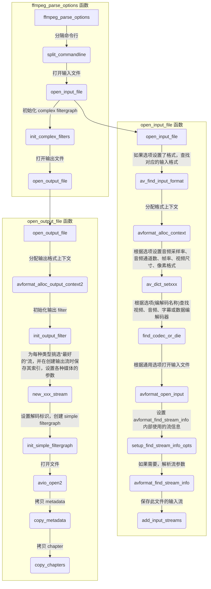
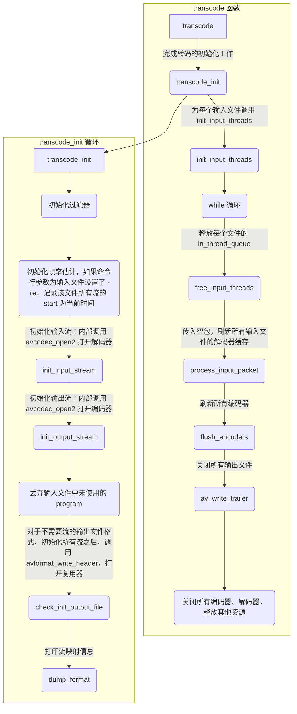
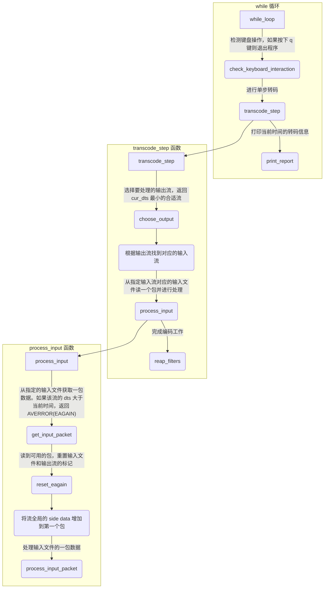

# ffmpeg 解读

- [ffmpeg 解读](#ffmpeg-解读)
  - [概述](#概述)
  - [流程](#流程)
    - [main 函数](#main-函数)
    - [ffmpeg_parse_options 函数](#ffmpeg_parse_options-函数)
      - [OptionDef 结构体](#optiondef-结构体)
      - [options 数组](#options-数组)
    - [transcode 函数](#transcode-函数)
      - [init_input_threads](#init_input_threads)
      - [reap_filters 函数](#reap_filters-函数)

## 概述

`ffmpeg.c` 是基于 ffmpeg 库的一个多媒体转换器。

## 流程

### main 函数


### ffmpeg_parse_options 函数



- `new_xxx_stream` 为每种类型挑选“最好的”流，并在创建输出流时保存“最好”输入流的索引
  - 视频：分辨率最好的，`new_video_stredam` 创建视频流
  - 音频：通道数最多的，`new_audio_stream` 创建音频流
  - 字幕：选择第一个，`new_subtitle_stream` 创建字幕流
  - 数据：选择编码器匹配的，`new_data_stream` 创建数据流

#### OptionDef 结构体

```c
// cmdutils.h
typedef struct OptionDef {
    const char *name;
    int flags;
#define HAS_ARG    0x0001
#define OPT_BOOL   0x0002
#define OPT_EXPERT 0x0004
#define OPT_STRING 0x0008
#define OPT_VIDEO  0x0010
#define OPT_AUDIO  0x0020
#define OPT_INT    0x0080
#define OPT_FLOAT  0x0100
#define OPT_SUBTITLE 0x0200
#define OPT_INT64  0x0400
#define OPT_EXIT   0x0800
#define OPT_DATA   0x1000
#define OPT_PERFILE  0x2000     /* the option is per-file (currently ffmpeg-only).
                                   implied by OPT_OFFSET or OPT_SPEC */
#define OPT_OFFSET 0x4000       /* option is specified as an offset in a passed optctx */
#define OPT_SPEC   0x8000       /* option is to be stored in an array of SpecifierOpt.
                                   Implies OPT_OFFSET. Next element after the offset is
                                   an int containing element count in the array. */
#define OPT_TIME  0x10000
#define OPT_DOUBLE 0x20000
#define OPT_INPUT  0x40000
#define OPT_OUTPUT 0x80000
     union {
        void *dst_ptr;
        int (*func_arg)(void *, const char *, const char *);
        size_t off;
    } u;
    const char *help;
    const char *argname;
} OptionDef;
```

- name: 存储选项的名称。如 `f`/`y`/`c` 等
- flags: 存储选项值的类型。如 `HAS_ARG`(有选项值)/`OPT_BOOL`(选项值为布尔类型)/`OPT_TIME`(选项值为时间类型)
- u: 存储选项的处理函数
  - `dst_ptr` 直接修改对应字段的值
  - `func_arg` 解析选项的回调函数
  - `off` 修改相对 `OptionsContext` 结构体的指定偏移量的字段值
- help: 选项的说明信息
- argname: 选项的别名

#### options 数组

ffmpeg 使用 `const OptionDef options[]` 数组保存所有选项。其中一部分通用选项存储在 `CMDUTILS_COMMON_OPTIONS` 宏中。

```c
const OptionDef options[] = {
    /* main options */
    CMDUTILS_COMMON_OPTIONS
    { "f",              HAS_ARG | OPT_STRING | OPT_OFFSET |
                        OPT_INPUT | OPT_OUTPUT,                      { .off       = OFFSET(format) },
        "force format", "fmt" },
    { "y",              OPT_BOOL,                                    {              &file_overwrite },
        "overwrite output files" },
    { "n",              OPT_BOOL,                                    {              &no_file_overwrite },
        "never overwrite output files" },
    { "ignore_unknown", OPT_BOOL,                                    {              &ignore_unknown_streams },
        "Ignore unknown stream types" },
    { "copy_unknown",   OPT_BOOL | OPT_EXPERT,                       {              &copy_unknown_streams },
        "Copy unknown stream types" },
    { "c",              HAS_ARG | OPT_STRING | OPT_SPEC |
                        OPT_INPUT | OPT_OUTPUT,                      { .off       = OFFSET(codec_names) },
        "codec name", "codec" },
    ......
}


#define CMDUTILS_COMMON_OPTIONS                                                                                         \
    { "L",           OPT_EXIT,             { .func_arg = show_license },     "show license" },                          \
    { "h",           OPT_EXIT,             { .func_arg = show_help },        "show help", "topic" },                    \
    { "?",           OPT_EXIT,             { .func_arg = show_help },        "show help", "topic" },                    \
    { "help",        OPT_EXIT,             { .func_arg = show_help },        "show help", "topic" },                    \
    { "-help",       OPT_EXIT,             { .func_arg = show_help },        "show help", "topic" },                    \
    { "version",     OPT_EXIT,             { .func_arg = show_version },     "show version" },                          \
    ......
```

### transcode 函数





#### init_input_threads

- init_input_threads 为每个输入文件创建 AVPacket 队列 in_thread_queue，创建 input_thread 线程
- input_thread 有一个 while 循环
  - av_read_frame 从文件读一包
  - 将读到的包发送到 in_thread_queue

#### reap_filters 函数
