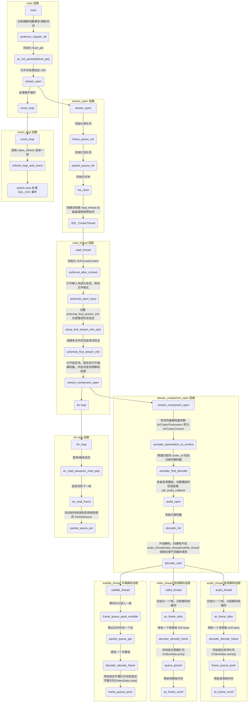
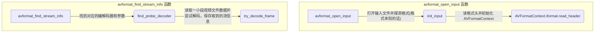

# ffplay 解读

- [ffplay 解读](#ffplay-解读)
  - [概述](#概述)
  - [流程](#流程)
  - [重要函数](#重要函数)

## 概述

`ffplay.c` 是基于 ffmpeg 库的一个简单的媒体播放器。它初始化运行环境，把各个数据结构和功能函数组织起来，协调数据流和功能函数，响应用户操作，启动并控制程序运行。

## 流程





## 重要函数

```text
static int packet_queue_put_private(PacketQueue *q, AVPacket *pkt)
  向音视频队列中添加一个音视频数据帧/包，不用加锁和解锁。
  申请分配一个 MyAVPacketList 结构，然后浅拷贝 AVPacket 数据，链表末尾置空。将新的 MyAVPacketList 放在队列末尾，更新队列的媒体数据统计信息。最后设置信号量通知等待的解码线程
static int packet_queue_put(PacketQueue *q, AVPacket *pkt)
  向音视频队列中添加一个音视频数据帧/包，需要手动加锁和解锁以同步
static int packet_queue_init(PacketQueue *q)
  初始化队列。
  初始化为 0 后创建线程同步使用的互斥量和条件量
static void packet_queue_flush(PacketQueue *q)
  刷新队列。
  释放队列中所有动态分配的内存，包括音视频裸数据占用的内存(MyAVPacketList.pkt)和 MyAVPacketList 结构占用的内存
static void packet_queue_destroy(PacketQueue *q)
  释放队列占用的所有资源。
  首先释放所有动态分配的内存，然后释放申请的互斥量和条件量
static void packet_queue_abort(PacketQueue *q)
  设置异常请求退出状态，释放队列占用的资源
static int packet_queue_get(PacketQueue *q, AVPacket *pkt, int block, int *serial)
  从队列取出一帧包/数据。
  如果异常请求标记被置为，返回错误码 -1。
  如果队列有数据，取出第一个数据包，更新队列的媒体数据统计信息，浅拷贝，释放被拷贝的结构，返回 1。
  如果是非阻塞模式，队列没有数据，直接返回 0。
  如果是阻塞模式，没有数据进入睡眠状态等待互斥量和信号量。

static int decoder_decode_frame(Decoder *d, AVFrame *frame, AVSubtitle *sub)
  从队列取一个数据帧/包，进行解码，得到音视频帧 AVFrame 或字幕帧 AVSubtitle。

static Frame *frame_queue_peek_writable(FrameQueue *f)
  等待信号量直到可以放入一个新的音视频帧 AVFrame
static int queue_picture(VideoState *is, AVFrame *src_frame, double pts, double duration, int64_t pos, int serial)
  放入一个新的图像帧 Frame。
  判断是否可以放入图像帧(可能需要等待)。不能写入返回错误码 -1。
  设置图像的属性。
  放入 VideoState.pictq 图像队列。
static int get_video_frame(VideoState *is, AVFrame *frame)
  取出音视频帧/字幕帧，并计算同步时钟

static int audio_decode_frame(VideoState *is)
  解码一个音频帧并返回解压的数据大小。  
```
