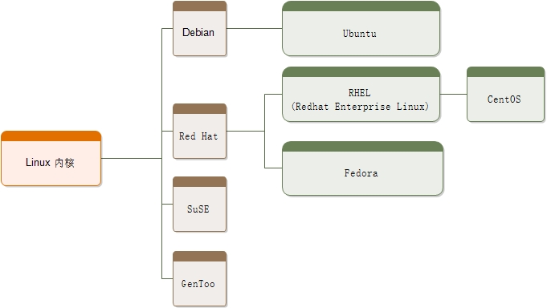

# 1 简介

- [1 简介](#1-%E7%AE%80%E4%BB%8B)
  - [1.1 操作系统概述](#11-%E6%93%8D%E4%BD%9C%E7%B3%BB%E7%BB%9F%E6%A6%82%E8%BF%B0)
    - [1.1.1 操作系统](#111-%E6%93%8D%E4%BD%9C%E7%B3%BB%E7%BB%9F)
  - [1.2 UNIX vs Linux](#12-unix-vs-linux)
    - [1.2.1 UNIX/Linux 系统结构](#121-unixlinux-%E7%B3%BB%E7%BB%9F%E7%BB%93%E6%9E%84)
  - [1.3 Linux 系统的优缺点](#13-linux-%E7%B3%BB%E7%BB%9F%E7%9A%84%E4%BC%98%E7%BC%BA%E7%82%B9)
  - [1.4 Linux 的发行版](#14-linux-%E7%9A%84%E5%8F%91%E8%A1%8C%E7%89%88)
    - [1.4.1 Linux 发行版及特点汇总](#141-linux-%E5%8F%91%E8%A1%8C%E7%89%88%E5%8F%8A%E7%89%B9%E7%82%B9%E6%B1%87%E6%80%BB)
    - [1.4.2 Linux 发行版本的选择](#142-linux-%E5%8F%91%E8%A1%8C%E7%89%88%E6%9C%AC%E7%9A%84%E9%80%89%E6%8B%A9)
  - [1.5 Linux 应用领域](#15-linux-%E5%BA%94%E7%94%A8%E9%A2%86%E5%9F%9F)
    - [1.5.1 服务器](#151-%E6%9C%8D%E5%8A%A1%E5%99%A8)
    - [1.5.2 电影工业](#152-%E7%94%B5%E5%BD%B1%E5%B7%A5%E4%B8%9A)
    - [1.5.3 嵌入式应用](#153-%E5%B5%8C%E5%85%A5%E5%BC%8F%E5%BA%94%E7%94%A8)
  - [1.6 开源软件](#16-%E5%BC%80%E6%BA%90%E8%BD%AF%E4%BB%B6)
  - [1.7 开源协议](#17-%E5%BC%80%E6%BA%90%E5%8D%8F%E8%AE%AE)
    - [1.7.1 Apache 许可证版本(Apache License Version)协议](#171-apache-%E8%AE%B8%E5%8F%AF%E8%AF%81%E7%89%88%E6%9C%ACapache-license-version%E5%8D%8F%E8%AE%AE)
    - [1.7.2 BSD(Berkeley Software Distribution，伯克利软件发布版)协议](#172-bsdberkeley-software-distribution%E4%BC%AF%E5%85%8B%E5%88%A9%E8%BD%AF%E4%BB%B6%E5%8F%91%E5%B8%83%E7%89%88%E5%8D%8F%E8%AE%AE)
    - [1.7.3 GNU GPL(GNU General Public License，GNU 通用公共许可证)](#173-gnu-gplgnu-general-public-licensegnu-%E9%80%9A%E7%94%A8%E5%85%AC%E5%85%B1%E8%AE%B8%E5%8F%AF%E8%AF%81)
    - [1.7.4 GUN LGPL(GNU Lesser General Public License，GNU 宽通用公共许可证)](#174-gun-lgplgnu-lesser-general-public-licensegnu-%E5%AE%BD%E9%80%9A%E7%94%A8%E5%85%AC%E5%85%B1%E8%AE%B8%E5%8F%AF%E8%AF%81)
    - [1.7.5 MIT(Massachusetts Institute of Technology)协议](#175-mitmassachusetts-institute-of-technology%E5%8D%8F%E8%AE%AE)
    - [1.7.6 如何选择开源协议](#176-%E5%A6%82%E4%BD%95%E9%80%89%E6%8B%A9%E5%BC%80%E6%BA%90%E5%8D%8F%E8%AE%AE)
  - [1.3 Linux vs Windows](#13-linux-vs-windows)

## 1.1 操作系统概述

- 计算机是一台机器，它按照用户的要求接收信息、存储数据、处理数据，然后再将处理结果输出(文字、图片、音频、视频等)。计算机由硬件和软件组成
  - 硬件是计算机赖以工作的实体，包括显示器、键盘、鼠标、硬盘、CPU、主板等
  - 软件会按照用户的要求协调整台计算机的工作，比如 Windows、Linux、Mac OS、Android 等操作系统，以及 Office、QQ、迅雷、微信等应用程序

### 1.1.1 操作系统

- 操作系统(Operating System，OS)是软件的一部分，是硬件基础上的第一层软件，是硬件和其它软件沟通的桥梁(或者说接口、中间人、中介等)
- 操作系统会控制其他程序运行，管理系统资源，提供最基本的计算功能。如管理及配置内存、决定系统资源供需的优先次序等，同时还提供一些基本的服务程序，例如
  - **文件系统**：提供计算机存储信息的结构，信息存储在文件中，文件主要存储在计算机的内部硬盘里，在目录的分层结构中组织文件。文件系统为操作系统提供了组织管理数据的方式
  - **设备驱动程序**：提供连接计算机的每个硬件设备的接口，设备驱动器使程序能够写入设备，而不需要了解执行每个硬件的细节
  - **用户接口**：操作系统需要为用户提供一种运行程序和访问文件系统的方法。如常用的 Windows 图形界面，可以理解为一种用户与操作系统交互的方式；智能手机的 Android 或 iOS 系统，也是一种操作系统的交互方式
  - **系统服务程序**：当计算机启动时，会自启动许多系统服务程序，执行安装文件系统、启动网络服务、运行预定任务等操作

    

- 目前流行的服务器和 PC 端操作系统有 Linux、Windows、UNIX 等，手机操作系统有 Android、iOS、Windows Phone(简称 WP)，嵌入式操作系统有 Windows CE、PalmOS、eCos、uClinux 等

## 1.2 UNIX vs Linux

- 区别
  - UNIX 系统大多是与硬件配套的，即大多数 UNIX 系统如 AIX、HP-UX 等是无法安装在 x86 服务器和个人计算机上的，而 Linux 则可以运行在多种硬件平台上
  - UNIX 是商业软件，而 Linux 是开源软件，是免费、公开源代码
- 联系
  - Linux 是一套免费使用和自由传播的类 Unix 操作系统，Unix 要早于 Linux，Linux 的初衷就是要替代 UNIX，并在功能和用户体验上进行优化
  - Linux 是一个基于 POSIX 和 UNIX 的多用户、多任务、支持多线程和多 CPU 的操作系统
  - Linux 能运行主要的 UNIX 工具软件、应用程序和网络协议。它支持 32 位和 64 位硬件
  - Linux 继承了 UNIX 以网络为核心的设计思想，是一个性能稳定的多用户网络操作系统

### 1.2.1 UNIX/Linux 系统结构

- UNIX/Linux 系统可以粗糙地抽象为 3 个层次，如图所示。底层是 UNIX/Linux 操作系统，即系统内核(Kernel)；中间层是 Shell 层，即命令解释层；高层则是应用层
  
  

- 内核层：UNIX/Linux 系统的核心和基础，它直接附着在硬件平台之上，控制和管理系统内各种资源(硬件资源和软件资源)，有效地组织进程的运行，从而扩展硬件的功能，提高资源的利用效率，为用户提供方便、高效、安全、可靠的应用环境
- Shell 层：与用户直接交互的界面。用户可以在提示符下输入命令行，由 Shell 解释执行并输出相应结果或者有关信息，所以也把 Shell 称作命令解释器，利用系统提供的丰富命令可以快捷而简便地完成许多工作
- 应用层：提供基于 X Window 协议的图形环境。X Window 协议定义了一个系统所必须具备的功能(就如同 TCP/IP 是一个协议，定义软件所应具备的功能)，系统能满足此协议及符合 X 协会其他的规范，便可称为 X Window

## 1.3 Linux 系统的优缺点

- Linux 不可比拟的优势
  - 大量的可用软件及免费软件：比如 Apache、Samba、PHP、MySQL 等，构建成本低廉，是 Linux 被众多企业青睐的原因之一。当然，这和 Linux 出色的性能是分不开的，否则，节约成本就没有任何意义
  - 良好的可移植性及灵活注：几乎支持所有的 CPU 平台，使得它便于裁剪和定制。可以把 Linux 放在 U 盘、光盘等存储介质中，也可以在嵌入式领域广泛应用
    - 如果希望不进行安装就体验 Linux 系统，可在网上下载一个 Live DVD 版的 Linux 镜像，刻成光盘放入光驱或者用虚拟机软件直接载入镜像文件，设置 CMOS/BIOS 为光盘启动，系统就会自动载入光盘文件，启动进入 Linux 系统
  - 优良的稳定性和安全性：Linux 开放源代码，将所有代码放在网上，全世界的程序员都看得到，有什么缺陷和漏洞，很快就会被发现，从而成就了它的稳定性和安全注
  - 支持几乎所有的网络协议及开发语言：UNIX 系统是与 C 语言、TCP/IP 协议一同发展起来的，而 Linux 是 UNIX 的一种，C 语言又衍生出了现今主流的语言 PHP、Java、C++ 等，而网络协议都与 TCP/IP 有关。所以，Linux 对网络协议和开发语言的支持很好
- Linux 的缺点：桌面应用还有待完善(Linux 在办公应用和游戏娱乐方面的软件相比 Windows 系统还很匮乏)、Linux 的标准统一还需要推广、开源软件的盈利模式与发展还有待考验等

## 1.4 Linux 的发行版

- 从技术上来说，李纳斯•托瓦兹开发的 Linux 只是一个内核。内核指的是一个提供设备驱动、文件系统、进程管理、网络通信等功能的系统软件，内核并不是一套完整的操作系统，它只是操作系统的核心
- Linux 的发行版：一些组织或厂商将 Linux 内核与各种软件和文档包做一个打包，并提供系统安装界面和系统配置、设定与管理工具
- Linux 的各个发行版本使用的是同一个 Linux 内核，因此在内核层不存在什么兼容性问题，每个版本有不一样的感觉，只是在发行版本的最外层(由发行商整合开发的应用)才有所体现

  

- Linux 的发行版本可以大体分为两类
  - 商业公司维护的发行版本，以著名的 Red Hat 为代表
  - 社区组织维护的发行版本，以 Debian 为代表
- 知名的发行版
  - Ubuntu：基于知名的 Debian Linux 发展而来，界面友好，容易上手，对硬件的支持非常全面，是目前最适合做桌面系统的 Linux 发行版本，而且 Ubuntu 的所有发行版本都免费提供
  - Red Hat：公司的产品主要包括 RHEL(Red Hat Enterprise Linux，收费版本)和 CentOS(RHEL 的社区克隆版本，免费版本)、Fedora Core(由 Red Hat 桌面版发展而来，免费版本)
    - CentOS 是基于 Red Hat Enterprise Linux 源代码重新编译、去除 Red Hat 商标的产物，各种操作使用和付费版本没有区别，且完全免费。缺点是不向用户提供技术支持，也不负任何商业责任
  - SuSE Linux：可以非常方便地实现与 Windows 的交互，硬件检测非常优秀，拥有界面友好的安装过程、图形管理工具，对于终端用户和管理员来说使用非常方便
  - Gentoo Linux：所有 Linux 发行版本里安装最复杂的，到目前为止仍采用源码包编译安装操作系统。不过，它是安装完成后最便于管理的版本，也是在相同硬件环境下运行最快的版本。具有高度的自定制性(基于源代码的发行版)。尽管安装时可以选择预先编译好的软件包，但是大部分使用 Gentoo 的用户都选择自己手动编译，因此适合比较有 Linux 使用经验的用户使用

### 1.4.1 Linux 发行版及特点汇总

| 版本名称 | 网址 | 特点 | 软件包管理器 |
| --- | --- | --- |--- |
| Debian Linux | www.debian.org | 开放的开发模式，且易于进行软件包升级 | apt |
| Ubuntu | www.ubuntu.com | 优秀易用的桌面环境，基于 Debian 构建 | apt |
| Fedora Core | www.redhat.com | 拥有数量庞人的用户，优秀的社区技术支持。并且有许多创新 | up2date(rpm)，yum (rpm) |
| CentOS | www.centos.org | CentOS 就是将商业的 Linux 操作系统 RHEL 进行源代码再编译后分发，并在 RHEL 的基础上修正了不少已知的漏洞 | rpm |
| SuSE Linux | www.suse.com | 专业的操作系统，易用的 YaST 软件包管理系统 | YaST(rpm)，第三方 apt (rpm)软件库(repository) |
| Gentoo Linux | www.gentoo.org | 高度的可定制性，使用手册完整 | portage |

### 1.4.2 Linux 发行版本的选择

- Linux 的发行版本众多，选择 Linux 发行版本的建议
  - 如果只是需要一个桌面系统，而且既不想使用盗版，又不想花大价钱购买商业软件，不想自己定制，也不想在系统上浪费太多时间，则可以选择 Ubuntu
  - 如果需要一个服务器系统，且已经厌烦了各种 Linux 的配置，只是想要一个比较稳定的服务器系统，那么建议选择 CentOS 或 RHEL
  - 如果需要使用数据库高级服务和电子邮件网络应用，则可以选择 SuSE
  - 如果想深入摸索一下 Linux 各个方面的知识，而且想非常灵活地定制自己的 Linux 系统，选择 Gentoo

## 1.5 Linux 应用领域

### 1.5.1  服务器

- 通常服务器使用 LAMP(Linux + Apache + MySQL + PHP)或 LNMP(Linux + Nginx+ MySQL + PHP)组合
- 服务器使用 Linux 而不使用 UNIX 或 Windows：使用 Linux 成本较低，而 UNIX 和 Windows 都是商业软件；而且 Linux 服务器非常高效和稳定

### 1.5.2 电影工业

- Linux 作为开源软件，可以节省大量成本
- Linux 具有商业软件不具备的功能定制化特点，各家电影厂商都可依据自己的制片需要铺设相关平台

### 1.5.3 嵌入式应用

- 嵌入式系统是以应用为中心，以计算机技术为基础，并且软硬件可定制，适用于各种应用场合，对功能、可靠注、成本、体积、功耗有严格要求的专用计算机系统。它一般由嵌入式微处理器、外围硬件设备、嵌入式操作系统及用户的应用程序 4 部分组成，用于实现对其他设备的控制、监视或管理等
- 安卓是基于 Linux 的开源系统，主要适用于便携设备，如智能手机和平板电脑等，是Google公司为移动终端打造的真正开放和完整的移动软件

## 1.6 开源软件

- Linux 是一款开源软件，我们可以随意浏览和修改它的源代码
- 开源软件就是把软件程序与源代码文件一起打包提供给用户，用户既可以不受限制地使用该软件的全部功能，也可以根据自己的需求修改源代码，甚至编制成衍生产品再次发布出去
- 开源软件的优点

  | 优点 | 说明 |
  | --- | --- |
  | 低风险 | 一旦封闭的源代码没有人来维护，你将进退维谷；而且相较于商业软件公司，开源社区很少存在倒闭的问题 |
  | 高品质 | 相较于闭源软件产品，开源项目通常是由开源社区来研发及维护的，参与编写、维护、测试的用户量众多，一般的 bug 还没有等爆发就已经被修补 |
  | 低成本 | 开源工作者都是在幕后默默且无偿地付出劳动成果，因此使用开源社区推动的软件项目可以节省大量的人力、物力和财力 |
  | 更透明 | 没有人会把木马、后门等放到开放的源代码中，这样无疑是把自己的罪行暴露在阳光之下 |

- 典型的开源软件

  | 软件 | 说明 |
  | --- | --- |
  | Linux | Linux 是一款开源的操作系统，它的内核由多名极客共同维护。Linux 是开源软件的经典之作、代表之作、巅峰之作 |
  | Apache | 世界使用排名第一的 Web 服务器软件 |
  | MySQL | 世界上最流行的关系型数据库，适合中小型网站 |
  | Firefox | 火狐浏览器。在 Chrome 推出之前，Firefox 几乎是最快速的浏览器，直到现在也是 Web 开发人员的调试利器 |
  | OpenOffice | 一套跨平台的办公软件套件，类似 Microsoft Office |
  | GCC | C语言/C++编译器 |
  | Java、PHP、Python | 开源的编程语言 |

- 国内外开源社区推荐：开源中国、ChinaUnix、GitHub、Apache、SourceForge

## 1.7 开源协议

- 开源软件在追求“自由”的同时，不能牺牲程序员的利益，否则将会影响程序员的创造激情，因此世界上现在有 60 多种被开源促进组织(Open Source Initiative)认可的开源许可协议来保证开源工作者的权益
- 开源协议规定了你在使用开源软件时的权利和责任，也就是规定了你可以做什么，不可以做什么
- 开源协议虽然不一定具备法律效力，但是当涉及软件版权纠纷时，开源协议也是非常重要的证据之一

### 1.7.1 Apache 许可证版本(Apache License Version)协议

- Apache 和 BSD 类似，都适用于商业软件。Apache 协议在为开发人员提供版权及专利许可的同时，允许用户拥有修改代码及再发布的自由
- 现在热门的 Hadoop、Apache HTTP Server、MongoDB 等项目都是基于该许可协议研发的，程序开发人员在开发遵循该协议的软件时，要严格遵守下面的四个条件
  - 该软件及其衍生品必须继续使用 Apache 许可协议
  - 如果修改了程序源代码，需要在文档中进行声明
  - 若软件是基于他人的源代码编写而成的，则需要保留原始代码的协议、商标、专利声明及其他原作者声明的内容信息
  - 如果再发布的软件中有声明文件，则需在此文件中标注 Apache 许可协议及其他许可协议

### 1.7.2 BSD(Berkeley Software Distribution，伯克利软件发布版)协议

- BSD 协议基本上允许用户“为所欲为”，用户可以使用、修改和重新发布遵循该许可的软件，并且可以将软件作为商业软件发布和销售，前提是需要满足下面三个条件
  - 如果再发布的软件中包含源代码，则源代码必须继续遵循 BSD 许可协议
  - 如果再发布的软件中只有二进制程序，则需要在相关文档或版权文件中声明原始代码遵循了 BSD 协议
  - 不允许用原始软件的名字、作者名字或机构名称进行市场推广
- BSD 对商业比较友好，很多公司在选用开源产品的时候都首选 BSD 协议，因为可以完全控制这些第三方的代码，甚至在必要的时候可以修改或者二次开发

### 1.7.3 GNU GPL(GNU General Public License，GNU 通用公共许可证)

- 只要软件中包含了遵循 GPL 协议的产品或代码，该软件就必须也遵循 GPL 许可协议，也就是必须开源免费，不能闭源收费，因此这个协议并不适合商用软件
- 遵循 GPL 协议的开源软件数量极其庞大，包括 Linux 系统在内的大多数的开源软件都是基于这个协议的
- GPL 开源协议的主要特点

  | 特点 | 说明 |
  | --- | --- |
  | 复制自由 | 允许把软件复制到任何人的电脑中，并且不限制复制的数量 |
  | 传播自由 | 允许软件以各种形式进行传播 |
  | 收费传播 | 允许在各种媒介上出售该软件，但必须提前让买家知道这个软件可以免费获得；因此，开源软件一般是通过为用户提供有偿服务的形式盈利 |
  | 修改自由 | 允许开发人员增加或删除软件的功能，但软件修改后必须依然基于 GPL 许可协议授权 |

### 1.7.4 GUN LGPL(GNU Lesser General Public License，GNU 宽通用公共许可证)

- LGPL 是 GPL 的一个衍生版本，也被称为 GPL V2，该协议主要是为类库设计的开源协议
- LGPL 允许商业软件通过类库引用(link)的方式使用 LGPL 类库，而不需要开源商业软件的代码。这使得采用 LGPL 协议的开源代码可以被商业软件作为类库引用并发布和销售
- 但是如果修改 LGPL 协议的代码或者衍生品，则所有修改的代码，涉及修改部分的额外代码和衍生的代码都必须采用 LGPL 协议
- 因此 LGPL 协议的开源代码很适合作为第三方类库被商业软件引用，但不适合希望以 LGPL 协议代码为基础，通过修改和衍生的方式做二次开发的商业软件采用

### 1.7.5 MIT(Massachusetts Institute of Technology)协议

- 目前限制最少的开源许可协议之一(比 BSD 和 Apache 的限制都少)，只要程序的开发者在修改后的源代码中保留原作者的许可信息即可，因此普遍被商业软件所使用
- 使用 MIT 协议的软件有 PuTTY、X Window System、Ruby on Rails、Lua 5.0 onwards、Mono 等

### 1.7.6 如何选择开源协议

## 1.3 Linux vs Windows

- 目前国内 Linux 更多的是应用于服务器上，而桌面操作系统更多使用的是 Windows。主要区别如下

| 比较 | Windows | Linux |
| --- | --- | --- |
| 界面 | 界面统一，外壳程序固定所有 Windows 程序菜单几乎一致，快捷键也几乎相同 | 图形界面风格依发布版不同而不同，可能互不兼容。GNU/Linux 的终端机是从 UNIX 传承下来，基本命令和操作方法也几乎一致 |
| 驱动程序 | 驱动程序丰富，版本更新频繁。默认安装程序里面一般包含有该版本发布时流行的硬件驱动程序，之后所出的新硬件驱动依赖于硬件厂商提供。对于一些老硬件，如果没有了原配的驱动有时很难支持。另外，有时硬件厂商未提供所需版本的 Windows 下的驱动，也会比较头痛 | 由志愿者开发，由 Linux 核心开发小组发布，很多硬件厂商基于版权考虑并未提供驱动程序，尽管多数无需手动安装，但是涉及安装则相对复杂，使得新用户面对驱动程序问题(是否存在和安装方法)会一筹莫展。但是在开源开发模式下，许多老硬件尽管在Windows下很难支持的也容易找到驱动。HP、Intel、AMD 等硬件厂商逐步不同程度支持开源驱动，问题正在得到缓解 |
| 使用 | 使用比较简单，容易入门。图形化界面对没有计算机背景知识的用户使用十分有利 | 图形界面使用简单，容易入门。文字界面，需要学习才能掌握 |
| 学习 | 系统构造复杂、变化频繁，且知识、技能淘汰快，深入学习困难 | 系统构造简单、稳定，且知识、技能传承性好，深入学习相对容易 |
| 软件 | 每一种特定功能可能都需要商业软件的支持，需要购买相应的授权 | 大部分软件都可以自由获取，同样功能的软件选择较少 |
| 大小写 | 不区分 | 区分 |
| 扩展名 | 依赖以区分文件类型 | 不区分。通过权限位标识确定文件类型 |

- Linux 中的一些特殊文件要求写"扩展名"，但并不是 Linux 一定要靠扩展名来识别文件类型，写这些扩展名是为了帮助管理员来区分不同的文件类型。这样的文件扩展名主要有
  - 压缩包：Linux 下常见的压缩文件名有 gz/bz2/zip/tar.gz/tar.bz2/tgz 等。就算没写扩展名，在 Linux 中一样可以解压缩，不影响使用
  - 二进制软件包：CentOS 中所使用的二进制安装包是 RPM 包，所有 RPM 包用 rpm 扩展名结尾，目的同样是让管理员一目了然
  - 程序文件：Shell 脚本一般用 sh 扩展名结尾，其他还有用 c 扩展名结尾的 C 语言文件等
  - 网页文件：网页文件一般使用 php 等结尾，不过这是网页服务器的要求，而不是 Linux 的要求
