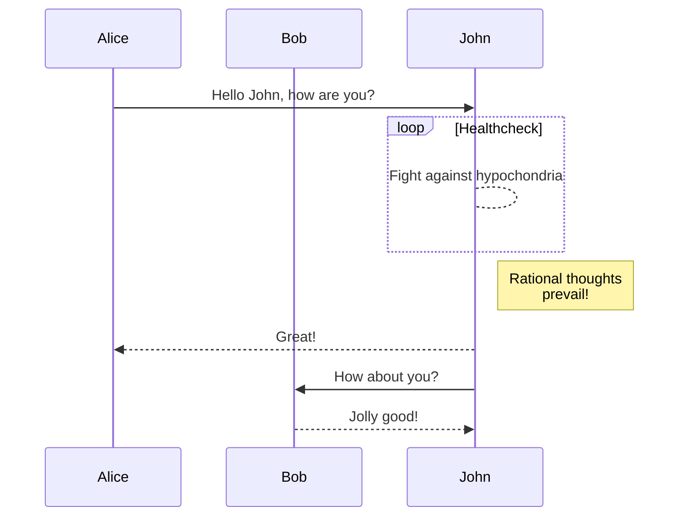
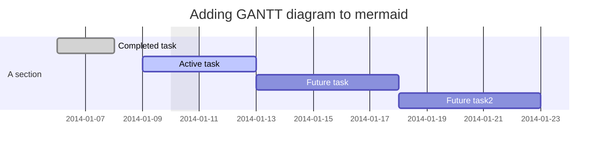
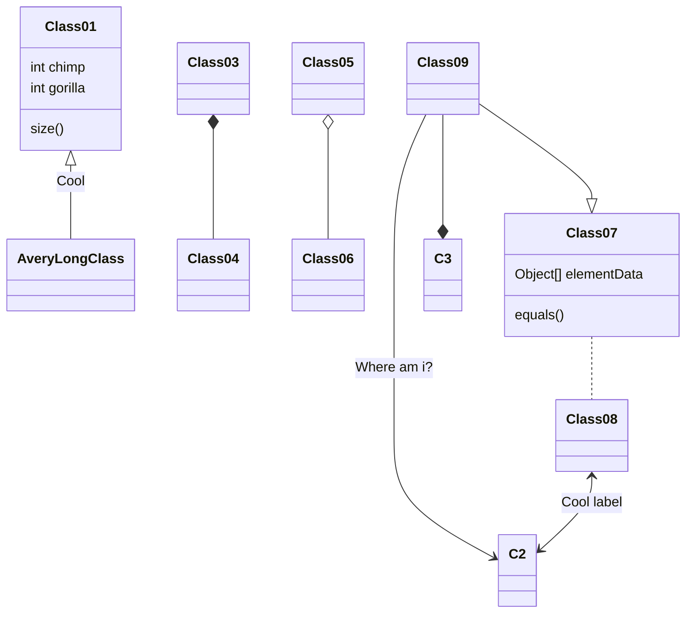
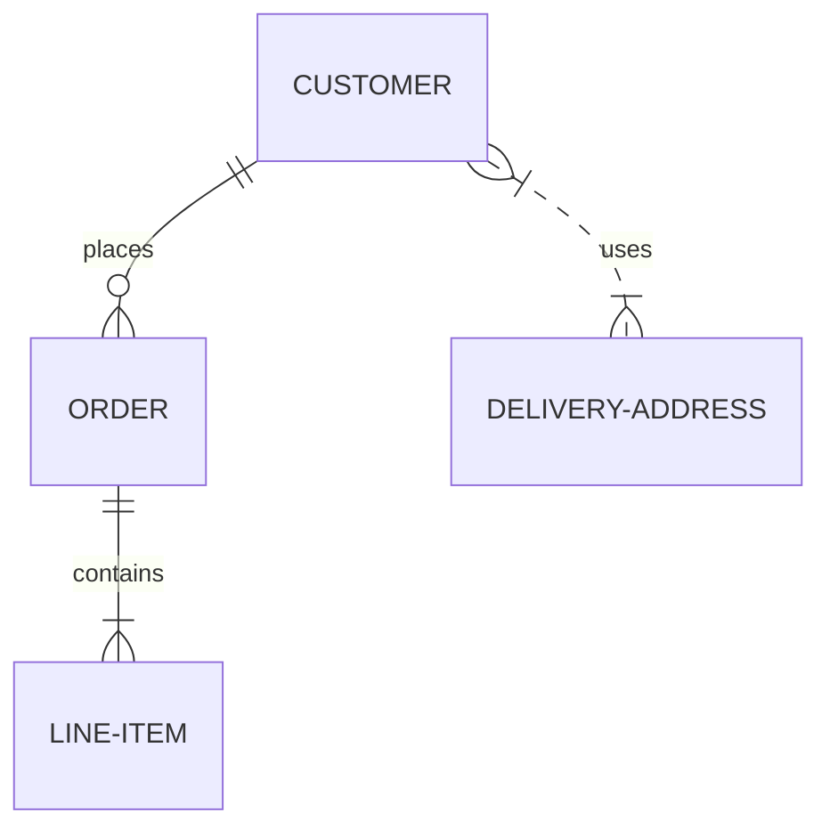
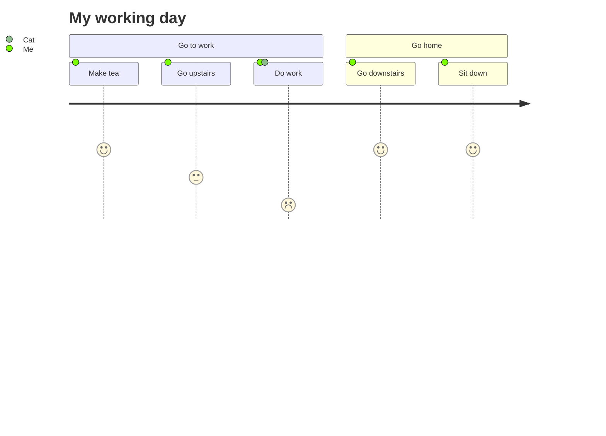

# mermaid 学习

- [mermaid 学习](#mermaid-学习)
  - [关于 Mermaid](#关于-mermaid)
  - [mermaid 可以渲染的图表](#mermaid-可以渲染的图表)
    - [流程图](#流程图)
    - [时序图](#时序图)
    - [甘特图](#甘特图)
    - [类图](#类图)
    - [Git图——实验性的](#git图实验性的)
    - [实体关系图——实验性的](#实体关系图实验性的)
    - [用户轨迹图](#用户轨迹图)
  - [安装](#安装)
  - [CDN](#cdn)
  - [部署 Mermaid](#部署-mermaid)
  - [同类项目](#同类项目)
  - [请求协助](#请求协助)
  - [对于贡献者](#对于贡献者)
    - [设置](#设置)
    - [构建](#构建)
    - [Lint](#lint)
    - [测试](#测试)
    - [发布](#发布)
  - [荣誉](#荣誉)

翻译 [mermaid](https://mermaid-js.github.io/mermaid/#/)。

## 关于 Mermaid

Mermaid 允许你使用文本和代码表示图表。这简化了复杂图表的维护。它是基于 JavaScript 的图表绘制工具，可渲染 Markdown 启发的文本定义，以便动态创建和修改图表。Mermaid 的主要目的是帮助帮助文档和开发同步。

许多编辑器、维基和其他工具都集成了 mermaid，可以轻松开始使用 mermaid。其中一些在[简单开始编写图表](https://mermaid-js.github.io/mermaid/#/n00b-gettingStarted)中有描述。


> Doc-Rot 是一个 Catch-22 问题，Mermaid 帮助解决它。

图表和文档花费珍贵的开发者时间，并且很快会过时。但是没有图表或者文档会破坏生产力并损害组织学习。Mermaid 通过减少创建可修改的图表所需的时间、精力和工具解决 [Catch-22](https://www.merriam-webster.com/dictionary/catch-22) 问题，以获取更智能和可重用的内容。Mermaid作为一个基于文本的图表工具，允许迅速简单的更新，也可以成为生产脚本(和其他代码片段)的一部分，以便文档编写更加容易。作为一个单独的文档任务，使用 Mermaid 需要花费更少的时间来制作图表。

> Mermaid 是适用于所有人的图表工具。

即使不是程序开发人员也可通过 [Mermaid 在线编辑器](https://github.com/mermaid-js/mermaid-live-editor) 创建图表，浏览[教程页面](https://mermaid-js.github.io/mermaid/#/./Tutorials)查看在线编辑器的视频教程。

想要看使用 mermaid 可以构建什么，或哪些应用以及支持 mermaid ？阅读 [Mermaid 的集成和使用](https://mermaid-js.github.io/mermaid/#/./integrations)。

想要 mermaid 更详细的介绍以及一些它的更多基础用法，查看[新手概览](https://mermaid-js.github.io/mermaid/#/./n00b-overview)和[用法](https://mermaid-js.github.io/mermaid/#/./usage)。

> 保持稳定的脉搏：mermaid 需要更多合作者，[了解更多](https://github.com/knsv/mermaid/issues/866)。

mermaid 被提名并获得”最令人兴奋的技术使用“类别的 [JS 开源大奖(2019)](https://osawards.com/javascript/#nominees)。

感谢多所有参与人员、提出 PR 的人员、回答问题的人，并特别感谢 Tyler Long，他帮助我维护这个项目。

## mermaid 可以渲染的图表

### 流程图

```code
graph TD;
  A-->B;
  A-->C;
  B-->D;
  C-->D;
```


### 时序图

```code
sequenceDiagram
  participant Alice
  participant Bob
  Alice->>John: Hello John, how are you?
  loop Healthcheck
    John-->John: Fight against hypochondria
  end
  Note right of John: Rational thoughts <br />prevail!
  John-->>Alice: Great!
  John->>Bob: How about you?
  Bob-->>John: Jolly good!
```



### 甘特图

```code
```



### 类图

```code
classDiagram
Class01 <|-- AveryLongClass : Cool
Class03 *-- Class04
Class05 o-- Class06
Class07 .. Class08
Class09 --> C2 : Where am i?
Class09 --* C3
Class09 --|> Class07
Class07 : equals()
Class07 : Object[] elementData
Class01 : size()
Class01 : int chimp
Class01 : int gorilla
Class08 <--> C2: Cool label
```



### Git图——实验性的

```code
gitGraph:
options
{
    "nodeSpacing": 150,
    "nodeRadius": 10
}
end
commit
branch newbranch
checkout newbranch
commit
commit
checkout master
commit
commit
merge newbranch
```


### 实体关系图——实验性的

```code
erDiagram
  CUSTOMER ||--o{ ORDER : places
  ORDER ||--|{ LINE-ITEM : contains
  CUSTOMER }|..|{ DELIVERY-ADDRESS : uses
```



### 用户轨迹图

```code
journey
  title My working day
  section Go to work
    Make tea: 5: Me
    Go upstairs: 3: Me
    Do work: 1: Me, Cat
  section Go home
    Go downstairs: 5: Me
    Sit down: 5: Me
```



## 安装

深入的指南和示例可以在[入门](https://mermaid-js.github.io/mermaid/#/n00b-gettingStarted)和[用法](https://mermaid-js.github.io/mermaid/#/usage)中找到。

了解有关 mermaid 的[语法](https://mermaid-js.github.io/mermaid/#/n00b-syntaxReference)将会有所帮助。

## CDN

```url
https://unpkg.com/mermaid@<version>/dist/
```

要选择一个版本：
替换 `<version>` 为想要的版本号。

可选地，你也可以在页面本身选择版本号。

最新版本：<https://unpkg.com/browse/mermaid@8.8.0/>

## 部署 Mermaid

要再你的网站支持 mermaid，你需要做的就是添加 Mermaid 的 JavaScript 包：

```txt
1. 你需要安装 node v10 或 12，它有 npm
2. 使用 npm 下载 yarn
3. 输入下面的命令：yarn add mermaid
4. 然后你可以使用下面的命令添加 mermaid 作为一个开发依赖：yarn add --dev mermaid
```

要在不使用 bundler 的情况下部署 mermaid，可以像这样在 HTML 中插入一个带一个绝对地址的 `script` 标签和一个 `mermaidAPI` 调用：

```html
<script src="https://cdn.jsdelivr.net/npm/mermaid/dist/mermaid.min.js"></script>
<script>mermaid.initialize({startOnLoad:true});</script>
```

这样做会命令 mermaid 解析器查找你的 HTML 文档中带 `class="mermaid"` 的 `<div>`。mermaid 会从这些标签尝试读取图表定义并将其渲染为 svg 图表。

可在[其他示例](https://mermaid-js.github.io/mermaid/#/examples)找到示例。

## 同类项目

- [Mermaid 在线编辑器](https://github.com/mermaid-js/mermaid-live-editor)
- [Mermaid CLI](https://github.com/mermaid-js/mermaid-cli)
- [Mermaid Webpack Demo](https://github.com/mermaidjs/mermaid-webpack-demo)
- [Mermaid Parcel Demo](https://github.com/mermaidjs/mermaid-parcel-demo)

## 请求协助

事情堆积如山，我很难跟上。为了解决这个问题，如果我们可以成立一个核心开发团队合作开发 mermaid 将会是极好的。

作为这个团队的一部分，你可以得到对仓库的写访问权限，并在回答问题时代表这个项目。

我们可以一起进行像这样的工作：

- 增加更多类型的图表比如思维导图、ert 图等
- 完善现有的图表

如果你想参与，请随时联系我！

## 对于贡献者

### 设置

```sh
yarn install
```

### 构建

```sh
yarn build:watch
```

### Lint

```sh
yarn lint
```

我们使用 [eslint](https://eslint.org/)。我们建议你安装[编辑器插件](https://eslint.org/docs/user-guide/integrations)以便你可以获取实时的 lint 结果。

### 测试

```sh
yarn test
```

在浏览器手动测试：打开 `dist/index.html`。

### 发布

对于有权限这样做的人：

在 `package.json` 更新版本号。

```sh
npm publish
```

上述命令在 `dist` 目录创建文件并将其发布到 npmjs.org

## 荣誉

非常感谢 [d3](http://d3js.org/) 和 [dagre-d3](https://github.com/cpettitt/dagre-d3) 项目，它们提供了图形布局和图形库。

同样感谢 [js-sequence-diagram](http://bramp.github.io/js-sequence-diagrams) 项目使用了时序图语法。感谢 Jessica Peter 对甘特图呈现的灵感和起点。

> Mermaid 由 Knut Sveidqvist 创建，使得文档化更简单。

这里是项目[贡献者](https://github.com/knsv/mermaid/graphs/contributors)的完整列表。
