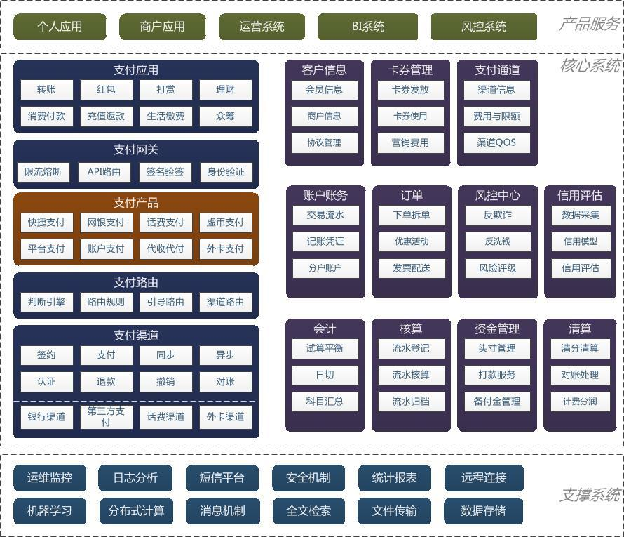
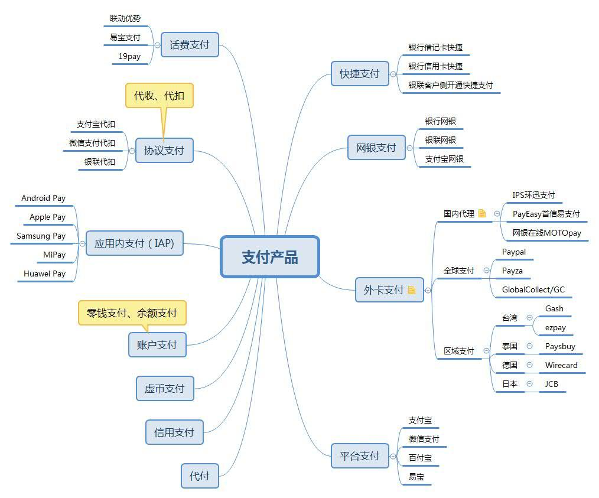
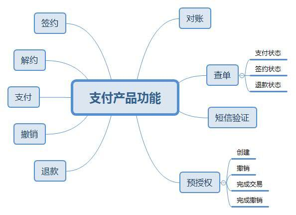
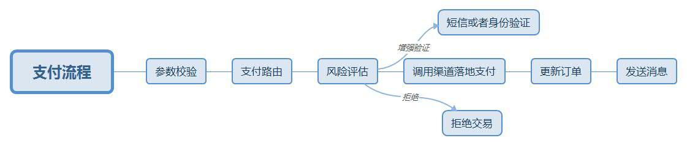

# 6 支付产品服务设计

- [6 支付产品服务设计](#6-%E6%94%AF%E4%BB%98%E4%BA%A7%E5%93%81%E6%9C%8D%E5%8A%A1%E8%AE%BE%E8%AE%A1)
  - [6.1 前言](#61-%E5%89%8D%E8%A8%80)
  - [6.2 产品分类](#62-%E4%BA%A7%E5%93%81%E5%88%86%E7%B1%BB)
  - [6.3 模块功能](#63-%E6%A8%A1%E5%9D%97%E5%8A%9F%E8%83%BD)
  - [6.4 业务流程](#64-%E4%B8%9A%E5%8A%A1%E6%B5%81%E7%A8%8B)

## 6.1 前言

- 支付产品模块是按照支付场景来为业务方提供支付服务
- 支付产品模块一般位于支付网关之后，支付渠道之前。根据支付能力将不同的支付渠道封装成统一的接口，通过支付网关来对外提供服务。
- 从微服务的角度，支付产品本身也是一个代理模式的微服务，它通过支付网关响应业务方请求，进行一些统一处理后，分发到不同的支付渠道去执行，最后将执行结果做处理后，通过支付网关再回传给业务方
- 支付产品在支付系统参考下图架构图中的位置
  
- 也有设计是将支付产品模块与支付网关合并到一起的

## 6.2 产品分类

- 支付产品：由支付系统对支付渠道进行封装而对业务方提供的支付能力
- 在不同的公司，由于接入渠道和应用的差异，支付产品分类略有不同
- 综合支付场景和流程，支付产品可以分为如下几类
  

  | 支付产品 | 操作 | 优点 | 不足 | 实现方式 |
  | --- | --- | --- | --- | --- |
  | 快捷支付 | 用户在完成绑卡之后，在支付的时候，不需要再输入卡或者身份信息，仅需要输入支付密码就可以完成支付。对于小额度的支付，甚至可以开通小额免密，直接完成支付 | 不会打断用户的体验，是目前主要的在线支付方式 | -  | 一般是封装银行或者第三方支付平台提供的快捷支付接口或者代付接口 |
  | 网银支付 | 用户在支付的时候，需要跳转到银行网银页面来完成支付。在网银页面，需要输入用户的卡号和身份信息 | - | 会中断用户当前的体验，一般仅用于 PC Web 上的支付 | 封装银行提供的网银支付 |
  | 协议支付 | 也称代收或者代扣，代收指渠道授权商户可以从用户的银行账户中扣款 | 一般用于定期扣款 |  不用于日常消费(如水电煤气、有线电视费) | 封装银行、第三方支付提供的代扣或者快捷接口 |
  | 平台支付 | 使用微信、支付宝等第三方支付平台来完成支付 | 由于微信、支付宝已经被大量使用，用户也产生对这些平台的信任，平台支付往往是电商公司的主要支付方式 | 使用时，一般需要用户预先安装支付平台系统(手机)，注册并登录到第三方支付平台，并且已经在该平台上完成绑卡等操作 | - |
  | 外卡支付 | 国内不少支付渠道都能支持外卡支付(如支付宝全球购) | 支持海外支付 | - | 直接对接 Paypal，也是目前用的最多的外卡支付渠道 |
  | 话费支付 | - | 对于有包月小额类型的支付，可使用手机话费支付 | - | 目前有一些平台可以支持话费支付(如虹软、联动优势) |
  | 虚币支付 | 不少公司会有自己的虚拟币(如京豆、Q 币)。这些虚币也可以作为一种支付方式 | - | - | - |
  | 账户支付 | 也称为余额支付、零钱支付等。指为用户建立本地账户，之后可以使用这个账户来完成支付 | 支持充值 | - | - |
  | 信用支付 | (如京东白条，蚂蚁花呗)指使用信用账户进行透支，类似信用卡支付 | - | - | - |
  | 代付 | 和代扣相反，代付是平台将钱打给用户 | - | - | - |

## 6.3 模块功能

- 支付产品根据其支付能力，对外提供不同的功能。整体上来说，一般支付产品需要提供如下接口
  

  | 接口 | 功能描述 | 备注 |
  | --- | --- | --- |
  | 签约 | 在快捷支付、代扣等产品中，用户在使用前，需要先完成签约 | 签约可在渠道侧进行，一般第三方支付采用这种方式，当电商需要接入时，让第三方给授权。银行和银联的签约一般在电商侧进行，电商侧负责收集用户的信息，调用银行和银联的接口进行签约。签约后，后续的支付行为使用签约号进行，无需再输入个人信息 |
  | 解约 | 取消签约关系 | 和签约对应 |
  | 支付 | 不同产品中支付行为不一样 | 快捷支付在电商服务器上发起，请求渠道进行支付；网银支付是跳转到银行支付网关进行; 账户支付、虚币支付，是在本地进行 |
  | 撤销 | 取消当天在渠道侧未结算的交易 | 有些渠道区分撤销和退款(如银联、农行)，有些渠道则不作区分 |
  | 退款 | 仅针对已经结算的交易 | 有些渠道区分撤销和退款(如银联、农行)，有些渠道则不作区分 |
  | 查询签约状态 | 对于需要签约的交易，可以通过此接口查询签约状态 | - |
  | 查询订单状态 | 通过此接口查询支付清单状态以及退款的订单状态 | - |
  | 预授权 | 预授权交易用于受理方向持卡人的发卡方确认交易许可 | 受理方将预估的消费金额作为预授权金额，发送给持卡人的发卡方 |
  | 预授权撤销 | 对已成功的预授权交易，在结算前使用预授权撤销交易，通知发卡方取消付款承诺 | 预授权撤销交易必须是对原始预授权交易或追加预授权交易最终承兑金额的全额撤销 |
  | 预授权完成交易 | 对已批准的预授权交易，用预授权完成做支付结算 | - |
  | 预授权完成撤销 | 预授权完成撤销交易必须是对原始预授权完成交易的全额撤销 | 预授权完成撤销后的预授权仍然有效 |
  | 对账 | 通过 FTP 或 HTTP 方式提供对账文件供商户侧对账 | - |
  | 余额查询 | 查询商户的交易账户余额，避免由于余额不足导致交易失败 | 注意不是客户的余额。不是所有的银行或者第三方支付都提供这个接口 |

## 6.4 业务流程

- 上述操作，除对账、查单外，每个操作实现的主流程，一般会包括参数校验、支付路由、生成订单、风险评估、调用渠道服务、更新订单和发送消息这 7 步
- 对于一些比较复杂的服务，还会涉及到异步同通知处理的步骤
  
- 1 执行参数校验：所有的支付操作，都需要对输入执行参数校验，避免接口受到攻击
  - 验证输入参数中各字段的有效性验证：如用户 ID、商户 ID、价格、返回地址等
  - 验证账户状态：交易主体、交易对手等账户的状态是处于可交易的状态
  - 验证订单：如果涉及到预单，还需要验证订单号的有效性，订单状态是未支付。为了避免用户缓存某个 URL 地址，还需要校验下单时间和支付时间是否超过预定的间隔
  - 验证签名：签名也是为了防止支付接口被伪造。一般签名是使用分发给商户的 key 来对输入参数拼接成的字符串做 MD5 Hash 或 RSA 加密，然后作为一个参数随其他参数一起提交到服务器端。如支付网关设计所介绍，签名验证也可以在网关中统一完成
- 2 根据支付路由寻找合适的支付服务：根据用户选择的支付方式确定用来完成该操作的合适的支付渠道
  - 用户指定的支付方式不一定是最终的执行支付的渠道。比如用户选择通过工行信用卡来执行支付，但是我们没有实现和工行的对接，而是可以通过第三方支付，比如支付宝、微信支付、易宝支付，或银联完成
  - 选择合适的支付渠道，通过支付路由实现。支付路由会综合考虑收费、渠道的可用性等因素来选择最优方案
- 3 评估交易风险：检查本次交易是否有风险。风控接口返回三种结果：阻断交易、增强验证和放行交易
  - 阻断交易：说明该交易是高风险的，需要终止，不执行第 5 个步骤
  - 增强验证：说明该交易有一定的风险，需要确认下是不是用户本人在操作。这可以通过发送短信验证码或者其他可以验证用户身份的方式来做校验，验证通过后，可以继续执行该交易
  - 放行交易，即本次交易是安全的，可以继续往下走
- 4 生成交易订单：将订单信息持久化到数据库中
  - 当访问压力大的时候，数据库写入会成为一个瓶颈
- 5 调用支付渠道提供的服务：所有的支付服务都需要第三方通道来完成执行
  - 一般银行渠道的调用比较简单，可以直接返回结果
  - 一些第三方支付，如支付宝，微信支付等，会通过异步接口来告知支付结果
- 6 更新订单：对于同步返回的结果，需要在主线程中更新订单的状态，标记是支付成功还是失败。对于异步返回的渠道，需要在异步程序中处理
- 7 发送消息：通过消息来通知相关系统关于订单的变更
  - 风控、信用 BI 等，都需要依赖这数据做准实时计算
- 8 异步通知
  - 上述流程，其中涉及到调用远程接口，其延迟不可控。如果调用方一直阻塞等待，很容易超时
  - 引入异步通知机制，可以让调用方在主线程中尽快返回，通过异步线程来得到支付结果
  - 对于通过异步来获取支付结果的渠道接口，也需要对应的在异步通知中将结果返回给调用方
  - 异步通知需要调用方提供一个回调地址，一般以 HTTP 或 HTTPS 的方式。这就有技术风险，如果调用失败，还需要重试。而重试不能过于频繁，需要逐步拉大每一次重试的时间间隔
  - 在异步处理程序中，订单根据处理结果变更状态后，也要发消息通知相关系统
