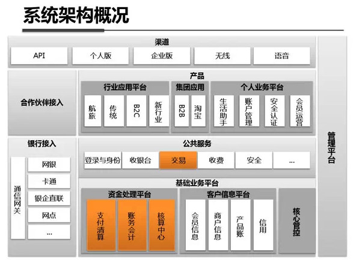
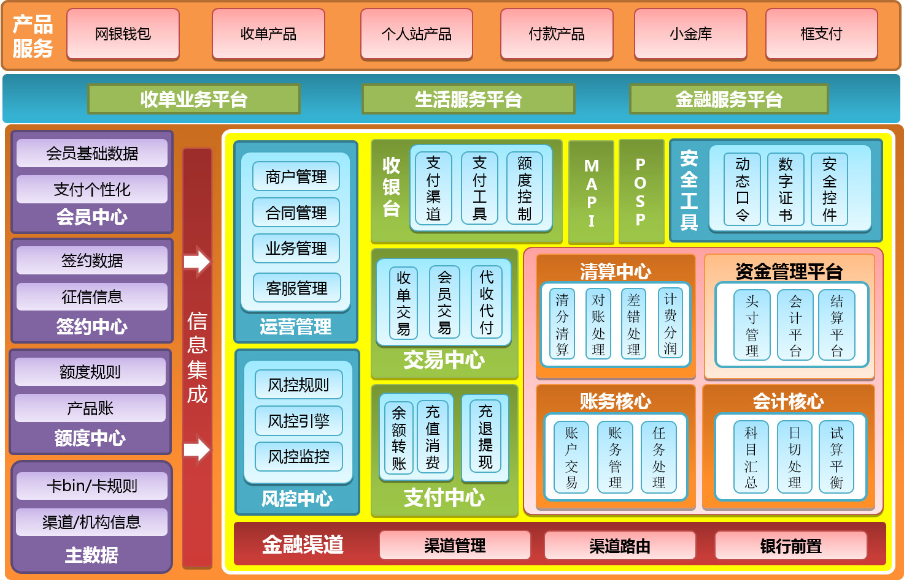
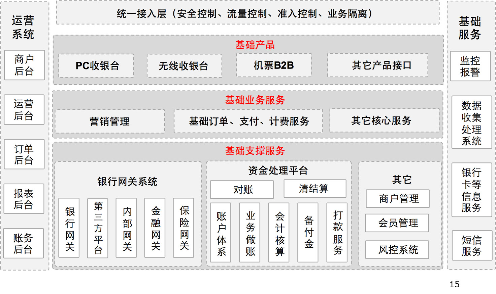
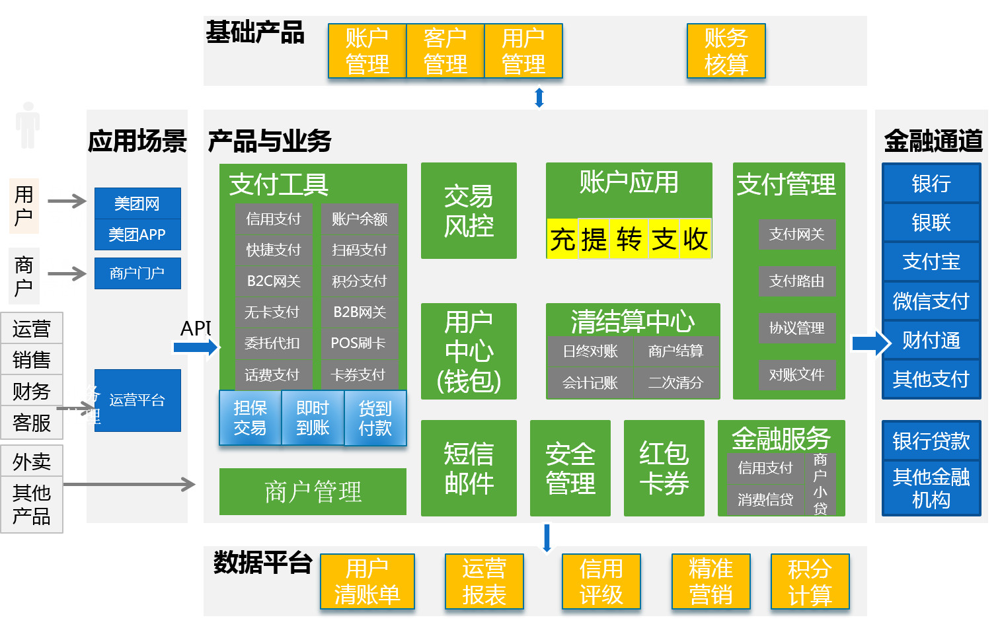
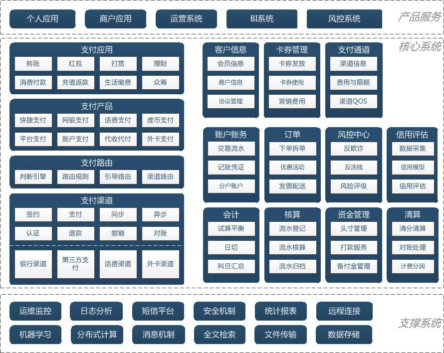

# 7 支付系统的整体架构

- [7 支付系统的整体架构](#7-%E6%94%AF%E4%BB%98%E7%B3%BB%E7%BB%9F%E7%9A%84%E6%95%B4%E4%BD%93%E6%9E%B6%E6%9E%84)
  - [7.1 支付的典型架构](#71-%E6%94%AF%E4%BB%98%E7%9A%84%E5%85%B8%E5%9E%8B%E6%9E%B6%E6%9E%84)
    - [7.1.1 支付宝](#711-%E6%94%AF%E4%BB%98%E5%AE%9D)
    - [7.1.2 京东金融](#712-%E4%BA%AC%E4%B8%9C%E9%87%91%E8%9E%8D)
    - [7.1.3 去哪儿](#713-%E5%8E%BB%E5%93%AA%E5%84%BF)
    - [7.1.4 美团](#714-%E7%BE%8E%E5%9B%A2)
  - [7.2 参考架构](#72-%E5%8F%82%E8%80%83%E6%9E%B6%E6%9E%84)
    - [7.2.1 支撑系统](#721-%E6%94%AF%E6%92%91%E7%B3%BB%E7%BB%9F)
    - [7.2.2 支付核心系统](#722-%E6%94%AF%E4%BB%98%E6%A0%B8%E5%BF%83%E7%B3%BB%E7%BB%9F)
    - [7.2.3 支付服务系统](#723-%E6%94%AF%E4%BB%98%E6%9C%8D%E5%8A%A1%E7%B3%BB%E7%BB%9F)
  - [7.3 支付应用](#73-%E6%94%AF%E4%BB%98%E5%BA%94%E7%94%A8)
  - [7.4 参考链接](#74-%E5%8F%82%E8%80%83%E9%93%BE%E6%8E%A5)

## 7.1 支付的典型架构

- 每个公司根据其业务和公司发展的不同阶段，所设计的支付系统也不同

### 7.1.1 支付宝

- 支付宝的支付系统整体架构设计如下
  

- 这个整体架构上并没有与众不同之处。在模块划分上，这个图显示的是最顶层的划分，也无法告知更多细节
- 但支付宝架构强点在两个方面
  - 账务处理：分为内外两个子系统，外部子系统是单边账，内部子系统走复式记账。不少支付平台是从这里得到启发来搞定的对账系统
  - 柔性事务处理：利用消息机制来实现跨系统的事务处理，避免数据库锁导致的性能问题

### 7.1.2 京东金融

- 京东金融是在网银在线的基础上发展起来的。网银在线的原班技术人员有不少来自易宝公司，在京东收购之后，又引入了支付宝的人才。因而从架构上受这两个公司的影响很大
- 京东支付平台总体架构设计如下
  

### 7.1.3 去哪儿

- 去哪儿公司的支付产品架构如下
  

### 7.1.4 美团

- 美团的支付平台规划架构如下：这是2015年的文档。2016年美团才拿到支付牌照
  

## 7.2 参考架构

- 一般来说，支付系统典型架构会包含如下模块
  
- 支付系统从架构上来说，分为三层：
  - 支撑层: 用来支持核心系统的基础软件包和基础设施，包括运维监控系统、日志分析系统等
  - 核心层：支付系统的核心模块，内部又分为支付核心模块以及支付服务模块
  - 产品层：通过核心层提供的服务组合起来，最终对用户、商户、运营管理人员提供的系统

### 7.2.1 支撑系统

- 支撑系统是一个公司提供给支付系统运行的基础设施。主要包括如下子系统
  - 运维监控：支付系统在运行过程中不可避免的会受到各种内部和外部的干扰，光纤被挖断、黑客攻击、数据库被误删、上线系统中有 bug 等。运维人员必须在第一时间内对这些意外事件作出响应，又不能够一天 24 小时盯着。这就需要一个运维监控系统来协助完成
  - 日志分析：日志是支付系统统计分析、运维监控的重要依据。公司需要提供基础设施来支持日志统一收集和分析
  - 短信平台：短信在支付系统中有重要作用，包括身份验证、安全登录、找回密码，及报警监控
  - 安全机制：安全是支付的生命线。SSL、证书系统、防刷接口等，都是支付的必要设施
  - 统计报表：支付数据的可视化展示，是公司进行决策的基础
- 远程连接管理、分布式计算、消息机制、全文检索、文件传输、数据存储、机器学习等，都是构建大型系统所必须的基础软件，这里不再一一详细介绍

### 7.2.2 支付核心系统

- 支付核心系统指用户执行支付的核心流程，包括
  - 1 用户从支付应用启动支付流程
  - 2 支付应用根据应用和用户选择的支付工具调用对应的支付产品执行支付
  - 3 支付路由根据支付工具、渠道费率、接口稳定性等因素选择合适的支付渠道来落地支付
  - 4 支付渠道调用银行、第三方支付等渠道提供的接口来执行支付操作，最终落地资金转移

### 7.2.3 支付服务系统

- 支持支付核心系统所提供的功能。服务系统又分为基础服务系统、资金系统、风控和信用系统
  - 基础服务系统：提供支撑线上支付系统运行的基础业务功能
    - 客户信息管理：对用户、商户的实名身份、基本信息、协议的管理
    - 卡券管理：对优惠券、代金券、折扣券的制作、发放、使用流程的管理
    - 支付通道管理: 通道接口、配置参数、费用、限额以及 QOS 的管理
    - 账户和账务系统：管理账户信息以及交易流水、记账凭证等。这里的账务一般指对接线上系统的账务，采用单边账的记账方式。内部账记录在会计核算系统中
    - 订单系统：一般订单系统可独立于业务系统实现。这里的订单主要指支付订单
  - 资金系统：围绕财务会计而产生的后台资金核实、调度和管理的系统，包括
    - 会计核算：提供会计科目、内部账务、试算平衡、日切、流水登记、核算和归档
    - 资金管理：管理公司在各个支付渠道的头寸，在余额不足时进行打款。对第三方支付公司，还需要对备付金进行管理
    - 清算分润：对于有分润需求的业务，还需要提供清分清算、对账处理和计费分润功能
  - 风控系统：支付系统必备的基础功能，所有的支付行为必须做风险评估并采取对应的措施
  - 信用系统：在风控基础上发展的高级功能，京东白条，蚂蚁花呗等都是成功的案例

## 7.3 支付应用

- 支撑系统、核心系统和服务系统，在每个公司的架构上应该是大同小异的，都是必不可少的模块
- 支付应用是每个公司根据自己的业务来构建的，各不相同。总的来说，可以按照使用对象分为针对最终用户的应用、针对商户的应用、针对运营人员的运营管理、BI 和风控后台

## 7.4 参考链接

- [最全最强解析：支付宝钱包系统架构内部剖析（架构图）](http://www.woshipm.com/pmd/160822.html)
- [京东：支付平台总体架构设计图](http://www.360doc.com/content/16/0724/20/19476362_578094252.shtml)
- [美团支付平台产品规划](https://wenku.baidu.com/view/7daa609d376baf1ffd4fad09.html)
