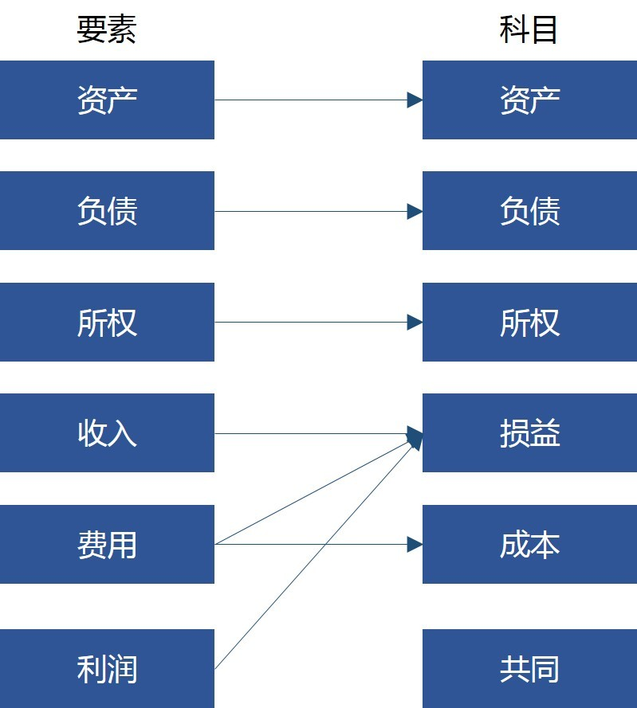
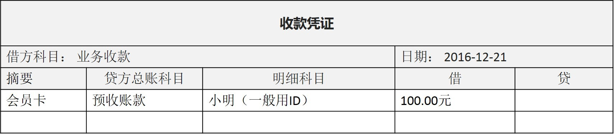
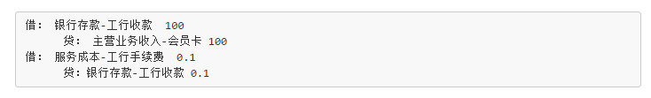
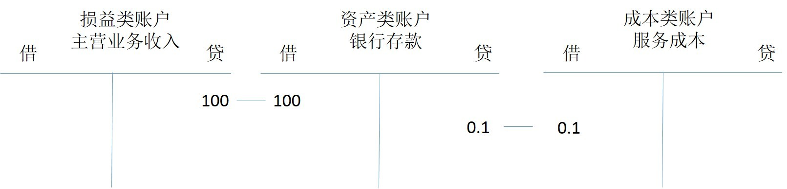

# 1 基本概念和入门

- [1 基本概念和入门](#1-%E5%9F%BA%E6%9C%AC%E6%A6%82%E5%BF%B5%E5%92%8C%E5%85%A5%E9%97%A8)
  - [1.1 支付流程](#11-%E6%94%AF%E4%BB%98%E6%B5%81%E7%A8%8B)
  - [1.2 交易流水](#12-%E4%BA%A4%E6%98%93%E6%B5%81%E6%B0%B4)
  - [1.3 会计主体](#13-%E4%BC%9A%E8%AE%A1%E4%B8%BB%E4%BD%93)
  - [1.4 会计要素](#14-%E4%BC%9A%E8%AE%A1%E8%A6%81%E7%B4%A0)
  - [1.5 会计科目](#15-%E4%BC%9A%E8%AE%A1%E7%A7%91%E7%9B%AE)
  - [1.6 会计账户](#16-%E4%BC%9A%E8%AE%A1%E8%B4%A6%E6%88%B7)
  - [1.7 记账凭证](#17-%E8%AE%B0%E8%B4%A6%E5%87%AD%E8%AF%81)
  - [1.8 会计分录和记账](#18-%E4%BC%9A%E8%AE%A1%E5%88%86%E5%BD%95%E5%92%8C%E8%AE%B0%E8%B4%A6)
  - [1.9 更多问题](#19-%E6%9B%B4%E5%A4%9A%E9%97%AE%E9%A2%98)

## 1.1 支付流程

- 先说个比较简单的支付场景，用户(小明)用绑定的银行卡(工行)购买某电商公司(老熊公司)的产品。小明需要先在老熊公司网站上完成银行卡绑定的操作。绑卡以后，就可使用这个卡来购买商品。首先是挑选商品和下单，其后是执行支付。下单之前的流程不做介绍，从支付开始说明支付过程中的清结算问题
- 为了简化，先从比较简单的同渠道、公司内购买的场景开始。商品也先假定为虚拟产品(如会员卡)。为了实现这个流程，有一些前置的操作需要完成：
  - 老熊公司已对接工行的快捷支付接口。通过这个接口，可实现绑卡(签约)、支付、退款、查单等操作
  - 老熊公司已按照工行要求，在工行开了备付金账户。老熊公司通过工行接口的所有收款、退款等资金往来，都发生在这个账户
  - 小明在老熊公司的应用中绑定了自己的一张卡，为了简化处理，小明绑定的也是工行的卡，先省略跨行结算的步骤
- 用户小明在手机或 PC Web 上购买了 100 元的虚拟产品(如会员卡)。这里先从虚拟物品入手，因为实体物品情况会复杂一点，供应链和物流也是一个大课题，购买实体物品就需要考虑这个问题，而虚拟产品就可暂不考虑。然后小明在网站上执行下单、支付操作
- 老熊公司的支付系统收到小明的支付操作请求后，系统首先会校验订单是否有问题，然后调用工行快捷支付接口，从用户的工行卡上扣除 100 元
  - 用户的工行卡的扣款是实时进行的，也就是说，这个操作完成后，小明查看他的工行余额和流水，会有一笔 100 元的交易，并且账户余额也减少了 100 元
  - 但是这个钱并不是直接进入老熊公司的(结算)账户。工行在第二天凌晨会对前天的交易进行清算和结算。在计算收入的同时，也从中扣除掉通道费用，得到最终应该划拨到结算账户上的金额。在这个例子中假定手续费按支付金额收费，比例为 0.1%。这一笔交易，支付给工行 0.10 元，公司收入 99.9 元
  - 这里需要注意。有些银行是在扣除手续费后，将前一天的余额全部划拨到结算账户上；有些银行是先全额划拨所有收入到结算账户上，然后扣除手续费

## 1.2 交易流水

- 用户执行支付后，系统首先需要记录交易流水，流水的内容包括：
  - 交易主体：即发起本次交易的出款的用户，一般是记录 ID、姓名等信息
  - 交易账户：即用户购买时使用的出款账户，这是用户在工行的卡，实际账户是建立在工行，但在电商系统中，为了便于结算，为这个账户建立一个代理。这个账户在系统中的 ID 是 10001(数据本身无其他含义)
  - 交易对手：即出卖虚拟产品的业务部门，一般记录部门的 ID、名称等信息
  - 结算收益：交易对手能够拿到的金额。这里是`支付金额-渠道费用`，即 99.9 元
  - 对手账户：即虚拟产品的收款账户，为了便于结算，公司一般会对每项业务设置独立的结算账户。这个账户在系统中的 ID 是 20001(数据本身无其他含义)
  - 交易渠道：即工行的快捷支付，还需要记录渠道的 ID，名称等
  - 渠道结算账号：这也是个代理账号，记录在渠道侧的交易流水。注册在电商侧，是电商自己的账户
  - 渠道提交时间：请求渠道执行支付的时间
  - 渠道支付时间：渠道一般会在返回的报文中说明本次交易的执行时间。如果没有，则使用渠道的支付接口返回时间
  - 渠道费率：渠道的手续费，这里假定工行是按支付金额收费，比例为支付金额的 0.1%
  - 渠道费用：这里是`支付金额*手续费率`，即 0.1 元
  - 发起交易日期：`2016年12月12日 13:00:10`，即用户提交订单后，虚拟产品业务调用支付系统接口执行支付的时间
  - 执行交易日期：`2016年12月12日 13:00:11`，即支付系统接口调用时间
  - 支付截止日期：必须在此日期前完成支付
  - 订单信息：在本例子中是会员卡，一般需要记录业务方订单 ID、名称、内容等信息
  - 订单金额：提交过来的原始订单的金额 100 元
  - 支付金额：用户实际支付的金额，由于没有使用优惠券、打折卡等，这里支付金额等于订单金额，是 100元
- 没有使用卡券、没有和合作方分成，这两块内容暂不记录
- 交易流水是在完成支付时实时生成的。这个流水信息是后续记账的依据，所以务必在流水中真实记录能收集到的所有的现场信息。这里从下面几个角度来多方位全角度的描述这笔交易
  - 交易主体，即掏钱的小明
  - 交易对手，即收钱的业务方
  - 交易渠道，即工行快捷
  - 交易商品，即会员卡
- 这里有不少冗余信息。实际上对交易涉及到所有可能会被修改的信息，如用户姓名、商品名称、商品价格，都需要在这里留一个快照，以便后续回溯和审核

## 1.3 会计主体

- 这一笔账是老熊公司的账务，不是工行的账务，也不是小明家的账务。虽然这里会有工行和小明的信息，但记账的目的是为了了解和改进老熊公司的经营状况服务
- 老熊公司不是某个大公司的分公司或子公司，它是一家独立核算的、具有独立的资金和经营业务的单位，从会计学角度来说，他是一个独立的会计实体

## 1.4 会计要素

- 从概念上说，所有和钱有关的活动，买会员、用户充值、支付手续费等，都需要记账，这些活动，称之为会计对象
- 每个公司都有不同的会计对象，有时候同一类活动，叫法不一样。如果直接用这些活动内容来记账，那就没法比较每个公司的情况。需要有一个记账的标准，让大家分门别类的做记录
- 对会计对象做规范化的管理，这就引入会计要素的概念
  - 会计要素是对会计对象进行的基本分类，是会计核算对象的具体化。如果说会计对象是个 Object，则会计要素是定义这个 Object 的 Class
  - 不同的国家对会计要素有不同的规定
    - 国际会计准则委员会(IASC)在《编制和呈报财务报表的结构》将会计要素其归类为资产、负债、权益、收益和费用五个要素
    - 美国财务会计准则委员会(FASB)在《财务会计概念公告》中将会计要素归类为资产、负债、所有者权益(净资产)、业主投资、派给业主款、综合收益、营业收入、费用、利润、损失十个要素
    - 我国《会计准则》将会计要素归类为资产、负债、所有者权益、收入、费用和利润六个要素。其中资产、负债和所有者权益，是反应公司的财务状况的。它满足如下恒等式：
      > 资产=负债+所有者权益

## 1.5 会计科目

- 六大会计要素指明了需要记账的 scope，但毕竟粒度还是太大了。为了更详细地了解公司财务情况，引入会计科目来对会计对象进行第二层次的划分
- 使用 IT 的语言来说，会计科目其实就是一个分类体系，用来分门别类地记账
- 在实现上，是一个`编号+名称`，IT 俗称字典表
- 从定义上说，会计科目是指一个涵义明确、概念清楚、简明扼要、通俗易懂的标准名称
- 会计科目按照经济内容的性质不同，可分为资产类科目、负债类科目、所有者权益类科目、损益类科目，成本类科目，有些金融企业还有资产负债共同类科目。在每一类会计科目下，还可继续细分，详细内容可参考2016年财政部发布的新会计准则。会计科目和要素之间的关系如下
  

  | 会计要素 | 所属会计科目 |
  | --- | --- |
  | 资产 | 资产 |
  | 负债 | 负债 |
  | 所有者权益 | 所有者权益 |
  | 收入 | 损益 |
  | 费用 | 损益、成本 |
  | 利润 | 损益 |
  | - | 共同 |

- 会计科目还分为总账科目和明细科目。从IT角度，可认为总账科目是一级分类，而明细科目则是这个一级分类下的二级、三级，甚至更多级别的详细的科目。记账时，会同时记录到总账、明细科目。在电商的支付系统中，一般会设置如下科目

  | 会计科目编号 | 会计科目名称 |
  | --- | --- |
  | 1002 | 银行存款(资产类) |
  | 100201 | 业务收款 |
  | 100201001 | 支付宝收款 |
  | 100201002 | 工行收款 |
  | 100201003 | 建行收款 |
  | 1004 | 服务成本(成本类) |
  | 100401001 | 支付宝手续费 |
  | 100401002 | 工行手续费 |
  | 100401003 | 建行手续费 |
  | 6001 | 主营业务收入(损益类) |
  | 6001001 | 会员卡业务 |
  | 6001002 | 游戏业务 |

## 1.6 会计账户

- 账户：指对会计要素的具体内容所作的科学的分类，包括两方面：账户的名称、账户的用途与结构
- 会计科目是设置账户的依据，也是账户的名称。如对银行存款这个会计科目，也会设置一个对应的银行存款账户，用来跟踪公司在银行存款的变动
- 在这个案例中，将设置的账户同会计科目。

## 1.7 记账凭证

- 在以前没有电脑的时候，去买公交卡，公交公司阿姨会认真地记录你买的卡的卡号、买卡人的姓名、卡的面值等信息，运气好的时候还会给个发票。一般来说，阿姨会将购买记录登记到一个账册上，形成记账凭证，并在这里会登记发票号码
- 在现在高科技时代，这个凭证还是少不了了。先说明细账，记录内容如下
  
- 这里详细记录每一条交易信息，当然，通过计算机系统，可记录更多详情，包括时间、地点等

## 1.8 会计分录和记账

- 大家经常看到的记录应该是这样的
  
- 银行存款、服务成本、主营业务收入，属于总账科目
- 工行收款、会员卡、工行手续费，属于明细科目
- 这里采用的是复式记账法中借贷记账法。对应的账户结构如下：
  
- 借贷复式记账法的特点是
  - 采用借、贷作为记账符号，建立在会计恒等式基础上，遵循**有借必有贷，借贷必相等**的原则
  - 账户基本结构是： 左侧为借，右侧为贷
  - 一般采用如上图所示的 T 行账户的形式来描述
  - 借贷所代表的增加、减少的含义并不固定，和账户的性质有关

    | 借方 | 贷方 |
    | --- | --- |
    | 资产增加 | 资产减少 |
    | 权益减少 | 权益增加 |
    | 成本增加 | 成本减少 |
    | 收入减少 | 收入增加 |
    | 费用及支出增加 | 费用及支出减少 |

## 1.9 更多问题

- 作为清结算的入门介绍，这里介绍的是最简单的场景，以此来解释清结算相关的概念，特别是会计学一些从IT角度不容易理解的名词。实际上，这个场景还有很多问题：
  - 严格的说，会员卡的收入，还不能立即作为公司主营业务收入。会员卡是预付款项，用户开始使用会员卡，公司需要为这个使用提供服务；用户结束使用会员卡之后，这一笔开支才算是真正落入公司主营业务收入中
  - 会员卡在使用期间，公司针对会员业务的各种开销，要分摊到这一段期间的会员上。将开销分摊到每张会员卡上，计算其使用成本，最终才能够计算出收益
  - 用户会员卡购买的款项是立即反映到备付金账户的，但并不是立即到结算账户的，一般是 T+1 结算，也就是第二天银行才会将清算好的资金打到公司结算账户上，这种情况应该如何记账？
  - 如果支付过程中使用了代金券和优惠券，那又应该如何考虑？
- 此外，还有退款、充值等场景的清结算，这些问题都将在本系列的文章中详细介绍。本文仅介绍一些相关的概念
