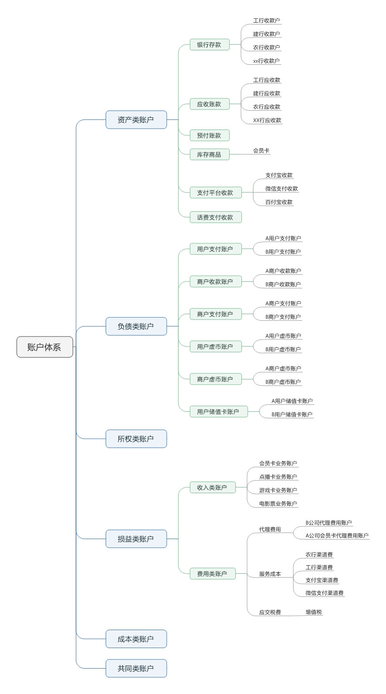
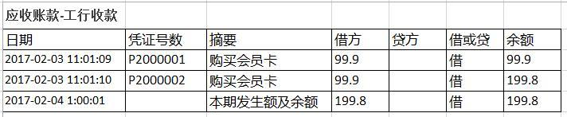
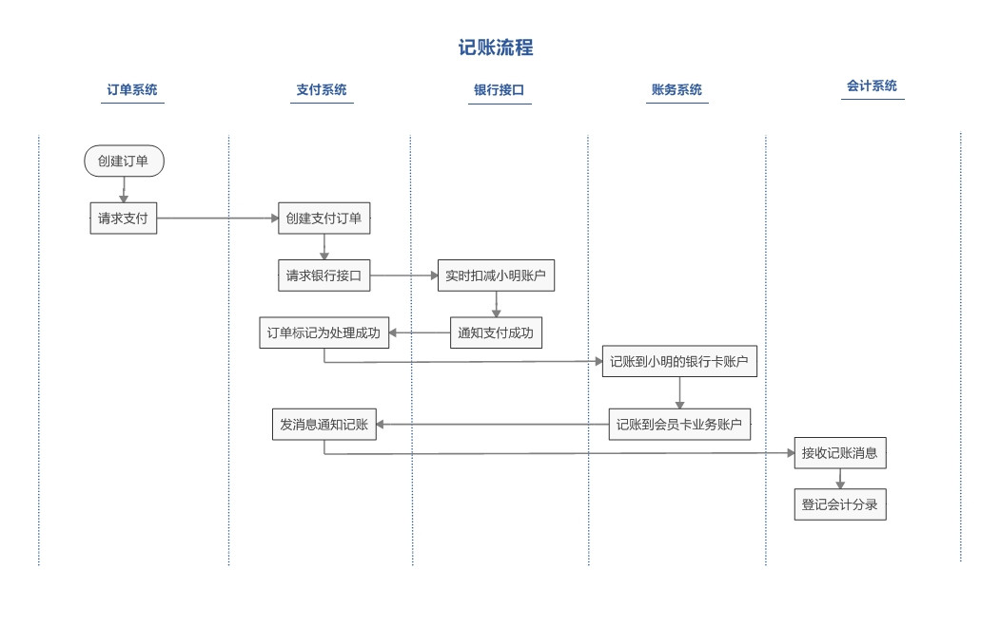
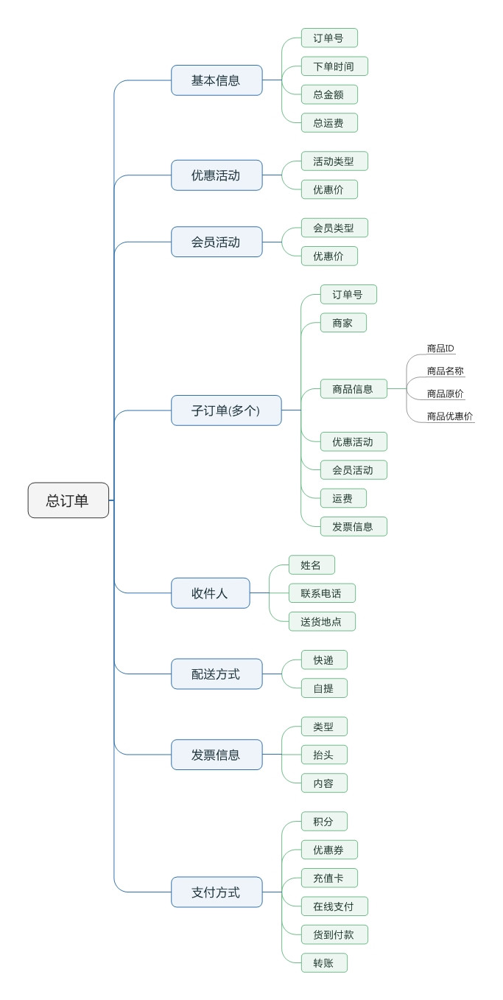
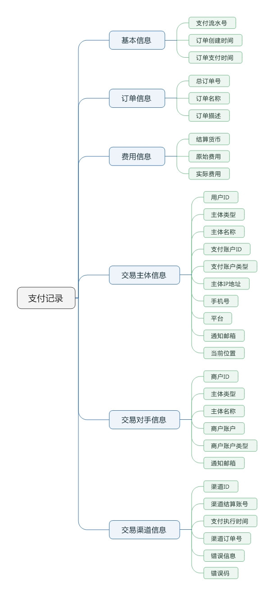
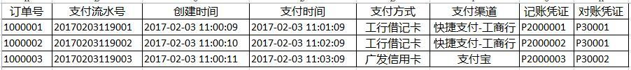
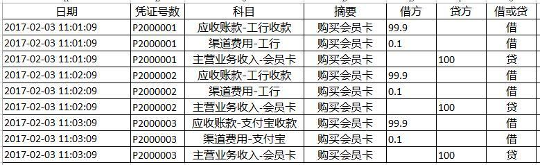
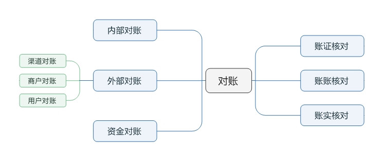
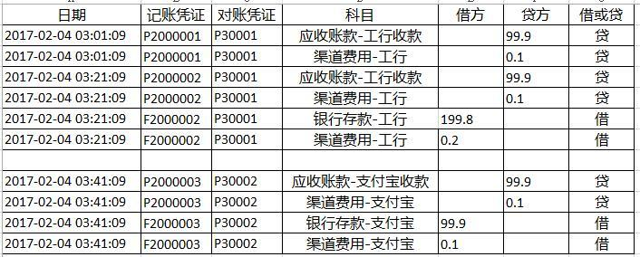

# 4 账户和账务处理

- [4 账户和账务处理](#4-%E8%B4%A6%E6%88%B7%E5%92%8C%E8%B4%A6%E5%8A%A1%E5%A4%84%E7%90%86)
  - [4.1 账户体系](#41-%E8%B4%A6%E6%88%B7%E4%BD%93%E7%B3%BB)
    - [4.1.1 资产类账户](#411-%E8%B5%84%E4%BA%A7%E7%B1%BB%E8%B4%A6%E6%88%B7)
    - [4.1.2 负债类账户](#412-%E8%B4%9F%E5%80%BA%E7%B1%BB%E8%B4%A6%E6%88%B7)
    - [4.1.3 所有者权益类账户](#413-%E6%89%80%E6%9C%89%E8%80%85%E6%9D%83%E7%9B%8A%E7%B1%BB%E8%B4%A6%E6%88%B7)
    - [4.1.4 损益类账户](#414-%E6%8D%9F%E7%9B%8A%E7%B1%BB%E8%B4%A6%E6%88%B7)
    - [4.1.5 成本类账户](#415-%E6%88%90%E6%9C%AC%E7%B1%BB%E8%B4%A6%E6%88%B7)
    - [4.1.6 共同类账户](#416-%E5%85%B1%E5%90%8C%E7%B1%BB%E8%B4%A6%E6%88%B7)
    - [4.1.7 账户体系](#417-%E8%B4%A6%E6%88%B7%E4%BD%93%E7%B3%BB)
  - [4.2 账户结构](#42-%E8%B4%A6%E6%88%B7%E7%BB%93%E6%9E%84)
  - [4.3 支付流程](#43-%E6%94%AF%E4%BB%98%E6%B5%81%E7%A8%8B)
  - [4.4 支付订单](#44-%E6%94%AF%E4%BB%98%E8%AE%A2%E5%8D%95)
  - [4.5 支付记录](#45-%E6%94%AF%E4%BB%98%E8%AE%B0%E5%BD%95)
  - [4.6 支付记账](#46-%E6%94%AF%E4%BB%98%E8%AE%B0%E8%B4%A6)
  - [4.7 会计记账](#47-%E4%BC%9A%E8%AE%A1%E8%AE%B0%E8%B4%A6)
  - [4.8 对账](#48-%E5%AF%B9%E8%B4%A6)
    - [4.8.1 内部对账](#481-%E5%86%85%E9%83%A8%E5%AF%B9%E8%B4%A6)
    - [4.8.2 渠道对账](#482-%E6%B8%A0%E9%81%93%E5%AF%B9%E8%B4%A6)
    - [4.8.3 账账核对](#483-%E8%B4%A6%E8%B4%A6%E6%A0%B8%E5%AF%B9)
    - [4.8.4 账实核对](#484-%E8%B4%A6%E5%AE%9E%E6%A0%B8%E5%AF%B9)
  - [4.9 结束语](#49-%E7%BB%93%E6%9D%9F%E8%AF%AD)

## 4.1 账户体系

- 在设计清结算系统前，首先需要完成账户体系的梳理
- 账户是用来记录会计科目所反映的业务内容的工具，它根据会计科目开设
- 账户有多种维度的分类
  - 按照经济内容来说，账户分为资产类账户、负债类账户、所有者权益类账户、损益类账户、成本类账户和共同类账户
  - 按照会计周期内期末是否有余额，也分为实账户和虚账户

### 4.1.1 资产类账户

- 资产类账户：用来反映资产增加、减少以及增减变动结果的账户
- 和支付系统相关的主要资产类账户有：银行存款、应收账款、预付账款、库存商品、发出商品等
- 资产增加登记在借方，减少登记在贷方，期末有余额的话，一般出现在借方
- 在一个会计期间，所有借方金额的累加为“借方本期发生额”，所有贷方金额的累加为“贷方本期发生额”

      资产账户的余额=借方期初余额+借方本期发生额-贷方本期发生额。

- 为了跟踪在每个银行的存款变更情况，需要对公司在各个银行开通的收款账户设置对应的银行存款账户、应收账款账户。在小明购买会员卡的案例中，资产类账户包括
  - 银行存款：这是一个总账账户，记录电商公司在各个银行的总存款
  - 应收账款：这是一个总账账户，记录在银行的应收账款，这是虚账户，期末无余额
  - 银行存款-工行：这是一个明细账户，对应在工行的对公账户的存款变化
  - 应收账款-工行：这是一个明细账户，记录在工行的收款情况，这是虚账户，期末无余额

### 4.1.2 负债类账户

- 负债类账户：实账户，记账规则跟资产类相反，负债增加记为贷，负债减少记为借，期末如有余额，一般在贷方，表明期末有债务实有额，负债类账户的余额计算

      贷方期末余额=贷方期初余额+贷方本期发生额-借方本期发生额。

- 从支付系统的角度，电商公司的自有账户，包括针对个人的账户和针对商户的账户，一般放在负债类账户下
- 此外，应付账款、预收账款、应交税费等，也是负债类账户

### 4.1.3 所有者权益类账户

- 所有者权益类账户：用来反映所有者权益增加、减少和变动结果的账户
- 记账规则跟负债类账户一致：所有者权益增加记为贷，减少记为借
- 和支付系统有关的所权账户包括：本年利润、利润分配等账户
- 企业取得的收入最终会使得所有者权益增加，因此收入类账户的记账方法跟所有者权益一致：增加记为贷，减少或者转销记为借，通常该账户期末无余额(因为期末收入都会转为所有者权益，如未分配利润等)，属于虚账户

### 4.1.4 损益类账户

- 损益类账户分为收入类和费用类账户
  - 收入类账户：指各种收入、补贴、投资收益，如主营业务收入、其他业务收入和营业外收入等，增加记为贷，减少记为借
  - 费用类账户包括：主营业务成本、其他业务成本、营销费用等。企业在日常经营活动中会发生各种各样的耗费，这些耗费在会计学上称为成本费用，它们是收入的抵减项目，在抵销收入之前，可以视为一种资产，因此成本费用类账户的记账规则跟资产类一样：增加记为借，减少或者转销记为贷
- 按照企业会计制度的规定，损益类账户的科目余额，应该结转入利润分配科目，期末余额为零，为虚账户
- 在本案例中，损益类账户包括
  - 主营业务收入，这是总分类账户
  - 主营业务收入-会员卡，针对会员卡业务的收入
  - 营销费用，这是总分类账户
  - 营销费用-优惠券，用来跟踪优惠券相关的支出
  - 渠道费用，这是总分类账户
  - 渠道费用-工行： 用来跟踪在工行的渠道费用支出

### 4.1.5 成本类账户

- 有成本核算的企业需要设立的账户，包括生产成本、劳务成本等，本文暂不涉及

### 4.1.6 共同类账户

- 这是反映特殊经济业务的账户，本文暂不涉及

### 4.1.7 账户体系

## 4.2 账户结构

- 采用复式借贷记账法。对于分户账，或者说明细账，如下示例
  
- 在这个实例中，账户中账务相关的结构包括
  - 账户名称：如上述的“应收账款-工行收款”
  - 会计分录： 除了登记借方金额、贷方金额，还需更新账户余额
  - 期末借方余额、期末贷方余额、期末余额：按期定时计算。在日切时，计算日发生额和余额。在按月、季度和年作为会计周期时也采用类似的方法处理。 除了日切是必须的，其它时间段的处理是根据财务需要来实现
- 在实现上，账户的各个属性更新时间并不一致，所以在设计账户表的时候，可以按照更新时机来划分表
  

## 4.3 支付流程

- 接着之前的小明购买会员卡的案例，不考虑优惠券和卡采购的情况，会计分录：

      借：
        应收账款-工行收款 100-100*0.1% = 99.9
        服务成本-工行手续费 100*0.1% = 0.1
      贷：主营业务收入-会员卡 100

- 在线上的实时处理流程如下
  - 1 用户购买会员卡，提交订单，会员卡向订单系统请求生成订单，订单系统向支付系统发出支付请求
  - 2 支付系统生成支付记录，并向银行发出请求
  - 3 银行实时从小明的银行卡账户上扣款 100 元，通知支付系统小明支付成功
  - 4 支付系统账务子系统在自己的账户体系中记录小明的这一笔消费支出，给会员卡业务账户增加对应的资金，通知会员卡系统发送卡给小明
  - 5 支付系统发送消息异步通知会计系统进行记账
- 这 5 个步骤都是线上的流程，在此过程中，各个子系统之间的交互如下图所示
  

## 4.4 支付订单

- 这个流程中，首先生成的是支付订单。这是一个比较简单的订单，仅涉及到一个商家和一个商品
- 在比较复杂的电商场景中，一个订单会涉及到多个商家、多种商品以及对应的优惠活动。也就是，一个总订单会被拆分为多个子订单
- 而订单中和资金相关的内容，都需要在账户体系中建立对应的科目和账户。在请求支付时，只会将总订单提交支付，拆分子订单是在订单系统中完成的
  
- 针对上述场景，为了简化处理，假定老熊公司当天总共完成了三笔会员卡交易，支付订单如下
  

## 4.5 支付记录

- 在这个流程中，订单系统向支付系统请求支付时，支付系统将产生支付记录(支付订单)
- 支付记录内容比较多，这些数据是后续进行记账的基础
  
- 上述的三个订单，两笔通过工行支付，一笔通过支付宝支付，其产生的支付记录如下，此处省略了其他和记账无关的字段内容
  
- 这里需要注意的几个属性
  - 订单号: 这是总订单号。支付系统不再对订单进行拆分。订单拆分是订单系统的功能
  - 支付流水号：在支付记录中，针对每个(总)订单号，会有对应的支付流水号。如果用户使用组合支付，如上述场景，小明使用余额支付了 20 元，使用银行卡支付了剩余的 80 元，那这将产生 2 个支付流水号。为了避免洗钱风险，简化订单处理，包括淘宝在内，现在一般都不再提供组合支付的支持
  - 支付方式和支付渠道：用户选择的支付方式和实际执行支付的渠道可以是不一样的。比如用户选择了广发信用卡来支付，但实际上电商公司没有直接对接农行，而是通过支付宝来对接，那对应的支付渠道就是支付宝
  - 本条记录在支付成功后，会产生记账凭证和对账凭证
    - 这一条记录将产生多条会计分录，记账凭证是关联这些会计分录和支付记录的字段
    - 对账凭证是根据对账周期来分配的。在日切后，对账凭证号相应的也会做更新
- 在产生支付记录后，在上述流程的第 5 步通过消息机制来异步触发记账流程。账务系统接收到记账消息后，开始更新账户信息。记账分为两个阶段
  - 支付记账：针对线上的账户实时更新的需求，需要让用户及时看到账户余额和订单状态，账务信息记录到用户和商户上，采用单边账的形式
  - 会计记账：采用复式记帐法，满足会计记账需求，记录会计分录和余额，为对账和清结算提供支持

## 4.6 支付记账

- 支付记账是在支付流程中完成的，目的是让用户完成购买后，能够立即看到支付结果和账户余额。为了提升性能，支付记账一般采用单边账的形式，即将会计分录登记在用户侧或者商户侧
- 在上述案例中，第 6 步处理，在服务器上与银行侧同步登记一笔从小明银行卡的支出，并在会员业务账户上登记一笔收入。如果使用的是零钱支付，这一个步骤就很重要，从零钱账户上扣除费用计算余额，添加对应的消费记录，是在一个事务中完成

## 4.7 会计记账

- 会计记账采用复式记账，不同业务记账方式也不一样。小明买卡的案例中，需要记录的条目有
  - 在工行收款账户下，登记 99.9 元的借记条目
  - 在工行手续费的账户下，登记 0.1 元的借记条目
  - 在主营业务收入-会员卡的账户下，登记 100 元的贷记条目
- 这 3 条记录是通过事务处理一次生成。当天发生的三笔交易，产生的记账内容如下
  
- 实际实现上，科目一列，使用账号 ID 来替代。每个账户的本期发生额，可以在另一个表中单独异步计算

## 4.8 对账

- 在会计上，对账分三个部分：账证核对、账账核对和账实核对，做到账证相符、账账相符和账实相符
- 在电商支付系统中，需要完成的对账工作包括内部对账、外部对账和资金对账。其中外部对账又分为和支付渠道的对账、和商户的对账以及和用户的对账
  

### 4.8.1 内部对账

- 内部对账的内容包括
  - 核实账户系统中的账务与支付记录的一致性
  - 核实会计系统中的账务与支付记录的一致性
- 这是后续账账核对和账实核对的基础，也是对外对账的基础。这两个对账任务一般是在后台定时运行(5分钟运行一次)，除非系统有 bug 或者发生故障，内部对账一般不会出现差错。如有差错，也需要人工处理

### 4.8.2 渠道对账

- 一般银行、第三方支付提供 T+1 的对账单，这是执行渠道对账的依据
- 在上述案例中，支付系统每天拉取工行前一天的对账单，核对交易流水。与此同时，按照从工行获取的对账单，记录资金归集的账务
- 接收到工行对账单后，按照对账单生成凭证
  
- 注意上述的日期、凭证号，以及借贷关系

### 4.8.3 账账核对

- 完成渠道对账后，需要进行日结和试算平衡
  - 总分类账各账户本期借方发生额合计与贷方余额合计是否相等
  - 总分类账各账户借方余额合计与贷方发生额合计是否相符
  - 核对各种明细账及现金、银行存款日记账的本期发生额及期末余额同总分类账中有关账户的余额是否相等
- 从科目维度，计算
  - 科目期初余额+科目当日发生额=科目期末余额
  - 下级科目余额总和=上级科目余额(科目总分检查)

### 4.8.4 账实核对

- 对电商公司来说，最重要的账实核对，是验证银行存款的变化和实际资金流向是一致的。一般是需要登录到银行网银系统中来人工核实
- 如果对接的银行多，银行提供网银对账单，也可以自动进行，查询出入款总额

## 4.9 结束语

- 本文主要介绍支付清结算中的账户和账务的处理。清结算是一个很专业的话题，这个专业不是计算机专业，而是会计专业。每个公司的账户和账务处理都有自己的要求和特点
- 这一系列文章，主要是从软件开发的角度来协助大家梳理清结算相关的基础知识。具体的账户、账务、会计处理流程，需要和公司会计详细沟通
