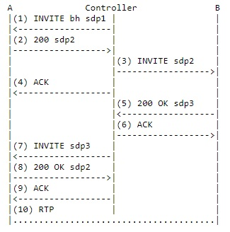
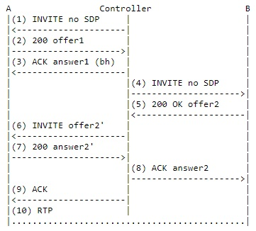
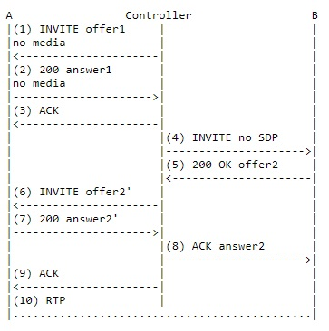

# 关于 SIP 协议第三方呼叫控制

- [关于 SIP 协议第三方呼叫控制](#%E5%85%B3%E4%BA%8E-sip-%E5%8D%8F%E8%AE%AE%E7%AC%AC%E4%B8%89%E6%96%B9%E5%91%BC%E5%8F%AB%E6%8E%A7%E5%88%B6)
  - [1 引言](#1-%E5%BC%95%E8%A8%80)
  - [2 第三方呼叫控制](#2-%E7%AC%AC%E4%B8%89%E6%96%B9%E5%91%BC%E5%8F%AB%E6%8E%A7%E5%88%B6)
    - [2.1 流程 I](#21-%E6%B5%81%E7%A8%8B-i)
    - [2.2 流程 II](#22-%E6%B5%81%E7%A8%8B-ii)
    - [2.3 流程 III](#23-%E6%B5%81%E7%A8%8B-iii)
    - [2.4 流程 IV](#24-%E6%B5%81%E7%A8%8B-iv)
    - [2.5 流程总结](#25-%E6%B5%81%E7%A8%8B%E6%80%BB%E7%BB%93)
  - [3 应用](#3-%E5%BA%94%E7%94%A8)
  - [4 总结](#4-%E6%80%BB%E7%BB%93)

## 1 引言

- SIP 协议：IETF 提出的会话初始协议，是在 IP 网进行多媒体通信的应用层控制协议，用于发起、建立和释放会话
- SDP 协议：会话描述协议，用来描述与媒体流相关的参数以及与会话相关的信息，其中包括对会话的描述以及媒体类型、数据发送到的端口、传输协议(如 RTP)以及媒体格式(如 RTP 载荷格式)的描述
- 在传统的电话网环境中，第三方呼叫控制(3pcc, third party call control)允许一个实体(称之为控制器 controller)建立并管理另外两方或多方之间的通信关系
- 3pcc 常用语运营商业务(运营商需要创建一个呼叫连接两个用户)和会议
  - 在 PSTN(public switched telephone network，公共交换电话网) 网中，第三方呼叫控制通常用于会议、接线业务(接线员创建一个连接另外双方的呼叫)
  - 使用 SIP 协议可借助第三方呼叫控制完成业务，例如点击拨号、通话过程中放音等
  - RFC3264 中定义了一种提供/应答模式，使两个实体之间可以使用 SDP 的提供/应答(offer/answer)模式进行会话协商

## 2 第三方呼叫控制

- SIP 消息可携带 SDP 消息体。3pcc 的关键在于控制器如何在会话双方之间使用 SDP 消息协商即将建立的会话
- 根据 SIP 协议的机制，有以下 4 中方法实现 3pcc

### 2.1 流程 I

- 流程图中的 offer 和 answer 都是 SDP 消息
- 流程包括以下几步
  - 控制器->A： 发送一个 INVITE，没有 SDP
  - A->控制器：A 电话振铃应答之后，200 OK 响应中包含一个 offer1，携带用户 A 所希望建立会话的媒体类型、媒体格式、传输协议以及接收媒体流的端口和 IP 地址
  - 控制器->B：发送一个 INVITE，包含来自 A 的 offer1
  - B->控制器：B 振铃应答之后，产生对 offer1 的应答 answer1
  - 控制器->B：发送 ACK 作为应答
  - 控制器->A：发送 ACK 作为应答， 包含 answer1
- 优点：简单，不需要控制器产生 SDP，不必考虑控制器自身对媒体类型的要求
- 缺点：超时问题。如果 B 不能立即响应，控制器无法马上给 A 发送 ACK，有可能导致 A 定时(64*T1 秒)重发 200 OK
  - 根据 RFC 3261，走时之后没有收到 ACK，呼叫失败
  - 此流程只能用于 B 可以立即响应 INVITE 请求

### 2.2 流程 II

- 流程图中的“黑洞” SDP 指包含的连接地址是一个无效的连接地址(如 rtp.invalid 或 0.0.0.0)，即想建立一个空的流媒体，因为实际上并没有媒体或 RTP 包从 A 流出
- 流程包括以下几步
  - 控制器->A：发送 INVITE，包含 SDP1，用来创建一个空的媒体流
  - A->控制器：A 振铃并产生应答，包含 SDP2，其中包含的是有效的连接地址，但此时仍没有媒体流向控制器
  - 控制器->B：发送 INVITE，携带 SDP2 作为对 B 的 offer
  - 控制器->A：发送 ACK 作为应答
  - B->控制器：B 振铃并产生应答，200 OK 中包含 SDP3，是对 SDP2 的应答
  - 控制器->B：发送 ACK 作为应答
  - 控制器->A：发送 re-INVITE，包含 SDP3 作为 offer
  - A->控制器：假设用户 A 不想改变原来的会话属性，在 200 OK 响应中包含的应答仍是 SDP2
  - 控制器->A：发送 ACK 作为应答
  - A->B：流
- 优点：本流程所有的最终响应都可立即确认，不会有因超时而导致呼叫失败的问题
- 缺点：
  - 控制器必须预先知道本次呼叫所要使用的媒体类型，来创建初始的“黑洞” SDP
  - “黑洞” SDP是一种扩展机制，并不能确保所有的 UA 支持这种机制，以及如果收到这样的地址做何反应
  - 流程完成的前提是假设用户 A 对 re-INVITE 的响应中仍然包含 SDP2
    - 如果不是 SDP2，控制器还需向 B 再发送 re-INVITE，然后又可能从 B 得到另一个不同的 SDP，然后还需向 A 发送 re-INVITE，等等，可能形成一个无限循环的会话协商
  - 可采用一个智能 UA，要求其固定的返回 SDP2，或采用一个智能的控制器能够分析收到的 SDP 确定是否需要发送 re-INVITE。但是简单起见，应尽量避免控制器了解 SDP 的具体内容，所以本流程根本不可用

### 2.3 流程 III

- 流程包括以下几步
  - 控制器->A：发送 INVITE，没有 SDP
  - A->控制器：A 振铃应答，200 OK 响应中包含一个 offer1
  - 控制器->A：在 ACK 消息中产生一个“黑洞” SDP 应答
  - 控制器->B：发送 INVITE，没有 SDP
  - B->控制器：B 振铃应答，200 OK 响应中包含一个提供 offer2
  - 控制器->A：发送 re-INVITE，基于 offer2
    - offer2 可能需要稍作修改来满足媒体要求。例如如果 offer1 包含一个音频和一个视频行，而 offer2 只有一个音频行，控制器需要在 offer2 中增加一个视频行构成 offer2'
  - A->控制器：A 振铃应答，200 OK 响应中包含 answer2'
    - 由于是一个 re-INVITE，通常能立即收到应答
  - 控制器->B：发送 ACK，基于 answer2'，可能修改为 answer2，作为 offer2 的应答
  - 控制器->A：发送 ACK 作为应答
- 优点：
  - 操作通常没有超时，没有多余的重发(如果 re-INVITE 没有很快回复，所以还可能发生超时)
  - 不需要控制器猜测参与者将要使用的媒体信息
- 缺点
  - 控制器需要处理 SDP
    - 必须接收 SDP，生成另外一个 SDP，媒体信息相同，但是连接地址是无效的
  - 需要保存之前的 SDP 信息，以便之后处理 SDP 信息，使之与保存的 SDP 匹配
  - B 的 offer2 可能没有 A 的 offer1 中的解码器或媒体。控制器需要检测这种条件，终止流程
  - 导致处理流程更加复杂

### 2.4 流程 IV

- 流程包括以下几步
  - 控制器->A：发送 INVITE，SDP 中没有媒体信息
  - A->控制器：A 振铃应答，200 OK 中的 SDP 也没有媒体信息
  - 控制器->A：发送 ACK 应答
  - 控制器->B：发送 INVITE，没有 SDP
  - 下面的步骤和流程 III 相同，但是，修改 offer2 为 offer2' 以及修改 answer2 为 answer2' 更加简单
    - 不需要处理媒体信息
    - 只需要修改原始行，使得 offer2' 的原始行基于 offer1 的值是有效的(版本加 1，其他参数不变)
- 优点：降低了复杂度
- 缺点：
  - A 需要振铃应答，但此时没有任何媒体建立。这意味着 A 不能基于它自己的媒体信息拒绝或接受呼叫
  - A 和 B 将会在不知道是否有兼容的媒体之前就应答了呼叫(如产生 2000 响应)
    - 如果没有相同的媒体，调用会通过之后的 BYE 终止。但是，用户已经响铃，造成了骚扰，并可能产生计费事件

### 2.5 流程总结

- 流程 I 最简单且最有效。如果控制器预先知道 B 是自动应答的能够立即响应(如 B 是媒体服务器、会议服务器、消息服务器等)，使用流程 I
  - 大多数情况下，3pcc 建立的通信中会有一方是自动设备，因此这个流程会很常用
- 如果通信双方都是真实的人，或者是未知类型的实体，可使用流程 IV 来实现 3pcc
  - 流程 III 也可使用，但是不会提供额外的好处
- 一般不应该使用流程 II，因为可能有无限的循环
- 使用 III 和 IV 对控制器的智能性要求比较高
- 在多数情况下，包括建议的流程，A 在 B 完成呼叫的过程中，会听到一段时间的静默。这样不太理想。可以考虑在完成呼叫的时候，将 A 连接到一个 music-on-hold 资源上

## 3 应用

- SIP 协议的突出优点在于灵活的多媒体会话的控制功能，配合使用 3pcc 可比传统电话网更加灵活方便的实现各种补充业务和新业务
- 3pcc 应用广泛，例如可方便对信令的控制，易于实现点击拨号、早期媒体放音、通话过程中播放语音通知的业务等
  - 点击拨号业务是最典型的 3pcc 的应用实例。用户浏览网站时，可直接点击网页上的链接地址，使用 HTTP 启动控制器对客服代表和 SIP 用户直接的第三方呼叫控制。然后控制器就可使用上述 4 种方法在两者之间建立媒体通话
  - 播放过程中播放语音通知，可使用控制器将媒体服务器跟正在通话的用户之间连接起来，播放通知

## 4 总结

3pcc 在多方通信中(如会议)的应用广泛，SIP 协议的 3pcc 功能应用灵活，使用一个控制器可将多个用户联系起来进行通信，方便管理