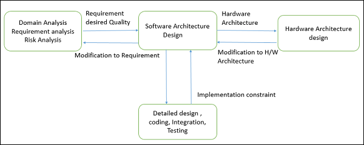

# 1 介绍

- [1 介绍](#1-%E4%BB%8B%E7%BB%8D)
  - [1.1 软件架构](#11-%E8%BD%AF%E4%BB%B6%E6%9E%B6%E6%9E%84)
  - [1.2 软件设计](#12-%E8%BD%AF%E4%BB%B6%E8%AE%BE%E8%AE%A1)
  - [1.3 架构目标](#13-%E6%9E%B6%E6%9E%84%E7%9B%AE%E6%A0%87)
  - [1.4 软件架构的角色](#14-%E8%BD%AF%E4%BB%B6%E6%9E%B6%E6%9E%84%E7%9A%84%E8%A7%92%E8%89%B2)
  - [1.5 质量参数](#15-%E8%B4%A8%E9%87%8F%E5%8F%82%E6%95%B0)
  - [1.6 质量情景](#16-%E8%B4%A8%E9%87%8F%E6%83%85%E6%99%AF)

软件架构和设计有关的元素如下图

## 1.1 软件架构

- 软件架构描述了一个系统的蓝图
- 定义了一个结构化的解决方案来满足所有的技术和操作需求，同时优化一些常见的质量参数(比如性能、安全性)
- 包含一系列和软件开发组织有关的重要决策，而且每个决定对于最终产品的质量、可维护性、性能有重要的影响。决策包括
  - 组成系统的结构化元素和元素接口的选取
  - 上述元素之间合作的行为
  - 将上述结构化、指定行为的元素组成一个大的子系统
  - 和商业目标一致的架构决策
  - 指导组织的架构风格

## 1.2 软件设计

- 软件设计提供了一个设计计划，此计划描述了一个系统的元素，以及元素之间如何组合并一起工作来满足系统的需求
- 设计计划的目标包括
  - 商定系统需求，设置对客户、市场和管理人事的期望
  - 作为开发过程中的一个蓝图
  - 指导执行任务，包括详细设计、编码、集成、测试
- 软件设计在详细设计、编码、继承和测试之前，在领域分析、需求分析和风险分析之后
  

## 1.3 架构目标

- 架构目标
  - 主要目标是识别影响应用结构的需求
  - 降低和创建技术解决方案有关的商业风险，并且连接商业和技术需求
  - 展示系统结构，但是隐藏实现细节
  - 实现所有的用例(use-case)和情景
  - 设法满足不同利益共享者的需求
  - 简化所有者的目标，改善组织的市场定位
  - 改善系统提供的质量和功能
  - 改善外部对于组织或系统的信心
- 软件架构仍然是软件工程领域刚出现的准则。因此有一些限制
  - 缺少工具和标准化的方式呈现架构
  - 缺少分析方法来预测架构是否会落实实现需求
  - 缺少对从架构设计到软件设计重要性的认知
  - 缺少对软件架角色和利益共享者之间缺乏沟通的理解
  - 缺少对设计流程、设计经验和设计评估的理解

## 1.4 软件架构的角色

- 软件架构提供了解决方案，技术团队可以用来创建和设计整个应用
- 相关的专业知识包括
  - 设计：软件设计的知识、方法和途径；领导开发团队；审查和权衡设计建议
  - 领域：帮助确认需求，确保完整性和一致性
  - 技术：熟悉已有技术，整合选择编程语言、框架、平台和数据库等
  - 方法论：在软件开发生命周期可采用的软件开发方法，选择合适的方法帮助整个团队
  - 隐藏的角色：促进团队成员间的技术工作，强化团队的信任关系；分享知识，有很多经验的信息专家；保护团队免受外界干预和分心
  - 交付的产品：
    - 一个清楚、完整、一致且可达到的功能目标
    - 对于系统的一个功能性描述，至少有两个层面的分解
    - 对于该系统的一些概念
    - 系统的设计层面，至少有两层分解
    - 对于时间、操作人员属性、实现和操作计划的标注
    - 一个文件或流程，用于确保功能性的分解，以及接口的形式

## 1.5 质量参数

- 质量参数可分为
  - 静态质量参数：反映了系统和组织的结构，与架构、设计和源码直接相关
    - 对终端用户不可见，但是影响了开发和维护成本
    - 比如模块化性、可测试性、可维护性
  - 动态质量参数：反映了系统执行期间的行为
    - 与系统的架构、设计、源码、配置、部署参数、环境和平台直接相关
    - 对于终端用户可见，且存在于运行时
    - 比如吞吐率、健壮性、可伸缩性

## 1.6 质量情景

一个软件架构必须有的公共的质量参数

- 设计质量
  - 概念完整性：定义整个设计的一致性和条理性，包括组件或模块的设计方式
  - 可维护性：在一定程度上可修改
  - 可复用性：组件或紫刺探对其他应用可用
- 运行时质量
  - 互用性：一个或多个系统与外部系统通过通信和交换信息正确操作，外部系统由外部组成来写或运行
  - 易管理性：系统管理员容易管理系统
  - 可靠性：系统维持操作的时间
  - 可伸缩性：可以不影响系统性能时解决负载增加的问题，或是易于扩大规模
  - 安全性：可以阻止设计之外的恶意或者偶然的使用
  - 性能：表明在给定的时间间隔，系统对于所有动作的反应
  - 可用性：定义系统正常工作的时间比例
- 系统质量
  - 可支持性：当工作不正确时，可以提供有用的信息便于定位和解决问题
  - 可测试性：容易为系统和系统组件创建测试标准
- 用户质量
  - 易用性：定义应用如何较好地满足用户和消费者的需求
- 架构质量
  - 正确性：系统满足所有需求
- 非运行时质量
  - 可移植性：使得系统可以在不同的电脑环境运行
  - 完整性：使得单独开发的系统组件一起正常工作
  - 易修改性：软件系统易修改
- 商业质量参数
  - 花费和日程表：系统的花费，考虑市场时间、期望的工程时间、已有项目的利用
  - 市场性：系统的使用，考虑到市场竞争
