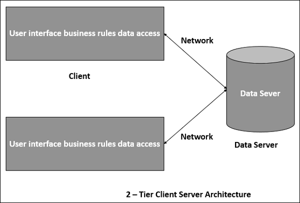
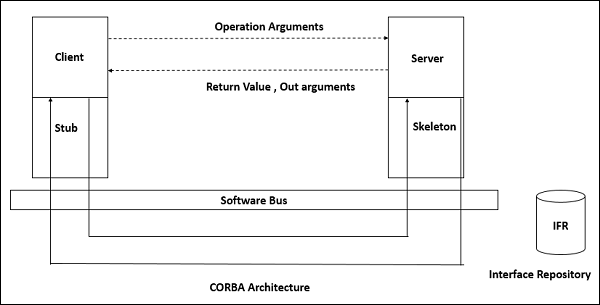
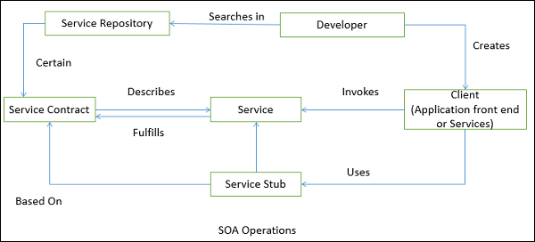

# 9 分布式架构

- [9 分布式架构](#9-%E5%88%86%E5%B8%83%E5%BC%8F%E6%9E%B6%E6%9E%84)
  - [9.1 客户端服务端架构](#91-%E5%AE%A2%E6%88%B7%E7%AB%AF%E6%9C%8D%E5%8A%A1%E7%AB%AF%E6%9E%B6%E6%9E%84)
  - [9.2 多层架构](#92-%E5%A4%9A%E5%B1%82%E6%9E%B6%E6%9E%84)
  - [9.3 代理(Broker)架构](#93-%E4%BB%A3%E7%90%86broker%E6%9E%B6%E6%9E%84)
  - [9.4 面向服务的架构](#94-%E9%9D%A2%E5%90%91%E6%9C%8D%E5%8A%A1%E7%9A%84%E6%9E%B6%E6%9E%84)

- 中间件是分布式架构的基础结构。如图
- 分布式架构侧重于透明性、可靠性、可用性
- 关于透明性
  - 访问：隐藏访问资源的方式和数据平台的差异
  - 位置：隐藏资源的位置
  - 技术：对用户隐藏不同的技术，比如编程语言，操作系统
  - 迁移/重定位：隐藏使用时可能被移动到另一个位置的资源
  - 重复：隐藏可能复制在其他地方的资源
  - 并发：隐藏可能与其他用户共享的资源
  - 错误：对用户隐藏资源的错误和复原
  - 一致性：隐藏资源或软件是在内存或磁盘
- 优点：资源共享、开放性、并发、易扩展、容错性
- 缺点：复杂度、安全性降低、不易管理、不可预测

## 9.1 客户端服务端架构

- 如图
- 服务端提供服务，客户端使用这些服务
- 服务端不需要知道客户端，客户端需要知道服务端的身份
- 优点：分离用户接口展示和业务逻辑处理；服务组件复用，可能并发；简化设计和开发；易迁移或整合已有应用到分布式环境；多客户端访问一个高性能的服务可充分利用资源
- 缺点：缺少异构架构处理需求改变；安全问题；服务的可用性和扩展性降低

## 9.2 多层架构

- 如图
- 一般分为三层：展示层、应用层(也叫业务逻辑层、逻辑层、中间层)和数据层
  - 如图
- 优点：易管理、性能好；可复用，易扩展；多线程支持，降低网络负载；易维护，灵活性高
- 缺点：不易测试，缺少测试工具；可靠性和可用性对服务要求更高

## 9.3 代理(Broker)架构

- 中间件架构，在分布式计算中使用，协调注册的服务端和客户端之间的通信
- 对象之间通信使用中间件系统，叫做对象请求代理(系统总线)
  - 客户端和服务端不会直接交互。它们各自直接连接自己的代理，和 mediator-broker 通信
  - 服务端通过注册和发布接口到 broker 提供服务，客户端可以通过 broker 静态或动态查找请求服务
  - 通用对象请求代理架构CORBA(CORBA, Common Object Request Broker Architecture)是一个实现的较好的例子
- 组件包括
  - broker：负责协调通信，比如转发和分发结果和异常
    - 协商服务请求，定位一个合适的服务端并发送请求，发送回复给客户端
    - 维护服务端的注册信息，包括它们的功能、服务和定位信息
    - 给客户端发送请求和服务端发送回复提供 API
  - stub：静态编译阶段生成，部署在客户端，作为客户端的代理
    - 作为客户端和 broker 的协调者
    - 在协议层隐藏进程间通信(IPC, inter-process communication)
    - 整合参数值，分割服务端返回的结果
  - skeleton：服务端接口编译生成，部署在服务端，作为服务端的代理
    - 封装了底层特定系统的网络函数，提供高级的 API 来协调服务端和 broker
    - 接收请求，解包请求，分割方法参数，调用合适的服务，发送结果，发送给客户端
  - bridge：基于不同的通信协议连接两个不同的网络，协调不同的 broker
    - 可选组件，隐藏两个 broker 互相操作的实现细节
- 如图
- CORBA 是针对对象请求代理的国际化标准——一个管理分布式对象通信的中间件
  - 如图

## 9.4 面向服务的架构

- 如图
- 面向服务的架构(SOA, service-oriented architecture)是一个客户端/服务端设计，支持业务驱动
  - 应用包含软件服务端和软件服务消费者
  - 服务之间的连接通过通用的基于消息的协议(比如 SOAP 网络服务协议)，可以在服务之间发送请求和回复
- 特点：分布式部署；可组合性；互用性；复用性
- SOA 操作如图
- 优点：
  - 低耦合，可以充分利用已有的服务资源，无关平台和技术限制
  - 无状态，每个服务组件和其他服务相互独立
  - 只要不改变接口，修改服务的实现不影响其他服务
  - 客户端和服务端可以访问其他服务，无关平台、技术、生产商、语言实现
  - 资产和服务的复用性，只要知道公共接口就可以使用
  - 在时间和花费上更有效
  - 提高了可扩展性，为系统提高标准连接
  - 易整合，改善了内部互操作性
