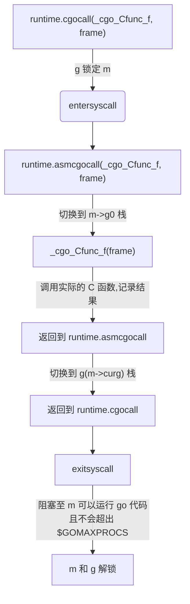

# C 代码和 goroutine 调度

原文 [C code and goroutine scheduling](https://stackoverflow.com/questions/28354141/c-code-and-goroutine-scheduling)

## 问题

从 goroutine 中调用 C 代码时，是否影响其他 goroutine 的调度？我知道如果在 Erlang 中调用 NIF，会阻塞其他 (Erlang) 进程，直至函数返回。在 Golang 是否如此？C 代码是否阻塞 goroutine 调度器？

## 答案

从 Go 代码调用 C 函数不会阻塞其他 goroutine 运行。

但是确实对调度器有影响。运行 C 函数的 goroutine 不必计入 [GOMAXPROCS](http://golang.org/pkg/runtime/#GOMAXPROCS) 限制。它会从 GOMAXPROCS 开始计数，但是如果 sysmon 后台 goroutine 运行时，C 函数阻塞超过 20us，那么如果有另一个准备运行的 goroutine，则将允许调度器程序启动另一个 goroutine。这些详细信息取决于特定的 Go 版本，并且可能会更改。

在内部，Go 使用 **G** 表示 goroutine，**M** 表示机器(线程)，**P** 表示处理器。goroutine 运行在处理器上，处理器运行在机器上。

根据[源码文档](https://github.com/golang/go)，从 G 调用 C 函数的工作方式如下：

```go
// /usr/local/go/src/runtime/cgocall.go

// Cgo call and callback support.
//
// To call into the C function f from Go, the cgo-generated code calls
// runtime.cgocall(_cgo_Cfunc_f, frame), where _cgo_Cfunc_f is a
// gcc-compiled function written by cgo.
//
// runtime.cgocall (below) locks g to m, calls entersyscall
// so as not to block other goroutines or the garbage collector,
// and then calls runtime.asmcgocall(_cgo_Cfunc_f, frame).
//
// runtime.asmcgocall (in asm_$GOARCH.s) switches to the m->g0 stack
// (assumed to be an operating system-allocated stack, so safe to run
// gcc-compiled code on) and calls _cgo_Cfunc_f(frame).
//
// _cgo_Cfunc_f invokes the actual C function f with arguments
// taken from the frame structure, records the results in the frame,
// and returns to runtime.asmcgocall.
//
// After it regains control, runtime.asmcgocall switches back to the
// original g (m->curg)'s stack and returns to runtime.cgocall.
//
// After it regains control, runtime.cgocall calls exitsyscall, which blocks
// until this m can run Go code without violating the $GOMAXPROCS limit,
// and then unlocks g from m.
```

为了从 Go 调用 C 函数 `f`，cgo 生成的代码调用 `runtime.cgocall(_cgo_Cfunc_f, frame)`，其中 `_cgo_Cfunc_f` 是 gcc 编译的函数，由 cgo 编写。

`runtime.cgocall` (下面)将 `g` 锁定到 `m`，调用 `entersyscall` 以免阻塞其他 goroutine 或垃圾回收器，然后调用 `runtime.asmcgocall(_cgo_Cfunc_f, frame)`。

`runtime.asmcgocall` (在 `asm_$GOARCH.s` 中)切换到 `m->g0` 栈(假定是操作系统分配的栈，因此可以安全地运行 gcc 编译的代码)，然后调用 `_cgo_Cfunc_f(frame)`。

`_cgo_Cfunc_f` 调用实际的 C 函数 `f`，传递取自 `frame` 结构体，将结果记录到 `frame`，然后返回到 `runtime.asmcgocall`。

`runtime.asmcgocall` 重新获得控制权后，切回原始 `g(m->curg)` 的栈，并返回到 `runtime.cgocall`。

`runtime.cgocall` 重新获得控制权后，调用 `exitsyscall`，该函数一直阻塞到此 `m` 可以运行 Go 代码且不会违反 `$GOMAXPROCS` 限制，然后从 `m` 解锁 `g`。



`entersyscall` 本质上告诉运行是此 goroutine 现在由“外部”控制，就想我们对内核调用 `syscall` 一样，另一个可能有用的位是，经 `g` 锁定到 `m`(将 cgo 调用的 goroutine 锁定到 OS 线程)使运行时可以分配新的 OS 现象(理论上可以超过 `GOMAXPROCS`)。

官方文档没有说明“调用 C 函数不会阻塞其他 goroutine”，是因为这是自然应该的工作方式。仅当它不能以这种方式工作时才需要对此进行记录。
