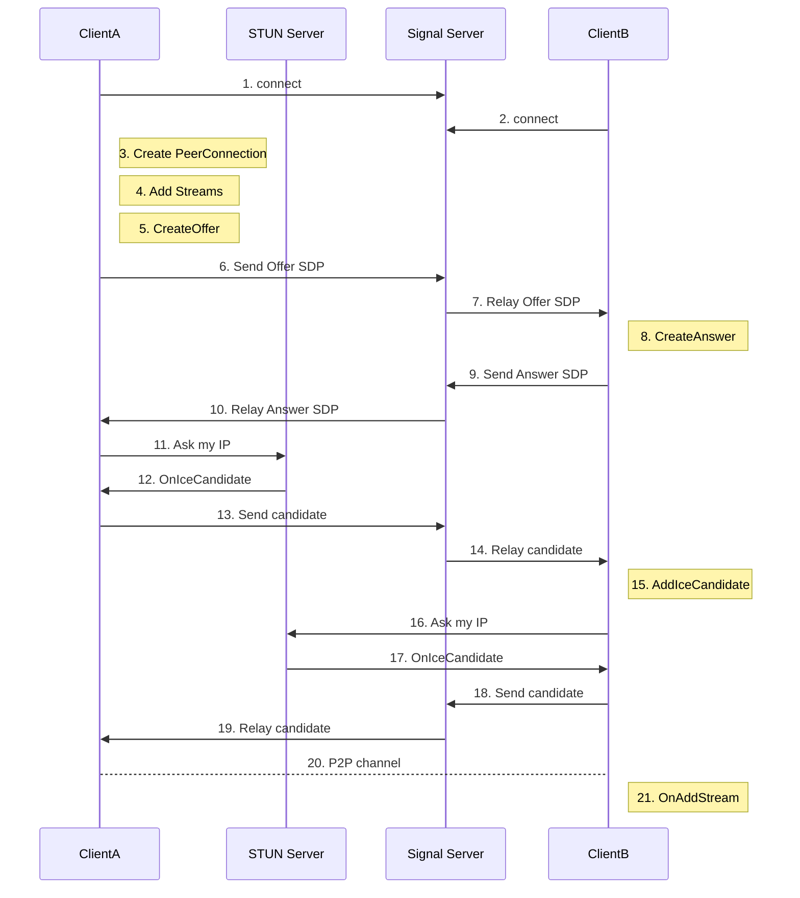
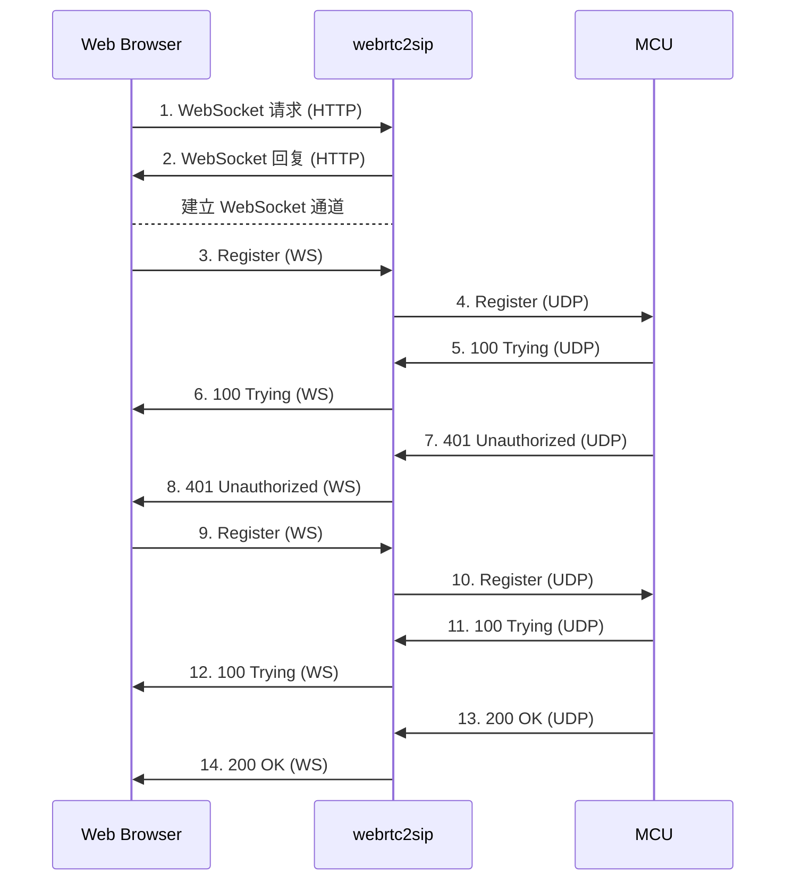
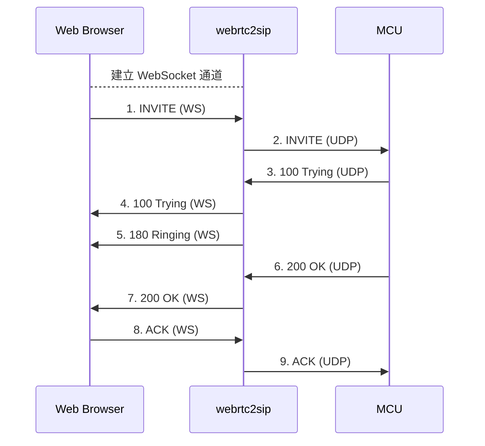
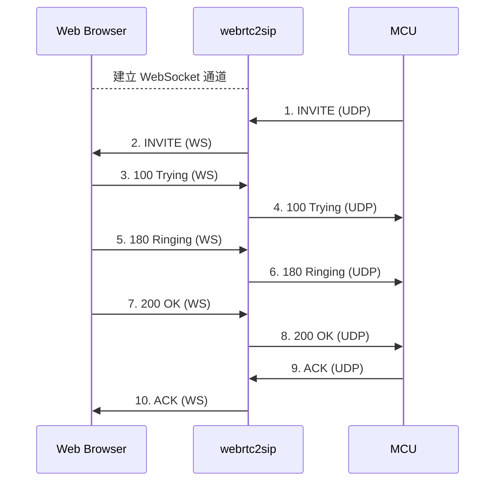
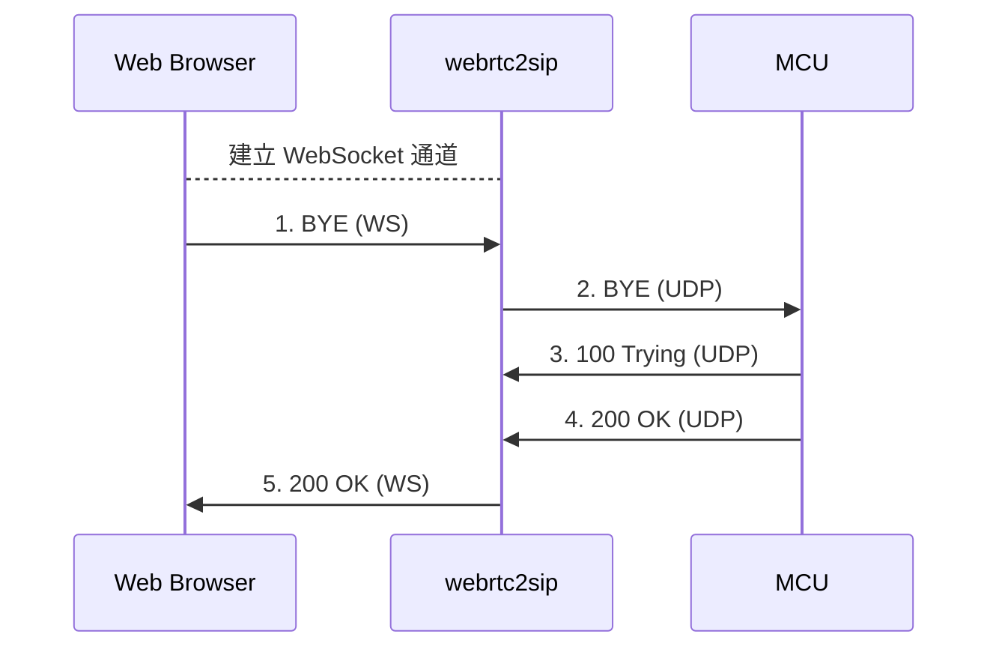
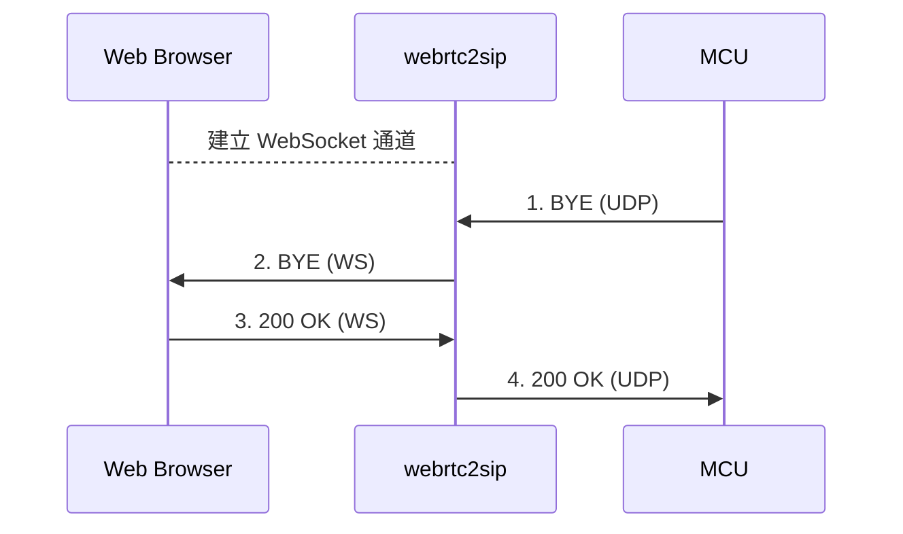

# sipML5

- [sipML5](#sipml5)
  - [1 术语](#1-%E6%9C%AF%E8%AF%AD)
  - [2 简介](#2-%E7%AE%80%E4%BB%8B)
  - [3 sipML5 源码分析](#3-sipml5-%E6%BA%90%E7%A0%81%E5%88%86%E6%9E%90)
    - [3.1 注册](#31-%E6%B3%A8%E5%86%8C)
      - [3.1.1 建立 WebSocket 连接](#311-%E5%BB%BA%E7%AB%8B-websocket-%E8%BF%9E%E6%8E%A5)
      - [3.1.2 生成 SIP 头](#312-%E7%94%9F%E6%88%90-sip-%E5%A4%B4)
      - [3.1.3 发送注册的 SIP 信息(用 session 管理)](#313-%E5%8F%91%E9%80%81%E6%B3%A8%E5%86%8C%E7%9A%84-sip-%E4%BF%A1%E6%81%AF%E7%94%A8-session-%E7%AE%A1%E7%90%86)
      - [3.1.4 收到 200 OK](#314-%E6%94%B6%E5%88%B0-200-ok)
    - [3.2 呼叫](#32-%E5%91%BC%E5%8F%AB)
      - [3.2.1 呼叫过程中的 SDP 与流](#321-%E5%91%BC%E5%8F%AB%E8%BF%87%E7%A8%8B%E4%B8%AD%E7%9A%84-sdp-%E4%B8%8E%E6%B5%81)
      - [3.2.2 双向(默认)](#322-%E5%8F%8C%E5%90%91%E9%BB%98%E8%AE%A4)
      - [3.2.3 单向(可扩充)](#323-%E5%8D%95%E5%90%91%E5%8F%AF%E6%89%A9%E5%85%85)
  - [4 API](#4-api)
    - [4.1 类图](#41-%E7%B1%BB%E5%9B%BE)
    - [4.2 初始化引擎](#42-%E5%88%9D%E5%A7%8B%E5%8C%96%E5%BC%95%E6%93%8E)
    - [4.3 创建 SIP 栈](#43-%E5%88%9B%E5%BB%BA-sip-%E6%A0%88)
    - [4.4 注册/登录](#44-%E6%B3%A8%E5%86%8C%E7%99%BB%E5%BD%95)
    - [4.5 创建/接收音频/视频会话](#45-%E5%88%9B%E5%BB%BA%E6%8E%A5%E6%94%B6%E9%9F%B3%E9%A2%91%E8%A7%86%E9%A2%91%E4%BC%9A%E8%AF%9D)
    - [4.6 共享屏幕/桌面](#46-%E5%85%B1%E4%BA%AB%E5%B1%8F%E5%B9%95%E6%A1%8C%E9%9D%A2)
    - [4.7 发送/接收 SIP MESSAGE(类似 SMS)](#47-%E5%8F%91%E9%80%81%E6%8E%A5%E6%94%B6-sip-message%E7%B1%BB%E4%BC%BC-sms)
    - [4.8 发布存在状态](#48-%E5%8F%91%E5%B8%83%E5%AD%98%E5%9C%A8%E7%8A%B6%E6%80%81)
    - [4.9 订阅存在状态](#49-%E8%AE%A2%E9%98%85%E5%AD%98%E5%9C%A8%E7%8A%B6%E6%80%81)
  - [5 浏览器、webrtc2sip 与服务器的信令交互流程](#5-%E6%B5%8F%E8%A7%88%E5%99%A8webrtc2sip-%E4%B8%8E%E6%9C%8D%E5%8A%A1%E5%99%A8%E7%9A%84%E4%BF%A1%E4%BB%A4%E4%BA%A4%E4%BA%92%E6%B5%81%E7%A8%8B)
    - [5.1 注册流程](#51-%E6%B3%A8%E5%86%8C%E6%B5%81%E7%A8%8B)
    - [5.2 主叫流程](#52-%E4%B8%BB%E5%8F%AB%E6%B5%81%E7%A8%8B)
    - [5.3 被叫流程](#53-%E8%A2%AB%E5%8F%AB%E6%B5%81%E7%A8%8B)
    - [5.4 终端挂断流程](#54-%E7%BB%88%E7%AB%AF%E6%8C%82%E6%96%AD%E6%B5%81%E7%A8%8B)
    - [5.5 MCU 挂断流程](#55-mcu-%E6%8C%82%E6%96%AD%E6%B5%81%E7%A8%8B)
    - [5.6 注销流程](#56-%E6%B3%A8%E9%94%80%E6%B5%81%E7%A8%8B)
  - [6 问题](#6-%E9%97%AE%E9%A2%98)
    - [6.1 安全机制](#61-%E5%AE%89%E5%85%A8%E6%9C%BA%E5%88%B6)
    - [6.2 信令兼容](#62-%E4%BF%A1%E4%BB%A4%E5%85%BC%E5%AE%B9)
  - [7 参考](#7-%E5%8F%82%E8%80%83)

## 1 术语

| 缩写 | 定义 | 术语 |
| --- | --- | --- |
| RTC | real-time communication |实时通信 |
| SIP | session initiation protocol | 会话初始协议 |
| SMS | short message service | 短信服务 |
| ICE | Internet communication engine | 互联网通讯引擎 |
| DTLS | datagram transport layer security | 数据报传输层安全 |
| SRTP| secure real-time transport protocol | 安全实时传输协议 |
| WSS | secure websocket| - |
| MCU | multi conference unit | - |
| NGN | next generation network | 下一代网络 |

## 2 简介

- sipML5 是开源的 HTML5 SIP 客户端
- 媒体栈依赖于 WebRTC，建议使用 Chrome 和 Firefox Nightly 测试
  - Safari，Firefox，Opera 和 IE 需要安装 [webrtc-everywhere](https://github.com/sarandogou/webrtc-everywhere) 扩展
  - 主要功能包括生成 SDP、采集本机摄像头和麦克风的音视频数据、传输媒体数据、处理接收到的音视频数据等
- SIP 和 SDP 栈由 JavaScript 实现，网络传输使用 WebSocket
  - SIP 协议栈：生成和解析 SIP 信令
  - SDP 协议栈：生成和解析 SDP 信令

## 3 sipML5 源码分析

- 主要包括 3 个模块
  - media：主要是会话管理和媒体处理(包括 SDP 的生成和修改)
  - SDP：实现 SDP 协议栈，包括 SDP 的修改和解析函数
  - SIP：实现 SIP 协议栈(包括 SIP 的修改和解析函数)和与多媒体网关进行信令交互(WebSocket)
- 一般而言，需要进行功能扩充和修改的地方包括：
  - 界面入口：call.htm
  - 媒体处理模块：tmedia_session_jsep.js
  - WebSocket 发送和接收的数据：tsip_transport.js

### 3.1 注册

- 在生成 SIP 头文件时进行修改和添加
- 如果收到的 SIP 协议格式不支持，将收到的进行修改
- 将发出的 SIP 协议进行修改

#### 3.1.1 建立 WebSocket 连接

#### 3.1.2 生成 SIP 头

```js
// call.htm: function sipRegister()
// create SIP stack
oSipStack = new SIPml.Stack({
    realm: txtRealm.value,
    impi: txtPrivateIdentity.value,
    impu: txtPublicIdentity.value,
    password: txtPassword.value,
    display_name: txtDisplayName.value,
    websocket_proxy_url: (window.localStorage ? window.localStorage.getItem('org.doubango.expert.websocket_server_url') : null),
    outbound_proxy_url: (window.localStorage ? window.localStorage.getItem('org.doubango.expert.sip_outboundproxy_url') : null),
    ice_servers: (window.localStorage ? window.localStorage.getItem('org.doubango.expert.ice_servers') : null),
    enable_rtcweb_breaker: (window.localStorage ? window.localStorage.getItem('org.doubango.expert.enable_rtcweb_breaker') == "true" : false),
    events_listener: { events: '*', listener: onSipEventStack },
    enable_early_ims: (window.localStorage ? window.localStorage.getItem('org.doubango.expert.disable_early_ims') != "true" : true), // Must be true unless you're using a real IMS network
    enable_media_stream_cache: (window.localStorage ? window.localStorage.getItem('org.doubango.expert.enable_media_caching') == "true" : false),
    bandwidth: (window.localStorage ? tsk_string_to_object(window.localStorage.getItem('org.doubango.expert.bandwidth')) : null), // could be redefined a session-level
    video_size: (window.localStorage ? tsk_string_to_object(window.localStorage.getItem('org.doubango.expert.video_size')) : null), // could be redefined a session-level
    sip_headers: [
            { name: 'User-Agent', value: 'IM-client/OMA1.0 sipML5-v1.2016.03.04' },
            { name: 'Organization', value: 'Doubango Telecom' }
    ]
}
```

#### 3.1.3 发送注册的 SIP 信息(用 session 管理)

```js
// src/tinySIP/src/transports/tsip_transport.js
tsip_transport.prototype.send = function (s_branch, o_message, s_dest_ip, i_dest_port) {
    var o_data = null;
    if (o_message.is_request() && (!o_message.is_ack() || (o_message.is_ack() && !o_message.o_hdr_firstVia)) && !o_message.is_cancel()) {
        this.message_addvia(s_branch, o_message); /* should be done before tsip_transport_o_message_update() which could use the Via header */
        this.message_update_aor(o_message); /* AoR */
        this.message_update(o_message); /* IPSec, SigComp, ... */
    }
    else if (o_message.is_response()) {
        /* AoR for responses which have a contact header (e.g. 183/200 INVITE) */
        if (o_message.o_hdr_Contact) {
            this.message_update_aor(o_message);
        }
        if (o_message.o_hdr_firstVia.i_rport == 0) {
            o_message.o_hdr_firstVia.i_rport = o_message.o_hdr_firstVia.i_port;
        }
    }

    o_data = o_message.toString();

    tsk_utils_log_info("SEND: " + o_data);

    return this.__send(o_data, o_data.length);
}
```

#### 3.1.4 收到 200 OK

```js
// src/tinySIP/src/transports/tsip_transport.js
function __tsip_transport_ws_onmessage(evt) {
    tsk_utils_log_info("__tsip_transport_ws_onmessage");

    var o_ragel_state = tsk_ragel_state_create();
    if(typeof(evt.data) == 'string'){
        tsk_ragel_state_init_str(o_ragel_state, evt.data);
    }
    else{
        tsk_ragel_state_init_ai(o_ragel_state, evt.data);
    }
    var o_message = tsip_message.prototype.Parse(o_ragel_state, true);

    if (o_message) {
        tsk_utils_log_info("recv=" + o_message);
        o_message.o_socket = this;
        return this.o_transport.get_layer().handle_incoming_message(o_message);
    }
    else {
        tsk_utils_log_error("Failed to parse message: " + evt.data);
        return -1;
    }
}
```

### 3.2 呼叫

- 下面关联文件主要是 `src/tinyMEDIA/src/tmedia_session_jsep.js`

#### 3.2.1 呼叫过程中的 SDP 与流



- Add Streams：添加本地流，对应函数`onGetUserMediaSuccess`
  - 如果本地不推流，则注释掉 `This.o_pc.addStream(o_stream);`
- `__get_lo`：生成 SDP，在`onGetUserMediaSuccess`调用`This.o_pc.createOffer`会发送 SDP
- `__set_ro`：获得远端 SDP 后在此函数处理
- `subscribe_stream_events`：接收远端发送的流，在此函数中调用`this.o_pc.onaddstream`

#### 3.2.2 双向(默认)

- 音频(默认)：直接发送带音频的 SDP
- 音视频(默认)：直接发送带音视频的 SDP
- 视频：验证可以扩充视频功能

#### 3.2.3 单向(可扩充)

- 音频：web 端对流只接收不发送，SDP 修改成 sendonly
- 音视频：web 端对流只接收不发送，SDP 修改成 sendonly
- 视频：验证可以扩充视频功能

## 4 API

```js
// initialize the engine, start the stack and make video call from bob to alice
SIPml.init(
    function(e){
        var stack =  new SIPml.Stack({realm: 'example.org', impi: 'bob', impu: 'sip:bob@example.org', password: 'mysecret',
            events_listener: { events: 'started', listener: function(e){
                    var callSession = stack.newSession('call-audiovideo', {
                            video_local: document.getElementById('video-local'),
                            video_remote: document.getElementById('video-remote'),
                            audio_remote: document.getElementById('audio-remote')
                        }
                    );
                    callSession.call('alice');
                }
            }
        });
        stack.start();
    }
);
```

### 4.1 类图


### 4.2 初始化引擎

```js
// initialize the media and signaling engines
var readyCallback = function(e){
    createSipStack(); // see next section
};
var errorCallback = function(e){
    console.error('Failed to initialize the engine: ' + e.message);
}
SIPml.init(readyCallback, errorCallback);
```

### 4.3 创建 SIP 栈

```js
// created before any attempt to make/receive calls, send messages or manage presence
var sipStack;
var eventsListener = function(e){
    if(e.type == 'started'){
        login();
    }
    else if(e.type == 'i_new_message'){ // incoming new SIP MESSAGE (SMS-like)
        acceptMessage(e);
    }
    else if(e.type == 'i_new_call'){ // incoming audio/video call
        acceptCall(e);
    }
}

function createSipStack(){
    sipStack = new SIPml.Stack({
            realm: 'example.org', // mandatory: domain name
            impi: 'bob', // mandatory: authorization name (IMS Private Identity)
            impu: 'sip:bob@example.org', // mandatory: valid SIP Uri (IMS Public Identity)
            password: 'mysecret', // optional
            display_name: 'Bob legend', // optional
            websocket_proxy_url: 'wss://sipml5.org:10062', // optional
            outbound_proxy_url: 'udp://example.org:5060', // optional
            enable_rtcweb_breaker: false, // optional
            events_listener: { events: '*', listener: eventsListener }, // optional: '*' means all events
            sip_headers: [ // optional
                { name: 'User-Agent', value: 'IM-client/OMA1.0 sipML5-v1.0.0.0' },
                { name: 'Organization', value: 'Doubango Telecom' }
            ]
        }
    );
}
sipStack.start(); // asynchronous function
```

### 4.4 注册/登录

```js
var registerSession;
var eventsListener = function(e){
    console.info('session event = ' + e.type);
    if(e.type == 'connected' && e.session == registerSession){
        makeCall();
        sendMessage();
        publishPresence();
        subscribePresence('johndoe'); // watch johndoe's presence status change
    }
}
var login = function(){
    registerSession = sipStack.newSession('register', {
        events_listener: { events: '*', listener: eventsListener } // optional: '*' means all events
    });
    registerSession.register();
}
```

### 4.5 创建/接收音频/视频会话

```js
var callSession;
var eventsListener = function(e){
    console.info('session event = ' + e.type);
}
var makeCall = function(){
    callSession = sipStack.newSession('call-audiovideo', {
        video_local: document.getElementById('video-local'),
        video_remote: document.getElementById('video-remote'),
        audio_remote: document.getElementById('audio-remote'),
        events_listener: { events: '*', listener: eventsListener } // optional: '*' means all events
    });
    callSession.call('johndoe');
}

// to accept incoming audio/video call
var acceptCall = function(e){
    e.newSession.accept(); // e.newSession.reject() to reject the call
}
```

### 4.6 共享屏幕/桌面

- 类比上述创建视频会话，区别在于会话类型(`call-screenshare`而不是`call-audiovideo`)
- 屏幕/桌面共享会话不包括音频流，所以在需要增加 SDP 的`m`类型来发送音频
- [关于浏览器设置](https://code.google.com/archive/p/sipml5/wikis/ScreenShare.wiki)

### 4.7 发送/接收 SIP MESSAGE(类似 SMS)

```js
var messageSession;
var eventsListener = function(e){
    console.info('session event = ' + e.type);
}
var sendMessage = function(){
    messageSession = sipStack.newSession('message', {
        events_listener: { events: '*', listener: eventsListener } // optional: '*' means all events
    });
    messageSession.send('johndoe', 'Pêche à la moule', 'text/plain;charset=utf-8');
}

// To accept incoming SIP MESSAGE
var acceptMessage = function(e){
    e.newSession.accept(); // e.newSession.reject(); to reject the message
    console.info('SMS-content = ' + e.getContentString() + ' and SMS-content-type = ' + e.getContentType());
}
```

### 4.8 发布存在状态

```js
var publishSession;
var eventsListener = function(e){
    console.info('session event = ' + e.type);
}
var publishPresence = function(){
    publishSession = sipStack.newSession('publish', {
        events_listener: { events: '*', listener: eventsListener } // optional: '*' means all events
    });
    var contentType = 'application/pidf+xml';
    var content = '<?xml version=\"1.0\" encoding=\"UTF-8\"?>\n' +
                    '<presence xmlns=\"urn:ietf:params:xml:ns:pidf\"\n' +
                        ' xmlns:im=\"urn:ietf:params:xml:ns:pidf:im\"' +
                        ' entity=\"sip:bob@example.com\">\n' +
                        '<tuple id=\"s8794\">\n' +
                        '<status>\n'+
                        '   <basic>open</basic>\n' +
                        '   <im:im>away</im:im>\n' +
                        '</status>\n' +
                        '<contact priority=\"0.8\">tel:+33600000000</contact>\n' +
                        '<note  xml:lang=\"fr\">Bonjour de Paris :)</note>\n' +
                        '</tuple>\n' +
                    '</presence>';

    // send the PUBLISH request
    publishSession.publish(content, contentType,{
        expires: 200,
        sip_caps: [
            { name: '+g.oma.sip-im' },
            { name: '+sip.ice' },
            { name: 'language', value: '\"en,fr\"' }
        ],
        sip_headers: [
            { name: 'Event', value: 'presence' },
            { name: 'Organization', value: 'Doubango Telecom' }
        ]
    });
}
```

### 4.9 订阅存在状态

```js
var subscribeSession;
var eventsListener = function(e){
    console.info('session event = ' + e.type);
    if(e.type == 'i_notify'){
        console.info('NOTIFY content = ' + e.getContentString());
        console.info('NOTIFY content-type = ' + e.getContentType());

        if (e.getContentType() == 'application/pidf+xml') {
            if (window.DOMParser) {
                var parser = new DOMParser();
                var xmlDoc = parser ? parser.parseFromString(e.getContentString(), "text/xml") : null;
                var presenceNode = xmlDoc ? xmlDoc.getElementsByTagName ("presence")[0] : null;
                if(presenceNode){
                    var entityUri = presenceNode.getAttribute ("entity");
                    var tupleNode = presenceNode.getElementsByTagName ("tuple")[0];
                    if(entityUri && tupleNode){
                        var statusNode = tupleNode.getElementsByTagName ("status")[0];
                        if(statusNode){
                            var basicNode = statusNode.getElementsByTagName ("basic")[0];
                            if(basicNode){
                                console.info('Presence notification: Uri = ' + entityUri + ' status = ' + basicNode.textContent);
                            }
                        }
                    }
                }
            }
        }
    }
}
var subscribePresence = function(to){
    subscribeSession = sipStack.newSession('subscribe', {
            expires: 200,
            events_listener: { events: '*', listener: eventsListener },
            sip_headers: [
                { name: 'Event', value: 'presence' }, // only notify for 'presence' events
                { name: 'Accept', value: 'application/pidf+xml' } // supported content types (COMMA-sparated)
            ],
            sip_caps: [
                { name: '+g.oma.sip-im', value: null },
                { name: '+audio', value: null },
                { name: 'language', value: '\"en,fr\"' }
            ]
        }
    );
    // start watching for entity's presence status (You may track event type 'connected' to be sure that the request has been accepted by the server)
    subscribeSession.subscribe(to);
}
```

## 5 浏览器、webrtc2sip 与服务器的信令交互流程

### 5.1 注册流程

- 浏览器和 webrtc2sip 基于 HTTP 协议进行一次握手，建立 WebSocket 通道
- 浏览器和 webrtc2sip 通过 WebSocket 通道进行 SIP 消息交互
- webrtc2sip 和 MCU 通过 UDP 进行 SIP 信息交互



### 5.2 主叫流程



### 5.3 被叫流程



### 5.4 终端挂断流程



### 5.5 MCU 挂断流程



### 5.6 注销流程

类比注册流程，但是 Contact 头域的 expires 设置为 0

## 6 问题

### 6.1 安全机制

- sipML5 基于 WebRTC 和 WebSocket，所以需要浏览器支持二者
- sipML5 在进行呼叫业务需要借助 WebRTC 访问本地摄像头，所以涉及到安全机制
  - 一般需要 https 部署访问
  - 如果没有 https，只能用 localhost 呼叫业务，或者用 Firefox 浏览器呼叫业务(Firefox 解除了 https 的安全机制)。但是 Firefox 不同版本对于 sipML5 的支持可能存在一些问题

### 6.2 信令兼容

- SDP 的描述需要兼容
  - webrtc2sip 中，INVITE 携带的 SDP 的 m 字段必须与 200 OK 所携带的 SDP 的 m 字段一一对应，否则建立会话但不会处理流
- webrtc2sip 与 SIP 网关的 SIP 信令存在差异，可在二者之间添加 SIP 代理
- webrtc2sip 中，如果 SDP 的端口对应 sendrecv，根据 RFC 规范，对于 SIP 客户端发过来的 RTP 和 RTCP 流会进行端口重设，之后 webrtc2sip将流推送到重新设置的端口，即把流推送到 SIP 客户端的发送端口，可注释重设端口的代码
- 播放音频没有声音：可能是音频采样率的原因，在代码中重设音频采样率
- 会话建立后，SIP 客户端可能 20s 后才显示画面：会话没完全建立时，I 帧已经发生但是未与 SIP 客户端成功建立会话导致 I 帧丢失，要在编码单元设置 I 帧间隔

## 7 参考

- [sipML5](https://www.doubango.org/sipml5/)
- [web浏览器无插件播放实时音视频技术---sipML5(二)](https://blog.csdn.net/chenhande1990chenhan/article/details/76144844)
- [web浏览器无插件播放实时音视频技术---webrtc2sip 与 第三方 SIP 网关对接(五)](https://blog.csdn.net/chenhande1990chenhan/article/details/76291174)